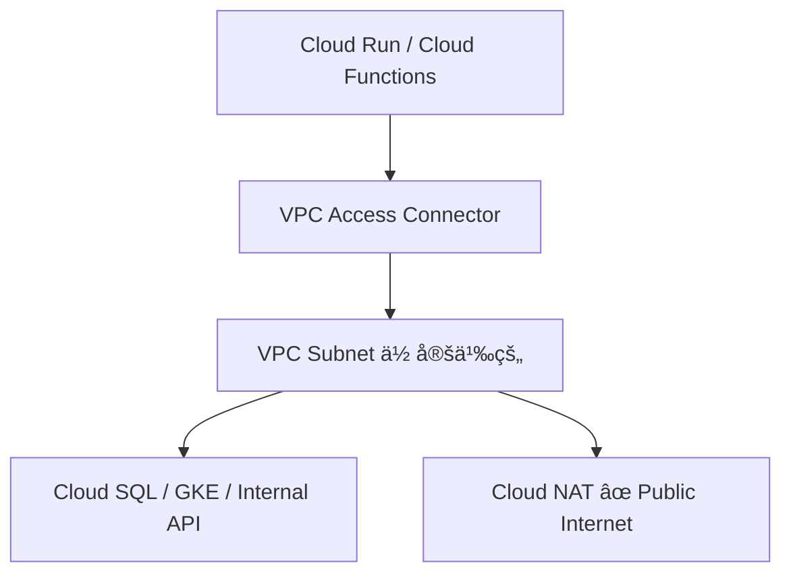
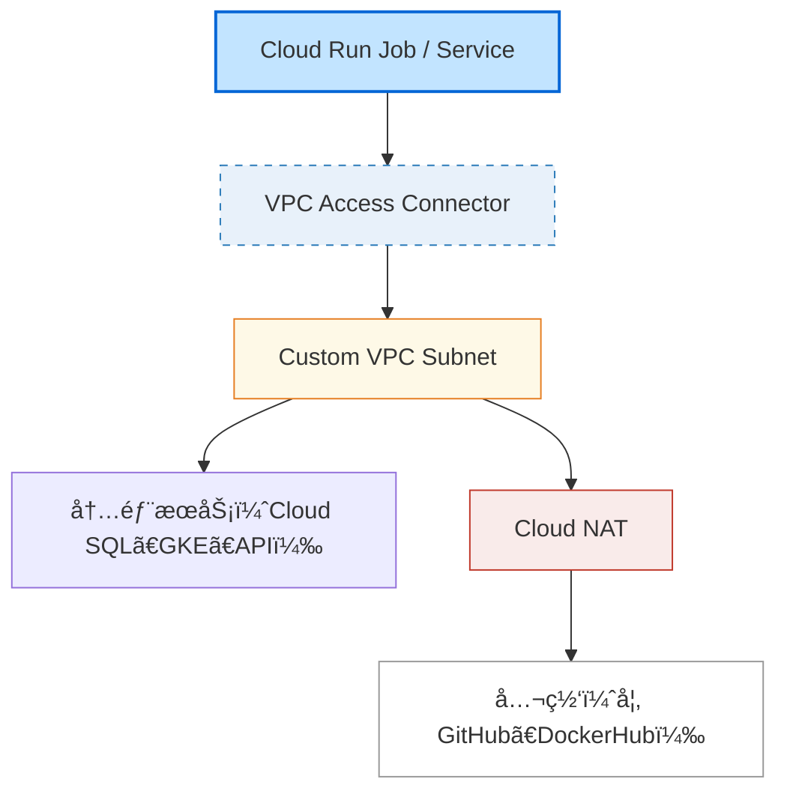

https://cloud.google.com/run/docs/configuring/vpc-connectors?hl=zh-cn#console
VPC Networks

如æœåˆ›å»º VPC Connector 之å 会在 vpc network 哪里看到一个 serverless vpc access 的比如å字为"$CONNECTOR_NAME" 网络 å¦å¤–会创建一个对应的 Firewall ?

当然，下é¢æ˜¯å¯¹ **Serverless VPC Access** 的详细解æ，适用äºä½ å¯¹ç½‘络有深入ç†è§£ï¼Œå¹¶æ¶‰åŠ GCP æ¶æ„设计。

---

# **📌 什么是 Serverless VPC Access？**

**Serverless VPC Access** 是 Google Cloud æ供的一ç§æ‰˜ç®¡å‹ç½‘络桥æ¥æœºåˆ¶ï¼Œ**用äºè®© Serverless æœåŠ¡ï¼ˆCloud Runã€Cloud Functionsã€App Engine）访问自定义 VPC 网络中的资æº**。

---

## **✅ ä¸ºä»€ä¹ˆéœ€è¦ Serverless VPC Access？**

Serverless 资æºï¼ˆå¦‚ Cloud Run）默认è¿è¡Œåœ¨ä¸€ä¸ª **Google 托管的ã€éš”离的网络ç¯å¢ƒ**，此ç¯å¢ƒä¸ä½ çš„ VPC 网络是分离的。

若你希望这些 Serverless æœåŠ¡è®¿é—®ï¼š

- 自建 Redisã€Cloud SQLã€Memcached 等数æ®åº“（è¿è¡Œåœ¨ VPC 内）
- 内部 HTTP APIã€ç§æœ‰ GKE æœåŠ¡
- 其他仅暴露在内部 IP 中的æœåŠ¡

å°±**必须通过一个桥æ¢è®¿é—®ä½ çš„ VPC**，这个桥æ¢å°±æ˜¯ **Serverless VPC Access Connector**。

---

## **🧠 本质ç†è§£**

ä½ å¯ä»¥æŠŠ **VPC Connector** ç†è§£ä¸ºï¼š

> 一个托管的ã€å¼¹æ€§æ‰©å±•çš„å°å‹ VPC å®ä¾‹æ± ï¼Œä¸“门用æ¥ä»£ç† Serverless æµé‡è¿›å…¥ä½ å®šä¹‰çš„ VPC。

它通过专用的 **VPC Peering** 建立隧é“è¿æ¥ä½ çš„ VPC，并转å‘请求。

---

## **ğŸ—ï¸ ç»„ä»¶æ¶æ„图**



---

## **âš™ï¸ å·¥ä½œæµç¨‹æ¦‚è¿°**

1.  你部署 Cloud Run 时使用å‚数：

    ```bash
    --vpc-connector=my-connector
    --vpc-egress=all-traffic
    ```

2.  请求会先å‘å¾€ Serverless VPC Connector。
3.  Connector 会将æµé‡é€šè¿‡ Peering 路由到你定义的 VPC å­ç½‘。
4.  如æœä½ è®¿é—®çš„是 VPC 资æºï¼Œè¿æ¥æˆåŠŸã€‚

    如æœä½ è®¿é—®çš„是公网资æºï¼ˆå¦‚ GitHubï¼‰ï¼Œéœ€è¦ Cloud NAT 或自建 Proxy。

---

## **🚦 VPC Egress 策略**

ä½ å¯ä»¥æ§åˆ¶ Cloud Run 的出站æµé‡ç±»å‹ï¼š

| **å‚æ•°** | **å«ä¹‰** | **用途** |
| :--- | :--- | :--- |
| private-ranges-only（默认） | ä»…ç§ç½‘ IP 通过 VPC Connector（10.x / 192.168.x） | 仅访问内部æœåŠ¡ |
| all-traffic | 所有出站都走 VPC Connector（包括公网） | 用äºå—æ§å‡ºå£ï¼Œé…åˆ Cloud NAT 出网 |

---

## **🚧 使用 Serverless VPC Connector çš„é™åˆ¶**

| **é™åˆ¶é¡¹** | **æè¿°** |
| :--- | :--- |
| ä¸æ”¯æŒå…¥ç«™ | ä¸èƒ½è®© VPC 中的其他资æºè®¿é—® Cloud Run（ä¸åå‘） |
| å¿…é¡»æ­é… NAT æ‰èƒ½è®¿é—®å…¬ç½‘ | 出站公网访问ä¸èƒ½ç›´æ¥åš SNAT，必须 Cloud NAT 或自建转å‘主机 |
| 固定网段消耗 | æ¯ä¸ª Connector 会分é…一个 /28 地å€æ®µï¼ˆå  16 个地å€ï¼‰ |
| å•åŒºåŸŸ | Connector 是区域性的，ä¸èƒ½è·¨ region 使用 |

---

## **📦 é…置示例**

### **步骤 1：创建 VPC Connector**

```bash
gcloud compute networks vpc-access connectors create vpc-conn-europe \
  --network=my-vpc \
  --region=europe-west2 \
  --subnet=my-subnet \
  --min-instances=2 \
  --max-instances=3 \
  --machine-type=e2-micro
```

> âš ï¸ æ³¨æ„ subnet 中必须预留至少 /28 çš„ IP 段

---

### **步骤 2：部署 Cloud Run Job / Service 使用 VPC Connector**

```bash
gcloud run jobs deploy my-job \
  --image=gcr.io/my-project/my-image \
  --vpc-connector=vpc-conn-europe \
  --vpc-egress=all-traffic \
  --region=europe-west2 \
  ...
```

---

## **📊 使用场景汇总**

| **å…¸å‹åœºæ™¯** | **是å¦é€‚用** |
| :--- | :--- |
| 访问 VPC 内部 Redisã€Cloud SQL | ✅ 强烈建议 |
| 访问ç§æœ‰ IP 地å€æ®µæœåŠ¡ | ✅ |
| Cloud Run 访问公网但需å—æ§å‡ºå£ | ✅（é…åˆ Cloud NAT） |
| VPC 中访问 Cloud Run（åå‘访问） | ⌠ä¸æ”¯æŒ |
| 自定义下一跳出å£ï¼ˆæ¯”如走 Proxy 主机） | ⌠ä¸æ”¯æŒï¼Œä»…æ”¯æŒ NAT |

---

## **✅ 总结**

| **特性** | **说æ˜** |
| :--- | :--- |
| ç±»å‹ | æ‰˜ç®¡èµ„æº |
| æ§åˆ¶ç²’度 | 适中，ä¸èƒ½è‡ªå®šä¹‰ä¸‹ä¸€è·³ |
| æ¨è用途 | 访问 VPC 内部æœåŠ¡ / æ§åˆ¶å‡ºç«™ |
| å¯æ­é… | --vpc-egress / Cloud NAT |
| é适用场景 | 高定制网络ã€èµ° proxyã€L7 æµé‡è¯†åˆ« |
| å…¼å®¹èµ„æº | Cloud Run（Service/Job）ã€Cloud Functionsã€App Engine（2nd gen） |

---

是å¦éœ€è¦æˆ‘用一张æµç¨‹å›¾å†æŠŠ Serverless VPC Access 的访问路径å¯è§†åŒ–？或者你想è¦ä¸€ä»½é…置模æ¿è‡ªåŠ¨åŒ–创建 VPC Connector + NAT 的脚本？

```mermaid
graph TD

    A[Cloud Run Job / Service] --> B[VPC Access Connector]

    B --> C[Custom VPC Subnet]

    C --> D1[内部æœåŠ¡ï¼ˆCloud SQLã€GKEã€API）]

    C --> D2[Cloud NAT]

    D2 --> E[公网（如 GitHubã€DockerHub）]


    style A fill:#c2e4ff,stroke:#0366d6,stroke-width:2px

    style B fill:#e8f1fa,stroke:#2b7bb9,stroke-dasharray: 5 5

    style C fill:#fef9e7,stroke:#e67e22

    style D2 fill:#f9ebea,stroke:#c0392b

    style E fill:#ffffff,stroke:#999
```

好的，以下是你需è¦çš„内容：

---

## **✅ Serverless VPC Access 使用æµç¨‹ï¼šMermaid æµç¨‹å›¾**



---

## **✅ 自动化脚本：创建 Serverless VPC Connector + Cloud NAT**

以下 Bash 脚本å¯å¸®åŠ©ä½ ä¸€æ­¥åˆ°ä½åˆ›å»ºå¹¶ç»‘定组件：

```bash
#!/bin/bash

# === å‚数定义 ===
PROJECT_ID="your-project-id"
REGION="europe-west2"
VPC_NAME="my-vpc"
SUBNET_NAME="my-subnet"
CONNECTOR_NAME="vpc-conn-europe"
ROUTER_NAME="nat-router"
NAT_NAME="nat-config"

# 切æ¢é¡¹ç›®
gcloud config set project "$PROJECT_ID"

# 1. 创建 VPC（如已存在å¯è·³è¿‡ï¼‰
gcloud compute networks create "$VPC_NAME" \
  --subnet-mode=custom || echo "VPC 已存在"

# 2. 创建å­ç½‘（如已存在å¯è·³è¿‡ï¼‰
gcloud compute networks subnets create "$SUBNET_NAME" \
  --network="$VPC_NAME" \
  --range=10.10.0.0/24 \
  --region="$REGION" || echo "å­ç½‘已存在"

# 3. 创建 VPC Connector（Serverless 使用）
gcloud compute networks vpc-access connectors create "$CONNECTOR_NAME" \
  --network="$VPC_NAME" \
  --region="$REGION" \
  --subnet="$SUBNET_NAME" \
  --min-instances=2 \
  --max-instances=3 \
  --machine-type=e2-micro

# 4. 创建 Cloud Router（NAT 用）
gcloud compute routers create "$ROUTER_NAME" \
  --network="$VPC_NAME" \
  --region="$REGION" || echo "Router 已存在"

# 5. 创建 Cloud NAT（å…许出公网）
gcloud compute routers nats create "$NAT_NAME" \
  --router="$ROUTER_NAME" \
  --region="$REGION" \
  --auto-allocate-nat-external-ips \
  --nat-all-subnet-ip-ranges \
  --enable-logging
```

---

## **✅ Cloud Run Job 示例部署（使用 VPC Connector）**

```bash
gcloud run jobs deploy my-job \
  --image=gcr.io/$PROJECT_ID/my-image \
  --region=$REGION \
  --vpc-connector=$CONNECTOR_NAME \
  --vpc-egress=all-traffic \
  --memory=512Mi \
  --cpu=1 \
  --task-timeout=5m \
  --max-retries=3 \
  --service-account=my-sa@$PROJECT_ID.iam.gserviceaccount.com
```

---

## **📌 å°è´´å£«**

- æ¯ä¸ª VPC Connector éœ€è¦ /28 段 IP（建议 Subnet 留足空间）
- **Cloud NAT 必须存在**æ‰èƒ½è®¿é—®å…¬ç½‘资æºï¼ˆå¦‚ GitHub）
- 如æœä½ é…置了 Cloud SQL，请确ä¿å¯ç”¨ Cloud SQL Admin API 并使用 Cloud SQL IAM 代ç†

---

é常好的观察，你说得完全正确，我æ¥**详细解释 Serverless VPC Access Connector 创建å在 VPC 中的行为细节**，并补充 Terraform 的处ç†å»ºè®®ã€‚

---

## **✅ 创建 VPC Connector å会å‘生的事情**

### **1. 会在 VPC 中生æˆä¸€ä¸ªã€ŒServerless VPC Accessã€**

### **特殊æ¥å£ç½‘络**

当你执行：

```bash
gcloud compute networks vpc-access connectors create $CONNECTOR_NAME ...
```

GCP 会在你指定的 VPC 中自动创建一个 **Serverless VPC Access æ¥å…¥ç‚¹**，表ç°ä¸ºï¼š

- 在 **VPC é¡µé¢ > 网络æ¥å£** 会看到：
  - 一个标注为：serverless-vpc-access-connector
  - åç§°ç±»ä¼¼äº vpc-conn-europe，但类å‹æ ‡è®°ä¸º serverless
- 使用 gcloud compute networks vpc-access connectors describe å¯ä»¥è·å–å†…éƒ¨åˆ†é… IP 段

这相当äºä¸€ä¸ª **æ‰˜ç®¡å‹ ENI（弹性网络æ¥å£ï¼‰**，将 Serverless（如 Cloud Run Jobï¼‰ä¸ VPC æ¥ä¸Šã€‚

---

### **2. GCP 会自动为 Connector 创建一æ¡** 

### **Firewall 规则**

é常精确，你说得**完全正确**。在创建 **Serverless VPC Access Connector**ï¼ˆç”¨äº Cloud Run / Cloud Functions / Workflows）å：

---

## **✅ GCP 自动创建的** 

## **Firewall 规则是 EGRESS**

并ä¸æ˜¯ Ingress，这是一个**常被误解的点**，以下是完整说æ˜ï¼š

---

## **📌 å®é™…创建的是** 

## **Egress**

##  **æ–¹å‘ Firewall 规则：**

| **项目** | **内容** |
| :--- | :--- |
| **å称** | vpc-access-allow-${HASH}-egress（自动命å） |
| **网络** | 你指定的 --network |
| **æ–¹å‘** | EGRESS |
| **目标标签** | 无 |
| **目标 IP 范围** | 通常为 VPC 内部 IP 范围（或 0.0.0.0/0 若 Cloud NAT 被使用） |
| **æºæ ‡ç­¾/范围** | Connector å­ç½‘çš„ CIDR，比如 10.8.0.0/28 |
| **åè®®/端å£** | tcp:443（默认），å¯é€‰ tcp:all（å–å†³äº Connector 应用范围） |

---

## **✅ 为什么是 EGRESS 而ä¸æ˜¯ INGRESS？**

这是因为：

- Cloud Run Jobã€Cloud Functions å±äº **Serverless 资æº**，它们并ä¸è¿è¡Œåœ¨ä½ çš„ VPC 内部 VM 中。
- **当你使用 --vpc-connector å：**
  - **Serverless 资æºé€šè¿‡ Connector NAT æ¥å…¥ä½ çš„ VPC 并å‘é€æµé‡**（å³ä» connector å­ç½‘å‘é€ï¼‰
- 所以，**ä» VPC Connector çš„ IP 段 å‘èµ·çš„ Egress æµé‡ï¼Œå¿…须被å…许**

---

## **🔧 示例：自动创建的 EGRESS Firewall**

如æœä½ åœ¨æ§åˆ¶å°ä¸­æŸ¥çœ‹ï¼Œé€šå¸¸ä¼šçœ‹åˆ°ï¼š

```
Name:         vpc-access-allow-xxxxxxxx-egress
Direction:    EGRESS
Source Ranges: 10.8.0.0/28
Allowed:      tcp:443
Target:       all instances (unless filtered by tag)
```

---

## **✅ 如何用 Terraform æ¥ç®¡ï¼ˆæ¨è写æ˜ï¼‰**

```terraform
resource "google_compute_firewall" "allow_connector_egress" {
  name    = "allow-${var.connector_name}-egress"
  network = google_compute_network.vpc.name

  direction = "EGRESS"
  priority  = 1000

  destination_ranges = ["0.0.0.0/0"]
  source_ranges      = [var.connector_range]

  allowed {
    protocol = "tcp"
    ports    = ["443", "80"]
  }

  description = "Allow Serverless VPC Connector to access internet"
}
```

---

## **✅ å¯è§†åŒ–说æ˜**

```mermaid
graph TD
    A[Cloud Run Job] --> B[Serverless VPC Access Connector 10.8.0.0/28]
    B --> C[通过 EGRESS 规则访问 VPC]
    C --> D[NAT Gateway (Cloud Router + NAT)]
    D --> E[GitHub / Internet]
```

---

## **✅ 建议总结**

| **资æºç±»å‹** | **是å¦è‡ªåŠ¨åˆ›å»º** | **是å¦å»ºè®®ç”¨ Terraform 管ç†** | **åŸå› è¯´æ˜** |
| :--- | :--- | :--- | :--- |
| Serverless Connector | ✅ | ✅ | 方便版本æ§åˆ¶ |
| 自动 Egress Firewall 规则 | ✅ | ✅（建议替æ¢ï¼‰ | 精准æ§åˆ¶æµé‡ |
| Cloud NAT + Router | ⌠| ✅ | Connector 需ä¾èµ– |
| 自定义 Ingress Firewall | ⌠| 如需访问 VPC 资æºå¿…须加 | æ§åˆ¶ Serverless → VPC |

---

是å¦éœ€è¦æˆ‘补充一个完整的 Terraform æ¨¡å— + Cloud Run Job é…ç½® + Firewall 自定义æ¥ç®¡çš„最终模æ¿ï¼Ÿ