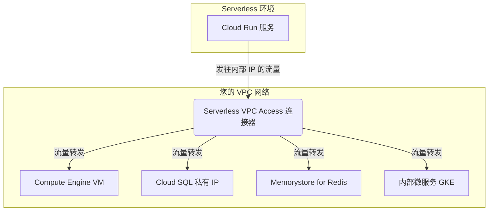

# Google Cloud Serverless VPC Access 详解

本文档旨在详细介绍 Google Cloud 的 Serverless VPC Access 服务，解释其核心功能、应用场景，并提供与 Cloud Run 结合使用的具体配置步骤。

## 1. 核心概念：什么是 Serverless VPC Access？

Serverless VPC Access 是一种 Google Cloud 服务，它在您的 VPC 网络和无服务器环境（如 Cloud Run, Cloud Functions, App Engine）之间建立一座“桥梁”。

从本质上讲，它允许您的无服务器应用能够像传统的虚拟机（VM）一样，使用内部 IP 地址访问 VPC 网络中的资源。如果没有 Serverless VPC Access，您的 Cloud Run 服务只能通过公共互联网访问其他资源，无法直接与 VPC 内部的服务进行私有通信。

这个“桥梁”本身是一个由 Google 管理的资源，称为 **连接器 (Connector)**。您需要在指定的 VPC 网络和区域中创建一个连接器，它会占用一个专有的 `/28` IP 地址范围。

## 2. 主要用途和应用场景

使用 Serverless VPC Access 的主要目的是实现安全、低延迟的私有网络通信。以下是几个典型的应用场景：

| 场景 | 描述 |
| :--- | :--- |
| **访问内部数据库** | Cloud Run 服务需要连接到部署在 Compute Engine 上的数据库（如 PostgreSQL, MySQL）或 Cloud SQL 的私有 IP 实例。 |
| **访问缓存服务** | 连接到 VPC 网络内的 Memorystore for Redis 或 Memcached 实例，以实现高速缓存。 |
| **调用内部微服务** | 一个 Cloud Run 服务需要通过内部 IP 调用另一个部署在 GKE 或 Compute Engine 上的微服务 API。 |
| **连接到本地数据中心** | 通过 Cloud VPN 或 Cloud Interconnect，Cloud Run 服务可以访问您在本地数据中心或其它云上的资源。 |
| **访问第三方 API** | 某些第三方服务要求请求必须来自一个固定的源 IP 地址范围，您可以通过 Cloud NAT 和 Serverless VPC Access 实现这一点。 |

## 3. 工作原理

当您的 Cloud Run 服务配置了 VPC 连接器后，所有发往内部 IP 地址（RFC 1918 范围）的流量都会被路由到该连接器。连接器实质上是在您的 VPC 网络中运行的一组由 Google 管理的虚拟机实例，它将来自 Cloud Run 的流量转发到 VPC 网络的目标资源。

以下是其工作流程的示意图：



## 4. 如何结合 Cloud Run 使用

将 Cloud Run 与 Serverless VPC Access 集成主要分为两步：创建连接器和配置 Cloud Run 服务。

### 第 1 步：创建 Serverless VPC Access 连接器

1.  **启用 API**
    首先，确保您的项目中已启用 Serverless VPC Access API。
    ```bash
    gcloud services enable vpcaccess.googleapis.com
    ```

2.  **创建连接器**
    您需要为连接器指定一个未使用的 `/28` IP 地址范围。这个范围不能与您 VPC 网络中的任何现有子网重叠。

    ```bash
    gcloud compute networks vpc-access connectors create [CONNECTOR_NAME] \
        --network [VPC_NETWORK_NAME] \
        --region [REGION] \
        --range "10.8.0.0/28"
    ```
    - `[CONNECTOR_NAME]`: 您的连接器名称，例如 `my-vpc-connector`。
    - `[VPC_NETWORK_NAME]`: 您的 VPC 网络名称，例如 `default`。
    - `[REGION]`: 区域，**必须**与您的 Cloud Run 服务所在的区域相同。
    - `--range`: 您为连接器分配的 `/28` IP 范围。

    **注意**: 创建连接器可能需要几分钟时间。

### 第 2 步：配置 Cloud Run 服务

在部署或更新 Cloud Run 服务时，通过参数指定要使用的 VPC 连接器。

1.  **部署新的 Cloud Run 服务**
    ```bash
    gcloud run deploy [SERVICE_NAME] \
        --image gcr.io/cloudrun/hello \
        --region [REGION] \
        --platform managed \
        --vpc-connector [CONNECTOR_NAME] \
        --vpc-egress "all-traffic"
    ```
    - `[SERVICE_NAME]`: 您的 Cloud Run 服务名称。
    - `[CONNECTOR_NAME]`: 您在第 1 步中创建的连接器名称。
    - `--vpc-egress`:
        - `private-ranges-only` (默认): 只有发往 RFC 1918 私有 IP 地址的流量会通过 VPC 连接器。
        - `all-traffic`: 所有出站流量（包括到公共互联网的流量）都将通过 VPC 连接器路由。这在需要通过 Cloud NAT 为出站流量分配静态 IP 时非常有用。

2.  **更新现有服务**
    ```bash
    gcloud run services update [SERVICE_NAME] \
        --region [REGION] \
        --vpc-connector [CONNECTOR_NAME] \
        --vpc-egress "all-traffic"
    ```

3.  **通过 YAML 文件配置**
    您也可以在服务的 `service.yaml` 文件中进行声明式配置：
    ```yaml
    apiVersion: serving.knative.dev/v1
    kind: Service
    metadata:
      name: [SERVICE_NAME]
    spec:
      template:
        metadata:
          annotations:
            run.googleapis.com/vpc-access-connector: [CONNECTOR_NAME]
            run.googleapis.com/vpc-access-egress: "all-traffic"
        spec:
          containers:
          - image: gcr.io/cloudrun/hello
    ```

## 5. 关键注意事项

- **区域匹配**: 连接器和使用它的 Cloud Run 服务必须位于同一区域。
- **IP 范围**: 为连接器分配的 `/28` IP 范围是专用的，不能用于其他任何资源。请提前规划好您的 IP 地址空间。
- **防火墙规则**: VPC 的防火墙规则同样适用于来自连接器的流量。您必须确保有适当的防火墙规则允许连接器（源 IP 范围为 `10.8.0.0/28`）访问目标资源（如数据库 VM 的 `3306` 端口）。
- **IAM 权限**:
    - 创建连接器需要 `compute.networkUser` 和 `vpcaccess.admin` 角色。
    - 在 Cloud Run 服务中配置连接器需要 `iam.serviceAccountUser` 角色。
- **成本**: Serverless VPC Access 连接器本身是收费的，费用取决于实例的大小和运行时间。请查阅官方定价文档了解详情。
- **性能**: 连接器的吞吐量受其机器类型影响，您可以在创建时指定 `--machine-type` 来调整性能。

通过以上步骤和说明，您可以成功地利用 Serverless VPC Access 将您的 Cloud Run 服务安全、高效地集成到您的 VPC 网络中。
