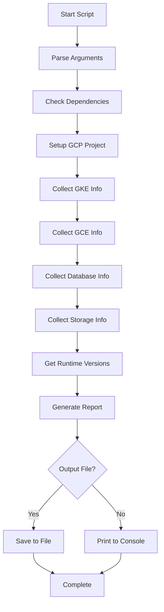

我先帮你把图片中的文字完整提取出来，然后再解释下这是在收集什么类型的数据，以及在你们的 GCP 平台场景下需要提供哪些类似的数据。

---

### **提取文本**

  

**What’s running right now?**

- Microservices (Platform as a Service)
    
- **Postgres DBs (Database as a Service)
    
- KVMs (Infrastructure as a Service)
    

  

**How big is DHP?**

- servers
    
- cores
    
- RAM
    
- SSD storage
    

  

**Available versions**

- OpenJDK **17, 21**
    
- Node.js **20, 22, 24**
    
- PostgreSQL **14, 15, 16, 17**
    

---

### **这是什么数据收集？**

  

这其实是一个 **平台规模与运行时数据（stats / metrics dashboard）** 的展示，用来体现平台的 **容量（Capacity）、规模（Scale）、服务数量（Service Count）** 以及 **可用运行时环境（Available Versions）**。

  

换句话说，它展示了：

1. **运行中资源数量**（服务、数据库、虚拟机等）。
    
2. **平台总体规模**（服务器数、CPU 核心数、内存、存储）。
    
3. **用户可用的运行时环境版本**（JDK、Node.js、Postgres 等）。
    

  

这类统计通常用来：

- 对外展示平台的规模（Marketing / Benchmark）。
    
- 内部衡量平台的负载与容量。
    
- 为用户提供可选的运行时环境信息。
    

---

### **在 GCP 平台上，你们可以提供的数据类型**

  

如果要展示 GCP 平台规模，可以考虑收集以下数据：

  

#### **1. 运行中资源数量**

- GKE：正在运行的 **Pods、Deployments、Namespaces、Services** 数量。
    
- Cloud Run：正在运行的 **服务实例数**。
    
- GCE：**VM 实例数量**。
    
- Databases：Cloud SQL（Postgres/MySQL）、Firestore、Bigtable 实例数量。
    
- API Gateway / Kong：已注册的 **API 数量**、**路由数量**。
    

  

#### **2. 平台规模（Capacity）**

- 总 **节点数**（GKE + GCE VM）。
    
- 总 **CPU 核心数**。
    
- 总 **内存容量**。
    
- 总 **存储容量**（Persistent Disk / Filestore / Bucket）。
    

  

#### **3. 服务可用性**

- 支持的 **语言运行时版本**（OpenJDK、Node.js、Python、Go）。
    
- 支持的 **数据库版本**（Postgres, MySQL, Mongo, etc）。
    
- 可用的 **Kubernetes 版本**。
    

  

#### **4. 运营类指标**

- 每日 **请求数 / TPS**。
    
- 日志写入量（Log Explorer）。
    
- Pub/Sub 消息量。
    

---

✅ 总结：

这类数据的核心目标是 **“Show the size and scale”**，让别人一眼看到你们的平台到底有多大、多强。

  

如果你们要在 GCP 平台上做类似的展示，可以重点收集：

- **正在运行的服务数量**（API / Pods / VMs / DBs）
    
- **整体硬件规模**（CPU / RAM / Storage / 节点数）
    
- **支持的运行时与版本**（JDK, Node.js, Postgres, Python 等）
    

---

要不要我帮你整理一个 **GCP 平台版本的对照示例表格**（类似图片里的风格），比如 GKE、GCE、Cloud SQL 的数量和规模？


根据您的需求，我来为您创建一个收集平台规模和运行时数据的脚本。这个脚本会收集 GKE、GCE、数据库和存储相关的信息。## 脚本功能说明

这个脚本会收集以下平台信息：

### 主要功能

- **GKE 集群信息**：Pod 数量、Service 数量、Deployment 数量
- **GCE 实例信息**：VM 实例数、CPU 核心数、内存容量
- **Cloud SQL 数据库**：数据库实例数、PostgreSQL/MySQL 分布
- **存储信息**：磁盘数量、总存储容量、SSD 存储
- **运行时版本**：可用的 Kubernetes、PostgreSQL、MySQL 版本

### 使用方法

```bash
# 基本使用
./get_info.sh -e my-project

# 指定区域和输出文件
./get_info.sh -e my-project -r us-central1 -z us-central1-a -o stats.md

# 详细输出
./get_info.sh -e my-project -v
```

### 输出示例

脚本会生成类似这样的 Markdown 格式报告：

```markdown
# Platform Stats Report

**Generated:** 2025-09-05 14:30:22 JST  
**Project:** my-project  
**Region:** asia-east1  

## What's Running Right Now?

• **32,846** Pods (Kubernetes Workloads)  
• **2,025** Services (Kubernetes Services)  
• **1,983** Database Instances (Cloud SQL)  
• **156** VM Instances (Compute Engine)  

## Platform Scale

• **12** GKE Clusters  
• **156** Total VM Instances  
• **9,504** Total CPU Cores  
• **134 GB** Total RAM  
• **6,155 TiB** Total Storage (5,200 TiB SSD)  
```

### 流程图



### 前置条件

1. **安装必要工具**：
    
    ```bash
    # Google Cloud SDK
    curl https://sdk.cloud.google.com | bash
    
    # kubectl
    gcloud components install kubectl
    
    # jq (for JSON processing)
    sudo apt-get install jq  # Ubuntu/Debian
    brew install jq          # macOS
    ```
    
2. **GCP 认证**：
    
    ```bash
    gcloud auth login
    gcloud auth application-default login
    ```
    
3. **权限要求**：
    
    - Compute Engine 查看权限
    - Kubernetes Engine 查看权限
    - Cloud SQL 查看权限
    - Storage 查看权限

### 自定义扩展

您可以根据需要修改脚本，添加更多收集功能，比如：

- Kong API Gateway 统计
- Cloud Load Balancer 信息
- Network 配置详情
- 成本分析数据

需要我为您添加其他特定的收集功能吗？


```bash
#!/bin/bash

# Platform Stats Collection Script
# Usage: ./get_info.sh -e project_name [-r region] [-z zone]

set -euo pipefail

# Default values
PROJECT=""
REGION="asia-east1"
ZONE="asia-east1-a"
OUTPUT_FILE=""
VERBOSE=false

# Colors for output
RED='\033[0;31m'
GREEN='\033[0;32m'
YELLOW='\033[1;33m'
BLUE='\033[0;34m'
NC='\033[0m' # No Color

# Usage function
usage() {
    cat << EOF
Usage: $0 -e PROJECT_NAME [OPTIONS]

OPTIONS:
    -e PROJECT_NAME    GCP Project name (required)
    -r REGION         GCP Region (default: asia-east1)
    -z ZONE           GCP Zone (default: asia-east1-a)
    -o OUTPUT_FILE    Output to file (optional)
    -v                Verbose output
    -h                Show this help

Examples:
    $0 -e my-project
    $0 -e my-project -r us-central1 -z us-central1-a
    $0 -e my-project -o stats.md
EOF
}

# Logging functions
log_info() {
    echo -e "${BLUE}[INFO]${NC} $1"
}

log_success() {
    echo -e "${GREEN}[SUCCESS]${NC} $1"
}

log_warning() {
    echo -e "${YELLOW}[WARNING]${NC} $1"
}

log_error() {
    echo -e "${RED}[ERROR]${NC} $1"
}

# Check if required tools are installed
check_dependencies() {
    local deps=("gcloud" "kubectl" "jq")
    for dep in "${deps[@]}"; do
        if ! command -v "$dep" &> /dev/null; then
            log_error "$dep is required but not installed"
            exit 1
        fi
    done
}

# Authenticate and set project
setup_gcp() {
    log_info "Setting up GCP project: $PROJECT"
    
    # Set project
    gcloud config set project "$PROJECT" || {
        log_error "Failed to set project $PROJECT"
        exit 1
    }
    
    # Verify authentication
    gcloud auth list --filter=status:ACTIVE --format="value(account)" | grep -q . || {
        log_error "No active GCP authentication found. Run 'gcloud auth login' first"
        exit 1
    }
    
    log_success "GCP setup completed"
}

# Get GKE clusters and workloads info
get_gke_info() {
    log_info "Collecting GKE information..."
    
    local clusters
    clusters=$(gcloud container clusters list --format="value(name,location)" 2>/dev/null || echo "")
    
    local total_pods=0
    local total_services=0
    local total_deployments=0
    local cluster_count=0
    
    if [[ -n "$clusters" ]]; then
        while read -r cluster_info; do
            if [[ -n "$cluster_info" ]]; then
                local cluster_name zone
                cluster_name=$(echo "$cluster_info" | awk '{print $1}')
                zone=$(echo "$cluster_info" | awk '{print $2}')
                
                log_info "Getting credentials for cluster: $cluster_name in $zone"
                gcloud container clusters get-credentials "$cluster_name" --zone="$zone" --quiet 2>/dev/null || continue
                
                # Count pods, services, deployments
                local pods services deployments
                pods=$(kubectl get pods --all-namespaces --no-headers 2>/dev/null | wc -l || echo 0)
                services=$(kubectl get services --all-namespaces --no-headers 2>/dev/null | wc -l || echo 0)
                deployments=$(kubectl get deployments --all-namespaces --no-headers 2>/dev/null | wc -l || echo 0)
                
                total_pods=$((total_pods + pods))
                total_services=$((total_services + services))
                total_deployments=$((total_deployments + deployments))
                cluster_count=$((cluster_count + 1))
                
                [[ "$VERBOSE" == true ]] && log_info "Cluster $cluster_name: $pods pods, $services services, $deployments deployments"
            fi
        done <<< "$clusters"
    fi
    
    echo "$cluster_count,$total_pods,$total_services,$total_deployments"
}

# Get GCE instances info
get_gce_info() {
    log_info "Collecting GCE information..."
    
    local instances
    instances=$(gcloud compute instances list --format="csv[no-heading](name,machineType.scope(machineTypes),status)" 2>/dev/null || echo "")
    
    local total_instances=0
    local running_instances=0
    local total_cores=0
    local total_memory=0
    
    if [[ -n "$instances" ]]; then
        while IFS=',' read -r name machine_type status; do
            if [[ -n "$name" ]]; then
                total_instances=$((total_instances + 1))
                [[ "$status" == "RUNNING" ]] && running_instances=$((running_instances + 1))
                
                # Extract machine type details
                if [[ -n "$machine_type" ]]; then
                    local type_info
                    type_info=$(gcloud compute machine-types describe "${machine_type##*/}" --zone="$ZONE" --format="value(guestCpus,memoryMb)" 2>/dev/null || echo "0,0")
                    local cores memory_mb
                    cores=$(echo "$type_info" | cut -d',' -f1)
                    memory_mb=$(echo "$type_info" | cut -d',' -f2)
                    
                    total_cores=$((total_cores + cores))
                    total_memory=$((total_memory + memory_mb))
                fi
            fi
        done <<< "$instances"
    fi
    
    # Convert memory from MB to GB
    local total_memory_gb=$((total_memory / 1024))
    
    echo "$total_instances,$running_instances,$total_cores,$total_memory_gb"
}

# Get database info (Cloud SQL)
get_database_info() {
    log_info "Collecting Cloud SQL information..."
    
    local instances
    instances=$(gcloud sql instances list --format="csv[no-heading](name,databaseVersion,tier,state)" 2>/dev/null || echo "")
    
    local total_dbs=0
    local running_dbs=0
    local postgres_dbs=0
    local mysql_dbs=0
    
    if [[ -n "$instances" ]]; then
        while IFS=',' read -r name version tier state; do
            if [[ -n "$name" ]]; then
                total_dbs=$((total_dbs + 1))
                [[ "$state" == "RUNNABLE" ]] && running_dbs=$((running_dbs + 1))
                
                if [[ "$version" =~ POSTGRES ]]; then
                    postgres_dbs=$((postgres_dbs + 1))
                elif [[ "$version" =~ MYSQL ]]; then
                    mysql_dbs=$((mysql_dbs + 1))
                fi
            fi
        done <<< "$instances"
    fi
    
    echo "$total_dbs,$running_dbs,$postgres_dbs,$mysql_dbs"
}

# Get storage info
get_storage_info() {
    log_info "Collecting storage information..."
    
    local disks
    disks=$(gcloud compute disks list --format="csv[no-heading](name,sizeGb,type,status)" 2>/dev/null || echo "")
    
    local total_disks=0
    local total_storage_gb=0
    local ssd_storage_gb=0
    local hdd_storage_gb=0
    
    if [[ -n "$disks" ]]; then
        while IFS=',' read -r name size_gb type status; do
            if [[ -n "$name" && "$status" != "FAILED" ]]; then
                total_disks=$((total_disks + 1))
                total_storage_gb=$((total_storage_gb + size_gb))
                
                if [[ "$type" =~ ssd ]]; then
                    ssd_storage_gb=$((ssd_storage_gb + size_gb))
                else
                    hdd_storage_gb=$((hdd_storage_gb + size_gb))
                fi
            fi
        done <<< "$disks"
    fi
    
    # Convert to TiB (1 TiB = 1024 GiB)
    local total_storage_tib=$((total_storage_gb / 1024))
    local ssd_storage_tib=$((ssd_storage_gb / 1024))
    
    echo "$total_disks,$total_storage_tib,$ssd_storage_tib"
}

# Get available runtime versions
get_runtime_versions() {
    log_info "Collecting runtime version information..."
    
    # Check available GKE versions
    local gke_versions
    gke_versions=$(gcloud container get-server-config --zone="$ZONE" --format="value(validMasterVersions[0:3])" 2>/dev/null | tr ';' ',' || echo "")
    
    # Check available Cloud SQL versions
    local postgres_versions mysql_versions
    postgres_versions=$(gcloud sql database-versions list --filter="databaseEngine:POSTGRES" --format="value(version)" --limit=3 2>/dev/null | tr '\n' ',' || echo "")
    mysql_versions=$(gcloud sql database-versions list --filter="databaseEngine:MYSQL" --format="value(version)" --limit=3 2>/dev/null | tr '\n' ',' || echo "")
    
    echo "$gke_versions|${postgres_versions%,}|${mysql_versions%,}"
}

# Generate markdown report
generate_report() {
    local gke_info gce_info db_info storage_info runtime_info
    
    # Collect all information
    gke_info=$(get_gke_info)
    gce_info=$(get_gce_info)
    db_info=$(get_database_info)
    storage_info=$(get_storage_info)
    runtime_info=$(get_runtime_versions)
    
    # Parse results
    IFS=',' read -r cluster_count total_pods total_services total_deployments <<< "$gke_info"
    IFS=',' read -r total_instances running_instances total_cores total_memory_gb <<< "$gce_info"
    IFS=',' read -r total_dbs running_dbs postgres_dbs mysql_dbs <<< "$db_info"
    IFS=',' read -r total_disks total_storage_tib ssd_storage_tib <<< "$storage_info"
    IFS='|' read -r gke_versions postgres_versions mysql_versions <<< "$runtime_info"
    
    # Generate timestamp
    local timestamp
    timestamp=$(date '+%Y-%m-%d %H:%M:%S %Z')
    
    # Generate report
    cat << EOF
# Platform Stats Report

**Generated:** $timestamp  
**Project:** $PROJECT  
**Region:** $REGION  

## What's Running Right Now?

• **${total_pods}** Pods (Kubernetes Workloads)  
• **${total_services}** Services (Kubernetes Services)  
• **${running_dbs}** Database Instances (Cloud SQL)  
• **${running_instances}** VM Instances (Compute Engine)  

## Platform Scale

• **${cluster_count}** GKE Clusters  
• **${total_instances}** Total VM Instances  
• **${total_cores}** Total CPU Cores  
• **${total_memory_gb} GB** Total RAM  
• **${total_storage_tib} TiB** Total Storage (${ssd_storage_tib} TiB SSD)  

## Service Breakdown

| Service Type | Count | Running | Details |
|--------------|-------|---------|---------|
| Kubernetes Pods | ${total_pods} | ${total_pods} | Across ${cluster_count} clusters |
| Kubernetes Services | ${total_services} | ${total_services} | Load balancers & endpoints |
| Cloud SQL DBs | ${total_dbs} | ${running_dbs} | ${postgres_dbs} PostgreSQL, ${mysql_dbs} MySQL |
| Compute Instances | ${total_instances} | ${running_instances} | VMs and managed instances |
| Persistent Disks | ${total_disks} | ${total_disks} | ${ssd_storage_tib} TiB SSD storage |

## Available Versions

• **Kubernetes:** ${gke_versions//,/, }  
• **PostgreSQL:** ${postgres_versions//,/, }  
• **MySQL:** ${mysql_versions//,/, }  

---
*Report generated by Platform Stats Collection Script*
EOF
}

# Main execution
main() {
    # Parse command line arguments
    while getopts "e:r:z:o:vh" opt; do
        case $opt in
            e) PROJECT="$OPTARG" ;;
            r) REGION="$OPTARG" ;;
            z) ZONE="$OPTARG" ;;
            o) OUTPUT_FILE="$OPTARG" ;;
            v) VERBOSE=true ;;
            h) usage; exit 0 ;;
            \?) echo "Invalid option -$OPTARG" >&2; usage; exit 1 ;;
        esac
    done
    
    # Check required parameters
    if [[ -z "$PROJECT" ]]; then
        log_error "Project name is required (-e option)"
        usage
        exit 1
    fi
    
    # Check dependencies
    check_dependencies
    
    # Setup GCP
    setup_gcp
    
    log_info "Starting platform stats collection for project: $PROJECT"
    
    # Generate report
    local report
    report=$(generate_report)
    
    # Output report
    if [[ -n "$OUTPUT_FILE" ]]; then
        echo "$report" > "$OUTPUT_FILE"
        log_success "Report saved to: $OUTPUT_FILE"
    else
        echo "$report"
    fi
    
    log_success "Platform stats collection completed"
}

# Script entry point
if [[ "${BASH_SOURCE[0]}" == "${0}" ]]; then
    main "$@"
fi

```


我帮你写一个 get_info.sh 脚本，基于 gcloud CLI 来收集项目级别的一些统计信息，类似你截图里的“规模与运行时数据”。

---

### **脚本功能**

- 输入参数：-e <PROJECT_ID> 指定 GCP 项目。
    
- 输出信息：
    
    1. **GKE**：集群数量、节点数、Pods 数量。
        
    2. **GCE (VMs)**：实例数量、vCPU、内存总和。
        
    3. **Cloud SQL**：Postgres/MySQL 实例数量。
        
    4. **存储**：Bucket 数量，总存储近似大小（需要 gsutil du 扫描，可能比较耗时）。
        
    

---

### **示例脚本**

```
#!/bin/bash
# get_info.sh -e <PROJECT_ID>
# 依赖工具: gcloud, jq, awk, bc

set -euo pipefail

PROJECT=""
while getopts "e:" opt; do
  case $opt in
    e) PROJECT=$OPTARG ;;
    *) echo "Usage: $0 -e <PROJECT_ID>"; exit 1 ;;
  esac
done

if [[ -z "$PROJECT" ]]; then
  echo "❌ Project ID is required!"
  exit 1
fi

echo "🔍 Collecting info for project: $PROJECT"
gcloud config set project "$PROJECT" >/dev/null

### 1. GKE 信息
echo "=== GKE (Kubernetes) ==="
GKE_CLUSTERS=$(gcloud container clusters list --format="value(name)" | wc -l)
GKE_NODES=$(gcloud compute instances list --filter="labels.\"goog-k8s-cluster-name\":*" --format="value(name)" | wc -l)

echo "Clusters: $GKE_CLUSTERS"
echo "Nodes: $GKE_NODES"

# Pod 数需要进入每个 cluster 获取
TOTAL_PODS=0
for cluster in $(gcloud container clusters list --format="value(name,location)" | awk '{print $1":"$2}'); do
  cname=$(echo $cluster | cut -d: -f1)
  cloc=$(echo $cluster | cut -d: -f2)
  gcloud container clusters get-credentials "$cname" --region "$cloc" >/dev/null 2>&1 || continue
  PODS=$(kubectl get pods --all-namespaces --no-headers 2>/dev/null | wc -l || echo 0)
  TOTAL_PODS=$((TOTAL_PODS + PODS))
done
echo "Pods: $TOTAL_PODS"


### 2. GCE VM 信息
echo "=== GCE (VMs) ==="
GCE_INSTANCES=$(gcloud compute instances list --format="value(name)" | wc -l)

TOTAL_VCPU=$(gcloud compute instances list --format="value(machineType)" \
  | xargs -n1 basename \
  | while read mt; do
      gcloud compute machine-types describe "$mt" --zone=us-central1-a --format="value(guestCpus)" || echo 0
    done | awk '{s+=$1} END{print s}')

TOTAL_MEM=$(gcloud compute instances list --format="value(machineType)" \
  | xargs -n1 basename \
  | while read mt; do
      gcloud compute machine-types describe "$mt" --zone=us-central1-a --format="value(memoryMb)" || echo 0
    done | awk '{s+=$1} END{print s/1024 " GiB"}')

echo "Instances: $GCE_INSTANCES"
echo "vCPUs: $TOTAL_VCPU"
echo "Memory: $TOTAL_MEM"


### 3. Cloud SQL 信息
echo "=== Cloud SQL ==="
SQL_INSTANCES=$(gcloud sql instances list --format="value(name)" | wc -l)
PG_COUNT=$(gcloud sql instances list --format="value(databaseVersion)" | grep POSTGRES | wc -l)
MYSQL_COUNT=$(gcloud sql instances list --format="value(databaseVersion)" | grep MYSQL | wc -l)

echo "Total SQL instances: $SQL_INSTANCES"
echo "Postgres: $PG_COUNT"
echo "MySQL: $MYSQL_COUNT"


### 4. 存储 Bucket 信息
echo "=== Cloud Storage ==="
BUCKETS=$(gcloud storage buckets list --format="value(name)" | wc -l)
echo "Buckets: $BUCKETS"

# 如果要统计容量（可能较慢），可以解开注释
# TOTAL_STORAGE=$(gsutil du -s gs://* 2>/dev/null | awk '{s+=$1} END{print s/1024/1024 " GiB"}')
# echo "Total Storage: $TOTAL_STORAGE"
```

---

### **使用示例**

```
chmod +x get_info.sh
./get_info.sh -e my-gcp-project
```

输出类似：

```
🔍 Collecting info for project: my-gcp-project
=== GKE (Kubernetes) ===
Clusters: 3
Nodes: 25
Pods: 820

=== GCE (VMs) ===
Instances: 12
vCPUs: 48
Memory: 192 GiB

=== Cloud SQL ===
Total SQL instances: 5
Postgres: 3
MySQL: 2

=== Cloud Storage ===
Buckets: 8
```

---

