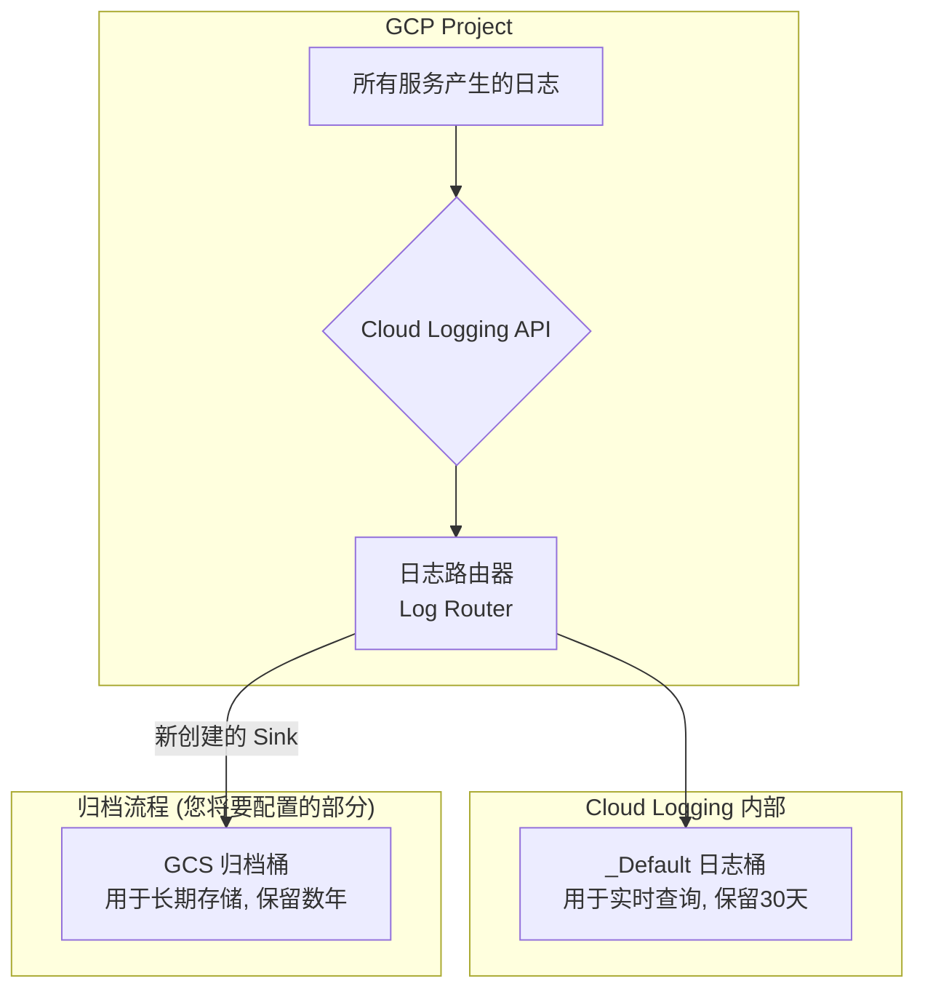
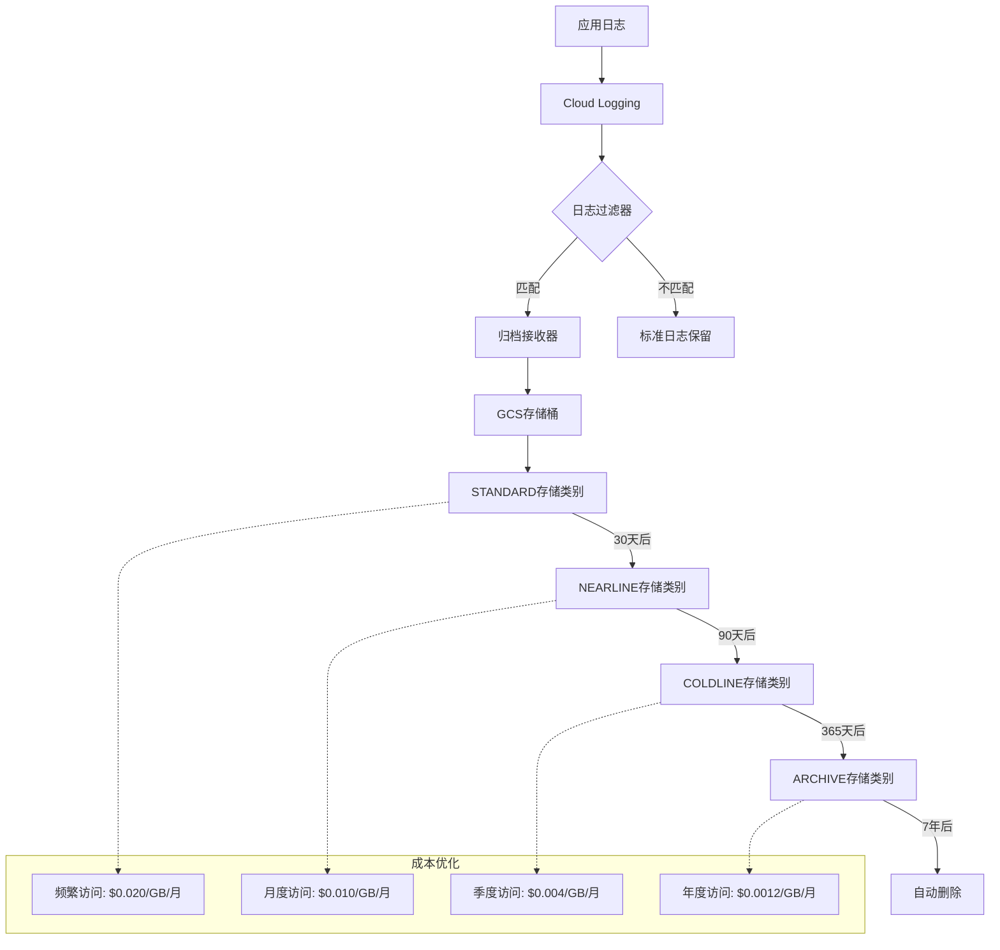

# summary

- analyze all the bucket Configure
- for some buckets using 直接使用 Archive 存储类别
    - we have enabled lifecycle for some buckets
    -

# GCP 日志归档策略实施指南

## 概述

本文档详细介绍如何在 GCP 项目中实施日志归档策略，通过将日志从高成本的 Cloud Logging 转移到低成本的 Google Cloud Storage (GCS) Archive 存储类别，实现长期成本优化。

## 归档策略的价值

### 成本对比分析

| 存储方式      | 注入成本         | 月存储成本 (每 GiB) | 年存储成本 (1 TiB) | 适用场景       |
| ------------- | ---------------- | ------------------- | ------------------ | -------------- |
| Cloud Logging | $0.50/GiB        | $0.01/GiB           | $122.88            | 实时查询和分析 |
| GCS Standard  | 免费 (通过 Sink) | $0.02/GiB           | $245.76            | 频繁访问       |
| GCS Nearline  | 免费 (通过 Sink) | $0.01/GiB           | $122.88            | 月度访问       |
| GCS Archive   | 免费 (通过 Sink) | $0.0012/GiB         | $14.76             | 长期归档       |

**关键洞察**: 使用 GCS Archive 进行长期存储比 Cloud Logging 节省约 **88% 的成本**。

## 实施方案

### 方案一：基础归档配置

#### 1. 创建 GCS 归档存储桶

```bash
#!/bin/bash
# create-archive-bucket.sh

PROJECT_ID="your-project-id"
BUCKET_NAME="${PROJECT_ID}-logs-archive"
REGION="us-central1"

echo "创建日志归档存储桶..."

# 创建存储桶，直接使用 Archive 存储类别
gsutil mb -c ARCHIVE -l $REGION gs://$BUCKET_NAME

# 设置存储桶标签
gsutil label ch -l purpose:log-archive gs://$BUCKET_NAME
gsutil label ch -l cost-optimization:enabled gs://$BUCKET_NAME

echo "存储桶创建完成: gs://$BUCKET_NAME"
```

#### 2. 配置生命周期策略

```bash
# 创建生命周期配置文件
cat > lifecycle-policy.json << 'EOF'
{
  "lifecycle": {
    "rule": [
      {
        "action": {
          "type": "SetStorageClass",
          "storageClass": "ARCHIVE"
        },
        "condition": {
          "age": 0,
          "matchesStorageClass": ["STANDARD", "NEARLINE", "COLDLINE"]
        }
      },
      {
        "action": {
          "type": "Delete"
        },
        "condition": {
          "age": 2555
        }
      }
    ]
  }
}
EOF

# 应用生命周期策略
gsutil lifecycle set lifecycle-policy.json gs://$BUCKET_NAME

echo "生命周期策略配置完成"
```

#### 3. 创建日志接收器 (Log Sink)

```bash
# create-log-sink.sh

PROJECT_ID="your-project-id"
BUCKET_NAME="${PROJECT_ID}-logs-archive"
SINK_NAME="archive-all-logs"

echo "创建日志归档接收器..."

# 创建接收器 - 归档所有 INFO 级别以上的日志
gcloud logging sinks create $SINK_NAME \
  storage.googleapis.com/$BUCKET_NAME \
  --log-filter='severity>=INFO' \
  --project=$PROJECT_ID

# 获取接收器的服务账号
SINK_SERVICE_ACCOUNT=$(gcloud logging sinks describe $SINK_NAME \
  --project=$PROJECT_ID \
  --format='value(writerIdentity)')

echo "接收器服务账号: $SINK_SERVICE_ACCOUNT"

# 为接收器服务账号授予存储桶写入权限
gsutil iam ch $SINK_SERVICE_ACCOUNT:objectCreator gs://$BUCKET_NAME

echo "日志归档接收器配置完成"
```

### 方案二：分级归档策略

#### 1. 多层级存储桶配置

```bash
#!/bin/bash
# create-tiered-archive.sh

PROJECT_ID="your-project-id"
REGION="us-central1"

# 创建不同层级的存储桶
declare -A BUCKETS=(
    ["hot"]="STANDARD"      # 热数据 - 30天内
    ["warm"]="NEARLINE"     # 温数据 - 30-90天
    ["cold"]="COLDLINE"     # 冷数据 - 90-365天
    ["archive"]="ARCHIVE"   # 归档数据 - 365天以上
)

for tier in "${!BUCKETS[@]}"; do
    bucket_name="${PROJECT_ID}-logs-${tier}"
    storage_class="${BUCKETS[$tier]}"

    echo "创建 $tier 层存储桶: $bucket_name"
    gsutil mb -c $storage_class -l $REGION gs://$bucket_name

    # 设置标签
    gsutil label ch -l tier:$tier gs://$bucket_name
    gsutil label ch -l purpose:log-archive gs://$bucket_name
done

echo "分层存储桶创建完成"
```

#### 2. 智能生命周期管理

```bash
# 为每个存储桶配置生命周期策略
create_lifecycle_policy() {
    local bucket_name=$1
    local tier=$2

    case $tier in
        "hot")
            cat > lifecycle-${tier}.json << 'EOF'
{
  "lifecycle": {
    "rule": [
      {
        "action": {"type": "SetStorageClass", "storageClass": "NEARLINE"},
        "condition": {"age": 30}
      }
    ]
  }
}
EOF
            ;;;;
        "warm")
            cat > lifecycle-${tier}.json << 'EOF'
{
  "lifecycle": {
    "rule": [
      {
        "action": {"type": "SetStorageClass", "storageClass": "COLDLINE"},
        "condition": {"age": 60}
      }
    ]
  }
}
EOF
            ;;;;
        "cold")
            cat > lifecycle-${tier}.json << 'EOF'
{
  "lifecycle": {
    "rule": [
      {
        "action": {"type": "SetStorageClass", "storageClass": "ARCHIVE"},
        "condition": {"age": 275}
      }
    ]
  }
}
EOF
            ;;;;
        "archive")
            cat > lifecycle-${tier}.json << 'EOF'
{
  "lifecycle": {
    "rule": [
      {
        "action": {"type": "Delete"},
        "condition": {"age": 2555}
      }
    ]
  }
}
EOF
            ;;;;
    esac

    gsutil lifecycle set lifecycle-${tier}.json gs://$bucket_name
    echo "生命周期策略已应用到 $bucket_name"
}

# 应用生命周期策略到所有存储桶
for tier in hot warm cold archive; do
    bucket_name="${PROJECT_ID}-logs-${tier}"
    create_lifecycle_policy $bucket_name $tier
done
```

#### 3. 智能日志路由配置

```bash
#!/bin/bash
# create-smart-routing.sh

PROJECT_ID="your-project-id"

# 创建不同优先级的日志接收器
create_log_sink() {
    local sink_name=$1
    local bucket_tier=$2
    local log_filter=$3
    local description=$4

    bucket_name="${PROJECT_ID}-logs-${bucket_tier}"

    echo "创建接收器: $sink_name -> $bucket_name"

    gcloud logging sinks create $sink_name \
      storage.googleapis.com/$bucket_name \
      --log-filter="$log_filter" \
      --description="$description" \
      --project=$PROJECT_ID

    # 获取并授权服务账号
    sink_sa=$(gcloud logging sinks describe $sink_name \
      --project=$PROJECT_ID \
      --format='value(writerIdentity)')

    gsutil iam ch $sink_sa:objectCreator gs://$bucket_name

    echo "接收器 $sink_name 配置完成"
}

# 高优先级日志 -> 热存储 (便于快速查询)
create_log_sink "critical-logs-sink" "hot" \
  'severity>=ERROR OR (protoPayload.serviceName="gke.googleapis.com" AND protoPayload.methodName~"create|delete")' \
  "Critical logs for immediate access"

# 审计日志 -> 温存储 (合规要求)
create_log_sink "audit-logs-sink" "warm" \
  'protoPayload.serviceName!="" AND severity>=INFO' \
  "Audit logs for compliance"

# 应用日志 -> 冷存储 (偶尔查询)
create_log_sink "application-logs-sink" "cold" \
  'resource.type="k8s_container" AND severity>=INFO' \
  "Application logs for historical analysis"

# 系统日志 -> 归档存储 (长期保留)
create_log_sink "system-logs-sink" "archive" \
  'resource.type="gce_instance" OR resource.type="k8s_node"' \
  "System logs for long-term archival"

echo "智能日志路由配置完成"
```

### 方案三：Terraform 自动化部署

#### 1. Terraform 归档模块

```hcl
# terraform/modules/log-archive/main.tf

variable "project_id" {
  description = "GCP 项目 ID"
  type        = string
}

variable "region" {
  description = "存储桶区域"
  type        = string
  default     = "us-central1"
}

variable "retention_years" {
  description = "归档保留年数"
  type        = number
  default     = 7
}

# 归档存储桶
resource "google_storage_bucket" "log_archive" {
  name          = "${var.project_id}-logs-archive"
  location      = var.region
  storage_class = "ARCHIVE"

  # 防止意外删除
  lifecycle {
    prevent_destroy = true
  }

  # 版本控制
  versioning {
    enabled = false
  }

  # 统一存储桶级访问
  uniform_bucket_level_access = true

  # 生命周期规则
  lifecycle_rule {
    condition {
      age = var.retention_years * 365
    }
    action {
      type = "Delete"
    }
  }

  # 标签
  labels = {
    purpose           = "log-archive"
    cost-optimization = "enabled"
    environment      = "all"
  }
}

# 全量日志归档接收器
resource "google_logging_project_sink" "archive_sink" {
  name        = "archive-all-logs"
  destination = "storage.googleapis.com/${google_storage_bucket.log_archive.name}"

  # 归档所有 INFO 级别以上的日志
  filter = "severity>=INFO"

  # 排除已经在其他接收器中处理的日志，避免重复
  exclusions {
    name        = "exclude-already-processed"
    description = "Exclude logs already processed by other sinks"
    filter      = "resource.type=\"k8s_container\" AND severity>=ERROR"
  }

  unique_writer_identity = true
}

# 为接收器授权
resource "google_storage_bucket_iam_member" "archive_writer" {
  bucket = google_storage_bucket.log_archive.name
  role   = "roles/storage.objectCreator"
  member = google_logging_project_sink.archive_sink.writer_identity
}

# 分层归档存储桶
resource "google_storage_bucket" "tiered_archive" {
  for_each = {
    hot     = "STANDARD"
    warm    = "NEARLINE"
    cold    = "COLDLINE"
    archive = "ARCHIVE"
  }

  name          = "${var.project_id}-logs-${each.key}"
  location      = var.region
  storage_class = each.value

  uniform_bucket_level_access = true

  # 分层生命周期规则
  dynamic "lifecycle_rule" {
    for_each = each.key == "hot" ? [1] : []
    content {
      condition {
        age = 30
      }
      action {
        type          = "SetStorageClass"
        storage_class = "NEARLINE"
      }
    }
  }

  dynamic "lifecycle_rule" {
    for_each = each.key == "warm" ? [1] : []
    content {
      condition {
        age = 60
      }
      action {
        type          = "SetStorageClass"
        storage_class = "COLDLINE"
      }
    }
  }

  dynamic "lifecycle_rule" {
    for_each = each.key == "cold" ? [1] : []
    content {
      condition {
        age = 275
      }
      action {
        type          = "SetStorageClass"
        storage_class = "ARCHIVE"
      }
    }
  }

  dynamic "lifecycle_rule" {
    for_each = each.key == "archive" ? [1] : []
    content {
      condition {
        age = var.retention_years * 365
      }
      action {
        type = "Delete"
      }
    }
  }

  labels = {
    tier              = each.key
    purpose           = "log-archive"
    cost-optimization = "enabled"
  }
}

# 输出
output "archive_bucket_name" {
  description = "归档存储桶名称"
  value       = google_storage_bucket.log_archive.name
}

output "archive_sink_writer_identity" {
  description = "归档接收器的写入身份"
  value       = google_logging_project_sink.archive_sink.writer_identity
}

output "tiered_buckets" {
  description = "分层存储桶信息"
  value = {
    for k, v in google_storage_bucket.tiered_archive : k => {
      name          = v.name
      storage_class = v.storage_class
      url           = v.url
    }
  }
}
```

#### 2. 使用 Terraform 模块

```hcl
# main.tf

module "log_archive" {
  source = "./modules/log-archive"

  project_id       = "your-project-id"
  region          = "us-central1"
  retention_years = 7
}

# 输出归档信息
output "archive_info" {
  value = {
    bucket_name     = module.log_archive.archive_bucket_name
    writer_identity = module.log_archive.archive_sink_writer_identity
    tiered_buckets  = module.log_archive.tiered_buckets
  }
}
```

## 归档策略最佳实践

### 1. 数据分类策略

```bash
# 按重要性和访问频率分类日志
create_classification_sinks() {
    local project_id=$1

    # 关键业务日志 - 热存储 (快速访问)
    gcloud logging sinks create critical-business-logs \
      storage.googleapis.com/${project_id}-logs-hot \
      --log-filter='severity>=ERROR AND (resource.type="k8s_container" OR resource.type="cloud_function")' \
      --project=$project_id

    # 安全审计日志 - 温存储 (合规要求)
    gcloud logging sinks create security-audit-logs \
      storage.googleapis.com/${project_id}-logs-warm \
      --log-filter='protoPayload.serviceName="iam.googleapis.com" OR protoPayload.serviceName="cloudresourcemanager.googleapis.com"' \
      --project=$project_id

    # 性能监控日志 - 冷存储 (分析用途)
    gcloud logging sinks create performance-logs \
      storage.googleapis.com/${project_id}-logs-cold \
      --log-filter='resource.type="gce_instance" AND jsonPayload.message=~"performance|metrics"' \
      --project=$project_id

    # 调试日志 - 归档存储 (长期保留)
    gcloud logging sinks create debug-logs \
      storage.googleapis.com/${project_id}-logs-archive \
      --log-filter='severity=DEBUG OR severity=INFO' \
      --project=$project_id
}
```

### 2. 成本监控和优化

```bash
#!/bin/bash
# monitor-archive-costs.sh

PROJECT_ID="your-project-id"

echo "监控归档存储成本..."

# 获取各存储桶的大小和成本
for tier in hot warm cold archive; do
    bucket_name="${PROJECT_ID}-logs-${tier}"

    # 获取存储桶大小
    size_bytes=$(gsutil du -s gs://$bucket_name | awk '{print $1}')
    size_gb=$((size_bytes / 1024 / 1024 / 1024))

    # 计算月度成本 (简化计算)
    case $tier in
        "hot") cost_per_gb=0.020 ;;;
        "warm") cost_per_gb=0.010 ;;;
        "cold") cost_per_gb=0.004 ;;;
        "archive") cost_per_gb=0.0012 ;;;
    esac

    monthly_cost=$(echo "$size_gb * $cost_per_gb" | bc -l)

    echo "存储桶: $bucket_name"
    echo "  大小: ${size_gb} GB"
    echo "  月度成本: \$$$(printf "%.2f" $monthly_cost)"
    echo ""
done

echo "成本监控完成"
```

### 3. 数据检索策略

```bash
#!/bin/bash
# retrieve-archived-logs.sh

# 从归档存储中检索日志的脚本
retrieve_logs() {
    local bucket_name=$1
    local date_filter=$2
    local output_dir=$3

    echo "从 $bucket_name 检索日志..."
    echo "日期过滤器: $date_filter"
    echo "输出目录: $output_dir"

    # 创建输出目录
    mkdir -p $output_dir

    # 列出匹配的对象
    gsutil ls "gs://$bucket_name/**$date_filter*" > temp_file_list.txt

    # 批量下载
    while read -r file_path; do
        echo "下载: $file_path"
        gsutil cp "$file_path" "$output_dir/"
    done < temp_file_list.txt

    # 清理临时文件
    rm temp_file_list.txt

    echo "日志检索完成，文件保存在: $output_dir"
}

# 使用示例
# retrieve_logs "your-project-logs-archive" "2024-01" "./retrieved_logs"
```

## 实施检查清单

### 准备阶段

- [ ] 确认项目权限 (Storage Admin, Logging Admin)
- [ ] 选择存储区域 (考虑数据主权和延迟)
- [ ] 确定保留策略 (根据合规要求)
- [ ] 规划存储桶命名规范

### 实施阶段

- [ ] 创建归档存储桶
- [ ] 配置生命周期策略
- [ ] 创建日志接收器
- [ ] 授权服务账号权限
- [ ] 测试日志流向

### 验证阶段

- [ ] 验证日志正确路由到归档存储
- [ ] 检查存储桶权限配置
- [ ] 测试日志检索流程
- [ ] 监控成本变化

### 维护阶段

- [ ] 定期审查存储使用量
- [ ] 监控归档成本趋势
- [ ] 调整生命周期策略
- [ ] 更新访问权限

## 故障排除

### 常见问题

1. **日志未出现在归档存储桶**

    ```bash
    # 检查接收器状态
    gcloud logging sinks describe SINK_NAME --project=PROJECT_ID

    # 检查服务账号权限
    gsutil iam get gs://BUCKET_NAME
    ```

2. **存储成本高于预期**

    ```bash
    # 检查存储类别分布
    gsutil ls -L -b gs://BUCKET_NAME

    # 分析对象大小分布
    gsutil du -h gs://BUCKET_NAME
    ```

3. **检索速度慢**
    ```bash
    # Archive 存储需要恢复时间
    # 考虑使用 Coldline 替代 Archive 用于需要快速访问的数据
    ```

## 成本效益分析

### 实施前后对比

假设项目每月产生 1TB 日志：

**实施前 (仅 Cloud Logging)**:

- 注入成本: 1024 GB × $0.50 = $512
- 存储成本 (90 天): 1024 GB × $0.01 × 3 = $30.72
- 月度总成本: $542.72

**实施后 (Cloud Logging + GCS Archive)**:

- 注入成本: 1024 GB × $0.50 = $512
- Cloud Logging 存储 (30 天): 1024 GB × $0.01 × 1 = $10.24
- GCS Archive 存储 (60 天): 1024 GB × $0.0012 × 2 = $2.46
- 月度总成本: $524.70

**月度节省**: $18.02 (3.3%)
**年度节省**: $216.24

随着时间推移，归档数据量增加，节省效果会更加显著。

## 总结

通过实施 GCS 归档策略，您可以：

1. **显著降低长期存储成本** - Archive 存储比 Cloud Logging 便宜 88%
2. **保持数据完整性** - 所有日志都被保留，只是存储位置不同
3. **满足合规要求** - 长期保留审计和安全日志
4. **灵活的检索选项** - 根据需要检索历史数据
5. **自动化管理** - 通过生命周期策略自动转换存储类别

建议从单一归档存储桶开始，然后根据实际需求逐步实施分层归档策略。

# ChatGPT

👌 好问题，这个就是 **日志归档（Archival）** 的最佳实践，尤其是当你要减少 Logging 的存储费用，但又不想彻底丢掉历史日志时。

在 GCP 里实现 **日志归档到 GCS**，主要依赖 **Log Sink**（日志汇聚器）。

---

## **一、整体思路**

1. **创建日志接收器 (Sink)** → 把日志从 \_Default / \_Required 导出到 GCS。
2. **选择目标存储桶** →
3. **控制导出范围** → 你可以只导出特定环境 / 特定日志等级（如 ERROR）。
4. **保留周期策略** → Cloud Logging 的桶保留时间可以短（如 7 天），长期日志靠 GCS 保存。

---

## **二、实现步骤**

### **1. 创建 GCS 桶（Archive 存储类别）**

```bash
# 1. 定义变量 (请根据您的项目进行修改)
PROJECT_ID="your-gcp-project-id"
REGION="us-central1" # 选择离您服务近的区域
BUCKET_NAME="${PROJECT_ID}-log-archive-bucket" # 推荐使用项目ID作为前缀，确保名称唯一

# 2. 创建 GCS 存储桶
# -c ARCHIVE: 指定默认存储类别为 Archive，这是成本最低的类别。
# -l $REGION: 指定存储桶所在的地理位置。
# -p $PROJECT_ID: 指定该存储桶所属的项目。
gsutil mb -c ARCHIVE -l $REGION -p $PROJECT_ID gs://$BUCKET_NAME
```

### **2. 创建日志接收器 (Sink) 以导出日志**

接下来，我们需要告诉 Cloud Logging 将日志路由到我们刚刚创建的 GCS 桶中。这通过创建“日志接收器 (Log Sink)”来实现。

```bash
# 1. 定义变量
SINK_NAME="archive-all-logs-to-gcs"
DESTINATION_BUCKET="storage.googleapis.com/${BUCKET_NAME}"

# 2. 创建日志接收器
# --log-filter: 这是最重要的参数之一，用于决定哪些日志需要被归档。
#               留空或设置为 "severity>=DEFAULT" 可归档所有日志。
#               设置为 "severity>=INFO" 是一个常见的良好实践。
# --description: 为您的接收器添加描述，方便未来管理。
gcloud logging sinks create $SINK_NAME $DESTINATION_BUCKET \
  --log-filter="severity>=INFO" \
  --description="将所有INFO及以上级别的日志归档到GCS" \
  --project=$PROJECT_ID
```

### **3. 为接收器授权 (关键步骤)**

创建接收器后，GCP 会为其生成一个专用的服务账号（Service Account），称为“写入者身份 (Writer Identity)”。您必须授予这个服务账号向目标 GCS 存储桶写入数据的权限，否则日志将无法导出。

```bash
# 1. 获取接收器的服务账号 (Writer Identity)
SINK_WRITER_IDENTITY=$(gcloud logging sinks describe $SINK_NAME \
  --project=$PROJECT_ID \
  --format='value(writerIdentity)')

echo "接收器的服务账号为: $SINK_WRITER_IDENTITY"

# 2. 将 '存储对象创建者 (roles/storage.objectCreator)' 角色授予该服务账号
# 这允许服务账号在指定的GCS桶中创建（即写入）日志文件。
gsutil iam ch $SINK_WRITER_IDENTITY:objectCreator gs://$BUCKET_NAME
```

### **4. 验证配置**

配置完成后，等待几分钟，然后进行验证，以确保一切正常工作。

```bash
# 1. 检查接收器状态，确保没有错误
gcloud logging sinks describe $SINK_NAME --project=$PROJECT_ID

# 2. 检查GCS桶中是否已开始出现日志文件
# 日志文件会按 年/月/日 的目录结构存放。
gsutil ls gs://$BUCKET_NAME/
```

如果 `gsutil ls` 命令返回了以日志名称命名的文件夹，说明您的归档策略已成功配置并开始运行。

---

## 总结

通过以上四个步骤，您已经成功建立了一个基础但功能完备的日志归档系统。这个系统会自动将您项目中的日志导出到低成本的 GCS Archive 存储中，既满足了长期数据保留的合规性需求，又极大地优化了您的日志存储成本。



---

# Claude

针对 GCS 归档策略的配置，我将为您提供完整的实现方案。

## GCS 归档策略配置

### 1. 创建归档存储桶

```bash
# 创建专用的归档存储桶
gsutil mb -c ARCHIVE -l us-central1 gs://your-project-archive-logs

# 或者创建标准存储桶后通过生命周期策略转换
gsutil mb -c STANDARD -l us-central1 gs://your-project-logs
```

### 2. 配置生命周期管理策略

```json
{
	"lifecycle": {
		"rule": [
			{
				"action": {
					"type": "SetStorageClass",
					"storageClass": "NEARLINE"
				},
				"condition": {
					"age": 30,
					"matchesStorageClass": ["STANDARD"]
				}
			},
			{
				"action": {
					"type": "SetStorageClass",
					"storageClass": "COLDLINE"
				},
				"condition": {
					"age": 90,
					"matchesStorageClass": ["NEARLINE"]
				}
			},
			{
				"action": {
					"type": "SetStorageClass",
					"storageClass": "ARCHIVE"
				},
				"condition": {
					"age": 365,
					"matchesStorageClass": ["COLDLINE"]
				}
			},
			{
				"action": {
					"type": "Delete"
				},
				"condition": {
					"age": 2555
				}
			}
		]
	}
}
```

```bash
# 应用生命周期策略
gsutil lifecycle set lifecycle.json gs://your-project-logs
```

### 3. Cloud Logging 归档接收器配置

```bash
# 创建归档日志接收器
gcloud logging sinks create archive-sink \
    storage.googleapis.com/your-project-archive-logs \
    --log-filter='timestamp >= "2024-01-01T00:00:00Z"'

# 创建按日期分区的接收器
gcloud logging sinks create daily-archive-sink \
    "storage.googleapis.com/your-project-logs/logs/year=%Y/month=%m/day=%d" \
    --log-filter='severity >= "INFO"'
```

### 4. 存储类别对比表

| 存储类别 | 访问频率 | 最短存储时间 | 检索费用 | 月存储成本/GB |
| -------- | -------- | ------------ | -------- | ------------- |
| STANDARD | 频繁访问 | 无           | 无       | $0.020        |
| NEARLINE | 月度访问 | 30 天        | $0.01/GB | $0.010        |
| COLDLINE | 季度访问 | 90 天        | $0.02/GB | $0.004        |
| ARCHIVE  | 年度访问 | 365 天       | $0.05/GB | $0.0012       |

### 5. Terraform 配置示例

```hcl
# 归档存储桶
resource "google_storage_bucket" "archive_logs" {
  name     = "${var.project_id}-archive-logs"
  location = var.region

  storage_class = "ARCHIVE"

  versioning {
    enabled = true
  }

  lifecycle_rule {
    condition {
      age = 30
      matches_storage_class = ["STANDARD"]
    }
    action {
      type          = "SetStorageClass"
      storage_class = "NEARLINE"
    }
  }

  lifecycle_rule {
    condition {
      age = 90
      matches_storage_class = ["NEARLINE"]
    }
    action {
      type          = "SetStorageClass"
      storage_class = "COLDLINE"
    }
  }

  lifecycle_rule {
    condition {
      age = 365
      matches_storage_class = ["COLDLINE"]
    }
    action {
      type          = "SetStorageClass"
      storage_class = "ARCHIVE"
    }
  }

  lifecycle_rule {
    condition {
      age = 2555  # 7年后删除
    }
    action {
      type = "Delete"
    }
  }
}

# 日志接收器
resource "google_logging_project_sink" "archive_sink" {
  name        = "archive-sink"
  destination = "storage.googleapis.com/${google_storage_bucket.archive_logs.name}"

  filter = <<EOF
timestamp >= "2024-01-01T00:00:00Z"
severity >= "INFO"
EOF

  unique_writer_identity = true
}

# 给接收器服务账号存储权限
resource "google_storage_bucket_iam_member" "archive_sink_writer" {
  bucket = google_storage_bucket.archive_logs.name
  role   = "roles/storage.objectCreator"
  member = google_logging_project_sink.archive_sink.writer_identity
}
```

### 6. 归档流程图



### 7. 监控和告警设置

```yaml
# monitoring.yaml
apiVersion: monitoring.coreos.com/v1
kind: PrometheusRule
metadata:
  name: gcs-archive-monitoring
spec:
  groups:
  - name: gcs-archive.rules
    rules:
    - alert: HighArchiveStorageCost
      expr: gcs_bucket_size_bytes{storage_class="ARCHIVE"} > 1000000000000
      for: 1h
      annotations:
        summary: "归档存储成本过高"
        description: "归档存储超过1TB，请检查归档策略"
```

```bash
# 设置存储预算告警
gcloud billing budgets create \
    --billing-account=BILLING_ACCOUNT_ID \
    --display-name="GCS Archive Budget" \
    --budget-amount=500USD \
    --threshold-rules-percent=50,75,90,100 \
    --services=services/95FF2355-5EA1-4552-9139-518C70635437
```

### 8. 实用脚本

```bash
#!/bin/bash
# archive_setup.sh - 自动配置归档策略

PROJECT_ID="your-project-id"
BUCKET_NAME="${PROJECT_ID}-archive-logs"
REGION="us-central1"

# 创建存储桶
echo "Creating archive bucket..."
gsutil mb -c STANDARD -l $REGION gs://$BUCKET_NAME

# 应用生命周期策略
echo "Applying lifecycle policy..."
gsutil lifecycle set lifecycle.json gs://$BUCKET_NAME

# 创建日志接收器
echo "Creating log sink..."
gcloud logging sinks create archive-sink \
    storage.googleapis.com/$BUCKET_NAME \
    --log-filter='severity >= "INFO"'

# 设置IAM权限
echo "Setting up IAM permissions..."
SINK_SERVICE_ACCOUNT=$(gcloud logging sinks describe archive-sink --format="value(writerIdentity)")
gsutil iam ch ${SINK_SERVICE_ACCOUNT}:objectCreator gs://$BUCKET_NAME

echo "Archive setup completed!"
```

### 9. 成本优化建议

- **日志过滤**: 只归档重要日志，避免 DEBUG 级别日志
- **压缩**: 启用 gzip 压缩减少存储空间
- **分区策略**: 按时间分区便于管理和检索
- **定期审查**: 定期检查归档策略的有效性

这套配置将帮您实现完整的 GCS 归档策略，既能满足合规要求又能有效控制成本。
