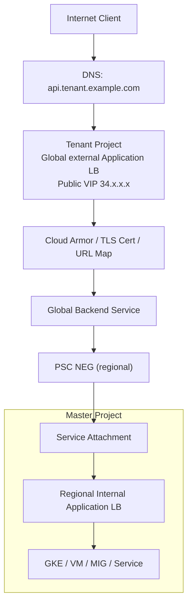

# Cross Project External Entry in Tenant Project 方案

## 1. Goal and Constraints

### 1.1 目标

你现在已经实现了 **公司内部 Shared VPC / internal 场景** 下的跨 Project 访问。  
这一版的目标变成：

- 用户从 **公网** 发起请求
- 用户访问的是 **Tenant Project** 里的入口地址
- 入口由 **Tenant Project 的 Load Balancer** 统一控制
- Tenant Project 再通过 **NEG** 把流量送到 **Master Project**
- Master Project 尽量不直接暴露公网入口

你给出的典型入口形态是：

```text
Client
  ->
Tenant Project 公网 LB IP
  ->
NEG
  ->
Master Project
```

并且你特别强调：

- 外部请求是 **TLS 协议**
- 公网入口类似 Google Cloud GLB 的公网 IP，通常是 `34.x.x.x`

---

### 1.2 我对需求的理解

你的真正诉求不是“单纯把一个公网 34 开头 IP 再转发一次”，而是：

- **公网入口收敛在 Tenant Project**
- **安全控制、证书、域名、WAF、日志都放在 Tenant Project**
- **Master Project 只做服务承载**
- **Tenant 到 Master 之间尽量走私网/服务级接入，不暴露 Master backend**

这和你在 `3.md` 里的思路是一致的，只是把入口从 internal 场景提升到了 **external ingress**。

---

### 1.3 关键判断

这里必须先把一个容易混淆的点讲清楚：

#### 情况 A：外部用户访问的是你的系统入口

如果用户从公网访问的是你自己的服务域名，例如：

```text
api.tenant.example.com -> Tenant Project GLB 公网 IP(34.x.x.x)
```

那么这是一个标准的：

- **Tenant Project 做公网入口**
- **Master Project 做私有服务承载**

的架构问题。

这种场景下，**推荐方案是可行的**：

```text
External Client
  -> Tenant Project External Load Balancer
  -> PSC NEG
  -> Master Project Service Attachment
  -> Internal Load Balancer
  -> Backend
```

#### 情况 B：Master Project 现在本身已经是一个公网 GLB（34.x.x.x）

如果你的意思是：

- Master Project 现在已经有一个公网 GLB IP
- 你想在 Tenant Project 再放一个 LB
- 然后让 Tenant Project 的 NEG 直接去转发到 Master Project 的公网 `34.x.x.x`

那么这不是 PSC 模型，而更像：

- Tenant Project LB
  -> Internet NEG
  -> Master Project 公网 FQDN / 公网 IP

这条路径**可以做成过渡方案**，但它不满足你“入口在 Tenant、Master 尽量私有化”的最终目标。

**结论：**

- 如果你想要的是 **真正的跨 Project 私有服务发布**，Master 不能只停留在公网 GLB 形态。
- Master 需要补一个 **Internal LB + Service Attachment**，然后由 Tenant 通过 **PSC NEG** 来访问。

---

## 2. Recommended Architecture (V1)

### 推荐 V1 架构

#### 如果你的业务实际上是 HTTPS

大多数“TLS 协议”的 Web/API 场景，本质上还是 **HTTPS**。  
这种情况下，推荐使用：

- **Tenant Project**：Global external Application Load Balancer
- **Master Project**：Regional internal Application Load Balancer + Service Attachment
- **Tenant -> Master**：PSC NEG



这是最符合你当前目标的 V1：

- **公网只暴露 Tenant**
- **Master 不暴露公网 backend**
- **跨 Project 通过服务级接入实现**
- **Tenant 负责证书、WAF、路由、日志、灰度**

复杂度：`Moderate`

---

### 如果你的业务是“纯 TLS”而不是 HTTPS

如果你的上层协议不是 HTTP/HTTPS，而是：

- TLS over TCP
- 自定义 TLS 协议
- 非 HTTP 的 SSL 服务

那么更适合的是：

- **Tenant Project**：Global external proxy Network Load Balancer (SSL proxy)
- **Master Project**：Regional internal proxy Network Load Balancer 或其他支持的 producer LB
- **Tenant -> Master**：PSC NEG

但是这个方案有两个明显限制：

1. 复杂度更高，排障也更难
2. GCP 官方文档明确提到 **Global external proxy Network Load Balancer 不支持 Shared VPC 部署**

因此：

- 如果你的流量实际上是 **HTTPS API / Web 流量**，不要选这个分支
- 只有在你确认是 **非 HTTP 的 TLS 服务** 时，才考虑这个模型

复杂度：`Advanced`

---

## 3. 核心结论

### 结论 1：推荐主方案

如果你的“TLS”本质是 **HTTPS**，推荐你这样做：

```text
Internet Client
  ->
Tenant Project Global external Application Load Balancer
  ->
PSC NEG
  ->
Master Project Service Attachment
  ->
Master Internal Application Load Balancer
  ->
Backend
```

这是最符合你“入口在 Tenant、服务在 Master、跨 Project 私有接入”的设计。

---

### 结论 2：不要把 Master 的公网 34.x GLB 当成 PSC producer

如果 Master 当前只有一个公网 GLB，例如：

```text
master.example.com -> 34.x.x.x
```

那么它 **不能直接作为 PSC producer** 给 Tenant Project 的 PSC NEG 消费。  
PSC NEG 指向的是：

- `Service Attachment`
- 或者受支持的 Google API / published service

而不是一个普通的公网 GLB IP。

所以如果你要实现你想要的最终逻辑，必须把 Master 从：

```text
公网 GLB
```

重构成：

```text
Internal LB
  ->
Service Attachment
```

然后 Tenant 再消费这个服务。

---

### 结论 3：如果你只是想“Tenant 接管公网域名”，可以做过渡方案

如果短期内 Master 还不能改造成 PSC producer，那么可以先做一个过渡方案：

```text
Client
  ->
Tenant Project Global external Application Load Balancer
  ->
Internet NEG
  ->
Master Project public FQDN
```

但这个方案有明显问题：

- Master 仍然是公网暴露
- Tenant 到 Master 之间不是私有服务级接入
- 如果你用的是公网 IP 而不是 FQDN，TLS 校验和 SNI 行为会变差
- 这更像“反向代理公网服务”，不是你 `3.md` 那种 PSC 私有跨项目方案

所以它只能作为 **迁移阶段方案**，不应该作为最终架构。

---

## 4. Recommended Architecture Detail

### 4.1 推荐的生产 V1 逻辑

```text
公网入口控制面：Tenant Project
服务承载面：Master Project
跨项目连接面：PSC
```

职责分工如下：

#### Tenant Project 负责

- 公网 VIP
- 域名绑定
- TLS 证书
- Cloud Armor / WAF
- URL Map / Host 路由
- 访问日志
- 配额与入口级限流

#### Master Project 负责

- GKE / VM / MIG 业务服务
- Internal Load Balancer
- Service Attachment
- Backend 扩缩容
- 服务内部治理

#### PSC 负责

- 把 Tenant 和 Master 的交互从“IP 直连”升级成“服务级发布与消费”
- 不暴露 Master backend IP
- 允许 Producer 控制 Consumer

---

### 4.2 为什么这个架构比“Tenant LB -> Master 公网 34 IP”更好

| 维度                         | Tenant LB -> Master 公网 34.x | Tenant LB -> PSC NEG -> Master |
| ---------------------------- | ----------------------------- | ------------------------------ |
| Master 是否仍暴露公网        | 是                            | 否                             |
| Producer 是否能控制 Consumer | 弱                            | 强                             |
| 是否暴露 backend 入口形态    | 是                            | 否                             |
| 是否符合你 `3.md` 的延续思路 | 否                            | 是                             |
| 安全边界是否清晰             | 一般                          | 清晰                           |
| 后续多租户扩展               | 一般                          | 更好                           |

---

## 5. Implementation Steps

### Step 1：先判断你的上层协议到底是不是 HTTPS

这是第一道分叉。

#### 如果满足以下任意一点，就按 HTTPS 处理

- 有域名
- 有证书
- 请求语义是 URL / Host / Path
- 本质是 API / Web 请求

此时直接走：

- **Global external Application Load Balancer**

#### 如果不是 HTTP，而是纯 TLS 字节流

例如：

- 自定义 TLS 服务
- 非 HTTP 协议但要走 443

才考虑：

- **Global external proxy Network Load Balancer (SSL proxy)**

---

### Step 2：Master Project 改造成 PSC Producer

这一步是你最终方案能不能成立的前提。

#### 2.1 准备 Internal LB

如果是 HTTPS 业务：

- 使用 **Regional internal Application Load Balancer**

如果是纯 TCP/TLS 业务：

- 使用 **Regional internal proxy Network Load Balancer**

#### 2.2 开启 global access

如果 Tenant 侧用的是 global/cross-region 的 consumer LB，那么 producer 侧要先满足：

- Internal LB 的 forwarding rule 已开启 `AllowGlobalAccess`

这点你在前一篇文档里已经踩过坑，仍然是硬性前提。

#### 2.3 创建 PSC NAT Subnet

```bash
gcloud compute networks subnets create psc-nat-subnet \
  --project=MASTER_PROJECT \
  --network=MASTER_VPC \
  --region=REGION \
  --range=10.100.0.0/28 \
  --purpose=PRIVATE_SERVICE_CONNECT
```

#### 2.4 创建 Service Attachment

```bash
gcloud compute service-attachments create master-service-attachment \
  --project=MASTER_PROJECT \
  --region=REGION \
  --producer-forwarding-rule=MASTER_ILB_FORWARDING_RULE \
  --connection-preference=ACCEPT_MANUAL \
  --consumer-accept-list=TENANT_PROJECT_NUMBER=100 \
  --nat-subnets=psc-nat-subnet
```

---

### Step 3：Tenant Project 创建公网入口

#### HTTPS 场景

创建：

- Global external Application Load Balancer
- Global public VIP
- Managed certificate / self-managed certificate
- Cloud Armor policy

公网 DNS 最终指向 Tenant Project 的公网 VIP：

```text
api.tenant.example.com -> 34.x.x.x
```

注意：

- 这个 `34.x.x.x` 应该是 **Tenant Project 的 LB IP**
- 不应该再让用户直接访问 Master Project 的公网 LB

---

### Step 4：Tenant Project 创建 PSC NEG

PSC NEG 指向 Master Project 的 service attachment：

```bash
gcloud compute network-endpoint-groups create tenant-to-master-psc-neg \
  --project=TENANT_PROJECT \
  --region=REGION \
  --network-endpoint-type=PRIVATE_SERVICE_CONNECT \
  --psc-target-service=projects/MASTER_PROJECT/regions/REGION/serviceAttachments/master-service-attachment
```

补充说明：

- 继续沿用你在 `3.md` 里已经验证过的创建方式
- 如果你的 Shared VPC 权限是 **subnet 级最小授权**，就避免额外触发不必要的 network 级权限校验
- 这部分以你当前已经跑通的实践为准

---

### Step 5：将 PSC NEG 绑定到 Tenant Project 的 Backend Service

#### HTTPS 场景示例

```bash
gcloud compute backend-services create tenant-master-backend \
  --project=TENANT_PROJECT \
  --global \
  --load-balancing-scheme=EXTERNAL_MANAGED \
  --protocol=HTTPS

gcloud compute backend-services add-backend tenant-master-backend \
  --project=TENANT_PROJECT \
  --global \
  --network-endpoint-group=tenant-to-master-psc-neg \
  --network-endpoint-group-region=REGION
```

然后把这个 backend service 绑定到：

- URL map
- target HTTPS proxy
- forwarding rule

最终完成：

```text
Client -> Tenant public VIP -> Tenant GLB -> PSC NEG -> Master service
```

---

## 6. 如果 Master 当前是公网 34.x.x.x，该怎么迁移

这是你这个需求里最关键的现实问题。

### 当前状态

```text
Client -> Master Project Public GLB(34.x.x.x) -> Master Backend
```

### 目标状态

```text
Client -> Tenant Project Public GLB(34.x.x.x)
       -> PSC NEG
       -> Master Service Attachment
       -> Master Internal LB
       -> Master Backend
```

### 推荐迁移顺序

1. 在 Master Project 新建 Internal LB
2. 开启 `AllowGlobalAccess`
3. 创建 Service Attachment
4. 在 Tenant Project 创建 PSC NEG
5. 在 Tenant Project 创建新的公网 LB 与域名
6. 用测试域名先验证完整链路
7. 最后把正式 DNS 从旧入口切到 Tenant Project
8. 稳定后再下线 Master 原公网 LB

这个顺序的好处是：

- 风险小
- 可以灰度
- 可以快速回滚
- 不会一开始就把 Master 的公网入口删掉

---

## 7. Trade-offs and Alternatives

### 方案 1：Tenant External ALB -> PSC NEG -> Master

这是推荐方案。

优点：

- Tenant 完全掌控公网入口
- Master 可以私有化
- 安全边界清晰
- 与 `3.md` 的 PSC 设计方向一致

缺点：

- Master 需要补齐 Internal LB + Service Attachment
- 初次实施成本高于简单转发

---

### 方案 2：Tenant External ALB -> Internet NEG -> Master Public FQDN

这是过渡方案。

优点：

- 快
- 不需要立即改造 Master 内部架构

缺点：

- 不是私有发布
- 仍然绕不过 Master 的公网暴露
- 对 HTTPS backend，推荐使用 **FQDN**，不要直接绑公网 IP
- 如果使用公网 IP，证书校验和 SNI 能力会弱很多

**这不是最终推荐架构。**

---

### 方案 3：Tenant Global external proxy NLB(SSL) -> PSC NEG -> Master

仅在“非 HTTP 的纯 TLS 服务”时考虑。

优点：

- 能承载非 HTTP TLS 协议

缺点：

- 复杂度高
- 文档和排障成本更高
- Global external proxy NLB 对 Shared VPC 有限制

如果你的业务其实是 API / HTTPS，这条路没有必要走。

---

## 8. Validation and Rollback

### 验证项

#### 功能验证

- Tenant 域名是否解析到 Tenant Project 的公网 VIP
- Cloud Armor 规则是否生效
- Tenant LB 日志是否能看到请求
- Tenant Backend Service 是否成功绑定 PSC NEG
- Master Service Attachment 是否接受了 Tenant consumer
- Master Internal LB 是否能正常回源到 backend

#### 链路验证

```text
Client
 -> Tenant public LB
 -> PSC NEG
 -> Service Attachment
 -> Internal LB
 -> Backend
```

每一跳都要可观测。

#### 安全验证

- 用户是否只能通过 Tenant 入口访问
- Master backend 是否已经不再直接暴露公网
- 只有允许的 Tenant Project 才能连接 Service Attachment

---

### 回滚策略

推荐回滚方式不是删资源，而是回切 DNS：

1. 保留旧入口
2. 新入口用测试域名验证
3. 正式流量切换后观察
4. 一旦异常，DNS 回切到旧入口

如果你已经把流量完全迁到 Tenant 入口，再决定是否下线旧的 Master 公网 LB。

---

## 9. Reliability and Cost Optimizations

### 可靠性建议

- Tenant 侧如果是 Global external ALB，可以天然获得全球入口能力
- Master 侧建议至少做 **regional HA**
- 如果后续有跨 Region 容灾需求，可以在 Master 多 Region 发布多个 service attachment，然后在 Tenant 放多个 PSC NEG 做 failover

### 成本建议

- V1 先做单 Region，避免一上来多 Region 带来双倍资源成本
- Cloud Armor、证书、LB、PSC 都会产生费用，需提前做好账单归属
- 如果你只是为了“换一个 Tenant 入口”，不要同时引入太多网关层

---

## 10. Handoff Checklist

- 先确认业务到底是 **HTTPS** 还是 **纯 TLS**
- 如果是 HTTPS，优先选 **Tenant Global external Application LB + PSC NEG**
- 不要把 Master 现有公网 `34.x.x.x` GLB 直接当成 PSC producer
- Master 需要补齐：
  - Internal LB
  - AllowGlobalAccess
  - PSC NAT subnet
  - Service Attachment
- Tenant 需要补齐：
  - Public VIP
  - DNS
  - TLS cert
  - Cloud Armor
  - PSC NEG
  - Backend Service / URL map / proxy / forwarding rule
- 先灰度、再切 DNS、最后下线旧公网入口

---

## 11. 最终建议

基于你现在的目标，我给你的直接建议是：

### 推荐落地路径

如果你的入口是 API / Web / HTTPS：

```text
Internet Client
  ->
Tenant Project Global external Application Load Balancer
  ->
PSC NEG
  ->
Master Project Service Attachment
  ->
Master Internal Application Load Balancer
  ->
Backend
```

这条路径最符合：

- 入口统一收敛在 Tenant Project
- Master 保持私有化
- 通过 NEG 跨 Project
- 保留 Producer 控制 Consumer 的能力

### 不推荐路径

```text
Tenant Project LB
  ->
Master Project Public GLB(34.x.x.x)
```

这条路径虽然可能短期可用，但长期看会让你的架构继续停留在“公网对公网反代”，而不是 PSC 驱动的私有服务消费模型。

---

## 12. 参考资料

以下结论参考了 GCP 官方文档，我结合你当前文档场景做了归纳：

- [About Private Service Connect backends](https://cloud.google.com/vpc/docs/private-service-connect-backends)
- [Access published services through backends](https://cloud.google.com/vpc/docs/configure-private-service-connect-services-controls)
- [Internet network endpoint groups overview](https://cloud.google.com/load-balancing/docs/negs/internet-neg-concepts)
- [External proxy Network Load Balancer overview](https://cloud.google.com/load-balancing/docs/tcp/)

---

## 13. Producer 侧 `AllowGlobalAccess` 探索与落地方式

你在 Console 里遇到的报错是：

```bash
Global L7 Private Service Connect consumers require the Private
Service Connect producer load balancer to have AllowGlobalAccess
enabled
```

这个报错和你在 `glb.md` 里的结论是一致的，说明：

- 你在 Tenant Project 选择了 **Global external Application Load Balancer**
- backend 选择了 **PSC NEG**
- 对端 Master Project 的 **PSC producer load balancer** 没有开启 `AllowGlobalAccess`

因此，当前阻塞点不在 Tenant 侧，而在 **Master Project 的 producer LB**。

## 14. 结论先行

如果 producer 是 **普通的 regional internal Application Load Balancer**，开启方式是：

- 在 forwarding rule 层开启 `AllowGlobalAccess`
- 实施上通常不是“原地修改旧 rule”
- 而是 **新建一个带 `--allow-global-access` 的 forwarding rule**

如果 producer 实际上是 **GKE Gateway** 创建出来的 internal Gateway，对应开启方式是：

- 给 Gateway 绑定一个 `GCPGatewayPolicy`
- 在 policy 里设置：
https://docs.cloud.google.com/kubernetes-engine/docs/how-to/configure-gateway-resources?hl=zh-cn
```yaml
allowGlobalAccess: true


apiVersion: networking.gke.io/v1
kind: GCPGatewayPolicy
metadata:
  name: my-gateway-policy
  namespace: default
spec:
  default:
    # Enable global access for the regional internal Application Load Balancer.
    allowGlobalAccess: true
  targetRef:
    group: gateway.networking.k8s.io
    kind: Gateway
    name: my-gateway
```

这会让 GKE Gateway controller 去重建底层 regional internal load balancer 的 forwarding rule。

---

## 15. 场景一：Producer 是普通 Internal Load Balancer

### 15.1 识别 producer LB 类型

你先要确认 Master Project 里的 producer 到底是哪种 LB：

- **regional internal Application Load Balancer**
- **regional internal proxy Network Load Balancer**
- 或者其他入口

如果你的业务是 HTTP/HTTPS，并且要被 PSC backend 消费，最常见的是：

- **regional internal Application Load Balancer**

可以先检查 forwarding rule：

```bash
gcloud compute forwarding-rules list \
  --project=MASTER_PROJECT \
  --regions=REGION
```

重点看：

- `loadBalancingScheme`
- `region`
- `target`
- 是否已经有 `allowGlobalAccess`

也可以直接 describe：

```bash
gcloud compute forwarding-rules describe FORWARDING_RULE_NAME \
  --project=MASTER_PROJECT \
  --region=REGION
```

---

### 15.2 如何开启 `AllowGlobalAccess`

GCP 官方对 **regional internal Application Load Balancer** 的说明很明确：

- 不能直接修改现有 regional forwarding rule 来开启 global access
- 需要新建一个 forwarding rule
- 创建时加上 `--allow-global-access`

#### HTTPS 示例

```bash
gcloud compute forwarding-rules create master-ilb-fr-global-access \
  --project=MASTER_PROJECT \
  --load-balancing-scheme=INTERNAL_MANAGED \
  --network=MASTER_VPC \
  --subnet=MASTER_SUBNET \
  --address=ILB_IP_ADDRESS \
  --ports=443 \
  --region=REGION \
  --target-https-proxy=TARGET_HTTPS_PROXY_NAME \
  --target-https-proxy-region=REGION \
  --allow-global-access
```

#### HTTP 示例

```bash
gcloud compute forwarding-rules create master-ilb-fr-global-access \
  --project=MASTER_PROJECT \
  --load-balancing-scheme=INTERNAL_MANAGED \
  --network=MASTER_VPC \
  --subnet=MASTER_SUBNET \
  --address=ILB_IP_ADDRESS \
  --ports=80 \
  --region=REGION \
  --target-http-proxy=TARGET_HTTP_PROXY_NAME \
  --target-http-proxy-region=REGION \
  --allow-global-access
```

### 15.3 验证是否生效

```bash
gcloud compute forwarding-rules describe master-ilb-fr-global-access \
  --project=MASTER_PROJECT \
  --region=REGION \
  --format="get(name,region,allowGlobalAccess)"
```

如果成功，返回结果里应该能看到：

```bash
True
```

---

### 15.4 实施风险

这一步在生产上要特别注意：

- global access 是 **frontend forwarding rule** 的属性
- 老的 forwarding rule 通常不能原地修改
- 你需要考虑：
  - 是否保留旧 VIP
  - 是否新建一个 frontend
  - service attachment 是否绑定到新的 producer forwarding rule

如果你这个 LB 已经作为 PSC producer 使用，建议按下面顺序操作：

1. 确认当前 service attachment 绑定的是哪个 producer forwarding rule
2. 新建带 `AllowGlobalAccess` 的 forwarding rule
3. 如有需要，调整 service attachment 指向新的 producer forwarding rule
4. 验证 Tenant PSC NEG 能否正常连通
5. 再决定是否下线旧 forwarding rule

---

## 16. 场景二：Producer 实际上是 GKE Gateway

这部分是你问题里最关键的扩展点。

如果 Master Project 里的 producer 不是手工创建的 ILB，而是 **GKE Gateway controller** 自动创建的 internal Gateway，那么你不能只在 Console 里盯着 forwarding rule 改，因为底层 LB 资源是由 controller 托管的。

这时应该从 **Kubernetes/Gateway API** 层去配置。

### 16.1 适用前提

这个方法适用于：

- 你在 GKE 里使用 Gateway API
- GatewayClass 是内部类型，例如：
  - `gke-l7-rilb`
- Gateway controller 为你自动创建了 regional internal Application Load Balancer

---

### 16.2 开启方式

GCP 官方给出的方式是给 Gateway 绑定 `GCPGatewayPolicy`：

```yaml
apiVersion: networking.gke.io/v1
kind: GCPGatewayPolicy
metadata:
  name: my-gateway-policy
  namespace: default
spec:
  default:
    allowGlobalAccess: true
  targetRef:
    group: gateway.networking.k8s.io
    kind: Gateway
    name: my-gateway
```

应用方式：

```bash
kubectl apply -f gateway-policy.yaml
```

### 16.3 为什么这里要从 Gateway 层改

因为：

- GKE Gateway controller 负责声明式管理底层 Google Cloud LB
- forwarding rule、target proxy、backend service 等资源不是你手工长期维护的对象
- 你直接手工修改底层 Compute Engine 资源，后续很可能被 controller 覆盖

所以如果 producer 是 GKE Gateway，**正确入口是 Gateway policy，不是手工改底层 forwarding rule**。

---

### 16.4 重要风险

GCP 官方文档对这个动作有一个非常重要的说明：

- 对一个已存在的 internal Gateway 新增 `allowGlobalAccess: true`
- 会触发底层 regional internal load balancer 的 forwarding rule 被重建
- 官方提示这可能带来 **最长约 15 分钟不可用**

这意味着：

- 这不是一个零风险热更新
- 需要放在维护窗口执行
- 需要准备回滚方案

### 16.5 推荐操作顺序

如果 producer 是 GKE Gateway，我建议按这个顺序做：

1. 确认 GatewayClass 是 internal 类型，例如 `gke-l7-rilb`
2. 确认当前 Gateway 后面确实生成了 regional internal Application Load Balancer
3. 在低峰期创建 `GCPGatewayPolicy`
4. 观察 Gateway controller 是否开始重建底层 LB 资源
5. 等底层 forwarding rule 重建完成
6. 再验证 service attachment 和 Tenant 侧 PSC NEG 的连通性

---

## 17. 我建议你怎么判断自己当前属于哪种情况

你可以按下面的方法快速识别：

### 情况 1：你在 Master Project 手工建了 LB

如果你的资源是通过：

- `gcloud compute backend-services`
- `gcloud compute url-maps`
- `gcloud compute target-https-proxies`
- `gcloud compute forwarding-rules`

这类方式创建出来的，那么更可能是 **普通 internal LB**。

此时重点检查：

- forwarding rule
- target proxy
- service attachment

### 情况 2：你在 GKE 集群里定义了 `Gateway`

如果你是通过：

- `Gateway`
- `HTTPRoute`
- `GCPGatewayPolicy`

这些 Kubernetes 资源来管理入口，那么 producer 更可能是 **GKE Gateway**。

此时重点检查：

- `GatewayClass`
- `Gateway`
- `GCPGatewayPolicy`
- controller 生成的底层 LB

---

## 18. 推荐的文档级结论

结合你当前的报错，最终可以这样理解：

### 如果 Tenant 侧要使用

- **Global external Application Load Balancer**
- backend 是 **PSC NEG**

那么 Master 侧对应的 PSC producer load balancer 必须满足：

- 是受支持的 producer LB 类型
- 对应 forwarding rule 已启用 `AllowGlobalAccess`

### 如果 producer 是普通 ILB

处理方式是：

- 创建一个新的 forwarding rule
- 创建时加 `--allow-global-access`

### 如果 producer 是 GKE Gateway

处理方式是：

- 通过 `GCPGatewayPolicy` 配置：

```yaml
allowGlobalAccess: true
```

并接受它可能触发底层 forwarding rule 重建这一事实。

---

## 19. 实施建议

基于你当前场景，我建议你下一步不要先从 Tenant 侧继续调试 GLB，而是优先去 Master 侧确认下面三件事：

1. producer 到底是 **普通 internal LB** 还是 **GKE Gateway**
2. 当前 forwarding rule 是否已经开启 `allowGlobalAccess`
3. service attachment 绑定的 producer forwarding rule 是哪一个

把这三件事确认清楚后，再回头创建 Tenant 的 global external ALB + PSC NEG，成功率会高很多。
