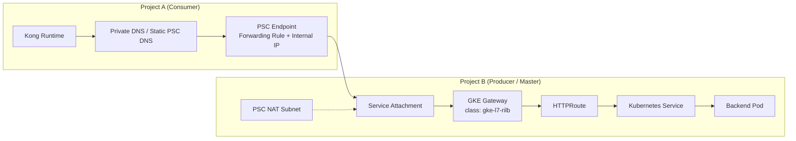

# Project A Kong Runtime 通过 PSC Endpoint 访问 Project B Master GKE Gateway

## 1. Goal and Constraints

### 目标

落地一个最小可验证的跨 Project 私网入口 POC：

```text
Project A Kong Runtime
  -> PSC Endpoint
  -> Project B Service Attachment
  -> Internal LB / GKE Gateway
  -> HTTPRoute
  -> Service
```

核心目的是验证：

- `Project A` 的 `Kong Runtime` 可以不走公网、不做 VPC Peering，私网访问 `Project B`
- `Project B` 不直接暴露业务 Service，只暴露统一入口
- `Project B` 可以基于 `Service Attachment` 控制谁能接入
- 后续可以把这个模式扩展成多个 Consumer Project 访问一个 Master Project

### 约束

- 假设 `Project B` 是服务提供方（Producer / Master Project）
- 假设 `Project A` 是服务消费方（Consumer Project）
- 假设 `Project B` 的 GKE Gateway 使用 `gke-l7-rilb`
- 假设本次先做单 Region POC
- 假设 `Kong Runtime` 通过私有 DNS 或固定私网 IP 访问 PSC Endpoint
- 假设先不引入 Cloud Armor、mTLS、多 Region failover，只做最小可通链路

### 需要先统一的关键认知

- `PSC Endpoint` 连接的是 `Service Attachment`
- `Service Attachment` 指向的是 `Project B` 里某个 Internal Load Balancer 的 forwarding rule
- `GKE Gateway` 本质上会在底层创建并管理 Internal Application Load Balancer
- `Kong` 实际请求的不是 “Gateway 资源对象”，而是 `PSC Endpoint` 的私网 IP 或私有 DNS
- 如果 `HTTPRoute` 依赖 `hostname` 匹配，`Kong` 需要带正确的 `Host` 头

复杂度：`Moderate`

---

## 2. Recommended Architecture (V1)

### 推荐 V1



### 职责分层

**Project A / Kong**

- 对调用方提供统一入口
- 做认证、鉴权、限流、header 注入、path rewrite
- 将上游请求转发到 `Project B` 的 `PSC Endpoint`

**Project B / GKE Gateway**

- 作为 `Master Project` 的统一内部入口
- 根据 `HTTPRoute` 做 host/path 路由
- 将流量转发给对应 namespace/service

**PSC**

- 提供跨 Project、跨 VPC 的私网访问
- 隔离 consumer 与 producer 网络
- 让 producer 通过 accept list 明确控制 consumer

---

## 3. Trade-offs and Alternatives

### 为什么这个方案合理

- 比 VPC Peering 更适合“按服务暴露”，不是暴露整个网络
- 比直接暴露 ILB IP 更适合平台化治理，Producer 能控制 Consumer
- 比把所有治理都放在 B 更清晰，A 负责上游 API 管理，B 负责内部入口

### 代价和限制

- 架构链路更长，排障要看 `Kong -> PSC -> Gateway -> Route -> Service`
- PSC、Gateway、Service Attachment 必须严格按 Region 和 forwarding rule 关系配置
- HTTPRoute 如果做 hostname 匹配，Kong 必须传递正确 Host
- POC 阶段建议先不用双向 mTLS，否则变量太多

### 替代方案

**方案 A：A 直接打 B 的 Internal LB**

- 优点：最简单
- 缺点：Producer 边界控制弱，不利于多租户平台化

**方案 B：A 用 PSC NEG + 自己的 LB 再访问 B**

- 优点：适合 A 侧还要挂自己的 LB 策略
- 缺点：比当前需求复杂
- 结论：如果当前是 `Kong Runtime` 直接发请求，不需要先上 PSC NEG

**方案 C：VPC Peering / VPN / Interconnect**

- 优点：网络层可达
- 缺点：暴露的是网络，不是服务
- 结论：不适合作为共享平台入口标准方案

---

## 4. Implementation Steps

### 4.1 前置条件

需要准备以下信息：

| 项目 | 示例 | 说明 |
|------|------|------|
| Region | `asia-east1` | 建议单 Region 先打通 |
| Project A | `consumer-project` | Kong 所在项目 |
| Project B | `master-project` | GKE Gateway 所在项目 |
| B VPC | `master-vpc` | Producer 网络 |
| A VPC | `consumer-vpc` | Consumer 网络 |
| Gateway 域名 | `master-api.internal.example.com` | 给 HTTPRoute 匹配用 |
| Kong 上游协议 | `HTTP` 或 `HTTPS` | POC 建议先 HTTP，后续再补 TLS |

### 4.2 Project B：部署 GKE Gateway 和后端服务

#### Step 1：准备一个最小后端服务

先在 `Project B` 的 GKE 集群里部署一个 demo workload。

```yaml
apiVersion: apps/v1
kind: Deployment
metadata:
  name: demo-echo
  namespace: gateway-demo
spec:
  replicas: 2
  selector:
    matchLabels:
      app: demo-echo
  template:
    metadata:
      labels:
        app: demo-echo
    spec:
      containers:
        - name: echo
          image: ealen/echo-server:latest
          ports:
            - containerPort: 80
---
apiVersion: v1
kind: Service
metadata:
  name: demo-echo
  namespace: gateway-demo
spec:
  selector:
    app: demo-echo
  ports:
    - name: http
      port: 80
      targetPort: 80
```

应用：

```bash
kubectl create namespace gateway-demo
kubectl apply -f demo-echo.yaml
```

#### Step 2：创建内部 Gateway

使用 `gke-l7-rilb`，让 GKE 为 Gateway 创建 internal Application Load Balancer。

```yaml
apiVersion: gateway.networking.k8s.io/v1
kind: Gateway
metadata:
  name: master-internal-gateway
  namespace: gateway-demo
spec:
  gatewayClassName: gke-l7-rilb
  listeners:
    - name: http
      protocol: HTTP
      port: 80
      allowedRoutes:
        namespaces:
          from: Same
```

```bash
kubectl apply -f gateway.yaml
```

#### Step 3：创建 HTTPRoute

这里显式使用 hostname，方便后续 Kong 通过 `Host` 头命中对应路由。

```yaml
apiVersion: gateway.networking.k8s.io/v1
kind: HTTPRoute
metadata:
  name: demo-echo-route
  namespace: gateway-demo
spec:
  parentRefs:
    - name: master-internal-gateway
  hostnames:
    - "master-api.internal.example.com"
  rules:
    - matches:
        - path:
            type: PathPrefix
            value: /demo
      backendRefs:
        - name: demo-echo
          port: 80
```

```bash
kubectl apply -f httproute.yaml
```

#### Step 4：确认 Gateway 已生成内部地址

```bash
kubectl get gateway -n gateway-demo
kubectl describe gateway master-internal-gateway -n gateway-demo
```

如果你想持续观察状态变化，可以这样看：

```bash
# 等待 Gateway Programmed=True（通常需要 1~3 分钟）
kubectl get gateway -n gateway-demo -w
```

### `Programmed=True` 到底是什么意思

它可以理解为：

- 你在 Kubernetes 里提交的是一个“期望状态”
- GKE Gateway Controller 会读取这个 Gateway 对象
- 然后在 Google Cloud 里实际创建或编排底层资源
- 比如内部负载均衡器、forwarding rule、target proxy、URL map、backend service 等

当 `Programmed=True` 时，表示：

- 这个 Gateway 的配置已经被控制器成功接受
- 底层云资源已经基本创建完成，并且处于可用状态
- 这个 Gateway 已经不只是 “Kubernetes 里有个 YAML 对象”，而是“云侧入口已经真正被编程出来了”

你可以把它理解成：

```text
Accepted=True   -> 控制器看懂并接受了你的配置
Programmed=True -> 控制器已经把配置真正落成了云上的入口资源
```

所以在这一步等待 `Programmed=True`，本质上是在等：

- GKE 把 internal Gateway 对应的 LB 资源创建完成
- Gateway 已经拿到了可用地址
- 后续你去查 forwarding rule、创建 service attachment 才有意义

如果还没到 `Programmed=True`，通常说明下面某一类问题还没处理完：

- Gateway Class 不支持或写错，比如 `gatewayClassName` 不对
- 所在 region / subnet / 集群能力不满足 internal Gateway 要求
- Listener 配置有问题
- HTTPRoute 或 backend service 关联异常
- GCP 侧底层 LB 资源还在创建中
- IAM、配额、VPC 约束导致控制器没法完成资源创建

### 为什么这一步对 PSC 特别重要

后面你要做的是：

```text
Service Attachment -> 指向 Gateway 底层 forwarding rule
```

但只有当 Gateway 已经 `Programmed=True` 时，这个 forwarding rule 才大概率已经存在并稳定。

如果你太早往下做，最常见的问题就是：

- 你根本还找不到 forwarding rule
- 找到的资源还没 ready
- Service Attachment 创建时报 target service 不可用

### 实操上怎么判断够不够继续

建议按下面顺序判断：

1. `kubectl get gateway -n gateway-demo`
2. 确认 `Programmed=True`
3. 再看 `ADDRESS` 是否已经分配
4. 再去 `gcloud compute forwarding-rules list` 查底层 forwarding rule

这样你的排障顺序会清楚很多。

### Gateway 常见状态速查表

| 项目 | 你会在哪里看到 | 含义 | 什么时候可以继续 |
|------|------|------|------|
| `Accepted=True` | `kubectl describe gateway` 的 Conditions | Gateway 配置已经被 controller 接受，语法和基本引用关系大体没问题 | 还不能说明云资源已经创建完成，通常还要继续等 |
| `Programmed=True` | `kubectl describe gateway` 的 Conditions | controller 已经把 Gateway 对应的云侧入口资源创建或编排完成 | 可以继续查 internal address、forwarding rule、Service Attachment |
| `ADDRESS` 已分配 | `kubectl get gateway` | Gateway 已经拿到内部访问地址，一般说明底层 LB 已经有可用入口 | 可以开始做 VPC 内 curl 验证 |
| `ResolvedRefs=True` | 某些 Gateway / Route 的 Conditions 中 | Gateway 或 Route 里引用的对象已经成功解析，比如证书、backend、parentRefs | 适合判断是不是“引用对象不存在”这类问题 |
| `HTTPRoute Accepted=True` | `kubectl describe httproute` | 该 Route 已经被 Gateway 接纳，不是孤儿 Route | 可以继续验证 Host / Path 是否命中 |
| `HTTPRoute ResolvedRefs=True` | `kubectl describe httproute` | Route 里引用的 backend service 等对象已解析成功 | 如果不是 True，通常先查 Service 名称、端口、namespace |

你可以这样理解这些状态的关系：

```text
Gateway YAML 已提交
  -> Accepted=True
  -> Programmed=True
  -> ADDRESS 已出现
  -> HTTPRoute Accepted=True
  -> HTTPRoute ResolvedRefs=True
  -> curl 命中路由并拿到后端响应
```

对于你这个 POC，最关键的是这 4 个检查点：

- Gateway `Programmed=True`
- Gateway `ADDRESS` 已分配
- HTTPRoute 已被接纳
- backend 请求已经能通

你需要确认：

- Gateway 已经 `Programmed=True`
- 已分配内部地址
- 对应底层 forwarding rule 已创建

#### Step 5：在 Project B 创建 PSC NAT Subnet

PSC Producer 需要专用 NAT subnet。

```bash
gcloud compute networks subnets create psc-nat-subnet-master \
  --project=master-project \
  --region=asia-east1 \
  --network=master-vpc \
  --range=10.200.0.0/24 \
  --purpose=PRIVATE_SERVICE_CONNECT
```

#### Step 6：找到 Gateway 对应的 forwarding rule

需要找到 `gke-l7-rilb` 底层创建的 internal Application Load Balancer forwarding rule。

```bash
gcloud compute forwarding-rules list \
  --project=master-project \
  --regions=asia-east1
```

筛选出指向该 Gateway 的 internal forwarding rule 后，记录完整 URI，类似：

```text
projects/master-project/regions/asia-east1/forwardingRules/<gateway-forwarding-rule>
```

#### Step 7：创建 Service Attachment

建议 POC 先用手动审批或显式 accept list。

```bash
gcloud compute service-attachments create sa-master-gateway \
  --project=master-project \
  --region=asia-east1 \
  --target-service=projects/master-project/regions/asia-east1/forwardingRules/<gateway-forwarding-rule> \
  --connection-preference=ACCEPT_MANUAL \
  --consumer-accept-list=consumer-project=10 \
  --nat-subnets=psc-nat-subnet-master
```

查看结果：

```bash
gcloud compute service-attachments describe sa-master-gateway \
  --project=master-project \
  --region=asia-east1
```

记下 `serviceAttachment` URI，后面 A 侧要用：

```text
projects/master-project/regions/asia-east1/serviceAttachments/sa-master-gateway
```

---

### 4.3 Project A：创建 PSC Endpoint

#### Step 8：为 PSC Endpoint 预留内部地址

```bash
gcloud compute addresses create psc-endpoint-ip-master-gw \
  --project=consumer-project \
  --region=asia-east1 \
  --subnet=<consumer-subnet-name> \
  --addresses=10.10.20.10
```

#### Step 9：创建 PSC Endpoint

PSC Endpoint 本质是一个 forwarding rule，目标指向 B 的 service attachment。

```bash
gcloud compute forwarding-rules create psc-endpoint-master-gw \
  --project=consumer-project \
  --region=asia-east1 \
  --network=consumer-vpc \
  --address=psc-endpoint-ip-master-gw \
  --target-service-attachment=projects/master-project/regions/asia-east1/serviceAttachments/sa-master-gateway
```

查看 endpoint：

```bash
gcloud compute forwarding-rules describe psc-endpoint-master-gw \
  --project=consumer-project \
  --region=asia-east1
```

#### Step 10：如果是手动审批，回到 Project B 接受连接

如果 `Service Attachment` 使用的是 `ACCEPT_MANUAL`，需要在 `Project B` 接受 consumer 连接。

```bash
gcloud compute service-attachments get-iam-policy sa-master-gateway \
  --project=master-project \
  --region=asia-east1
```

同时在控制台或通过 `describe` 查看 connection status，确保连接状态进入 `ACCEPTED`。

---

### 4.4 Project A：给 Kong 配置访问方式

#### Step 11：给 PSC Endpoint 配私有 DNS

建议不要让 Kong 直接写死 IP，最好给一个内部域名。

例如在 A 的私有 DNS 中增加：

```text
master-api.internal.example.com -> 10.10.20.10
```

这样 Kong 可以：

- 用域名访问 PSC Endpoint
- 同时把相同域名作为 `Host` 头发给 B 侧 Gateway

#### Step 12：配置 Kong Upstream / Service / Route

如果是 DB-less，可以先写一个最小 declarative 配置：

```yaml
_format_version: "3.0"
services:
  - name: master-project-gateway
    url: http://master-api.internal.example.com
    routes:
      - name: master-project-gateway-route
        paths:
          - /master-demo
        strip_path: false
```

如果你需要把 A 侧 `/master-demo` 转到 B 侧 `/demo`，可以在 Kong 做 rewrite，或者直接把 route 改成和 B 一致。

#### Step 13：确保 Kong 传递正确 Host

如果 B 的 `HTTPRoute` 使用：

```yaml
hostnames:
  - master-api.internal.example.com
```

那么 Kong 转发时必须满足其中一种：

- 直接访问 `http://master-api.internal.example.com`
- 或者访问 endpoint IP，但显式设置 `Host: master-api.internal.example.com`

否则 Gateway 可能匹配不到 `HTTPRoute`。

---

## 5. Validation and Rollback

### 验证顺序

#### 验证 1：先在 Project B 内部验证 Gateway

从集群内或同 VPC 内确认：

```bash
curl -H "Host: master-api.internal.example.com" http://<gateway-internal-ip>/demo
```

预期：

- 返回 demo-echo 响应
- 证明 `Gateway -> HTTPRoute -> Service` 正常

#### 验证 2：验证 PSC 连接状态

在 A、B 两边检查：

```bash
gcloud compute forwarding-rules describe psc-endpoint-master-gw \
  --project=consumer-project \
  --region=asia-east1
```

```bash
gcloud compute service-attachments describe sa-master-gateway \
  --project=master-project \
  --region=asia-east1
```

预期：

- endpoint 已创建成功
- attachment 中能看到 consumer connection
- 连接状态为 `ACCEPTED`

#### 验证 3：从 A 的 Kong Runtime 所在环境直接 curl

如果 Kong 跑在 Pod 里，先进入 Pod 测试：

```bash
curl -H "Host: master-api.internal.example.com" http://10.10.20.10/demo
```

或：

```bash
curl http://master-api.internal.example.com/demo
```

预期：

- 返回 B 的 demo 服务响应

#### 验证 4：走完整 Kong 链路

```bash
curl http://<kong-entry>/master-demo
```

预期：

- 请求进入 Kong
- Kong 转发到 PSC endpoint
- B 侧 Gateway 命中 HTTPRoute
- 后端成功响应

### 建议观察点

- Kong access log / error log
- Gateway controller events
- `kubectl describe httproute`
- backend Pod access log
- PSC attachment connection status

### 回滚策略

按从外到内的顺序回滚：

1. Kong 先移除上游路由
2. 删除 A 侧 PSC Endpoint
3. 删除 B 侧 Service Attachment
4. 删除 Gateway / HTTPRoute
5. 删除 demo workload

这样可以避免还存在流量时先拆 Producer 入口。

---

## 6. Reliability and Cost Optimizations

### POC 后建议补强

#### 1. Gateway 高可用

- GKE 集群用 regional cluster
- demo/backend 至少 2 replicas
- 加 `PodDisruptionBudget`
- 为 gateway backend service 设置合适 request/limit

#### 2. 路由隔离

- 每个 consumer project 独立一个 hostname 或 path 前缀
- 每个租户一个独立 `HTTPRoute`
- 后续可按 service attachment 拆分不同入口域名

#### 3. 安全

- POC 成功后补 `HTTPS`
- 再评估是否要做 `mTLS`
- Producer 用 `ACCEPT_MANUAL` 或精确 consumer allow list
- 不要依赖 source IP 做租户身份识别，优先用 Host、JWT、header

#### 4. 观测

- 在 Kong 注入 `X-Request-Id`
- 让 B 侧应用打印该 request id
- 后续补 Cloud Logging / Metrics / Alerting

#### 5. 成本

- 单 Region 单 endpoint 先验证
- 先不要做双 Gateway / 双 attachment
- 成功后再扩展多 Region failover

---

## 7. Risks and Common Mistakes

### 容易踩坑的地方

#### 1. 把 PSC 理解成“直接连 Gateway 资源”

不是。PSC 连的是 `service attachment`，而 `service attachment` 指向的是 internal LB forwarding rule。

#### 2. 忽略 Region 一致性

- PSC Endpoint 要和 Service Attachment 同 Region
- PSC NAT subnet 要和 Producer LB 同 Region

#### 3. Kong 没带正确 Host

如果 HTTPRoute 依赖 hostname，没带 `Host` 基本就会 404 或未命中路由。

#### 4. 还没验证 Gateway 内部链路就先查 PSC

建议排障顺序固定为：

```text
Service -> HTTPRoute -> Gateway -> Service Attachment -> PSC Endpoint -> Kong
```

#### 5. POC 一开始就上 HTTPS + mTLS + Rewrite + Auth

变量太多。建议顺序：

1. 先 HTTP 打通
2. 再补 Hostname
3. 再补 HTTPS
4. 最后补 mTLS / 鉴权

---

## 8. Handoff Checklist

- [ ] `Project B` 的 Gateway 已经 `Programmed=True`
- [ ] `HTTPRoute` 已命中 backend service
- [ ] 已确认 Gateway 对应 forwarding rule
- [ ] `Service Attachment` 已创建成功
- [ ] `Project A` 的 PSC Endpoint 已创建成功
- [ ] attachment connection status 为 `ACCEPTED`
- [ ] Kong Runtime 能解析私有 DNS 或访问 endpoint IP
- [ ] Kong 已传递正确 Host
- [ ] 从 Kong 入口访问能拿到 B 后端响应
- [ ] 已记录回滚步骤

---

## 9. 最小落地建议

如果你现在的目标只是尽快交 POC，不要一次做全套，建议按下面顺序推进：

1. 在 `Project B` 先打通 `Gateway -> HTTPRoute -> Service`
2. 在 `Project B` 创建 `Service Attachment`
3. 在 `Project A` 创建 `PSC Endpoint`
4. 用 `curl + Host header` 直接验证 endpoint
5. 最后把 `Kong Runtime` 接进去

这样做的好处是每一层都能单独验证，出问题时不会把 `Kong / PSC / Gateway / Service` 混在一起查。

---

## References

- [Private Service Connect overview](https://cloud.google.com/vpc/docs/private-service-connect)
- [Publish services by using Private Service Connect](https://cloud.google.com/vpc/docs/configure-private-service-connect-producer)
- [Access published services through endpoints](https://cloud.google.com/vpc/docs/configure-private-service-connect-services)
- [Deploying Gateways on GKE](https://cloud.google.com/kubernetes-engine/docs/how-to/deploying-gateways)
- [Secure a Gateway on GKE](https://cloud.google.com/kubernetes-engine/docs/how-to/secure-gateway)
