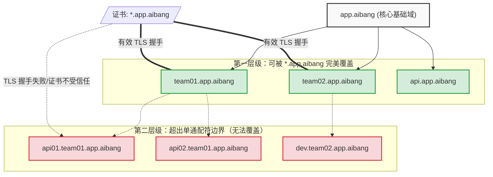

# 泛域名证书（Wildcard Certificate）匹配深度解析

简单来说，您的直觉（觉得一个 * 应该能包罗万象）在很多编程语言的正则表达式里是对的，但在 SSL/TLS 证书的协议规范（RFC 2818） 里是行不通的。这就是为什么那句话提到这是一个架构级别的考量。

核心原因速览：
* 的匹配边界：在泛域名证书中，星号 * 只能代表**“单一层级（Single DNS Label）”，它遇到点号（.）就会停止匹配**。
两层子域的冲突：对于 *.app.aibang：
team01.app.aibang 👉 匹配成功（team01 是没有点号的单一层级）
api01.team01.app.aibang 👉 匹配失败（包含了两层 api01 和 team01，中间有个点号，* 跨不过去）

## 1. 问题分析

如您在文档中所标注的内容：“如果短域名继续用 `api01.team01.app.aibang` 这种两层子域格式，单张 `*.app.aibang` wildcard 证书是覆盖不了的。”

**核心原因在于：SSL/TLS 泛域名证书（Wildcard Certificate）中的星号 `*` 只能代表确切的“单一层级（Single DNS Label）”。** 它无法跨越域名中的分隔点 `.` 进行多层级的递归匹配。

## 2. 核心机制：Wildcard 匹配原理

根据互联网工程任务组 (IETF) 的规范（特别是 **RFC 2818** 和 **RFC 6125** 对 SSL/TLS 通配符匹配行为的定义）：

*   **DNS 标签（Label）**：域名由点 `.` 分隔的多个标签组成。例如 `app.aibang` 包含两个标签：`app` 和 `aibang`。
*   **占位符限制**：通配符 `*` 只能作为一个独立且完整的标签存在（例如 `*.app.aibang`）。
*   **不可跨越点号**：`*` **绝对不能**用来代替包含 `.` 的字符串。因此，`api01.team01` 是两个标签，无法被单一的 `*` 涵盖。

### 匹配规则概览表

假设您平台的核心通配符证书，其 Common Name (CN) 或 Subject Alternative Name (SAN) 为 **`*.app.aibang`**。

| 客户端请求的 FQDN         |      是否匹配       | 匹配原因解析                                                                                            |
| :------------------------ | :-----------------: | :------------------------------------------------------------------------------------------------------ |
| `team01.app.aibang`       |      ✅ **是**       | `team01` 是一个单一的、不含点的标签，完美替换 `*`。                                                     |
| `api.app.aibang`          |      ✅ **是**       | `api` 是单一标签，完美匹配。                                                                            |
| `api01.team01.app.aibang` |      ❌ **否**       | 包含了子级域 `api01` 和 `team01`，用点隔开，`*` 无法匹配中间的 `.`。                                    |
| `app.aibang`              | ❌ **否** (严谨意义) | `*` 通常代表"至少有一个字符"，不包含裸域本身（部分 CA 会赠送裸域 SAN 给通配符，但单看规则是不匹配的）。 |
| `dev.api.app.aibang`      |      ❌ **否**       | 包含两层子级域，同样无法匹配。                                                                          |

## 3. 图解机制

通过下面的架构树状图，我们可以清晰地看到 `*.app.aibang` 证书在纵深方向上的“保护边界”：

*(注意：绿色节点表示处于同一级，通配符匹配成功；红色节点代表超出的跨级域名，匹配失败)*

## 4. 架构影响与应对方案 (为何是架构简化的关键？)

正如原本笔记中所说，这是一项**架构简化决策**。正因为 SSL/TLS 协议底层的这个硬性规定，在进行“短域名命名设计”时，多一层的结构将成倍增加证书管理与网关配置的复杂度。

面对类似 `api01.team01.app.aibang` 这种想要按“团队”及“服务”划分子域的需求，通常有以下几种云原生环境下的架构方案：

### 方案 A：拍平域名层级 (扁平化架构) — ⭐️ 架构师首推实践 (Best Practice)
基于 DNS 的硬性规则，将多层级通过连接符（如 `-` 本身不影响作为 Label 的一部分）拍平成单层。

*   **变更后域名格式**：`api01-team01.app.aibang` (或 `team01-api01.app.aibang`)
*   **证书支持**：完美被一张标准的 `*.app.aibang` 证书覆盖。
*   **优势核心**：
    *   极简架构：GCLB 或 Kong 网关中永远只需挂载并轮换**唯一的一张证书**。
    *   零成本扩展：不论未来再新增多少团队或服务，从网络安全层面上来看是零配置操作的。

### 方案 B：为每个团队分别托管子域通配符
如果业务强规则使得必须保留 `api01.team01.app.aibang` 的层次感。

*   **证书需求**：必须利用自动化 (如 cert-manager) 针对每个团队自动生成他们专属层的通配符：`*.team01.app.aibang`, `*.team02.app.aibang`。
*   **架构形态**：使用 Google Cloud Certificate Manager，结合 GCLB 的 SNI (Server Name Indication) 进行多证书的智能绑定和分发匹配。
*   **劣势挑战**：维护成本上升。GCLB Target HTTPS Proxy 对可附加的常规证书有数量上限（默认 15 个），需重构使用 Certificate Map 资源，这将极大增加自动化 IaC (Terraform) 实施的运维成本。

### 方案 C：使用多域名 (Multi-SAN) 证书（反面模式 / Anti-pattern）
尝试在一张证书把所有层级塞满。

*   **证书内容**：SAN 列表如 `*.app.aibang`, `*.team01.app.aibang`, `*.team02.app.aibang`。
*   **劣势**：毫无扩展性可言。每当一个新的团队入驻此公共平台时，你都不得不去 **重新签发（Revoke and Re-issue）** 这张主证书结构，引入极高的架构不可靠性。

## 5. 结论

将 `*.` 通配符的局限性理解透彻后，我们就不难发现这**并非是特定网关或特定云厂商的局限，而是互联网底层基石（TLS 标准）的共性**。

总结来说，在构建 GKE / Kong 多租户级集群架构时，“短域名怎么设计”不只是产品经理的话语权，而是决定底层基础设施要花多少精力用来“搬砖”运维的关键因素。**直接通过连字符代替小数点，将域名在逻辑上“物理拍平”，是当前云原生世界最主流的降低系统复杂度的手段**。
