### gcloud 操作及错误信息
-  我想跨工程去添加一个 mig 作为 backend service 的后端

gcloud beta compute backend-services add-backend lex-backend \
  --project=projectID1 \
  --region=europe-west2 \
  --instance-group=projects/projectID2/regions/europe-west2/instanceGroups/our-mig \
  --instance-group-region=europe-west2 \
  --balancing-mode=CONNECTION

ERROR：（gcloud.beta.compute.backend-services.add-backend）
Could not fetch resource：
- Invalid value for field 'resource.backends［1］.group'： 'https://compute.googleapis.com/compute/beta/projects/projectID2/regions/europe-west2/instanceGroups/our-mig' Cross-project references for this resource are not allowed.

### cross project cloud armor 
更新后端服务安全策略操作  绑定到 另外一个工程的 cloud Armor 
gcloud compute backend-services update lex-backend \
  --region=europe-west2 \
  --security-policy=projects/projectID2/regions/europe-west2/securityPolicies/projectID2-security-policy

ERROR： （gcloud.compute.backend-services.update） Could not fetch resource：
- Invalid value for field'securityPolicy.securityPolicy'： 'https://compute.googleapis.com/compute/y/projects/projectID2/regions/europe-west2/securityPolicies/projectID2-security-policy' Cross project referencing is not allowed for this resource.

### 测试分析与原理解释

#### 1. 问题分析：您做了什么测试

通过阅读上面的操作命令和报错日志，可以看出您主要进行了基于 GCP 的**跨项目（Cross-Project）资源绑定测试**：

1. **测试一：尝试跨项目绑定 MIG 作为后端**
   您试图在 `projectID1` 的后端服务中，去挂载属于 `projectID2` 的代管式实例组（MIG）资源。
2. **测试二：尝试跨项目绑定 Cloud Armor**
   您试图将属于 `projectID2` 的 Cloud Armor 安全防护策略，强行绑定到另一个项目里的后端服务上。

两次测试的最终报错结论都指向同一原则：`Cross-project referencing is not allowed for this resource.`（由于该资源不支持跨项目引用而失败）。

#### 2. 为什么 Google 不允许这种操作？

GCP 的计算和网络资源在架构设计上有着极为严格的基础边界，不支持上述操作主要基于以下核心原因：

- **原因一：资源隔离与安全边界 [IAM 权限管理]**
  在 GCP 模型中，项目（Project）是绝对的**核心信任、权限隔离和计费边界**。Backend Service、MIG 和 Cloud Armor 都是高度紧密集成的关键资产。如果允许跨项目随意强链接，将导致权限审核（IAM）链路极其复杂（例如：谁有权限停止关联在此处的 MIG？谁又能修改关联的 Cloud Armor 规则？）。为了保障基础设施的安全边界清晰，Google 强制要求此类资源必须局限在同一个 Project 内闭环。

- **原因二：防范级联故障与生命周期管理 [Lifecycle Management]**
  如果 `Project A` 的 Backend Service 的健康运行直接拉取并依赖于 `Project B` 的 MIG 或 Armor 策略，一旦 `Project B` 的管理员在不知情的情况下修改或者删除了底层依赖资源，会导致 `Project A` 的业务“隐性”且“瞬间”不可用。禁止原生的跨项目直接引用，能切断此类不可见的“跨项目隐式黑盒依赖”，大幅提高各项目的容灾性和独立性。

- **原因三：云原生计费与结算分离**
  后端服务（流量接入、网络出口计费）、Cloud Armor（WAF 规则条目及其处理请求量）与 MIG（底层的虚机计算实例）分属不同的计费体系模块。只有强制将它们规划在同一项目内，云平台才能准确地测算、归集以及结算多租户资源成本。

#### 3. 架构解决方案与最佳实践推荐

如果您在多团队、多租户的复杂架构中，确实需要实现跨项目的服务互通或者集中安全管理，可以采用以下经生产验证的最佳实践方案：

**解决跨网络服务互通 [Backend 互通]：**
1. **统一的 Service Project 模式 [Shared VPC 体系]**：采用“集中管理网络，分散管理业务”的思路。将负载均衡器、Backend Service 和 MIG 全部统一部署在**同一个 Service Project** 中内聚，并通过 Host Project 分配的 Shared VPC 子网连通外网业务。
2. **PSC 私有服务连接 [Private Service Connect]**：如果想要实现多项目解耦式通信，建议在 `ProjectID2` 将 MIG 用同项目的 Internal LB 进行包装，并通过 PSC 机制以 `Service Attachment` 暴露；随后在 `ProjectID1` 中利用 `PSC Endpoint` 从网络层直联该应用。

**解决策略集中化管理 [Cloud Armor 统一下发]：**
1. **IaC 自动化流水线分发**：Cloud Armor **不支持**跨项目直接挂载。您必须在有 Backend Service 的所有 Project 手动/自动创建出平行的 Cloud Armor Policy。比较好的做法是：结合 Terraform 工程化或 CI/CD 流水线，将同一套最佳实践的 WAF 规则代码化自动化推流下发到所有的服务项目。
2. **使用层级防火墙 [Hierarchical Firewall Policies]**：如果安全防线是阻断特定的僵尸网络网段、IP 或者黑名单端口，可以在更上层的组织的 **文件夹 [Folder]** 或 **组织 [Organization]** 级别统一下发防护策略，作用力将向下穿透覆盖所有的 Project。

#### 4. 架构示意图

```mermaid
graph TD
    subgraph "❌ 错误的跨项目架构 [不支持]"
        A1["Project 1: Backend Service"] -->|"跨项目直接挂载 MIG - 被拒绝"| B1["Project 2: MIG"]
        C1["Project 2: Cloud Armor"] -.->|"跨项目绑定策略 - 被拒绝"| A1
    end

    subgraph "✅ 替代架构 A [同项目资源闭环]"
        A2["Service Project: Backend Service"] -->|"同项目挂载"| B2["Service Project: MIG"]
        C2["Service Project: Cloud Armor"] -.->|"同项目绑定"| A2
    end
    
    subgraph "✅ 替代架构 B [PSC 跨项目发布]"
        A3["Consumer Project 1: PSC Endpoint"] -->|"安全的跨项目发布"| B3["Producer Project 2: PSC Service Attachment"]
        B3 --> C3["Producer Project 2: Internal LB"]
        C3 --> D3["Producer Project 2: MIG"]
    end
```

