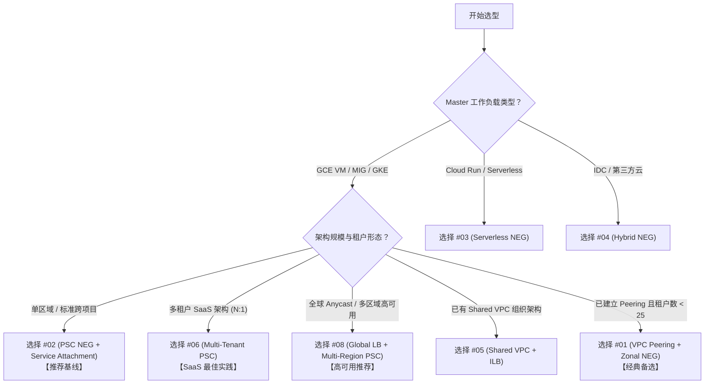

# 跨项目架构探索：Tenant Ingress + Master Backend 隔离方案深度评估

本文档是对原 HTML 架构评估文档 `cross-project-exploration-tenant-master-isolation.html` 的深度技术验证与可行性探索报告。本文档针对用户提出的**硬性约束（Hard Constraints）**，逐一核实 8 种候选架构在 Google Cloud (GCP) 平台上的技术可行性、边界限制与落地实践路径。

---

## 一、 核心硬性约束 (Hard Constraints) 验证

在评估具体架构前，首先对要求中的 4 项核心硬性约束进行 GCP 平台层面的技术合法性校验：

| 硬性约束要求 | GCP 技术机制验证 | 结论 |
| :--- | :--- | :--- |
| **1. Tenant 项目掌控 Ingress & 绑定 Cloud Armor** | Cloud Armor 安全策略（Security Policy）可以直接绑定在 Tenant 项目的 External HTTPS Load Balancer 的 **Backend Service** 上。所有公网流量在 Tenant 边缘即完成 TLS 终止与 WAF 规则评估。 | **完全可行 (Valid)** |
| **2. Master 项目掌控后端工作负载与调度** | 真实业务服务（MIG / GKE / Cloud Run）及二层内部负载均衡器（ILB）部署在 Master 项目，不对公网暴露任何 IP，仅通过私有 bridge 接收 Tenant 选路后的流量。 | **完全可行 (Valid)** |
| **3. 两项目双 VPC（或 Shared VPC），无需网段 Peering** | 借由 Private Service Connect (PSC)、Serverless NEG 或 Shared VPC 等机制，可实现无 VPC Peering 的跨项目服务级连接，甚至允许网段重叠（Overlapping CIDRs）。 | **完全可行 (Valid)** |
| **4. Tenant 级别服务隔离（Tenant Isolation）** | 流量控制权在 Tenant 侧（由 Tenant Backend Service 决定选路与防护）；控制面放行权在 Master 侧（通过 Service Attachment 的 `consumer-accept-list` 精准放行特定 Tenant 项目）。 | **完全可行 (Valid)** |

---

## 二、 8 种候选架构可行性深度探索

### Strategy #01: VPC Peering + Private LB (Zonal NEG 级联)

```
[Tenant Project]
Client -> External HTTPS LB -> Backend Service (+ Cloud Armor) 
                                      ↓
                         Zonal NEG (NON_GCP_PRIVATE_IP_PORT)
                                      ↓ (VPC Peering)
[Master Project]               Master ILB VIP:Port -> MIG / GKE
```

*   **可行性**: **完全可行 (已验证)**（对应工程验证文档 `cross-project-success-two.md`）。
*   **实现原理**: Tenant 项目的 External LB 将 Backend Service 后端配置为 `NON_GCP_PRIVATE_IP_PORT` 类型的 Zonal NEG，直接指向 Master 项目中 ILB 的私有 VIP:Port。跨项目连通性由 VPC Peering 提供。
*   **满足硬约束评估**:
    *   Cloud Armor 在 Tenant 侧 Backend Service 生效？**是**。在流量打向跨项目 NEG 前，已完成 WAF 校验。
*   **坑点与限制**:
    1.  **网段强互斥**：VPC Peering 要求两侧 VPC 网段绝不能重叠。
    2.  **Peering 配额上限**：每个 VPC 最多支持 25 个 Peering 连接（若 Tenant 数量 > 25 则无法扩展）。
    3.  **跨 VPC 健康检查**：Tenant 的 Backend Service 必须发起跨 Peering 到 Master ILB VIP 的健康检查，Master VPC 的防火墙需放行 Tenant 健康检查网段。

---

### Strategy #02: PSC NEG + Service Attachment (Google 官方推荐基线)

```
[Tenant Project]
Client -> External HTTPS LB -> Backend Service (+ Cloud Armor) 
                                      ↓
                                  PSC NEG
                                      ↓ (Google Backbone / PSC Tunnel)
[Master Project]            Service Attachment (ACCEPT_MANUAL)
                                      ↓
                                 Master ILB -> MIG / GKE
```

*   **可行性**: **完全可行 (官方推荐级)**（对应工程验证文档 `public-tls-cross-project-implementation.html` 和 `3.md`）。
*   **实现原理**: Master 项目配置 Service Attachment 并关联一个 `purpose=PRIVATE_SERVICE_CONNECT` 的专用 NAT 子网；Tenant 项目创建 `PRIVATE_SERVICE_CONNECT` 类型的 NEG 指向该 Service Attachment。
*   **满足硬约束评估**:
    *   Cloud Armor 在 Tenant 侧 Backend Service 生效？**是**。
    *   独立 VPC 与网段重叠？**支持**（PSC 在 Master 侧进行 SNAT，无需 VPC Peering）。
*   **关键技术细节**:
    1.  **`--allow-global-access` 参数**：若 Tenant 的 External LB 为 Global (`EXTERNAL_MANAGED`)，Master 项目的 ILB 前端规则 (Forwarding Rule) **必须显式开启 `--allow-global-access`**，否则跨区或全局 LB 流量无法打通。
    2.  **无需跨项目健康检查**：PSC NEG 由 Google 骨干网原生维持连通性，Tenant 侧无需配置健康检查。
    3.  **真实客户端 IP 透传**：PSC 会进行 SNAT（源 IP 替换为 Master 侧 PSC NAT 子网 IP）。若需审计客户端真实 IP，需在 Service Attachment 上开启 `--enable-proxy-protocol`，并在 Master 后端服务（如 Nginx/Envoy）开启 Proxy Protocol 解析。

---

### Strategy #03: Serverless NEG -> Cloud Run in Master

```
[Tenant Project]
Client -> External HTTPS LB -> Backend Service (+ Cloud Armor)
                                      ↓
                               Serverless NEG
                                      ↓ (GCP Internal Route)
[Master Project]              Cloud Run Service (Serverless Workload)
```

*   **可行性**: **条件可行（仅限 Master 后端为 Serverless 架构）**。
*   **实现原理**: Tenant 项目的 Backend Service 绑定 Serverless NEG，填入 Master 项目中 Cloud Run 的服务名称或 URL。
*   **满足硬约束评估**:
    *   Cloud Armor 在 Tenant 侧生效？**是**。
*   **关键技术细节**:
    1.  **IAM 授权**：Tenant 侧 LB 的服务账号或调用方需要拥有 Master 项目 Cloud Run 的 `roles/run.invoker` 角色；或者将 Cloud Run 入口设置为仅接受内部流量与 LB。
    2.  **局限性**：不适用于传统 GCE VM MIG 或原生 GKE 集群（除非前面再挂一层 Cloud Run 做中转）。

---

### Strategy #04: Hybrid Connectivity NEG -> On-prem / Other Cloud

```
[Tenant Project]
Client -> External HTTPS LB -> Backend Service (+ Cloud Armor)
                                      ↓
                             Hybrid Zonal NEG (NON_GCP_PRIVATE_IP_PORT)
                                      ↓ (Cloud VPN / Interconnect)
[Master / On-prem]            IDC / AWS / Azure 外部工作负载
```

*   **可行性**: **完全可行（适用于混合云/跨云场景）**。
*   **实现原理**: 使用 Hybrid NEG 将线下机房或第三方云（AWS/Azure）的私有 IP 填入 NEG endpoint，通过 Cloud VPN 或 Interconnect 打通网络。
*   **评估**: 属于补充拓展架构。如果 Master 部署在 GCP 内部，优先使用 #02 (PSC)。

---

### Strategy #05: Shared VPC + Cross-Project ILB

```
[Shared VPC Host Project Network]
  ├── [Tenant Service Project] Client -> Ext LB -> Backend Svc (+ Armor) -> Zonal NEG
  └── [Master Service Project] Master VM / MIG (同一 VPC 子网)
```

*   **可行性**: **完全可行（需具备 Shared VPC 组织架构）**。
*   **实现原理**: Tenant 和 Master 均为同一个 Host Project 的 Service Project。网络资源共享，Tenant 的 Zonal NEG 直接填入 Master VM 在共享子网中的私网 IP。
*   **满足硬约束评估**:
    *   Cloud Armor 在 Tenant 侧生效？**是**。
*   **坑点与限制**:
    1.  **需要 Organization 组织管理者权限**：需要创建 Shared VPC 并授予 `roles/compute.networkUser` 权限。
    2.  **网络隔离度较低**：两侧工作负载处于同一 VPC，网络安全强依赖防火墙规则（Service Account 标签隔离）而非网络物理边界。

---

### Strategy #06: Multi-Tenant PSC (N Tenants -> 1 Master SaaS 模型)

```
[Tenant A Project] Ext LB + Cloud Armor + PSC NEG A ──┐
[Tenant B Project] Ext LB + Cloud Armor + PSC NEG B ──┼──> [Master Project] 1 Service Attachment
[Tenant C Project] Ext LB + Cloud Armor + PSC NEG C ──┘     (consumer-accept-list = [A, B, C...])
                                                                   ↓
                                                              Master ILB -> Shared Backend
```

*   **可行性**: **完全可行（SaaS 多租户标杆架构）**。
*   **实现原理**: Master 项目仅暴露一个 Service Attachment，将所有合法 Tenant 项目加入 `consumer-accept-list`。每个 Tenant 在各自项目内构建独立的外网入口、SSL 证书、专属域名及 Cloud Armor 策略，通过各自的 PSC NEG 连接到 Master 的同一个 Service Attachment。
*   **满足硬约束评估**:
    *   完美实现租户隔离：每个租户拥有完全独立的 WAF 防护、日志归集与域名配置；Master 可一键撤销特定 Tenant 的 `consumer-accept-list` 访问权。
*   **配额与扩展考量**:
    *   **PSC 端点配额**：每个 Master Service Attachment 默认支持连接多个 Consumer。需注意 Region 级别的 PSC Endpoints 配额（可通过 GCP 申请提升至 100+）。

---

### Strategy #07: GKE Gateway API + Workload Identity (K8s 原生)

```
[Tenant GKE Cluster]
GKE Gateway -> HTTPRoute + GCPBackendPolicy (Cloud Armor) -> KSA/GSA WIF
                                                                   ↓ (GCP IAM / Internal)
[Master GKE Cluster]                             GKE Service + Backend (MIG/Pod)
```

*   **可行性**: **完全可行（纯 GKE 云原生环境推荐）**。
*   **实现原理**: 在 Tenant GKE 中使用 Gateway API（`gateway.networking.k8s.io`），通过 CRD `GCPBackendPolicy` 挂载 Cloud Armor 策略。利用 Workload Identity (WIF) 实现跨项目的 KSA 到 GSA 身份映射与权限调用。
*   **评估**: 适合云原生 Kubernetes 团队。若涉及到跨 Region，通常配合 #02 (PSC) 共同使用。

---

### Strategy #08: Global External LB + Multi-Region PSC NEG (生产高可用)

```
[Tenant Project]
Global Ext HTTPS LB (`EXTERNAL_MANAGED`) -> Backend Service (+ Cloud Armor)
                                               ├──> PSC NEG (Region 1: europe-west2) ──> Master SA (Region 1)
                                               └──> PSC NEG (Region 2: us-east4)   ──> Master SA (Region 2)
```

*   **可行性**: **完全可行（生产级跨区域高可用架构）**。
*   **实现原理**: Tenant 项目部署全局外网负载均衡器，在同一个 Backend Service 下挂载多个不同 Region 的 PSC NEG。流量根据用户地理位置 Anycast 路由到最近区域的 PSC NEG，再进入 Master 项目对应 Region 的 Service Attachment 和后端集群。
*   **满足硬约束评估**: 满足所有硬约束，且具备跨区域容灾能力。若某一区域 Master 集群故障，Global LB 会自动拉离流量。

---

## 三、 候选架构综合对比矩阵 (Comparison Matrix)

| # | 架构名称 | 跨项目连接机制 | Cloud Armor 绑定点 | 租户隔离级别 | 扩展性 (N 租户) | MIG/GKE 支持 | 评估结论 |
| :--- | :--- | :--- | :--- | :--- | :--- | :--- | :--- |
| **01** | **VPC Peering + Private LB** | VPC Peering | Tenant Backend Svc | L3 防火墙 + L7 | 受限于 25 Peering 限额 | **完全支持** | 🟢 可行 (已验证) |
| **02** | **PSC NEG + Service Attachment** | Private Service Connect | Tenant Backend Svc | L7 + IAM 审批表 | 高 (PSC 配额可调) | **完全支持** | 🌟 **推荐基线 (已验证)** |
| **03** | **Serverless NEG -> Cloud Run** | GCP 内部路由 | Tenant Backend Svc | L7 + IAM 角色 | 高 | 🔴 仅限 Cloud Run | 🟡 特定场景可行 |
| **04** | **Hybrid NEG + VPN** | Cloud VPN / Interconnect | Tenant Backend Svc | L3 隧道 + L7 | 中 | 🟡 仅限 IDC/外云 | ⚪ 线下混合云适用 |
| **05** | **Shared VPC + ILB** | 共享 VPC 网络 | Tenant Backend Svc | L7 + 共享网络 IAM | 高 | **完全支持** | 🟡 依赖组织级权限 |
| **06** | **Multi-tenant PSC (N:1)** | PSC 多租户端点 | 各 Tenant 独立 Backend Svc | L7 + WAF + 审批表 | 极高 (SaaS 模型) | **完全支持** | 🌟 **SaaS 最佳实践** |
| **07** | **GKE Gateway API + WIF** | K8s Gateway + WIF | Tenant GCPBackendPolicy | L7 + K8s RBAC | 高 | 🟡 仅限 GKE | 🔵 K8s 云原生推荐 |
| **08** | **Global LB + Multi-Region PSC** | 多区域 PSC NEG | Tenant Global Backend Svc | L7 + 区域多活隔离 | 极高 (全球容灾) | **完全支持** | 🌟 **生产高可用推荐** |

---

## 四、 选型决策树与落地建议

根据您的业务场景与硬性约束，推荐的选型路径如下：



### 总结建议：
1. **优先推荐 #02 (PSC NEG + Service Attachment)**：完全满足您的所有 Hard Constraints。安全边界清晰，Tenant 侧完全掌管 Cloud Armor 与入口证书，Master 侧完全掌控控制面放行与工作负载。
2. **对于多租户扩展，选择 #06 (Multi-Tenant PSC)**： Master 只需维持一套服务发布点（Service Attachment），各个 Tenant 独立部署外网 Ingress 与 Cloud Armor 策略，具备极高的工程可扩展性。
