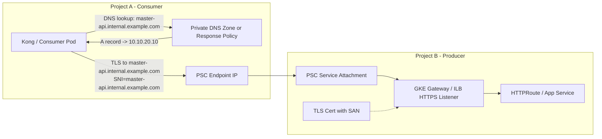

# Cross-Project PSC FQDN with SAN

## 1. Goal and Constraints

目标：在跨 Project 的 PSC 场景中，让 Consumer 侧通过一个 **稳定的 FQDN** 访问 Producer 侧的私有服务，并且在 HTTPS/TLS 场景下通过 **SNI + SAN** 完成证书校验。

结合现有文档：

- [rt-psc-gateway.md](/Users/lex/git/knowledge/gcp/cross-project/rt-psc-gateway.md)
- [rt-cross-project-fqdn.md](/Users/lex/git/knowledge/gcp/cross-project/rt-cross-project-fqdn.md)

当前问题可以拆成两个部分：

1. **Private DNS / Response Policy**
   负责把 `master-api.internal.example.com` 解析到 Consumer 侧的 PSC Endpoint IP。
2. **SAN / TLS 证书**
   负责让 Producer 返回的证书能够合法匹配 `master-api.internal.example.com`，从而让 HTTPS/SNI 校验通过。

核心结论先说清楚：

**SAN 是解决 PSC FQDN 场景的关键组成部分，但 SAN 不能替代 Private DNS。**

- DNS 解决“域名解析到哪里”
- SAN 解决“这个域名是不是这张证书合法服务的名字”

所以真正的生产方案不是“只用 SAN”，而是：

**`PSC + Private DNS/Response Policy + SAN 覆盖的证书 + 正确的 SNI/Host`**

复杂度：`Moderate`

---

## 2. Recommended Architecture (V1)

### 2.1 方案摘要

推荐采用下面这条链路：



### 2.2 设计原则

- Consumer 侧永远使用 **域名** 发起请求，不直接使用 PSC IP。
- Consumer 侧通过 Private DNS 或 Response Policy，把该域名解析到 PSC Endpoint IP。
- Producer 侧 HTTPS 监听器绑定的证书，**SAN 必须覆盖 Consumer 要访问的 FQDN**。
- TLS 握手时，客户端会自动把目标域名作为 SNI 发给 Producer。
- Producer 侧 Gateway / Kong / Ingress 用该证书返回握手响应，客户端再基于 SAN 完成校验。

---

## 3. SAN 在这个场景里到底解决什么

在 PSC FQDN 场景里，SAN 解决的是：

- `https://master-api.internal.example.com` 这种域名请求是否能通过证书校验
- Gateway / Kong 是否能基于 SNI 和 Host 识别正确的服务入口
- 一个证书是否可以同时覆盖多个 private FQDN

它不解决的事情是：

- PSC Endpoint IP 怎么分配
- 域名怎么解析到 PSC IP
- 哪个 Consumer Project 被允许接入

也就是说：

### SAN 负责“名字合法”

例如 SAN 里有：

- `master-api.internal.example.com`
- `tenant-a-api.internal.example.com`
- `*.svc.internal.example.com`

那么这些域名在 TLS 层就是合法的。

### Private DNS / Response Policy 负责“名字指向哪里”

例如：

- `master-api.internal.example.com -> 10.10.20.10`

这样 Consumer 才能真正把 TCP/TLS 连接打到 PSC Endpoint。

---

## 4. 什么时候 SAN 是一个好办法

### 4.1 固定少量 FQDN

例如只有这些域名：

- `master-api.internal.example.com`
- `admin-api.internal.example.com`
- `report-api.internal.example.com`

推荐：

- 使用一张多 SAN 证书
- 在 Private DNS / Response Policy 中为每个域名映射一个 PSC Endpoint IP，或多个域名共用同一个 PSC IP

适用度：`高`

### 4.2 有规律的子域名体系

例如：

- `tenant-a.svc.internal.example.com`
- `tenant-b.svc.internal.example.com`
- `tenant-c.svc.internal.example.com`

推荐：

- 若租户数量多且结构稳定，可考虑 wildcard，例如 `*.svc.internal.example.com`

适用度：`高`

### 4.3 共享 Gateway 承载多个内部服务

如果 Producer 侧是一个共享 HTTPS Gateway，它承载多个内部服务入口，那么 SAN 能很好地支持：

- 多个独立 FQDN 共用同一个 Listener
- 一个 Gateway 通过 Host/SNI 路由到不同 HTTPRoute / backend

适用度：`高`

---

## 5. 什么时候 SAN 不是单独的答案

下面几种情况，单靠 SAN 不够：

### 5.1 只配置证书，不配置 Private DNS

即使 SAN 完全正确，如果 Consumer 无法把 FQDN 解析到 PSC Endpoint IP，请求依然到不了 Producer。

### 5.2 Consumer 直接访问 PSC IP

如果访问：

```bash
curl https://10.10.20.10/demo
```

即使 Producer 证书 SAN 里有 `master-api.internal.example.com`，通常也不会匹配 IP 请求。

除非证书 SAN 里显式包含 `IP:10.10.20.10`，但这在 PSC 场景通常不是好实践，因为：

- PSC IP 更适合作为网络实现细节
- IP 不利于长期运维和变更
- 一旦变动，需要重新发证

### 5.3 域名变化频繁但靠手工维护 SAN

如果域名会频繁新增，单张大 SAN 证书会变得很难维护。这时应该考虑：

- wildcard
- 自动化签发
- 托管证书

---

## 6. 推荐实现模式

这里给出三种落地模式。

### 模式 A：单个内部域名 + 单个 PSC 服务

示例：

- FQDN: `master-api.internal.example.com`
- PSC Endpoint IP: `10.10.20.10`
- SAN: `master-api.internal.example.com`

特点：

- 最简单
- 最容易排障
- 最适合先做 V1

### 模式 B：多 FQDN 共用一套 Gateway

示例：

- `master-api.internal.example.com`
- `admin-api.internal.example.com`
- `metrics-api.internal.example.com`

证书 SAN 覆盖上述多个域名，Gateway 根据 Host/SNI 分流。

特点：

- 适合共享入口
- 证书管理集中
- 需要控制 SAN 膨胀

### 模式 C：规则化子域 + wildcard SAN

示例：

- `tenant-a.svc.internal.example.com`
- `tenant-b.svc.internal.example.com`
- wildcard SAN: `*.svc.internal.example.com`

特点：

- 适合多租户
- 适合服务数量多
- 私钥风险面更大，必须加强访问控制

---

## 7. How To 实现

下面按生产上真正可执行的顺序给出步骤。

### Step 1：先确定你要暴露的 FQDN 设计

先定义命名规则，不要先签证书再想域名。

推荐优先级：

1. 固定单域名
   `master-api.internal.example.com`
2. 多服务独立域名
   `service-a.internal.example.com`
   `service-b.internal.example.com`
3. 规则化子域
   `tenant-x.svc.internal.example.com`

建议：

- 内部私有调用域名与公网域名分离
- 不要直接复用对外公网域名，除非你非常确定 DNS 视图和证书边界

### Step 2：确定 SAN 策略

#### 选项 A：精确 SAN

适合固定域名少量场景：

```text
DNS:master-api.internal.example.com
DNS:admin-api.internal.example.com
```

#### 选项 B：wildcard SAN

适合规则化子域：

```text
DNS:*.svc.internal.example.com
```

建议判断标准：

- 域名少且稳定：优先精确 SAN
- 域名多且规则稳定：考虑 wildcard
- 域名多且变化快：考虑自动化签发，不要靠人工维护超大 SAN

### Step 3：在 Producer 侧部署 HTTPS Listener 和证书

Producer 侧的 Gateway / Kong / Ingress 必须真正监听 HTTPS，并挂上 SAN 覆盖正确的证书。

逻辑上至少要满足：

- Listener 监听 `443`
- 证书 SAN 包含目标 FQDN
- HTTPRoute / Ingress hostnames 与 FQDN 一致

示意：

```yaml
listeners:
  - name: https
    protocol: HTTPS
    port: 443
```

关键检查项：

- `Host` 是不是 `master-api.internal.example.com`
- SNI 是不是 `master-api.internal.example.com`
- 返回证书 SAN 是否真的包含这个域名

### Step 4：创建 PSC Service Attachment 和 Endpoint

这部分沿用 [rt-psc-gateway.md](/Users/lex/git/knowledge/gcp/cross-project/rt-psc-gateway.md) 的做法：

- Producer Project:
  - 创建 Gateway / ILB
  - 创建 PSC NAT Subnet
  - 创建 Service Attachment
- Consumer Project:
  - 创建 PSC Endpoint forwarding rule
  - 预留内部 IP

这一步 SAN 不参与，它只负责把 L4 路打通。

### Step 5：在 Consumer 侧配置 Private DNS 或 Response Policy

示例一：Private DNS Zone

```bash
gcloud dns record-sets create master-api.internal.example.com. \
  --project=${PROJECT_A} \
  --zone=internal-example \
  --type=A \
  --ttl=300 \
  --rrdatas=10.10.20.10
```

示例二：Response Policy

```bash
gcloud dns response-policies rules create rule-master-api \
  --project=${PROJECT_A} \
  --response-policy=psc-response-policy \
  --dns-name="master-api.internal.example.com." \
  --local-data=name="master-api.internal.example.com.",type="A",ttl=300,rrdatas="10.10.20.10"
```

关键点：

- Consumer 发起的是 `https://master-api.internal.example.com`
- 解析结果是 `10.10.20.10`
- TLS 里的 SNI 仍然是 `master-api.internal.example.com`

### Step 6：验证 SAN 是否真的生效

先验证 DNS：

```bash
nslookup master-api.internal.example.com
```

再验证 HTTPS：

```bash
curl -v https://master-api.internal.example.com/demo
```

如果证书链是私有 CA：

```bash
curl -v --cacert /etc/ssl/producer-ca.crt \
  https://master-api.internal.example.com/demo
```

如果 DNS 还没配好，临时验证 SAN/SNI 可用性：

```bash
curl -v --resolve master-api.internal.example.com:443:10.10.20.10 \
  https://master-api.internal.example.com/demo
```

这里 `--resolve` 的价值非常高，因为它可以验证：

- PSC 链路是否通
- HTTPS Listener 是否通
- SAN 是否匹配
- SNI/Host 是否正确

而不需要先完全依赖 DNS。

---

## 8. 推荐配置样板

### 8.1 单域名内部服务

适合当前 V1：

- FQDN: `master-api.internal.example.com`
- SAN:
  - `master-api.internal.example.com`

优点：

- 清晰
- 稳定
- 容易审计

### 8.2 多服务共享内部域

适合一个共享 Gateway：

- SAN:
  - `master-api.internal.example.com`
  - `admin-api.internal.example.com`
  - `report-api.internal.example.com`

优点：

- 节省证书管理成本
- 适合共享入口

风险：

- SAN 膨胀
- 单证书影响面扩大

### 8.3 多租户 wildcard

适合租户域名规则统一：

- SAN:
  - `*.svc.internal.example.com`

优点：

- 非常适合租户扩张

风险：

- 私钥价值更高
- 必须用严格 IAM、审计、轮换和密钥托管

---

## 9. Validation and Rollback

### 验证清单

- [ ] Consumer 侧域名解析结果是否为 PSC Endpoint IP
- [ ] Producer 侧 Listener 是否已监听 HTTPS/443
- [ ] Producer 返回证书 SAN 是否包含目标 FQDN
- [ ] Consumer 请求时是否自动带上正确 SNI
- [ ] HTTPRoute / Gateway / Kong 是否按 Host 正常命中后端
- [ ] 使用系统 CA 或私有 CA 时，证书链是否完整

### 回滚思路

如果切 HTTPS/SAN 后出现问题，优先按下面顺序回退：

1. 保留 PSC 和 DNS，不动网络层
2. 回退 Producer 侧 Gateway / Kong 的证书或 Listener 配置
3. 用 `--resolve` 单独验证证书与 SNI
4. 必要时临时回到 HTTP POC 继续验证网络与路由

这样可以避免把 DNS、PSC、TLS 三层问题混在一起。

---

## 10. Reliability and Cost Optimizations

### 可靠性建议

- 优先从单 FQDN 开始，不要一上来设计大 SAN
- SAN 只覆盖当前明确需要的域名，避免把未来可能用到的名字一次性全塞进去
- 为证书轮换预留验证窗口，避免一次切多个域名
- 对共享 Gateway，建立 SAN 与路由配置的变更清单

### 成本与复杂度建议

- 少量稳定域名：多 SAN 证书最划算
- 规则化大规模子域：wildcard 更省运维
- 高频变化域名：自动化证书签发更省长期成本

---

## 11. Handoff Checklist

- [ ] 已定义 Consumer 访问使用的正式 FQDN
- [ ] 已决定 SAN 策略：精确 SAN / wildcard / 自动化签发
- [ ] 已确认 Producer 侧证书来源与轮换方式
- [ ] 已确认 Private DNS Zone 或 Response Policy 方案
- [ ] 已完成 `--resolve` 场景下的 HTTPS/SAN 验证
- [ ] 已完成 Consumer 实际运行环境中的 curl / Kong 验证
- [ ] 已形成 SAN 增减的变更流程和责任边界

---

## 12. Final Recommendation

对你当前这个 PSC Private DNS 场景，我的建议是：

### V1 最现实的落地方式

- 保持现有 `PSC + Private DNS/Response Policy` 思路
- 先给 Producer 侧配置一个只覆盖单域名的证书：
  - `master-api.internal.example.com`
- Consumer 永远使用这个 FQDN 发起 HTTPS 请求

这是最稳、最好排障、也最符合生产演进路径的做法。

### V2 再考虑扩展

如果后续你要支持：

- 多个内部服务域名
- 多租户
- 更复杂的共享入口

再扩展为：

- 多 SAN 证书
- 或 wildcard SAN

但前提是先把：

- DNS 命名规范
- 证书托管方式
- 私钥访问控制
- SAN 变更流程

这四件事定下来。

一句话总结：

**SAN 不是 PSC FQDN 的替代品，而是让 PSC FQDN 在 HTTPS/SNI 场景下真正可用的证书层补全。**
