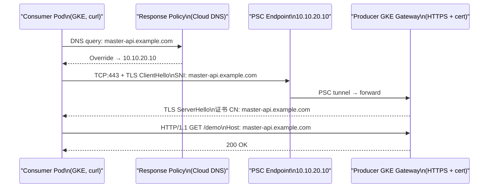

## 问题分析
: Best Practices for Consumer-side Access to HTTPS/SNI Services via PSC

你的场景本质是：**Consumer 侧通过 PSC Endpoint（私网 IP）访问 Producer 的 HTTPS 服务，TLS 证书是颁发给域名的，不是颁给 IP 的。**

核心矛盾点：

```
curl https://10.10.20.10/path        # ❌ 证书 CN 不匹配，TLS 握手失败
curl https://master-api.example.com  # ✅ 域名匹配证书，但 DNS 要能解析到 PSC Endpoint IP
```

你用 Response Policy 解决了 DNS 解析问题，这个思路是对的，也是 GCP 推荐的方式之一。

---

## 最佳实践方案对比

| 方案                                | 原理                                                   | 适用场景                 | 推荐度   |
| ----------------------------------- | ------------------------------------------------------ | ------------------------ | -------- |
| **Response Policy（你现在的方案）** | Cloud DNS Response Policy 将域名覆写为 PSC Endpoint IP | 跨 Project，域名统一管理 | ✅ 推荐   |
| Private DNS Zone（A记录）           | 在 Consumer VPC 创建私有 Zone，直接 A 记录指向 PSC IP  | 单 Project 或简单场景    | ✅ 推荐   |
| `/etc/hosts` 或 Pod hostAliases     | 节点/Pod 级别硬绑定                                    | 临时调试，不可用于生产   | ⚠️ 仅调试 |
| 显式传 `--resolve`                  | curl 层面绕过 DNS                                      | 临时 curl 验证           | ⚠️ 仅调试 |

---

## 推荐方案：Response Policy（生产级）

你已经在用，这是 GCP 跨 Project PSC 场景的**标准做法**，正式确认下完整配置：

```bash
# 在 Consumer Project 的 VPC 绑定 Response Policy
gcloud dns response-policies create psc-response-policy \
  --project=consumer-project \
  --networks=consumer-vpc \
  --description="PSC endpoint DNS override"

# 将 Producer 域名覆写为 PSC Endpoint IP
gcloud dns response-policies rules create rule-master-api \
  --project=consumer-project \
  --response-policy=psc-response-policy \
  --dns-name="master-api.example.com." \
  --local-data=name="master-api.example.com.",type="A",ttl=300,rrdatas="10.10.20.10"
```

验证：

```bash
# 从 Consumer GKE Pod 内确认解析结果
kubectl run dns-test --image=curlimages/curl -it --rm --restart=Never \
  -- nslookup master-api.example.com
# 期望返回 10.10.20.10（PSC Endpoint IP）
```

---

## HTTPS curl 最佳实践

### 生产场景：信任 Producer 证书链

```bash
# 场景 1：Producer 用公信 CA 签发（Let's Encrypt / GCP Managed Cert）
# 无需额外操作，系统根证书链直接信任
kubectl exec -it <pod> -- \
  curl -v https://master-api.example.com/demo

# 场景 2：Producer 用私有 CA 签发
# 需要把 Producer 的 CA 证书分发到 Consumer
kubectl exec -it <pod> -- \
  curl -v --cacert /etc/ssl/producer-ca.crt \
  https://master-api.example.com/demo
```

### 调试场景：快速验证连通性（跳过证书验证）

```bash
# -k 仅用于调试，生产禁止
kubectl exec -it <pod> -- \
  curl -vk https://master-api.example.com/demo

# 更完整的调试信息（看 TLS 握手详情）
kubectl exec -it <pod> -- \
  curl -vk --tlsv1.2 \
  -H "Host: master-api.example.com" \
  https://master-api.example.com/demo
```

### 如果 DNS 还没生效，临时用 `--resolve` 绕过（不改 /etc/hosts）

```bash
# --resolve 让 curl 直接把域名映射到 PSC IP，TLS 握手仍用域名做 SNI 校验
kubectl exec -it <pod> -- \
  curl -v --resolve master-api.example.com:443:10.10.20.10 \
  https://master-api.example.com/demo
```

这个方式的关键优势：**TLS SNI 和 Host Header 都还是域名，证书校验正常，只是 DNS 解析被手动覆盖。** 非常适合在 Response Policy 还没配好时快速验证 HTTPS 链路是否通。

---

## 完整链路流程



---

## 注意事项

**证书 SAN 必须覆盖你用的域名**，如果 Producer Gateway 证书只有 `*.internal.example.com`，你的请求域名必须匹配，否则即使 DNS 正确，TLS 握手也会失败。

```bash
# 快速检查 Producer 证书 SAN
kubectl exec -it <pod> -- \
  curl -vk https://master-api.example.com 2>&1 | grep "subject\|subjectAltName\|issuer"
```

**Response Policy 的优先级高于普通 Private Zone**，如果同时配了两个，Response Policy 生效，注意不要冲突。

**Kong 作为 Consumer 侧的上游配置**，`url` 用 `https://` 开头，并确认 Kong 的 `tls_verify` 设置符合预期：

```yaml
services:
  - name: master-project-gateway
    url: https://master-api.example.com
    tls_verify: true          # 生产必须 true
    # tls_verify_depth: 2     # 如果有中间 CA，设置验证深度
```