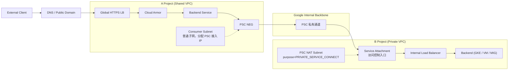
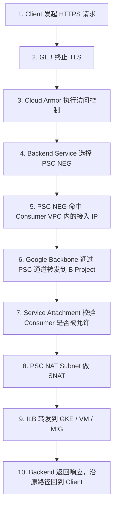

# Cross-Project PSC NEG 架构 — SRE 对接与监控需求总结

> **文档定位**：本文档是提供给 SRE 团队的 **一站式对接文档**，整合了跨 Project PSC NEG 方案的架构变更说明、监控需求、告警策略、日志采集、故障排查 Runbook 和上线验证清单。SRE 同事只需阅读本文档即可理解完整流程和职责边界。
>
> **源文档参考**：
> - [3.md](./3.md) — 架构设计与实现步骤
> - [3-enhance.md](./3-enhance.md) — 生产环境评估与增强方案
> - [cross-project-sre.md](./cross-project-sre.md) — SRE 监控需求初版
> - [cross-project-sre-enhance.md](./cross-project-sre-enhance.md) — SRE 监控需求增强版

---

## 1. 方案概述：我们改了什么

### 1.1 变更背景

我们将跨 Project 的 API 访问方式从 **裸 IP NEG** 升级为 **PSC（Private Service Connect）NEG**，核心目标是实现服务级访问隔离。

| 维度 | 旧方案（NON_GCP_PRIVATE_IP_PORT NEG） | 新方案（PSC NEG） |
| --- | --- | --- |
| 访问目标 | 裸 IP + Port | Service Attachment URI |
| Backend IP 是否暴露 | ✅ 暴露 | ❌ 不暴露 |
| Producer 访问控制 | 无 | 支持 allowlist / 手动审批 |
| 网络依赖 | 需要 VPC Peering 或共享路由 | PSC 自动建立隔离通道，无需 Peering |
| 服务级别隔离 | 否 | 是 |

### 1.2 最终架构链路

```text
External Client
  → DNS / Public Domain
  → Global HTTPS Load Balancer (A Project, Shared VPC)
  → Cloud Armor (WAF / TLS Policy)
  → Backend Service
  → PSC NEG (Consumer Endpoint)
      ↓ [Google Internal Backbone — PSC 私有通道]
  → Service Attachment (B Project, Private VPC)
  → PSC NAT Subnet (SNAT 地址转换)
  → Internal Load Balancer
  → Backend Service (GKE / VM / MIG)
```

### 1.3 架构图



### 1.4 SRE 必须知道的关键事实

| # | 事实 | SRE 影响 |
| --- | --- | --- |
| 1 | PSC NEG、Service Attachment、ILB **必须在同一 Region** | Region 级故障 = 全链路不可用 |
| 2 | 整条链路是**串联架构**，任一组件故障都会导致 5xx | 必须逐层监控 |
| 3 | Producer 通过 Service Attachment 控制 Consumer 接入（`ACCEPT_MANUAL` / `ACCEPT_AUTOMATIC`） | 审批卡住 = 新租户无法接入 |
| 4 | Consumer 侧 PSC NEG 依赖 Shared VPC subnet 的 IAM 授权（`compute.networkUser`） | 权限被撤 = PSC NEG 创建/关联失败 |
| 5 | Producer 侧有专用 PSC NAT Subnet（`purpose=PRIVATE_SERVICE_CONNECT`），用于 SNAT | NAT 地址池耗尽 = 连接异常 |
| 6 | 新方案新增了 PSC NEG、Service Attachment、PSC NAT Subnet、审批流、accept list 等运维对象 | 旧监控不覆盖这些对象 |

---

## 2. 一次请求的完整生命周期

SRE 排障时按此路径逐层定位：



**排障要点**：
- TLS / WAF / 公网治理都在 A Project 入口层完成
- B Project 只接收 Service Attachment 放行后的流量
- Producer 看到的源 IP 是 PSC NAT 后的地址，不是 Consumer 原始 IP

---

## 3. 新增运维对象清单

以下是相比旧方案 **新增** 的运维对象，SRE 必须纳入监控和变更管理：

| 组件 | 所在位置 | 作用 | 新增/已有 |
| --- | --- | --- | --- |
| **PSC NEG** | A Project (Consumer) | 把 Service Attachment 暴露为 GLB 可引用的后端 | 🆕 新增 |
| **Consumer Subnet** | A Project Shared VPC | 给 PSC NEG 分配接入 IP（普通 subnet） | 🆕 新增用途 |
| **Service Attachment** | B Project (Producer) | 对外发布内部服务，控制 Consumer 接入权限 | 🆕 新增 |
| **PSC NAT Subnet** | B Project Private VPC | 给 PSC 连接做 SNAT（purpose=PRIVATE_SERVICE_CONNECT） | 🆕 新增 |
| **Accept List / 审批流** | B Project | 控制哪些 Consumer Project 可以接入 | 🆕 新增 |
| Global HTTPS LB | A Project | 公网入口、TLS 终止 | 已有 |
| Cloud Armor | A Project | WAF 防护 | 已有 |
| Internal Load Balancer | B Project | 内部流量转发 | 已有 |
| Backend (GKE/VM/MIG) | B Project | 业务服务 | 已有 |

---

## 4. 监控需求（Must-Have）

### 4.1 GLB / Cloud Armor 层（A Project）

| 监控项 | 指标 | 告警阈值 | 严重级别 |
| --- | --- | --- | --- |
| GLB 错误率（5xx） | `https_lb_rule/request_count` (5xx) | > 1% 持续 5min | **P1** |
| GLB 延迟 P99 | `https_lb_rule/backend_response_latencies` | > 2s 持续 5min | P2 |
| Backend Service 健康率 | `health_check_probe_status` | < 95% healthy | **P1** |
| QPS 突降 | `https_lb_rule/request_count` | 较基线下降 > 50% 持续 5min | P2 |
| Cloud Armor 拦截 | `security_policy_action_total` (DENY) | 较近 1h 基线突增 > 300% | P2 |

### 4.2 PSC NEG 层（A Project）— 🆕 新增监控层

| 监控项 | 告警阈值 | 严重级别 |
| --- | --- | --- |
| PSC NEG endpoint 健康/存在性 | endpoint 数量低于预期或状态异常 | **P1** |
| PSC NEG 连接错误日志 | 持续出现错误 > 2min | **P1** |
| PSC NEG 配置变更审计 | 任意变更事件 | P2 |

> **SRE 关注**：GLB 5xx 上升但 ILB/Backend 正常时，**优先查 PSC NEG**。Shared VPC 授权问题经常先表现为 PSC NEG 关联失败。

### 4.3 Service Attachment 层（B Project）— 🆕 新增监控层

| 监控项 | 告警阈值 | 严重级别 |
| --- | --- | --- |
| `connectedEndpoints` 状态 | 为空或低于预期 | **P0** |
| Pending approval 状态 | pending > 15min | P2 |
| Accept list / connection preference 变更 | 任意变更事件 | P2 |
| 活跃连接数接近配额 | > 80% 配额 | P2 |

> **SRE 关注**：这是"流量完全不通但网络没断"的高频根因。`ACCEPT_MANUAL` 模式下必须把 pending 状态做成显式告警。

### 4.4 ILB 层（B Project）

| 监控项 | 告警阈值 | 严重级别 |
| --- | --- | --- |
| ILB backend 健康率 | healthy < 95% | **P1** |
| ILB 后端延迟 | P99 > 1s | P2 |
| 连接超时 / reset 数量 | > 10/min 持续 5min | **P1** |
| Forwarding rule / backend service 配置变更 | 任意变更事件 | P2 |

### 4.5 Backend 层（B Project — GKE/VM/MIG）

| 监控项 | 告警阈值 | 严重级别 |
| --- | --- | --- |
| Pod/VM 可用副本数 | < 预期副本数 | **P1** |
| CPU / 内存使用率 | > 80% 持续 10min | P2 |
| 应用 5xx / timeout 比例 | > 5% 持续 5min | **P1** |
| HPA 频繁抖动 | 高频扩缩容 | P3 |
| 健康检查接口成功率 | < 99% | **P1** |

### 4.6 PSC NAT Subnet / 配额层 — 🆕 新增监控层

| 监控项 | 告警阈值 | 严重级别 |
| --- | --- | --- |
| PSC NAT Subnet IP 使用率 | > 70% | P2 |
| PSC NEG 数量 / Region 配额 | > 80% | P2 |
| Service Attachment 连接数配额 | > 80% | P2 |
| GLB Backend 数量 / 配额 | > 70% | P3 |

> **SRE 关注**：NAT 地址池不足不一定先表现为稳定 5xx，更可能是间歇性连接失败。适合做趋势监控 + 提前告警。

```bash
# 检查 PSC NAT Subnet 使用情况
gcloud compute networks subnets describe psc-nat-subnet \
  --project=b-project --region=asia-east1

# 检查 Service Attachment 连接数
gcloud compute service-attachments describe my-service-attachment \
  --project=b-project --region=asia-east1 \
  --format="value(connectedEndpoints)"
```

---

## 5. 推荐监控需求（Recommended）

### 5.1 网络层

- **VPC Flow Logs**：确认流量经过预期路径，排查延迟/丢包（建议采样或按需开启，注意计费）
- **跨 Region 延迟**：当前 V1 单 Region，但需显式验证 Region 一致性

### 5.2 审计与安全

- **Audit Logs**：Service Attachment 审批、Shared VPC IAM 变更、Backend Service / forwarding rule / health check 变更、Cloud Armor 规则变更
- **安全策略告警**：`compute.networkUser` 删除/改动、accept list 变更、PSC NAT subnet 相关变更

### 5.3 成本与趋势

- PSC 流量成本趋势（同 Region $0.01/GB，跨 Region $0.02/GB）
- Cloud Armor 请求量和命中规则趋势
- Backend 带宽增长趋势
- 按 Project / Service / Tenant 的成本归属视图

---

## 6. SLO 定义与告警策略

### 6.1 建议 SLO

| SLO 维度 | 目标值 |
| --- | --- |
| 可用性（月度） | ≥ 99.9% |
| P95 延迟 | < 300ms |
| P99 延迟 | < 1s |

**计算公式**：`成功率 = 1 - (5xx + 超时) / 总请求`

### 6.2 告警优先级

#### P1 — 立即响应

- GLB 5xx > 1% 持续 5min
- Backend healthy ratio < 95%
- PSC NEG endpoint 异常
- Service Attachment `connectedEndpoints` 为空
- ILB backend 健康率低于阈值
- 应用 5xx / timeout 超阈值

#### P2 — 工作时段处理

- P99 延迟 > 2s
- QPS 明显下跌
- Pending approval > 15min
- PSC NAT subnet > 70%
- 配额使用率 > 80%
- Cloud Armor deny 突增
- IAM / 接入策略关键变更

#### P3 — 观察类

- HPA 抖动
- GLB Backend 数量接近阈值
- 成本异常增长

### 6.3 SLO 燃烧率告警

| 告警类型 | 窗口 | 用途 |
| --- | --- | --- |
| **快速燃烧** | 5min | 分钟级事故发现 |
| **慢速燃烧** | 1h | 性能回退 / 容量不足检测 |

---

## 7. 日志采集需求

### 7.1 必须采集

| 日志源 | 必须字段 | 用途 |
| --- | --- | --- |
| **GLB 访问日志** | host、path、status、latency、backend latency、client IP、trace_id | 入口视角定位 5xx 和慢请求 |
| **Cloud Armor 日志** | action、matched rule、source IP、request path | WAF 策略优化、误杀分析 |
| **Backend 应用日志** | trace_id、status、latency、error code | 业务层根因分析 |
| **Audit Logs** | actor、resource、operation、timestamp | 变更审计和回溯 |

### 7.2 推荐采集

| 日志源 | 用途 | 说明 |
| --- | --- | --- |
| VPC Flow Logs | 网络层排障 | 计费较高，建议采样或按需开启 |
| PSC / Service Attachment 连接日志 | Consumer 接入排障 | 可结合命令查询和审计事件 |
| ILB / 健康检查日志 | 定位 502/超时 | 验证 ILB 后端状态 |

> **要求**：所有关键层必须带统一关联字段（`trace_id` 或 `x-request-id`），支持按 project / region / backend service / PSC NEG / service attachment / consumer project 维度检索。

---

## 8. Dashboard 需求

### Dashboard 1: 端到端服务健康

- GLB QPS / 4xx / 5xx（实时 + 24h 趋势）
- P95 / P99 延迟
- Backend Service 健康比例
- 错误预算消耗

### Dashboard 2: PSC 链路状态 🆕

- PSC NEG 端点健康状态
- Service Attachment `connectedEndpoints`
- Pending approvals
- PSC NAT Subnet 使用率
- 关键 Region 资源状态

### Dashboard 3: Producer 侧内部健康

- ILB Backend 健康率 / 延迟
- Backend CPU / Memory / Replica
- 应用错误率
- HPA 伸缩事件

### Dashboard 4: 安全与变更审计

- Cloud Armor deny / allow 趋势
- IAM 变更事件
- Service Attachment 配置变更
- Health check / forwarding rule / backend service 变更

---

## 9. 故障排查 Runbook

### 9.1 逐层排障路径

| 告警场景 | 第一检查点 | 第二检查点 | 第三检查点 |
| --- | --- | --- | --- |
| **GLB 5xx 上升** | GLB Backend 健康 | PSC NEG 状态 | Service Attachment → ILB → Backend |
| **Service Attachment 无连接** | 审批状态 | Accept list | Consumer Project / Region / IAM |
| **PSC NEG 异常** | NEG 描述信息 | Shared VPC subnet / IAM | Backend Service 关联关系 |
| **ILB Backend 不健康** | 健康检查配置 | Backend 实例/Pod 状态 | 防火墙 / 路由规则 |
| **延迟升高** | GLB latency | ILB / Backend latency | VPC Flow Logs / 资源利用率 |

### 9.2 常用排查命令

```bash
# 检查 PSC NEG 状态
gcloud compute network-endpoint-groups describe psc-neg \
  --project=a-project --region=asia-east1

# 检查 Service Attachment 状态和连接
gcloud compute service-attachments describe my-service-attachment \
  --project=b-project --region=asia-east1

# 检查 ILB forwarding rules
gcloud compute forwarding-rules list \
  --project=b-project \
  --filter="loadBalancingScheme=INTERNAL"

# 检查 Shared VPC subnet 权限
gcloud compute networks subnets get-iam-policy shared-vpc-subnet \
  --project=host-project --region=asia-east1

# 检查 PSC NAT Subnet
gcloud compute networks subnets describe psc-nat-subnet \
  --project=b-project --region=asia-east1
```

### 9.3 紧急回滚方案

当 PSC NEG 方案出现不可恢复的问题时，可回退到旧方案（`NON_GCP_PRIVATE_IP_PORT NEG`）：

```bash
# Step 1: 从 Backend Service 移除 PSC NEG
gcloud compute backend-services remove-backend psc-backend-service \
  --project=a-project --global \
  --network-endpoint-group=psc-neg \
  --network-endpoint-group-region=asia-east1

# Step 2: 添加旧 NEG 作为 Backend
gcloud compute backend-services add-backend psc-backend-service \
  --project=a-project --global \
  --network-endpoint-group=old-ip-neg \
  --network-endpoint-group-region=asia-east1

# Step 3: 验证流量切换
curl -v https://your-service-domain/healthz

# Step 4: 记录回滚原因与时间戳
```

**回滚要求**：
- 明确回滚触发条件（例如 P1 告警持续 15min 无法恢复）
- 明确谁审批、谁执行、谁广播
- 回滚后立即验证流量恢复
- 记录回滚原因用于事后复盘

---

## 10. 特殊场景监控

### 10.1 Shared VPC 权限变更

| 监控项 | 告警条件 |
| --- | --- |
| `compute.networkUser` IAM 变更 | 任何删除/修改事件 |
| Subnet 级别授权失效 | PSC NEG 创建/关联失败 |

### 10.2 Service Attachment 审批延迟

| 监控项 | 告警条件 |
| --- | --- |
| 新 Consumer 连接 pending 状态 | > 15min 未审批 |
| 审批模式变更（自动↔手动） | 配置变更事件 |

### 10.3 防火墙规则变更（Producer 侧）

| 场景 | 监控需求 |
| --- | --- |
| Proxy-only subnet CIDR 变更 | 防火墙规则告警 |
| Health check ranges 变更 | 健康检查失败率上升 |
| PSC NAT subnet 变更 | 连接失败突增 |

---

## 11. 上线前验证清单

### 11.1 功能验证

- [ ] GLB → PSC NEG → Service Attachment → ILB → Backend 全链路通
- [ ] Service Attachment 状态为 `ACCEPTED`
- [ ] B Project 确认流量经过 PSC 通道（源 IP 为 PSC NAT IP）
- [ ] 健康检查路径和端口完全正确
- [ ] Cloud Armor 策略已验证（DENY 规则测试）

### 11.2 监控验证

- [ ] 4 个 Dashboard 正确展示数据
- [ ] P1 / P2 告警都能被模拟触发
- [ ] Audit Logs 可追溯关键资源变更
- [ ] 应用日志能和入口日志通过 trace_id 串联
- [ ] 配额和 NAT 地址池已有趋势视图

### 11.3 故障注入验证

- [ ] 单个 Backend 故障后服务仍可用
- [ ] 单 Zone Backend 故障后 ILB 仍可转发
- [ ] 手动撤销 Service Attachment 接入后，告警能及时触发
- [ ] PSC NEG 摘除或异常后，入口能观测到并告警
- [ ] **回滚到旧 NEG 方案的演练已跑通**

### 11.4 运维边界验证

- [ ] Shared VPC 的 `compute.networkUser` 授权路径明确
- [ ] Service Attachment 审批流程文档化
- [ ] A Project 与 B Project 的 on-call 边界明确
- [ ] 告警升级路径明确

---

## 12. 实施优先级

### P0 — 上线前必须完成

1. GLB / PSC NEG / Service Attachment / ILB / Backend **五层监控接通**
2. P1 告警接通并完成模拟触发
3. Audit Logs 和关键变更告警接通
4. **回滚 Runbook 可执行并完成一次演练**

### P1 — 上线后短期完成

1. PSC NAT Subnet 和配额趋势监控
2. VPC Flow Logs 按需接入
3. SLO 燃烧率告警
4. Cloud Armor 规则命中审计面板

### P2 — 中期优化

1. Service Attachment 审批自动化
2. 成本监控面板
3. 多 Region 灾备预案和监控模型

---

## 13. 交付物清单

| # | 交付物 | 交付给 SRE | 详情 |
| --- | --- | --- | --- |
| 1 | **Cloud Monitoring Dashboard × 4** | ✅ | 端到端健康 / PSC 链路 / Producer 内部 / 安全审计 |
| 2 | **告警策略配置** | ✅ | 快速燃烧（5min）+ 慢速燃烧（1h）+ 配额上限 |
| 3 | **Runbook 文档** | ✅ | 常见故障排查流程 + 紧急回滚步骤 + 审批流程 |
| 4 | **SLO 定义与错误预算告警** | ✅ | 可用性 99.9%，延迟 P95<300ms / P99<1s |
| 5 | **配额监控清单** | ✅ | PSC NEG 数量 / SA 连接数 / NAT IP 池 |
| 6 | **架构说明与变更对比** | ✅ | 本文档第 1-3 节 |
| 7 | **上线验证清单** | ✅ | 本文档第 11 节 |

---

## 14. 待确认事项

以下问题需要在 SRE 对接会上确认：

| # | 问题 | 影响 |
| --- | --- | --- |
| 1 | B Project 的 ILB 类型是什么？（Passthrough NLB 还是 Proxy/Envoy） | 决定防火墙规则与监控重点 |
| 2 | 链路中是否有 AEG/Kong/Nginx 中间层？ | 需要额外监控中间层指标 |
| 3 | 峰值 QPS 预期是多少？ | 决定告警阈值与容量规划 |
| 4 | 是否需要多 Region 灾备？ | 影响跨区域监控需求 |
| 5 | 租户模型是什么？（单租户/多租户） | 决定配额隔离与成本归属 |
| 6 | SLO 目标是否已对齐？ | 影响告警窗口与错误预算配置 |
| 7 | 回滚触发条件和审批人是谁？ | 影响紧急回滚 Runbook |

---

*文档版本: 1.0*
*创建日期: 2026-04-07*
*整合来源: 3.md / 3-enhance.md / cross-project-sre.md / cross-project-sre-enhance.md*
