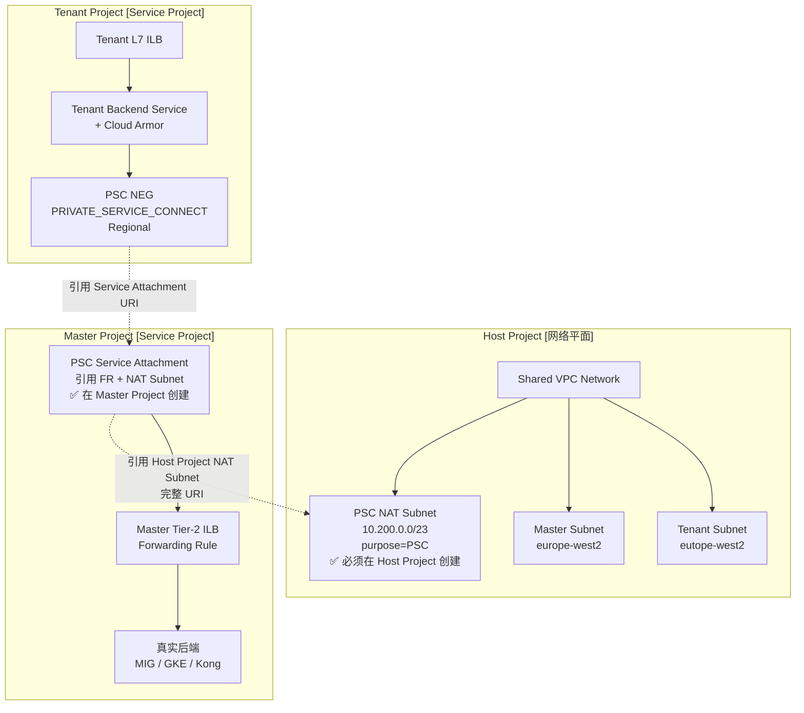

Shared VPC 网络架构是哪种？ A: Host Project 独立（VPC 在独立的 Host Project，Master 和 Tenant 都是 Service Project）

好的，已确认你的架构是标准三层模型。那么回到你的原始问题：

**PSC Service Attachment 在 Shared VPC 环境下创建完全没有问题**，结论不变。

关键点归纳：

| 资源                     | 创建在哪个 Project                      | 原因                              |
| ---------------------- | ---------------------------------- | ------------------------------- |
| PSC NAT Subnet         | `project-shared-dev`（Host Project） | Subnet 所有权属于 Host Project       |
| PSC Service Attachment | Master Project（Service Project）    | 引用的是 Master 自己的 Forwarding Rule |
| PSC NEG                | Tenant Project（Service Project）    | Consumer 侧资源，属于 Tenant          |

唯一需要注意的操作细节是 `--nat-subnets` 参数必须用完整 URI：

```bash
gcloud compute service-attachments create master-psc-attachment \
  --project=master-project \
  --region=europe-west2 \
  --producer-forwarding-rule=master-tier2-forwarding-rule \
  --connection-preference=ACCEPT_MANUAL \
  --nat-subnets=projects/project-shared-dev/regions/europe-west2/subnetworks/psc-nat-subnet
#               ↑ 必须带完整路径，指向 Host Project 的 subnet
```


## 🔍 问题分析

这是一个非常好的问题，我需要先确认你的实际架构，避免我在回答中混用概念导致误导。

---

## 📋 GCP Shared VPC 标准定义

GCP 官方定义如下：

|角色|定义|
|---|---|
|**Host Project**|持有 VPC Network 和 Subnet 的项目，负责网络平面管理|
|**Service Project**|挂载到 Host Project VPC 的业务项目，使用网络但不拥有它|

---

## 🔑 回到你的架构

你在文档里描述的是：

> tenant 项目和 master 已挂载在同一个 Shared VPC（同一 Host Project + 同一 VPC）

所以你的架构实际上有 **3 层项目**：

```
Host Project        ← 持有 VPC / Subnet（纯网络平面）
    ├── Master Project（Service Project）  ← 运行 GKE / MIG / Kong，是平台方
    └── Tenant Project（Service Project）  ← 租户入口，持有 ILB / Cloud Armor
```

---

## ⚠️ 我之前回答中的定义

我用的是你文档里的业务术语：

- **Host Project** = GCP 标准定义的 Host Project（持有 VPC）
- **Master Project** = 你业务上的 Master 项目，在 GCP 视角是 Service Project

两者**不是同一个项目**。

---

## ❓ 需要你确认的关键问题

你的 **Host Project 是独立存在的**，还是说 **Master Project 同时承担了 Host Project 的角色**（即 Master Project 自己持有 VPC）？

这两种情况的 NAT Subnet 创建位置会不同：用户选择了：**Host Project 独立（VPC 在独立的 Host Project，Master 和 Tenant 都是 Service Project）**

---

## ✅ 确认你的架构（3 项目模型）

```
project-shared-dev（Host Project）
    ├── VPC: project-shared-dev-cinternal-vpc1
    └── Subnet: cinternal-vpc1-europe-west2
          ↑ 你脚本里已经用了这个完整路径，说明 Host Project 确实独立

master-project（Service Project）
    └── 运行 GKE / MIG / Kong，Tier-2 ILB

tenant-project（Service Project）
    └── 持有 L7 ILB / Cloud Armor / URL Map
```

> 你 `create-neg.sh` 里的这两行已经印证了这一点：
> 
> ```bash
> NETWORK="projects/project-shared-dev/global/networks/..."
> SUBNET="projects/project-shared-dev/regions/..."
> ```
> 
> `project-shared-dev` 就是你的 Host Project，和 Master / Tenant 是分开的。

---

## 结论：我之前的回答定义是正确的

所以我上一个回答里的说法完全对应你的实际架构：

|我说的|对应你的实际项目|
|---|---|
|Host Project|`project-shared-dev`（持有 VPC）|
|Master Project|你的 Master 业务项目（Service Project）|
|Tenant Project|你的 Tenant 业务项目（Service Project）|

**PSC NAT Subnet 必须创建在 `project-shared-dev`（Host Project）** 这个结论不变，没有歧义。

## 🔍 问题分析

这个问题涉及 **PSC Service Attachment 在 Shared VPC 环境下的创建归属**，需要厘清几个关键概念。

---

pip## ✅ 直接结论

**没有问题，但有一个重要前提需要确认：**

PSC Service Attachment 创建在 **Master Project（Service Project）** 下，**不是在 Host Project 下**。它引用的 Forwarding Rule 也在 Master Project，这在 Shared VPC 场景下是完全支持的。

---

## 🔑 核心概念厘清

在 Shared VPC 环境中，资源归属分层如下：

|资源|归属项目|说明|
|---|---|---|
|VPC Network / Subnet|Host Project|网络平面，共享给所有 Service Project|
|Master Tier-2 ILB Forwarding Rule|Master Project（Service Project）|LB 资源属于使用它的 Service Project|
|**PSC NAT Subnet**|**Host Project**|⚠️ 唯一例外，必须在 Host Project 创建|
|**PSC Service Attachment**|**Master Project（Service Project）**|引用 Master 的 Forwarding Rule|
|PSC NEG|Tenant Project（Service Project）|Consumer 侧资源|

---

## ⚠️ 关键点：NAT Subnet 必须在 Host Project

这是 Shared VPC 下 PSC 最容易踩坑的地方：

```bash
# ❌ 错误：在 Master Project 创建 NAT Subnet（会失败）
gcloud compute networks subnets create psc-nat-subnet \
  --project=master-project \   # ← 错误
  --purpose=PRIVATE_SERVICE_CONNECT \
  --network=shared-vpc ...

# ✅ 正确：NAT Subnet 必须在 Host Project 创建
gcloud compute networks subnets create psc-nat-subnet \
  --project=host-project \     # ← 必须是 Host Project
  --region=europe-west2 \
  --network=shared-vpc \
  --range=10.200.0.0/23 \
  --purpose=PRIVATE_SERVICE_CONNECT
```

**原因**：Shared VPC 中 subnet 的所有权属于 Host Project，purpose=PRIVATE_SERVICE_CONNECT 的 subnet 也不例外。

---

## ✅ Service Attachment 在 Master Project 创建（正确做法）

```bash
# Service Attachment 在 Master Project 创建，引用 Master 的 Forwarding Rule
# NAT Subnet 引用 Host Project 中已创建的 psc-nat-subnet

MASTER_PROJECT="master-project"
REGION="europe-west2"
MASTER_FR_NAME="master-tier2-forwarding-rule"

gcloud compute service-attachments create master-psc-attachment \
  --project=${MASTER_PROJECT} \           # ← Master Project（Service Project）
  --region=${REGION} \
  --producer-forwarding-rule=${MASTER_FR_NAME} \
  --connection-preference=ACCEPT_MANUAL \
  --nat-subnets=projects/host-project/regions/europe-west2/subnetworks/psc-nat-subnet
  #             ↑ 引用 Host Project 的 subnet，需要用完整 URI
```

> ⚠️ `--nat-subnets` 必须使用完整的资源 URI（包含 Host Project ID），不能用短名称。

---

## 📊 Shared VPC 下 PSC 资源创建全貌



---

## ⚠️ IAM 权限要求

Shared VPC 场景下需要额外确认以下权限：

```bash
# 1. Master Project 的 SA 需要有权使用 Host Project 的 NAT Subnet
#    （创建 Service Attachment 时 GCP 会校验）
gcloud projects add-iam-policy-binding host-project \
  --member="serviceAccount:service-{MASTER_PROJECT_NUMBER}@compute-system.iam.gserviceaccount.com" \
  --role="roles/compute.networkUser"

# 2. 验证 Forwarding Rule 是否已正确绑定到 Shared VPC 的 subnet
gcloud compute forwarding-rules describe ${MASTER_FR_NAME} \
  --project=${MASTER_PROJECT} \
  --region=${REGION} \
  --format="value(subnetwork)"
# 输出应为 Host Project 的 subnet URI
```

---

## 总结

| 关键问题                                    | 结论                                             |
| --------------------------------------- | ---------------------------------------------- |
| Service Attachment 能在 Shared VPC 环境创建吗？ | ✅ 完全支持                                         |
| Service Attachment 在哪个 Project 创建？      | Master Project（Service Project）                |
| NAT Subnet 在哪个 Project 创建？              | ⚠️ **必须在 Host Project**                        |
| `--nat-subnets` 参数格式？                   | 必须用完整 URI，含 Host Project ID                    |
| 需要额外 IAM 权限吗？                           | 需要 Master SA 有 Host Project 的 `networkUser` 角色 |