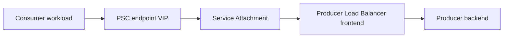

# Cross Project PSC Firewall 分析

## 1. Goal

这份文档的目标是把一个经常容易混淆的问题拆清楚：

> 在 Cross Project 场景下，Consumer Project 通过 PSC 访问 Producer Project 的服务时，哪些地方需要考虑防火墙？哪些地方通常不需要单独开放？

你当前最关心的是：

- Consumer 到 Producer 通过 PSC 通信时，是否要改防火墙
- Producer 暴露的是一个私网里的 LB IP 时，后端是否要允许来自 PSC subnet 的流量
- Consumer / Producer / 不同 VPC / 不同组件之间，哪些地方要放通，哪些地方只是逻辑组件，不需要防火墙

---

## 2. Executive Summary

### 最核心结论

**不要把 PSC endpoint、service attachment、producer LB frontend 都当成“需要单独开防火墙的网卡”。**

更准确的判断方式是：

1. Consumer 侧是否允许 workload 出站到 PSC endpoint VIP
   1. for our shared vpc this psc endpoint VIP is a Shared VPC IP
2. Producer 侧 backend 实际看到的源地址是谁
   1.  I think it is the PSC NAT subnet IP
   2.  Or it's our shared vpc's IP ==>以为 backend 看到的是 Consumer workload 的原始 IP 这个是错误的 
3. 你的 Producer 发布的服务到底是哪种 LB

### 一句话版本

- `PSC endpoint <-> service attachment <-> LB frontend` 这段链路，**通常不需要你手动为这些逻辑组件单独开防火墙**
- **真正要开的，通常是 Producer backend 的 ingress allow**
- 但 Producer backend 该允许谁，取决于 LB 类型：
  - **Passthrough 类 LB**：允许 **PSC NAT subnet**
  - **Proxy / Envoy 类 LB**：允许 **proxy-only subnet**
  -  上面提到的这两种情况，我还需要进行一下评估
- 如果有 health check，还必须允许 **health check probe ranges**

---

## 3. 先把流量路径讲清楚

以你的 Cross Project PSC 模式为例：



这里最容易误判的是：

- 你以为 backend 看到的是 Consumer workload 的原始 IP
- 或者以为 backend 看到的是 PSC endpoint VIP

通常都不是。

---

## 4. 官方边界：哪些地方本身不需要你单独开防火墙

根据 Google Cloud 官方 PSC producer 文档：

- **你不需要单独为 PSC endpoint 和 service attachment 之间开防火墙**
- **你也不需要单独为 service attachment 和关联的 load balancer 之间开防火墙**

原因是：

**endpoint、backend、service attachment 在这里更多是逻辑组件，不是你传统理解的“中间一台 VM 网卡”。**

所以，防火墙关注点不要放在：

- `PSC endpoint -> service attachment`
- `service attachment -> LB frontend`

而要放在：

- `load balancer / proxy / health checker -> backend`
- `consumer workload -> PSC endpoint VIP`

参考：

- [Publish services by using Private Service Connect](https://cloud.google.com/vpc/docs/configure-private-service-connect-producer)

---

## 5. 关键判断点：Producer 发布的是什么类型的服务

这是整个防火墙判断的分水岭。

Google 官方对 PSC producer backend 的流量来源有一个非常关键的说明：

### 5.1 如果 Producer 发布的是 Passthrough 类服务

例如：

- Internal passthrough Network Load Balancer
- Internal protocol forwarding
- Port mapping service

那么：

**backend 看到的源地址是 PSC NAT subnet 的地址范围**

也就是说，Producer backend 的 ingress 防火墙要允许：

- Source: `PSC NAT subnet CIDR`
- Destination: backend 业务端口

### 5.2 如果 Producer 发布的是 Proxy / Envoy 类服务

例如：

- Regional internal Application Load Balancer
- Cross-region internal Application Load Balancer
- Regional internal proxy Network Load Balancer
- Secure Web Proxy

那么：

**backend 看到的源地址是 proxy-only subnet 的地址范围**

不是 PSC NAT subnet。

也就是说，Producer backend 的 ingress 防火墙要允许：

- Source: `proxy-only subnet CIDR`
- Destination: backend 业务端口

### 5.3 Health check 仍然是单独一类来源

如果你的 backend service 使用 health check，那么 Producer backend 还必须允许：

- Source: Google health check probe ranges
- Destination: health check 对应端口

参考：

- [Publish services by using Private Service Connect](https://cloud.google.com/vpc/docs/configure-private-service-connect-producer)
- [Firewall rules for Cloud Load Balancing](https://cloud.google.com/load-balancing/docs/firewall-rules)
- [Internal Application Load Balancer overview](https://cloud.google.com/load-balancing/docs/l7-internal)

---

## 6. 直接回答你的例子

你的例子是：

> Producer Project 暴露了 private 网络里的一个 GCE load balance IP，那么这个 IP 是否需要和 PSC subnets 之间能通信？是不是我的 GCE 需要允许 PSC subnet 的流量进来？

答案是：

### 情况 A：你发布的是 Internal passthrough NLB

如果这个 “GCE LB IP” 背后是 **internal passthrough Network Load Balancer**，那么：

- backend VM 看到的来源会是 **PSC NAT subnet**
- 所以 backend VM 的防火墙**需要允许 PSC NAT subnet**

这时你的理解是对的。

### 情况 B：你发布的是 Internal Application LB / GKE Gateway

如果这个 “GCE LB IP” 背后其实是：

- internal Application LB
- GKE internal Gateway (`gke-l7-rilb`)
- internal proxy NLB

那么 backend 看到的来源不是 PSC NAT subnet，而是：

- **proxy-only subnet**

这时如果你只开放 PSC NAT subnet，通常是不够的；  
真正要开放的是 proxy-only subnet。

### 情况 C：你把“LB frontend IP”和“backend source IP”混成一件事

这是最常见误区。

**LB frontend VIP 是客户端访问的目标地址，不等于 backend 实际看到的源地址。**

防火墙要按 backend 实际看到的源来设计。

---

## 7. Consumer 侧要看哪些防火墙

PSC 常见排障时，大家容易只看 Producer；其实 Consumer 侧也可能挡住。

## 7.1 Workload 到 PSC endpoint VIP 的 egress

如果 Consumer VPC 里有严格 egress firewall policy，或者主机自身有额外出站限制，那么需要确认：

- Consumer workload 可以访问 PSC endpoint VIP
- 对应端口已允许
  - 例如 `80` / `443`

注意：

**VPC firewall rules 作用在 VM / node / NIC 上，不是作用在 forwarding rule 本身。**

所以这里本质是：

- 允许 Consumer 发起方出站
- 不是对 PSC endpoint 本身“绑定防火墙”

## 7.2 Consumer 侧 DNS

如果你走的是：

- Private DNS zone
- Response Policy

那还要确认 Consumer 侧能够正常解析 FQDN 到 PSC endpoint IP。

这虽然不是 PSC firewall 本体，但会直接影响“看起来像网络不通”。

## 7.3 GKE / Kubernetes 额外限制

如果 Consumer 是 GKE workload，还要额外检查：

- Kubernetes `NetworkPolicy` 是否限制 egress
- sidecar / mesh policy 是否限制外呼
- 节点级 egress firewall 是否有 deny

也就是说：

**Consumer 侧不一定是 VPC firewall 挡住，也可能是 K8s 网络策略挡住。**

---

## 8. Producer 侧要看哪些防火墙

Producer 侧是重点。

## 8.1 Service Attachment 不是防火墙，但它是准入控制点

虽然它不是 VPC firewall rule，但仍然要检查：

- 自动批准还是手动批准
- accept list / reject list
- 是否允许对应 Consumer project / network / endpoint 连接

这不是 firewall，但在行为上很像“第一道准入门”。

## 8.2 PSC NAT subnet 不是 backend subnet

PSC NAT subnet 的用途是：

- 为 PSC connection 做源地址转换

它不是：

- backend subnet
- LB frontend subnet
- 可直接挂 VM 的业务 subnet

所以你不应该把它理解成“backend 就在这个 subnet 里”。

它只是某些 LB 类型下 backend 实际看到的来源地址池。

## 8.3 Backend ingress allow 规则

这是 Producer 侧最重要的点。

你要根据 LB 类型分别设计：

### Passthrough 类 LB

允许：

- `PSC NAT subnet CIDR` -> backend app port
- `health check ranges` -> health check port

### Proxy / Envoy 类 LB

允许：

- `proxy-only subnet CIDR` -> backend app port
- `health check ranges` -> health check port

## 8.4 如果 backend 是 GCE VM

重点检查：

- VPC ingress firewall rule
- target tags / target service accounts
- 业务端口是否和 backend service / named port 一致
- health check 端口是否真的在监听

## 8.5 如果 backend 是 GKE / NEG / Gateway

重点检查：

- proxy-only subnet 是否已配置
- GKE Gateway / Ingress 是否自动创建了相关 firewall rule
- 如果是 Shared VPC 或权限受限场景，controller 是否有权限改防火墙
- 是否有组织级 / hierarchical firewall policy 覆盖掉 allow 规则

---

## 9. GKE Gateway / Internal Application LB 的特殊点

你最近的 Cross Project 探索里有很大一部分是：

- `PSC + GKE internal Gateway`
- `gke-l7-rilb`

这个场景要特别注意：

### 9.1 真正访问 backend 的不是 PSC NAT subnet，而是 proxy-only subnet

对于 internal Application LB：

- 后端看到的来源是 **proxy-only subnet**
- 不是 Gateway VIP
- 不是 PSC endpoint IP
- 通常也不是原始 Consumer IP

### 9.2 GKE Gateway 往往会创建一部分 firewall rule，但不要盲信

GKE 官方文档说明：

- Gateway controller 会创建用于 NEG health checks 的一些 firewall rules
- 对 internal Application LB，相关规则会涉及：
  - Google health check ranges
  - user-defined proxy-only subnet ranges

但你仍然应该验证：

- 规则是否真的创建成功
- 在 Shared VPC / 受限权限场景下是否失败
- 是否被更高优先级 firewall policy 覆盖

参考：

- [GKE automatically created firewall rules](https://cloud.google.com/kubernetes-engine/docs/concepts/firewall-rules)
- [Deploying Gateways](https://cloud.google.com/kubernetes-engine/docs/how-to/deploying-gateways)

---

## 10. Cross Project 下最常见的误区

### 误区 1：我要开放 PSC endpoint IP

通常不需要这样想。  
PSC endpoint 是 Consumer 侧 forwarding rule/VIP，不是你传统意义的 backend NIC。

### 误区 2：Service Attachment 和 LB 之间要单独开防火墙

官方明确说了，不需要。

### 误区 3：只开放 PSC NAT subnet 一定没问题

不对。  
只有在 **passthrough 类 producer service** 下，这样才成立。  
如果是 internal ALB / Gateway，通常你真正需要开放的是 **proxy-only subnet**。

### 误区 4：只要 Producer 放通就够了

不对。  
Consumer 如果有严格 egress policy、K8s NetworkPolicy、mesh policy，也可能出不去。

### 误区 5：健康检查和真实业务流量来源一定一样

不一定。  
health check 常常来自 Google probe IP ranges，和真实业务流量来源不同。

---

## 11. 推荐检查清单

## 11.1 Consumer 侧

- 确认 workload 能解析到正确 PSC endpoint FQDN / VIP
- 确认 workload 出站到 PSC endpoint VIP:port 没被 deny
- 如果是 GKE，确认 `NetworkPolicy` / mesh egress 没挡住
- 如果有组织级 egress firewall / hierarchical policy，确认没挡住

## 11.2 Producer 侧

- 确认 service attachment 已批准对应 consumer
- 确认 PSC NAT subnet 已配置，容量足够
- 确认发布的 producer service 到底是 passthrough 还是 proxy 类型
- 确认 backend ingress 防火墙开放的来源地址是“正确那一类”
- 确认 health check ranges 已放行
- 确认没有更高优先级 deny policy 覆盖

## 11.3 对 GKE Gateway / internal ALB

- 确认 proxy-only subnet 存在且 region 正确
- 确认 backend 放行 proxy-only subnet
- 确认 health check ranges 已允许
- 确认 Gateway controller 创建的 firewall rules 存在且生效

---

## 12. 你可以如何判断自己该放通谁

最实用的判断方式是：

1. 先确认 Producer 发布的 LB 类型
2. 再根据 LB 类型决定 backend source

### 快速判断思路

- 如果是 **internal passthrough NLB**：
  - backend allow `PSC NAT subnet`
- 如果是 **internal Application LB / gke-l7-rilb / internal proxy NLB**：
  - backend allow `proxy-only subnet`
- 无论哪种，如果有 health check：
  - backend allow `health check probe ranges`

---

## 13. Validation / Debug 建议

### 13.1 看 service attachment

```bash
gcloud compute service-attachments describe SERVICE_ATTACHMENT \
  --region=REGION \
  --project=PRODUCER_PROJECT
```

重点看：

- `connectedEndpoints`
- `natSubnets`
- approval / accept 配置

### 13.2 看 forwarding rule / LB 类型

```bash
gcloud compute forwarding-rules describe FORWARDING_RULE \
  --region=REGION \
  --project=PRODUCER_PROJECT
```

重点看：

- `loadBalancingScheme`
- target 类型
- region / global

### 13.3 看 Producer 防火墙

```bash
gcloud compute firewall-rules list --project=PRODUCER_PROJECT
```

重点核对：

- source ranges
- target tags / service accounts
- destination ports
- priority

### 13.4 看是否有更高层策略覆盖

如果你们组织使用：

- hierarchical firewall policy
- organization policy

那要一起检查，不要只看 VPC firewall rules。

---

## 14. Final Recommendation

如果你的核心问题是：

> Cross Project 使用 PSC 时，我到底要改哪里防火墙？

那么最稳的判断方式是：

### Consumer

- 主要检查 workload 到 PSC endpoint VIP 的 **egress 是否被挡**

### Producer

- 不要盯着 PSC endpoint / service attachment 本身
- 重点检查 backend ingress 是否允许 **真实流量来源**

### 真正需要放通的来源通常只有三类

1. `PSC NAT subnet`
   - 仅当 producer service 是 **passthrough 类**
2. `proxy-only subnet`
   - 当 producer service 是 **internal ALB / Gateway / proxy 类**
3. `health check probe ranges`
   - 当 backend service 使用 health checks

---

## 15. One-line Conclusion

**Cross Project PSC 场景下，防火墙设计的关键不是“给 PSC 开洞”，而是识别 Producer backend 实际看到的源地址到底是 PSC NAT subnet、proxy-only subnet，还是 health check probes，然后只对这些真实来源做最小放通。**

---

## 16. References

- [Publish services by using Private Service Connect](https://cloud.google.com/vpc/docs/configure-private-service-connect-producer)
- [Make the service accessible from other VPC networks](https://cloud.google.com/vpc/docs/make-service-accessible-other-vpc-networks)
- [Firewall rules for Cloud Load Balancing](https://cloud.google.com/load-balancing/docs/firewall-rules)
- [Internal Application Load Balancer overview](https://cloud.google.com/load-balancing/docs/l7-internal)
- [Deploying Gateways](https://cloud.google.com/kubernetes-engine/docs/how-to/deploying-gateways)
- [GKE firewall rules](https://cloud.google.com/kubernetes-engine/docs/concepts/firewall-rules)

---

## 17. 如何判断 Producer 发布的是 Passthrough 还是 Proxy / Envoy

这一部分是实际落地时最重要的，因为它直接决定：

- 你该放通 `PSC NAT subnet`
- 还是该放通 `proxy-only subnet`

### 17.1 最稳的判断原则

不要先看名字里有没有 `gateway`、`ilb`、`proxy`。  
最稳的方式是看 **Producer 侧 forwarding rule 指向的 target 类型**，以及该 LB 是否依赖：

- `target proxy`
- `URL map`
- `proxy-only subnet`

### 17.2 快速判断表

| Producer 发布类型                               | 典型判断特征                                                                      | Backend 实际看到的来源   | Producer backend 该放通谁                              |
| ----------------------------------------------- | --------------------------------------------------------------------------------- | ------------------------ | ------------------------------------------------------ |
| Internal passthrough Network Load Balancer      | forwarding rule 直接走 backend service；不是 target HTTP/HTTPS/TCP/SSL proxy 路径 | `PSC NAT subnet CIDR`    | `PSC NAT subnet CIDR` + health check ranges            |
| Internal protocol forwarding                    | 更接近转发/透传，不走 proxy-only subnet                                           | `PSC NAT subnet CIDR`    | `PSC NAT subnet CIDR` + 相关健康检查或业务端口         |
| Port mapping service                            | PSC producer 的端口映射类发布                                                     | `PSC NAT subnet CIDR`    | `PSC NAT subnet CIDR`                                  |
| Regional internal Application Load Balancer     | 有 `target HTTP proxy` 或 `target HTTPS proxy`，通常还有 `URL map`                | `proxy-only subnet CIDR` | `proxy-only subnet CIDR` + health check ranges         |
| Cross-region internal Application Load Balancer | 也是 proxy 型，依赖 target proxy / URL map                                        | `proxy-only subnet CIDR` | `proxy-only subnet CIDR` + health check ranges         |
| Regional internal proxy Network Load Balancer   | 有 `target TCP proxy` 或 `target SSL proxy`                                       | `proxy-only subnet CIDR` | `proxy-only subnet CIDR` + health check ranges         |
| Secure Web Proxy                                | 本质也是 proxy / Envoy 路径                                                       | `proxy-only subnet CIDR` | `proxy-only subnet CIDR` + health check / 相关策略来源 |
| GKE internal Gateway (`gke-l7-rilb`)            | 底层是 regional internal Application LB                                           | `proxy-only subnet CIDR` | `proxy-only subnet CIDR` + health check ranges         |

### 17.3 一个非常实用的经验法则

如果这条链路里你能清楚看到：

- `forwarding rule`
- `target HTTP/HTTPS/TCP/SSL proxy`
- `URL map`
- `proxy-only subnet`

那么它大概率就是：

**Proxy / Envoy 类**

如果它更像：

- `forwarding rule`
- `backend service`
- 直接打到 backend
- 没有 target proxy / URL map / proxy-only subnet

那么它更接近：

**Passthrough 类**

---

## 18. 在工程里怎么实际确认自己的类型

下面给你一套更实用的判断路径。

## 18.1 先从 Service Attachment 找 target service

先看 service attachment 指向的到底是什么：

```bash
gcloud compute service-attachments describe SERVICE_ATTACHMENT \
  --region=REGION \
  --project=PRODUCER_PROJECT
```

重点看：

- `targetService`
- `natSubnets`
- `connectedEndpoints`

然后把 `targetService` 记下来。

### 如果 `targetService` 看起来像 forwarding rule

通常会是这种风格：

```text
projects/PRODUCER_PROJECT/regions/REGION/forwardingRules/xxx
```

这时继续 describe 那条 forwarding rule。

## 18.2 看 forwarding rule 到底指向谁

```bash
gcloud compute forwarding-rules describe FORWARDING_RULE \
  --region=REGION \
  --project=PRODUCER_PROJECT
```

重点看这些字段：

- `loadBalancingScheme`
- `backendService`
- `target`
- `network`
- `subnetwork`

### 看到这些字段时，怎么理解

#### 情况 A：有 `target`

如果 forwarding rule 里有：

- `target: ...targetHttpProxies/...`
- `target: ...targetHttpsProxies/...`
- `target: ...targetTcpProxies/...`
- `target: ...targetSslProxies/...`

那么这条链路就是：

**Proxy / Envoy 类**

因为 target proxy 本身就是 proxy-based load balancer 的典型特征。

#### 情况 B：没有 target proxy，更多是直接 backend service

如果 forwarding rule 更像是直接连到 backend service，而没有 target proxy / URL map 这类组件，那通常更接近：

**Passthrough 类**

---

## 18.3 看你的网络里有没有 proxy-only subnet

对 proxy / Envoy 类负载均衡器，一个非常强的信号就是：  
对应 region / VPC 里通常存在 proxy-only subnet。

你可以这样查：

```bash
gcloud compute networks subnets list \
  --project=PRODUCER_PROJECT \
  --filter='purpose ~ "MANAGED_PROXY|INTERNAL_HTTPS_LOAD_BALANCER"'
```

如果你看到了类似这些 purpose：

- `REGIONAL_MANAGED_PROXY`
- `GLOBAL_MANAGED_PROXY`
- `INTERNAL_HTTPS_LOAD_BALANCER`

那通常说明这个 VPC/region 里存在过或正在使用 proxy / Envoy 类 LB。

### 对你当前场景最相关的判断

如果你用的是：

- `GKE Gateway`
- `gatewayClassName: gke-l7-rilb`

那它底层就是：

**regional internal Application Load Balancer**

所以你应该按：

- **Proxy / Envoy 类**
- backend 放通 `proxy-only subnet CIDR`

来处理。

---

## 19. 结合 GKE Gateway 的判断方法

你已经提到这个判断你大概有概念，这里我帮你明确落地：

### 19.1 如果是 `gke-l7-rilb`

例如：

```yaml
spec:
  gatewayClassName: gke-l7-rilb
```

那么它对应的是：

- GKE internal Gateway
- 底层实现是 **regional internal Application Load Balancer**
- 这是标准的 **proxy / Envoy 类**

所以：

- backend source 不是 `PSC NAT subnet`
- backend source 是 `proxy-only subnet`

### 19.2 你该怎么查它用的是哪个 proxy-only subnet

先查对应 VPC/region 的 proxy-only subnet：

```bash
gcloud compute networks subnets list \
  --project=PRODUCER_PROJECT \
  --regions=REGION \
  --filter='purpose="REGIONAL_MANAGED_PROXY" OR purpose="INTERNAL_HTTPS_LOAD_BALANCER"'
```

然后看：

- subnet name
- `ipCidrRange`
- role / purpose

这个 `ipCidrRange`，就是你 Producer backend 防火墙里最该关注的 source range 之一。

---

## 20. 对比表：类型 vs Source IP 范围

下面这张表可以直接拿来做防火墙设计判断。

| 你发布的 Producer 服务类型           | 典型底层资源                                        | backend 看到的 source IP 范围 | 防火墙重点                                    |
| ------------------------------------ | --------------------------------------------------- | ----------------------------- | --------------------------------------------- |
| Internal passthrough NLB             | forwarding rule + backend service                   | `PSC NAT subnet CIDR`         | 放通 PSC NAT subnet 到业务端口                |
| Internal protocol forwarding         | forwarding / 透传类资源                             | `PSC NAT subnet CIDR`         | 放通 PSC NAT subnet                           |
| Port mapping service                 | 端口映射服务                                        | `PSC NAT subnet CIDR`         | 放通 PSC NAT subnet                           |
| Internal Application LB              | target HTTP/HTTPS proxy + URL map + backend service | `proxy-only subnet CIDR`      | 放通 proxy-only subnet 到业务端口             |
| GKE internal Gateway (`gke-l7-rilb`) | internal ALB + Gateway controller                   | `proxy-only subnet CIDR`      | 放通 proxy-only subnet，到后端 service/NEG/VM |
| Internal proxy NLB                   | target TCP/SSL proxy + backend service              | `proxy-only subnet CIDR`      | 放通 proxy-only subnet                        |
| Secure Web Proxy                     | proxy service                                       | `proxy-only subnet CIDR`      | 放通 proxy-only subnet                        |

### 永远不要忘记的附加项

如果 backend service 开启 health check，还要同时放通：

- Google health check probe ranges

所以实际生产规则通常是：

1. 业务流量来源
   - `PSC NAT subnet` 或 `proxy-only subnet`
2. 健康检查来源
   - `health check probe ranges`

---

## 21. 建议你在工程里这样做一轮核对

### 路线 1：从 Service Attachment 出发

1. 看 `service attachment`
2. 找到 `targetService`
3. describe 对应 forwarding rule
4. 看它是否指向 target proxy
5. 决定是 passthrough 还是 proxy 类

### 路线 2：从 backend 反推

1. 先看 backend 前面挂的 LB 是什么类型
2. 如果是 internal ALB / Gateway / target proxy 类
   - 就按 `proxy-only subnet` 设计
3. 如果是 internal passthrough NLB
   - 就按 `PSC NAT subnet` 设计

### 路线 3：从 subnet 反推

如果你已经知道：

- 这个 region/VPC 有 proxy-only subnet
- 这个服务是 GKE Gateway / internal ALB

那基本就可以直接判断：

- 这是 proxy / Envoy 类
- 重点看 proxy-only subnet CIDR

---

## 22. 最终落地建议

如果你后面要做 Cross Project PSC 防火墙梳理，我建议把所有 Producer service 先分成两类：

### 第一类：Passthrough

- 看 `PSC NAT subnet`
- backend ingress 放通 `PSC NAT subnet`

### 第二类：Proxy / Envoy

- 看 `proxy-only subnet`
- backend ingress 放通 `proxy-only subnet`

然后再统一补一层：

- `health check probe ranges`

这样比“所有场景都先放开 PSC NAT subnet”要准确得多，也更安全。
