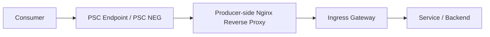
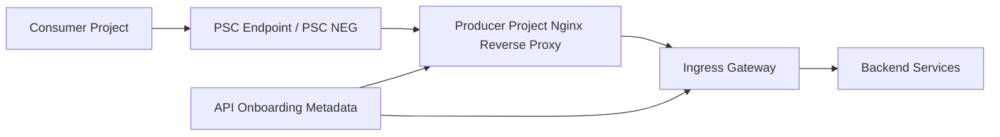

# Cross Project PSC + Ingress Gateway / Nginx / Service Mesh 探索

## 1. Goal and Constraints

你这次的问题，不是单纯“Cross Project 私网怎么打通”，而是：

1. `PSC + ingress gateway` 这一条链路，当前**无法满足 request / response body manipulation** 的需求
2. 你倾向于 `PSC + Nginx reverse proxy`
   - 默认 header
   - 默认 request / response body manipulation
   - 默认上传 / buffering / timeout 策略
   - 路由规则继续保留在 ingress gateway
3. 对少量特殊 API，例如 file upload，需要一套 **API-level override / on-boarding** 机制
4. 你也探索过 [cloud-service-mesh-control.md](/Users/lex/git/knowledge/gcp/asm/cloud-service-mesh-control.md)，希望判断 Mesh / Envoy 是否能更适合作为控制层

这本质上是在选：

- 只用 Gateway 做 L7 治理
- 引入 Nginx 作为独立 L7 policy enforcement layer
- 用 Mesh / Envoy 把更多治理能力平台化

---

## 2. Executive Summary

### 推荐结论

当前最现实的 V1 仍然是：

**`PSC + Nginx reverse proxy + Ingress Gateway`**

### 原因

- `PSC` 只解决跨项目私网连通，不解决 L7 内容处理
- `Ingress Gateway / HTTPRoute` 原生更适合：
  - host/path routing
  - URL rewrite
  - request/response header modifier
- 你们当前真正缺的是：
  - request / response body manipulation
  - 默认策略 + API 级覆盖
  - 对上传 / 流式 / 二进制 API 的差异化处理
- 这类需求用 Nginx 落地更直接，也更容易被平台团队长期运维

### 中长期方向

如果以后目标升级为：

- mTLS
- JWT / AuthZ
- east-west + north-south 一体化治理
- 更细的流量治理与可观测性

那么再评估：

**`PSC + Mesh ingress / Envoy`**

但它更像平台升级方向，不是当前需求的最短路径。

---

## 3. 先把职责边界讲清楚

### PSC 能做什么

`PSC` 负责：

- 跨项目私网暴露服务
- Consumer / Producer 网络边界隔离
- 连接模型标准化

`PSC` 不负责：

- request body 改写
- response body 改写
- 默认 header 策略
- 上传策略
- API 级例外规则

所以：

**PSC 是 transport path，不是 policy engine。**

### Ingress Gateway / HTTPRoute 能做什么

GKE Gateway / Gateway API 原生擅长：

- host/path 路由
- backend 分发
- redirect / rewrite
- request / response header 修改

这类能力非常适合作为 Producer 侧统一 north-south routing layer。  
但如果要进入 request / response body 处理，通常就不再是“普通 Gateway 配置”了，而会进入扩展机制。

### Nginx 最适合做什么

Nginx 在这些场景上更成熟：

- 默认 header 注入
- 默认 request / response body policy
- 上传类 API 的 body / buffering / timeout 调整
- 某些 response filtering / 内容替换
- 对不同 API 做 location 级差异化控制

### Mesh / Envoy 最适合做什么

Mesh / Envoy 更擅长：

- timeout / retry
- mTLS
- JWT / AuthZ
- service-to-service policy
- traffic split
- observability

它也能做 header control，甚至能通过 `EnvoyFilter` / ext_proc / Wasm 做更深度扩展，但复杂度明显更高。

---

## 4. 方案对比

| 方案 | 能力匹配度 | 工程复杂度 | 运维复杂度 | 对当前需求适配 |
| --- | --- | --- | --- | --- |
| `PSC + Ingress Gateway` | 低 | 低 | 低到中 | 无法很好覆盖 body manipulation |
| `PSC + Nginx reverse proxy + Ingress Gateway` | 高 | 中 | 中 | 最符合当前需求 |
| `PSC + Mesh ingress / Envoy` | 中到高 | 高 | 高 | 更适合中长期平台化 |

---

## 5. Option 1: PSC + Ingress Gateway

## 5.1 优点

- 架构简单
- 组件少
- 责任边界清晰
- 更接近 GCP Native

## 5.2 能满足的能力

- 私网暴露
- 路由分发
- rewrite / redirect
- request / response header modifier
- 基础 north-south 入口管理

## 5.3 不能很好满足的能力

你当前最在意的是：

- request body manipulation
- response body manipulation
- 默认策略和 API 例外策略共存
- 上传 / 流式 / 大 body API 的差异化处理

这些不是 Gateway API 的舒适区。

## 5.4 如果强行继续走这条路，会发生什么

如果坚持不用 Nginx，而把能力压进 Gateway / Envoy 扩展层，通常要开始接触：

- Service Extensions
- ext_proc
- Wasm
- EnvoyFilter

这带来的问题是：

- 配置复杂度显著增加
- 变更门槛上升
- 平台排障难度上升
- 对团队 Envoy/Gateway 深度要求更高

### 判断

**这不是完全做不到，而是不适合作为当前 V1。**

---

## 6. Option 2: PSC + Nginx reverse proxy + Ingress Gateway

这是当前最推荐的方案。

## 6.1 推荐流量路径

## 6.2 推荐职责分工

### PSC

- 跨项目私网连接
- 边界收敛

### Nginx reverse proxy

- 默认 request / response header
- 默认 body-related policy
- 上传 / buffering / timeout 默认值
- 某些内容替换或响应修饰
- API 级 override 的执行点

### Ingress Gateway

- host/path 路由
- namespace / service 分发
- 现有路由规则保留
- 统一 north-south route governance

## 6.3 这个方案最重要的优点

### 1. 不推翻现有 Gateway 路由体系

你原有 ingress gateway 的 routing model 可以保留，风险低。

### 2. body/header policy 有明确承载点

而且这个承载点是团队更容易理解和运维的 Nginx。

### 3. file upload 这类 API 更容易落地

Nginx 对这类能力原生就比较成熟，例如：

- `client_max_body_size`
- `proxy_request_buffering`
- `proxy_buffering`
- `proxy_read_timeout`
- `proxy_send_timeout`

### 4. 更容易实现“默认策略 + API 级覆盖”

这个正是你现在需要的。

## 6.4 代价和风险

### 1. 多一个 L7 hop

会增加一点延迟和排障面。

### 2. 多一个高可用组件

需要考虑：

- HPA
- PDB
- readiness / liveness
- 日志
- metrics
- tracing
- 灰度发布

### 3. 配置治理必须制度化

如果没有 API onboarding 机制，Nginx 配置会很快失控。

---

## 7. Option 2 应该怎么设计才不会越做越乱

## 7.1 核心原则：Nginx 做 control layer，不做主路由裁决

建议：

- Nginx 承担默认策略和 API 级覆盖
- Ingress Gateway 保持最终路由权

不要让 Nginx 同时承担：

- 复杂业务路由
- default manipulation
- API governance registry

否则后面一定会演变成“双路由系统”。

## 7.2 推荐配置模型

### 平台默认模板

适用于大多数 API：

- 默认 header
- 默认 request / response body policy
- 默认超时
- 默认 buffering
- 默认 body size
- 默认 cache / no-cache 控制

### API 级覆盖模板

只允许少量明确例外：

- file upload
- streaming
- binary download
- 长连接
- 特殊 header / body 例外

## 7.3 推荐的 onboarding 流程

建议在 API onboarding 时显式收集：

- API 类型：普通 JSON / upload / streaming / binary
- 最大请求体大小
- 是否允许 request buffering
- 是否允许 response buffering
- timeout 要求
- 是否需要特殊 header
- 是否需要关闭默认 body manipulation

最终生成：

- 一份 API metadata
- 一段 Nginx include / snippet
- 一份 Gateway route 对应关系

这样 Nginx 不会变成长期手工维护地狱。

---

## 8. File Upload 场景为什么必须单独对待

如果 upload API 直接套默认策略，最常见的问题有：

- body 被提前 buffer，导致延迟和内存压力上升
- 大文件被默认 body size 限制挡住
- 请求超时
- response buffering 影响实时反馈
- 某些 body manipulation 直接破坏 multipart/form-data

所以平台默认策略如果存在，必须明确有一条规则：

**上传、流式、二进制类 API 默认不进入通用 body manipulation。**

这也是为什么你提到的 API-level override 是必要的。

---

## 9. Service Mesh 这条线到底能不能替代 Nginx

可以探索，但不建议直接把它当成当前主方案。

## 9.1 Mesh 的强项

结合 [cloud-service-mesh-control.md](/Users/lex/git/knowledge/gcp/asm/cloud-service-mesh-control.md)，Mesh 更适合：

- timeout / retry
- JWT / AuthZ
- mTLS
- service-to-service policy
- east-west governance
- 统一 telemetry

## 9.2 Mesh 对 header control 确实更“平台化”

如果你的诉求主要是：

- request header 注入
- response header 注入
- 某些统一安全头
- 某些 routing policy

那么 Mesh / Envoy 方向是很有吸引力的。

## 9.3 但一旦进入 body manipulation，就不再轻量

如果要做：

- request body inspection / rewrite
- response body rewrite
- 上传 request 级差异化策略

你通常就会落到：

- `EnvoyFilter`
- ext_proc
- Wasm
- 更深的 Envoy 扩展面

这会带来几个现实问题：

- 平台团队要具备更强的 Envoy 运维能力
- 配置和变更更难 code review
- 出问题时定位比 Nginx 配置难得多
- 升级和兼容性风险更高

### 判断

**Mesh 更适合把认证、流量治理、mTLS、可观测性平台化，而不是作为你当前 body manipulation 的第一落点。**

---

## 10. 一个更务实的分层建议

如果你想兼顾当前需求和长期演进，我建议分层如下：

### V1 现在落地

`PSC + Nginx reverse proxy + Ingress Gateway`

职责：

- PSC: private connectivity
- Nginx: default L7 control + API override
- Gateway: routing

### V2 中期补强

补：

- Cloud Armor / WAF
- 统一日志和 tracing
- API onboarding 自动化
- 配置模板化

### V3 长期平台化

把更适合平台统一治理的能力逐步迁入 Mesh / Envoy：

- mTLS
- JWT / AuthZ
- service policy
- traffic governance

但不建议一开始就把“通用 body manipulation”全压给 Mesh。

---

## 11. 推荐落地架构

### 解释

- `Ingress Gateway` 继续保留现有 host/path 路由
- `Nginx` 只做默认策略和例外覆盖
- `API Onboarding Metadata` 同时驱动 Nginx 和 Gateway 配置

这个模型比“人肉维护多个 server/location 特例”更可持续。

---

## 12. 最终建议

### 当前建议

优先采用：

**`PSC + Nginx reverse proxy + Ingress Gateway`**

### 不建议当前直接采用

**只靠 `PSC + Ingress Gateway`**  
原因：无法优雅满足 request / response body manipulation 与 API 级覆盖需求。

### 不建议当前直接重押

**`PSC + Mesh ingress / Envoy`**  
原因：它更适合中长期治理平台化，不适合作为当前最短落地路径。

---

## 13. 一句话结论

**PSC 负责跨项目私网连通，Ingress Gateway 负责路由，Nginx reverse proxy 负责默认 L7 控制和 API 级例外；Mesh 适合作为后续平台化治理能力，而不是当前 body manipulation 需求的第一实现点。**

---

## 14. To Do

- 定义 Nginx 默认策略边界：哪些 header/body 策略是平台默认
- 定义 API 级 override 清单：upload、streaming、binary、long-running request
- 设计 onboarding metadata 模型，避免手工维护 Nginx 特例
- 明确 Nginx 与 Gateway 的职责边界，避免双重路由
- 为 Nginx 设计 HPA、PDB、健康检查、监控和日志
- 评估哪些能力未来适合迁移到 Mesh：JWT/AuthZ、mTLS、timeout/retry、telemetry
- 为特殊 API 定义验证用例：大文件上传、超时、multipart、streaming、binary response

---

## 15. References

- [GKE Gateway documentation](https://cloud.google.com/kubernetes-engine/docs/concepts/gateway-api)
- [GKE Gateway deployment and routing](https://cloud.google.com/kubernetes-engine/docs/how-to/deploying-gateways)
- [GKE Service Extensions](https://cloud.google.com/kubernetes-engine/docs/how-to/configure-gke-service-extensions)
- [Cloud Service Mesh traffic management](https://cloud.google.com/service-mesh/v1.23/docs/service-routing/advanced-traffic-management)
