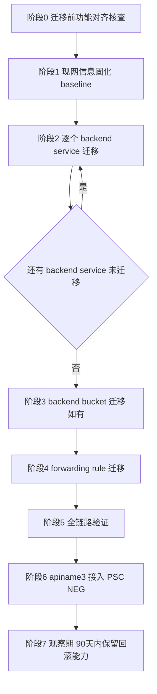
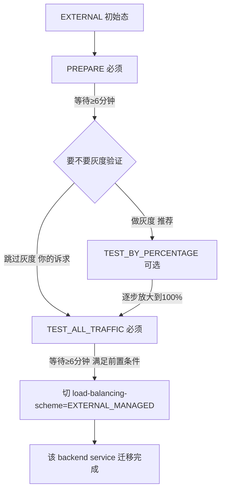

- [im](#im)
  - [问题分析](#问题分析)
  - [解决方案:整合后的原地迁移执行计划](#解决方案整合后的原地迁移执行计划)
    - [阶段总览](#阶段总览)
    - [阶段 0:迁移前功能对齐核查(原文档缺失,新增)](#阶段-0迁移前功能对齐核查原文档缺失新增)
    - [阶段 1:现网信息固化(沿用原文档,补充变量)](#阶段-1现网信息固化沿用原文档补充变量)
    - [阶段 2:逐个 backend service 迁移(沿用原文档状态机,补充熔断标准)](#阶段-2逐个-backend-service-迁移沿用原文档状态机补充熔断标准)
    - [阶段 3:backend bucket 迁移(如无可跳过,原文档命令保留)](#阶段-3backend-bucket-迁移如无可跳过原文档命令保留)
    - [阶段 4:forwarding rule 迁移(所有 backend service 必须已完成)](#阶段-4forwarding-rule-迁移所有-backend-service-必须已完成)
    - [阶段 5:全链路验证](#阶段-5全链路验证)
    - [阶段 6:apiname3 接入 PSC NEG(原文档缺失,这才是迁移的目的)](#阶段-6apiname3-接入-psc-neg原文档缺失这才是迁移的目的)
    - [阶段 7:观察期(90 天窗口)](#阶段-7观察期90-天窗口)
  - [注意事项](#注意事项)
- [My understanding](#my-understanding)
  - [问题分析](#问题分析-1)
  - [解决方案:最简化命令(跳过灰度,不跳过状态机)](#解决方案最简化命令跳过灰度不跳过状态机)
  - [流程图](#流程图)
  - [关于第 3 点:迁移过程中旧 API 是否正常可用](#关于第-3-点迁移过程中旧-api-是否正常可用)
- [implement](#implement)
  - [0. 实施总览](#0-实施总览)
    - [0.1 适用范围与前置假设](#01-适用范围与前置假设)
    - [0.2 To-Do List (执行前先逐项打勾)](#02-to-do-list-执行前先逐项打勾)
    - [0.3 阶段编号(对应 §1 - §8)](#03-阶段编号对应-1---8)
  - [1. 阶段 1:实施前准备 (10 分钟)](#1-阶段-1实施前准备-10-分钟)
    - [1.1 目标](#11-目标)
    - [1.2 操作步骤](#12-操作步骤)
      - [Step 1.1: 确认项目与变量](#step-11-确认项目与变量)
      - [Step 1.2: 导出 baseline 配置](#step-12-导出-baseline-配置)
      - [Step 1.3: 备份脚本 - 一键导出全量配置](#step-13-备份脚本---一键导出全量配置)
      - [Step 1.4: 健康检查基线](#step-14-健康检查基线)
    - [1.3 通过标准](#13-通过标准)
  - [2. 阶段 2:现网环境冻结 (即时)](#2-阶段-2现网环境冻结-即时)
    - [2.1 目标](#21-目标)
    - [2.2 操作步骤](#22-操作步骤)
      - [Step 2.1: 通知业务方](#step-21-通知业务方)
      - [Step 2.2: 冻结变更窗口](#step-22-冻结变更窗口)
    - [2.3 通过标准](#23-通过标准)
  - [3. 阶段 3:Backend Service 状态机迁移 (54 分钟)](#3-阶段-3backend-service-状态机迁移-54-分钟)
    - [3.1 通用迁移函数(直接复制使用)](#31-通用迁移函数直接复制使用)
    - [3.2 操作步骤](#32-操作步骤)
      - [Step 3.1: 迁移 `bs-caep-apiname1`](#step-31-迁移-bs-caep-apiname1)
      - [Step 3.2: 迁移 `bs-caep-apiname2`](#step-32-迁移-bs-caep-apiname2)
      - [Step 3.3: 迁移 `bs-caep-default`](#step-33-迁移-bs-caep-default)
    - [3.3 通过标准](#33-通过标准)
  - [4. 阶段 4: 等待 + 观测窗口 (建议 10 分钟缓冲)](#4-阶段-4-等待--观测窗口-建议-10-分钟缓冲)
    - [4.1 目标](#41-目标)
    - [4.2 操作步骤](#42-操作步骤)
      - [Step 4.1: 整体健康检查](#step-41-整体健康检查)
      - [Step 4.2: 检查是否还有 Classic 残留(强校验)](#step-42-检查是否还有-classic-残留强校验)
    - [4.3 通过标准](#43-通过标准)
  - [5. 阶段 5:Forwarding Rule 迁移 (6 分钟)](#5-阶段-5forwarding-rule-迁移-6-分钟)
    - [5.1 目标](#51-目标)
    - [5.2 操作步骤](#52-操作步骤)
      - [Step 5.1: 记录当前 IP(验证用)](#step-51-记录当前-ip验证用)
      - [Step 5.2: 切 FR scheme](#step-52-切-fr-scheme)
      - [Step 5.3: 验证终态(IP 必须不变!)](#step-53-验证终态ip-必须不变)
    - [5.3 通过标准](#53-通过标准)
  - [6. 阶段 6:全链路验证 (5 分钟)](#6-阶段-6全链路验证-5-分钟)
    - [6.1 操作步骤](#61-操作步骤)
      - [Step 6.1: 三路 curl 验证](#step-61-三路-curl-验证)
      - [Step 6.2: SSL 证书 + URL Map 完整性](#step-62-ssl-证书--url-map-完整性)
      - [Step 6.3: 一键全链路验证脚本](#step-63-一键全链路验证脚本)
    - [6.2 通过标准](#62-通过标准)
  - [7. 阶段 7:apiname3 接入 PSC NEG (15 分钟)](#7-阶段-7apiname3-接入-psc-neg-15-分钟)
    - [7.1 前置假设(B 工程侧已完成)](#71-前置假设b-工程侧已完成)
    - [7.2 操作步骤](#72-操作步骤)
      - [Step 7.1: 创建 PSC NEG(指向 B 工程 SA)](#step-71-创建-psc-neg指向-b-工程-sa)
      - [Step 7.2: 新建 `bs-caep-apiname3` (EXTERNAL\_MANAGED,直挂 PSC NEG)](#step-72-新建-bs-caep-apiname3-external_managed直挂-psc-neg)
      - [Step 7.3: 安全追加到 URL Map (Export/Import 模式)](#step-73-安全追加到-url-map-exportimport-模式)
      - [Step 7.4: 验证 apiname3 走 PSC 跨 project 通了](#step-74-验证-apiname3-走-psc-跨-project-通了)
    - [7.3 通过标准](#73-通过标准)
  - [8. 阶段 8:观察期 (90 天)](#8-阶段-8观察期-90-天)
    - [8.1 0-7 天:高频观察](#81-0-7-天高频观察)
    - [8.2 8-30 天:常规观察](#82-8-30-天常规观察)
    - [8.3 31-90 天:维持回滚能力](#83-31-90-天维持回滚能力)
    - [8.4 90 天回滚命令(应急用,平时不执行)](#84-90-天回滚命令应急用平时不执行)
  - [9. 完整实施脚本索引 (一栏总览)](#9-完整实施脚本索引-一栏总览)
  - [10. 紧急回滚决策树](#10-紧急回滚决策树)
  - [11. 实施 Checklist (打印版)](#11-实施-checklist-打印版)

# im
- [](./to.md#原地迁移详细实施)

## 问题分析

先给结论:**这份原地迁移计划整体思路是对的**,核心步骤(backend service → backend bucket → forwarding rule 的迁移顺序、PREPARE→TEST_BY_PERCENTAGE→TEST_ALL_TRAFFIC→切 scheme 的状态机、6 分钟等待窗口、90 天回滚限制)都与 Google 官方迁移文档一致,可以作为执行基线。

但有几处需要修正/补充,不建议原样照抄执行:

| 类别 | 原文档问题 | 说明 |
|---|---|---|
| **风险遗漏** | 没提 Session Affinity 影响 | 官方文档明确提示:`TEST_BY_PERCENTAGE` 会打破基于 Client IP 的会话保持,切流比例变化时,对应比例的用户会话保持会重新建立 |
| **风险遗漏** | 没做"功能对齐预检查" | Classic ALB 有部分特性 GEML 不支持(如某些 QUIC 覆盖配置、特定的 Header 处理方式),迁移前必须先核对现有配置是否触碰这些差异项,否则迁移中途会发现功能缺失 |
| **命令细节存疑** | 回滚 backend service 那条命令把 `--load-balancing-scheme=EXTERNAL` 和 `--external-managed-migration-state=TEST_ALL_TRAFFIC` 合并在一条命令里 | 官方回滚文档对 forwarding rule / backend bucket 的回滚描述得很细,但 backend service 回滚这一步的具体参数组合建议正式执行前用 `gcloud compute backend-services update --help` 或控制台"Manage migration"面板核对一次,不要直接照抄 |
| **观测遗漏** | 没提迁移期间 Classic 和 Global 两套基础设施的指标是分开的 | Cloud Monitoring 里 Classic 和 GEML 的部分仪表盘/指标维度不同,迁移期间要同时看两边,不能只看一套面板 |
| **收尾遗漏** | 没写"迁移完成后如何接入 apiname3 的 PSC NEG" | 迁移是手段不是目的,应该在文档最后补上目标状态的落地步骤 |
| **变更管控** | "不要同时做的事"列得对,但没强调要有变更窗口审批和自动回滚触发条件 | 建议补充明确的"熔断标准"(比如错误率超过多少自动回滚),而不是靠人工盯着决定 |

---

## 解决方案:整合后的原地迁移执行计划

### 阶段总览



---

### 阶段 0:迁移前功能对齐核查(原文档缺失,新增)

这一步必须在动手前做,否则迁移到一半才发现某个功能 GEML 不支持,进退两难。

```bash
export PROJECT_ID=PROJECT_A
gcloud config set project "$PROJECT_ID"

# 导出现有 URL Map / target proxy / SSL policy / backend service 全量配置留档
gcloud compute url-maps describe caep-api-matcher --global --format=yaml > baseline-urlmap.yaml
gcloud compute target-https-proxies list --format=yaml > baseline-target-proxy.yaml
gcloud compute ssl-policies list --format=yaml > baseline-ssl-policy.yaml
gcloud compute backend-services describe bs-caep-apiname1 --global --format=yaml > baseline-bs-apiname1.yaml
gcloud compute backend-services describe bs-caep-apiname2 --global --format=yaml > baseline-bs-apiname2.yaml
gcloud compute backend-services describe bs-caep-default  --global --format=yaml > baseline-bs-default.yaml
```

逐项确认下面清单**没有命中**任何一条,再进入阶段 1:

- [ ] target-https-proxy 是否用了 Classic 独有的 QUIC override 特殊配置
- [ ] 是否依赖 Client-IP based Session Affinity(如果依赖,要提前和业务方沟通迁移期间会话保持会被打断)
- [ ] backend service 是否挂了 Classic 专属的某些旧式 Cloud Armor Edge Policy 配置方式
- [ ] 是否有自定义 Header 转发/改写规则依赖 Classic 特有行为

---

### 阶段 1:现网信息固化(沿用原文档,补充变量)

```bash
export FR_NAME=caep-https-fr
export URL_MAP=caep-api-matcher
export BS_LIST=(bs-caep-apiname1 bs-caep-apiname2 bs-caep-default)

for bs in "${BS_LIST[@]}"; do
  gcloud compute backend-services get-health "$bs" --global
done
```

---

### 阶段 2:逐个 backend service 迁移(沿用原文档状态机,补充熔断标准)
- https://docs.cloud.google.com/sdk/gcloud/reference/compute/backend-services/update
```bash
--external-managed-migration-state=EXTERNAL_MANAGED_MIGRATION_STATE
Specifies the migration state. Possible values are PREPARE, TEST_BY_PERCENTAGE, and TEST_ALL_TRAFFIC.
To begin the migration from EXTERNAL to EXTERNAL_MANAGED, the state must be changed to PREPARE. The state must be changed to TEST_ALL_TRAFFIC before the loadBalancingScheme can be changed to EXTERNAL_MANAGED. Optionally, the TEST_BY_PERCENTAGE state can be used to migrate traffic by percentage using the --external-managed-migration-testing-percentage flag.

EXTERNAL_MANAGED_MIGRATION_STATE must be one of: PREPARE, TEST_BY_PERCENTAGE, TEST_ALL_TRAFFIC.
```

以 `bs-caep-apiname1` 为例,其余按同样流程串行执行(**不要并行**,原文档这点是对的)。

```bash
BS=bs-caep-apiname1

# 2.1 PREPARE
gcloud compute backend-services update "$BS" --global \
  --external-managed-migration-state=PREPARE
sleep 360   # 至少等 6 分钟

# 2.2 小流量验证(10%)
gcloud compute backend-services update "$BS" --global \
  --external-managed-migration-state=TEST_BY_PERCENTAGE \
  --external-managed-migration-testing-percentage=10
sleep 900   # 观察 15-30 分钟

# 2.3 逐步放大(50% → 100%)
gcloud compute backend-services update "$BS" --global \
  --external-managed-migration-testing-percentage=50
sleep 900

# 2.4 全流量验证
gcloud compute backend-services update "$BS" --global \
  --external-managed-migration-state=TEST_ALL_TRAFFIC
sleep 900

# 2.5 正式切 scheme
gcloud compute backend-services update "$BS" --global \
  --load-balancing-scheme=EXTERNAL_MANAGED
sleep 360
```

**新增熔断标准**(每个观察窗口结束前必须达标,否则暂停并评估回滚):

| 指标 | 熔断阈值 |
|---|---|
| 5xx 错误率 | 相较迁移前基线上升 > 0.5 个百分点,立即暂停 |
| p95 延迟 | 相较迁移前基线上升 > 20%,立即暂停 |
| 后端连接数/内存 | 单实例连接数异常陡增(官方提示 HTTP/1.1 场景连接数可能上升),超过容量规划阈值 80% 暂停 |
| Cloud Armor 命中 | 迁移前后拦截规则命中数不应有明显跳变 |

---

### 阶段 3:backend bucket 迁移(如无可跳过,原文档命令保留)

```bash
gcloud compute forwarding-rules update "$FR_NAME" --global \
  --external-managed-backend-bucket-migration-state=PREPARE
sleep 360

gcloud compute forwarding-rules update "$FR_NAME" --global \
  --external-managed-backend-bucket-migration-state=TEST_BY_PERCENTAGE \
  --external-managed-backend-bucket-migration-testing-percentage=10
sleep 900

gcloud compute forwarding-rules update "$FR_NAME" --global \
  --external-managed-backend-bucket-migration-state=TEST_ALL_TRAFFIC
sleep 900
```

---

### 阶段 4:forwarding rule 迁移(所有 backend service 必须已完成)

```bash
# 前置检查:确认没有遗漏的 EXTERNAL backend service
gcloud compute backend-services list --global \
  --format="table(name,loadBalancingScheme)" | grep EXTERNAL$

# 确认无遗漏后再执行
gcloud compute forwarding-rules update "$FR_NAME" --global \
  --load-balancing-scheme=EXTERNAL_MANAGED
sleep 360
```

---

### 阶段 5:全链路验证

```bash
curl -v https://www.caep.uk/apiname1/健康探测路径
curl -v https://www.caep.uk/apiname2/健康探测路径
curl -v https://www.caep.uk/

gcloud compute forwarding-rules describe "$FR_NAME" --global \
  --format="yaml(name,IPAddress,loadBalancingScheme,target)"
```

确认 `IPAddress` 与迁移前完全一致,`loadBalancingScheme` 已变为 `EXTERNAL_MANAGED`。

---

### 阶段 6:apiname3 接入 PSC NEG(原文档缺失,这才是迁移的目的)

```bash
# 6.1 创建 PSC NEG,指向 B 工程 Service Attachment
gcloud compute network-endpoint-groups create neg-apiname3-psc \
  --network-endpoint-type=private-service-connect \
  --psc-target-service=projects/PROJECT_B/regions/REGION/serviceAttachments/SA-1 \
  --region=REGION \
  --network=VPC_A \
  --subnet=SUBNET_A \
  --project=PROJECT_A

# 6.2 新建 backend service(EXTERNAL_MANAGED,直挂 PSC NEG)
gcloud compute backend-services create bs-caep-apiname3 \
  --load-balancing-scheme=EXTERNAL_MANAGED \
  --protocol=HTTPS \
  --global \
  --security-policy=policy-apiname3 \
  --project=PROJECT_A

gcloud compute backend-services add-backend bs-caep-apiname3 \
  --network-endpoint-group=neg-apiname3-psc \
  --network-endpoint-group-region=REGION \
  --global \
  --project=PROJECT_A

# 6.3 追加到 URL Map(保留 apiname1/2 原有规则)
gcloud compute url-maps add-path-matcher caep-api-matcher \
  --default-service=bs-caep-default \
  --path-rules="/apiname1/*=bs-caep-apiname1,/apiname2/*=bs-caep-apiname2,/apiname3/*=bs-caep-apiname3" \
  --new-hosts=www.caep.uk \
  --project=PROJECT_A
```

如果之前已经用**方案 B(nginx 跳板)**临时接了 apiname3,这一步完成验证后,把跳板相关资源(打了 `purpose=temp-psc-bridge-apiname3` 标签的那批)按依赖顺序清理:URL Map path rule 先切回新 backend service → 旧 backend service 摘除 → MIG/实例模板/PSC Endpoint 依次删除。

---

### 阶段 7:观察期(90 天窗口)

- 保留旧的 EXTERNAL 相关资源引用记录(baseline yaml 文件),不要提前删除任何"回滚所需"的配置痕迹
- 90 天内如遇问题,按 `forwarding rule → backend bucket → backend service` 的顺序回滚,原文档这个顺序是对的:

```bash
# 1. 先回滚 forwarding rule
gcloud compute forwarding-rules update "$FR_NAME" --global \
  --load-balancing-scheme=EXTERNAL
sleep 360

# 2. 再回滚 backend service(执行前务必用 --help 核对一次参数组合)
gcloud compute backend-services update "$BS" --global \
  --load-balancing-scheme=EXTERNAL
```

---

## 注意事项

- **不要跳过阶段 0**。这是原文档最大的缺口——没有功能对齐核查,迁移过程中一旦发现某个 Classic 独有特性被现有配置依赖,会陷入"进退两难"的境地。
- **熔断标准要提前和业务方对齐**,不要临场判断"要不要继续放量",迁移窗口建议安排在低峰期且有明确的 Go/No-Go 决策人。
- **回滚 backend service 的具体命令组合,执行前务必用官方文档或 `--help` 再核对一次**,原文档给出的写法(`--load-balancing-scheme=EXTERNAL` 与 `--external-managed-migration-state=TEST_ALL_TRAFFIC` 合并执行)方向正确但没有十足把握是官方推荐的精确写法,不建议在生产环境凭记忆执行。
- **迁移期间不要同时做的事**(原文档这条列得对,继续保留):不改后端应用版本、不改 Cloud Armor 规则、不改证书或 URL Map 规则、不在高峰期一次性切 100%。
- 迁移全程建议记录每一步的时间戳和对应的监控截图,既方便复盘,也是回滚窗口内的重要凭证。


# My understanding
如果没有 bucket 对应的迁移，那么是不是对应理解成 1 就是backend service 迁移 成load-balancing-scheme=EXTERNAL_MANAGED 其实是直接Update 2 forwarding rule 迁移 load-balancing-scheme=EXTERNAL_MANAGED 我如果不做percentage的迁移校验的话，直接这两个命令也就搞定了
3 我想确认的是，执行命令的过程中，原来的流量不能正常工作。就说我旧的API都能够正常访问

## 问题分析

你的理解**基本对但有一个关键误区**,需要先纠正:

- ✅ 对:整体流程确实就是"1. 逐个 backend service 切 `EXTERNAL_MANAGED` → 2. 最后切 forwarding rule 的 `EXTERNAL_MANAGED`",没有 backend bucket 就不需要那一段。
- ❌ 不对:**不能跳过状态机直接一条 `--load-balancing-scheme=EXTERNAL_MANAGED` 命令搞定**。官方文档明确写了硬性前置条件:

> 在把资源状态从 PREPARE 切换到 TEST_BY_PERCENTAGE 或 TEST_ALL_TRAFFIC 之后,需要等待约 6 分钟让资源就绪;资源必须先进入 TEST_ALL_TRAFFIC 状态,才能变更其负载均衡 scheme。

也就是说,`--external-managed-migration-state` 必须先走到 `TEST_ALL_TRAFFIC`,你才被允许执行 `--load-balancing-scheme=EXTERNAL_MANAGED` 这条命令——这是 API 层面的强制前置校验,不是"建议流程",直接跳过去执行大概率会被拒绝(报状态不满足的错误)。

**但你可以跳过的是 `TEST_BY_PERCENTAGE` 这个"按比例灰度"的中间态**,因为它本质是给你留的一个"小流量先验证一下"的可选缓冲,不是强制状态。也就是说最简化路径是:

```
PREPARE → TEST_ALL_TRAFFIC → 切 scheme=EXTERNAL_MANAGED
```

三步,而不是你说的两步。少了中间灰度验证,风险自然更高(相当于一次性把 100% 流量切到新基础设施),但流程上是允许跳过百分比灰度这一步的。

---

## 解决方案:最简化命令(跳过灰度,不跳过状态机)

以 `bs-caep-apiname1` 为例,其余 backend service 重复相同 3 步:

```bash
export FR_NAME=caep-https-fr
export BS=bs-caep-apiname1

# 1. 进入 PREPARE(必须)
gcloud compute backend-services update "$BS" --global \
  --external-managed-migration-state=PREPARE
sleep 360   # 官方要求至少等 6 分钟

# 2. 直接跳到 TEST_ALL_TRAFFIC(跳过 TEST_BY_PERCENTAGE 灰度)
gcloud compute backend-services update "$BS" --global \
  --external-managed-migration-state=TEST_ALL_TRAFFIC
sleep 360   # 至少等 6 分钟,此时才满足"切 scheme"的前置条件

# 3. 正式切 scheme
gcloud compute backend-services update "$BS" --global \
  --load-balancing-scheme=EXTERNAL_MANAGED
sleep 360
```

所有 backend service 都完成第 3 步后,再动 forwarding rule:

```bash
gcloud compute forwarding-rules update "$FR_NAME" --global \
  --load-balancing-scheme=EXTERNAL_MANAGED
sleep 360
```

---

## 流程图



---

## 关于第 3 点:迁移过程中旧 API 是否正常可用

**结论:官方设计上是零停机的,旧 API(apiname1/apiname2)在整个迁移过程中应该持续可正常访问**,但有几个需要你区分清楚的细节:

| 阶段 | 对旧流量的影响 |
|---|---|
| 某个 backend service 处于 `PREPARE` | 无影响,流量 100% 仍走 Classic 基础设施 |
| 该 backend service 处于 `TEST_ALL_TRAFFIC` | 该 backend service 的流量已经**实际**切到 GEML 基础设施在处理,但因为它指向的**后端实例/NEG 没变**,客户端角度应该是无感的 |
| 该 backend service 切 `EXTERNAL_MANAGED` | 正式定型,和上一步实际效果一致,只是"官方认证"这个 backend service 完成迁移了 |
| forwarding rule 切 `EXTERNAL_MANAGED` | 这是唯一一个**全局性**的切换点——切换那一刻起,整个入口(所有 path)的流量都从 Classic 基础设施转到 Global 基础设施处理 |

需要你特别注意的两个"不是绝对无损"的点:

1. **如果你的架构依赖 Client-IP Session Affinity**,在灰度/状态切换的瞬间,部分正在保持会话粘性的客户端连接可能会被重新分配到不同后端(不是断流,而是会话粘性被打断)。如果 apiname1/2 没有用到 session affinity,这条可以忽略。
2. **省略 `TEST_BY_PERCENTAGE` 意味着少了一次"先验证新基础设施能不能正常处理这个 backend service 的流量"的机会**——万一 GEML 处理这个 backend service 时暴露出某个兼容性问题(比如超时行为、Header 处理差异),你是直接 100% 流量撞上去,而不是先用 10% 探探路。这不代表一定会中断,但意味着**风险发现的窗口更小、影响面更大**——这也是为什么官方教程默认给出灰度步骤,而不是直接三步走。

一句话总结:**技术上零停机是官方设计目标,跳过灰度不会导致必然的中断,但会降低你提前发现问题的能力,建议至少在 apiname1/2 里挑一个非核心时段先跑一次完整流程(含灰度)观察一遍,确认没有意外行为后,再对另一个 API 走简化的 3 步流程。**


# implement

> **执行基线**: 按 §My understanding 的结论 —— **最简化路径**,跳过 `TEST_BY_PERCENTAGE`
> 灰度,但保留状态机硬性前置(`PREPARE` → `TEST_ALL_TRAFFIC` → 切 scheme)。所有脚本
> **直接嵌入本节**,不另外建 `.sh` 文件,执行时复制对应 code block 到本地 shell 即可。

---

## 0. 实施总览

### 0.1 适用范围与前置假设

- **项目**: PROJECT_A (Tenant project, 公网域名 `www.caep.uk` 已 A-record 到现网 GLB 固定 IP)
- **入口**: Forwarding Rule `caep-https-fr` (现 `loadBalancingScheme=EXTERNAL`)
- **URL Map**: `caep-api-matcher`
- **Backend Services** (按迁移顺序): `bs-caep-apiname1` → `bs-caep-apiname2` → `bs-caep-default`
- **目的**: 把现网 Classic ALB 迁到 Global external ALB (`EXTERNAL_MANAGED`),以便后续
  apiname3 直挂 PSC NEG(详见 §阶段 7)
- **预期窗口**: 全部 BS 串行迁移 + FR 切 scheme,每个 BS ≈ 18 分钟(2 个 6 分钟等待 +
  切 scheme 后 1 个 6 分钟缓冲),3 个 BS + FR ≈ 60-75 分钟

### 0.2 To-Do List (执行前先逐项打勾)

- [ ] **T01** **阶段 1**: baseline yaml 已导出并归档(`baseline-*.yaml` 文件)
- [ ] **T02** **阶段 1**: 健康检查确认全部 Backend Services 均状态正常
- [ ] **T03** **阶段 2**: 业务方对齐迁移窗口 + Go/No-Go 决策人确认到位
- [ ] **T04** **阶段 2**: 回滚步骤在测试环境或命令行 dry-run 确认命令可用
- [ ] **T05** **阶段 3**: 执行 `bs-caep-apiname1` 状态机迁移 (PREPARE → TEST_ALL_TRAFFIC → EXTERNAL_MANAGED)
- [ ] **T06** **阶段 3**: 执行 `bs-caep-apiname2` 状态机迁移 (PREPARE → TEST_ALL_TRAFFIC → EXTERNAL_MANAGED)
- [ ] **T07** **阶段 3**: 执行 `bs-caep-default` 状态机迁移 (PREPARE → TEST_ALL_TRAFFIC → EXTERNAL_MANAGED)
- [ ] **T08** **阶段 4**: 观测窗口确认所有 BS 均无 Classic 残留且保持 HEALTHY
- [ ] **T09** **阶段 5**: 迁移 forwarding rule 到 `EXTERNAL_MANAGED`,确认 IP 保持不变
- [ ] **T10** **阶段 6**: 全链路 `curl https://www.caep.uk/{apiname1,apiname2,}` 验证
- [ ] **T11** **阶段 7**: apiname3 创建 PSC NEG + 新 BS + 安全更新 URL Map path rule
- [ ] **T12** **阶段 8**: 监控观察期 (baseline yaml 归档 90 天不删)

### 0.3 阶段编号(对应 §1 - §8)

| 编号 | 阶段 | 关键动作 | 预计耗时 |
|:---:|---|---|---:|
| 1 | 实施前准备 | baseline 导出 + 健康检查 + 工具就绪 | 10 分钟 |
| 2 | 现网环境冻结 | 业务方通知 + Go/No-Go 决策 | 即时 |
| 3 | BS 状态机迁移 × 3 | PREPARE → TEST_ALL_TRAFFIC → 切 scheme | 每个 BS 18 分钟,合计 54 分钟 |
| 4 | 等待 + 观测窗口 | 确认全量 BS 无残留及 4xx/5xx/p95 指标 | 10 分钟 |
| 5 | Forwarding Rule 迁移 | 切 FR scheme=`EXTERNAL_MANAGED` | 6 分钟 |
| 6 | 全链路验证 | curl + health check + describe | 5 分钟 |
| 7 | apiname3 PSC NEG 接入 | 创建 PSC NEG + 新 BS + URL Map | 15 分钟 |
| 8 | 观察期 | 90 天内保留回滚能力 | 90 天 |

---

## 1. 阶段 1:实施前准备 (10 分钟)

### 1.1 目标

把所有"动到的东西"先 describe 一遍,落到 yaml 留档,确保任何一步出问题都能 1:1 还原现场。

### 1.2 操作步骤

#### Step 1.1: 确认项目与变量

```bash
: "${PROJECT_A:?must set PROJECT_A (e.g. export PROJECT_A=your-tenant-project)}"
export FR_NAME=${FR_NAME:-caep-https-fr}
export URL_MAP=${URL_MAP:-caep-api-matcher}
export BS_LIST=(bs-caep-apiname1 bs-caep-apiname2 bs-caep-default)
export BACKUP_DIR=./in-situ-migration-baseline-$(date +%Y%m%d-%H%M%S)

mkdir -p "$BACKUP_DIR"
cd "$BACKUP_DIR"

gcloud config set project "$PROJECT_A"
gcloud auth print-access-token --project="$PROJECT_A" >/dev/null \
  || { echo "FATAL: token invalid for $PROJECT_A, run gcloud auth login first"; exit 1; }

echo "OK: backup dir = $(pwd)"
```

#### Step 1.2: 导出 baseline 配置

```bash
# FR + URL Map + Target Proxy(全局)
gcloud compute forwarding-rules describe "$FR_NAME" --global \
  --project="$PROJECT_A" --format=yaml > "$BACKUP_DIR/baseline-fr.yaml"
gcloud compute url-maps describe "$URL_MAP" --global \
  --project="$PROJECT_A" --format=yaml > "$BACKUP_DIR/baseline-urlmap.yaml"
gcloud compute target-https-proxies list --project="$PROJECT_A" \
  --format=yaml > "$BACKUP_DIR/baseline-target-proxy.yaml"
gcloud compute ssl-policies list --project="$PROJECT_A" \
  --format=yaml > "$BACKUP_DIR/baseline-ssl-policies.yaml"

# 所有 BS 全量导出
for bs in "${BS_LIST[@]}"; do
  gcloud compute backend-services describe "$bs" --global \
    --project="$PROJECT_A" --format=yaml > "$BACKUP_DIR/baseline-bs-${bs}.yaml"
done

ls -la "$BACKUP_DIR"
# 预期输出: 7 个 .yaml 文件(baseline-fr / urlmap / target-proxy / ssl-policies + 3 个 bs)
```

#### Step 1.3: 备份脚本 - 一键导出全量配置

```bash
#!/usr/bin/env bash
# backup-baseline.sh — 一键导出 PROJECT_A 的 LB 全量配置到本地 yaml 留档
set -euo pipefail

: "${PROJECT_A:?must set PROJECT_A}"
: "${FR_NAME:=caep-https-fr}"
: "${URL_MAP:=caep-api-matcher}"
export BACKUP_DIR=./in-situ-migration-baseline-$(date +%Y%m%d-%H%M%S)

mkdir -p "$BACKUP_DIR"
cd "$BACKUP_DIR"

echo "==> Backup dir: $(pwd)"

# 1) Forwarding Rule + Target Proxy + URL Map + SSL Policies
echo "==> Exporting FR / URL Map / Target Proxy / SSL Policies..."
gcloud compute forwarding-rules describe "$FR_NAME" --global --project="$PROJECT_A" --format=yaml > fr.yaml
gcloud compute url-maps describe "$URL_MAP" --global --project="$PROJECT_A" --format=yaml > urlmap.yaml
gcloud compute target-https-proxies list --project="$PROJECT_A" --format=yaml > target-proxies.yaml
gcloud compute ssl-policies list --project="$PROJECT_A" --format=yaml > ssl-policies.yaml

# 2) Backend Services(自动发现所有 global BS,不只是已知的)
echo "==> Exporting all global Backend Services..."
gcloud compute backend-services list --global --project="$PROJECT_A" --format=yaml > backend-services-all.yaml
for bs in $(gcloud compute backend-services list --global --project="$PROJECT_A" --format="value(name)"); do
  gcloud compute backend-services describe "$bs" --global --project="$PROJECT_A" --format=yaml > "bs-${bs}.yaml"
done

# 3) Health check
echo "==> Exporting health checks..."
gcloud compute health-checks list --project="$PROJECT_A" --format=yaml > health-checks.yaml

# 4) 生成 manifest
cat > MANIFEST.md <<EOF
# In-situ Migration Baseline
- Project: $PROJECT_A
- Backup time: $(date -Iseconds)
- Backup dir: $(pwd)

## Resources exported
$(ls -la *.yaml | awk '{print "- " $NF}')

## Counts
- Backend services: $(ls bs-*.yaml | wc -l | tr -d ' ')
- Health checks:    $(grep -c '^name:' health-checks.yaml 2>/dev/null || echo 0)
EOF

echo "==> DONE. See MANIFEST.md for inventory."
echo "    DO NOT DELETE THIS DIR FOR 90 DAYS (rollback window)."
```

#### Step 1.4: 健康检查基线

```bash
: "${PROJECT_A:?must set PROJECT_A}"
export BS_LIST=(bs-caep-apiname1 bs-caep-apiname2 bs-caep-default)

echo "==> BS health snapshot (BEFORE migration):"
unhealthy_count=0

for bs in "${BS_LIST[@]}"; do
  echo "--- $bs ---"
  health_out=$(gcloud compute backend-services get-health "$bs" --global --project="$PROJECT_A" 2>&1)
  echo "$health_out"
  
  # 判断输出中是否包含非 HEALTHY 状态
  if echo "$health_out" | grep -qE "UNHEALTHY|DRAINING|TIMEOUT|UNKNOWN"; then
    echo "❌ $bs has unhealthy targets!"
    unhealthy_count=$((unhealthy_count + 1))
  fi
done

if [[ $unhealthy_count -eq 0 ]]; then
  echo "✅ ALL BS HEALTHY, ready to migrate"
else
  echo "❌ $unhealthy_count BS unhealthy, fix issues before proceeding!"
  exit 1
fi
```

### 1.3 通过标准

- [ ] `BACKUP_DIR` 下至少有 7 个 yaml 文件
- [ ] 所有 BS `get-health` 均无 `UNHEALTHY` 目标
- [ ] baseline manifest (MANIFEST.md) 成功生成

---

## 2. 阶段 2:现网环境冻结 (即时)

### 2.1 目标

让业务方在迁移窗口里"知道正在发生什么",避免同期变更制造干扰信号。

### 2.2 操作步骤

#### Step 2.1: 通知业务方

```
主题: [变更通知] caep 公网入口 EXTERNAL → EXTERNAL_MANAGED 原地迁移
窗口: YYYY-MM-DD HH:MM 起约 75 分钟
范围: www.caep.uk 下 apiname1/apiname2/默认路由
影响: 理论上零停机。期间不可同时:
  - 部署 apiname1/2 后端新版本
  - 修改 Cloud Armor 规则
  - 修改 URL Map path rule 或证书
  - 第一次就跳到 100% (我们会用逐步灰度+间隔验证)
Go/No-Go: @xxx (决策人) / @yyy (备份决策人)
回滚 SLA: 任意阶段发现严重异常,5 分钟内可触发回滚
```

#### Step 2.2: 冻结变更窗口

- 在变更管理平台开 75 分钟 freeze window
- 在 #ops-alerts 频道 pin 变更公告

### 2.3 通过标准

- [ ] 业务方 ack 收到通知
- [ ] 决策人在岗确认
- [ ] 冻结窗口生效

---

## 3. 阶段 3:Backend Service 状态机迁移 (54 分钟)

> **本阶段是核心**,严格按顺序,**绝对不要并行**。每个 BS 三个固定步骤:
> PREPARE (6min wait) → TEST_ALL_TRAFFIC (6min wait) → 切 scheme=`EXTERNAL_MANAGED` (6min wait)

### 3.1 通用迁移函数(直接复制使用)

```bash
#!/usr/bin/env bash
# migrate-bs.sh — 把单个 EXTERNAL backend service 迁到 EXTERNAL_MANAGED
# 用法: bash migrate-bs.sh <BS_NAME>

set -euo pipefail

BS="${1:?usage: migrate-bs.sh <BS_NAME>}"
: "${PROJECT_A:?must set PROJECT_A}"

wait_with_progress() {
  local seconds=$1
  local msg=$2
  echo -n "==> $msg (Waiting ${seconds}s): "
  for ((i=1; i<=seconds; i+=10)); do
    echo -n "."
    sleep 10
  done
  echo " Done!"
}

# 1. 迁移前校验
current_scheme=$(gcloud compute backend-services describe "$BS" --global \
  --project="$PROJECT_A" --format="value(loadBalancingScheme)")

if [[ "$current_scheme" == "EXTERNAL_MANAGED" ]]; then
  echo "⚠ $BS already EXTERNAL_MANAGED, skip"
  exit 0
fi
if [[ "$current_scheme" != "EXTERNAL" ]]; then
  echo "❌ $BS scheme is '$current_scheme', expected 'EXTERNAL'. Abort."
  exit 1
fi

# Step 1/3: PREPARE
echo "==> [$(date -Iseconds)] Step 1/3: $BS → PREPARE"
gcloud compute backend-services update "$BS" --global --project="$PROJECT_A" \
  --external-managed-migration-state=PREPARE
wait_with_progress 360 "PREPARE propagation"

# Step 2/3: TEST_ALL_TRAFFIC
echo "==> [$(date -Iseconds)] Step 2/3: $BS → TEST_ALL_TRAFFIC"
gcloud compute backend-services update "$BS" --global --project="$PROJECT_A" \
  --external-managed-migration-state=TEST_ALL_TRAFFIC
wait_with_progress 360 "TEST_ALL_TRAFFIC propagation"

# Step 3/3: EXTERNAL_MANAGED
echo "==> [$(date -Iseconds)] Step 3/3: $BS → loadBalancingScheme=EXTERNAL_MANAGED"
gcloud compute backend-services update "$BS" --global --project="$PROJECT_A" \
  --load-balancing-scheme=EXTERNAL_MANAGED
wait_with_progress 360 "EXTERNAL_MANAGED stabilization"

# 验证终态
final_scheme=$(gcloud compute backend-services describe "$BS" --global \
  --project="$PROJECT_A" --format="value(loadBalancingScheme)")
if [[ "$final_scheme" == "EXTERNAL_MANAGED" ]]; then
  echo "✅ [$(date -Iseconds)] $BS migration complete: EXTERNAL → EXTERNAL_MANAGED"
else
  echo "❌ $BS final scheme is '$final_scheme', expected 'EXTERNAL_MANAGED'."
  echo "   Run rollback if needed: gcloud compute backend-services update $BS --global --clear-external-managed-migration-state --project=$PROJECT_A"
  exit 1
fi
```

### 3.2 操作步骤

#### Step 3.1: 迁移 `bs-caep-apiname1`

> ⚠️ **注意**: `bash -x` 会**实际执行**里面的命令并输出详细日志,并非不产生变更的 dry-run。如需语法验证,请直接运行或检查脚本。

```bash
# 正式执行(约 18 分钟)
bash migrate-bs.sh bs-caep-apiname1
```

**期间监控点** (每个 6 分钟观察期):

```bash
# 检查后端健康状态
gcloud compute backend-services get-health bs-caep-apiname1 --global --project="$PROJECT_A"
```

**熔断标准**:

| 指标 | 阈值 | 行动 |
|---|---|---|
| 5xx 错误率 | 上升 > 0.5 个百分点 | 暂停,执行回滚(见 §10) |
| p95 延迟 | 上升 > 20% | 暂停 |
| 后端连接数/内存 | 超过容量规划 80% | 暂停 |

#### Step 3.2: 迁移 `bs-caep-apiname2`

```bash
bash migrate-bs.sh bs-caep-apiname2
```

#### Step 3.3: 迁移 `bs-caep-default`

```bash
bash migrate-bs.sh bs-caep-default
```

### 3.3 通过标准

- [ ] 3 个 BS 全部 `loadBalancingScheme=EXTERNAL_MANAGED`
- [ ] 3 个 BS `get-health` 均无异常
- [ ] 期间无熔断指标触发

---

## 4. 阶段 4: 等待 + 观测窗口 (建议 10 分钟缓冲)

### 4.1 目标

在动 FR 之前,留一个观察窗口,确认所有 BS 切 scheme 后整体流量无异常。

### 4.2 操作步骤

#### Step 4.1: 整体健康检查

```bash
: "${PROJECT_A:?must set PROJECT_A}"
export BS_LIST=(bs-caep-apiname1 bs-caep-apiname2 bs-caep-default)

echo "==> Migration state of all BS (expected: all EXTERNAL_MANAGED):"
gcloud compute backend-services list --global --project="$PROJECT_A" \
  --format="table(name,loadBalancingScheme,protocol)"

echo ""
echo "==> Health of all BS:"
for bs in "${BS_LIST[@]}"; do
  health_status=$(gcloud compute backend-services get-health "$bs" --global --project="$PROJECT_A" 2>&1)
  if echo "$health_status" | grep -qE "UNHEALTHY|DRAINING|TIMEOUT"; then
    echo "  ❌ $bs: HAS UNHEALTHY TARGETS"
  else
    echo "  ✅ $bs: OK"
  fi
done
```

#### Step 4.2: 检查是否还有 Classic 残留(强校验)

```bash
: "${PROJECT_A:?must set PROJECT_A}"

leftover=$(gcloud compute backend-services list --global \
  --project="$PROJECT_A" \
  --filter="loadBalancingScheme:EXTERNAL" \
  --format="value(name)" 2>/dev/null)

if [[ -z "$leftover" ]]; then
  echo "✅ No EXTERNAL BS left, safe to migrate Forwarding Rule"
else
  echo "❌ Found leftover EXTERNAL BS: $leftover"
  echo "   Migrate them first, or Forwarding Rule update will be rejected!"
  exit 1
fi
```

### 4.3 通过标准

- [ ] `leftover` 为空(没有 EXTERNAL BS 残留)
- [ ] 3 个 BS 全部健康状态正常

---

## 5. 阶段 5:Forwarding Rule 迁移 (6 分钟)

### 5.1 目标

把 FR 的 scheme 从 `EXTERNAL` 切到 `EXTERNAL_MANAGED`,这是 **唯一的全局切换点**。

### 5.2 操作步骤

#### Step 5.1: 记录当前 IP(验证用)

```bash
: "${PROJECT_A:?must set PROJECT_A}"
: "${FR_NAME:=caep-https-fr}"

export IP_BEFORE=$(gcloud compute forwarding-rules describe "$FR_NAME" --global \
  --project="$PROJECT_A" --format="value(IPAddress)")
echo "==> IP before migration: $IP_BEFORE"
```

#### Step 5.2: 切 FR scheme

```bash
: "${PROJECT_A:?must set PROJECT_A}"
: "${FR_NAME:=caep-https-fr}"

echo "==> [$(date -Iseconds)] Migrating FR $FR_NAME → EXTERNAL_MANAGED"
gcloud compute forwarding-rules update "$FR_NAME" --global --project="$PROJECT_A" \
  --load-balancing-scheme=EXTERNAL_MANAGED

echo "==> Waiting 6 minutes..."
sleep 360
```

#### Step 5.3: 验证终态(IP 必须不变!)

```bash
: "${PROJECT_A:?must set PROJECT_A}"
: "${FR_NAME:=caep-https-fr}"

export IP_AFTER=$(gcloud compute forwarding-rules describe "$FR_NAME" --global \
  --project="$PROJECT_A" --format="value(IPAddress)")
export SCHEME_AFTER=$(gcloud compute forwarding-rules describe "$FR_NAME" --global \
  --project="$PROJECT_A" --format="value(loadBalancingScheme)")

echo "==> IP after:     $IP_AFTER"
echo "==> Scheme after: $SCHEME_AFTER"

if [[ "$IP_BEFORE" == "$IP_AFTER" ]]; then
  echo "✅ IP unchanged: $IP_AFTER"
else
  echo "❌ CRITICAL: IP CHANGED from '$IP_BEFORE' to '$IP_AFTER'! DNS UPDATE NEEDED!"
  exit 1
fi

if [[ "$SCHEME_AFTER" == "EXTERNAL_MANAGED" ]]; then
  echo "✅ FR scheme is EXTERNAL_MANAGED"
else
  echo "❌ FR scheme is '$SCHEME_AFTER', expected 'EXTERNAL_MANAGED'"
  exit 1
fi
```

### 5.3 通过标准

- [ ] FR `loadBalancingScheme=EXTERNAL_MANAGED`
- [ ] FR IP 与迁移前 **完全一致**
- [ ] 无 DNS 变更需求

---

## 6. 阶段 6:全链路验证 (5 分钟)

### 6.1 操作步骤

#### Step 6.1: 三路 curl 验证

```bash
echo "==> curl apiname1 (expect 2xx/4xx from app logic, NOT 502/504)"
curl -v -o /dev/null -w "HTTP %{http_code}, time %{time_total}s\n" \
  https://www.caep.uk/apiname1/healthz

echo "==> curl apiname2"
curl -v -o /dev/null -w "HTTP %{http_code}, time %{time_total}s\n" \
  https://www.caep.uk/apiname2/healthz

echo "==> curl default route"
curl -v -o /dev/null -w "HTTP %{http_code}, time %{time_total}s\n" \
  https://www.caep.uk/
```

#### Step 6.2: SSL 证书 + URL Map 完整性

```bash
: "${PROJECT_A:?must set PROJECT_A}"
: "${URL_MAP:=caep-api-matcher}"

echo "==> SSL cert on FR (expect *.caep.uk still valid):"
gcloud compute target-https-proxies list --project="$PROJECT_A" \
  --format="yaml(name,sslCertificates)"

echo ""
echo "==> URL Map path rules (expect apiname1/2/default all present):"
gcloud compute url-maps describe "$URL_MAP" --global --project="$PROJECT_A" \
  --format="yaml(hostRules,pathMatchers)"
```

#### Step 6.3: 一键全链路验证脚本

```bash
#!/usr/bin/env bash
# verify-after-migration.sh — 阶段 6 全链路验证
set -euo pipefail

: "${PROJECT_A:?must set PROJECT_A}"
: "${FR_NAME:=caep-https-fr}"
: "${URL_MAP:=caep-api-matcher}"

fail=0

check() {
  local desc="$1" actual="$2" expected="$3"
  if [[ "$actual" == "$expected" ]]; then
    echo "  ✅ $desc: $actual"
  else
    echo "  ❌ $desc: got '$actual', expected '$expected'"
    fail=$((fail + 1))
  fi
}

check_non_empty() {
  local desc="$1" actual="$2"
  if [[ -n "$actual" ]]; then
    echo "  ✅ $desc: $actual"
  else
    echo "  ❌ $desc: empty value!"
    fail=$((fail + 1))
  fi
}

echo "=== Forwarding Rule ==="
fr_scheme=$(gcloud compute forwarding-rules describe "$FR_NAME" --global \
  --project="$PROJECT_A" --format="value(loadBalancingScheme)")
fr_ip=$(gcloud compute forwarding-rules describe "$FR_NAME" --global \
  --project="$PROJECT_A" --format="value(IPAddress)")
check "FR scheme" "$fr_scheme" "EXTERNAL_MANAGED"
check_non_empty "FR IP" "$fr_ip"

echo ""
echo "=== Backend Services ==="
for bs in bs-caep-apiname1 bs-caep-apiname2 bs-caep-default; do
  scheme=$(gcloud compute backend-services describe "$bs" --global \
    --project="$PROJECT_A" --format="value(loadBalancingScheme)")
  health=$(gcloud compute backend-services get-health "$bs" --global \
    --project="$PROJECT_A" 2>&1)
  check "$bs scheme" "$scheme" "EXTERNAL_MANAGED"
  if echo "$health" | grep -qE "UNHEALTHY|DRAINING|TIMEOUT"; then
    echo "  ❌ $bs health check HAS ISSUES"
    fail=$((fail + 1))
  else
    echo "  ✅ $bs health check OK"
  fi
done

echo ""
echo "=== HTTPS curl ==="
for item in "apiname1/healthz" "apiname2/healthz" ""; do
  url="https://www.caep.uk/${item}"
  code=$(curl -sk -o /dev/null -w "%{http_code}" "$url")
  if [[ "$code" =~ ^(2|3|4) ]]; then
    echo "  ✅ $url : HTTP $code"
  else
    echo "  ❌ $url : HTTP $code (5xx or connection error)"
    fail=$((fail + 1))
  fi
done

echo ""
if [[ $fail -eq 0 ]]; then
  echo "✅✅✅ MIGRATION COMPLETE — all checks passed"
  exit 0
else
  echo "❌❌❌ $fail checks failed, see above"
  exit 1
fi
```

### 6.2 通过标准

- [ ] FR scheme = EXTERNAL_MANAGED, IP 不变
- [ ] 3 个 BS scheme = EXTERNAL_MANAGED, 健康检查全 OK
- [ ] `curl https://www.caep.uk/{apiname1,apiname2,}` 返回 2xx/3xx/4xx (非 502/504)

---

## 7. 阶段 7:apiname3 接入 PSC NEG (15 分钟)

> **这一步才是迁移的目的** —— 整个 EXTERNAL → EXTERNAL_MANAGED 迁移就是为它服务。

### 7.1 前置假设(B 工程侧已完成)

- B 工程 Service Attachment `SA-1` 已创建并接受 PROJECT_A 的连接请求
- B 工程内部 L7 ILB + MIG (nginx 反代到 K8s Gateway) 已就绪

### 7.2 操作步骤

#### Step 7.1: 创建 PSC NEG(指向 B 工程 SA)

```bash
: "${PROJECT_A:?must set PROJECT_A}"
: "${PROJECT_B:?must set PROJECT_B}"
: "${REGION:?must set REGION (e.g. europe-west2)}"
export SA_NAME=${SA_NAME:-SA-1}
export NEG_NAME=neg-apiname3-psc
export VPC_A=${VPC_A:-VPC_A}
export SUBNET_A=${SUBNET_A:-SUBNET_A}

gcloud compute network-endpoint-groups create "$NEG_NAME" \
  --network-endpoint-type=private-service-connect \
  --psc-target-service="projects/${PROJECT_B}/regions/${REGION}/serviceAttachments/${SA_NAME}" \
  --region="$REGION" \
  --network="$VPC_A" \
  --subnet="$SUBNET_A" \
  --project="$PROJECT_A"
```

#### Step 7.2: 新建 `bs-caep-apiname3` (EXTERNAL_MANAGED,直挂 PSC NEG)

```bash
: "${PROJECT_A:?must set PROJECT_A}"
: "${REGION:?must set REGION}"
export NEG_NAME=neg-apiname3-psc

gcloud compute backend-services create bs-caep-apiname3 \
  --load-balancing-scheme=EXTERNAL_MANAGED \
  --protocol=HTTPS \
  --global \
  --security-policy=policy-apiname3 \
  --project="$PROJECT_A"

gcloud compute backend-services add-backend bs-caep-apiname3 \
  --network-endpoint-group="$NEG_NAME" \
  --network-endpoint-group-region="$REGION" \
  --global \
  --project="$PROJECT_A"
```

#### Step 7.3: 安全追加到 URL Map (Export/Import 模式)

> ⚠️ **注意**: 由于 `caep-api-matcher` 已存在,直接执行 `gcloud compute url-maps add-path-matcher` 会报 `RESOURCE_ALREADY_EXISTS` 错误。生产环境推荐使用 **Export → Update → Import** 模式安全更新。

```bash
: "${PROJECT_A:?must set PROJECT_A}"
: "${URL_MAP:=caep-api-matcher}"

echo "==> Exporting current URL Map..."
gcloud compute url-maps export "$URL_MAP" --global --project="$PROJECT_A" --destination=urlmap-update.yaml

# 修正说明: 使用 python3 自动在 existing pathMatchers 添加 /apiname3/* 规则,避免修改手误
python3 -c '
import yaml, sys

with open("urlmap-update.yaml", "r") as f:
    data = yaml.safe_load(f)

updated = False
for pm in data.get("pathMatchers", []):
    if pm.get("name") == "caep-api-matcher":
        rules = pm.get("pathRules", [])
        # 检查是否已存在 /apiname3/*
        if not any("/apiname3/*" in r.get("paths", []) for r in rules):
            rules.append({
                "paths": ["/apiname3/*"],
                "service": f"projects/{sys.argv[1]}/global/backendServices/bs-caep-apiname3"
            })
            pm["pathRules"] = rules
            updated = True

if updated:
    with open("urlmap-update.yaml", "w") as f:
        yaml.dump(data, f, sort_keys=False)
    print("✅ Successfully updated urlmap-update.yaml with apiname3 rule")
else:
    print("ℹ Path rule for /apiname3/* already present or path matcher not found")
' "$PROJECT_A"

echo "==> Importing updated URL Map..."
gcloud compute url-maps import "$URL_MAP" --global --project="$PROJECT_A" --source=urlmap-update.yaml
```

#### Step 7.4: 验证 apiname3 走 PSC 跨 project 通了

```bash
echo "==> curl apiname3 (expect 2xx, traffic flows via PSC → Project B)"
curl -v -o /dev/null -w "HTTP %{http_code}, time %{time_total}s\n" \
  https://www.caep.uk/apiname3/healthz
```

### 7.3 通过标准

- [ ] `neg-apiname3-psc` 创建成功
- [ ] `bs-caep-apiname3` 创建成功, backend = PSC NEG
- [ ] URL Map path rule 包含 `/apiname3/*` → `bs-caep-apiname3`
- [ ] `curl https://www.caep.uk/apiname3/healthz` 返回正常 HTTP 状态

---

## 8. 阶段 8:观察期 (90 天)

### 8.1 0-7 天:高频观察

- 每天看一次 Cloud Monitoring: 5xx 错误率、p95 延迟、4xx 比例
- 关注 Cloud Armor 命中日志(迁移前后拦截规则命中数不应有明显跳变)
- 关注 LB access log: 是否出现新错误码(如 502/504)

### 8.2 8-30 天:常规观察

- 每周看一次上述指标
- 备份文件(`$BACKUP_DIR`)保留,不要删除

### 8.3 31-90 天:维持回滚能力

- baseline yaml 继续保留,直到第 90 天
- 第 91 天起,可以清理 `$BACKUP_DIR`

### 8.4 90 天回滚命令(应急用,平时不执行)

```bash
: "${PROJECT_A:?must set PROJECT_A}"
: "${FR_NAME:=caep-https-fr}"
export BS_LIST=(bs-caep-apiname1 bs-caep-apiname2 bs-caep-default)

# 回滚顺序必须反过来: FR → backend service

# 1. 先回滚 forwarding rule
echo "==> Step 1: Rollback Forwarding Rule to EXTERNAL"
gcloud compute forwarding-rules update "$FR_NAME" --global \
  --load-balancing-scheme=EXTERNAL \
  --project="$PROJECT_A"
sleep 360

# 2. 回滚 backend services
echo "==> Step 2: Rollback Backend Services to EXTERNAL"
for bs in "${BS_LIST[@]}"; do
  gcloud compute backend-services update "$bs" --global \
    --load-balancing-scheme=EXTERNAL \
    --project="$PROJECT_A"
done

# ℹ 注意: apiname3 是迁移后新建的 PSC NEG backend, EXTERNAL ALB 不支持 PSC NEG。
#    如彻底回滚至 EXTERNAL, 需先将 URL Map 中 /apiname3/* 规则移除。
```

---

## 9. 完整实施脚本索引 (一栏总览)

| 脚本名 | 嵌入位置 | 用途 | 何时跑 |
|---|---|---|---|
| `backup-baseline.sh` | §1.2 Step 1.3 | 一键导出 baseline yaml | 阶段 1 |
| 健康检查基线命令 | §1.2 Step 1.4 | 校验所有 BS HEALTHY | 阶段 1 |
| `migrate-bs.sh <BS>` | §3.1 | 单个 BS 状态机迁移 | 阶段 3 (×3) |
| 阶段 4 残留检查命令 | §4.2 Step 4.2 | 确认无 EXTERNAL BS 残留 | 阶段 4 |
| 阶段 5 IP 不变验证 | §5.2 Step 5.3 | 验证 FR IP 与迁移前一致 | 阶段 5 |
| `verify-after-migration.sh` | §6.1 Step 6.3 | 阶段 6 全链路验证 | 阶段 6 |
| URL Map 安全更新脚本 | §7.2 Step 7.3 | 引入 apiname3 PSC 路径 | 阶段 7 |
| 90 天回滚命令 | §8.4 | 应急回滚(平时不执行) | 观察期内应急 |

---

## 10. 紧急回滚决策树

```
任意阶段发现严重异常
├─ 单个 BS 迁移中/未完成切 scheme 异常
│  └─ 清除该 BS 迁移状态并重置
│     gcloud compute backend-services update $BS --global \
│       --clear-external-managed-migration-state --project=$PROJECT_A
│
├─ 单个 BS 已切 EXTERNAL_MANAGED 但 FR 还没切
│  └─ 将该 BS 回滚至 EXTERNAL
│     gcloud compute backend-services update $BS --global \
│       --load-balancing-scheme=EXTERNAL --project=$PROJECT_A
│
├─ 整体 BS 异常(FR 还没切)
│  └─ 全 BS 回滚 EXTERNAL
│     for bs in "${BS_LIST[@]}"; do
│       gcloud compute backend-services update $bs --global \
│         --load-balancing-scheme=EXTERNAL --project=$PROJECT_A
│     done
│
└─ FR 切完才发现严重异常(最后一道闸)
   └─ FR 先回滚 + 再回滚所有 BS
      # 1. 先回滚 FR (必须最先执行!)
      gcloud compute forwarding-rules update $FR_NAME --global \
        --load-balancing-scheme=EXTERNAL --project=$PROJECT_A
      # 2. 再回滚所有 BS
      for bs in "${BS_LIST[@]}"; do
        gcloud compute backend-services update $bs --global \
          --load-balancing-scheme=EXTERNAL --project=$PROJECT_A
      done
```

> **决策原则**: 能不回滚 FR 就不要回滚 FR(影响面最大)。如果 FR 已经切换为 `EXTERNAL_MANAGED`, **必须先回滚 FR 为 EXTERNAL**, 然后才能将 Backend Services 回滚为 `EXTERNAL`。

---

## 11. 实施 Checklist (打印版)

```
[ T01]  backup-baseline.sh 已执行, baseline yaml 备份完毕
[ T02]  全部 BS get-health 无 UNHEALTHY 目标
[ T03]  业务方 ack + 决策人在岗 + freeze window 生效
[ T04]  回滚命令及 --clear-external-managed-migration-state 命令核对无误
[ T05]  执行 PREPARE/TEST_ALL_TRAFFIC/scheme 迁移  bs-caep-apiname1
[ T06]  执行 PREPARE/TEST_ALL_TRAFFIC/scheme 迁移  bs-caep-apiname2
[ T07]  执行 PREPARE/TEST_ALL_TRAFFIC/scheme 迁移  bs-caep-default
[ T08]  观测窗口确认无 Classic 残留且 BS 全部健康
[ T09]  Forwarding rule 切 scheme=EXTERNAL_MANAGED, IP 保持不变
[ T10]  curl https://www.caep.uk/{apiname1,apiname2,/} 验证正常
[ T11]  apiname3 PSC NEG + 新 BS + URL Map (export/import) 路径追加完成
[ T12]  baseline 归档保留 90 天, 监控指标保留 90 天
```
