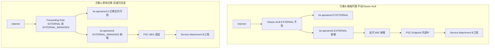
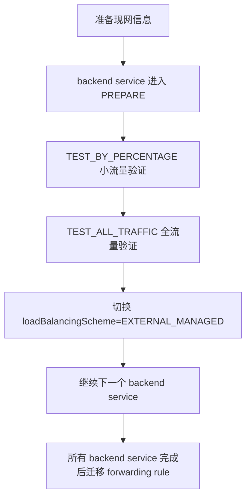

- [summary](#summary)
- [requirement](#requirement)
- [Claude](#claude)
  - [问题分析](#问题分析)
  - [解决方案](#解决方案)
    - [方案 B(推荐,短期):给 apiname3 单独加一层"跳板代理"](#方案-b推荐短期给-apiname3-单独加一层跳板代理)
    - [方案 A(推荐,中长期):官方支持的"原地迁移"](#方案-a推荐中长期官方支持的原地迁移)
    - [为什么不建议"新建一个独立 GLOBAL\_EXTERNAL\_MANAGED LB(新 IP)"](#为什么不建议新建一个独立-global_external_managed-lb新-ip)
  - [代码示例(方案 B)](#代码示例方案-b)
  - [流程图](#流程图)
  - [注意事项](#注意事项)
- [Claude B 方案](#claude-b-方案)
  - [方案 B 详细实施](#方案-b-详细实施)
    - [Step 1:创建 PSC Consumer Endpoint](#step-1创建-psc-consumer-endpoint)
    - [Step 2:防火墙准备](#step-2防火墙准备)
    - [Step 3:nginx 配置(核心)](#step-3nginx-配置核心)
    - [Step 4:实例模板 + 健康检查 + MIG](#step-4实例模板--健康检查--mig)
    - [Step 5:Backend Service(挂 Cloud Armor + 健康检查)](#step-5backend-service挂-cloud-armor--健康检查)
    - [Step 6:接入现有 URL Map(不动 apiname1/2 的规则)](#step-6接入现有-url-map不动-apiname12-的规则)
    - [Step 7:验证](#step-7验证)
  - [注意事项](#注意事项-1)
- [原地迁移详细实施](#原地迁移详细实施)
  - [迁移前检查](#迁移前检查)
  - [迁移控制面](#迁移控制面)
  - [1. 迁移 backend service](#1-迁移-backend-service)
    - [1.1 进入 PREPARE](#11-进入-prepare)
    - [1.2 小流量验证](#12-小流量验证)
    - [1.3 全流量验证](#13-全流量验证)
    - [1.4 切换 scheme](#14-切换-scheme)
    - [1.5 重复其他 backend service](#15-重复其他-backend-service)
  - [2. 如果有 backend bucket](#2-如果有-backend-bucket)
  - [3. 迁移 forwarding rule](#3-迁移-forwarding-rule)
  - [4. 验证清单](#4-验证清单)
  - [5. Zero downtime 控制点](#5-zero-downtime-控制点)
    - [必须遵守的节奏](#必须遵守的节奏)
    - [建议的观测窗口](#建议的观测窗口)
    - [不要同时做的事](#不要同时做的事)
  - [6. 回滚方案](#6-回滚方案)
    - [回滚顺序](#回滚顺序)
    - [回滚 forwarding rule](#回滚-forwarding-rule)
    - [回滚 backend service](#回滚-backend-service)
  - [7. 迁移完成后你能得到什么](#7-迁移完成后你能得到什么)
- [chatgpt](#chatgpt)
  - [可行性复核](#可行性复核)
    - [结论校验](#结论校验)
    - [需要修正的认知点](#需要修正的认知点)
    - [我对方案 B 的判断](#我对方案-b-的判断)
    - [我对方案 A 的判断](#我对方案-a-的判断)
    - [最终建议](#最终建议)

# summary 
- 1. Classic Application Load Balancer 保留旧的这个类型，然后只是新增的 API 走新的 load-balancing-scheme=EXTERNAL_MANAGED  这种方案经过分析是不行的
- 2. 给 apiname3 单独加一层"跳板代理" 这种方式可行，可以完美解决需求, 这种方案需要新建一个 MIG，然后里边要进行对应的跳转 等于是我在 A 工程里面创建一个 PSC endpoint ==> PSC to Master B 工程 
  - 核心思路:PSC Endpoint(consumer 侧)本质上只是 A 工程 VPC 内的一个内部 IP(基于 forwarding rule),任何在该 VPC 内、网络可达的 VM/MIG 都能直接 TCP 访问它。所以你不需要让 Classic ALB 直接认识 PSC NEG,只需要:
  - 在 A 工程新建一个 PSC Endpoint(指向 B 工程 Service Attachment),得到一个内部 IP(例如 10.x.x.x)
  - 新建一个小型 MIG(nginx/Envoy 反向代理),转发到这个 PSC Endpoint 内部 IP
  - 这个 MIG 以 Instance Group / Zonal NEG 的形式作为新 Backend Service(bs-caep-apiname3)挂进现有 Classic ALB 的 URL Map,新增 /apiname3/* path rule
  - 这样 Classic ALB 本身丝毫不动(scheme 依旧是 EXTERNAL),apiname1/2 零风险,只是给 apiname3 单独多接了一跳。
  - 这样做的代价是增加一个 MIG 的维护成本
- 3. 另外一个就是方案里边提到的就地迁移 
  - [阶段 2:逐个 backend service 迁移(沿用原文档状态机,补充熔断标准)](./in-situ-migration.md#阶段-2逐个-backend-service-迁移沿用原文档状态机补充熔断标准)
  - 如果没有 bucket 对应的迁移，那么是不是对应理解成 
    - 1 就是backend service 迁移 成load-balancing-scheme=EXTERNAL_MANAGED 其实是直接Update 
    - 2 forwarding rule 迁移 load-balancing-scheme=EXTERNAL_MANAGED 我如果不做percentage的迁移校验的话，直接这两个命令也就搞定了 
      - 不能跳过状态机直接一条 --load-balancing-scheme=EXTERNAL_MANAGED 命令搞定。官方文档明确写了硬性前置条件:
      - https://oneuptime.com/blog/post/2026-02-17-how-to-migrate-from-classic-to-global-external-application-load-balancer-in-gcp/view
      ```
      在把资源状态从 PREPARE 切换到 TEST_BY_PERCENTAGE 或 TEST_ALL_TRAFFIC 之后,需要等待约 6 分钟让资源就绪;资源必须先进入 TEST_ALL_TRAFFIC 状态,才能变更其负载均衡 scheme
      也就是说,--external-managed-migration-state 必须先走到 TEST_ALL_TRAFFIC,你才被允许执行 --load-balancing-scheme=EXTERNAL_MANAGED 这条命令——这是 API 层面的强制前置校验,不是"建议流程",直接跳过去执行大概率会被拒绝(报状态不满足的错误)
      但你可以跳过的是 TEST_BY_PERCENTAGE 这个"按比例灰度"的中间态,因为它本质是给你留的一个"小流量先验证一下"的可选缓冲,不是强制状态。也就是说最简化路径是: PREPARE → TEST_ALL_TRAFFIC → 切 scheme=EXTERNAL_MANAGED三步,而不是你说的两步。少了中间灰度验证,风险自然更高(相当于一次性把 100% 流量切到新基础设施),但流程上是允许跳过百分比灰度这一步的。
      ```
    - 3 我想确认的是，执行命令的过程中，原来的流量不能正常工作。就说我旧的API都能够正常访问
    - 4 总结一下，我们最终采用的方案是保持这个 Classic Application Load Balancer不变。 因为我们这个对应的后面一个 MIG，MIG 是一个对应的 Nginx ,所以我们基于 localtion path 把这个用户的请求转发到一个本地的 PSC NEG 上面就可以
      - 唯一需要注意的是，这个 PSC 的 NEG 其实可以 创建在不同的网络里。PSC NEG ===> cross Project ==> connect another Project's attachment ===> cross Project another MIG(Nginx)  OR ==> K8s


# requirement
```bash
现网在 A 工程(Tenant project)有一份 Classic Application Load Balancer(FR loadBalancingScheme=EXTERNAL,Premium Tier global),接住 https://www.caep.uk 公网域名,域名 A-record 已绑固定 IP
现网 apiname1 / apiname2 两个 API 逻辑不变 — 它们继续走 A 工程本地的 Backend Service 
┌────────────────────────────────────────────────────────────────────────┐
│ INTERNET                                                               │
│   curl https://www.caep.uk/apiname1/...                                │
│   curl https://www.caep.uk/apiname2/...                                │
└─────────────┬──────────────────────────────────────────────────────────┘
              │ DNS A-record → 34.x.x.x (固定 IP,不可改)
              ▼
┌────────────────────────────────────────────────────────────────────────┐
│ PROJECT A (Tenant, www.caep.uk 已 A-record → 此 GLB 的固定 IP)         │
│ ┌──────────────────────────────────────────────────────────────────┐  │
│ │ Classic Application Load Balancer                                  │  │
│ │   --load-balancing-scheme=EXTERNAL (Premium Tier,global)           │  │
│ │   ★ 现网已有,不动 ★                                              │  │
│ │                                                                  │  │
│ │   Frontend :443, Cert: *.caep.uk, Target HTTPS Proxy (不动)      │  │
│ └─────────────┬────────────────────────────────────────────────────┘  │
│                ▼                                                       │
│ ┌──────────────────────────────────────────────────────────────────┐  │
│ │ URL Map (注意:Classic ALB 也支持 path rule + host rule)          │  │
│ │   hostRules: [www.caep.uk] → caep-api-matcher                     │  │
│ │   pathRules:                                                     │  │
│ │     /apiname1/*  →  bs-caep-apiname1  (EXTERNAL        )         │  │
│ │     /apiname2/*  →  bs-caep-apiname2  (EXTERNAL        )         │  │
│ │     /apiname3/*  →  bs-caep-apiname3  (EXTERNAL_MANAGED)         │  │
│ │     default     →  bs-caep-default   (EXTERNAL         )         │  │
│ └─────────────┬────────────────────────────────────────────────────┘  │
│                │ URL Map path rule 选 BS(EXTERNAL_MANAGED)            │
│                ▼                                                       │
│ ┌──────────────────────────────────────────────────────────────────┐  │
│ │ Backend Service (★ 关键:scheme=EXTERNAL_MANAGED,不是 EXTERNAL)  │  │
│ │                                                                  │  │
│ │   bs-caep-apiname1  --load-balancing-scheme=EXTERNAL             │  │
│ │     - protocol: HTTPS                                            │  │
│ │     - backends: ProjetA backendserviceA          │  │
│ │     - security-policy: policy-apiname1  (Cloud Armor, ★ A 工程)   │  │
│ │   bs-caep-apiname2  --load-balancing-scheme=EXTERNAL             │  │
│ │     - backends: ProjectA backendserviceA         │  │
│ │     - security-policy: policy-apiname2                           │  │
│ │   bs-caep-apiname3  --load-balancing-scheme=EXTERNAL_MANAGED      │  │
│ │     - backends: PSC NEG caep-apiname3-neg (→ B side SA-1)          │  │
│ │     - security-policy: policy-apiname3                           │  │
│ └─────────────┬────────────────────────────────────────────────────┘  │
└────────────────┼───────────────────────────────────────────────────────┘
                 │ PSC Tunnel (A → B, Google 内部骨干) 我这里想针对 APINAME3这一个 API 做对应的 PSC
                 ▼
┌────────────────────────────────────────────────────────────────────────┐
│ PROJECT B (Master)                                                     │
│   Service Attachment → L7 Internal ALB → MIG nginx → K8s Gateway       │
│   (详见 /Users/lex/git/knowledge/cloud/k8s/k8s-gateway/                 │
│    public-fqdn-explorer.md §1 / §3,本方案 B 侧全引用此 doc)            │
└────────────────────────────────────────────────────────────────────────┘

- 1 保留 A project Classic ALB 的 EXTERNAL forwarding rule 我想确认一下这种方式能不能实现，因为其实核心的目的是想要 通过PSC Cross Project 工程。但是有一点非常明确的是Classic Application Load Balancer这种类型的是不支持是PSC网络这种格式的
- 2 核心一句话的总结就是说，对于一个 classic application load balance 这种 GLB 的类型下面，我能不能增加一个新的 backend service 让它支持 PSC Cross Project 
就是说我原来的两个 API，APIname1、APIname2都已经是在这个 A 工程里边了 其BackendService 都是BackendServiceA 也就是这两个 API 都共用同一个后端服务，
- 现在想添加一个新的 APIname3，我想给这个 APIname3 搞一个新的 Backend Service。我想让这个新的 API 能够 Cross Project 通过 PSC 的方式实现到我的新工程  新建 EXTERNAL_MANAGED backend service(A 工程内,可绑 Cloud Armor + PSC NEG)+ 新建 PSC NEG(跨 project 指向 B 工程 SA) ? 
帮我探索一下这个怎么实现？如果要实现的话，要做哪些改造 ?我知道GLOBAL_EXTERNAL_MANAGED_HTTP_HTTP 这种类型可以实现，但是我们的环境里面已经设置了Classic Application Load Balancer.所以说，我们想探索在不进行 migration的情况下能不能实现
```
# Claude
## 问题分析

结论先行:**在不改变现有 Classic Application Load Balancer(EXTERNAL scheme)的前提下,直接给它挂一个 PSC NEG 类型的 Backend Service 是不可行的**,这不是配置层面的限制,而是 GCP 的硬性架构约束:

1. **PSC NEG 明确不支持 Classic 版本的 LB**。Google 官方文档写得很清楚:"You can use any Google Cloud proxy load balancer with a PSC Backend. Classic versions of the External Application and Network Load Balancers are not supported." 支持 PSC 后端的必须是代理型负载均衡器,Classic 版本的外部应用和网络负载均衡器不被支持。PSC NEG 只能挂在 Envoy 数据面(GFE+Envoy)的 LB 上,即 GLOBAL_EXTERNAL_MANAGED / 区域级 EXTERNAL_MANAGED / INTERNAL_MANAGED。

2. **同一个 URL Map/转发规则下不能混用 scheme**。你原本设想"URL Map 里 apiname1/2 走 EXTERNAL backend,apiname3 走 EXTERNAL_MANAGED backend",这在架构上不成立——backend service 的 `--load-balancing-scheme` 必须与其挂载的 forwarding rule / target proxy 一致,GCP 会在创建/更新时直接校验拒绝,不存在"一个 URL Map 混挂两种 scheme"的形态。

所以你图中方案 2 提出的"新建 EXTERNAL_MANAGED backend service + PSC NEG,直接挂进现有 Classic ALB"这条路径,技术上走不通。

---

## 解决方案

在"不整体 migration"这个约束下,有两条可行路径,我按推荐度排序:

### 方案 B(推荐,短期):给 apiname3 单独加一层"跳板代理"

核心思路:PSC Endpoint(consumer 侧)本质上只是 A 工程 VPC 内的一个**内部 IP**(基于 forwarding rule),任何在该 VPC 内、网络可达的 VM/MIG 都能直接 TCP 访问它。所以你不需要让 Classic ALB 直接认识 PSC NEG,只需要:

- 在 A 工程新建一个 **PSC Endpoint**(指向 B 工程 Service Attachment),得到一个内部 IP(例如 `10.x.x.x`)
- 新建一个小型 MIG(nginx/Envoy 反向代理),转发到这个 PSC Endpoint 内部 IP
- 这个 MIG 以 **Instance Group / Zonal NEG** 的形式作为新 Backend Service(`bs-caep-apiname3`)挂进现有 Classic ALB 的 URL Map,新增 `/apiname3/*` path rule

这样 Classic ALB 本身**丝毫不动**(scheme 依旧是 EXTERNAL),apiname1/2 零风险,只是给 apiname3 单独多接了一跳。

### 方案 A(推荐,中长期):官方支持的"原地迁移"

Google 提供官方的 Classic → GLOBAL_EXTERNAL_MANAGED **原地迁移流程**,不是"重建一套新 LB",而是把现有 forwarding rule/backend service 的 scheme 从 EXTERNAL 逐步(可按流量百分比灰度)切到 EXTERNAL_MANAGED, 按特定顺序迁移资源以确保不中断:先迁移 backend service,再将 forwarding rule 的 scheme 从 EXTERNAL 改为 EXTERNAL_MANAGED 完成迁移。关键优势:

- **IP 不变**,不需要改 DNS A 记录
- 可以先 `TEST_BY_PERCENTAGE` 灰度验证,确认无误再切 100%
- 90 天内如有问题可以按顺序回滚到 Classic scheme,风险可控

迁移完成后,apiname1/2 的行为不受影响(GEML 完全兼容原有 path/host 路由),而 apiname3 就可以正常挂 PSC NEG 了。

### 为什么不建议"新建一个独立 GLOBAL_EXTERNAL_MANAGED LB(新 IP)"

因为你的 DNS A 记录已固定绑到现有 IP 且不可改,DNS 层无法按 path 分流到两个不同 IP 的 LB。除非在前面再加一层反代做 path 路由——那本质上又变成了方案 B 的变体,但复杂度更高(相当于代理整个域名而不是单个 API)。

---

## 代码示例(方案 B)

```bash
# 1. A 工程创建 PSC Endpoint,指向 B 工程 Service Attachment
gcloud compute addresses create psc-apiname3-ip \
  --region=REGION --subnet=SUBNET_A --project=PROJECT_A

gcloud compute forwarding-rules create psc-apiname3-fr \
  --region=REGION \
  --network=VPC_A \
  --address=psc-apiname3-ip \
  --target-service-attachment=projects/PROJECT_B/regions/REGION/serviceAttachments/SA-1 \
  --project=PROJECT_A

# 2. 部署一个轻量反代 MIG(nginx/envoy),upstream 指向上面的内部 IP
#    (略,标准 MIG + startup-script 配置反代 target = PSC Endpoint 内部 IP:PORT)

# 3. 新建 Backend Service(仍是 EXTERNAL scheme,兼容 Classic ALB)
gcloud compute backend-services create bs-caep-apiname3 \
  --load-balancing-scheme=EXTERNAL \
  --protocol=HTTPS \
  --global \
  --security-policy=policy-apiname3 \
  --project=PROJECT_A

gcloud compute backend-services add-backend bs-caep-apiname3 \
  --instance-group=ig-apiname3-proxy \
  --instance-group-zone=ZONE \
  --global \
  --project=PROJECT_A

# 4. 在现有 URL Map 上追加 path rule(不动 apiname1/2 的规则)
gcloud compute url-maps add-path-matcher caep-api-matcher \
  --path-rules="/apiname3/*=bs-caep-apiname3" \
  --project=PROJECT_A
```

方案 A 的关键命令(仅示意,官方文档有完整灰度步骤):

```bash
# 逐个 backend service 迁移
gcloud compute backend-services update bs-caep-apiname1 \
  --external-managed-migration-state=TEST_BY_PERCENTAGE \
  --external-managed-migration-testing-percentage=10

# 验证无误后,最终切 forwarding rule
gcloud compute forwarding-rules update FR_NAME \
  --load-balancing-scheme=EXTERNAL_MANAGED --global
```

---

## 流程图



---

## 注意事项

- **PSC NEG 与 Classic ALB 不兼容是官方明确限制**,不要在这个方向上继续尝试变通配置(比如改 backend service 的 scheme 字段试图"骗过"URL Map),会在 apply 阶段直接报错。
- 方案 B 中,Cloud Armor 策略(`policy-apiname3`)挂在 Classic ALB 的 `bs-caep-apiname3` 上依然生效,因为这个 backend service 本身还是标准的 Instance Group 类型,和 apiname1/2 一致。
- 方案 B 的反代 MIG 需要自己承担健康检查、扩缩容、TLS 终止/透传、日志观测等——相当于自建了一份 PSC NEG 本该提供的能力,增加了一个可运维面,后续如果 PSC 侧地址/端口变化需要同步改代理配置。
- 部署 PSC Endpoint 后,确认 A 工程 VPC 的防火墙规则允许反代 MIG 访问该内部 IP(默认 PSC 消费侧访问不受防火墙限制,但如果有额外的出站限制策略要留意)。
- 方案 A 迁移期间用 `TEST_BY_PERCENTAGE` 先跑小流量,建议避开业务高峰;90 天内可回滚,风险总体可控,但仍建议提前跟测试团队对齐验证 checklist(尤其是 IAP、Cloud Armor 规则在 GEML 下是否有差异)。
- 如果预期未来还会有 apiname4/5 等继续要接 PSC 或需要更高级的流量管理(header-based routing、流量分割),方案 B 的技术债会持续累积,建议把方案 A 作为路线图目标,方案 B 仅作为过渡。


# Claude B 方案 
## 方案 B 详细实施

按"临时方案"定位来设计:所有资源统一打标签 `purpose=temp-psc-bridge-apiname3`,方便后续在切到方案 A(原地迁移)后一键清理。整体分 7 步,资源命名统一用 `apiname3-*` 前缀。

---

### Step 1:创建 PSC Consumer Endpoint

这是整个方案的起点——本质是在 A 工程 VPC 里预留一个内部 IP,并建一条特殊的转发规则指向 B 工程的 Service Attachment。

```bash
# 1.1 预留内部静态 IP
gcloud compute addresses create apiname3-psc-ip \
  --region=REGION \
  --subnet=SUBNET_A \
  --project=PROJECT_A

# 1.2 创建 PSC Endpoint(不需要 --load-balancing-scheme,由 target-service-attachment 决定类型)
gcloud compute forwarding-rules create apiname3-psc-fr \
  --region=REGION \
  --network=VPC_A \
  --address=apiname3-psc-ip \
  --target-service-attachment=projects/PROJECT_B/regions/REGION/serviceAttachments/SA-1 \
  --project=PROJECT_A

# 1.3 记录分配到的内部 IP(后面 nginx 配置要用)
gcloud compute addresses describe apiname3-psc-ip \
  --region=REGION --project=PROJECT_A --format="value(address)"
```

> 如果 B 工程的 Service Attachment 开启了"需要显式接受连接"(connection preference = ACCEPT_MANUAL),需要请 B 工程侧把 A 工程的 project number 加入白名单,否则 forwarding rule 会一直处于 `PENDING` 状态。

---

### Step 2:防火墙准备

代理 MIG 需要能访问 PSC Endpoint IP,同时要放行 Google 的健康检查探测源。

```bash
# 2.1 允许代理实例访问 PSC Endpoint(通常同 VPC 默认路由已通,主要是确认没有更严格的出站策略拦截)
gcloud compute firewall-rules create allow-apiname3-proxy-egress-psc \
  --network=VPC_A \
  --direction=EGRESS \
  --action=ALLOW \
  --rules=tcp:443 \
  --destination-ranges=$(该内部IP)/32 \
  --target-tags=apiname3-proxy \
  --project=PROJECT_A

# 2.2 放行 Classic ALB 的健康检查 + 转发流量源段(固定网段,ALB backend 实例必须放行)
gcloud compute firewall-rules create allow-apiname3-lb-and-hc \
  --network=VPC_A \
  --direction=INGRESS \
  --action=ALLOW \
  --rules=tcp:443 \
  --source-ranges=130.211.0.0/22,35.191.0.0/16 \
  --target-tags=apiname3-proxy \
  --project=PROJECT_A
```

---

### Step 3:nginx 配置(核心)

代理实例只做一件事:**接住 Classic ALB 转发过来的请求,原样转发到 PSC Endpoint 内部 IP**。给出两种协议方案,推荐从简单的 HTTP 开始(临时方案没必要上自签证书的复杂度)。

**推荐(简单版,Backend Service 用 HTTP 协议):**

```nginx
# /etc/nginx/conf.d/apiname3.conf
server {
    listen 8080;
    server_name _;

    location /healthz {
        access_log off;
        return 200 'ok';
        add_header Content-Type text/plain;
    }

    location / {
        proxy_pass https://__PSC_ENDPOINT_IP__:443;
        proxy_ssl_verify off;                    # PSC 后端是内部服务,通常不做证书校验

        proxy_set_header Host $host;
        proxy_set_header X-Real-IP $remote_addr;
        proxy_set_header X-Forwarded-For $proxy_add_x_forwarded_for;
        proxy_set_header X-Forwarded-Proto $scheme;

        proxy_connect_timeout 5s;
        proxy_read_timeout    60s;
        proxy_send_timeout    60s;
    }
}
```

> Classic ALB → 代理实例这一段跑 HTTP(8080 端口),代理实例 → PSC Endpoint 这一段跑 HTTPS——这样既避免了给代理实例自签证书的麻烦,又保证了触达 B 工程内部服务的这段是加密的。如果合规要求 ALB→代理这段也必须是 HTTPS,再上自签证书 + `listen 443 ssl` 即可,原理一样。

**启动脚本(startup-script,随实例模板注入):**

```bash
#!/bin/bash
set -e

apt-get update
apt-get install -y nginx

PSC_IP=$(curl -s -H "Metadata-Flavor: Google" \
  "http://metadata.google.internal/computeMetadata/v1/instance/attributes/psc-endpoint-ip")

cat > /etc/nginx/conf.d/apiname3.conf <<EOF
server {
    listen 8080;
    server_name _;

    location /healthz {
        access_log off;
        return 200 'ok';
        add_header Content-Type text/plain;
    }

    location / {
        proxy_pass https://${PSC_IP}:443;
        proxy_ssl_verify off;
        proxy_set_header Host \$host;
        proxy_set_header X-Real-IP \$remote_addr;
        proxy_set_header X-Forwarded-For \$proxy_add_x_forwarded_for;
        proxy_set_header X-Forwarded-Proto \$scheme;
        proxy_connect_timeout 5s;
        proxy_read_timeout    60s;
        proxy_send_timeout    60s;
    }
}
EOF

rm -f /etc/nginx/sites-enabled/default
systemctl restart nginx
systemctl enable nginx
```

保存为 `startup.sh`,实例模板创建时通过 `--metadata-from-file` 注入,PSC IP 通过 `--metadata` 单独传,这样后面 PSC IP 变了只需要改 metadata + 重建实例模板,不用改脚本。

---

### Step 4:实例模板 + 健康检查 + MIG

```bash
# 4.1 健康检查(探测代理实例自身的 /healthz,不是探测 PSC 后端)
gcloud compute health-checks create http apiname3-proxy-hc \
  --port=8080 \
  --request-path=/healthz \
  --check-interval=10s \
  --timeout=5s \
  --project=PROJECT_A

# 4.2 实例模板
gcloud compute instance-templates create apiname3-proxy-tpl \
  --machine-type=e2-small \
  --image-family=debian-12 \
  --image-project=debian-cloud \
  --network=VPC_A \
  --subnet=SUBNET_A \
  --no-address \
  --tags=apiname3-proxy \
  --metadata-from-file=startup-script=startup.sh \
  --metadata=psc-endpoint-ip=$(该内部IP) \
  --labels=purpose=temp-psc-bridge-apiname3 \
  --project=PROJECT_A

# 4.3 托管实例组(2 个 zone 起步,按需开自动扩缩)
gcloud compute instance-groups managed create apiname3-proxy-mig \
  --template=apiname3-proxy-tpl \
  --size=2 \
  --zone=ZONE \
  --project=PROJECT_A

gcloud compute instance-groups managed set-named-ports apiname3-proxy-mig \
  --named-ports=http8080:8080 \
  --zone=ZONE \
  --project=PROJECT_A
```

---

### Step 5:Backend Service(挂 Cloud Armor + 健康检查)

```bash
gcloud compute backend-services create bs-caep-apiname3 \
  --load-balancing-scheme=EXTERNAL \
  --protocol=HTTP \
  --port-name=http8080 \
  --health-checks=apiname3-proxy-hc \
  --security-policy=policy-apiname3 \
  --global \
  --project=PROJECT_A

gcloud compute backend-services add-backend bs-caep-apiname3 \
  --instance-group=apiname3-proxy-mig \
  --instance-group-zone=ZONE \
  --global \
  --project=PROJECT_A
```

---

### Step 6:接入现有 URL Map(不动 apiname1/2 的规则)

```bash
gcloud compute url-maps add-path-matcher caep-api-matcher \
  --default-service=bs-caep-default \
  --path-rules="/apiname1/*=bs-caep-apiname1,/apiname2/*=bs-caep-apiname2,/apiname3/*=bs-caep-apiname3" \
  --new-hosts=www.caep.uk \
  --project=PROJECT_A
```

> 注意:`add-path-matcher` 通常需要连同已有的 path-rules 一起重新声明(否则会覆盖),实施前建议先 `gcloud compute url-maps describe caep-api-matcher` 导出当前完整配置,确认 apiname1/2 的规则原样保留后再执行。

---

### Step 7:验证

```bash
# 7.1 先在 VPC 内部直连验证 PSC Endpoint 本身通不通
gcloud compute ssh some-debug-vm --zone=ZONE --project=PROJECT_A \
  --command="curl -sk https://$(该内部IP)/健康探测路径"

# 7.2 验证代理实例自身健康
curl http://代理实例内网IP:8080/healthz

# 7.3 最后走公网全链路验证
curl -v https://www.caep.uk/apiname3/健康探测路径
```

---

## 注意事项

- **标签管理**:所有新建资源(IP、转发规则、实例模板、MIG、backend service)统一打 `purpose=temp-psc-bridge-apiname3` 标签,写进内部文档并注明"临时方案,待 Classic→GEML 迁移完成后下线",避免变成没人敢动的历史遗留。
- **单点故障与容量**:代理层是新增的一跳,MIG 建议至少 2 实例跨 zone,并配置基于 CPU 或请求数的 autoscaler,否则这层会成为新的可用性短板。
- **超时与重试语义**:nginx 默认的 `proxy_read_timeout` 要和 B 工程侧服务的实际响应时间对齐,如果 apiname3 有长耗时接口,记得调大,否则会出现代理层主动断连而 Classic ALB 侧看到的是 502/504。
- **TLS 校验**:示例里 `proxy_ssl_verify off` 是为了简化临时方案,如果对内网加密链路的证书校验有合规要求,需要把 B 工程服务的证书(或 CA)分发到代理实例并开启校验。
- **可观测性**:Classic ALB 的日志只能看到"到 bs-caep-apiname3 的 backend 是否健康",看不到 PSC 这一跳的细节,建议在 nginx 上开 access log 并采集到 Cloud Logging,方便排查连通性问题。
- **安全边界**:Cloud Armor 策略挂在 `bs-caep-apiname3` 上,是在 Classic ALB 层生效的,代理实例本身也建议只允许上面配置的两个防火墙来源访问,避免被当作开放跳板。
- **退出路径**:这层代理只是过渡,一旦按方案 A 完成 Classic→GEML 的原地迁移,apiname3 就可以直接换成 PSC NEG backend,届时把 `bs-caep-apiname3`、MIG、实例模板、PSC Endpoint 一起按标签清理即可。


# 原地迁移详细实施

这部分是把现网 Classic Application Load Balancer 迁移到 global external Application Load Balancer 的正式操作手册。

迁移目标很明确：

1. **保住现有 IP 和 DNS**，不改 `www.caep.uk` 的 A record。
2. **把现有 `EXTERNAL` 体系平滑迁到 `EXTERNAL_MANAGED`**，为后续直接接 PSC NEG 做准备。

官方迁移顺序是固定的：

1. 先迁移所有 backend services
2. 如果有 backend buckets，再迁移 backend buckets
3. 最后迁移 forwarding rule

迁移过程中，classic 和 global external 两套基础设施会并存，流量会按你设定的比例逐步切换。这就是 zero downtime 的核心。

## 迁移前检查

先把现网信息固化下来，避免迁移过程中出现“改到一半不知道原来长什么样”的情况。

```bash
export PROJECT_ID=PROJECT_A
export FR_NAME=caep-https-fr
export URL_MAP=caep-api-matcher
export BS_APINAME1=bs-caep-apiname1
export BS_APINAME2=bs-caep-apiname2
export BS_DEFAULT=bs-caep-default

gcloud config set project "$PROJECT_ID"

gcloud compute forwarding-rules describe "$FR_NAME" --global
gcloud compute url-maps describe "$URL_MAP" --global
gcloud compute backend-services describe "$BS_APINAME1" --global
gcloud compute backend-services describe "$BS_APINAME2" --global
gcloud compute backend-services describe "$BS_DEFAULT" --global
```

迁移前要确认的点：

- forwarding rule 还是现网固定 IP，对外入口不变
- URL map 里的 host / path 规则都已经清楚
- 所有 backend service 的 health check 正常
- Cloud Armor 策略已经绑定在各 backend service 上
- 如果有 backend bucket，也要单独记下来

## 迁移控制面

建议把迁移拆成一个一个 backend service，逐个看流量和指标，不要把所有东西一次性推到 100%。



## 1. 迁移 backend service

以 `bs-caep-apiname1` 为例，其他 backend service 按同样流程重复。

### 1.1 进入 PREPARE

```bash
gcloud compute backend-services update "$BS_APINAME1" \
  --global \
  --external-managed-migration-state=PREPARE
```

等待至少 6 分钟，再去看状态和健康检查。

### 1.2 小流量验证

建议先从 5% 或 10% 开始，确认指标稳定后再放大。

```bash
gcloud compute backend-services update "$BS_APINAME1" \
  --global \
  --external-managed-migration-state=TEST_BY_PERCENTAGE \
  --external-managed-migration-testing-percentage=10
```

这一步的目标不是“快”，而是确认：

- 4xx / 5xx 没有异常抖动
- 延迟没有明显上升
- Cloud Armor 仍然生效
- 后端实例内存和连接数没有异常增高

官方迁移说明里提到，切到 global external 后，后端连接数可能会增加，尤其是 HTTP/1.1 场景，要重点盯后端内存和连接数。

### 1.3 全流量验证

如果 10% 没问题，再提升到 50%，最后到 100%。

```bash
gcloud compute backend-services update "$BS_APINAME1" \
  --global \
  --external-managed-migration-state=TEST_ALL_TRAFFIC
```

这一步的含义是：所有流量都已经由 global external 的迁移路径处理，但 backend service 还没有最终切到 `EXTERNAL_MANAGED`。

### 1.4 切换 scheme

确认全量稳定后，再把 backend service 的 scheme 切成 `EXTERNAL_MANAGED`。

```bash
gcloud compute backend-services update "$BS_APINAME1" \
  --global \
  --load-balancing-scheme=EXTERNAL_MANAGED
```

等待至少 6 分钟，再继续下一个 backend service。

### 1.5 重复其他 backend service

对 `bs-caep-apiname2`、`bs-caep-default` 重复同样动作。

如果后面还有更多 backend service，也必须逐个迁移完成，不能留一个 `EXTERNAL` 的 backend service 卡住 forwarding rule。

## 2. 如果有 backend bucket

如果这个 URL map 下面还挂了 backend bucket，要在 forwarding rule 层迁移。

```bash
gcloud compute forwarding-rules update "$FR_NAME" \
  --global \
  --external-managed-backend-bucket-migration-state=PREPARE

gcloud compute forwarding-rules update "$FR_NAME" \
  --global \
  --external-managed-backend-bucket-migration-state=TEST_BY_PERCENTAGE \
  --external-managed-backend-bucket-migration-testing-percentage=10

gcloud compute forwarding-rules update "$FR_NAME" \
  --global \
  --external-managed-backend-bucket-migration-state=TEST_ALL_TRAFFIC
```

如果你现在没有 backend bucket，可以跳过这一段。

## 3. 迁移 forwarding rule

所有 backend service 都迁完以后，最后才动 forwarding rule 的 scheme。

```bash
gcloud compute forwarding-rules update "$FR_NAME" \
  --global \
  --load-balancing-scheme=EXTERNAL_MANAGED
```

等待至少 6 分钟，再做最终验证。

这个动作完成后，整套 Classic ALB 才算正式切到 global external Application Load Balancer。

## 4. 验证清单

迁移期间建议每一步都看这些指标：

- `curl https://www.caep.uk/apiname1/...`
- `curl https://www.caep.uk/apiname2/...`
- `curl https://www.caep.uk/` 的默认路由
- 后端健康检查状态
- 4xx / 5xx 比例
- p50 / p95 / p99 延迟
- 后端实例 CPU、内存、连接数
- Cloud Armor 命中日志

常用检查命令：

```bash
gcloud compute backend-services get-health "$BS_APINAME1" --global
gcloud compute backend-services get-health "$BS_APINAME2" --global
gcloud compute backend-services get-health "$BS_DEFAULT" --global

gcloud compute backend-services describe "$BS_APINAME1" --global --format="yaml(name,loadBalancingScheme,backends,healthChecks)"
gcloud compute forwarding-rules describe "$FR_NAME" --global --format="yaml(name,IPAddress,loadBalancingScheme,target)"
```

## 5. Zero downtime 控制点

要做到平滑切换，关键不是命令本身，而是控制节奏。

### 必须遵守的节奏

1. 每次状态变更后至少等 6 分钟
2. 每个 backend service 单独验证，不要并行乱切
3. 先小流量，再全流量，最后改 scheme
4. forwarding rule 一定放在所有 backend service 之后

### 建议的观测窗口

| 阶段 | 建议观测时间 | 通过标准 |
|---|---:|---|
| `PREPARE` | 6-10 分钟 | 健康检查稳定 |
| `TEST_BY_PERCENTAGE` | 15-30 分钟 | 错误率和延迟无异常 |
| `TEST_ALL_TRAFFIC` | 15-30 分钟 | 全量流量稳定 |
| `EXTERNAL_MANAGED` | 6-10 分钟 | scheme 完成切换 |

### 不要同时做的事

- 不要在迁移同时改后端应用版本
- 不要在迁移同时改 Cloud Armor 规则
- 不要在迁移同时改证书或 URL map 规则
- 不要在高峰期第一次就切 100%

## 6. 回滚方案

回滚只适用于迁移后 90 天内，而且顺序必须反过来。

### 回滚顺序

1. 先回滚 forwarding rule
2. 再回滚 backend bucket
3. 最后回滚 backend service

### 回滚 forwarding rule

```bash
gcloud compute forwarding-rules update "$FR_NAME" \
  --global \
  --load-balancing-scheme=EXTERNAL
```

### 回滚 backend service

在 forwarding rule 已经回滚之后，再把 backend service 切回 `EXTERNAL`。

```bash
gcloud compute backend-services update "$BS_APINAME1" \
  --global \
  --load-balancing-scheme=EXTERNAL \
  --external-managed-migration-state=TEST_ALL_TRAFFIC
```

如果要部分回滚，也可以先用 `TEST_BY_PERCENTAGE` 做小比例切回。

## 7. 迁移完成后你能得到什么

迁移到 `EXTERNAL_MANAGED` 后，这个入口就可以进一步支持：

- 直接挂 PSC NEG
- 更统一的流量治理能力
- 更适合后续扩展到新的 path rule 或 header-based routing

如果你后面要把 `apiname3` 真正做成 PSC Cross Project 直连，原地迁移是必须先完成的地基。

# chatgpt 
## 可行性复核

整体判断：**这份文档的主方向是正确的**，但需要把“不可行的原生直挂 PSC NEG”与“可行的代理桥接方案”明确分开。

### 结论校验

1. **“Classic ALB 直接挂 PSC NEG / EXTERNAL_MANAGED backend”这一条，结论正确：不可行。**
   - Classic External Application Load Balancer 不能直接消费 PSC Backend。
   - 也不能在同一个 Classic URL Map 里，把 `EXTERNAL` 和 `EXTERNAL_MANAGED` backend service 混着挂。
   - 这一部分在架构边界上是成立的。

2. **“给 apiname3 单独加一层 MIG 反代，再让 Classic ALB 转到这个 MIG”这一条，方向正确：可行。**
   - 这不是原生 PSC 直通，而是一个过渡桥。
   - Classic ALB 只看到普通的 instance group backend，所以能保住现有 `apiname1 / apiname2` 不动。
   - 代价是多一跳，带来额外的延迟、维护和故障域。

3. **“官方原地迁移到 GLOBAL_EXTERNAL_MANAGED”这一条，作为长期方案也是正确的。**
   - 如果目标是彻底接 PSC / EXTERNAL_MANAGED，最终还是应该走这条路线。
   - 它是最干净的终态，不是临时绕路。

### 需要修正的认知点

| 项目 | 文档当前表达 | 更准确的认知 |
|---|---|---|
| 方案 B 的定位 | “可以完美解决需求” | 可以满足需求，但本质是临时桥接，不是完美解 |
| PSC Endpoint 的访问方式 | “VPC 内任意 VM/MIG 都能直接访问” | 大体成立，但还要看路由、Firewall、上游是否要求 Host/SNI |
| TLS 配置 | `proxy_ssl_verify off` | 仅适合临时验证，生产应补证书校验或明确的信任链 |
| URL Map 改造 | 直接追加 path rule | 实施时要先导出并复核现网完整 URL Map，避免覆盖现有规则 |
| PSC 相关命令 | 作为示例可直接使用 | 方向对，但 PSC consumer endpoint 的具体 flag 需要按区域和资源类型再核一遍 |

### 我对方案 B 的判断

方案 B **能做**，但它是“可运维的折中”，不是“架构上的最优解”。

它适合这些条件：

- 你短期内不能迁移现有 Classic ALB
- 你只想让 `apiname3` 先跑起来
- 你能接受多一层代理和运维成本

它不适合这些条件：

- 你后面还会持续增加很多 PSC 接入 API
- 你想要最少组件、最少故障域
- 你希望长期把流量治理统一到原生 EXTERNAL_MANAGED / PSC 模型

### 我对方案 A 的判断

方案 A 才是最终应走的路线。

- 它保留现有 IP，不需要改 DNS
- 它把路径从 Classic 体系迁到原生可支持 PSC 的体系
- 它比“外挂一个代理 MIG”更接近长期维护模型

### 最终建议

如果按优先级排：

1. **短期止血**：方案 B，先让 `apiname3` 接入
2. **中长期收敛**：方案 A，迁到 `GLOBAL_EXTERNAL_MANAGED`
3. **不要继续尝试**：直接在 Classic ALB 上硬挂 PSC NEG

如果这份文档是给内部评审用的，我建议在 `summary` 里把“方案 B 可行”改成“方案 B 可作为临时桥接，可行但有运维代价”，这样会更严谨。
