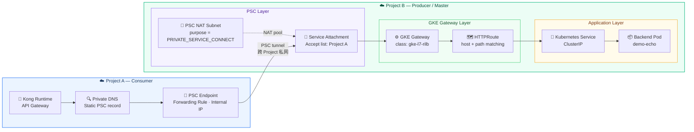
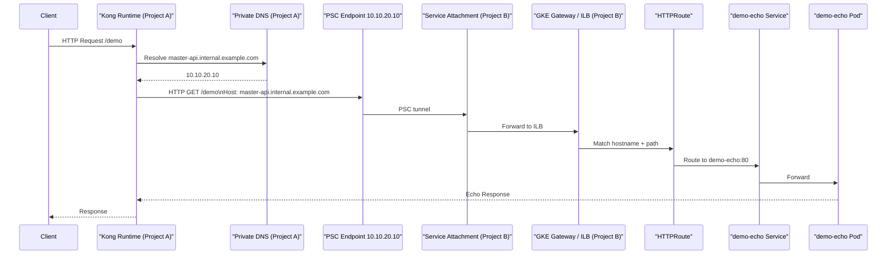
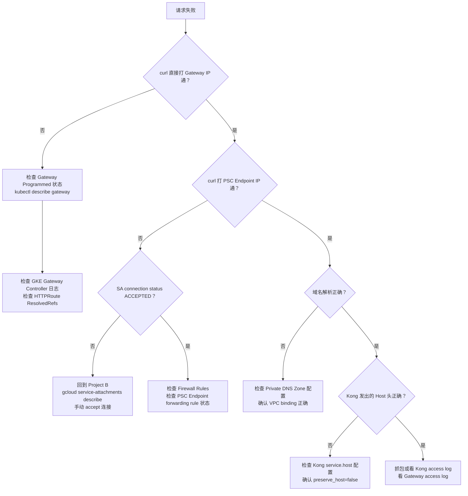

我来仔细 Review 一下这份文档，然后给你一个结构化的理解输出。好，我已经读完这份文档了。下面是我的完整 Review 和一份可以直接用于执行 POC 的梳理文档。





---

## 🔍 Review 总评

整体设计思路清晰、分层合理，是一份质量较高的架构 POC 文档。以下是我的具体 Review 意见：

### ✅ 做得好的地方

**架构分层清晰**，职责划分明确：Kong 负责上游 API 治理，GKE Gateway 负责内部路由，PSC 负责网络隔离。

**风险意识强**，Section 7 的"容易踩坑"部分非常实用，尤其是"先验内部链路再查 PSC"和"别一开始就上 mTLS"。

**渐进式验证思路正确**，Section 9 的最小落地建议是最佳实践。

---

### ⚠️ 需要补充或修正的问题

**问题 1：Step 6 查 forwarding rule 需要更精确的过滤方式**

文档里直接 `list` 所有 forwarding rules，GKE 集群里可能有很多规则，需要明确如何找到 Gateway 对应的那条。

实际应该通过 Gateway 的 `status.addresses` 或 GKE 自动打的 Label 来定位：

```bash
# 先拿 Gateway 分配的 IP
kubectl get gateway master-internal-gateway -n gateway-demo \
  -o jsonpath='{.status.addresses[*].value}'

# 再用 IP 反查 forwarding rule
gcloud compute forwarding-rules list \
  --project=master-project \
  --regions=asia-east1 \
  --filter="IPAddress=<上面拿到的IP>"
```

**问题 2：Service Attachment 的 `--nat-subnets` 和 LB 的 subnet 必须同 Region，且 NAT subnet 不能是普通业务 subnet**

文档里提到了创建 NAT subnet，但没有强调这个 subnet 必须 `purpose=PRIVATE_SERVICE_CONNECT`，且不能被其他资源复用。文档里 Step 5 的命令已经有 `--purpose=PRIVATE_SERVICE_CONNECT`，但缺少提示说明为什么不能用现有 subnet。

**问题 3：PSC Endpoint 创建命令缺少 `--load-balancing-scheme` 说明**

Step 9 的命令里没有指定 `--load-balancing-scheme`，对于访问 PSC Service Attachment，这条 forwarding rule 不需要 scheme，但建议文档里加一个注释说明，避免操作者误加。

**问题 4：Section 5 验证顺序建议补充一个 connectivity test**

在 curl 之前，建议先做 GCP 原生的连通性测试，能更快定位是网络层问题还是应用层问题：

```bash
gcloud network-management connectivity-tests create psc-test \
  --source-ip=<kong-pod-ip> \
  --destination-ip=10.10.20.10 \
  --destination-port=80 \
  --protocol=TCP \
  --project=consumer-project
```

**问题 5：Kong 配置示例缺少 `host` 显式设置**

Section 4.4 的 Kong declarative config，`url: http://master-api.internal.example.com` 在大多数情况下会自动把 Host 设成这个域名，但如果 Kong 配置了 `preserve_host: true` 或者 upstream 用了 IP，就会出问题。建议补充：

```yaml
services:
  - name: master-project-gateway
    url: http://master-api.internal.example.com
    host: master-api.internal.example.com   # 显式指定，避免歧义
```

---

## 📋 POC 执行文档（精简可操作版）

下面这份是我根据你的原始文档整理的**可直接执行的 POC 操作手册**，修正了上述问题，并优化了执行顺序。

---

# PSC + GKE Gateway 跨 Project 私网访问 POC 操作手册

## 环境变量（先统一定义，后续命令直接引用）

```bash
export REGION="asia-east1"
export PROJECT_B="master-project"
export PROJECT_A="consumer-project"
export VPC_B="master-vpc"
export VPC_A="consumer-vpc"
export SUBNET_A="consumer-subnet"
export NAMESPACE="gateway-demo"
export GATEWAY_HOSTNAME="master-api.internal.example.com"
export PSC_NAT_SUBNET="psc-nat-subnet-master"
export PSC_NAT_CIDR="10.200.0.0/24"
export PSC_ENDPOINT_IP="10.10.20.10"
export SA_NAME="sa-master-gateway"
```

---

## Phase 1：Project B — 部署后端服务

```yaml
# demo-echo.yaml
apiVersion: apps/v1
kind: Deployment
metadata:
  name: demo-echo
  namespace: gateway-demo
spec:
  replicas: 2
  selector:
    matchLabels:
      app: demo-echo
  template:
    metadata:
      labels:
        app: demo-echo
    spec:
      containers:
        - name: echo
          image: ealen/echo-server:latest
          ports:
            - containerPort: 80
---
apiVersion: v1
kind: Service
metadata:
  name: demo-echo
  namespace: gateway-demo
spec:
  selector:
    app: demo-echo
  ports:
    - name: http
      port: 80
      targetPort: 80
```

```bash
kubectl create namespace ${NAMESPACE}
kubectl apply -f demo-echo.yaml

# 验证
kubectl get pods -n ${NAMESPACE}
kubectl get svc -n ${NAMESPACE}
```

---

## Phase 2：Project B — 创建 GKE Gateway 和 HTTPRoute

```yaml
# gateway.yaml
apiVersion: gateway.networking.k8s.io/v1
kind: Gateway
metadata:
  name: master-internal-gateway
  namespace: gateway-demo
spec:
  gatewayClassName: gke-l7-rilb
  listeners:
    - name: http
      protocol: HTTP
      port: 80
      allowedRoutes:
        namespaces:
          from: Same
```

```yaml
# httproute.yaml
apiVersion: gateway.networking.k8s.io/v1
kind: HTTPRoute
metadata:
  name: demo-echo-route
  namespace: gateway-demo
spec:
  parentRefs:
    - name: master-internal-gateway
  hostnames:
    - "master-api.internal.example.com"
  rules:
    - matches:
        - path:
            type: PathPrefix
            value: /demo
      backendRefs:
        - name: demo-echo
          port: 80
```

```bash
kubectl apply -f gateway.yaml
kubectl apply -f httproute.yaml

# 等待 Gateway Programmed=True（通常需要 1~3 分钟）
kubectl get gateway -n ${NAMESPACE} -w

# 确认 Gateway 拿到内部 IP
kubectl get gateway master-internal-gateway -n ${NAMESPACE} \
  -o jsonpath='{.status.addresses[*].value}'
```

**⚠️ 确认 Gateway Programmed=True 之后再继续，否则后面查不到 forwarding rule。**

---

## Phase 3：Project B — 内部验证 Gateway

在 Project B 同 VPC 内（或集群内起一个 debug pod）先验证 Gateway 链路正常。

```bash
# 集群内 debug pod
kubectl run debug --image=curlimages/curl -it --rm \
  --restart=Never -n ${NAMESPACE} \
  -- curl -H "Host: ${GATEWAY_HOSTNAME}" \
     http://<gateway-internal-ip>/demo
```

**✅ 这一步必须通过，才能继续 PSC 配置。**

---

## Phase 4：Project B — 创建 PSC Service Attachment

```bash
# Step 1: 拿 Gateway 的内部 IP
GATEWAY_IP=$(kubectl get gateway master-internal-gateway \
  -n ${NAMESPACE} \
  -o jsonpath='{.status.addresses[0].value}')
echo "Gateway IP: ${GATEWAY_IP}"

# Step 2: 用 IP 找对应的 forwarding rule 名称
GW_FWD_RULE=$(gcloud compute forwarding-rules list \
  --project=${PROJECT_B} \
  --regions=${REGION} \
  --filter="IPAddress=${GATEWAY_IP}" \
  --format="value(name)")
echo "Forwarding Rule: ${GW_FWD_RULE}"

# Step 3: 创建 PSC NAT Subnet（必须 purpose=PRIVATE_SERVICE_CONNECT）
gcloud compute networks subnets create ${PSC_NAT_SUBNET} \
  --project=${PROJECT_B} \
  --region=${REGION} \
  --network=${VPC_B} \
  --range=${PSC_NAT_CIDR} \
  --purpose=PRIVATE_SERVICE_CONNECT

# Step 4: 创建 Service Attachment
gcloud compute service-attachments create ${SA_NAME} \
  --project=${PROJECT_B} \
  --region=${REGION} \
  --target-service=projects/${PROJECT_B}/regions/${REGION}/forwardingRules/${GW_FWD_RULE} \
  --connection-preference=ACCEPT_MANUAL \
  --consumer-accept-list=${PROJECT_A}=10 \
  --nat-subnets=${PSC_NAT_SUBNET}

# 查看 SA URI（后面 A 侧要用）
gcloud compute service-attachments describe ${SA_NAME} \
  --project=${PROJECT_B} \
  --region=${REGION} \
  --format="value(selfLink)"
```

---

## Phase 5：Project A — 创建 PSC Endpoint

```bash
# Step 1: 预留内部 IP
gcloud compute addresses create psc-endpoint-ip-master-gw \
  --project=${PROJECT_A} \
  --region=${REGION} \
  --subnet=${SUBNET_A} \
  --addresses=${PSC_ENDPOINT_IP}

# Step 2: 创建 PSC Endpoint（forwarding rule 指向 SA）
gcloud compute forwarding-rules create psc-endpoint-master-gw \
  --project=${PROJECT_A} \
  --region=${REGION} \
  --network=${VPC_A} \
  --address=psc-endpoint-ip-master-gw \
  --target-service-attachment=projects/${PROJECT_B}/regions/${REGION}/serviceAttachments/${SA_NAME}

# 查看状态
gcloud compute forwarding-rules describe psc-endpoint-master-gw \
  --project=${PROJECT_A} \
  --region=${REGION}
```

---

## Phase 6：Project B — 接受 PSC 连接

```bash
# 查看 consumer 连接状态
gcloud compute service-attachments describe ${SA_NAME} \
  --project=${PROJECT_B} \
  --region=${REGION}

# 找到 connection ID，接受连接
# 注意：pscConnectionId 从上面 describe 结果里取
gcloud compute service-attachments update ${SA_NAME} \
  --project=${PROJECT_B} \
  --region=${REGION} \
  --consumer-accept-list=${PROJECT_A}=10
```

**⚠️ 确认 `pscConnectionStatus: ACCEPTED` 后再继续。**

---

## Phase 7：Project A — 配置私有 DNS

在 Project A 的私有 DNS Zone 里加一条 A 记录：

```bash
# 如果还没有私有 DNS Zone，先创建
gcloud dns managed-zones create internal-example \
  --project=${PROJECT_A} \
  --dns-name="internal.example.com." \
  --visibility=private \
  --networks=${VPC_A} \
  --description="Internal DNS for PSC endpoints"

# 添加 A 记录
gcloud dns record-sets create ${GATEWAY_HOSTNAME}. \
  --project=${PROJECT_A} \
  --zone=internal-example \
  --type=A \
  --ttl=300 \
  --rrdatas=${PSC_ENDPOINT_IP}
```

---

## Phase 8：Project A — 从 Kong 环境验证连通性

```bash
# 先用 connectivity test 验证网络层（不依赖应用）
gcloud network-management connectivity-tests create psc-poc-test \
  --source-ip=<kong-pod-ip> \
  --destination-ip=${PSC_ENDPOINT_IP} \
  --destination-port=80 \
  --protocol=TCP \
  --project=${PROJECT_A}

# 再从 Kong Pod 内 curl 验证 Host 路由
kubectl exec -it <kong-pod> -n <kong-namespace> -- \
  curl -v -H "Host: ${GATEWAY_HOSTNAME}" \
  http://${PSC_ENDPOINT_IP}/demo

# 用域名验证（DNS 解析 + 路由一起验证）
kubectl exec -it <kong-pod> -n <kong-namespace> -- \
  curl -v http://${GATEWAY_HOSTNAME}/demo
```

---

## Phase 9：配置 Kong

```yaml
# kong-declarative.yaml
_format_version: "3.0"
services:
  - name: master-project-gateway
    url: http://master-api.internal.example.com
    host: master-api.internal.example.com  # 显式指定，防止 preserve_host 影响
    port: 80
    protocol: http
    connect_timeout: 5000
    read_timeout: 10000
    write_timeout: 10000
    routes:
      - name: master-project-gateway-route
        paths:
          - /demo
        strip_path: false
        preserve_host: false  # 确保 Host 用 service.host，不用 client 来的 Host
```

---

## 验证矩阵

| 验证点             | 命令                                                         | 预期结果            |
| ------------------ | ------------------------------------------------------------ | ------------------- |
| Gateway Programmed | `kubectl get gateway -n gateway-demo`                        | `Programmed=True`   |
| HTTPRoute 命中     | `kubectl describe httproute demo-echo-route -n gateway-demo` | `ResolvedRefs=True` |
| Gateway 内部可达   | `curl -H "Host: ..." http://<gw-ip>/demo`                    | echo 响应           |
| SA 连接状态        | `gcloud compute service-attachments describe ...`            | `ACCEPTED`          |
| PSC Endpoint 可达  | `curl -H "Host: ..." http://<psc-ep-ip>/demo`                | echo 响应           |
| 域名解析           | `nslookup master-api.internal.example.com`                   | `10.10.20.10`       |
| 完整链路           | `curl http://master-api.internal.example.com/demo`           | echo 响应           |
| Kong 入口          | `curl http://<kong-entry>/demo`                              | echo 响应           |

---

## 完整链路流程图



---

## 排障决策树



---

这份文档可以直接按 Phase 顺序执行。有几点确认一下：

1. 你的 Kong Runtime 是跑在 GKE Pod 里还是 GCE VM 上？（影响 Phase 8 的验证命令）
2. Project A 侧的 GKE 集群有没有已经配好的私有 DNS Zone？
3. `gke-l7-rilb` GatewayClass 在 Project B 的集群里已经可用了吗？

---

## 10. 深度探讨：Consumer 侧通过 PSC 访问 HTTPS / SNI 服务的最佳实践

您观察到的现象非常敏锐！当 Producer 侧（例如您的 Kong Gateway）是一个严格要求 HTTPS TLS 握手并强校验 `Host` 或 `SNI (Server Name Indication)` 的前端资源时，Consumer 端如何优雅且合法地发起请求，是跨项目架构中非常关键的一环。

在这里给出明确的结论：**您通过 Response Policy 或 Private DNS Zone 将 Producer 域名（形如 `api.example.com`）绑定到 PSC Endpoint IP（例如 `10.x.x.x`）的做法，不仅完全可行，而且是针对“GKE/VM 内联消费者”这个场景下 GCP 官方最为推崇的 黄金级最佳实践（Best Practice）。**

为了让您对整体行业的常规解法有一个体系化的认知，以下是业界处理此类 HTTPS 暴露请求的 **三大主要架构演进模型**：

### 模型一：原生“域名挟持” / DNS 解析拦截（您当前的做法，★★★★★）

**实现方式**：在 Consumer 侧（Project A）的 VPC 网络中，利用 Cloud DNS Private Zone 或是 DNS Response Policy，强制劫持需要访问的公网/内网域名，令其直接解析为 **PSC Endpoint 的内网 IP**。

**为什么它能完美支持 HTTPS：**
当 GKE Pod 内的进程发起如 `curl https://api.project-b.com/demo` 的请求时，底层发生了两件非常巧妙的事：
1. **L3/L4 网络层欺骗**：DNS 告诉客户端，“这个域名的服务器就坐在 `10.10.20.10` (PSC Endpoint IP)”，客户端信以为真，向这个 IP 发起 TCP 连接，实际上数据包已经顺着 PSC 隧道过桥到了 Project B 的边界 LB 和 Kong。
2. **L7 应用层保真**：由于客户端代码层面发起的依然是基于 `api.project-b.com` 域名的请求，它的 TLS 加密握手组件（如 OpenSSL）会自动将 `api.project-b.com` 作为 `SNI` 塞入 Client Hello 报文。连接建立后，HTTP(s) 报文的 `Host` 头也自然保留了该域名。
对于对端的 Kong Gateway 而言，它收到的是一个带着标准 SNI、带着标准 Host Header 的完好无缺的真实请求，完全符合校验规则。

**最佳实践评价**：
这是最轻量化、最透明的做法，无需引入任何额外网关代理。客户端代码无需适配“连接 IP + 修改 Host”这样极其反模式的操作（即无需在代码级写死对 PSC Endpoint 的处理）。可以说是 **大道至简的最佳选择**。

---

### 模型二：客户端定制与硬编码（作为 Debug 和应急手段，★★☆☆☆）

**实现方式**：环境不允许动 VPC DNS，或者某个开发者试图在没有正确配置的网络里临时跑通测试。必须强制客户端程序手动控制 L3/L4 与 L7 的分离。
*   **Curl 中的做法**：利用 `--resolve` 参数。例如：`curl -v --resolve api.project-b.com:443:10.10.20.10 https://api.project-b.com/demo`
*   **代码中的做法（Python/Go）**：手动创建一个指向 10.10.20.10 的 TLS Socket 拨号器，但给 Socket 连接器手动塞入目标域名的 `ServerName` 属性用于完成 SNI 握手。

**最佳实践评价**：
仅能作为本地排障技巧，**绝对不要引入到生产环境代码中**。因为一旦 PSC 架构有所变动（比如 IP 变动），排查和修改硬编码会极其痛苦。

---

### 模型三：引入 Consumer 侧全量七层代理（适用于高级流量治理，★★★★☆）

**实现方式**：当 Consumer 侧不仅是个单纯发起调用的发起者，还是一个具有雄心壮志的管控域——这在一些安全规范极度严格的跨国大厂中很常见。
此时，单凭一个没有 L7 能力的 L4 PSC Endpoint (Forwarding Rule) 满足不了治理需要。
*   **方案 A (Load Balancer 桥接)**：在 Consumer Project A 中，建立您的一个 **Internal Application Load Balancer**，并在这个 LB 的后端创建一个特殊的 **PSC NEG** 实体，直连 Project B 的 Service Attachment。因为这个 LB 具备了七层卸载与代理能力，您可以通过 LB 给去往后端的请求“发包时动态篡改请求头或强塞入 SNI”。
*   **方案 B (Service Mesh 劫持)**：使用 Istio 等架构。在 Project A 的 Consumer GKE 里定义一个 `ServiceEntry`。业务代码只需直接发起一个 HTTP 请求：`http://api.project-b.com/demo`，Pod 旁边的 Envoy Sidecar 捕获该请求后，可以由 Sidecar 自动建立 TLS 加密信道，修改请求头，最终代发往预设的 PSC IP 中。

**最佳实践评价**：
此模型拥有最高的灵活性，能获得在 Consumer 端针对请求进行熔断、限流、审计以及二次网关封包的能力。但它的架构复杂度急剧升高、财务成本也会显著增加。**如果您的核心诉求纯粹只是“完成调用”，这个架构就显得用力过猛了**。

---

### 总结
对于您的困惑：**您所采用的“通过 DNS Response Policy 将 HTTPS 域名定向到本地 PSC IP” 的方法，是当前云原生工程架构中最纯净、最标准的最佳解法**。它充分利用了云提供的基础设施抽象，把复杂性推给了 DNS 系统，让上层业务系统完全感知不到底层“暗渡陈仓”的跨号 PSC 网络穿透隧道。请放心并以此在团队内推广这一架构范式！