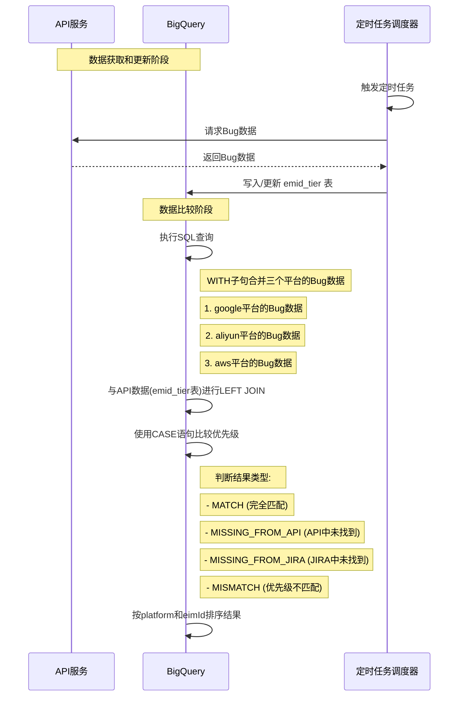
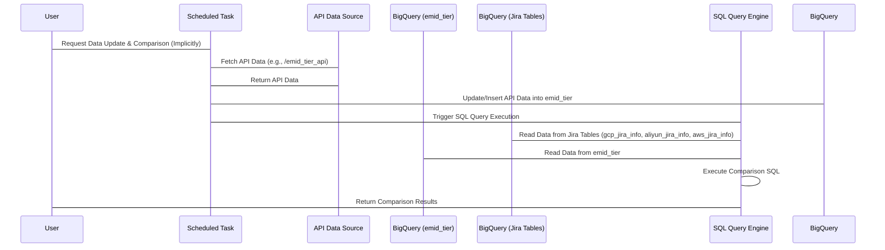

- flow

---


I need to enhance the script and wrap it in a function. The script appears to be a Bash script that:
1. Reads EIMLDs from a file
2. Makes API calls to retrieve ServiceIds
3. Makes another API call to get pladaCriticality
4. Records results in output files

Let me improve this script by:
•  Wrapping it in a function
•  Adding better error handling
•  Improving code organization
•  Adding comments and documentation
•  Adding optional parameters for flexibility
•  Adding a rate limiter for API calls

I'll use the code tool to make these changes.

```bash
#!/bin/bash

# 默认配置
DEFAULT_RETRY_COUNT=3
DEFAULT_RETRY_DELAY=2
DEFAULT_RATE_LIMIT_DELAY=1

# 日志函数
log_info() {
    echo "[INFO] $(date '+%Y-%m-%d %H:%M:%S') - $1"
}

log_error() {
    echo "[ERROR] $(date '+%Y-%m-%d %H:%M:%S') - $1" >&2
}

# API调用函数，包含重试逻辑
make_api_call() {
    local url="$1"
    local retry_count=${2:-$DEFAULT_RETRY_COUNT}
    local retry_delay=${3:-$DEFAULT_RETRY_DELAY}
    local attempt=1

    while [ $attempt -le $retry_count ]; do
        response=$(curl -s -X 'GET' "$url" -H 'accept: application/json')
        if [ $? -eq 0 ] && [ ! -z "$response" ]; then
            echo "$response"
            return 0
        fi
        
        log_error "API调用失败 (尝试 $attempt/$retry_count) - URL: $url"
        [ $attempt -lt $retry_count ] && sleep $retry_delay
        attempt=$((attempt + 1))
    done
    
    return 1
}

# 主处理函数
process_eimlds() {
    local input_file=${1:-"eimld-uniq.txt"}
    local output_file=${2:-"output.txt"}
    local error_file=${3:-"not_found.txt"}
    local rate_limit_delay=${4:-$DEFAULT_RATE_LIMIT_DELAY}

    # 参数验证
    if [ ! -f "$input_file" ]; then
        log_error "输入文件不存在: $input_file"
        return 1
    fi

    # 初始化输出文件
    > "$output_file"
    > "$error_file"

    log_info "开始处理 $input_file"
    local total_count=0
    local success_count=0
    local error_count=0

    # 读取输入文件并处理每一行
    while IFS= read -r eimld; do
        ((total_count++))
        log_info "处理 EIMLD: $eimld (${total_count})"

        # 获取 ServiceId
        local service_response=$(make_api_call "https://apiurl/v2/appId=$eimld&ServiceId=-1")
        if [ $? -ne 0 ]; then
            log_error "获取ServiceId失败 - EIMLD: $eimld"
            echo "$eimld,API_CALL_FAILED" >> "$error_file"
            ((error_count++))
            continue
        fi

        local ServiceId=$(echo "$service_response" | jq -r '.results[0].ServiceId')
        if [ "$ServiceId" = "null" ] || [ -z "$ServiceId" ]; then
            log_error "未找到ServiceId - EIMLD: $eimld"
            echo "$eimld,NO_SERVICE_ID" >> "$error_file"
            ((error_count++))
            continue
        fi

        log_info "找到ServiceId: $ServiceId"

        # 获取 pladaCriticality
        local criticality_response=$(make_api_call "https://apiurl/v1/$ServiceId")
        if [ $? -ne 0 ]; then
            log_error "获取pladaCriticality失败 - ServiceId: $ServiceId"
            echo "$eimld,$ServiceId,API_CALL_FAILED" >> "$error_file"
            ((error_count++))
            continue
        fi

        local pladaCriticality=$(echo "$criticality_response" | jq -r '.results[0].pladaCriticality')
        if [ "$pladaCriticality" = "null" ] || [ -z "$pladaCriticality" ]; then
            log_error "未找到pladaCriticality - ServiceId: $ServiceId"
            echo "$eimld,$ServiceId,NO_CRITICALITY" >> "$error_file"
            ((error_count++))
            continue
        fi

        # 记录成功结果
        echo "$eimld,$ServiceId,$pladaCriticality" >> "$output_file"
        ((success_count++))

        # 应用速率限制
        sleep $rate_limit_delay
    done < "$input_file"

    # 输出统计信息
    log_info "处理完成"
    log_info "总处理数: $total_count"
    log_info "成功数: $success_count"
    log_info "失败数: $error_count"
    log_info "成功结果保存在: $output_file"
    log_info "错误记录保存在: $error_file"
}

# 如果直接运行脚本（非source），则执行主函数
if [ "${BASH_SOURCE[0]}" = "$0" ]; then
    process_eimlds "$@"
fi
```