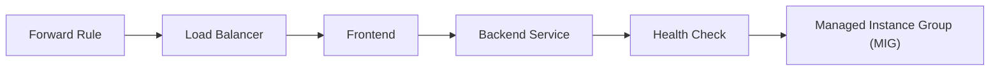

- enhance the readability by adding colors and borders to the nodes

```mermaid
flowchart LR
    subgraph External ["外部访问层"]
        A["转发规则 Forward Rule<br/>协议: TCP/UDP/HTTP(S)<br/>端口: 80/443"]
        style A fill:#bbdefb,stroke:#1976d2
    end

    subgraph LoadBalancing ["负载均衡层"]
        B["负载均衡器 Load Balancer<br/>类型: Global/Regional<br/>算法: Round Robin/Least Conn"]
        style B fill:#c8e6c9,stroke:#388e3c
    end

    subgraph Services ["服务层"]
        C["前端服务 Frontend<br/>URL映射<br/>SSL证书管理"]
        D["后端服务 Backend Service<br/>会话亲和性<br/>容量扩缩配置"]
        style C fill:#e1bee7,stroke:#7b1fa2
        style D fill:#e1bee7,stroke:#7b1fa2
    end

    subgraph Infrastructure ["基础设施层"]
        E["健康检查 Health Check<br/>检查间隔: 5s<br/>超时阈值: 3次"]
        F["实例组 MIG<br/>自动扩缩容<br/>最小实例数: 2<br/>目标CPU利用率: 75%"]
        style E fill:#ffccbc,stroke:#e64a19
        style F fill:#ffccbc,stroke:#e64a19
    end

    A --> |"转发流量<br/>基于IP/端口"| B
    B --> |"智能路由<br/>负载分配"| C
    C --> |"业务处理<br/>SSL终止"| D
    D --> |"定期检测<br/>TCP/HTTP"| E
    E --> |"动态伸缩<br/>实例管理"| F

    classDef default fill:#f9f9f9,stroke:#333,stroke-width:2px
    linkStyle default stroke:#666,stroke-width:2px,stroke-dasharray: 5 5
```

让我详细解释这个标准网络流量处理流程的各个组件：

1. **Forward Rule（转发规则）**

   - 作为网络流量的入口点
   - 定义如何将传入的网络流量路由到特定的目标
   - 指定协议（如HTTP、HTTPS）、端口和目标负载均衡器

2. **Load Balancer（负载均衡器）**

   - 将传入流量分散到多个后端服务器
   - 确保没有单一服务器承受过多流量
   - 提供高可用性和故障容错
   - 可以基于不同策略分配流量（轮询、最少连接等）

3. **Frontend（前端）**

   - 定义接收流量的IP地址和端口
   - 作为负载均衡器的前端配置
   - 决定如何将流量引导到后端服务

4. **Backend Service（后端服务）**

   - 定义后端服务器组
   - 指定如何与后端实例交互
   - 配置会话亲和性、端口等

5. **Health Check（健康检查）**

   - 定期检查后端实例的运行状态
   - 自动检测并隔离不健康的实例
   - 确保只将流量路由到正常工作的服务器
   - 通常使用TCP、HTTP或自定义探测方法

6. **Managed Instance Group (MIG)（托管实例组）**
   - 管理一组相同配置的虚拟机实例
   - 提供自动扩展和自愈能力
   - 可以根据负载自动增加或减少实例数量
   - 确保服务的弹性和可靠性

这个流程体现了云计算中的关键网络设计原则：

- 流量分发
- 高可用性
- 自动扩展
- 故障容错

通过这种架构，系统可以：

- 处理大量并发流量
- 快速响应流量变化
- 自动管理服务器实例
- 保持服务的稳定性和性能
