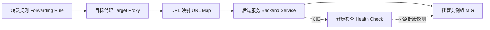
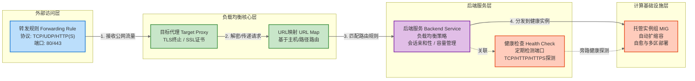

```mermaid
flowchart LR
    A["转发规则 Forwarding Rule"] --> B["目标代理 Target Proxy"]
    B --> C["URL 映射 URL Map"]
    C --> D["后端服务 Backend Service"]
    D --> E["托管实例组 MIG"]
    D -. "关联" .-> HC["健康检查 Health Check"]
    HC -. "旁路健康探测" .-> E
```

- enhance the readability by adding colors and borders to the nodes

```mermaid
flowchart LR
    subgraph External ["外部访问层"]
        A["转发规则 Forwarding Rule<br/>协议: TCP/UDP/HTTP(S)<br/>端口: 80/443"]
        style A fill:#bbdefb,stroke:#1976d2
    end

    subgraph LoadBalancing ["负载均衡核心层"]
        B["目标代理 Target Proxy<br/>TLS终止 / SSL证书"]
        C["URL映射 URL Map<br/>基于主机/路径路由"]
        style B fill:#c8e6c9,stroke:#388e3c
        style C fill:#c8e6c9,stroke:#388e3c
    end

    subgraph Services ["后端服务层"]
        D["后端服务 Backend Service<br/>负载均衡策略<br/>会话亲和性 / 容量管理"]
        E["健康检查 Health Check<br/>定期检测端口<br/>TCP/HTTP/HTTPS探测"]
        style D fill:#e1bee7,stroke:#7b1fa2
        style E fill:#ffccbc,stroke:#e64a19
    end

    subgraph Infrastructure ["计算基础设施层"]
        F["托管实例组 MIG<br/>自动扩缩容<br/>自愈与多区部署"]
        style F fill:#ffccbc,stroke:#e64a19
    end

    A -->|"1. 接收公网流量"| B
    B -->|"2. 解密/传递请求"| C
    C -->|"3. 匹配路由规则"| D
    D -->|"4. 分发到健康实例"| F
    D -.->|"关联"| E
    E -.->|"旁路健康探测"| F

    classDef default fill:#f9f9f9,stroke:#333,stroke-width:2px
    linkStyle default stroke:#666,stroke-width:1.5px
```

详细解释标准 GCP HTTP(S) 负载均衡与 MIG 流量处理流程的各个核心组件：

1. **Forwarding Rule（转发规则）**
   - 作为网络流量的入口点，分配公共或私有 IP 地址与端口（如 80、443）。
   - 将传入的网络流量路由到指定的目标代理（Target Proxy）。

2. **Target Proxy（目标代理）**
   - 负责 TLS/SSL 终止（使用关联的 SSL 证书解密 HTTPS 流量）。
   - 将解密后的 HTTP 流量传递给对应的 URL Map。

3. **URL Map（URL 映射）**
   - 根据请求的主机名（Host）和路径（Path）匹配路由规则（如 `/api/*` -> Backend A）。
   - 将请求定向到正确的后端服务（Backend Service）。

4. **Backend Service（后端服务）**
   - 承载后端配置的核心对象，配置协议（HTTP/HTTPS/HTTP2/gRPC）、会话亲和性、负载均衡模式（Util/Rate）和 Cloud Armor 安全策略。
   - 绑定一个或多个后端实例组（MIG）或 Endpoint 组（NEG）。
   - 关联健康检查（Health Check），仅将请求转发给健康的 VM 实例。

5. **Health Check（健康检查）**
   - **旁路探针机制**：不处于数据转发的主流量路径上，而是由 GCP 探测节点（`35.191.0.0/16` 和 `130.211.0.0/22`）定期向 MIG 实例发起 HTTP/TCP 探测。
   - 实时向 Backend Service 汇报实例健康状态，确保故障实例自动离线隔离。

6. **Managed Instance Group (MIG)（托管实例组）**
   - 真正承载业务计算的 VM 实例池。
   - 提供自动扩缩容（Autoscaling）、健康自愈（Autohealing）和跨区域高可用支持。

---

### 全局 HTTPS 负载均衡完整数据流与控制流图

```mermaid
flowchart LR
    subgraph UserAndInternet ["用户与互联网"]
        Client["用户 (Client)"]
        style Client fill:#fff59d,stroke:#fbc02d
    end

    subgraph GCPEdge ["GCP 全球边缘网络"]
        GFR["全局转发规则 (Global Forwarding Rule)<br/>公共IP:端口443"]
        style GFR fill:#bbdefb,stroke:#1976d2
    end

    subgraph HTTPSLoadBalancerCore ["HTTPS 负载均衡器核心"]
        direction LR
        THP["目标HTTPS代理 (Target HTTPS Proxy)<br/>TLS终止<br/>关联SSL证书"]
        URLMap["URL映射 (URL Map)<br/>基于主机/路径的路由规则"]
        style THP fill:#c8e6c9,stroke:#388e3c
        style URLMap fill:#c8e6c9,stroke:#388e3c
    end

    subgraph BackendLayer ["后端服务层"]
        direction LR
        BS["后端服务 (Backend Service)<br/>协议: HTTP/HTTPS/HTTP2<br/>负载均衡策略, 会话亲和性"]
        HC["健康检查 (Health Check)<br/>定期探测实例健康"]
        style BS fill:#e1bee7,stroke:#7b1fa2
        style HC fill:#ffccbc,stroke:#e64a19
    end

    subgraph ComputeLayer ["计算基础设施层"]
        MIG["托管实例组 (MIG)<br/>VM实例池<br/>自动扩缩容, 自我修复"]
        style MIG fill:#ffccbc,stroke:#e64a19
    end

    %% Request Flow
    Client -->|"1. HTTPS 请求"| GFR
    GFR -->|"2. 流量转发"| THP
    THP -->|"3. TLS终止 (使用SSL证书)<br/>解密为 HTTP/S 流量"| URLMap
    URLMap -->|"4. 根据规则路由"| BS
    BS -->|"5. 选择健康实例并转发"| MIG

    %% Instance Processing
    MIG -->|"6. VM实例处理请求"| MIG

    %% Health Checking (Parallel Process)
    BS -.->|"关联"| HC
    HC -.->|"7. 旁路持续探测实例健康"| MIG

    %% Response Flow
    MIG -->|"8. HTTP/S 响应"| BS
    BS -->|"9. 响应"| URLMap
    URLMap -->|"10. 响应"| THP
    THP -->|"11. TLS加密<br/>形成 HTTPS 响应"| GFR
    GFR -->|"12. HTTPS 响应"| Client

    classDef default fill:#f9f9f9,stroke:#333,stroke-width:2px
    linkStyle default stroke:#666,stroke-width:1.5px
    linkStyle 0,1,2,3,4,7,8,9,10,11,12 stroke-width:2.5px,stroke:#0277bd % Main flow links
    linkStyle 5,6 stroke-dasharray: 5 5,stroke:#757575 % Health check links
```
