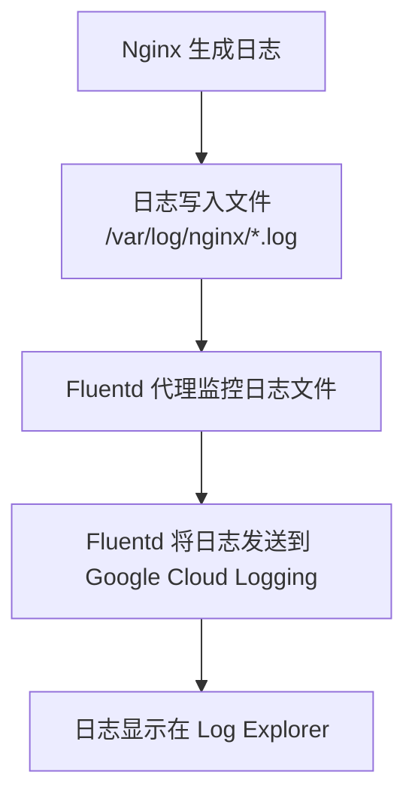

在Google Cloud Platform (GCP) 上构建一个自定义的虚拟机实例（Instance）镜像，并基于 Nginx 运行，同时将 Nginx 的日志映射到 Google Cloud 的 Log Explorer（即 Cloud Logging），是一个非常常见的需求。以下我会详细解释实现这一目标的步骤和方法，并以 Markdown 格式输出，同时提供必要的示例和流程图（使用 Mermaid）来帮助您理解。

## 实现 Nginx 日志映射到 Google Cloud Log Explorer 的步骤

### 1. 构建自定义镜像 (Custom Image) 基于 Nginx
首先，您需要基于一个基础镜像（例如 Ubuntu 或 Debian）构建一个包含 Nginx 的自定义镜像。以下是实现步骤的概述：

- **选择基础镜像**：在 GCP 的 Compute Engine 中，选择一个基础镜像（如 Ubuntu 20.04 LTS）。
- **安装 Nginx**：在实例上安装 Nginx，并进行基础配置。
- **创建自定义镜像**：在实例配置完成后，通过 GCP 控制台或 `gcloud` 命令创建自定义镜像。

以下是一个简单的脚本示例，用于在 Ubuntu 实例上安装 Nginx：

```bash
#!/bin/bash
sudo apt update
sudo apt install -y nginx
sudo systemctl enable nginx
sudo systemctl start nginx
```

在实例配置完成后，使用以下 `gcloud` 命令创建自定义镜像：

```bash
gcloud compute images create my-nginx-image \
  --source-disk=your-instance-name \
  --source-disk-zone=your-zone
```

### 2. 配置 Nginx 日志输出格式
为了让 Nginx 的日志能够被 Google Cloud Logging 正确解析，建议配置 Nginx 的日志格式为 JSON 格式，这样便于结构化查询。您可以在 `nginx.conf` 文件中自定义日志格式：

```nginx
http {
  log_format json_combined escape=json
    '{'
      '"time_local":"$time_local",'
      '"remote_addr":"$remote_addr",'
      '"remote_user":"$remote_user",'
      '"request":"$request",'
      '"status": $status,'
      '"body_bytes_sent": $body_bytes_sent,'
      '"request_time": $request_time,'
      '"http_referer":"$http_referer",'
      '"http_user_agent":"$http_user_agent"'
    '}';

  access_log /var/log/nginx/access.log json_combined;
  error_log /var/log/nginx/error.log;
}
```

### 3. 安装 Google Cloud Logging 代理 (Fluentd)
Google Cloud Logging 使用 Fluentd 作为代理来收集实例上的日志并将其发送到 Log Explorer。需要在您的实例上安装和配置 Fluentd（也称为 `google-fluentd`）。

#### 安装步骤
在 Ubuntu 上安装 Google Cloud Logging 代理：

```bash
curl -sSO https://dl.google.com/cloudagents/add-logging-agent-repo.sh
sudo bash add-logging-agent-repo.sh
sudo apt update
sudo apt install -y google-fluentd
sudo service google-fluentd start
```

#### 配置 Fluentd 收集 Nginx 日志
默认情况下，Fluentd 不会自动收集 Nginx 日志，您需要编辑 Fluentd 配置文件（通常位于 `/etc/google-fluentd/config.d/`）以监控 Nginx 日志文件。创建一个配置文件，例如 `nginx.conf`：

```conf
<source>
  @type tail
  path /var/log/nginx/access.log
  pos_file /var/lib/google-fluentd/pos/nginx-access.pos
  tag nginx.access
  format json
</source>

<source>
  @type tail
  path /var/log/nginx/error.log
  pos_file /var/lib/google-fluentd/pos/nginx-error.pos
  tag nginx.error
  format /(?<time>[^ ]+ [^ ]+) (?<log>.*)/
</source>
```

重启 Fluentd 服务以应用配置：

```bash
sudo service google-fluentd restart
```

### 4. 验证日志是否发送到 Log Explorer
完成上述配置后，访问您的 Nginx 服务以生成一些日志。然后，登录到 GCP 控制台，打开 **Logging** > **Log Explorer**，并使用以下查询来查看 Nginx 的日志：

```logql
logName:"/logs/nginx.access"
```

如果配置正确，您应该能在 Log Explorer 中看到结构化的 Nginx 访问日志。如果是错误日志，可以查询：

```logql
logName:"/logs/nginx.error"
```

### 5. 将配置集成到自定义镜像
为了确保新创建的实例也能自动应用上述配置，您需要在构建镜像前完成以下操作：
- 安装并配置 Fluentd。
- 配置 Nginx 的日志格式和路径。
- 确保启动脚本（如 `systemd` 服务）能够自动启动 Nginx 和 Fluentd。

完成这些后，再次创建自定义镜像（参考步骤 1），这样新实例启动时会自动具备日志收集功能。

## 流程图：日志从 Nginx 到 Log Explorer 的传递过程



## 注意事项
1. **权限问题**：确保 Fluentd 有权限读取 Nginx 日志文件，通常可以通过调整 `/var/log/nginx/*.log` 的权限或将 Fluentd 用户添加到适当的组来解决。
2. **日志格式**：如果不使用 JSON 格式，Fluentd 也可以通过正则表达式解析日志，但 JSON 格式更易于查询和结构化。
3. **自定义镜像大小**：构建镜像时，确保实例磁盘空间足够，以便包含所有配置和日志代理。
4. **网络权限**：Fluentd 需要与 Google Cloud Logging API 通信，确保实例的防火墙规则允许相关流量（通常是 HTTPS 端口 443）。

## 总结
通过上述步骤，您可以在 GCP 的 Compute Engine 实例上基于 Nginx 构建自定义镜像，并通过 Fluentd 将 Nginx 日志映射到 Google Cloud Log Explorer。这种方法适用于大多数日志收集需求，且 Fluentd 提供了强大的插件支持，可以进一步扩展日志处理能力。

如果您有进一步的问题，例如 Fluentd 的高级配置或遇到具体的错误，欢迎提供更多详细信息，我会进一步协助您！