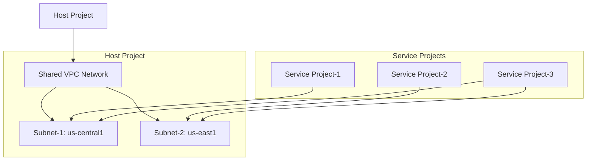
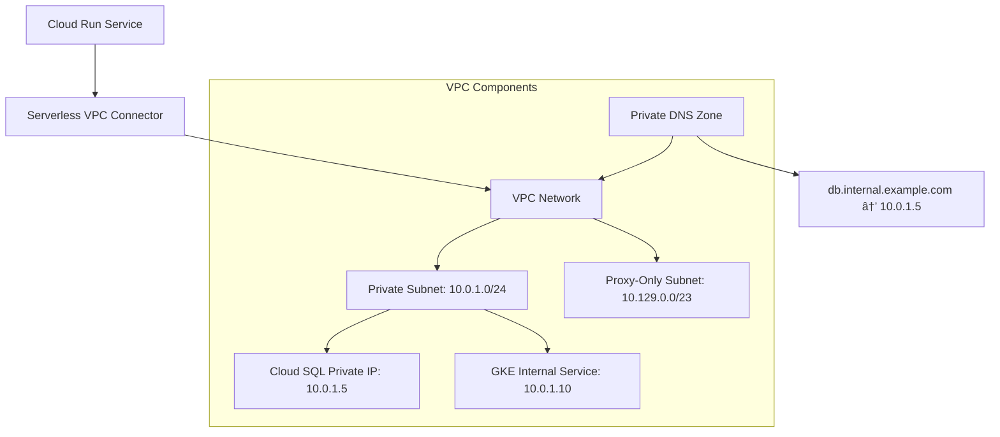
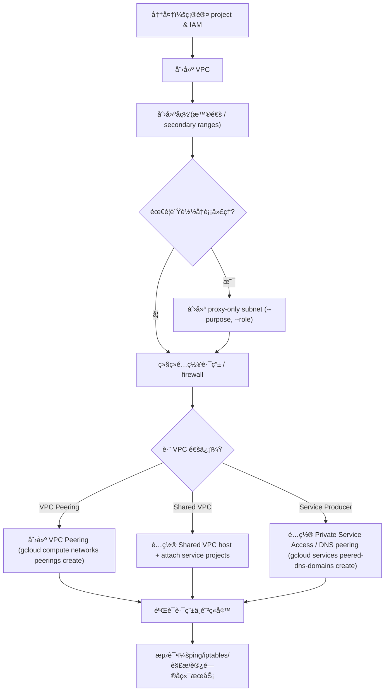
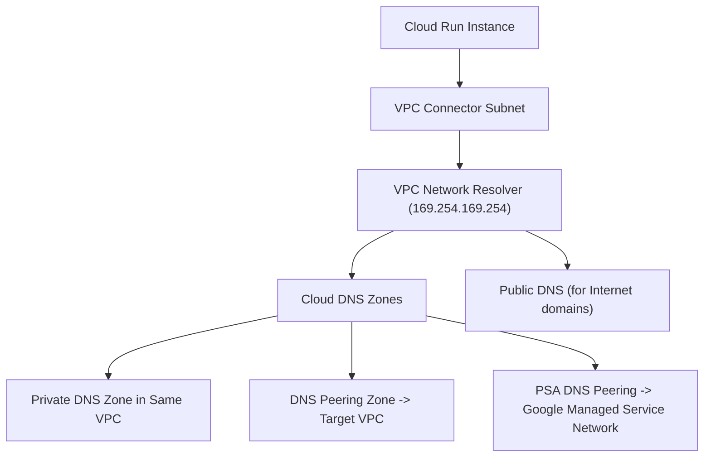

- [Q](#q)
- [Claude](#claude)
- [GCP VPC 网络资æºè¯¦ç»†æŒ‡å—](#gcp-vpc-网络资æºè¯¦ç»†æŒ‡å—)
  - [1. VPC Network 核心概念](#1-vpc-network-核心概念)
    - [1.1 VPC Network 基础](#11-vpc-network-基础)
  - [2. Subnets（å­ç½‘）](#2-subnetså­ç½‘)
    - [2.1 标准å­ç½‘创建](#21-标准å­ç½‘创建)
    - [2.2 查看å­ç½‘ä¿¡æ¯](#22-查看å­ç½‘ä¿¡æ¯)
  - [3. Reserved Proxy-Only Subnets（代ç†ä¸“用å­ç½‘）](#3-reserved-proxy-only-subnets代ç†ä¸“用å­ç½‘)
    - [3.1 用äºå†…部 HTTP(S) è´Ÿè½½å‡è¡¡](#31-用äºå†…部-https-è´Ÿè½½å‡è¡¡)
    - [3.2 ç”¨äº Serverless VPC Connector（é‡è¦ï¼‰](#32-用äº-serverless-vpc-connectoré‡è¦)
  - [4. VPC Network Peering](#4-vpc-network-peering)
    - [4.1 创建 VPC Peering](#41-创建-vpc-peering)
    - [4.2 VPC Peering é™åˆ¶](#42-vpc-peering-é™åˆ¶)
  - [5. Shared VPC（共享 VPC）](#5-shared-vpc共享-vpc)
    - [5.1 å¯ç”¨ Shared VPC](#51-å¯ç”¨-shared-vpc)
    - [5.2 Shared VPC æ¶æ„æµç¨‹](#52-shared-vpc-æ¶æ„æµç¨‹)
  - [6. DNS Peering ä¸ç§æœ‰ DNS](#6-dns-peering-ä¸ç§æœ‰-dns)
    - [6.1 创建ç§æœ‰ DNS Zone](#61-创建ç§æœ‰-dns-zone)
    - [6.2 DNS Peering（跨 VPC DNS 解æ）](#62-dns-peeringè·¨-vpc-dns-解æ)
    - [6.3 PSA DNS Peering（Private Service Access）](#63-psa-dns-peeringprivate-service-access)
  - [7. Cloud Run ä¸ VPC 集æˆå…¸å‹åœºæ™¯](#7-cloud-run-ä¸-vpc-集æˆå…¸å‹åœºæ™¯)
    - [7.1 问题场景分æ](#71-问题场景分æ)
    - [7.2 解决方案æ¶æ„](#72-解决方案æ¶æ„)
    - [7.3 完整é…置步骤](#73-完整é…置步骤)
    - [7.4 验è¯è¿é€šæ€§](#74-验è¯è¿é€šæ€§)
  - [8. 常è§ç½‘络资æºå‘½ä»¤æ±‡æ€»](#8-常è§ç½‘络资æºå‘½ä»¤æ±‡æ€»)
    - [8.1 查看命令](#81-查看命令)
    - [8.2 删除命令](#82-删除命令)
  - [9. æ•…éšœæ’查指å—](#9-æ•…éšœæ’查指å—)
    - [9.1 Cloud Run 无法访问 VPC 资æº](#91-cloud-run-无法访问-vpc-资æº)
    - [9.2 DNS 解æ失败](#92-dns-解æ失败)
  - [10. 最佳å®è·µæ€»ç»“](#10-最佳å®è·µæ€»ç»“)
    - [10.1 网络规划](#101-网络规划)
    - [10.2 安全é…ç½®](#102-安全é…ç½®)
    - [10.3 监æ§ä¸å‘Šè­¦](#103-监æ§ä¸å‘Šè­¦)
  - [注æ„事项](#注æ„事项)
- [ChatGPT](#chatgpt)
- [**问题分æ**](#问题分æ)
- [**解决方案（按主题分组：定义 + gcloud 示例 + Terraform 示例）**](#解决方案按主题分组定义--gcloud-示例--terraform-示例)
  - [**1) VPC Network（自定义 / 自动模å¼ï¼‰**](#1-vpc-network自定义--自动模å¼)
    - [**gcloud 示例**](#gcloud-示例)
    - [**Terraform 示例（最å°ï¼‰**](#terraform-示例最å°)
  - [**2) Subnets（å­ç½‘）ä¸é‡è¦å‚æ•°**](#2-subnetså­ç½‘ä¸é‡è¦å‚æ•°)
    - [**gcloud 创建普通å­ç½‘**](#gcloud-创建普通å­ç½‘)
    - [**gcloud 创建带 secondary ranges（GKE IP alias）**](#gcloud-创建带-secondary-rangesgke-ip-alias)
    - [**Terraform 示例（å­ç½‘ + secondary）**](#terraform-示例å­ç½‘--secondary)
  - [**3)** ](#3)
  - [**Reserved proxy-only subnets（Proxy-only subnets）**](#reserved-proxy-only-subnetsproxy-only-subnets)
  - [ **— ç”¨äº Google çš„ Envoy-based 代ç†/è´Ÿè½½å‡è¡¡å™¨**](#-用äº-google-çš„-envoy-based-代ç†è´Ÿè½½å‡è¡¡å™¨)
    - [**gcloud 创建 proxy-only å­ç½‘（示例）**](#gcloud-创建-proxy-only-å­ç½‘示例)
    - [**Terraform（proxy-only å­ç½‘）**](#terraformproxy-only-å­ç½‘)
  - [**4) VPC Network Peering（VPC 网络对等互è¿ï¼‰**](#4-vpc-network-peeringvpc-网络对等互è¿)
    - [**gcloud 示例（åŒå‘对等）**](#gcloud-示例åŒå‘对等)
    - [**Terraform（对等）**](#terraform对等)
  - [**5) Shared VPC（共享 VPC / Host \& Service Projects）**](#5-shared-vpc共享-vpc--host--service-projects)
    - [**æ“作步骤（主è¦ç‚¹ï¼‰**](#æ“作步骤主è¦ç‚¹)
    - [**gcloud 示例**](#gcloud-示例-1)
    - [**Terraform（å¯ç”¨ host project）**](#terraformå¯ç”¨-host-project)
  - [**6) DNS Peering / Private DNS between VPCs / DNS with Service Producers**](#6-dns-peering--private-dns-between-vpcs--dns-with-service-producers)
    - [**gcloud 示例（设置 PSA DNS peering）**](#gcloud-示例设置-psa-dns-peering)
    - [**Terraform 示例（等价）**](#terraform-示例等价)
  - [**7) Private Service Connect (PSC) ä¸è¿ç§»æ³¨æ„**](#7-private-service-connect-psc-ä¸è¿ç§»æ³¨æ„)
- [**å…¸å‹æ“作æµç¨‹ï¼ˆæµç¨‹å›¾ï¼‰**](#å…¸å‹æ“作æµç¨‹æµç¨‹å›¾)
- [**常用命令汇总（便äºå¤åˆ¶ç²˜è´´ï¼‰**](#常用命令汇总便äºå¤åˆ¶ç²˜è´´)
    - [**创建 VPC（custom）**](#创建-vpccustom)
    - [**创建å­ç½‘ï¼ˆå« secondary ranges）**](#创建å­ç½‘å«-secondary-ranges)
    - [**创建 proxy-only å­ç½‘（用äºæ‰˜ç®¡æ‰˜ç®¡ä»£ç†ï¼‰**](#创建-proxy-only-å­ç½‘用äºæ‰˜ç®¡æ‰˜ç®¡ä»£ç†)
    - [**创建 VPC Peering**](#创建-vpc-peering)
    - [**Shared VPCï¼šå…³è” service project**](#shared-vpcå…³è”-service-project)
    - [**é…ç½® PSA DNS peering（设置 DNS peering）**](#é…ç½®-psa-dns-peering设置-dns-peering)
- [**常è§é—®é¢˜ä¸æ’错建议**](#常è§é—®é¢˜ä¸æ’错建议)
- [**å‚考（官方/æƒå¨èµ„æºï¼‰**](#å‚考官方æƒå¨èµ„æº)
- [**注æ„事项ä¸æœ€ä½³å®è·µ**](#注æ„事项ä¸æœ€ä½³å®è·µ)
- [**Cloud Run（Serverless VPC Connectorï¼‰ä¸ VPC 网络的 DNS å¯è§£æ性ä¸è®¿é—®è¿é€šæ€§é—®é¢˜**](#cloud-runserverless-vpc-connectorä¸-vpc-网络的-dns-å¯è§£æ性ä¸è®¿é—®è¿é€šæ€§é—®é¢˜)
  - [**一ã€é—®é¢˜èƒŒæ™¯åˆ†æ**](#一问题背景分æ)
  - [**二ã€Cloud Run è¿å…¥ VPC 的机制**](#二cloud-run-è¿å…¥-vpc-的机制)
  - [**三ã€å®é™…é…置步骤**](#三å®é™…é…置步骤)
    - [**1ï¸âƒ£ 创建 VPC Connector**](#1ï¸âƒ£-创建-vpc-connector)
    - [**2ï¸âƒ£ 绑定 Cloud Run ä¸è¯¥ Connector**](#2ï¸âƒ£-绑定-cloud-run-ä¸è¯¥-connector)
    - [**3ï¸âƒ£ ç¡®ä¿ DNS å¯è§£æ性**](#3ï¸âƒ£-ç¡®ä¿-dns-å¯è§£æ性)
      - [**✅ 情况 1：VPC 内资æº**](#-情况-1vpc-内资æº)
      - [**✅ 情况 2：DNS Peering（跨 VPC 解æ）**](#-情况-2dns-peeringè·¨-vpc-解æ)
        - [**在目标网络 (vpc-b) 创建 Private DNS Zone**](#在目标网络-vpc-b-创建-private-dns-zone)
        - [**在 Cloud Run 所在网络 (vpc-a) 创建 DNS Peering zone**](#在-cloud-run-所在网络-vpc-a-创建-dns-peering-zone)
    - [**4ï¸âƒ£ 检查 Private Service Access (PSA) åŠ** ](#4ï¸âƒ£-检查-private-service-access-psa-åŠ)
    - [**psa\_dns\_peering**](#psa_dns_peering)
  - [**å››ã€éªŒè¯è¿é€šæ€§ä¸è§£æ**](#四验è¯è¿é€šæ€§ä¸è§£æ)
  - [**五ã€æ€»ç»“æµç¨‹å›¾**](#五总结æµç¨‹å›¾)
  - [**å…­ã€æ³¨æ„事项ä¸æœ€ä½³å®è·µ**](#六注æ„事项ä¸æœ€ä½³å®è·µ)
- [**五ã€å®Œæ•´è®¿é—®æµç¨‹ä¸åŸç†å›¾**](#五完整访问æµç¨‹ä¸åŸç†å›¾)
- [**å…­ã€å¸¸è§å‘½ä»¤ä¸éªŒè¯æ–¹å¼**](#六常è§å‘½ä»¤ä¸éªŒè¯æ–¹å¼)
    - [**1ï¸âƒ£ æŸ¥çœ‹å½“å‰ VPC Connector é…ç½®**](#1ï¸âƒ£-查看当å‰-vpc-connector-é…ç½®)
    - [**2ï¸âƒ£ 查看 VPC çš„ DNS Peering é…ç½®**](#2ï¸âƒ£-查看-vpc-çš„-dns-peering-é…ç½®)
    - [**3ï¸âƒ£ 查看 VPC Peering è¿æ¥çŠ¶æ€ï¼ˆåŒ…括 PSA）**](#3ï¸âƒ£-查看-vpc-peering-è¿æ¥çŠ¶æ€åŒ…括-psa)
    - [**4ï¸âƒ£ 测试 DNS 解æ是å¦ç”Ÿæ•ˆï¼ˆæ¨è使用 Cloud Run Job 测试）**](#4ï¸âƒ£-测试-dns-解æ是å¦ç”Ÿæ•ˆæ¨è使用-cloud-run-job-测试)
- [**七ã€Cloud Run 网络访问策略注æ„事项**](#七cloud-run-网络访问策略注æ„事项)
- [**å…«ã€Terraform 示例（整åˆç‰ˆï¼‰**](#å…«terraform-示例整åˆç‰ˆ)
- [**ä¹ã€æœ€ä½³å®è·µä¸æ’障建议**](#ä¹æœ€ä½³å®è·µä¸æ’障建议)

# Q
我想对 GCP 工程里é¢çš„ VPC çš„ network 进行一个详细的了解 ，包括å„ç§ç½‘络资æºã€‚ 比如 VPC network . Subnets , Reserved proxy-only subnets for load balancing , VPC network Peering. Shared VPC  . 比如å…许 VPC 之间 DNS Peering 的概念? 比如 psa_dns_peering 等等类似的命令。 我还想知é“这些 subnet 比如说或者网络在创建的过程中使用的命令或者是一些具体的å‚数。如æœå¯ä»¥è¯¦ç»†çš„è¯ ï¼Œè¯·å¸®æˆ‘è¯¦ç»†ç½—åˆ—ã€‚æ¯”å¦‚ä¸€ä¸ªå…¸å‹çš„ Cloud Run（Serverless VPC Connectorï¼‰ä¸ VPC 网络的 DNS å¯è§£æ性ä¸è®¿é—®è¿é€šæ€§é—®é¢˜

# Claude

# GCP VPC 网络资æºè¯¦ç»†æŒ‡å—

## 1. VPC Network 核心概念

### 1.1 VPC Network 基础

VPC（Virtual Private Cloud）是 GCP 中的全çƒæ€§è™šæ‹Ÿç½‘络资æºï¼Œæ供网络隔离和è¿æ¥ç®¡ç†ã€‚

**创建 VPC Network 命令：**

```bash
# åˆ›å»ºè‡ªåŠ¨æ¨¡å¼ VPC（自动在æ¯ä¸ªåŒºåŸŸåˆ›å»ºå­ç½‘）
gcloud compute networks create my-vpc-network \
    --subnet-mode=auto \
    --bgp-routing-mode=regional \
    --mtu=1460

# åˆ›å»ºè‡ªå®šä¹‰æ¨¡å¼ VPC（手动创建å­ç½‘）
gcloud compute networks create my-custom-vpc \
    --subnet-mode=custom \
    --bgp-routing-mode=global \
    --mtu=1500
```

**关键å‚数说æ˜ï¼š**

| å‚æ•°                 | å¯é€‰å€¼               | æè¿°                 |
| -------------------- | -------------------- | -------------------- |
| `--subnet-mode`      | `auto`, `custom`     | 自动或自定义å­ç½‘æ¨¡å¼ |
| `--bgp-routing-mode` | `regional`, `global` | BGP è·¯ç”±æ¨¡å¼         |
| `--mtu`              | 1460, 1500           | 最大传输å•å…ƒï¼ˆå­—节） |

---

## 2. Subnets（å­ç½‘）

### 2.1 标准å­ç½‘创建

```bash
# 创建å­ç½‘
gcloud compute networks subnets create my-subnet \
    --network=my-custom-vpc \
    --region=us-central1 \
    --range=10.0.1.0/24 \
    --enable-private-ip-google-access \
    --enable-flow-logs \
    --logging-aggregation-interval=interval-5-sec \
    --logging-flow-sampling=0.5 \
    --logging-metadata=include-all

# åˆ›å»ºå¸¦æ¬¡è¦ IP 范围的å­ç½‘ï¼ˆç”¨äº GKE Pod/Service）
gcloud compute networks subnets create gke-subnet \
    --network=my-custom-vpc \
    --region=us-central1 \
    --range=10.0.2.0/24 \
    --secondary-range pods=10.4.0.0/14 \
    --secondary-range services=10.8.0.0/20 \
    --enable-private-ip-google-access
```

**å­ç½‘关键å‚数：**

| å‚æ•°                                | æè¿°                                                     |
| ----------------------------------- | -------------------------------------------------------- |
| `--range`                           | 主 IP 范围（CIDR æ ¼å¼ï¼‰                                  |
| `--secondary-range`                 | æ¬¡è¦ IP èŒƒå›´ï¼ˆç”¨äº GKE 等）                              |
| `--enable-private-ip-google-access` | å…许ç§æœ‰ IP 访问 Google API                              |
| `--enable-flow-logs`                | å¯ç”¨ VPC Flow Logs                                       |
| `--purpose`                         | å­ç½‘用途（如 `PRIVATE`, `INTERNAL_HTTPS_LOAD_BALANCER`） |

### 2.2 查看å­ç½‘ä¿¡æ¯

```bash
# 列出所有å­ç½‘
gcloud compute networks subnets list --network=my-custom-vpc

# 查看å­ç½‘详细信æ¯
gcloud compute networks subnets describe my-subnet \
    --region=us-central1 \
    --format=yaml
```

---

## 3. Reserved Proxy-Only Subnets（代ç†ä¸“用å­ç½‘）

### 3.1 用äºå†…部 HTTP(S) è´Ÿè½½å‡è¡¡

```bash
# 创建代ç†ä¸“用å­ç½‘ï¼ˆç”¨äº Internal HTTP(S) Load Balancer）
gcloud compute networks subnets create proxy-only-subnet \
    --purpose=REGIONAL_MANAGED_PROXY \
    --role=ACTIVE \
    --region=us-central1 \
    --network=my-custom-vpc \
    --range=10.129.0.0/23

# 查看代ç†ä¸“用å­ç½‘
gcloud compute networks subnets list \
    --filter="purpose=REGIONAL_MANAGED_PROXY"
```

**关键概念：**

- **用途**：为 Envoy 代ç†é¢„ç•™ IP 地å€ç©ºé—´
- **范围è¦æ±‚**：至少 `/26`（64 个 IP），建议 `/23`（512 个 IP）
- **é™åˆ¶**：ä¸èƒ½ç”¨äºå…¶ä»–资æºï¼ˆVMã€GKE 等）

### 3.2 ç”¨äº Serverless VPC Connector（é‡è¦ï¼‰

```bash
# 创建 Serverless VPC Access è¿æ¥å™¨å­ç½‘
gcloud compute networks subnets create serverless-subnet \
    --network=my-custom-vpc \
    --region=us-central1 \
    --range=10.8.0.0/28 \
    --purpose=PRIVATE

# 创建 Serverless VPC Access Connector
gcloud compute networks vpc-access connectors create my-connector \
    --region=us-central1 \
    --subnet=serverless-subnet \
    --min-instances=2 \
    --max-instances=10 \
    --machine-type=e2-micro
```

---

## 4. VPC Network Peering

### 4.1 创建 VPC Peering

```bash
# 在 VPC-A 侧创建 Peering è¿æ¥
gcloud compute networks peerings create peer-vpc-a-to-vpc-b \
    --network=vpc-a \
    --peer-network=vpc-b \
    --peer-project=project-b \
    --export-custom-routes \
    --import-custom-routes

# 在 VPC-B 侧创建åå‘ Peering
gcloud compute networks peerings create peer-vpc-b-to-vpc-a \
    --network=vpc-b \
    --peer-network=vpc-a \
    --peer-project=project-a \
    --export-custom-routes \
    --import-custom-routes
```

**Peering å‚数说æ˜ï¼š**

| å‚æ•°                                    | æè¿°                      |
| --------------------------------------- | ------------------------- |
| `--export-custom-routes`                | 导出自定义路由到对等 VPC  |
| `--import-custom-routes`                | ä»å¯¹ç­‰ VPC 导入自定义路由 |
| `--export-subnet-routes-with-public-ip` | 导出带公共 IP çš„å­ç½‘路由  |
| `--import-subnet-routes-with-public-ip` | 导入带公共 IP çš„å­ç½‘路由  |

### 4.2 VPC Peering é™åˆ¶

- ä¸æ”¯æŒä¼ é€’性（A-B-C ä¸è‡ªåŠ¨å»ºç«‹ A-C è¿æ¥ï¼‰
- IP 范围ä¸èƒ½é‡å 
- 最多 25 个 Peering è¿æ¥

---

## 5. Shared VPC（共享 VPC）

### 5.1 å¯ç”¨ Shared VPC

```bash
# 在宿主项目中å¯ç”¨ Shared VPC
gcloud compute shared-vpc enable HOST_PROJECT_ID

# å…³è”æœåŠ¡é¡¹ç›®åˆ°å®¿ä¸»é¡¹ç›®
gcloud compute shared-vpc associated-projects add SERVICE_PROJECT_ID \
    --host-project=HOST_PROJECT_ID

# æˆäºˆæœåŠ¡é¡¹ç›®ä½¿ç”¨ç‰¹å®šå­ç½‘çš„æƒé™
gcloud compute networks subnets add-iam-policy-binding my-subnet \
    --region=us-central1 \
    --member="serviceAccount:SERVICE_PROJECT_NUMBER@cloudservices.gserviceaccount.com" \
    --role="roles/compute.networkUser"
```

### 5.2 Shared VPC æ¶æ„æµç¨‹



---

## 6. DNS Peering ä¸ç§æœ‰ DNS

### 6.1 创建ç§æœ‰ DNS Zone

```bash
# 创建ç§æœ‰ DNS Zone
gcloud dns managed-zones create my-private-zone \
    --description="Private DNS zone"
    --dns-name=internal.example.com. \
    --networks=my-custom-vpc \
    --visibility=private

# 添加 DNS 记录
gcloud dns record-sets create api.internal.example.com. \
    --zone=my-private-zone \
    --type=A \
    --ttl=300 \
    --rrdatas=10.0.1.10
```

### 6.2 DNS Peering（跨 VPC DNS 解æ）

```bash
# 创建 DNS Peering Zone（在 VPC-A 中解æ VPC-B çš„ç§æœ‰ DNS）
gcloud dns managed-zones create peer-to-vpc-b \
    --description="DNS Peering to VPC-B"
    --dns-name=internal.example.com. \
    --networks=vpc-a \
    --visibility=private \
    --target-network=vpc-b \
    --target-project=project-b

# 列出 DNS Peering
gcloud dns managed-zones list --filter="visibility=private"
```

### 6.3 PSA DNS Peering（Private Service Access）

**概念**：为 Google 管ç†çš„æœåŠ¡ï¼ˆå¦‚ Cloud SQLã€Memorystore）创建ç§æœ‰è¿æ¥ã€‚

```bash
# 1. åˆ†é… IP 范围给 Private Service Access
gcloud compute addresses create google-managed-services-range \
    --global \
    --purpose=VPC_PEERING \
    --prefix-length=16 \
    --network=my-custom-vpc

# 2. 创建 Private Service Connection
gcloud services vpc-peerings connect \
    --service=servicenetworking.googleapis.com \
    --ranges=google-managed-services-range \
    --network=my-custom-vpc

# 3. æ›´æ–° Private Service Connection（支æŒå¯¼å…¥è‡ªå®šä¹‰è·¯ç”±ï¼‰
gcloud services vpc-peerings update \
    --service=servicenetworking.googleapis.com \
    --network=my-custom-vpc \
    --ranges=google-managed-services-range \
    --force
```

**PSA DNS Peering 自动é…置：**

当创建 Private Service Connection 时，GCP 会自动：

1. 创建å为 `servicenetworking-googleapis-com` çš„ Peering è¿æ¥
2. é…ç½® DNS Peering，使 VPC 能解æ `*.p.googleapis.com` 地å€

---

## 7. Cloud Run ä¸ VPC 集æˆå…¸å‹åœºæ™¯

### 7.1 问题场景分æ

**问题**：Cloud Run（Serverless）需è¦è®¿é—® VPC 内的ç§æœ‰èµ„æºï¼ˆå¦‚ Cloud SQLã€å†…部 API）

**挑战**：

1. Cloud Run 默认è¿è¡Œåœ¨ Google 管ç†çš„网络
2. VPC 内资æºæ— å…¬ç½‘ IP
3. éœ€è¦ DNS 解æç§æœ‰åŸŸå

### 7.2 解决方案æ¶æ„



### 7.3 完整é…置步骤

**步骤 1：创建 VPC å’Œå­ç½‘**

```bash
# 创建 VPC
gcloud compute networks create cloud-run-vpc \
    --subnet-mode=custom \
    --bgp-routing-mode=regional

# 创建应用å­ç½‘
gcloud compute networks subnets create app-subnet \
    --network=cloud-run-vpc \
    --region=us-central1 \
    --range=10.0.1.0/24 \
    --enable-private-ip-google-access

# 创建 Serverless VPC Connector å­ç½‘
gcloud compute networks subnets create serverless-subnet \
    --network=cloud-run-vpc \
    --region=us-central1 \
    --range=10.8.0.0/28
```

**步骤 2：创建 Serverless VPC Connector**

```bash
gcloud compute networks vpc-access connectors create cloudrun-connector \
    --region=us-central1 \
    --subnet=serverless-subnet \
    --min-instances=2 \
    --max-instances=10 \
    --machine-type=e2-micro
```

**步骤 3：é…ç½®ç§æœ‰ DNS**

```bash
# 创建ç§æœ‰ DNS Zone
gcloud dns managed-zones create internal-zone \
    --description="Internal DNS for Cloud Run"
    --dns-name=internal.example.com. \
    --networks=cloud-run-vpc \
    --visibility=private

# 添加 Cloud SQL 的 DNS 记录
gcloud dns record-sets create db.internal.example.com. \
    --zone=internal-zone \
    --type=A \
    --ttl=300 \
    --rrdatas=10.0.1.5
```

**步骤 4：创建 Cloud SQL（ç§æœ‰ IP）**

```bash
# åˆ†é… Private Service Access 范围
gcloud compute addresses create cloudsql-ip-range \
    --global \
    --purpose=VPC_PEERING \
    --prefix-length=16 \
    --network=cloud-run-vpc

# 创建 Private Service Connection
gcloud services vpc-peerings connect \
    --service=servicenetworking.googleapis.com \
    --ranges=cloudsql-ip-range \
    --network=cloud-run-vpc

# 创建 Cloud SQL å®ä¾‹ï¼ˆä»…ç§æœ‰ IP）
gcloud sql instances create my-instance \
    --database-version=POSTGRES_15 \
    --tier=db-f1-micro \
    --region=us-central1 \
    --network=projects/PROJECT_ID/global/networks/cloud-run-vpc \
    --no-assign-ip
```

**步骤 5：部署 Cloud Run 并è¿æ¥ VPC**

```bash
# 部署 Cloud Run æœåŠ¡å¹¶ä½¿ç”¨ VPC Connector
gcloud run deploy my-service \
    --image=gcr.io/PROJECT_ID/my-image \
    --region=us-central1 \
    --vpc-connector=cloudrun-connector \
    --vpc-egress=private-ranges-only \
    --set-env-vars="DB_HOST=db.internal.example.com,DB_PORT=5432"
```

**VPC Egress 选项：**

| 选项                  | æè¿°                                   |
| --------------------- | -------------------------------------- |
| `private-ranges-only` | ä»…ç§æœ‰ IP æµé‡é€šè¿‡ VPC Connector       |
| `all-traffic`         | 所有æµé‡é€šè¿‡ VPC Connector（包括公网） |

### 7.4 验è¯è¿é€šæ€§

```bash
# 在 Cloud Run 容器中测试 DNS 解æ
gcloud run services proxy my-service --region=us-central1

# 在代ç†ç»ˆç«¯ä¸­æ‰§è¡Œ
nslookup db.internal.example.com  # åº”è¿”å› 10.0.1.5
ping db.internal.example.com      # 验è¯ç½‘络è¿é€šæ€§
```

---

## 8. 常è§ç½‘络资æºå‘½ä»¤æ±‡æ€»

### 8.1 查看命令

```bash
# 列出所有 VPC 网络
gcloud compute networks list

# 列出所有å­ç½‘
gcloud compute networks subnets list --network=my-vpc

# 查看 VPC Peering 状æ€
gcloud compute networks peerings list --network=my-vpc

# 查看 Serverless VPC Connectors
gcloud compute networks vpc-access connectors list --region=us-central1

# 查看 Private Service Connections
gcloud services vpc-peerings list \
    --service=servicenetworking.googleapis.com \
    --network=my-vpc
```

### 8.2 删除命令

```bash
# 删除 VPC Connector
gcloud compute networks vpc-access connectors delete cloudrun-connector \
    --region=us-central1

# 删除 VPC Peering
gcloud compute networks peerings delete peer-name --network=my-vpc

# 删除å­ç½‘
gcloud compute networks subnets delete my-subnet --region=us-central1

# 删除 VPC（需先删除所有å­ç½‘å’Œ Peering）
gcloud compute networks delete my-vpc
```

---

## 9. æ•…éšœæ’查指å—

### 9.1 Cloud Run 无法访问 VPC 资æº

**æ’查步骤：**

```bash
# 1. 检查 VPC Connector 状æ€
gcloud compute networks vpc-access connectors describe cloudrun-connector \
    --region=us-central1

# 2. 验è¯å­ç½‘é…ç½®
gcloud compute networks subnets describe serverless-subnet \
    --region=us-central1

# 3. 检查防ç«å¢™è§„则
gcloud compute firewall-rules list \
    --filter="network:cloud-run-vpc"
    --format="table(name,sourceRanges,allowed[].map().firewall_rule().list())"

# 4. 创建å…许 Serverless Connector 的防ç«å¢™è§„则
gcloud compute firewall-rules create allow-serverless-to-vpc \
    --network=cloud-run-vpc \
    --allow=tcp,udp,icmp \
    --source-ranges=10.8.0.0/28 \
    --priority=1000
```

### 9.2 DNS 解æ失败

```bash
# 检查 DNS Zone 绑定的 VPC
gcloud dns managed-zones describe internal-zone

# éªŒè¯ DNS 记录
gcloud dns record-sets list --zone=internal-zone

# æµ‹è¯•ä» VPC 内部 DNS 解æ（使用 Cloud Shell）
gcloud compute instances create test-vm \
    --zone=us-central1-a \
    --subnet=app-subnet \
    --network=cloud-run-vpc

gcloud compute ssh test-vm --zone=us-central1-a
# 在 VM 内执行
nslookup db.internal.example.com
```

---

## 10. 最佳å®è·µæ€»ç»“

### 10.1 网络规划

1. **IP 地å€è§„划**：

    - 主å­ç½‘：至少 `/24`（254 个å¯ç”¨ IP）
    - GKE Pod 范围：建议 `/14`（å¯æ”¯æŒçº¦ 250K Pod）
    - Serverless Connectorï¼šæœ€å° `/28`（14 个å¯ç”¨ IP）
    - Proxy-Only：建议 `/23`（510 个å¯ç”¨ IP）

2. **é¿å… IP 冲çª**：

    - 检查ç°æœ‰ç½‘络范围
    - 预留未æ¥æ‰©å±•ç©ºé—´
    - 使用 RFC 1918 ç§æœ‰åœ°å€æ®µ

### 10.2 安全é…ç½®

```bash
# é™åˆ¶ Serverless Connector 仅访问必è¦èµ„æº
gcloud compute firewall-rules create restrict-serverless \
    --network=cloud-run-vpc \
    --allow=tcp:5432,tcp:443 \
    --source-ranges=10.8.0.0/28 \
    --target-tags=database,api \
    --priority=1000

# å¯ç”¨ VPC Flow Logs 用äºå®¡è®¡
gcloud compute networks subnets update app-subnet \
    --region=us-central1 \
    --enable-flow-logs \
    --logging-aggregation-interval=interval-5-sec \
    --logging-flow-sampling=1.0
```

### 10.3 监æ§ä¸å‘Šè­¦

```bash
# 查看 VPC Connector 指标
gcloud monitoring dashboards create --config-from-file=dashboard.yaml
```

**dashboard.yaml 示例：**

```yaml
displayName: "VPC Connector Monitoring"
mosaicLayout:
  columns: 12
  tiles:
    - width: 6
      height: 4
      widget:
        title: "Connector Throughput"
        xyChart:
          dataSets:
            - timeSeriesQuery:
                timeSeriesFilter:
                  filter: 'resource.type="vpc_access_connector"'
                  aggregation:
                    alignmentPeriod: 60s
                    perSeriesAligner: ALIGN_RATE
```

---

## 注æ„事项

1. **VPC Connector æˆæœ¬**：æ¯ä¸ª Connector 至少è¿è¡Œ 2 个å®ä¾‹ï¼Œäº§ç”ŸæŒç»­è´¹ç”¨
2. **DNS Peering 传播时间**：é…ç½®åå¯èƒ½éœ€è¦ 1-2 分钟生效
3. **Private Service Access ä¸å¯å˜æ€§**：一旦创建，IP 范围无法更改
4. **Cloud Run VPC Egress**：`all-traffic` 会å¢åŠ å»¶è¿Ÿå’Œæˆæœ¬ï¼Œä¼˜å…ˆä½¿ç”¨ `private-ranges-only`
5. **Shared VPC æƒé™ç®¡ç†**：需è¦åœ¨å®¿ä¸»é¡¹ç›®é…ç½® IAM，ä¸è¦å¿˜è®°æˆäºˆæœåŠ¡é¡¹ç›® `compute.networkUser` 角色

---

如需更多具体场景的é…置细节，请æ供您的使用场景æ述。

# ChatGPT

# **问题分æ**

ä½ è¦æŠŠ GCP 中 **VPC network / subnets / proxy-only subnets / VPC peering / Shared VPC / DNS peering (例如 private services access çš„ DNS peering)** 等网络资æºåšä¸€ä¸ªè¯¦å°½æ¸…å•ï¼Œå¹¶ç»™å‡º **在创建/管ç†è¿™äº›èµ„æºæ—¶å¸¸ç”¨çš„命令ä¸å…³é”®å‚æ•°**（gcloud ä¸ Terraform 示例）。下é¢æˆ‘把核心概念ã€å¯æ‰§è¡Œå‘½ä»¤ä¸ç¤ºä¾‹ã€Terraform 资æºæ ·æ¿ã€å…¸å‹å‚数解释ä¸å®è·µæ³¨æ„事项都列清楚，便äºå¤åˆ¶ç²˜è´´æ‰§è¡Œæˆ–用äºå†…部文档。

> 在执行命令å‰ï¼Œè¯·å…ˆç¡®è®¤ä½ æœ‰å¯¹åº”项目/组织的 IAM æƒé™ï¼ˆä¾‹å¦‚ roles/compute.networkAdminã€Shared VPC éœ€è¦ roles/resourcemanager.projectIamAdmin 等），并在执行 Terraform 或 gcloud å‰åˆ‡æ¢å¥½ gcloud config set project ä¸ gcloud auth ç­‰ç¯å¢ƒã€‚

---

# **解决方案（按主题分组：定义 + gcloud 示例 + Terraform 示例）**

## **1) VPC Network（自定义 / 自动模å¼ï¼‰**

**概念**：GCP çš„ VPC 是全局范围资æºï¼ˆä¸€ä¸ª VPC å¯åŒ…å«è·¨å¤šä¸ªåŒºåŸŸçš„å­ç½‘）。å¯é€‰æ‹© auto 模å¼ï¼ˆè‡ªåŠ¨åˆ›å»ºå­ç½‘）或 custom（手动管ç†å­ç½‘）。

### **gcloud 示例**

```
# 创建 custom-mode VPC（最常用）
gcloud compute networks create my-vpc \
  --project=MY_PROJECT \
  --subnet-mode=custom \
  --mtu=1460
```

### **Terraform 示例（最å°ï¼‰**

```
resource "google_compute_network" "my_vpc" {
  name                    = "my-vpc"
  auto_create_subnetworks = false
  description             = "Custom VPC for platform"
}
```

---

## **2) Subnets（å­ç½‘）ä¸é‡è¦å‚æ•°**

**概念ä¸è¦ç‚¹**：

- å­ç½‘是区域性资æºï¼ˆ--region）。
- 关键å‚数：--range（CIDR）ã€--regionã€--networkã€--purposeï¼ˆè§ proxy-only 用例）ã€--secondary-rangeï¼ˆç”¨äº GKE IP aliasã€Cloud NATã€VPC peering 时的内网范围管ç†ï¼‰ã€‚
- æ¨è规划：主网段划分ã€secondary ranges ç”¨äº Pod/Service（GKE）ã€å¹¶ç•™å‡º proxy-only å­ç½‘空间（/23 或更大建议）。

### **gcloud 创建普通å­ç½‘**

```
gcloud compute networks subnets create my-subnet \
  --network=my-vpc \
  --region=asia-northeast1 \
  --range=10.10.0.0/20 \
  --enable-flow-logs
```

### **gcloud 创建带 secondary ranges（GKE IP alias）**

```
gcloud compute networks subnets create gke-subnet \
  --network=my-vpc \
  --region=asia-northeast1 \
  --range=10.20.0.0/22 \
  --secondary-range pods=10.21.0.0/18,services=10.22.0.0/20
```

### **Terraform 示例（å­ç½‘ + secondary）**

```
resource "google_compute_subnetwork" "gke_subnet" {
  name          = "gke-subnet"
  ip_cidr_range = "10.20.0.0/22"
  region        = "asia-northeast1"
  network       = google_compute_network.my_vpc.id

  secondary_ip_range {
    range_name    = "pods"
    ip_cidr_range = "10.21.0.0/18"
  }

  secondary_ip_range {
    range_name    = "services"
    ip_cidr_range = "10.22.0.0/20"
  }
}
```

（å‚考：VPC/subnet 基本æ“作文档。）

---

## **3)** 

## **Reserved proxy-only subnets（Proxy-only subnets）**

##  **— ç”¨äº Google çš„ Envoy-based 代ç†/è´Ÿè½½å‡è¡¡å™¨**

**概念**：专门为 Google Cloud çš„ Envoy 代ç†ï¼ˆHTTP(S) / TCP Proxy / 内部 ALB 的托管代ç†ï¼‰é¢„留的å­ç½‘，åªæ‰˜ç®¡ä»£ç† IP，ä¸æ”¾ç½®ç”¨æˆ· VM/Pod。用äºæ‰˜ç®¡è·¨åŒºåŸŸ/区域托管代ç†ï¼ˆGlobal / Regional managed proxy）。文档建议å­ç½‘空间较大（至少 /23，≥64 IP）并使用 --purpose 标记。

### **gcloud 创建 proxy-only å­ç½‘（示例）**

```
gcloud compute networks subnets create proxy-only-subnet-asia-northeast1 \
  --network=lb-network \
  --region=asia-northeast1 \
  --range=10.129.0.0/23 \
  --purpose=GLOBAL_MANAGED_PROXY \
  --role=ACTIVE
```

**å‚数说æ˜**：

- --purpose：REGIONAL_MANAGED_PROXY / CROSS_REGION_MANAGED_PROXY / GLOBAL_MANAGED_PROXY（视负载å‡è¡¡ç±»å‹ï¼‰
- --role：ACTIVE 或 BACKUP（å¯æ¿€æ´»å¤‡ç”¨å­ç½‘ç”¨äº failover/maintenance）
- 也å¯åœ¨ Console 中“Activateâ€å¤‡ç”¨ proxy-only å­ç½‘并设置 drain timeout。

### **Terraform（proxy-only å­ç½‘）**

ç›®å‰ proxy-only 在 Terraform provider 上å¯ç”¨æ€§ä¸æ ‡å¿—命åä¼šéš provider 版本å˜æ›´ï¼›ä½ å¯ä»¥ç”¨ google_compute_subnetwork 并设置 purpose（如 provider 支æŒï¼‰æˆ–使用 gcloud 创建作为先行步骤。文档ä¸æ ·ä¾‹è¯·å‚考官方 load balancing proxy-only 文档。

---

## **4) VPC Network Peering（VPC 网络对等互è¿ï¼‰**

**概念**：在ä¸åŒ VPC（åŒ/ä¸åŒé¡¹ç›®ï¼‰ä¹‹é—´å»ºç«‹ç§æœ‰è·¯ç”±äº’通（内网 IP äº’è®¿ï¼‰ã€‚æ³¨æ„ **ä¸è‡ªåŠ¨å…±äº«** Cloud DNS ç§æœ‰åŒºï¼ˆéœ€è¦é¢å¤– DNS peering / Cloud DNS ç§æœ‰ zone）。路由å¯é€‰æ‹©æ˜¯å¦å¯¼å…¥/导出自定义路由（--import-custom-routes / --export-custom-routes）。

### **gcloud 示例（åŒå‘对等）**

在一侧å‘起：

```
gcloud compute networks peerings create peering-a-to-b \
  --network=vpc-a \
  --peer-project=PROJECT_B \
  --peer-network=vpc-b \
  --export-custom-routes \
  --import-custom-routes
```

å¦ä¸€ä¾§ä¹Ÿéœ€è¦å»ºç«‹å¯¹ç­‰ï¼ˆæˆ–使用 --auto-create-peer å–决äºæƒé™ä¸åœºæ™¯ï¼‰ã€‚å¯ä»¥ç”¨ gcloud compute networks peerings list 查看状æ€ã€gcloud compute networks peerings delete 删除。

### **Terraform（对等）**

```
resource "google_compute_network_peering" "peer_ab" {
  name         = "peer-a-to-b"
  network      = google_compute_network.vpc_a.self_link
  peer_network = "projects/PROJECT_B/global/networks/vpc-b"
  export_custom_routes = true
  import_custom_routes = true
}
```

---

## **5) Shared VPC（共享 VPC / Host & Service Projects）**

**概念**：在组织中将æŸä¸ªé¡¹ç›®è®¾ä¸º **Host Project**（拥有 VPC），并把其他项目作为 **Service Projects** å…³è”，ä»è€Œè¿™äº› service project 的资æºå¯ä»¥ä½¿ç”¨ host project çš„å­ç½‘。通常用äºå…¬å¸é›†ä¸­ç½‘络管ç†ï¼ˆå®‰å…¨ã€å­ç½‘ IP 规划）ä¸é¡¹ç›®éš”离。

### **æ“作步骤（主è¦ç‚¹ï¼‰**

1. 在组织内给 host project æˆäºˆ Shared VPC 相关æƒé™å¹¶å¯ç”¨ Shared VPC（æ§åˆ¶å°æˆ– gcloud）。
2. 把 service project å…³è”到 host project（gcloud compute shared-vpc associated-projects add）。
3. 在 host project 创建å­ç½‘并共享（å¯é€‰æ‹©å…±äº«å…¨éƒ¨æˆ–指定å­ç½‘）。

### **gcloud 示例**

```
# å°† project 指定为 Shared VPC host（需è¦ç»„织管ç†å‘˜åœ¨ Console 中å¯ç”¨ï¼›ä¹Ÿå¯ç”¨ IAM + API）
gcloud compute shared-vpc enable HOST_PROJECT_ID

# å°† service project å…³è”到 host project
gcloud compute shared-vpc associated-projects add HOST_PROJECT_ID \
  --project=SERVICE_PROJECT_ID

# 列出已关è”çš„ service projects
gcloud compute shared-vpc associated-projects list HOST_PROJECT_ID
```

### **Terraform（å¯ç”¨ host project）**

```
resource "google_compute_shared_vpc_host_project" "host" {
  project = "HOST_PROJECT_ID"
}
```

（å‚考 Shared VPC é…置说æ˜ä¸æœ€ä½³å®è·µæ–‡æ¡£ï¼‰ã€‚

---

## **6) DNS Peering / Private DNS between VPCs / DNS with Service Producers**

**概念**：

- **Cloud DNS private zones**：å¯ä»¥å°† private managed zone 附加到一个或多个 VPC（通过 --networks）。
- **DNS Peering between VPC and service producer network**：Private Service Access / Private Service Connect 场景下，设置 VPC ä¸ service producer çš„ DNS peering（使消费者 VPC 能解æ生产者æœåŠ¡çš„ç§æœ‰ DNS å称）。
- GCP æä¾› gcloud services peered-dns-domains create 命令用äºè®¾ç½® private services access çš„ DNS peering（例如当使用æŸäº›ç®¡ç†æœåŠ¡æˆ–托管æœåŠ¡æ—¶éœ€è¦ï¼‰ã€‚文档中也æ到 Terraform èµ„æº google_service_networking_peered_dns_domain。

### **gcloud 示例（设置 PSA DNS peering）**

```
gcloud services peered-dns-domains create PEERING_NAME \
  --network=projects/PROJECT_ID/global/networks/VPC_NETWORK \
  --dns-suffix=example.com
```

**说æ˜**：

- PEERING_NAME：自定义å称
- --network：消费者 VPC（已é…ç½® private services access）
- --dns-suffix：æœåŠ¡ç«¯å£°æ˜çš„ DNS 域å缀（生产者æœåŠ¡çš„域åå缀），由æœåŠ¡æ供方告知或由文档指定。

### **Terraform 示例（等价）**

```
resource "google_service_networking_peered_dns_domain" "peer_dns" {
  provider = google
  network = "projects/${var.project}/global/networks/${var.vpc}"
  dns_suffix = "service.example.com"
  peered_project = "PRODUCER_PROJECT_ID"
}
```

ï¼ˆè¯¦è§ Private Services Access / Private Service Connect & DNS peering 文档。）

---

## **7) Private Service Connect (PSC) ä¸è¿ç§»æ³¨æ„**

**概念**：Google 建议在æŸäº›åœºæ™¯å°† VPC Peering çš„æœåŠ¡ç”Ÿäº§è€…è¿ç§»åˆ° Private Service Connect（PSC），PSC 支æŒé€šè¿‡ç‰¹å®šçš„å‰ç«¯ IP 或 DNS æ–¹å¼å®‰å…¨æš´éœ²æœåŠ¡ï¼›è¿ç§»æ—¶ä¼šæ¶‰åŠ DNS zoneã€IP 转æ¢ä¸å­ç½‘调整。官方有 codelab 讲解 VPC Peering → PSC çš„è¿ç§»ï¼ˆå« DNS zone ã€è½¬å‘规则示例）。

---

# **å…¸å‹æ“作æµç¨‹ï¼ˆæµç¨‹å›¾ï¼‰**



> 注æ„：Mermaid 节点文字中é¿å…使用 ()，如需括å·è¯·ç”¨å¼•å·åŒ…裹。

---

# **常用命令汇总（便äºå¤åˆ¶ç²˜è´´ï¼‰**

### **创建 VPC（custom）**

```
gcloud compute networks create my-vpc --subnet-mode=custom
```

### **创建å­ç½‘ï¼ˆå« secondary ranges）**

```
gcloud compute networks subnets create my-subnet \
  --network=my-vpc \
  --region=asia-northeast1 \
  --range=10.10.0.0/20 \
  --secondary-range=gke-pods=10.11.0.0/18,gke-svc=10.12.0.0/20 \
  --enable-flow-logs
```

### **创建 proxy-only å­ç½‘（用äºæ‰˜ç®¡æ‰˜ç®¡ä»£ç†ï¼‰**

```
gcloud compute networks subnets create proxy-only-subnet \
  --network=lb-network \
  --region=asia-northeast1 \
  --range=10.129.0.0/23 \
  --purpose=GLOBAL_MANAGED_PROXY \
  --role=ACTIVE
```

### **创建 VPC Peering**

```
gcloud compute networks peerings create peering-a-to-b \
  --network=vpc-a \
  --peer-project=PEER_PROJECT_ID \
  --peer-network=vpc-b \
  --export-custom-routes \
  --import-custom-routes
```

### **Shared VPCï¼šå…³è” service project**

```
gcloud compute shared-vpc associated-projects add HOST_PROJECT_ID \
  --project=SERVICE_PROJECT_ID
```

### **é…ç½® PSA DNS peering（设置 DNS peering）**

```
gcloud services peered-dns-domains create my-dns-peering \
  --network=projects/MY_PROJECT/global/networks/my-vpc \
  --dns-suffix=service.example.com
```

---

# **常è§é—®é¢˜ä¸æ’错建议**

1. **å­ç½‘ IP ä¸å¤Ÿ / 冲çª**：创建å­ç½‘å‰ï¼Œè¯·å…ˆåš IP 规划表，é¿å…ä¸æœ¬åœ°åŠå…¬ç½‘或已存在 VPC 冲çªï¼ˆå°¤å…¶ VPC peering 场景）。
2. **Proxy-only å­ç½‘ IP 太å°**：官方建议 proxy-only å­ç½‘较大（/23 æ¨è），å¦åˆ™å¯èƒ½åœ¨æ‰˜ç®¡ä»£ç†æ‰©ç¼©å®¹æ—¶å‡ºç°ä¸è¶³ã€‚
3. **VPC peering 无法解æç§æœ‰ DNS**：VPC peering **ä¸ä¼šè‡ªåŠ¨**把 Cloud DNS private zone 解ææƒé™å…±äº«ï¼›éœ€è¦ä½¿ç”¨ Cloud DNS çš„ private zone 附加到目标网络或使用 peered-dns-domains（PSA 场景）é…置。
4. **Shared VPC æƒé™é—®é¢˜**ï¼šç¡®ä¿ host project ä¸ service project 在åŒä¸€ç»„织（一般è¦æ±‚），并给 Shared VPC Admin åˆé€‚ IAM。
5. **路由/防ç«å¢™ä¸é€š**：VPC Peering 仅建立路由è¿é€šï¼Œä»éœ€åœ¨ä¸¤ä¸ª VPC 的防ç«å¢™è§„则中å…许对应的æµé‡ã€‚
6. **è¿ç§»å»ºè®®**：若你的æœåŠ¡ç”Ÿäº§è€…使用 VPC Peering 而需è¦æ›´çµæ´»çš„æœåŠ¡æ¶ˆè´¹è€…管ç†ï¼Œè¯„ä¼°è¿ç§»åˆ° Private Service Connect（官方æä¾› codelab 指å—）。

---

# **å‚考（官方/æƒå¨èµ„æºï¼‰**

- Proxy-only subnets for load balancing (官方说æ˜ä¸åˆ›å»ºç¤ºä¾‹)。
- Configure private services access & DNS peering（gcloud services peered-dns-domains create）。
- VPC Network Peering 文档（使用ã€å¯¼å…¥/导出路由ã€ç®¡ç†ï¼‰ã€‚
- Shared VPC 概念ä¸é…置（host / service projects）。

---

# **注æ„事项ä¸æœ€ä½³å®è·µ**

- 在生产ç¯å¢ƒå˜æ›´ç½‘络å‰ï¼Œ**先在测试项目**åšå®Œæ•´æ¼”练（包括 peeringã€DNS 和防ç«å¢™ç­–略）。
- 对äºä»£ç†/è´Ÿè½½å‡è¡¡å™¨çš„ proxy-only å­ç½‘，**预留足够 IP 空间**（官方示例ä¸ç¤¾åŒºç»éªŒå»ºè®® /23 或更大）。
- 对 Shared VPC，统一由网络团队维护å­ç½‘ä¸è·¯ç”±ï¼Œservice teams åªç®¡ç†è®¡ç®—资æºï¼›ä½¿ç”¨ IAM 最å°æƒé™åŸåˆ™ã€‚
- DNS：若跨 VPC 需è¦è§£æç§æœ‰åŸŸå，优先评估 Cloud DNS private zone + networks 绑定或 PSA çš„ peered-dns-domains，ä¸è¦ä¾èµ–节点 hosts。

---

如æœä½ å¸Œæœ›ï¼Œæˆ‘å¯ä»¥ï¼š

- æŠŠä¸Šé¢ **按你公å¸é¡¹ç›®/区域/IP 规划** 生æˆä¸€ä»½ **å¯ç›´æ¥æ‰§è¡Œçš„æ“作清å•**ï¼ˆå« gcloud ä¸ Terraform 文件），或
- æ ¹æ®ä½ ç°æœ‰çš„网络拓扑（把 gcloud compute networks list / gcloud compute networks subnets list 的输出贴æ¥ï¼‰ç”Ÿæˆ**审查报告**（冲çªã€æ¨è /23ã€proxy-only å ä½ç­‰ï¼‰ã€‚

ä½ è¦æˆ‘先把哪个åšæˆå¯æ‰§è¡Œçš„模æ¿ï¼Ÿ (我会直æ¥ç»™å‡ºå®Œæ•´å‘½ä»¤ä¸ Terraform 文件，å«å˜é‡æ³¨é‡Šä¸æ‰§è¡Œå‰æ£€æŸ¥ç‚¹)

# **Cloud Run（Serverless VPC Connectorï¼‰ä¸ VPC 网络的 DNS å¯è§£æ性ä¸è®¿é—®è¿é€šæ€§é—®é¢˜**

é常好的问题。你问的场景本质上是 **Cloud Run（Serverless VPC Connectorï¼‰ä¸ VPC 网络的 DNS å¯è§£æ性ä¸è®¿é—®è¿é€šæ€§é—®é¢˜**。

下é¢æˆ‘会一步步拆解这个逻辑，帮你ç†è§£ Cloud Run 的网络æµé‡ä¸ DNS Peering 是æ€ä¹ˆå·¥ä½œçš„，并且如何通过é…ç½®æ¥ç¡®ä¿å®ƒèƒ½å¤Ÿæ­£ç¡®è®¿é—®ä½ åœ¨ VPC 或通过 Peering è¿æ¥çš„资æºã€‚

---

## **一ã€é—®é¢˜èƒŒæ™¯åˆ†æ**

Cloud Run 默认è¿è¡Œåœ¨ Google 管ç†çš„隔离ç¯å¢ƒä¸­ï¼ˆä¸åœ¨ç”¨æˆ· VPC 内），因此：

| **模å¼**                                    | **是å¦æœ‰ VPC 网络**            | **DNS 解æ行为**                    | **出站访问**                                               |
| ------------------------------------------- | ------------------------------ | ----------------------------------- | ---------------------------------------------------------- |
| 默认（无 VPC Connector）                    | âŒ å¦                          | 使用 Google 公共 DNS (8.8.8.8)      | 仅公网访问                                                 |
| 使用 VPC Connector（Serverless VPC Access） | ✅ 是（通过 connector subnet） | 继承 connector 所在 VPC çš„ DNS 设置 | å¯è®¿é—® VPC 内ç§æœ‰ IPã€Peering 网络ã€Private Service Access |

---

## **二ã€Cloud Run è¿å…¥ VPC 的机制**

è¦è®© Cloud Run 能访问 VPCï¼ˆå« DNS Peering 资æºï¼‰ï¼Œä½ éœ€è¦ï¼š

1. 创建一个 **Serverless VPC Connector**；
2. 将该 Connector 绑定到 Cloud Run æœåŠ¡ï¼›
3. 设置出å£æ–¹å‘为 “all traffic†(å…¨æµé‡èµ° VPC)ï¼›
4. ç¡®ä¿ DNS Peering 或 Private Zone 已正确é…置在该 VPC。

---

## **三ã€å®é™…é…置步骤**

### **1ï¸âƒ£ 创建 VPC Connector**

VPC Connector 是一个特殊的 subnet（/28–/23 CIDR）。

```
gcloud compute networks vpc-access connectors create cloudrun-connector \
  --region=asia-northeast1 \
  --network=my-vpc \
  --range=10.8.0.0/28
```

> **注æ„**：这个 IP range å¿…é¡»ä¸ä»»ä½•ç°æœ‰ subnet CIDR ä¸é‡å ã€‚

---

### **2ï¸âƒ£ 绑定 Cloud Run ä¸è¯¥ Connector**

```
gcloud run services update my-cloudrun-service \
  --vpc-connector=cloudrun-connector \
  --vpc-egress=all-traffic \
  --region=asia-northeast1
```

> --vpc-egress=all-traffic 代表包括公网æµé‡éƒ½é€šè¿‡ VPC å‘出。

> è‹¥åªæƒ³è®©å†…部æµé‡èµ° VPC，å¯ä»¥æ”¹ä¸º private-ranges-only。

---

### **3ï¸âƒ£ ç¡®ä¿ DNS å¯è§£æ性**

#### **✅ 情况 1：VPC 内资æº**

- Cloud Run 通过 Connector 进入 VPC å，默认会使用该 VPC çš„ **Cloud DNS resolver**ï¼›
- è‹¥ VPC 中å¯ç”¨äº† **Private DNS zone**（例如内部 APIã€æ•°æ®åº“域å），å¯ç›´æ¥è§£æï¼›
- è‹¥ DNS zone å±äºå…¶ä»– VPC（例如 Shared VPC 或 Peered VPCï¼‰ï¼Œåˆ™éœ€è¦ **DNS Peering**。

#### **✅ 情况 2：DNS Peering（跨 VPC 解æ）**

å‡è®¾ä½ çš„ Cloud Run æ‰€å± VPC 是 vpc-a，

而资æºï¼ˆä¾‹å¦‚ Cloud SQL ç§æœ‰ IP 或内部域å）在 vpc-b。

此时你需è¦è®¾ç½® DNS Peering：

##### **在目标网络 (vpc-b) 创建 Private DNS Zone**

```
gcloud dns managed-zones create private-zone-b \
  --visibility=private \
  --dns-name="internal.example.com." \
  --networks="projects/PROJECT_B/global/networks/vpc-b"
```

##### **在 Cloud Run 所在网络 (vpc-a) 创建 DNS Peering zone**

```
gcloud dns managed-zones create peer-zone-a \
  --dns-name="internal.example.com." \
  --visibility=private \
  --networks="projects/PROJECT_A/global/networks/vpc-a" \
  --target-network="projects/PROJECT_B/global/networks/vpc-b"
```

> âš™ï¸ è¿™æ ·ï¼Œvpc-a 的任何å®ä¾‹ï¼ˆå« Cloud Run 通过 VPC Connector）解æ \*.internal.example.com 时，

> 请求会被转å‘到 vpc-b çš„ DNS resolver。

---

### **4ï¸âƒ£ 检查 Private Service Access (PSA) åŠ** 

### **psa_dns_peering**

如æœä½ ä½¿ç”¨çš„是 **Private Service Access (PSA)**（比如è¿æ¥ Cloud SQL ç§æœ‰ IP），

Google 会自动创建一个 “service producer VPC†并建立 **DNS Peering (psa_dns_peering)**。

ä½ å¯ä»¥éªŒè¯ï¼š

```
gcloud services vpc-peerings list --network=my-vpc
```

输出中包å«ï¼š

```
NAME              SERVICE             STATE
psa-peering       servicenetworking.googleapis.com  ACTIVE
psa_dns_peering   servicenetworking.googleapis.com  ACTIVE
```

è¿™æ„味ç€ï¼š

- ä½ çš„ VPC ä¸ Google service network（producer）已 Peeringï¼›
- psa_dns_peering æ供了自动 DNS 转å‘ï¼›
- Cloud Run 通过 VPC Connector åŒæ ·èƒ½è§£æ \*.google.internal 或ç§æœ‰æœåŠ¡åŸŸå。

---

## **å››ã€éªŒè¯è¿é€šæ€§ä¸è§£æ**

ä½ å¯ä»¥éƒ¨ç½²ä¸€ä¸ªæµ‹è¯• Cloud Run æœåŠ¡ï¼š

```
gcloud run deploy dns-test \
  --image=gcr.io/cloudrun/hello \
  --vpc-connector=cloudrun-connector \
  --vpc-egress=all-traffic \
  --region=asia-northeast1
```

然å进入容器：

```
gcloud run services proxy dns-test --region=asia-northeast1
curl internal.example.com
```

或在日志中查看 DNS resolve æˆåŠŸæƒ…况。

---

## **五ã€æ€»ç»“æµç¨‹å›¾**

```
graph TD
    A[Cloud Run Service] --> B[VPC Connector (10.8.0.0/28)]
    B --> C[VPC Network my-vpc]
    C --> D[Private DNS Zone / Internal Services]
    C --> E[Peered VPC with DNS Peering]
    D --> F[Private IP Resources (Cloud SQL, API, etc.)]
    E --> F
```

---

## **å…­ã€æ³¨æ„事项ä¸æœ€ä½³å®è·µ**

| **项目**                     | **建议**                                                                 |
| ---------------------------- | ------------------------------------------------------------------------ |
| Connector IP Range           | ä¸ä¸ä»»ä½•ç°æœ‰ subnet CIDR é‡å                                             |
| Egress 设置                  | all-traffic 若希望所有æµé‡èµ°ç§æœ‰ç½‘络                                     |
| DNS Peering                  | ç¡®ä¿åœ¨ä¸¤ä¸ª VPC é—´é…置对称 zone                                           |
| PSA (Private Service Access) | Cloud SQLã€Memorystore 等自动建立 DNS Peering                            |
| æƒé™                         | Cloud Run service account 需有 roles/vpcaccess.user                      |
| 性能                         | VPC Connector 最大åå由机器类å‹å†³å®šï¼ˆæ¯ä¸ª region å¯é…置多个 Connector） |

---

是å¦å¸Œæœ›æˆ‘å†å¸®ä½ ç”»å‡º **Cloud Run + VPC Connector + DNS Peering + PSA Peering 的全路径拓扑图**？

那样å¯ä»¥æ›´ç›´è§‚地展示解ææµä¸æµé‡æµå‘。

好的，我们继续把 Cloud Run + VPC + DNS Peering 的完整æµç¨‹ä½“系化整ç†å®Œã€‚

---

# **五ã€å®Œæ•´è®¿é—®æµç¨‹ä¸åŸç†å›¾**

当 Cloud Run 通过 VPC Connector 出网时，æµé‡è·¯å¾„ä¸ DNS 查询路径如下：



**解释：**

- Cloud Run ä¸ç›´æ¥ä½äº VPC 内部，它借助 VPC Connector çš„ “虚拟 NIC†出入 VPCï¼›
- DNS 查询在 Connector 所在 VPC 内解æï¼›
- 如æœç›®æ ‡åŸŸååŒ¹é… Private Zone 或 Peering Zone çš„ suffix，解æ结æœæ¥è‡ªå¯¹åº” VPCï¼›
- 如æœæ²¡æœ‰åŒ¹é…，则默认å›è½è‡³å…¬å…± DNS。

---

# **å…­ã€å¸¸è§å‘½ä»¤ä¸éªŒè¯æ–¹å¼**

### **1ï¸âƒ£ æŸ¥çœ‹å½“å‰ VPC Connector é…ç½®**

```
gcloud compute networks vpc-access connectors describe cloudrun-connector \
  --region=asia-northeast1
```

查看其中的 subnet, ipCidrRange, state, minThroughput, maxThroughput 等。

---

### **2ï¸âƒ£ 查看 VPC çš„ DNS Peering é…ç½®**

```
gcloud dns managed-zones list --filter="visibility=private"
gcloud dns managed-zones describe peer-zone-a
```

é‡ç‚¹å…³æ³¨å­—段：

```
dnsName: internal.example.com.
peeringConfig:
  targetNetwork:
    networkUrl: projects/PROJECT_B/global/networks/vpc-b
```

---

### **3ï¸âƒ£ 查看 VPC Peering è¿æ¥çŠ¶æ€ï¼ˆåŒ…括 PSA）**

```
gcloud compute networks peerings list --network=my-vpc
```

输出示例：

```
NAME               NETWORK  PEER_NETWORK  STATE   STATE_DETAILS
psa-peering        my-vpc   servicenetworking  ACTIVE  Connected for private services
psa_dns_peering    my-vpc   servicenetworking  ACTIVE  Connected for private DNS
```

---

### **4ï¸âƒ£ 测试 DNS 解æ是å¦ç”Ÿæ•ˆï¼ˆæ¨è使用 Cloud Run Job 测试）**

```
gcloud run jobs create dnscheck \
  --image=debian:bookworm-slim \
  --command="bash" \
  --args="-c,getent hosts internal.example.com || dig internal.example.com" \
  --vpc-connector=cloudrun-connector \
  --vpc-egress=all-traffic \
  --region=asia-northeast1
```

然å执行：

```
gcloud run jobs execute dnscheck --region=asia-northeast1
```

在日志中查看解æ是å¦æˆåŠŸã€‚

---

# **七ã€Cloud Run 网络访问策略注æ„事项**

| **场景**                                                   | **è¦ç‚¹**                                                                           |
| ---------------------------------------------------------- | ---------------------------------------------------------------------------------- |
| 访问 VPC 内ç§æœ‰èµ„æºï¼ˆä¾‹å¦‚ GCEã€Cloud SQL ç§æœ‰ IP）         | 使用 VPC Connector 并确ä¿è·¯ç”±è¡¨å…许相互访问                                        |
| 访问 Peering ç½‘ç»œèµ„æº                                      | 必须在åŒæ–¹ VPC å¼€å¯ Peering 且ä¸å†²çªçš„ CIDR                                        |
| 解æ对方 VPC çš„å†…éƒ¨åŸŸå                                    | å¿…é¡»é…ç½® DNS Peering                                                               |
| 使用 Private Service Access（PSA）资æºï¼ˆå¦‚ç§æœ‰ Cloud SQL） | 自动创建 psa_dns_peering å’Œ psa-peering                                            |
| Cloud Run 访问公网                                         | è‹¥ vpc-egress=all-traffic，则需é…ç½® Cloud NAT å‡ºå£                                 |
| Cloud Run ç§ç½‘访问 + 公网访问并存                          | 建议使用两个 Connector（一个 all-traffic，一个 private-only）并按 service 拆分部署 |

---

# **å…«ã€Terraform 示例（整åˆç‰ˆï¼‰**

以下 Terraform æ ·æ¿å®šä¹‰äº†ï¼š

- 一个自定义 VPC；
- 一个 VPC Connector；
- 一个ç§æœ‰ DNS zoneï¼›
- 一个 DNS Peering zone。

```
resource "google_compute_network" "my_vpc" {
  name                    = "my-vpc"
  auto_create_subnetworks = false
}

resource "google_compute_subnetwork" "connector_subnet" {
  name          = "cloudrun-connector-subnet"
  ip_cidr_range = "10.8.0.0/28"
  region        = "asia-northeast1"
  network       = google_compute_network.my_vpc.id
}

resource "google_vpc_access_connector" "cloudrun_connector" {
  name          = "cloudrun-connector"
  region        = "asia-northeast1"
  network       = google_compute_network.my_vpc.name
  ip_cidr_range = "10.8.0.0/28"
  min_throughput = 200
  max_throughput = 300
}

# Private DNS zone (in target network)
resource "google_dns_managed_zone" "private_zone_b" {
  name        = "private-zone-b"
  dns_name    = "internal.example.com."
  visibility  = "private"
  networks    = ["projects/project-b/global/networks/vpc-b"]
}

# DNS Peering from my-vpc to vpc-b
resource "google_dns_managed_zone" "peering_zone_a" {
  name        = "peer-zone-a"
  dns_name    = "internal.example.com."
  visibility  = "private"
  networks    = ["projects/project-a/global/networks/my-vpc"]

  peering_config {
    target_network {
      network_url = "projects/project-b/global/networks/vpc-b"
    }
  }
}
```

---

# **ä¹ã€æœ€ä½³å®è·µä¸æ’障建议**

| **分类**            | **建议ä¸è¯´æ˜**                                                            |
| ------------------- | ------------------------------------------------------------------------- |
| 🔹 CIDR 规划        | é¿å… VPCã€Peering 网络ã€VPC Connector 使用é‡å  CIDR                       |
| 🔹 DNS 层           | 使用 dig 或 getent hosts 验è¯è§£æ路径是å¦å‘½ä¸­ Peering zone                |
| 🔹 出å£æµé‡         | è‹¥ Cloud Run å…¨æµé‡èµ° VPC，需é…ç½® Cloud NAT，å¦åˆ™æ— æ³•è®¿é—®å…¬ç½‘             |
| 🔹 æƒé™             | 需具备 roles/vpcaccess.adminã€roles/dns.adminã€roles/compute.networkAdmin |
| 🔹 性能             | Connector throughput 默认较ä½ï¼Œå¯ç”¨ min_throughput/max_throughput 调优    |
| 🔹 Cloud Run 冷å¯åŠ¨ | 若冷å¯åŠ¨æ—¶ Connector ä¸å¯ç”¨ï¼ŒCloud Run 请求å¯èƒ½æš‚时失败，å¯å¯ç”¨é‡è¯•ç­–ç•¥   |

---

是å¦å¸Œæœ›æˆ‘帮你补一份 **完整的 Cloud Run + VPC Connector + DNS Peering + NAT** 全自动化部署 YAML（gcloud 或 Terraform 一键版）？

那份脚本å¯ä»¥ç›´æ¥å¤ç”¨åœ¨æµ‹è¯•æˆ–生产ç¯å¢ƒã€‚