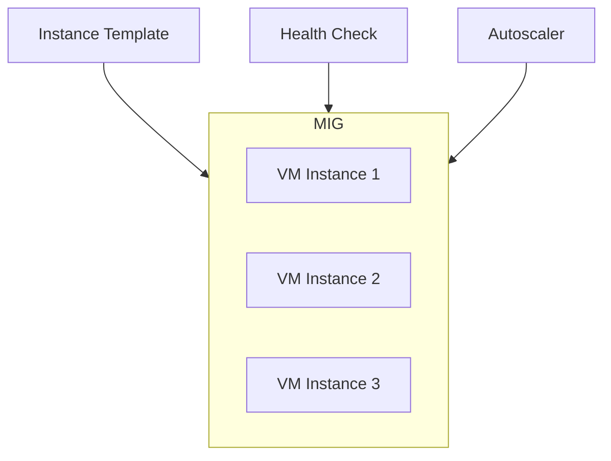
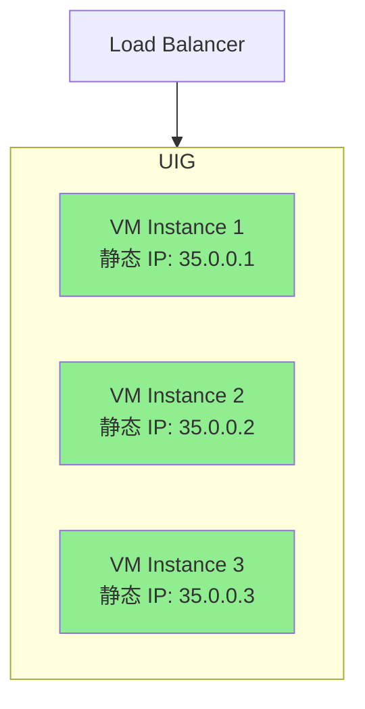
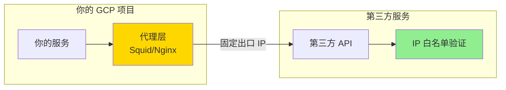
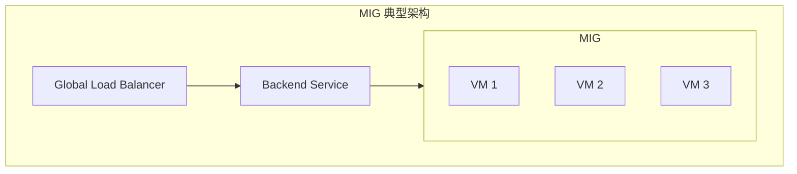
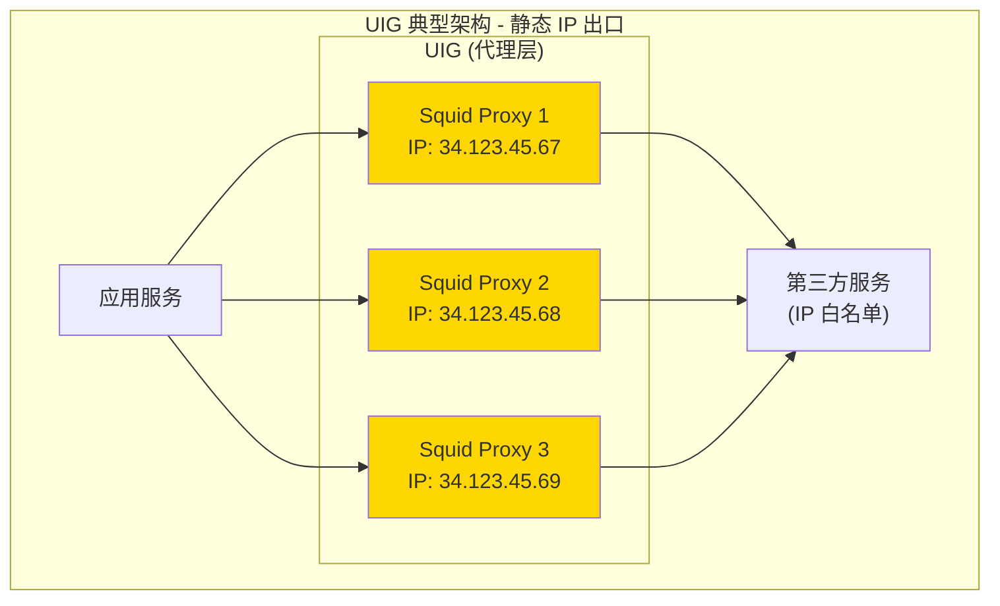
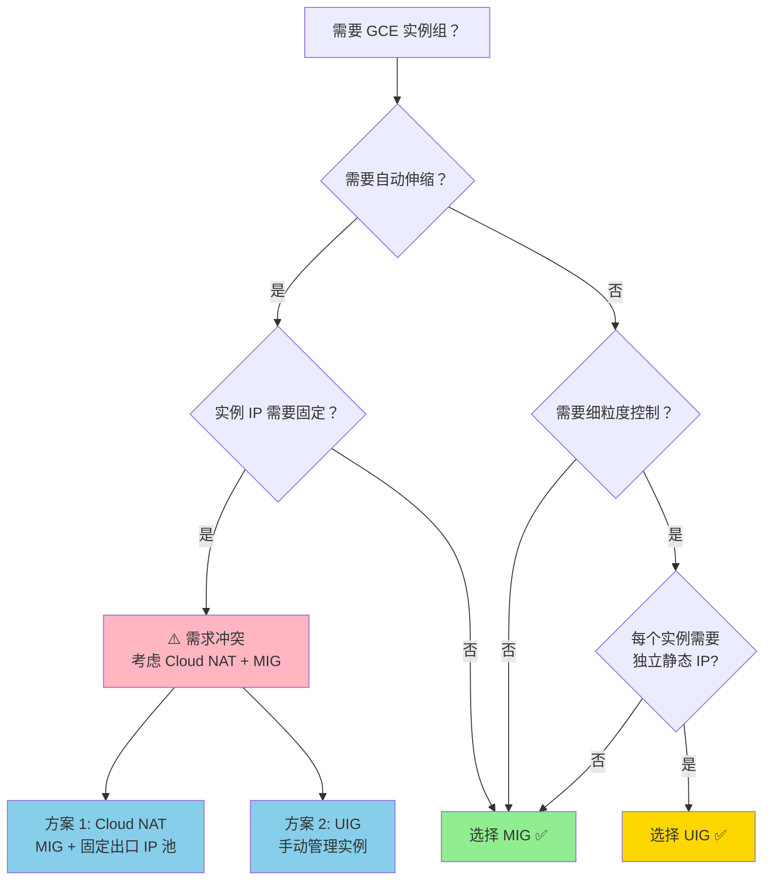
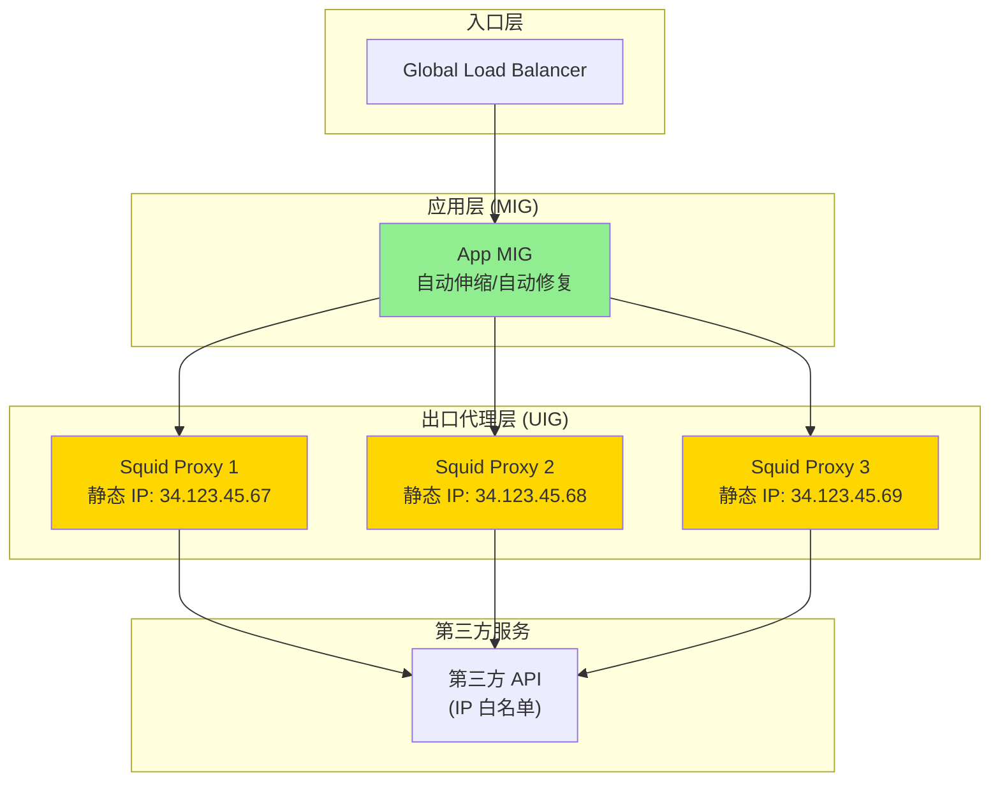

# GCP UIG vs MIG 深度对比指南

> **文档目标**: 深入理解 Uniform Instance Group (UIG) 与 Managed Instance Group (MIG) 的区别，特别是在需要**静态 IP 白名单**场景下的选型策略。

---

## 📋 目录

1. [核心概念](#核心概念)
2. [UIG 与 MIG 的关键区别](#uig-与-mig-的关键区别)
3. [静态 IP 场景分析](#静态-ip-场景分析)
4. [使用场景对比](#使用场景对比)
5. [架构决策指南](#架构决策指南)
6. [实战配置示例](#实战配置示例)
7. [最佳实践与注意事项](#最佳实践与注意事项)

---

## 核心概念

### 什么是 MIG (Managed Instance Group)

**MIG** 是 GCP 提供的**托管实例组**服务，具有自动管理、自动伸缩、自动修复等特性。



**核心特性**:
- ✅ **自动伸缩**: 根据 CPU、内存、自定义指标自动扩缩容
- ✅ **自动修复**: 实例不健康时自动重建
- ✅ **滚动更新**: 支持零停机更新实例模板
- ✅ **负载均衡集成**: 可直接绑定到 Backend Service
- ❌ **实例 IP 不固定**: 实例重建后 IP 会变化

---

### 什么是 UIG (Uniform Instance Group / Unmanaged Instance Group)

**UIG** 在 GCP 官方文档中更常被称为 **Unmanaged Instance Group**（无托管实例组），部分场景下也称为 Uniform Instance Group。

UIG 是一个**手动管理**的实例组，你需要自己管理组内的每个实例。



**核心特性**:
- ✅ **实例 IP 固定**: 每个实例可配置独立的静态 IP
- ✅ **细粒度控制**: 每个实例可有不同的配置
- ✅ **服务账号独立**: 每个实例可绑定不同的 Service Account
- ❌ **无自动伸缩**: 需要手动添加/删除实例
- ❌ **无自动修复**: 实例故障需要手动干预
- ✅ **负载均衡集成**: 可绑定到 Backend Service（同 Project 内）

---

## UIG 与 MIG 的关键区别

| 特性 | MIG (Managed Instance Group) | UIG (Unmanaged Instance Group) |
|------|------------------------------|--------------------------------|
| **管理方式** | 自动管理（GCP） | 手动管理（用户） |
| **实例模板** | 必需（所有实例相同） | 不需要（可不同） |
| **自动伸缩** | ✅ 支持 | ❌ 不支持 |
| **自动修复** | ✅ 支持 | ❌ 不支持 |
| **滚动更新** | ✅ 支持 | ❌ 不支持 |
| **静态 IP** | ❌ 实例重建后 IP 变化 | ✅ 可配置固定静态 IP |
| **实例配置** | 所有实例相同 | 每个实例可独立配置 |
| **服务账号** | 所有实例相同 | 每个实例可独立配置 |
| **健康检查** | ✅ 自动集成 | ⚠️ 需手动配置 LB 健康检查 |
| **负载均衡** | ✅ 直接绑定 Backend Service | ✅ 直接绑定 Backend Service |
| **扩缩容速度** | 自动快速 | 手动缓慢 |
| **运维复杂度** | 低 | 高 |
| **适用场景** | 无状态服务、Web 应用 | 需要固定 IP 的代理、出口网关 |

---

## 静态 IP 场景分析

### 你的场景：第三方服务要求静态 IP 白名单



### 为什么 MIG 不适合这个场景？

**问题 1: 实例重建后 IP 变化**

```bash
# MIG 中的实例被重建（自动修复或滚动更新）
# 重建前:
Instance-1: 34.123.45.67 (动态 IP)

# 重建后:
Instance-1: 34.123.89.12 (新 IP，已变化!)

# 结果：第三方服务的白名单失效 ❌
```

**问题 2:  autoscaling 时 IP 不可控**

```bash
# MIG 自动扩容时
# 新增的实例 IP 是随机的，无法预知
# 你无法提前将新 IP 添加到第三方白名单中 ❌
```

### 为什么 UIG 适合这个场景？

**优势 1: 每个实例有固定静态 IP**

```bash
# 创建实例时分配静态 IP
gcloud compute instances create squid-proxy-1 \
    --zone=us-central1-a \
    --address=34.123.45.67  # 预分配的静态 IP

# 即使实例重启，IP 保持不变 ✅
```

**优势 2: 可提前规划 IP 白名单**

```bash
# 你可以提前创建静态 IP 地址池
gcloud compute addresses create squid-ip-1 --region=us-central1
gcloud compute addresses create squid-ip-2 --region=us-central1
gcloud compute addresses create squid-ip-3 --region=us-central1

# 将这些 IP 提供给第三方服务加入白名单 ✅
```

---

## 使用场景对比

### MIG 适用场景

| 场景 | 说明 | 示例 |
|------|------|------|
| **无状态 Web 服务** | 实例可随时替换 | API 服务器、前端应用 |
| **批量处理任务** | 需要快速扩缩容 | 数据处理、图像转码 |
| **高可用服务** | 需要自动修复 | 关键业务服务 |
| **快速迭代部署** | 频繁更新版本 | CI/CD 部署目标 |



---

### UIG 适用场景

| 场景 | 说明 | 示例 |
|------|------|------|
| **出口代理网关** | 需要固定出口 IP | Squid、Nginx 代理 |
| **第三方集成** | 对方要求 IP 白名单 | 支付网关、合作伙伴 API |
| **有状态服务** | 实例需要持久化配置 | 特定配置的服务 |
| **独立服务账号** | 每个实例不同权限 | 多租户场景 |



---

## 架构决策指南

### 决策树



### 你的场景推荐架构

基于你的需求（访问第三方服务，需要静态 IP 白名单），推荐以下两种方案：

---

#### 方案 A: UIG + 静态 IP（推荐用于代理层）

**架构**:
```
应用服务 → UIG (Squid/Nginx 代理，固定 IP) → 第三方服务
```

**优点**:
- ✅ 每个代理实例有独立静态 IP
- ✅ 可精确控制出口 IP
- ✅ 每个实例可配置独立服务账号
- ✅ 适合需要向第三方提供固定 IP 列表的场景

**缺点**:
- ❌ 需要手动管理实例扩缩容
- ❌ 无自动修复能力

**实施步骤**:

```bash
# 1. 创建静态 IP 地址池
gcloud compute addresses create squid-ip-1 --region=us-central1
gcloud compute addresses create squid-ip-2 --region=us-central1
gcloud compute addresses create squid-ip-3 --region=us-central1

# 2. 获取 IP 地址列表（提供给第三方加入白名单）
gcloud compute addresses list --regions=us-central1

# 3. 创建实例（每个实例绑定独立静态 IP）
gcloud compute instances create squid-proxy-1 \
    --zone=us-central1-a \
    --address=34.123.45.67 \
    --service-account=squid-sa-1@my-project.iam.gserviceaccount.com

gcloud compute instances create squid-proxy-2 \
    --zone=us-central1-b \
    --address=34.123.45.68 \
    --service-account=squid-sa-2@my-project.iam.gserviceaccount.com

# 4. 创建实例组（UIG）
gcloud compute instance-groups unmanaged create squid-uig \
    --zone=us-central1-a

gcloud compute instance-groups unmanaged add-instances squid-uig \
    --zone=us-central1-a \
    --instances=squid-proxy-1,squid-proxy-2

# 5. 绑定到 Backend Service
gcloud compute backend-services add-backend squid-backend \
    --instance-group=squid-uig \
    --instance-group-zone=us-central1-a \
    --global
```

---

#### 方案 B: MIG + Cloud NAT（推荐用于一般服务）

**架构**:
```
MIG 实例 → Cloud NAT (固定出口 IP 池) → 第三方服务
```

**优点**:
- ✅ 保留 MIG 的自动伸缩、自动修复能力
- ✅ 出口 IP 固定（通过 Cloud NAT）
- ✅ 运维简单

**缺点**:
- ❌ 所有实例共享 NAT IP 池
- ❌ 无法为单个实例分配独立出口 IP
- ❌ NAT IP 数量有限制

**实施步骤**:

```bash
# 1. 创建静态 IP 地址池（用于 NAT）
gcloud compute addresses create nat-ip-pool \
    --region=us-central1 \
    --addresses=34.123.45.67,34.123.45.68,34.123.45.69

# 2. 创建 Cloud Router
gcloud compute routers create nat-router \
    --network=default \
    --region=us-central1

# 3. 创建 Cloud NAT 配置
gcloud compute routers nats create nat-config \
    --router=nat-router \
    --region=us-central1 \
    --nat-external-ip-pool=nat-ip-pool \
    --nat-all-subnet-ip-ranges \
    --min-ports-per-vm=64

# 4. 创建 MIG（实例不需要外部 IP）
gcloud compute instance-templates create app-template \
    --machine-type=n2-standard-4 \
    --no-address  # 不分配外部 IP，流量通过 NAT

gcloud compute instance-groups managed create app-mig \
    --base-instance-name=app \
    --template=app-template \
    --size=3 \
    --region=us-central1
```

---

## 实战配置示例

### 完整脚本：创建 UIG 静态 IP 代理层

```bash
#!/bin/bash
# 创建 UIG 静态 IP 代理层完整脚本

set -e

PROJECT_ID="your-project-id"
REGION="us-central1"
ZONES=("us-central1-a" "us-central1-b" "us-central1-c")
PROXY_COUNT=3

# 1. 创建静态 IP 地址池
echo "=== 创建静态 IP 地址池 ==="
for i in $(seq 1 $PROXY_COUNT); do
    IP_NAME="squid-ip-$i"
    gcloud compute addresses create $IP_NAME \
        --region=$REGION \
        --project=$PROJECT_ID
    echo "✓ 创建 IP: $IP_NAME"
done

# 2. 获取所有静态 IP（用于提供给第三方）
echo ""
echo "=== 静态 IP 列表（提供给第三方加入白名单）==="
gcloud compute addresses list \
    --filter="region:$REGION" \
    --format="table(name,address,status)"

# 3. 创建服务账号（可选：每个实例独立 SA）
echo ""
echo "=== 创建服务账号 ==="
for i in $(seq 1 $PROXY_COUNT); do
    SA_EMAIL="squid-proxy-$i@$PROJECT_ID.iam.gserviceaccount.com"
    gcloud iam service-accounts create squid-proxy-$i \
        --display-name="Squid Proxy $i Service Account" \
        --project=$PROJECT_ID || true
    echo "✓ 创建服务账号: $SA_EMAIL"
done

# 4. 创建防火墙规则（允许健康检查）
echo ""
echo "=== 创建防火墙规则 ==="
gcloud compute firewall-rules create allow-health-check-squid \
    --network=default \
    --action=ALLOW \
    --rules=tcp:8080 \
    --source-ranges=35.191.0.0/16,130.211.0.0/22 \
    --target-tags=squid-proxy \
    --project=$PROJECT_ID || true

# 5. 创建实例（每个绑定独立静态 IP）
echo ""
echo "=== 创建 Squid 代理实例 ==="
for i in $(seq 1 $PROXY_COUNT); do
    ZONE=${ZONES[$((($i - 1) % ${#ZONES[@]}))]}
    INSTANCE_NAME="squid-proxy-$i"
    IP_ADDRESS=$(gcloud compute addresses describe squid-ip-$i \
        --region=$REGION \
        --format="value(address)")
    SA_EMAIL="squid-proxy-$i@$PROJECT_ID.iam.gserviceaccount.com"
    
    gcloud compute instances create $INSTANCE_NAME \
        --zone=$ZONE \
        --machine-type=e2-medium \
        --address=$IP_ADDRESS \
        --tags=squid-proxy \
        --service-account=$SA_EMAIL \
        --scopes=https://www.googleapis.com/auth/cloud-platform \
        --image-family=debian-11 \
        --image-project=debian-cloud \
        --metadata=startup-script-url=gs://your-bucket/squid-startup.sh \
        --project=$PROJECT_ID
    
    echo "✓ 创建实例: $INSTANCE_NAME (IP: $IP_ADDRESS, Zone: $ZONE)"
done

# 6. 创建实例组（UIG）
echo ""
echo "=== 创建 Unmanaged Instance Group ==="
gcloud compute instance-groups unmanaged create squid-uig \
    --zone=${ZONES[0]} \
    --project=$PROJECT_ID

# 7. 添加实例到 UIG
echo ""
echo "=== 添加实例到 UIG ==="
INSTANCE_LIST=""
for i in $(seq 1 $PROXY_COUNT); do
    INSTANCE_LIST="$INSTANCE_LIST squid-proxy-$i"
done

gcloud compute instance-groups unmanaged add-instances squid-uig \
    --zone=${ZONES[0]} \
    --instances=$INSTANCE_LIST \
    --project=$PROJECT_ID

echo "✓ 添加实例到 UIG: $INSTANCE_LIST"

# 8. 创建 Backend Service 并绑定 UIG
echo ""
echo "=== 创建 Backend Service ==="
gcloud compute health-checks create http squid-health-check \
    --port=8080 \
    --request-path=/health \
    --project=$PROJECT_ID

gcloud compute backend-services create squid-backend \
    --health-checks=squid-health-check \
    --global \
    --project=$PROJECT_ID

gcloud compute backend-services add-backend squid-backend \
    --instance-group=squid-uig \
    --instance-group-zone=${ZONES[0]} \
    --balancing-mode=RATE \
    --max-rate-per-instance=100 \
    --global \
    --project=$PROJECT_ID

echo "✓ Backend Service 创建完成"

# 9. 输出总结
echo ""
echo "=============================================="
echo "✅ UIG 静态 IP 代理层创建完成！"
echo "=============================================="
echo ""
echo "📋 下一步操作:"
echo "1. 将以下 IP 提供给第三方服务加入白名单:"
gcloud compute addresses list \
    --filter="region:$REGION" \
    --format="value(address)"
echo ""
echo "2. 验证实例健康状态:"
echo "   gcloud compute backend-services get-health squid-backend --global"
echo ""
echo "3. 配置 DNS 或 Load Balancer 指向 Backend Service"
echo ""
```

---

### 混合架构：MIG + UIG 组合使用

在实际生产中，你可以结合 MIG 和 UIG 的优势：



**架构说明**:
- **应用层使用 MIG**: 享受自动伸缩、自动修复的便利
- **出口层使用 UIG**: 提供固定的静态 IP 给第三方白名单
- **流量路径**: 用户 → GLB → MIG (应用) → UIG (代理) → 第三方服务

---

## 最佳实践与注意事项

### UIG 运维最佳实践

#### 1. 实例监控与告警

由于 UIG 没有自动修复，你需要建立完善的监控：

```bash
# 创建监控告警（实例不健康时通知）
gcloud alpha monitoring policies create \
    --policy-from-file=uig-health-alert-policy.json
```

**监控指标**:
- ✅ 实例 CPU 使用率
- ✅ 实例内存使用率
- ✅ 实例磁盘使用率
- ✅ 健康检查状态
- ✅ 网络流量异常

#### 2. 手动扩缩容流程

```bash
# 扩容：添加新实例
gcloud compute instances create squid-proxy-4 \
    --zone=us-central1-a \
    --address=34.123.45.70 \
    --service-account=squid-proxy-4@my-project.iam.gserviceaccount.com

# 添加到 UIG
gcloud compute instance-groups unmanaged add-instances squid-uig \
    --zone=us-central1-a \
    --instances=squid-proxy-4

# 添加到 Backend Service
gcloud compute backend-services add-backend squid-backend \
    --instance-group=squid-uig \
    --instance-group-zone=us-central1-a \
    --global
```

#### 3. 实例替换流程（模拟自动修复）

```bash
#!/bin/bash
# 手动替换不健康实例

INSTANCE_NAME="squid-proxy-1"
ZONE="us-central1-a"
STATIC_IP="34.123.45.67"
SERVICE_ACCOUNT="squid-proxy-1@my-project.iam.gserviceaccount.com"

echo "⚠️ 开始替换不健康实例: $INSTANCE_NAME"

# 1. 从 UIG 移除
gcloud compute instance-groups unmanaged remove-instances squid-uig \
    --zone=$ZONE \
    --instances=$INSTANCE_NAME

# 2. 删除旧实例（保留 IP）
gcloud compute instances delete $INSTANCE_NAME \
    --zone=$ZONE \
    --keep-external-ip  # 关键：保留静态 IP

# 3. 等待删除完成
sleep 10

# 4. 创建新实例（使用相同 IP）
gcloud compute instances create $INSTANCE_NAME \
    --zone=$ZONE \
    --address=$STATIC_IP \
    --service-account=$SERVICE_ACCOUNT \
    --image-family=debian-11 \
    --image-project=debian-cloud

# 5. 等待实例启动
sleep 30

# 6. 添加回 UIG
gcloud compute instance-groups unmanaged add-instances squid-uig \
    --zone=$ZONE \
    --instances=$INSTANCE_NAME

echo "✅ 实例替换完成"
```

---

### 静态 IP 管理注意事项

#### 1. IP 地址配额限制

```bash
# 查看当前 IP 地址配额
gcloud compute project-info describe --project=$PROJECT_ID \
    --format="value(quotas[quota='EXTERNAL_ADDRESSES'].limit)"

# 查看已使用的 IP
gcloud compute addresses list --format="table(name,address,status)"
```

**配额提升**: 如果默认配额不够，需要申请提升
- 默认配额：每个区域 8 个静态 IP
- 可申请提升至：每个区域 100+ 个

#### 2. IP 地址成本管理

静态 IP 会产生费用：
- **已使用**: 免费
- **未使用**: $0.01/小时/IP（约 $7.2/月/IP）

```bash
# 定期检查未使用的 IP
gcloud compute addresses list --filter="status=RESERVED"

# 释放不需要的 IP
gcloud compute addresses delete ADDRESS_NAME --region=$REGION
```

---

### 安全最佳实践

#### 1. 最小权限服务账号

```bash
# 为每个代理实例创建独立的服务账号
# 只授予必要的权限
gcloud projects add-iam-policy-binding $PROJECT_ID \
    --member=serviceAccount:squid-proxy-1@$PROJECT_ID.iam.gserviceaccount.com \
    --role=roles/logging.logWriter

gcloud projects add-iam-policy-binding $PROJECT_ID \
    --member=serviceAccount:squid-proxy-1@$PROJECT_ID.iam.gserviceaccount.com \
    --role=roles/monitoring.metricWriter
```

#### 2. 防火墙规则限制

```bash
# 只允许健康检查和必要的流量
gcloud compute firewall-rules create allow-squid-health \
    --network=default \
    --action=ALLOW \
    --rules=tcp:8080 \
    --source-ranges=35.191.0.0/16,130.211.0.0/22 \
    --target-tags=squid-proxy

# 限制出站流量（可选）
gcloud compute firewall-rules create deny-squid-egress \
    --network=default \
    --action=DENY \
    --direction=EGRESS \
    --destination-ranges=0.0.0.0/0 \
    --target-tags=squid-proxy \
    --rules=all

# 只允许访问第三方服务的 IP 范围
gcloud compute firewall-rules create allow-squid-third-party \
    --network=default \
    --action=ALLOW \
    --direction=EGRESS \
    --destination-ranges=第三方服务 IP 段 \
    --target-tags=squid-proxy \
    --rules=tcp:443
```

---

### 常见问题 FAQ

#### Q1: UIG 实例重建后，静态 IP 会丢失吗？

**A**: 不会。只要在删除实例时使用 `--keep-external-ip` 参数，静态 IP 会保留，新实例可以重新绑定该 IP。

```bash
# 正确做法
gcloud compute instances delete INSTANCE_NAME \
    --zone=ZONE \
    --keep-external-ip  # ✅ 保留 IP
```

#### Q2: 可以在 MIG 中使用静态 IP 吗？

**A**: 技术上可以，但不推荐。MIG 实例重建后，虽然可以预留 IP 地址，但需要复杂的配置，且会失去 MIG 的自动修复优势。

#### Q3: UIG 如何与健康检查集成？

**A**: UIG 本身不支持健康检查，但可以通过 Backend Service 的健康检查来监控实例状态：

```bash
# 创建健康检查
gcloud compute health-checks create http squid-health \
    --port=8080 \
    --request-path=/health

# 绑定到 Backend Service
gcloud compute backend-services update squid-backend \
    --health-checks=squid-health \
    --global
```

#### Q4: 如何实现 UIG 的自动扩缩容？

**A**: UIG 本身不支持自动扩缩容，但可以通过以下方式实现：
1. **Cloud Monitoring + Cloud Functions**: 监控指标触发函数自动创建/删除实例
2. **自定义脚本 + Cron**: 定期运行脚本检查负载并调整实例数
3. **第三方工具**: 使用 Terraform、Pulumi 等基础设施即代码工具

---

## 总结

### UIG vs MIG 选择决策表

| 你的需求 | 推荐方案 | 原因 |
|----------|----------|------|
| 需要固定出口 IP 白名单 | **UIG** | 每个实例独立静态 IP |
| 需要自动伸缩 | **MIG** | 内置 Autoscaler |
| 需要自动修复 | **MIG** | 实例故障自动重建 |
| 需要零停机更新 | **MIG** | 支持滚动更新 |
| 每个实例不同配置 | **UIG** | 细粒度控制 |
| 每个实例独立服务账号 | **UIG** | 独立权限管理 |
| 运维简单 | **MIG** | 自动化管理 |
| 第三方要求 IP 白名单 | **UIG** 或 **MIG+Cloud NAT** | 固定出口 IP |

### 你的场景最佳实践

基于你的需求（访问第三方服务，需要静态 IP 白名单）：

**推荐架构**: **UIG 代理层 + MIG 应用层**

```
用户请求 → GLB → MIG (应用服务) → UIG (Squid 代理，固定 IP) → 第三方服务
```

**优势**:
1. ✅ 应用层享受 MIG 的自动伸缩、自动修复
2. ✅ 出口层通过 UIG 提供固定 IP 白名单
3. ✅ 职责分离，便于管理和监控
4. ✅ 可扩展性强，可根据需求独立调整各层

---

## 参考资源

- [GCP Instance Groups 官方文档](https://cloud.google.com/compute/docs/instance-groups)
- [Unmanaged Instance Groups](https://cloud.google.com/compute/docs/instance-groups/unmanaged-instance-groups)
- [Managed Instance Groups](https://cloud.google.com/compute/docs/instance-groups/managed-instance-groups)
- [Cloud NAT 文档](https://cloud.google.com/nat/docs/overview)
- [静态 IP 地址管理](https://cloud.google.com/compute/docs/ip-addresses)

---

**文档版本**: v1.0  
**创建日期**: 2026-04-16  
**适用环境**: GCP 生产环境  
**维护者**: Architecture Team
