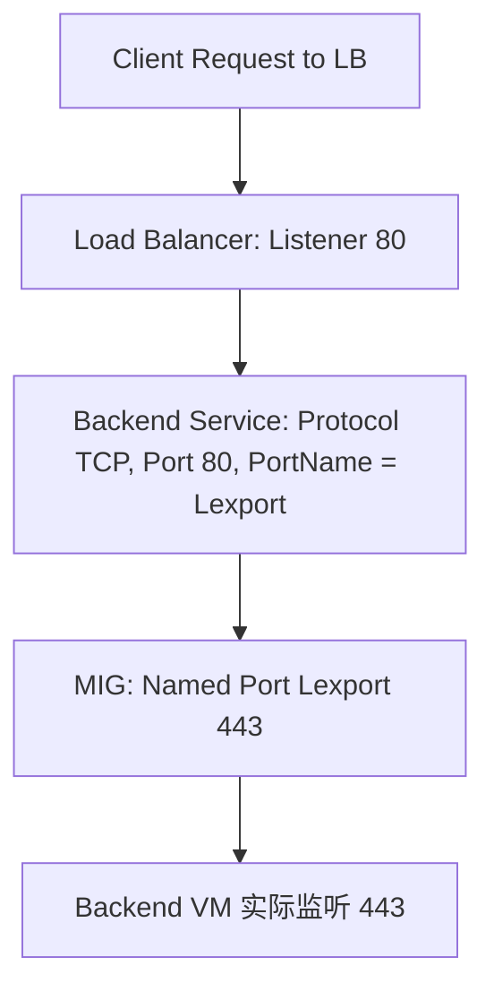
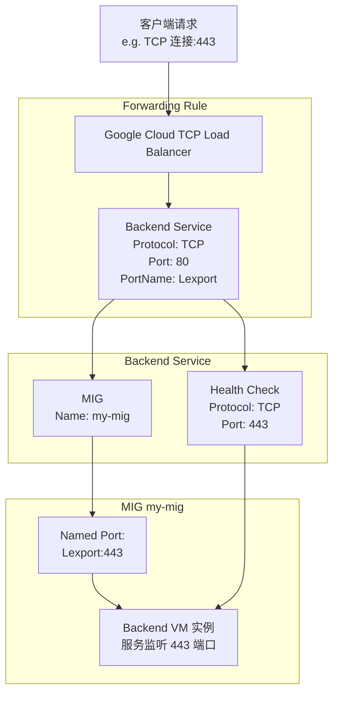

你的疑问非常合理。在 GCP 使用 Load Balancer（尤其是 TCP/SSL LB 或 HTTPS LB + Backend Service）时，端口配置确实容易令人困惑。以下是你提供的信息简化版和分析：
https://cloud.google.com/sdk/gcloud/reference/compute/backend-services/update
你的配置摘要：

```yaml
creationTimestamp: '2023-01-01T00:00:00.000-07:00'
description: ''
fingerprint: ABCDEFGHIJKLMNOPQRSTUVWXYZ1234567890==
id: '1234567890123456789'
kind: compute#backendService
name: my-lb-backend-svc
port: 80
portName: Lexport
protocol: TCP
region: global
selfLink: https://www.googleapis.com/compute/v1/projects/my-project/global/backendServices/my-lb-backend-svc
timeoutSec: 30
backends:
- balancingMode: UTILIZATION
  capacityScaler: 1.0
  group: https://www.googleapis.com/compute/v1/projects/my-project/zones/us-central1-a/instanceGroups/my-mig
  maxUtilization: 0.8
healthChecks:
- https://www.googleapis.com/compute/v1/projects/my-project/global/healthChecks/my-health-check
loadBalancingScheme: EXTERNAL
sessionAffinity: NONE


Backend Service:

name: my-lb-backend-svc

Protocol: TCP

Port: 80

PortName: Lexport

Health Check:

Type: TCP

Port: 443

MIG:

NamedPorts:

- Name: Lexport

Port: 443
```

# How to edit port

你好！这是一个非常好的问题，它触及了 GCP 负载均衡器配置中一个关键且容易混淆的核心概念：**`port` vs `portName`**。

你遇到的情况是完全正常的，而且是 GCP 推荐的最佳实践之一。下面我来为你详细解释为什么你的服务能正常工作，以及如何修改配置。

### 核心解释：`portName` 的优先级高于 `port`

让我们来分解你的配置：

1.  **MIG (Managed Instance Group) - `my-mig`**:

    - `NamedPorts: Name: Lexport, Port: 443`
    - **作用**：这就像是给你的实例组中的一个端口起了一个别名。你在这里声明：“在我这个 MIG 里，所有叫做 `Lexport` 的端口，实际对应的物理端口都是 `443`。” 你的后端服务（比如 Nginx, Apache 等）也确实在监听 `443` 端口。

2.  **Health Check**:

    - `tcp health check port 443`
    - **作用**：健康检查器非常直接。它独立地去探测你 MIG 中每个实例的 `443` 端口，确认服务是否存活。因为你的服务在 `443` 上运行，所以健康检查通过，实例被标记为 `HEALTHY`。

3.  **Backend Service - `my-lb-backend-svc`**:
    - `Port: 80`
    - `PortName: Lexport`
    - `Protocol: TCP`
    - **作用（这是关键！）**：当后端服务（Backend Service）同时配置了 `port` 和 `portName` 时，**`portName` 的优先级更高**。
        - 负载均衡器看到 `portName: Lexport`。
        - 它会去查找这个后端服务关联的后端（也就是你的 MIG `my-mig`）。
        - 在 `my-mig` 中，它找到了 `Lexport` 这个名字对应的端口是 `443`。
        - 因此，负载均衡器会将所有流量都转发到 MIG 中健康实例的 **`443` 端口**。
        - `Port: 80` 这个字段在这种情况下**被忽略了**。它只是一个在没有指定 `portName` 时的默认值或备用值。

**总结一下流量路径：**

外部请求 -> 负载均衡器 -> 后端服务 (`my-lb-backend-svc`) -> 看到 `portName: Lexport` -> 查找 MIG (`my-mig`) -> 发现 `Lexport` = `443` -> 将流量转发到健康实例的 `443` 端口。

**为什么这样设计？**

使用 `NamedPort` 是一个非常灵活的设计。想象一下，如果你有多个 MIG（比如一个用于生产环境，一个用于测试），它们可能在不同的端口上运行同一个服务。

- `prod-mig` 的 `Lexport` 可以是 `443`。
- `staging-mig` 的 `Lexport` 可以是 `8443`。

你只需要一个后端服务，将它的 `portName` 设置为 `Lexport`。当你把后端从 `prod-mig` 切换到 `staging-mig` 时，你**不需要修改后端服务**的任何配置，负载均衡器会自动将流量从 `443` 端口转发到 `8443` 端口。这大大简化了运维和部署。

---

### 如何修改配置：将协议改为 HTTPS

现在，我们来解决你的第二个问题：如何将这个后端服务的配置修改得更“标准”，比如把协议改成 `HTTPS`。

你不能直接“修改”协议，因为 `TCP` 和 `HTTPS` 是不同类型的负载均衡器使用的后端协议。你正在使用的是一个**全球外部应用负载均衡器**或**经典应用负载均衡器**，它的后端服务协议通常是 `HTTP`, `HTTPS`, 或 `HTTP/2`。而你的当前协议是 `TCP`，这表明你可能正在使用一个**TCP 代理负载均衡器**或**SSL 代理负载均衡器**。

**重要提示：** 在执行任何更新命令之前，请先确认你的负载均衡器类型！不同的负载均衡器，其后端服务协议选项是不同的。

假设你使用的是**全球外部应用负载均衡器**，并且希望后端服务与实例之间也使用加密通信（即 HTTPS）。

你无法找到修改 `Port: 80` 的直接方法，是因为这个值被 `portName` 覆盖了，所以修改它没有意义。你需要做的是更新后端服务的**协议**。

**使用 `gcloud` 更新后端服务的命令是 `gcloud compute backend-services update`。**

```bash
# 将后端服务的协议更新为 HTTPS
# --global 参数适用于全球后端服务
gcloud compute backend-services update my-lb-backend-svc \
    --protocol=HTTPS \
    --global

你这个错误信息的核心是：

protocol must be TCP/SSL if the backend service is associated with a targetTcpProxy

⸻

🔍 原因解释

你当前的架构是基于 TCP Load Balancer（使用 targetTcpProxy）。在这种架构下：
	•	前端协议：TCP
	•	后端服务协议（backend-service protocol）：只能是 TCP 或 SSL（不支持 HTTPS）

⸻

✅ GCP 协议支持对照表

Proxy 类型	支持的后端协议 (--protocol)
targetTcpProxy	TCP / SSL（终端透明传递）
targetHttpProxy	HTTP
targetHttpsProxy	HTTPS
targetSslProxy	SSL
targetGrpcProxy	GRPC


⸻

🛠 如果你真的要使用 --protocol=HTTPS，你需要满足以下前提：
	1.	使用 L7 Load Balancer
	•	即你要创建一个 HTTPS 负载均衡器，需要配套使用：
	•	targetHttpsProxy
	•	URL map
	•	backend-service --protocol=HTTPS
	2.	同时你的后端也必须是支持 HTTPS（比如服务开启了 TLS）

⸻

✅ 正确做法（根据你的目标）：

如果你当前使用的是 TCP 代理（targetTcpProxy）

# 正确的做法就是保持原样：
gcloud compute backend-services update my-lb-backend-svc \
    --protocol=TCP \
    --global

如果你希望使用 HTTPS L7 LB（适配 ALB）

你需要重建一个 HTTPS Load Balancer，例如：

gcloud compute backend-services create my-lb-backend-svc \
    --protocol=HTTPS \
    --port-name=https \
    --health-checks=my-hc \
    --global

并且关联到：
	•	targetHttpsProxy
	•	url-map
	•	forwarding-rule（监听 443）

⸻

✅ 总结

你当前的 backend service 是挂在 targetTcpProxy 上的，因此它 只能使用 TCP 或 SSL 协议。
如果你希望使用 HTTPS 协议，需要完全改为 L7 HTTP(S) LB 架构。

是否需要我为你画出对比图：TCP Proxy vs HTTPS Proxy 架构差异？


          
您遇到的错误提示 "Invalid value for field 'resouce.protocol' 'HTTPS'. protocol must be TCP/SSL if the backend service is associated with a targetTCPPROXY" 是因为后端服务（`backend-services`）的协议类型与您使用的目标代理（`targetTcpProxy`）不兼容。

根据 GCP 的负载均衡器设计，如果您将后端服务关联到 `targetTcpProxy`，那么后端服务的协议只能是 `TCP` 或 `SSL`。`HTTPS` 协议是为 `targetHttpsProxy` 或 `targetSslProxy` 设计的。

在您提供的 <mcfile name="namedports.md" path="/Users/lex/git/knowledge/gcp/gce/namedports.md"></mcfile> 文件中，关于“后端服务支持的协议”部分有详细说明：

```markdown:/Users/lex/git/knowledge/gcp/gce/namedports.md
// ... existing code ...
## 后端服务支持的协议

下表总结了各种负载均衡器代理类型和后端服务协议的兼容性：

| 代理类型             | 支持的后端服务协议     |
|--------------------|--------------------|
| `targetHttpProxy`    | `HTTP`, `HTTPS`, `HTTP/2` |
| `targetHttpsProxy`   | `HTTP`, `HTTPS`, `HTTP/2` |
| `targetSslProxy`     | `SSL`, `TCP`       |
| `targetTcpProxy`     | `TCP`, `SSL`       |
| `targetVpnGateway`   | `UDP`              |
| `targetGrpcProxy`    | `GRPC`, `HTTP`, `HTTPS`, `HTTP/2` |

// ... existing code ...

```

因此，要解决此问题，您需要根据实际需求选择：

1.  **如果您的目标是 TCP/SSL 负载均衡**：将后端服务的协议更改为 `TCP` 或 `SSL`。
    ```bash
    gcloud compute backend-services update my-lb-backend-svc \
        --protocol=TCP \
        --global
    ```
    或者
    ```bash
    gcloud compute backend-services update my-lb-backend-svc \
        --protocol=SSL \
        --global
    ```

2.  **如果您确实需要 `HTTPS` 协议**：您需要使用 `targetHttpsProxy` 或 `targetSslProxy` 来关联您的后端服务，而不是 `targetTcpProxy`。这通常意味着您正在构建一个 L7 负载均衡器（例如 HTTPS 负载均衡器），而不是 L4 负载均衡器（TCP/SSL 代理）。

请检查您的负载均衡器配置，确认后端服务所关联的目标代理类型，并据此调整协议。
        
```

**执行这个命令后会发生什么？**

1.  **协议变更**：后端服务的协议会从 `TCP` 变为 `HTTPS`。这意味着负载均衡器现在会尝试与你的后端实例建立一个 TLS/SSL 连接。
2.  **默认端口**：当协议是 `HTTPS` 时，GCP 会智能地将默认端口识别为 `443`。即使 `describe` 命令中仍然显示旧的 `Port: 80`（虽然通常也会更新），但实际行为将由 `portName` 和新的 `HTTPS` 协议决定，流量会正确地流向 `443` 端口。
3.  **对健康检查的影响**：这是一个**非常重要**的步骤！当你将后端协议改为 `HTTPS` 后，原来的 `TCP` 健康检查就不再是最佳实践了。一个简单的 TCP 检查只能确认端口是开放的，但不能确认 HTTPS 服务是否正常（例如，SSL 证书是否有效）。

    你应该创建一个 `HTTPS` 类型的健康检查，并用它来替换旧的检查。

    **步骤 1：创建一个 HTTPS 健康检查（如果还没有的话）**

    ```bash
    gcloud compute health-checks create https my-https-health-check \
        --port=443 \
        --request-path="/"  # 根据你的应用指定一个检查路径
    ```

    **步骤 2：更新后端服务以使用新的健康检查**

    ```bash
    gcloud compute backend-services update my-lb-backend-svc \
        --health-checks=my-https-health-check \
        --global
    ```

### 总结

1.  **服务正常的原因**：因为你的后端服务使用了 `portName: Lexport`，它覆盖了 `port: 80` 的设置，并根据 MIG 中的 `NamedPorts` 定义，将流量正确地发往了 `443` 端口。
2.  **如何修改**：你不需要修改那个被忽略的 `Port: 80`。你应该使用 `gcloud compute backend-services update` 命令来修改你真正关心的属性，比如 `--protocol`。
3.  **最佳实践**：
    - 继续使用 `NamedPort`，这是一个非常好的习惯。
    - 当后端服务协议是 `HTTPS` 时，务必将健康检查也升级为 `HTTPS` 类型，以确保更准确的健康状态判断。

你说得完全正确！这也是一个让很多人困惑的点。

**你观察得非常准确：`gcloud compute backend-services update` 的文档里确实没有 `--port` 这个参数。**

这并不是文档的疏忽，而是 GCP 设计的核心所在。现在我来解释为什么会这样，以及这如何印证了我之前的说法。

### 为什么不能直接修改那个 `port` 字段？

GCP 之所以不提供一个直接的命令来修改后端服务里的 `port: 80` 这个数字，是因为在你的配置中，**这个字段已经被 `portName: Lexport` 覆盖而变得无效了**。

可以这样理解这几个配置的关系：

1.  **MIG 的 `NamedPort`（例如 `Lexport: 443`）**：这是**事实的唯一来源 (Single Source of Truth)**。它权威地定义了你的后端实例上，哪个端口对应哪个服务名称。
2.  **后端服务的 `portName`（例如 `Lexport`）**：这是一个**指针或引用**。它告诉负载均衡器：“不要看我这里的 `port` 数字，去我关联的 MIG 里查找一个叫做 `Lexport` 的端口，然后把流量发到那个端口上。”
3.  **后端服务的 `port`（例如 `80`）**：这是一个**备用/默认值**。只有在 `portName` **没有**被设置的情况下，这个字段才会被使用。在你的场景下，因为它被 `portName` 覆盖了，所以它只是一个遗留的、无意义的配置项。

**因此，GCP 不提供修改一个无效字段的命令，是完全符合逻辑的。** 强行修改一个不起作用的数字，只会增加用户的困惑。GCP 的设计哲学是鼓励你使用 `portName` 这种更灵活、更强大的方式来管理端口。

### 那么，如何真正地“改变”流量的目标端口？

如果你真的想把流量从 `443` 改到另一个端口（比如 `8443`），正确的操作流程不是去修改后端服务，而是：

1.  **更新你的实例模板 (Instance Template)**，让新创建的虚拟机在 `8443` 端口上运行你的服务。
2.  **更新你的 MIG 配置**，修改 `NamedPort` 的映射。
    ```bash
    # 这条命令会更新MIG，将名为 Lexport 的端口指向 8443
    gcloud compute instance-groups managed set-named-ports my-mig \
        --named-ports=Lexport:8443 \
        --zone=YOUR_MIG_ZONE # 或者 --region=YOUR_MIG_REGION
    ```
3.  **对 MIG 执行滚动更新**，让所有实例都采用新的实例模板和端口配置。

完成这些操作后，你的后端服务**不需要做任何改动**。因为它依然在寻找 `Lexport`，而现在 `Lexport` 已经指向了 `8443`，流量会自动地流向新的端口。这就是 `portName` 强大的解耦能力。

---

### 回到你最初的目标：修改协议为 HTTPS

所以，请放心地执行之前的命令。

```bash
# 步骤1：更新后端服务的协议
gcloud compute backend-services update my-lb-backend-svc \
    --protocol=HTTPS \
    --global

# 步骤2：创建或更新你的健康检查为 HTTPS 类型
# (如果需要，先创建)
gcloud compute health-checks create https my-https-health-check --port=443

# (更新后端服务以使用新的健康检查)
gcloud compute backend-services update my-lb-backend-svc \
    --health-checks=my-https-health-check \
    --global
```

当你执行完第一条命令后，你的后端服务配置会变成：

- `name: my-lb-backend-svc`
- `Port: 80` (可能依然显示，但依然被忽略)
- `PortName: Lexport` (**依然是决定性因素，指向 MIG 的 443 端口**)
- `Protocol: HTTPS` (**新的、有效的协议**)

负载均衡器会这样工作：

1.  看到协议是 `HTTPS`，准备发起一个加密的 TLS 连接。
2.  看到 `portName` 是 `Lexport`。
3.  去 MIG 里查找 `Lexport`，发现它对应 `443` 端口。
4.  最终，向你后端实例的 `443` 端口发起一个 `HTTPS` 请求。

一切都将如预期般正常工作。不要再纠结于那个被忽略的 `Port: 80` 字段了，它在你的当前配置下只是一个“装饰品”。

# 🌟 核心疑问解析

为什么 Backend Service 的 Port 是 80，但是 Health Check 和实际服务是 443，并且服务正常？

✅ 理解 GCP Backend Service 的

Port

字段

在 TCP/SSL Load Balancer 中，Backend Service 的端口（或 PortName）并不是直接映射物理端口，而是一个逻辑端口，GCP 会根据你指定的 PortName 去后端 MIG 中查找 Named Port。

🔄 流程解构（结合你的情况）



- Backend Service 的 Port = 80（数值本身无实际用途）

- 因为设置了 PortName = Lexport，GCP 实际是使用此名称去找 MIG 中的 NamedPort。

-
- NamedPort Lexport = 443

- 这告诉 GCP：PortName = Lexport 实际映射到 443。

-
- Health Check 使用端口 443

- Health check 可以单独定义端口，与上面无关。

-
- 实际服务运行在 443

- 所以一切工作正常。

-

⚠️ 注意点

|                         |                                                                 |
| ----------------------- | --------------------------------------------------------------- |
| 项目                    | 描述                                                            |
| Backend Service 的 Port | 可随意指定，只要 PortName 与 MIG 中一致即可                     |
| MIG 的 Named Port       | 必须配置正确，否则流量无法路由到后端服务                        |
| Health Check 端口       | 与 Backend Service 的 Port 无关，它是独立配置的                 |
| Protocol 类型           | TCP 模式下不会像 HTTP(S) 模式那样解析 Host/Path，仅传输 L4 流量 |

✅ 示例命令说明

查看 Backend Service：

gcloud compute backend-services describe my-lb-backend-svc --global

查看 MIG 的 Named Port：

gcloud compute instance-groups list-named-ports --group=my-mig --region=REGION

修改 Named Port：

gcloud compute instance-groups set-named-ports my-mig \

--named-ports=Lexport:443 --region=REGION

📌 小结

- GCP Backend Service 中 port 与实际服务端口不是一一映射关系，真正决定流量转发端口的是 PortName 与 MIG 的 NamedPorts 匹配。
- 如果你改掉 MIG 的 NamedPorts 映射，服务就会中断。
- Health check 是独立定义的，不依赖 PortName/NAMED_PORT。

需要我画出完整的 TCP Load Balancer 架构流程图也可以。你还可以告诉我你 Listener 是不是 HTTPS，然后我可以进一步帮你画出 L7 → L4 → MIG 映射的完整路径图。

好的，以下是结合你描述的 GCP TCP Load Balancer 架构 的完整流程图，包括：

- External TCP LB（或 L7 LB with TCP backend）
- Backend Service
- Health Check
- MIG 与 Named Port 映射
- 后端服务监听端口（443）

✅ Mermaid 架构流程图



🔍 图解说明

|                 |                                                                               |
| --------------- | ----------------------------------------------------------------------------- |
| 模块            | 描述                                                                          |
| 客户端请求      | 发送 TCP 流量（如 tcp://my-service:443）                                      |
| Forwarding Rule | 指定监听端口（如 443），转给 Backend Service                                  |
| Backend Service | 指定 Protocol: TCP，端口为逻辑 Port: 80（无实际意义）关键是 PortName: Lexport |
| MIG             | 配置了 NamedPort: Lexport:443，将逻辑名称映射到端口 443                       |
| Health Check    | 独立于上面，直接探测端口 443，验证后端健康                                    |
| Backend VM      | 实际应用监听 443 端口，处理请求                                               |

✅ 关键配置小结

|                          |               |
| ------------------------ | ------------- |
| 项目                     | 值或备注      |
| Backend Service Protocol | TCP           |
| Backend Service Port     | 任意（如 80） |
| Backend Service PortName | Lexport       |
| MIG NamedPort            | Lexport:443   |
| Health Check             | TCP 443       |
| VM 监听端口              | 443           |

如你还有 HTTPS Listener（例如 L7 入口是 HTTPS，但 Backend 使用 TCP 代理），我也可以再帮你补一个包含 HTTPS 前端的混合架构图。是否需要？
好的，以下是结合你描述的 GCP TCP Load Balancer 架构 的完整流程图，包括：

- External TCP LB（或 L7 LB with TCP backend）
- Backend Service
- Health Check
- MIG 与 Named Port 映射
- 后端服务监听端口（443）

✅ Mermaid 架构流程图

```mermaid
graph TD;

A[客户端请求<br>e.g. TCP 连接:443] --> B[Google Cloud TCP Load Balancer];

subgraph Forwarding Rule (e.g. TCP:443)

B --> C[Backend Service<br>Protocol: TCP<br>Port: 80<br>PortName: Lexport];

end

subgraph Backend Service

C --> D[MIG<br>Name: my-mig];

C --> H[Health Check<br>Protocol: TCP<br>Port: 443];

end

subgraph MIG my-mig

D --> E[Named Port:<br>Lexport:443];

E --> F[Backend VM 实例<br>服务监听 443 端口];

end

H --> F
```

🔍 图解说明

|                 |                                                                               |
| --------------- | ----------------------------------------------------------------------------- |
| 模块            | 描述                                                                          |
| 客户端请求      | 发送 TCP 流量（如 tcp://my-service:443）                                      |
| Forwarding Rule | 指定监听端口（如 443），转给 Backend Service                                  |
| Backend Service | 指定 Protocol: TCP，端口为逻辑 Port: 80（无实际意义）关键是 PortName: Lexport |
| MIG             | 配置了 NamedPort: Lexport:443，将逻辑名称映射到端口 443                       |
| Health Check    | 独立于上面，直接探测端口 443，验证后端健康                                    |
| Backend VM      | 实际应用监听 443 端口，处理请求                                               |

✅ 关键配置小结

|                          |               |
| ------------------------ | ------------- |
| 项目                     | 值或备注      |
| Backend Service Protocol | TCP           |
| Backend Service Port     | 任意（如 80） |
| Backend Service PortName | Lexport       |
| MIG NamedPort            | Lexport:443   |
| Health Check             | TCP 443       |
| VM 监听端口              | 443           |

如你还有 HTTPS Listener（例如 L7 入口是 HTTPS，但 Backend 使用 TCP 代理），我也可以再帮你补一个包含 HTTPS 前端的混合架构图。是否需要？
