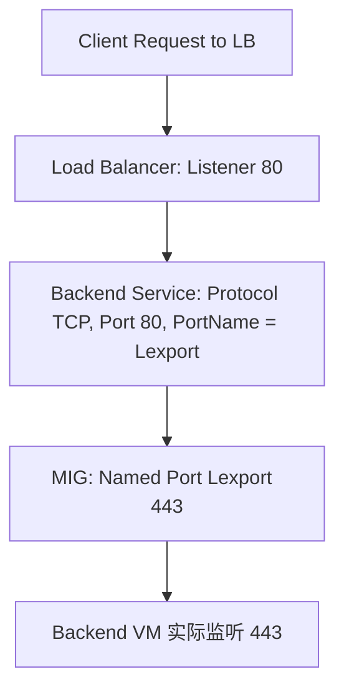
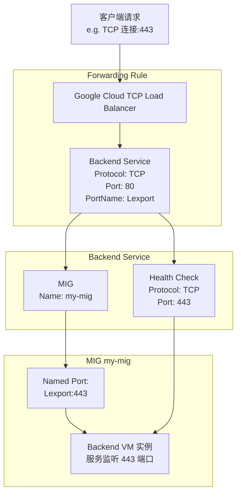

你的疑问非常合理。在 GCP 使用 Load Balancer（尤其是 TCP/SSL LB 或 HTTPS LB + Backend Service）时，端口配置确实容易令人困惑。以下是你提供的信息简化版和分析：

你的配置摘要：
```yaml
Backend Service:

name: my-lb-backend-svc

Protocol: TCP

Port: 80

PortName: Lexport

Health Check:

Type: TCP

Port: 443

MIG:

NamedPorts:

- Name: Lexport

Port: 443
```
🌟 核心疑问解析

为什么 Backend Service 的 Port 是 80，但是 Health Check 和实际服务是 443，并且服务正常？

✅ 理解 GCP Backend Service 的

Port

字段

在 TCP/SSL Load Balancer 中，Backend Service 的端口（或 PortName）并不是直接映射物理端口，而是一个逻辑端口，GCP 会根据你指定的 PortName 去后端 MIG 中查找 Named Port。

🔄 流程解构（结合你的情况）


- Backend Service 的 Port = 80（数值本身无实际用途）

- 因为设置了 PortName = Lexport，GCP 实际是使用此名称去找 MIG 中的 NamedPort。

-
- NamedPort Lexport = 443

- 这告诉 GCP：PortName = Lexport 实际映射到 443。

-
- Health Check 使用端口 443

- Health check 可以单独定义端口，与上面无关。

-
- 实际服务运行在 443

- 所以一切工作正常。

-

⚠️ 注意点

|                         |                                                                 |
| ----------------------- | --------------------------------------------------------------- |
| 项目                    | 描述                                                            |
| Backend Service 的 Port | 可随意指定，只要 PortName 与 MIG 中一致即可                     |
| MIG 的 Named Port       | 必须配置正确，否则流量无法路由到后端服务                        |
| Health Check 端口       | 与 Backend Service 的 Port 无关，它是独立配置的                 |
| Protocol 类型           | TCP 模式下不会像 HTTP(S) 模式那样解析 Host/Path，仅传输 L4 流量 |

✅ 示例命令说明

查看 Backend Service：

gcloud compute backend-services describe my-lb-backend-svc --global

查看 MIG 的 Named Port：

gcloud compute instance-groups list-named-ports --group=my-mig --region=REGION

修改 Named Port：

gcloud compute instance-groups set-named-ports my-mig \

--named-ports=Lexport:443 --region=REGION

📌 小结

- GCP Backend Service 中 port 与实际服务端口不是一一映射关系，真正决定流量转发端口的是 PortName 与 MIG 的 NamedPorts 匹配。
- 如果你改掉 MIG 的 NamedPorts 映射，服务就会中断。
- Health check 是独立定义的，不依赖 PortName/NAMED_PORT。

需要我画出完整的 TCP Load Balancer 架构流程图也可以。你还可以告诉我你 Listener 是不是 HTTPS，然后我可以进一步帮你画出 L7 → L4 → MIG 映射的完整路径图。

好的，以下是结合你描述的 GCP TCP Load Balancer 架构 的完整流程图，包括：

- External TCP LB（或 L7 LB with TCP backend）
- Backend Service
- Health Check
- MIG 与 Named Port 映射
- 后端服务监听端口（443）

✅ Mermaid 架构流程图



🔍 图解说明

|                 |                                                                               |
| --------------- | ----------------------------------------------------------------------------- |
| 模块            | 描述                                                                          |
| 客户端请求      | 发送 TCP 流量（如 tcp://my-service:443）                                      |
| Forwarding Rule | 指定监听端口（如 443），转给 Backend Service                                  |
| Backend Service | 指定 Protocol: TCP，端口为逻辑 Port: 80（无实际意义）关键是 PortName: Lexport |
| MIG             | 配置了 NamedPort: Lexport:443，将逻辑名称映射到端口 443                       |
| Health Check    | 独立于上面，直接探测端口 443，验证后端健康                                    |
| Backend VM      | 实际应用监听 443 端口，处理请求                                               |

✅ 关键配置小结

|                          |               |
| ------------------------ | ------------- |
| 项目                     | 值或备注      |
| Backend Service Protocol | TCP           |
| Backend Service Port     | 任意（如 80） |
| Backend Service PortName | Lexport       |
| MIG NamedPort            | Lexport:443   |
| Health Check             | TCP 443       |
| VM 监听端口              | 443           |

如你还有 HTTPS Listener（例如 L7 入口是 HTTPS，但 Backend 使用 TCP 代理），我也可以再帮你补一个包含 HTTPS 前端的混合架构图。是否需要？
好的，以下是结合你描述的 GCP TCP Load Balancer 架构 的完整流程图，包括：

- External TCP LB（或 L7 LB with TCP backend）
- Backend Service
- Health Check
- MIG 与 Named Port 映射
- 后端服务监听端口（443）

✅ Mermaid 架构流程图
```mermaid
graph TD;

A[客户端请求<br>e.g. TCP 连接:443] --> B[Google Cloud TCP Load Balancer];

subgraph Forwarding Rule (e.g. TCP:443)

B --> C[Backend Service<br>Protocol: TCP<br>Port: 80<br>PortName: Lexport];

end

subgraph Backend Service

C --> D[MIG<br>Name: my-mig];

C --> H[Health Check<br>Protocol: TCP<br>Port: 443];

end

subgraph MIG my-mig

D --> E[Named Port:<br>Lexport:443];

E --> F[Backend VM 实例<br>服务监听 443 端口];

end

H --> F
```

🔍 图解说明

|                 |                                                                               |
| --------------- | ----------------------------------------------------------------------------- |
| 模块            | 描述                                                                          |
| 客户端请求      | 发送 TCP 流量（如 tcp://my-service:443）                                      |
| Forwarding Rule | 指定监听端口（如 443），转给 Backend Service                                  |
| Backend Service | 指定 Protocol: TCP，端口为逻辑 Port: 80（无实际意义）关键是 PortName: Lexport |
| MIG             | 配置了 NamedPort: Lexport:443，将逻辑名称映射到端口 443                       |
| Health Check    | 独立于上面，直接探测端口 443，验证后端健康                                    |
| Backend VM      | 实际应用监听 443 端口，处理请求                                               |

✅ 关键配置小结

|                          |               |
| ------------------------ | ------------- |
| 项目                     | 值或备注      |
| Backend Service Protocol | TCP           |
| Backend Service Port     | 任意（如 80） |
| Backend Service PortName | Lexport       |
| MIG NamedPort            | Lexport:443   |
| Health Check             | TCP 443       |
| VM 监听端口              | 443           |

如你还有 HTTPS Listener（例如 L7 入口是 HTTPS，但 Backend 使用 TCP 代理），我也可以再帮你补一个包含 HTTPS 前端的混合架构图。是否需要？
