# verify-mig-status.sh

## 问题分析

您需要验证 MIG (Managed Instance Group) 刷新/替换后的实例状态，核心需求包括：
1. 通过关键字匹配 MIG
2. 获取实例的详细状态信息
3. 检查实例创建时间、健康状态等关键指标
4. 避免 gcloud 命令参数错误

您遇到的错误是因为 `gcloud compute instances describe` 命令参数格式不正确，region 应该作为独立参数而非 URL。

## 解决方案

```bash
#!/bin/bash

# verify-mig-status.sh - Verify MIG instances status after refresh/replace
# Author: Infrastructure Team
# Version: 1.1 (Optimized - Fixed JQ Parse Error)

# --- Color Definitions ---
RED='\033[0;31m'
GREEN='\033[0;32m'
BLUE='\033[0;34m'
YELLOW='\033[1;33m'
NC='\033[0m' # No Color

# --- Function: Usage ---
show_usage() {
    echo -e "${BLUE}Usage:${NC} $0 <mig-keyword>"
    echo -e "${BLUE}Example:${NC} $0 'web-server'"
    echo ""
    echo -e "${BLUE}Description:${NC}"
    echo "  Verify MIG instances status including creation time, health status, etc."
    exit 1
}

# --- Function: Check prerequisites ---
check_prerequisites() {
    local missing_deps=0
    
    if ! command -v gcloud &> /dev/null; then
        echo -e "${RED}Error: gcloud CLI not found. Please install Google Cloud SDK.${NC}"
        missing_deps=1
    fi
    
    if ! command -v jq &> /dev/null; then
        echo -e "${RED}Error: jq not found. Please install jq (e.g., brew install jq, apt-get install jq).${NC}"
        missing_deps=1
    fi

    if [ $missing_deps -ne 0 ]; then
        exit 1
    fi
}

# --- Function: Get MIG list by keyword ---
get_mig_list() {
    local keyword=$1
    echo -e "${BLUE}Searching for MIGs matching keyword: ${keyword}${NC}"
    echo ""
    
    # Search in all zones
    local migs
    migs=$(gcloud compute instance-groups managed list \
        --format="table[no-heading](name,zone,baseInstanceName,targetSize,INSTANCE_TEMPLATE)" \
        --filter="name:${keyword}" 2>/dev/null)
    
    # Search in all regions (regional MIGs)
    local regional_migs
    regional_migs=$(gcloud compute instance-groups managed list \
        --format="table[no-heading](name,region,baseInstanceName,targetSize,INSTANCE_TEMPLATE)" \
        --filter="name:${keyword}" 2>/dev/null)
    
    if [ -z "$migs" ] && [ -z "$regional_migs" ]; then
        echo -e "${RED}Error: No MIG found matching keyword '${keyword}'${NC}"
        exit 1
    fi
    
    # Output zonal MIGs if found
    if [ -n "$migs" ]; then
        echo "$migs"
    fi
    
    # Output regional MIGs if found
    if [ -n "$regional_migs" ]; then
        echo "$regional_migs"
    fi
}

# --- Function: Get instance details safely ---
get_instance_details() {
    local instance_name=$1
    local zone=$2
    
    if [ -z "$zone" ] || [ -z "$instance_name" ]; then
        echo "ERROR: Missing zone or instance name"
        return 1
    fi

    # Execute command and handle errors
    # Note: Separating 'local' from assignment to capture exit code
    local result
    result=$(gcloud compute instances describe "${instance_name}" --zone="${zone}" --format=json 2>&1)
    local exit_code=$?
    
    if [ $exit_code -ne 0 ]; then
        # Check if it's a 404 (instance might be terminating)
        if [[ "$result" == *"was not found"* ]]; then
             echo "NOT_FOUND"
        else
             echo "ERROR: Failed to describe instance ${instance_name} in zone ${zone}"
        fi
        return 1
    fi
    
    echo "$result"
}

# --- Function: Verify MIG instances ---
verify_mig_instances() {
    local mig_name=$1
    local location=$2
    local location_type=$3
    
    echo -e "${GREEN}================================================${NC}"
    echo -e "${GREEN}Verifying MIG: ${mig_name}${NC}"
    echo -e "${GREEN}Location: ${location} (${location_type})${NC}"
    echo -e "${GREEN}================================================${NC}"
    echo ""
    
    # Get MIG details
    local mig_info
    if [ "$location_type" == "zone" ]; then
        mig_info=$(gcloud compute instance-groups managed describe "${mig_name}" --zone="${location}" --format=json 2>&1)
    else
        mig_info=$(gcloud compute instance-groups managed describe "${mig_name}" --region="${location}" --format=json 2>&1)
    fi
    
    if [ $? -ne 0 ]; then
        echo -e "${RED}Error: Failed to get MIG details${NC}"
        return 1
    fi
    
    local target_size
    target_size=$(echo "$mig_info" | jq -r '.targetSize // 0')
    local current_actions
    current_actions=$(echo "$mig_info" | jq -r '.currentActions // {}')
    local instance_template
    instance_template=$(echo "$mig_info" | jq -r '.instanceTemplate' | awk -F'/' '{print $NF}')
    
    echo -e "${BLUE}MIG Configuration:${NC}"
    echo "  Target Size: ${target_size}"
    echo "  Instance Template: ${instance_template}"
    echo "  Current Actions:"
    echo "$current_actions" | jq '.'
    echo ""
    
    # Get instances list
    local instances
    if [ "$location_type" == "zone" ]; then
        instances=$(gcloud compute instance-groups managed list-instances "${mig_name}" --zone="${location}" --format=json 2>/dev/null)
    else
        instances=$(gcloud compute instance-groups managed list-instances "${mig_name}" --region="${location}" --format=json 2>/dev/null)
    fi
    
    if [ -z "$instances" ] || [ "$instances" == "[]" ]; then
        echo -e "${YELLOW}Warning: No instances found in this MIG${NC}"
        return 0
    fi
    
    local instance_count
    instance_count=$(echo "$instances" | jq '. | length')
    echo -e "${BLUE}Found ${instance_count} instances:${NC}"
    echo ""
    
    # Create summary table header
    printf "%-35s %-15s %-15s %-25s %-30s\n" "INSTANCE_NAME" "ZONE" "STATUS" "CREATION_TIME" "INSTANCE_TEMPLATE"
    printf "%-35s %-15s %-15s %-25s %-30s\n" "-----------------------------------" "---------------" "---------------" "-------------------------" "------------------------------"
    
    # Iterate through instances
    local healthy_count=0
    local unhealthy_count=0
    
    # Correct iteration for Bash JSON array
    for i in $(seq 0 $((instance_count - 1))); do
        local instance_url
        instance_url=$(echo "$instances" | jq -r ".[${i}].instance")
        local instance_name
        instance_name=$(echo "$instance_url" | awk -F'/' '{print $NF}')
        
        # Extract zone from URL: .../zones/us-central1-a/instances/...
        local instance_zone
        instance_zone=$(echo "$instance_url" | sed -n 's/.*\/zones\/\([^\/]*\)\/instances\/.*/\1/p')
        
        local instance_status
        instance_status=$(echo "$instances" | jq -r ".[${i}].instanceStatus")
        local current_action
        current_action=$(echo "$instances" | jq -r ".[${i}].currentAction // \"NONE\"")
        
        # Fetch detailed information
        local instance_details
        instance_details=$(get_instance_details "$instance_name" "$instance_zone")
        
        if [[ "$instance_details" == ERROR* ]] || [[ "$instance_details" == "NOT_FOUND" ]]; then
            printf "%-35s %-15s %-15s %-25s %-30s\n" "$instance_name" "${instance_zone}" "UNKNOWN" "N/A" "N/A"
            ((unhealthy_count++))
            continue
        fi
        
        local creation_time
        creation_time=$(echo "$instance_details" | jq -r '.creationTimestamp // "N/A"')
        local instance_template_from_metadata
        instance_template_from_metadata=$(echo "$instance_details" | jq -r '.metadata.items[] | select(.key=="instance-template") | .value' 2>/dev/null | awk -F'/' '{print $NF}')
        
        # Status color coding
        local status_display="$instance_status"
        if [ "$instance_status" == "RUNNING" ]; then
            status_display="${GREEN}${instance_status}${NC}"
            ((healthy_count++))
        else
            status_display="${RED}${instance_status}${NC}"
            ((unhealthy_count++))
        fi
        
        printf "%-35s %-15s %-24b %-25s %-30s\n" \
            "${instance_name:0:35}" \
            "${instance_zone}" \
            "$status_display" \
            "${creation_time:0:19}" \
            "${instance_template_from_metadata:-N/A}"
        
        # Show current action if any
        if [ "$current_action" != "NONE" ]; then
            echo -e "  ${YELLOW}→ Current Action: ${current_action}${NC}"
        fi
    done
    
    echo ""
    echo -e "${GREEN}================================================${NC}"
    echo -e "${BLUE}Summary:${NC}"
    echo "  Total Instances: ${instance_count}"
    echo -e "  Healthy (RUNNING): ${GREEN}${healthy_count}${NC}"
    echo -e "  Unhealthy/Other: ${RED}${unhealthy_count}${NC}"
    echo -e "${GREEN}================================================${NC}"
    echo ""
}

# --- Main Execution ---
main() {
    # Check arguments
    if [ "$#" -ne 1 ]; then
        echo -e "${RED}Error: Missing MIG keyword argument.${NC}"
        show_usage
    fi
    
    local keyword=$1
    
    # Check prerequisites
    check_prerequisites
    
    # Get MIG list
    local mig_data
    mig_data=$(get_mig_list "$keyword")
    
    # Process each MIG
    while IFS= read -r line; do
        if [ -z "$line" ]; then
            continue
        fi
        
        local mig_name
        mig_name=$(echo "$line" | awk '{print $1}')
        local location
        location=$(echo "$line" | awk '{print $2}')
        
        # Determine if it's zonal or regional
        local location_type="zone"
        if [[ "$location" =~ ^[a-z]+-[a-z]+[0-9]+$ ]]; then
            location_type="region"
        fi
        
        verify_mig_instances "$mig_name" "$location" "$location_type"
    done <<< "$mig_data"
    
    echo -e "${GREEN}Verification completed!${NC}"
}

# Run main function
main "$@"
```

## 使用说明

### 1. 脚本权限设置
```bash
chmod +x verify-mig-status.sh
```

### 2. 执行示例
```bash
# 验证包含 "web-server" 关键字的所有 MIG
./verify-mig-status.sh web-server

# 验证特定 MIG
./verify-mig-status.sh production-backend-mig
```

### 3. 输出示例
```
Searching for MIGs matching keyword: web-server

================================================
Verifying MIG: web-server-mig
Location: asia-east2-a (zone)
================================================

MIG Configuration:
  Target Size: 3
  Instance Template: web-server-template-v2
  Current Actions:
  {
    "creating": 0,
    "deleting": 0,
    "refreshing": 1,
    "replacing": 0
  }

Found 3 instances:

INSTANCE_NAME                            STATUS          CREATION_TIME             INSTANCE_TEMPLATE
---------------------------------------- --------------- ------------------------- ------------------------------
web-server-mig-abc1                      RUNNING         2025-02-01T10:30:00       web-server-template-v2
web-server-mig-abc2                      RUNNING         2025-02-01T10:28:00       web-server-template-v2
web-server-mig-abc3                      RUNNING         2025-01-30T15:20:00       web-server-template-v1
  → Current Action: REFRESHING

================================================
Summary:
  Total Instances: 3
  Healthy (RUNNING): 3
  Unhealthy/Other: 0
================================================
```

## 流程图

```mermaid
graph TD
    A[开始执行脚本] --> B[检查参数和 gcloud CLI]
    B --> C{参数验证}
    C -->|失败| D[显示使用说明并退出]
    C -->|成功| E[搜索匹配的 MIG]
    
    E --> F{找到 MIG?}
    F -->|否| G[报错并退出]
    F -->|是| H[遍历每个 MIG]
    
    H --> I[获取 MIG 配置信息]
    I --> J[显示 Target Size 和 Template]
    J --> K[获取实例列表]
    
    K --> L{有实例?}
    L -->|否| M[显示警告]
    L -->|是| N[遍历每个实例]
    
    N --> O[确定实例所在 Zone]
    O --> P[执行 gcloud describe]
    P --> Q{命令成功?}
    
    Q -->|否| R[标记为 UNKNOWN]
    Q -->|是| S[提取创建时间和状态]
    
    R --> T[显示实例信息]
    S --> T
    T --> U{还有实例?}
    
    U -->|是| N
    U -->|否| V[统计健康/不健康数量]
    V --> W[显示汇总信息]
    
    W --> X{还有 MIG?}
    X -->|是| H
    X -->|否| Y[完成验证]
```



## 关键特性

### 1. 错误处理
- ✅ 避免了 `--region=https://...` 格式错误
- ✅ 正确使用 `--zone=` 和 `--region=` 参数
- ✅ 对区域性 MIG 自动查找实例实际所在 zone

### 2. 信息展示
- 📊 MIG 配置信息(目标大小、模板等)
- 📊 当前操作状态(创建、删除、刷新、替换)
- 📊 每个实例的详细状态
- 📊 创建时间(用于判断是否为新实例)
- 📊 使用的实例模板版本

### 3. 状态验证
- ✅ 检查实例是否 RUNNING
- ✅ 验证创建时间是否更新
- ✅ 确认使用的模板版本
- ✅ 统计健康/不健康实例数

## 注意事项

### ⚠️ 权限要求
```bash
# 需要以下 IAM 权限
- compute.instances.get
- compute.instances.list
- compute.instanceGroups.get
- compute.instanceGroupManagers.get
- compute.instanceGroupManagers.list
```

### ⚠️ 区域性 MIG
对于区域性 MIG,脚本会自动:
1. 先识别为 regional MIG
2. 查找实例实际所在的 zone
3. 使用正确的 zone 参数获取详情

### ⚠️ 刷新验证建议
```bash
# 刷新前记录状态
./verify-mig-status.sh web-server > before_refresh.txt

# 执行刷新
gcloud compute instance-groups managed rolling-action replace \
    web-server-mig --zone=asia-east2-a

# 等待刷新完成后验证
./verify-mig-status.sh web-server > after_refresh.txt

# 对比差异
diff before_refresh.txt after_refresh.txt
```

### ⚠️ 性能考虑
- 对于大型 MIG(100+ 实例),脚本执行可能需要较长时间
- 每个实例都会调用 `gcloud compute instances describe`
- 建议在低峰期执行或考虑并行化优化

## 扩展功能建议

如需更多功能,可以添加:
1. JSON 格式输出支持
2. 健康检查状态验证
3. 自动重试失败的实例查询
4. 导出到 CSV 格式
5. 与预期状态对比


# Chatgpt 

```bash
#!/bin/bash
#
# verify-mig-status.sh
# Verify MIG instances status after refresh / rolling replace
#
# Author: Infrastructure Team
# Version: 1.1 (Optimized)
#

set -euo pipefail
IFS=$'\n\t'

# --- Color Definitions ---
RED='\033[0;31m'
GREEN='\033[0;32m'
BLUE='\033[0;34m'
YELLOW='\033[1;33m'
NC='\033[0m'

# --- Usage ---
show_usage() {
    echo -e "${BLUE}Usage:${NC} $0 <mig-keyword>"
    echo -e "${BLUE}Example:${NC} $0 web-server"
    echo ""
    echo "Verify Managed Instance Group status:"
    echo "  - Instance RUNNING state"
    echo "  - Creation time"
    echo "  - Instance template"
    echo "  - Current rolling actions"
    exit 1
}

# --- Dependency Checks ---
check_gcloud() {
    if ! command -v gcloud &>/dev/null; then
        echo -e "${RED}Error: gcloud CLI not found.${NC}"
        exit 1
    fi
}

check_jq() {
    if ! command -v jq &>/dev/null; then
        echo -e "${RED}Error: jq not found. Please install jq.${NC}"
        exit 1
    fi
}

# --- Get MIG List ---
get_mig_list() {
    local keyword="$1"

    echo -e "${BLUE}Searching MIGs matching keyword: ${keyword}${NC}"
    echo ""

    gcloud compute instance-groups managed list \
        --filter="name:${keyword}" \
        --format="table[no-heading](name,zone,region)"
}

# --- Get Instance Details ---
get_instance_details() {
    local instance_name="$1"
    local zone="$2"

    gcloud compute instances describe "$instance_name" \
        --zone="$zone" \
        --format=json
}

# --- Verify MIG ---
verify_mig_instances() {
    local mig_name="$1"
    local location="$2"
    local location_type="$3"

    echo -e "${GREEN}================================================${NC}"
    echo -e "${GREEN}Verifying MIG: ${mig_name}${NC}"
    echo -e "${GREEN}Location: ${location} (${location_type})${NC}"
    echo -e "${GREEN}================================================${NC}"
    echo ""

    # --- MIG Describe ---
    if [ "$location_type" == "zone" ]; then
        mig_info=$(gcloud compute instance-groups managed describe "$mig_name" \
            --zone="$location" --format=json)
    else
        mig_info=$(gcloud compute instance-groups managed describe "$mig_name" \
            --region="$location" --format=json)
    fi

    target_size=$(echo "$mig_info" | jq -r '.targetSize')
    instance_template=$(echo "$mig_info" | jq -r '.instanceTemplate | split("/")[-1]')
    current_actions=$(echo "$mig_info" | jq '.currentActions')

    echo -e "${BLUE}MIG Configuration:${NC}"
    echo "  Target Size: ${target_size}"
    echo "  Instance Template: ${instance_template}"
    echo "  Current Actions:"
    echo "$current_actions" | jq '.'
    echo ""

    # --- List Instances ---
    if [ "$location_type" == "zone" ]; then
        instances=$(gcloud compute instance-groups managed list-instances "$mig_name" \
            --zone="$location" --format=json)
    else
        instances=$(gcloud compute instance-groups managed list-instances "$mig_name" \
            --region="$location" --format=json)
    fi

    instance_count=$(echo "$instances" | jq 'length')

    if [ "$instance_count" -eq 0 ]; then
        echo -e "${YELLOW}No instances found in this MIG.${NC}"
        return
    fi

    echo -e "${BLUE}Found ${instance_count} instances:${NC}"
    echo ""

    printf "%-40s %-15s %-20s %-30s\n" \
        "INSTANCE_NAME" "STATUS" "CREATED_AT" "INSTANCE_TEMPLATE"
    printf "%-40s %-15s %-20s %-30s\n" \
        "----------------------------------------" \
        "---------------" \
        "--------------------" \
        "------------------------------"

    healthy=0
    unhealthy=0

    for ((i=0; i<instance_count; i++)); do
        instance_url=$(echo "$instances" | jq -r ".[$i].instance")
        instance_name=$(basename "$instance_url")
        instance_status=$(echo "$instances" | jq -r ".[$i].instanceStatus")
        current_action=$(echo "$instances" | jq -r ".[$i].currentAction // \"NONE\"")

        # Extract zone directly from instance URL
        zone=$(echo "$instance_url" | awk -F'/' '{print $(NF-1)}')

        instance_details=$(get_instance_details "$instance_name" "$zone")

        creation_time=$(echo "$instance_details" | jq -r '.creationTimestamp')
        creation_time_fmt=$(date -d "$creation_time" '+%Y-%m-%d %H:%M:%S' 2>/dev/null || echo "N/A")

        template_from_meta=$(echo "$instance_details" \
            | jq -r '.metadata.items[]? | select(.key=="instance-template") | .value' \
            | awk -F'/' '{print $NF}')

        if [[ "$instance_status" == "RUNNING" && "$current_action" == "NONE" ]]; then
            status_display="${GREEN}${instance_status}${NC}"
            ((healthy++))
        else
            status_display="${RED}${instance_status}${NC}"
            ((unhealthy++))
        fi

        printf "%-40s %-15b %-20s %-30s\n" \
            "$instance_name" \
            "$status_display" \
            "$creation_time_fmt" \
            "${template_from_meta:-N/A}"

        if [ "$current_action" != "NONE" ]; then
            echo -e "  ${YELLOW}→ Current Action: ${current_action}${NC}"
        fi
    done

    echo ""
    echo -e "${BLUE}Summary:${NC}"
    echo "  Total Instances : ${instance_count}"
    echo -e "  Healthy         : ${GREEN}${healthy}${NC}"
    echo -e "  Unhealthy/Other : ${RED}${unhealthy}${NC}"
    echo -e "${GREEN}================================================${NC}"
    echo ""
}

# --- Main ---
main() {
    if [ "$#" -ne 1 ]; then
        show_usage
    fi

    check_gcloud
    check_jq

    migs=$(get_mig_list "$1")

    if [ -z "$migs" ]; then
        echo -e "${RED}No MIG found matching keyword.${NC}"
        exit 1
    fi

    while read -r mig_name zone region; do
        if [ -n "$zone" ]; then
            verify_mig_instances "$mig_name" "$zone" "zone"
        else
            verify_mig_instances "$mig_name" "$region" "region"
        fi
    done <<< "$migs"

    echo -e "${GREEN}Verification completed.${NC}"
}

main "$@"
```

# Gemini 
- this script is better than the one above ? it's owned by Gemini
```bash
#!/bin/bash

# verify-mig-status.sh - Verify MIG instances status after refresh/replace
# Author: Infrastructure Team
# Version: 1.1 (Optimized)

# --- Color Definitions ---
RED='\033[0;31m'
GREEN='\033[0;32m'
BLUE='\033[0;34m'
YELLOW='\033[1;33m'
NC='\033[0m' # No Color

# --- Function: Usage ---
show_usage() {
    echo -e "${BLUE}Usage:${NC} $0 <mig-keyword>"
    echo -e "${BLUE}Example:${NC} $0 'web-server'"
    echo ""
    echo -e "${BLUE}Description:${NC}"
    echo "  Verify MIG instances status including creation time, health status, etc."
    exit 1
}

# --- Function: Check prerequisites ---
check_prerequisites() {
    local missing_deps=0
    
    if ! command -v gcloud &> /dev/null; then
        echo -e "${RED}Error: gcloud CLI not found. Please install Google Cloud SDK.${NC}"
        missing_deps=1
    fi
    
    if ! command -v jq &> /dev/null; then
        echo -e "${RED}Error: jq not found. Please install jq (e.g., brew install jq, apt-get install jq).${NC}"
        missing_deps=1
    fi

    if [ $missing_deps -ne 0 ]; then
        exit 1
    fi
}

# --- Function: Get MIG list by keyword ---
get_mig_list() {
    local keyword=$1
    echo -e "${BLUE}Searching for MIGs matching keyword: ${keyword}${NC}"
    echo ""
    
    # Search in all zones
    local migs=$(gcloud compute instance-groups managed list \
        --format=\"table[no-heading](name,zone,baseInstanceName,targetSize,INSTANCE_TEMPLATE)\" \
        --filter=\"name:${keyword}\" 2>/dev/null)
    
    # Search in all regions (regional MIGs)
    local regional_migs=$(gcloud compute instance-groups managed list \
        --format=\"table[no-heading](name,region,baseInstanceName,targetSize,INSTANCE_TEMPLATE)\" \
        --filter=\"name:${keyword}\" 2>/dev/null)
    
    if [ -z "$migs" ] && [ -z "$regional_migs" ]; then
        echo -e "${RED}Error: No MIG found matching keyword '${keyword}'${NC}"
        exit 1
    fi
    
    # Output zonal MIGs if found
    if [ -n "$migs" ]; then
        echo "$migs"
    fi
    
    # Output regional MIGs if found
    if [ -n "$regional_migs" ]; then
        echo "$regional_migs"
    fi
}

# --- Function: Get instance details safely ---
get_instance_details() {
    local instance_name=$1
    local zone=$2
    
    if [ -z "$zone" ] || [ -z "$instance_name" ]; then
        echo "ERROR: Missing zone or instance name"
        return 1
    fi

    # Execute command and handle errors
    local cmd="gcloud compute instances describe ${instance_name} --zone=${zone} --format=json"
    local result=$(eval $cmd 2>&1)
    
    if [ $? -ne 0 ]; then
        # Check if it's a 404 (instance might be terminating)
        if [[ "$result" == *"was not found"* ]]; then
             echo "NOT_FOUND"
        else
             echo "ERROR: Failed to describe instance ${instance_name} in zone ${zone}"
        fi
        return 1
    fi
    
    echo "$result"
}

# --- Function: Verify MIG instances ---
verify_mig_instances() {
    local mig_name=$1
    local location=$2
    local location_type=$3
    
    echo -e "${GREEN}================================================${NC}"
    echo -e "${GREEN}Verifying MIG: ${mig_name}${NC}"
    echo -e "${GREEN}Location: ${location} (${location_type})${NC}"
    echo -e "${GREEN}================================================${NC}"
    echo ""
    
    # Get MIG details
    local mig_cmd=""
    if [ "$location_type" == "zone" ]; then
        mig_cmd="gcloud compute instance-groups managed describe ${mig_name} --zone=${location} --format=json"
    else
        mig_cmd="gcloud compute instance-groups managed describe ${mig_name} --region=${location} --format=json"
    fi
    
    local mig_info=$(eval $mig_cmd 2>&1)
    if [ $? -ne 0 ]; then
        echo -e "${RED}Error: Failed to get MIG details${NC}"
        return 1
    fi
    
    local target_size=$(echo "$mig_info" | jq -r '.targetSize // 0')
    local current_actions=$(echo "$mig_info" | jq -r '.currentActions // {}')
    local instance_template=$(echo "$mig_info" | jq -r '.instanceTemplate' | awk -F'/' '{print $NF}')
    
    echo -e "${BLUE}MIG Configuration:${NC}"
    echo "  Target Size: ${target_size}"
    echo "  Instance Template: ${instance_template}"
    echo "  Current Actions:"
    echo "$current_actions" | jq '.'
    echo ""
    
    # Get instances list
    local instances_cmd=""
    if [ "$location_type" == "zone" ]; then
        instances_cmd="gcloud compute instance-groups managed list-instances ${mig_name} --zone=${location} --format=json"
    else
        instances_cmd="gcloud compute instance-groups managed list-instances ${mig_name} --region=${location} --format=json"
    fi
    
    local instances=$(eval $instances_cmd 2>/dev/null)
    if [ -z "$instances" ] || [ "$instances" == "[]" ]; then
        echo -e "${YELLOW}Warning: No instances found in this MIG${NC}"
        return 0
    fi
    
    local instance_count=$(echo "$instances" | jq '. | length')
    echo -e "${BLUE}Found ${instance_count} instances:${NC}"
    echo ""
    
    # Create summary table header
    printf "% -35s % -15s % -15s % -25s % -30s\n" "INSTANCE_NAME" "ZONE" "STATUS" "CREATION_TIME" "INSTANCE_TEMPLATE"
    printf "% -35s % -15s % -15s % -25s % -30s\n" "-----------------------------------" "--------------- " "--------------- " "-------------------------" "------------------------------"
    
    # Iterate through instances
    local healthy_count=0
    local unhealthy_count=0
    
    for i in $(seq 0 $((instance_count - 1))); do
        local instance_url=$(echo "$instances" | jq -r ".[${i}].instance")
        local instance_name=$(echo "$instance_url" | awk -F'/' '{print $NF}')
        
        # Extract zone from URL: .../zones/us-central1-a/instances/...
        local instance_zone=$(echo "$instance_url" | sed -n 's/.*\/zones\/\([^\/]*\)\/instances\/.*/\1/p')
        
        local instance_status=$(echo "$instances" | jq -r ".[${i}].instanceStatus")
        local current_action=$(echo "$instances" | jq -r ".[${i}].currentAction // \"NONE\"")
        
        # Optimization: Pass extracted zone directly
        local instance_details=$(get_instance_details "$instance_name" "$instance_zone")
        
        if [[ "$instance_details" == ERROR* ]] || [[ "$instance_details" == "NOT_FOUND" ]]; then
            printf "% -35s % -15s % -15s % -25s % -30s\n" "$instance_name" "${instance_zone}" "UNKNOWN" "N/A" "N/A"
            ((unhealthy_count++))
            continue
        fi
        
        local creation_time=$(echo "$instance_details" | jq -r '.creationTimestamp // "N/A"')
        local instance_template_from_metadata=$(echo "$instance_details" | jq -r '.metadata.items[] | select(.key=="instance-template") | .value' 2>/dev/null | awk -F'/' '{print $NF}')
        
        # Status color coding
        local status_display="$instance_status"
        if [ "$instance_status" == "RUNNING" ]; then
            status_display="${GREEN}${instance_status}${NC}"
            ((healthy_count++))
        else
            status_display="${RED}${instance_status}${NC}"
            ((unhealthy_count++))
        fi
        
        printf "% -35s % -15s % -24b % -25s % -30s\n" \
            "${instance_name:0:35}" \
            "${instance_zone}" \
            "$status_display" \
            "${creation_time:0:19}" \
            "${instance_template_from_metadata:-N/A}"
        
        # Show current action if any
        if [ "$current_action" != "NONE" ]; then
            echo -e "  ${YELLOW}→ Current Action: ${current_action}${NC}"
        fi
    done
    
    echo ""
    echo -e "${GREEN}================================================${NC}"
    echo -e "${BLUE}Summary:${NC}"
    echo "  Total Instances: ${instance_count}"
    echo -e "  Healthy (RUNNING): ${GREEN}${healthy_count}${NC}"
    echo -e "  Unhealthy/Other: ${RED}${unhealthy_count}${NC}"
    echo -e "${GREEN}================================================${NC}"
    echo ""
}

# --- Main Execution ---
main() {
    # Check arguments
    if [ "$#" -ne 1 ]; then
        echo -e "${RED}Error: Missing MIG keyword argument.${NC}"
        show_usage
    fi
    
    local keyword=$1
    
    # Check prerequisites
    check_prerequisites
    
    # Get MIG list
    local mig_data=$(get_mig_list "$keyword")
    
    # Process each MIG
    # Use while loop with input redirection to handle multiple lines correctly
    while IFS= read -r line; do
        if [ -z "$line" ]; then
            continue
        fi
        
        local mig_name=$(echo "$line" | awk '{print $1}')
        local location=$(echo "$line" | awk '{print $2}')
        
        # Determine if it's zonal or regional
        local location_type="zone"
        if [[ "$location" =~ ^[a-z]+-[a-z]+[0-9]+$ ]]; then
            location_type="region"
        fi
        
        verify_mig_instances "$mig_name" "$location" "$location_type"
    done <<< "$mig_data"
    
    echo -e "${GREEN}Verification completed!${NC}"
}

# Run main function
main "$@"
```
