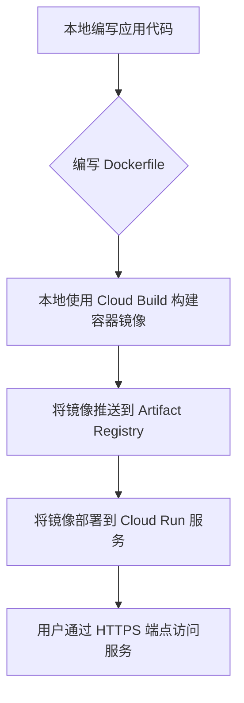

# Google Cloud Run 快速入门

Google Cloud Run 是一个全托管的计算平台，可让您运行通过 HTTP 请求或 Pub/Sub 事件调用的无状态容器。它构建于 Knative 之上，让您可以在完全无服务器的环境中运行代码，无需担心底层基础设施的管理。Cloud Run 会根据流量自动扩缩，甚至可以缩减到零，这意味着在没有流量时，您无需支付任何费用。

## 核心优势

- **完全托管**：无需管理服务器或集群。
- **自动扩缩**：根据请求量自动增加或减少容器实例，包括缩减到零。
- **按需付费**：仅为您使用的计算资源（CPU、内存）付费，精确到 100 毫秒。
- **支持任何语言/库**：只要您可以将应用打包到容器中，就可以在 Cloud Run 上运行。
- **集成 Google Cloud 生态**：与 Cloud Build、Artifact Registry、Cloud Logging、Cloud Monitoring 等无缝集成。

## 1. 启用 API

在开始使用 Cloud Run 之前，您需要在您的 GCP 项目中启用相关的 API。最重要的一个是 Cloud Run Admin API。通常，您还需要 Artifact Registry API（用于存储容器镜像）和 Cloud Build API（用于构建容器）。

您可以使用 `gcloud` 命令行工具来启用它们：

```bash
# 启用 Cloud Run API
gcloud services enable run.googleapis.com

# 启用 Artifact Registry API 用于存储容器镜像
gcloud services enable artifactregistry.googleapis.com

# 启用 Cloud Build API 用于构建容器
gcloud services enable cloudbuild.googleapis.com
```

## 2. 核心概念

### 服务 (Service)
服务是 Cloud Run 最常见的资源。它提供一个唯一的 HTTPS 端点，用于持续运行您的容器以处理传入的 HTTP 请求。每个服务都有一个稳定的 URL。当您更新服务时，Cloud Run 会创建一个新的**修订 (Revision)**，并可以将流量逐渐迁移到新版本。

### 修订 (Revision)
修订是服务的一次不可变的快照，包含了特定的容器镜像和配置（如环境变量、内存限制等）。每次部署都会创建一个新的修订。您可以保留旧的修订，并根据需要将流量路由到特定的修订，这对于金丝雀部署或回滚非常有用。

### 作业 (Job)
与持续运行以处理请求的服务不同，作业用于执行会运行至完成的任务，然后停止。例如，处理一个大型数据文件、发送一批电子邮件或执行数据库迁移。每个作业执行一次都会创建一个或多个任务实例。

## 3. 典型部署流程

以下下是一个典型的从本地代码到 Cloud Run 服务的部署流程：



## 4. 基础使用示例

以下是一个简单的 Python Flask 应用示例。

**1. 应用代码 (`main.py`)**

```python
import os
from flask import Flask

app = Flask(__name__)

@app.route('/')
def hello_world():
    name = os.environ.get('NAME', 'World')
    return f'Hello, {name}!'

if __name__ == "__main__":
    app.run(debug=True, host='0.0.0.0', port=int(os.environ.get('PORT', 8080)))
```

**2. Dockerfile**

```dockerfile
# 使用官方 Python 基础镜像
FROM python:3.9-slim

# 设置工作目录
WORKDIR /app

# 复制依赖文件并安装
COPY requirements.txt requirements.txt
RUN pip install --no-cache-dir -r requirements.txt

# 复制应用代码
COPY . .

# 设置容器监听的端口
ENV PORT 8080

# 启动应用的命令
CMD ["gunicorn", "--bind", "0.0.0.0:8080", "main:app"]
```

**3. 依赖文件 (`requirements.txt`)**

```
Flask
gunicorn
```

**4. 部署步骤**

假设您的 GCP 项目 ID 是 `my-gcp-project`，并且您在 `asia-east1` 区域部署。

```bash
# 1. 提交到 Cloud Build 进行构建和推送
# 这会将当前目录下的代码打包，根据 Dockerfile 构建，并推送到 Artifact Registry
gcloud builds submit --tag asia-east1-docker.pkg.dev/my-gcp-project/my-repo/hello-service

# 2. 部署到 Cloud Run
# --allow-unauthenticated 允许公共访问
gcloud run deploy hello-service \
  --image asia-east1-docker.pkg.dev/my-gcp-project/my-repo/hello-service \
  --platform managed \
  --region asia-east1 \
  --allow-unauthenticated
```

部署成功后，`gcloud` 会返回一个服务 URL，您可以直接在浏览器中访问。

## 5. 常用 `gcloud` 管理命令

以下是一些管理 Cloud Run 资源的常用命令。

### 服务管理

- **部署或更新服务**：
  `gcloud run deploy [SERVICE_NAME] --image [IMAGE_URL] ...`
- **列出所有服务**：
  `gcloud run services list`
- **描述服务详情**：
  `gcloud run services describe [SERVICE_NAME]`
- **删除服务**：
  `gcloud run services delete [SERVICE_NAME]`
- **设置 IAM 策略（谁可以调用）**：
  `gcloud run services set-iam-policy [SERVICE_NAME] policy.json`
- **更新流量分配**：
  `gcloud run services update-traffic [SERVICE_NAME] --to-revisions=[REVISION_NAME]=100`

### 作业管理

- **执行一个作业**：
  `gcloud run jobs execute [JOB_NAME]`
- **创建或更新作业**：
  `gcloud run jobs create [JOB_NAME] --image [IMAGE_URL] ...`
- **列出所有作业**：
  `gcloud run jobs list`
- **描述作业详情**：
  `gcloud run jobs describe [JOB_NAME]`
- **删除作业**：
  `gcloud run jobs delete [JOB_NAME]`

## 6. 关键特性简述

### 自动扩缩 (Autoscaling)

- **并发 (Concurrency)**：每个容器实例可以同时处理的请求数。默认是 80。如果所有实例都达到并发上限，Cloud Run 会启动新实例。
- **最小/最大实例数 (Min/Max Instances)**：
  - `min-instances`：设置保持温启动的最小实例数，以减少冷启动延迟。
  - `max-instances`：设置实例数的上限，以控制成本。

### 网络 (Networking)

- **Ingress（入口流量）**：控制谁可以访问您的服务。
  - `all`：来自互联网的公共流量。
  - `internal`：仅限来自同一项目或 VPC-SC 边界内的 VPC 网络的流量。
  - `internal-and-cloud-load-balancing`：内部流量和通过外部应用负载均衡器传入的流量。
- **Egress（出口流量）**：控制服务发出的流量。默认情况下，出口流量会通过不固定的 IP 地址访问外部网络。如需固定出口 IP 或访问 VPC 内的资源，需要配置 **VPC Connector**。

### 安全与身份验证

- **调用者身份验证**：默认情况下，服务是私有的，需要经过身份验证的 IAM 主体（用户、服务账号）才能调用。使用 `--allow-unauthenticated` 标志可以公开服务。
- **服务身份**：每个 Cloud Run 服务/作业在运行时都有一个关联的服务账号，用于访问其他 GCP 服务（如 Cloud Storage、BigQuery）。默认使用计算引擎默认服务账号，但强烈建议为其创建专用的服务账号并授予最小权限。
- **Secret 管理**：可以通过与 Secret Manager 集成，安全地将密钥作为环境变量或文件挂载到您的服务中。
