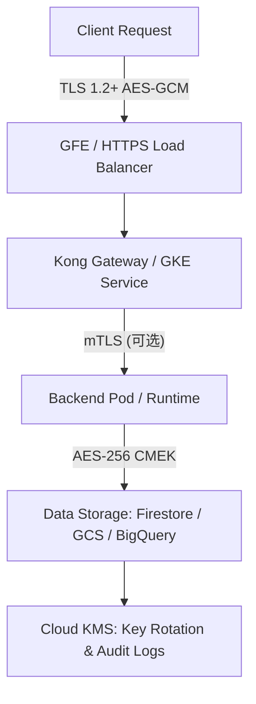

```bash
我们是平台用户，现在提交了这样一个问题 Thanks for your checking. but may I get more details about the encryption. below is our Power Platform encryption answer for the same questions for your reference.

Microsoft Power Platform provides customer managed encryption key (CMK) feature. Refer to: CMKv2 All keys are created by company Crypto team with expiration date in 2 years, meaning the encryption key will be rotated every 2 years.

All data is encrypted by default in transit and at rest.

Data in transit uses TLS 1.2 or higher and cipher modes in use is GCM.

Encryption is carried out using cryptographically secure algorithms.

Encryption is compliant with FIPS-140-2 standard. 理解是让我们提供 一些关于安全方面的 或者是加密方面的一些 需求提供 那么对于这GCP工程来说 有哪些方面和上面的东西是匹配的？ 或者是实现的方案是什么？
```
非常好的问题 👍。你理解得对 —— 对方是希望你提供 在 GCP 平台上关于数据加密（Encryption）和安全机制（Security） 的实现说明，以便和他们的 Power Platform 的安全实践（如 CMK、FIPS、TLS、加密算法等）进行对比。

下面是针对你们 GCP 工程平台（涉及 GKE / GCE / BigQuery / Firestore / Buckets / Artifact Registry 等组件） 的加密与安全匹配说明，可直接用于对外答复或安全问卷。

🔐 GCP 平台数据加密与安全机制说明

1. Encryption at Rest（静态数据加密）

|              |                                                                                                                        |
| ------------ | ---------------------------------------------------------------------------------------------------------------------- |
| 机制           | 说明                                                                                                                     |
| 默认加密         | 所有数据在写入 GCP 存储系统时均会自动加密，包括 Compute Engine 磁盘、GKE 持久卷（Persistent Disks）、Cloud Storage、BigQuery、Firestore 等。             |
| 加密算法         | 使用 AES-256 或 AES-128-GCM 算法，由 Google 管理的加密密钥（Google-managed key）保护。                                                    |
| 用户托管密钥（CMEK） | 可启用 Customer Managed Encryption Key (CMEK)，允许用户使用自定义的 KMS 密钥加密资源。密钥可通过 Cloud Key Management Service (Cloud KMS) 创建和轮换。 |
| 客户端托管密钥（CMK） | 支持 Customer Supplied Encryption Key (CSEK)，即用户自行生成并管理密钥，仅在创建资源时提供给 GCP。                                                |
| 密钥轮换         | Cloud KMS 支持 自动密钥轮换（Automatic Key Rotation），可自定义轮换周期（如每 2 年一次，与 Power Platform 一致）。                                    |

2. Encryption in Transit（传输中加密）

|         |                                                                                            |
| ------- | ------------------------------------------------------------------------------------------ |
| 通信类型    | 加密机制                                                                                       |
| 外部客户端访问 | 所有外部访问（例如 HTTPS / API 请求）均强制使用 TLS 1.2 或更高版本。                                              |
| 内部服务通信  | GCP 内部流量（如 GKE Pod 间通信、GCE <-> Storage、Kong <-> Runtime）默认通过 Google Front End (GFE) 层实现加密。 |
| 加密算法    | 使用 AES-GCM 模式的 TLS Cipher Suites，例如 TLS_ECDHE_RSA_WITH_AES_256_GCM_SHA384。                 |
| 自定义证书   | 可使用 Google Certificate Manager 或 Secret Manager 托管自签名证书、CA 签发证书，以及配置 双向 TLS (mTLS) 验证。     |

3. FIPS 140-2 合规性

|              |                                                                                                                                                                             |
| ------------ | --------------------------------------------------------------------------------------------------------------------------------------------------------------------------- |
| 项目         | 支持情况                                                                                                                                                                    |
| GCP 加密模块 | Google Cloud 所使用的加密模块经过 FIPS 140-2 验证，详情见 [Google Cloud Cryptographic Module Validation Program](https://cloud.google.com/security/compliance/fips-140-2)。 |
| Cloud KMS    | Cloud KMS 使用的加密模块同样 通过 FIPS 140-2 验证，可在合规模式下启用（FIPS 140-2 compliant mode）。                                                                        |
| Compute/GKE  | GCE、GKE 等基础设施层使用的加密算法及 TLS 协议均符合 FIPS 140-2 标准。                                                                                                      |

4. Key Management（密钥管理）

|        |                                                        |
| ------ | ------------------------------------------------------ |
| 功能     | 实现                                                     |
| 密钥存储   | 使用 Cloud KMS 存储对称或非对称密钥。                               |
| 密钥访问控制 | 基于 IAM 权限模型，仅授权用户可访问密钥。                                |
| 密钥轮换   | 可设定轮换周期（如 2 年），并支持版本化管理（key versioning）。               |
| 密钥审计   | 所有密钥操作（创建、使用、删除、轮换）会记录在 Cloud Audit Logs 中，可对访问行为进行审计。 |

5. 整体加密策略对照表

|                            |                                        |                                   |
| -------------------------- | -------------------------------------- | --------------------------------- |
| Power Platform 机制        | GCP 对应机制                           | 说明                              |
| Customer Managed Key (CMK) | CMEK (Customer Managed Encryption Key) | 由用户在 Cloud KMS 创建并管理密钥 |
| Key rotation every 2 years | 可配置轮换周期（如 2 年）              | 支持自动密钥轮换                  |
| Data encrypted by default  | 默认静态加密（AES-256）                | 所有数据存储自动加密              |
| TLS 1.2+ with GCM          | TLS 1.2+ AES-GCM Cipher                | 默认使用强加密套件                |
| FIPS-140-2 compliance      | GCP 全面符合 FIPS 140-2                | KMS、TLS 模块均通过认证           |

6. 可选增强方案（Recommended Enhancements）

- 若涉及高敏感业务，可：  


1. 使用 CMEK + 自动轮换策略；
2. 在 GKE 中启用 mTLS + FIPS-compliant node image；
3. 使用 VPC Service Controls 限制跨边界访问；
4. 对外通信通过 Cloud Armor + HTTPS Load Balancer 实现安全访问控制。

-

7.

整体流程示意



✅

总结

你的 GCP 平台在安全与加密方面 完全可以与 Microsoft Power Platform 对齐甚至更高：

- 默认支持 加密 at rest + in transit
- 支持 CMEK/CMK、自动轮换、FIPS-140-2
- TLS 强制 1.2+ / AES-GCM
- 密钥可由客户完全控制并可审计

是否希望我帮你整理成一份 英文版安全说明模板（适合回复客户问卷或安全评估邮件）？

我可以直接生成一份结构化的答复文档（含表格 + 段落 + 官方参考链接），可直接发送给对方。


# Gemini
好的，完全理解您的需求。客户提供了一个基于微软 Power Platform 的安全和加密实践作为参考，希望了解你们基于 GCP 的工程是如何满足类似要求的。这是一个非常常见的安全尽职调查问题。

GCP 在安全和加密方面做得非常出色，其默认配置和可选功能完全可以匹配甚至超越客户提供的参考标准。

下面我将逐点分析客户提供的参考，并给出 GCP 中对应的实现方案和说明。最后，我会为您整理一个可以直接提供给客户的、格式化的回答模板。

---

### **逐点分析与 GCP 的匹配方案**

#### **1. 客户参考点：Customer Managed Encryption Key (CMK)**
*   **微软方案**: `Microsoft Power Platform provides customer managed encryption key (CMK) feature. Refer to: CMKv2 All keys are created by company Crypto team with expiration date in 2 years...`
*   **GCP 对应方案**: **Cloud Key Management Service (Cloud KMS)**

    *   **是什么？** Cloud KMS 是 GCP 提供的集中式云密钥管理服务。它允许您创建、导入、管理和使用加密密钥。这正是微软 CMK 的直接对应方案。
    *   **如何实现？**
        1.  **密钥创建**: 您的团队（等同于参考中的 "Crypto team"）可以在 GCP 的 Cloud KMS 中创建一个或多个“密钥环 (Key Ring)”和“密钥 (CryptoKey)”。这些密钥由您完全控制。
        2.  **服务集成**: GCP 的主流服务（如 Cloud Storage, BigQuery, Compute Engine, Cloud SQL 等）都与 Cloud KMS 深度集成。在创建资源（例如一个存储桶或数据库）时，您可以选择“客户管理的加密密钥 (CMK)”，并指定您在 Cloud KMS 中创建的密钥。
        3.  **控制权**: 使用 CMK 后，加密数据所用的“数据加密密钥 (DEK)” 会被您的 CMK（即“密钥加密密钥 (KEK)”）再次加密。Google 无法在未经您授权（即调用您的密钥）的情况下解密数据。如果您禁用或销毁密钥，相关数据将永久无法访问。

#### **2. 客户参考点：密钥轮换 (Key Rotation)**
*   **微软方案**: `...the encryption key will be rotated every 2 years.`
*   **GCP 对应方案**: **Cloud KMS 自动密钥轮换**

    *   **是什么？** Cloud KMS 提供了内置的自动密钥轮换功能。
    *   **如何实现？**
        1.  **设置策略**: 在 Cloud KMS 中创建密钥时，您可以设置一个自动轮换周期，例如 730 天（2年）。
        2.  **无缝轮换**: 到达指定时间后，Cloud KMS 会自动生成一个新的“密钥版本”并将其设为主要版本。
        3.  **工作原理**:
            *   所有**新数据**将使用新的密钥版本进行加密。
            *   所有**旧数据**仍然使用其加密时对应的旧密钥版本进行加密，并且可以正常解密。Cloud KMS 会自动跟踪哪个数据块由哪个密钥版本加密。
            *   这个过程对应用是**完全透明**的，不需要您手动重新加密所有数据，极大地简化了管理。

#### **3. 客户参考点：默认加密 (Encryption by Default)**
*   **微软方案**: `All data is encrypted by default in transit and at rest.`
*   **GCP 对应方案**: **GCP 默认在静态和传输中加密所有数据**

    *   **静态加密 (At Rest)**:
        *   **默认行为**: 在 GCP 中，所有存储的数据（例如在 Cloud Storage, BigQuery, Persistent Disk 中）在写入磁盘之前，都会在多个层级上被**自动加密**，无需您进行任何配置。这被称为“Google 管理的加密密钥 (Google-managed encryption keys)”。
        *   **加密方式**: Google 使用行业标准的 AES-256 算法。数据被分成小块，每个块都用独立的密钥（DEK）加密。这些 DEK 又被定期轮换的主密钥（KEK）加密。
    *   **传输中加密 (In Transit)**:
        *   **默认行为**:
            1.  **外部流量**: 任何在客户与 GCP 服务之间传输的数据，默认使用 TLS 加密。
            2.  **内部流量**: 在 Google 的网络基础设施内部，不同物理位置之间传输的数据（例如虚拟机之间跨区域通信）也**默认被加密**。这是 GCP 的一个重要安全优势。

#### **4. 客户参考点：传输加密标准**
*   **微软方案**: `Data in transit uses TLS 1.2 or higher and cipher modes in use is GCM.`
*   **GCP 对应方案**: **符合并引领行业标准**

    *   **TLS 版本**: GCP 支持 TLS 1.2 和 TLS 1.3，并会优先使用最高版本的协议。对于许多服务，较旧的 TLS 版本（如1.0, 1.1）已被弃用。
    *   **加密套件**: Google 使用高效且安全的加密套件，例如 `AEAD_AES_256_GCM_SHA384`（用于TLS 1.3）和 `ECDHE-ECDSA-AES128-GCM-SHA256`（用于TLS 1.2），这些都使用了客户提到的 GCM（Galois/Counter Mode）模式，提供了认证加密，安全性极高。

#### **5. 客户参考点：加密算法和合规性**
*   **微软方案**: `Encryption is carried out using cryptographically secure algorithms. Encryption is compliant with FIPS-140-2 standard.`
*   **GCP 对应方案**: **使用经验证的加密模块并符合 FIPS 140-2 标准**

    *   **安全算法**: GCP 广泛使用 AES-256 进行静态数据加密，并使用 Google 自家的开源加密库 "Tink"，该库由顶尖的密码学专家维护，确保算法实现的安全性和正确性。
    *   **FIPS 140-2 合规**: Google Cloud 的许多核心加密模块（包括 Cloud KMS 底层使用的硬件安全模块 HSM）都经过了 **FIPS 140-2 Level 1、Level 2 或 Level 3 的验证**。您可以自信地告诉客户，GCP 的加密实践符合这一重要的联邦标准。

---

### **给客户的回答模板（可直接复制和修改）**

您可以基于以下模板，根据您项目的具体配置进行微调后，回复给您的客户。

**Subject: Details on Our Platform's Encryption on Google Cloud Platform (GCP)**

Thanks for your inquiry regarding our security and encryption practices. Our platform is built on Google Cloud Platform (GCP), which provides robust, multi-layered security controls. Here are the details regarding our encryption implementation, which align with the points you raised:

**1. Encryption at Rest & Key Management**

*   **Default Encryption:** All data stored on our platform is encrypted at rest by default using strong cryptographic algorithms like AES-256, with no action required from our side. Google manages the underlying keys in a highly secure and redundant manner.
*   **Customer-Managed Encryption Keys (CMK):** For enhanced control and compliance, we utilize **Google Cloud Key Management Service (Cloud KMS)**. This allows us to manage our own encryption keys.
    *   **Key Creation & Control:** All our primary encryption keys are created and managed by our designated security/crypto team within Cloud KMS. This ensures that we have full control over the key lifecycle, including permissions, rotation, and destruction.
    *   **Key Rotation:** We have configured an automatic key rotation policy in Cloud KMS. Our keys are set to rotate every **[请在此处填写您的轮换周期，例如: 730 days (2 years)]**. This process is seamless; new data is encrypted with the new key version, while existing data remains accessible without requiring mass re-encryption.

**2. Encryption in Transit**

*   All data transmitted between our users and the platform, as well as data moving within Google's internal network, is encrypted by default.
*   We enforce the use of **TLS 1.2 or higher** for all external communications.
*   The cipher suites used are modern and secure, prioritizing Authenticated Encryption with Associated Data (AEAD) modes such as **AES-GCM**, which provides both confidentiality and integrity.

**3. Cryptographic Standards and Compliance**

*   **Secure Algorithms:** All encryption is performed using standard, well-vetted, and cryptographically secure algorithms.
*   **FIPS 140-2 Compliance:** The underlying cryptographic modules used by Google Cloud, including Cloud KMS, are **FIPS 140-2 validated**. This demonstrates that our encryption practices meet rigorous US government security standards.

In summary, our platform's encryption strategy on GCP is comprehensive, providing default security while offering advanced controls like Customer-Managed Encryption Keys (CMK) and automated key rotation to meet stringent security and compliance requirements.