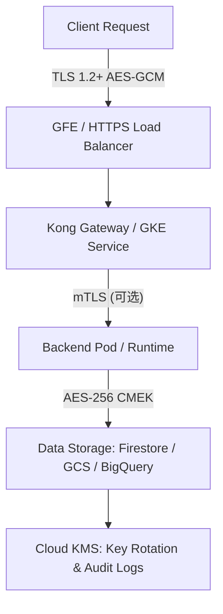

```bash
我们是平台用户，现在提交了这样一个问题 Thanks for your checking. but may I get more details about the encryption. below is our Power Platform encryption answer for the same questions for your reference.

Microsoft Power Platform provides customer managed encryption key (CMK) feature. Refer to: CMKv2 All keys are created by company Crypto team with expiration date in 2 years, meaning the encryption key will be rotated every 2 years.

All data is encrypted by default in transit and at rest.

Data in transit uses TLS 1.2 or higher and cipher modes in use is GCM.

Encryption is carried out using cryptographically secure algorithms.

Encryption is compliant with FIPS-140-2 standard. 理解是让我们提供 一些关于安全方面的 或者是加密方面的一些 需求提供 那么对于这GCP工程来说 有哪些方面和上面的东西是匹配的？ 或者是实现的方案是什么？
```
非常好的问题 👍。你理解得对 —— 对方是希望你提供 在 GCP 平台上关于数据加密（Encryption）和安全机制（Security） 的实现说明，以便和他们的 Power Platform 的安全实践（如 CMK、FIPS、TLS、加密算法等）进行对比。

下面是针对你们 GCP 工程平台（涉及 GKE / GCE / BigQuery / Firestore / Buckets / Artifact Registry 等组件） 的加密与安全匹配说明，可直接用于对外答复或安全问卷。

🔐 GCP 平台数据加密与安全机制说明

1. Encryption at Rest（静态数据加密）

|              |                                                                                                                        |
| ------------ | ---------------------------------------------------------------------------------------------------------------------- |
| 机制           | 说明                                                                                                                     |
| 默认加密         | 所有数据在写入 GCP 存储系统时均会自动加密，包括 Compute Engine 磁盘、GKE 持久卷（Persistent Disks）、Cloud Storage、BigQuery、Firestore 等。             |
| 加密算法         | 使用 AES-256 或 AES-128-GCM 算法，由 Google 管理的加密密钥（Google-managed key）保护。                                                    |
| 用户托管密钥（CMEK） | 可启用 Customer Managed Encryption Key (CMEK)，允许用户使用自定义的 KMS 密钥加密资源。密钥可通过 Cloud Key Management Service (Cloud KMS) 创建和轮换。 |
| 客户端托管密钥（CMK） | 支持 Customer Supplied Encryption Key (CSEK)，即用户自行生成并管理密钥，仅在创建资源时提供给 GCP。                                                |
| 密钥轮换         | Cloud KMS 支持 自动密钥轮换（Automatic Key Rotation），可自定义轮换周期（如每 2 年一次，与 Power Platform 一致）。                                    |

2. Encryption in Transit（传输中加密）

|         |                                                                                            |
| ------- | ------------------------------------------------------------------------------------------ |
| 通信类型    | 加密机制                                                                                       |
| 外部客户端访问 | 所有外部访问（例如 HTTPS / API 请求）均强制使用 TLS 1.2 或更高版本。                                              |
| 内部服务通信  | GCP 内部流量（如 GKE Pod 间通信、GCE <-> Storage、Kong <-> Runtime）默认通过 Google Front End (GFE) 层实现加密。 |
| 加密算法    | 使用 AES-GCM 模式的 TLS Cipher Suites，例如 TLS_ECDHE_RSA_WITH_AES_256_GCM_SHA384。                 |
| 自定义证书   | 可使用 Google Certificate Manager 或 Secret Manager 托管自签名证书、CA 签发证书，以及配置 双向 TLS (mTLS) 验证。     |

3. FIPS 140-2 合规性

|              |                                                                                                                                                                             |
| ------------ | --------------------------------------------------------------------------------------------------------------------------------------------------------------------------- |
| 项目         | 支持情况                                                                                                                                                                    |
| GCP 加密模块 | Google Cloud 所使用的加密模块经过 FIPS 140-2 验证，详情见 [Google Cloud Cryptographic Module Validation Program](https://cloud.google.com/security/compliance/fips-140-2)。 |
| Cloud KMS    | Cloud KMS 使用的加密模块同样 通过 FIPS 140-2 验证，可在合规模式下启用（FIPS 140-2 compliant mode）。                                                                        |
| Compute/GKE  | GCE、GKE 等基础设施层使用的加密算法及 TLS 协议均符合 FIPS 140-2 标准。                                                                                                      |

4. Key Management（密钥管理）

|        |                                                        |
| ------ | ------------------------------------------------------ |
| 功能     | 实现                                                     |
| 密钥存储   | 使用 Cloud KMS 存储对称或非对称密钥。                               |
| 密钥访问控制 | 基于 IAM 权限模型，仅授权用户可访问密钥。                                |
| 密钥轮换   | 可设定轮换周期（如 2 年），并支持版本化管理（key versioning）。               |
| 密钥审计   | 所有密钥操作（创建、使用、删除、轮换）会记录在 Cloud Audit Logs 中，可对访问行为进行审计。 |

5. 整体加密策略对照表

|                            |                                        |                                   |
| -------------------------- | -------------------------------------- | --------------------------------- |
| Power Platform 机制        | GCP 对应机制                           | 说明                              |
| Customer Managed Key (CMK) | CMEK (Customer Managed Encryption Key) | 由用户在 Cloud KMS 创建并管理密钥 |
| Key rotation every 2 years | 可配置轮换周期（如 2 年）              | 支持自动密钥轮换                  |
| Data encrypted by default  | 默认静态加密（AES-256）                | 所有数据存储自动加密              |
| TLS 1.2+ with GCM          | TLS 1.2+ AES-GCM Cipher                | 默认使用强加密套件                |
| FIPS-140-2 compliance      | GCP 全面符合 FIPS 140-2                | KMS、TLS 模块均通过认证           |

6. 可选增强方案（Recommended Enhancements）

- 若涉及高敏感业务，可：  


1. 使用 CMEK + 自动轮换策略；
2. 在 GKE 中启用 mTLS + FIPS-compliant node image；
3. 使用 VPC Service Controls 限制跨边界访问；
4. 对外通信通过 Cloud Armor + HTTPS Load Balancer 实现安全访问控制。

-

7.

整体流程示意



✅

总结

你的 GCP 平台在安全与加密方面 完全可以与 Microsoft Power Platform 对齐甚至更高：

- 默认支持 加密 at rest + in transit
- 支持 CMEK/CMK、自动轮换、FIPS-140-2
- TLS 强制 1.2+ / AES-GCM
- 密钥可由客户完全控制并可审计

是否希望我帮你整理成一份 英文版安全说明模板（适合回复客户问卷或安全评估邮件）？

我可以直接生成一份结构化的答复文档（含表格 + 段落 + 官方参考链接），可直接发送给对方。
