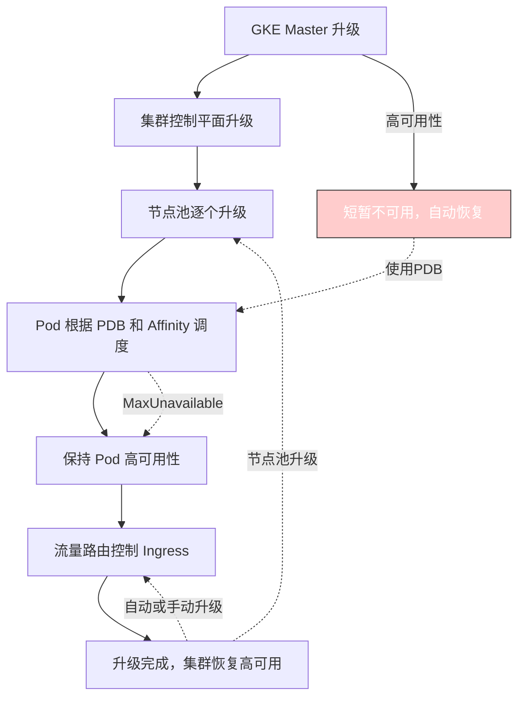

- [Summary](#summary)
  - [Current issues](#current-issues)
  - [Maybe TODO](#maybe-todo)
  - [deepseek think](#deepseek-think)
  - [summary deekseek think](#summary-deekseek-think)
    - [一、GKE Master 升级的影响](#一gke-master-升级的影响)
  - [流量转发不受影响: 已经建立的连接和流量转发通常不会受到 Master 升级的影响。](#流量转发不受影响-已经建立的连接和流量转发通常不会受到-master-升级的影响)
    - [二、GKE Cluster 升级策略](#二gke-cluster-升级策略)
    - [三、节点池（Node Pools）升级的影响](#三节点池node-pools升级的影响)
    - [四、工作负载层面的高可用配置](#四工作负载层面的高可用配置)
    - [五、其他最佳实践](#五其他最佳实践)
    - [六、监控与日志](#六监控与日志)
    - [总结：升级时的关键检查清单](#总结升级时的关键检查清单)
- [Gemini](#gemini)
- [ChatGPT](#chatgpt)

# Summary 
我想了解Google云平台的一些概念,因为这些可能跟升级的时候的高可用有比较重要的关系
我想了解 GKE 升级时的影响
比如GKE  master 的影响
GKE  cluster 的影响
Cluster node pools  的影响
一些背景比如配置affinity,maxUnavailable可以在Deployment层面确保高可用
或者PDB配置PodDisruptionBudget可以确保在cluster层面的升级时确保在节点排空时一些高可用
等等不限制于这些
https://cloud.google.com/kubernetes-engine/docs/how-to/upgrading-a-cluster?hl=zh-cn
https://cloud.google.com/kubernetes-engine/docs/concepts/cluster-upgrades?hl=zh-cn

## Current issues
- Node 替换会导致 Pod 被驱逐，需要重新调度

**场景分析：**

*   **没有配置 PDB：** PDB 的作用是限制在自愿中断（例如，节点维护、升级）期间可以同时被驱逐的 Pod 数量。如果没有配置 PDB，GKE 在 Drain 节点时，可能会同时驱逐该节点上的所有 Pod，而不会考虑应用程序的可用性。
*   **Pod 副本数为 2：** 只有 2 个 Pod 副本，容错能力较低。
*   **没有配置反亲和性：** 反亲和性可以防止 Pod 被调度到相同的节点上。如果没有配置反亲和性，并且 Pod 恰好被调度到同一个节点上，那么一旦该节点发生故障或被 Drain，两个 Pod 都会同时不可用。
*   **升级场景：** 在 GKE Cluster 升级或 Cluster Node Pools 升级过程中，GKE 需要 Drain 节点，将节点上的 Pod 迁移到其他节点。

**可能的中断过程：**

1.  GKE 开始 Drain 某个节点。
2.  由于没有配置 PDB，GKE 可以随意驱逐该节点上的所有 Pod。
3.  你的两个 Pod 恰好都运行在这个节点上。
4.  GKE 同时驱逐这两个 Pod。
5.  由于 Deployment 需要时间来创建新的 Pod，所以在新的 Pod 启动之前，你的应用程序会完全不可用，造成服务中断。

**避免中断的策略：**

1.  **配置 PDB：** 为你的 Deployment 配置 PDB，指定至少需要多少个 Pod 保持可用。例如，如果你的 Pod 副本数为 2，你可以配置 `minAvailable: 1`，确保在任何时候至少有一个 Pod 可用。
2.  **配置反亲和性：** 为你的 Deployment 配置反亲和性，防止 Pod 被调度到相同的节点上。
3.  **增加 Pod 副本数：** 增加 Pod 副本数可以提高应用程序的容错能力。例如，将 Pod 副本数增加到 3 或更多，即使有两个 Pod 同时不可用，仍然有一个 Pod 可以提供服务。
4.  **滚动更新策略：** 确保 Deployment 使用 `RollingUpdate` 策略，并设置合理的 `maxUnavailable` 和 `maxSurge` 参数，以控制更新过程中 Pod 的可用性。
5.  **监控和告警：** 在升级过程中，密切监控应用程序的健康状况，及时发现并解决问题。

**总结：**

在没有配置 PDB 和反亲和性，且 Pod 副本数较少的情况下，GKE 升级确实可能导致服务中断。因此，强烈建议你根据应用程序的需求，配置 PDB 和反亲和性，并增加 Pod 副本数，以提高应用程序的可用性和容错能力。

简而言之，PDB 就像一个安全网，确保在节点维护或升级期间，你的应用程序始终保持一定的可用性。 如果没有这个安全网，你的服务就更容易受到中断的影响。


## Maybe TODO
如果您配置的 PodDisruptionBudget 对象无法允许任何额外的中断，则节点升级可能会在反复尝试后仍无法升级到控制平面版本。为防止此故障，我们建议您扩容 Deployment 或 HorizontalPodAutoscaler，以允许节点排空，同时仍遵循 PodDisruptionBudget 配置。
如需查看不允许出现任何中断的所有 PodDisruptionBudget 对象，请运行以下命令：
```bash
kubectl get poddisruptionbudget --all-namespaces -o jsonpath='{range .items[?(@.status.disruptionsAllowed==0)]}{.metadata.name}/{.metadata.namespace}{"\n"}{end}'
```
The cluster bule and green ?
- Surge upgrades
  - https://cloud.google.com/kubernetes-engine/docs/concepts/node-pool-upgrade-strategies?hl=zh-cn#surge
- blue and green
  - https://cloud.google.com/kubernetes-engine/docs/concepts/node-pool-upgrade-strategies?hl=zh-cn#blue-green-upgrade-strategy
  - 第 1 阶段：创建绿色池 https://cloud.google.com/kubernetes-engine/docs/concepts/node-pool-upgrade-strategies?hl=zh-cn#bg-phase-create-green-pool
  - 第 2 阶段：封锁蓝色池 https://cloud.google.com/kubernetes-engine/docs/concepts/node-pool-upgrade-strategies?hl=zh-cn#bg-phase-cordon-blue-pool
  - 第 3 阶段：排空蓝色池 https://cloud.google.com/kubernetes-engine/docs/concepts/node-pool-upgrade-strategies?hl=zh-cn#bg-phase-drain-blue-pool
  - 第 4 阶段：过渡节点池 https://cloud.google.com/kubernetes-engine/docs/concepts/node-pool-upgrade-strategies?hl=zh-cn#bg-phase-soak-node-pool
  -第 5 阶段：删除蓝色池 https://cloud.google.com/kubernetes-engine/docs/concepts/node-pool-upgrade-strategies?hl=zh-cn#bg-phase-delete-blue-pool

## deepseek think
嗯，用户想了解Google云平台的一些概念，特别是GKE升级时的影响，包括Master、Cluster、Node Pools这些部分。还有提到高可用相关的配置，比如affinity、maxUnavailable和PDB。首先，我需要确定用户对这些概念的熟悉程度，可能需要从基础开始解释，但用户已经提到了一些高级配置，可能有一定经验，但需要深入。

用户可能是在准备升级他们的GKE集群，担心升级过程中服务的高可用性。他们可能遇到了或者想避免升级期间的服务中断。需要详细说明GKE升级时各个组件的影响，以及如何配置来确保高可用。

首先，GKE的Master节点升级是由Google自动处理的，用户可能不知道这个过程是否会影响他们的集群控制面。需要解释Master升级的机制，比如滚动更新，以及可能的短暂API不可用。同时，Regional Cluster和Autopilot的信息可能对用户有帮助，特别是Regional Cluster如何通过多区域部署提高可用性。

接下来是Cluster升级，用户可能分不清Master和Node的升级顺序。需要说明默认情况下先升级Master，然后节点，但用户可以选择顺序。可能用户需要知道如何安排升级时间，以及如何监控升级状态。

Node Pools部分，用户可能关心节点池升级时Pod的驱逐和重新调度。需要解释并行升级、Surge升级和Soak时间的概念。用户可能不知道如何配置这些参数来减少影响，或者如何利用PodDisruptionBudget来限制中断。

然后是高可用配置，比如Deployment的maxUnavailable和affinity。用户可能已经使用这些配置，但想确认在升级时是否有效。需要说明这些参数如何与节点排空配合，确保Pod的分布和可用性。

PDB部分，用户可能知道基本概念，但需要具体例子，比如如何设置minAvailable或maxUnavailable来保证关键服务在升级时至少有足够的实例运行。同时需要提醒避免过于严格的PDB导致升级卡住的问题。

用户可能还想了解其他最佳实践，比如金丝雀部署、健康检查、多区域部署和备份。这些虽然不是直接的问题，但可能对他们构建高可用系统有帮助。此外，升级前的测试和监控也是关键点，用户可能需要指导如何实施这些步骤。

需要检查是否有遗漏的部分，比如etcd的影响，或者网络策略在升级中的变化？不过GKE的Master升级由Google管理，可能不需要用户操心。但节点升级时，用户的应用是否容忍节点不可用，如何优雅处理终止信号，这些也是需要考虑的。

用户的问题中提到了“不限于这些”，所以需要覆盖所有相关方面，但不要太过深入技术细节，保持解释清晰易懂。最后总结关键点，帮助用户制定升级策略，确保高可用性。

## summary deekseek think
在 Google Kubernetes Engine (GKE) 的升级过程中，高可用性（High Availability, HA）的实现需要综合考虑 **Master 控制平面**、**节点池（Node Pools）**、**工作负载调度策略**（如 Affinity/Anti-Affinity）以及 **PodDisruptionBudget (PDB)** 等多个层面的设计。以下是关键概念和影响分析：

---

### 一、GKE Master 升级的影响
1. **控制平面（Master）的职责**  
   GKE Master 负责集群的 API Server、Scheduler、Controller Manager 等核心组件。升级 Master 时：
   - **短暂不可用性**：API Server 可能短暂不可用（通常几秒到几分钟），但 Google 会通过滚动更新（Rolling Update）最小化影响。
   - **Regional Clusters**：若使用 Regional Cluster（多区域部署），Master 节点会自动跨多个可用区（Zones），升级时会逐个区域更新，确保控制平面的高可用性。
   - **Autopilot 模式**：完全由 Google 托管，Master 升级对用户完全透明。

2. **用户操作限制**  
   在 Master 升级期间，`kubectl` 命令可能短暂失败，但已运行的 Pod 不会受到影响。
3. **From Gemini Description** 
   - Master 升级: 如你所述，Master 升级通常不会直接影响 Node Pool 中的 Pod。但需要注意以下几点：
   - API Server 短暂不可用: 在 Master 升级期间，API Server 可能会短暂不可用。 如果你的应用 (例如，api-authn) 在此期间需要与 API Server 交互，可能会受到影响 (例如，无法创建新的 Pod，无法查询资源状态等)。 但对已运行的 Pod 的直接影响较小。
流量转发不受影响: 已经建立的连接和流量转发通常不会受到 Master 升级的影响。
---

### 二、GKE Cluster 升级策略
GKE 集群升级分为 **Master 升级**和 **Node 升级**，默认情况下：
- **顺序**：先升级 Master，再升级节点池（Node Pools）。
- **手动 vs 自动**：
  - **自动升级**：Google 自动应用安全补丁和次要版本更新。
  - **手动升级**：用户需主动触发主要版本升级（如 1.28 → 1.29）。

---

### 三、节点池（Node Pools）升级的影响
1. **节点替换机制**  
   GKE 通过创建新节点并排空（Drain）旧节点实现升级：
   - **Pod 驱逐**：节点排空时，Pod 会被优雅终止（Graceful Termination），触发 `SIGTERM` 信号。
   - **重新调度**：Pod 会被调度到其他可用节点（需确保资源充足）。

2. **升级参数控制**  
   通过节点池配置调整升级行为：
   - **并行升级数量**：`maxSurge`（默认 1）控制同时创建的新节点数量。
   - **最大不可用节点数**：`maxUnavailable`（默认 0）控制同时排空的旧节点数量。
   - **Soak Time**：新节点创建后的观察时间，确保稳定性后再继续升级。

3. **关键注意事项**  
   - **单节点池风险**：若集群仅有一个节点池，需确保至少有一个节点始终可用。
   - **自定义自动扩缩（CA）**：避免升级期间自动扩缩与节点替换冲突。
4. **From Gemini Description** 
   - Node Pool 滚动升级: 这是影响应用可用性的主要因素。 GKE 滚动升级 Node Pool 的过程如下：
   - Cordon（封锁）: Kubernetes 将目标节点标记为不可调度 (cordon)。 这意味着新的 Pod 不会被调度到该节点上。
   - Drain（排空）: Kubernetes 会尝试安全地驱逐该节点上的所有 Pod (drain)。 驱逐过程会尊重 PDB 的设置 (如果已配置)。 kubectl drain 命令会尝试 graceful shutdown，会给应用一定的shutdown时间去处理。
   - 重新创建: 一旦节点上的所有 Pod 都被驱逐 (或达到超时时间)，GKE 会创建一个新的、已升级的节点，并将其加入集群。 然后，Kubernetes 调度器会将 Pod 调度到新的节点上 

---

### 四、工作负载层面的高可用配置
1. **Deployment/StatefulSet 策略**  
   - `maxUnavailable`：允许不可用的 Pod 数量（例如设置为 25%）。
   - `maxSurge`：允许临时超出副本数的 Pod 数量。
   ```yaml
   strategy:
     type: RollingUpdate
     rollingUpdate:
       maxUnavailable: 20%
       maxSurge: 1
   ```

2. **Affinity/Anti-Affinity**  
   - **Pod Anti-Affinity**：确保 Pod 分散在不同节点/区域，避免单点故障。
     ```yaml
     affinity:
       podAntiAffinity:
         requiredDuringSchedulingIgnoredDuringExecution:
         - labelSelector:
             matchLabels:
               app: my-app
           topologyKey: "kubernetes.io/hostname"
     ```

3. **PodDisruptionBudget (PDB)**  
   限制节点排空时的最大 Pod 中断数量：
   ```yaml
   apiVersion: policy/v1
   kind: PodDisruptionBudget
   metadata:
     name: my-pdb
   spec:
     minAvailable: 80%  # 或使用 maxUnavailable: 20%
     selector:
       matchLabels:
         app: my-critical-app
   ```
   - **关键点**：PDB 需与副本数（Replicas）匹配，避免过严（如 `minAvailable: 100%`）导致升级阻塞。

---

### 五、其他最佳实践
1. **金丝雀升级（Canary Upgrade）**  
   - 先升级少量节点池，验证稳定性后再全量升级。
2. **健康检查与就绪探针**  
   确保 Pod 在升级期间正确处理流量：
   ```yaml
   livenessProbe:
     httpGet:
       path: /healthz
       port: 8080
   readinessProbe:
     httpGet:
       path: /ready
       port: 8080
   ```
3. **多区域部署**  
   跨多个可用区（Zones）部署节点池和应用，结合 `Topology Spread Constraints` 实现区域级高可用。
4. **备份与回滚**  
   - 使用 `etcd` 自动备份（GKE 默认启用）。
   - 预先制定回滚计划（如通过 GKE 的版本回退功能）。

---

### 六、监控与日志
- **GKE 控制台**：实时监控升级进度和集群状态。
- **Cloud Monitoring**：设置告警规则（如节点不可用、Pod 崩溃等）。
- **日志分析**：通过 Cloud Logging 跟踪 `kube-controller-manager` 和 `kube-scheduler` 日志。

---

### 总结：升级时的关键检查清单
1. 确保 PDB 配置合理，避免升级卡住。
2. 使用多节点池 + 多区域部署。
3. 测试工作负载的优雅终止逻辑（处理 `SIGTERM`）。
4. 预留足够的资源容量（避免升级时资源不足）。
5. 优先在非高峰时段执行升级。

通过以上策略，可以最大限度减少 GKE 升级对业务的影响，实现无缝高可用升级。

# Gemini 
好的，很高兴能帮助你了解 GKE 升级对高可用性的影响，以及如何通过各种配置来减轻这些影响。

**GKE 升级的影响及高可用性策略**

GKE 升级主要分为以下几个方面：

1.  **GKE Master 升级**：
    *   **影响**：
        *   GKE Master 是集群的控制平面，负责 API 请求、调度 Pod 等关键操作。升级 Master 会涉及到短暂的控制平面不可用。
        *   Master 升级期间，通常无法进行新的资源创建、更新或删除操作。现有的 Pod 会继续运行，但可能会受到影响（例如，kubelet 无法获取最新的配置）。
    *   **高可用性策略**：
        *   **多可用区 Master**：GKE 默认提供多可用区 Master，这意味着 Master 实例分布在不同的可用区。即使一个可用区出现问题，集群仍然可用。
        *   **升级窗口**：GKE 允许你配置升级窗口，选择业务低峰期进行升级，减少对用户的影响。
        *   **升级通知**：提前关注 GKE 的升级通知，了解升级计划，做好应对准备。

2.  **GKE Cluster 升级**：
    *   **影响**：
        *   Cluster 升级涉及到控制平面（Master）和数据平面（Node）的升级。
        *   Node 升级通常采用滚动更新的方式，逐个节点进行升级，尽量减少对应用程序的影响。
    *   **高可用性策略**：
        *   **滚动更新**：GKE 默认采用滚动更新的方式升级 Node。这意味着每次只更新一部分节点，其余节点继续提供服务。
        *   **Node 池 (Node Pools)**：使用多个 Node 池可以将不同类型的节点（例如，不同大小、不同操作系统）隔离。升级可以针对特定的 Node 池进行，从而降低对整个集群的影响。

3.  **Cluster Node Pools 升级**：
    *   **影响**：
        *   Node Pool 升级会替换 Node Pool 中的节点，这可能会导致 Pod 被驱逐。
    *   **高可用性策略**：
        *   **滚动更新**：与 Cluster 升级类似，Node Pool 升级也采用滚动更新的方式。
        *   **节点维护窗口**：类似于升级窗口，你可以设置节点维护窗口，选择业务低峰期进行节点维护操作。
        *   **Drain 节点**：在升级节点之前，GKE 会自动 Drain 节点，将节点上的 Pod 安全地迁移到其他节点。
4. **升级 依赖**：
    * 详细梳理一下 GKE Master 升级、GKE Cluster 升级和 Cluster Node Pools 升级之间的依赖关系，以及它们在高可用性方面的考量。
```bash


**升级依赖关系：**

1.  **GKE Master 升级 是 GKE Cluster 升级 的一部分**：

    *   GKE Cluster 升级本质上是控制平面（Master）和数据平面（Node）的协同升级。
    *   升级 GKE Cluster **一定包含** Master 升级。 你可以理解为Cluster 升级是全局的，它会包含控制平面和数据平面的升级。

2.  **Cluster Node Pools 升级 不是必须包含在 GKE Cluster 升级 中**：

    *   虽然 GKE Cluster 升级会更新集群的基础设施，但它**不一定**会自动升级所有 Node Pools。
    *   Node Pools 升级通常是独立进行的，你可以选择在 GKE Cluster 升级之后手动升级 Node Pools，也可以单独针对某个 Node Pool 进行升级。
    *   你可以理解为 Node Pool 是数据平面的一部分，但它是一个独立的资源，可以单独管理和升级。

**依赖关系总结：**

```
GKE Cluster 升级 (包含 GKE Master 升级)
    |
    | 可能包含/触发
    |
    Cluster Node Pools 升级 (可以选择独立进行)
```

**对高可用性的影响和考量：**

*   **GKE Master 升级：**
    *   **影响**：控制平面暂时不可用，无法进行新的资源操作。
    *   **高可用性策略**：多可用区 Master、升级窗口。
    *   **与 Node Pools 升级的关系**：Master 升级本身不会直接影响 Node Pools 上的 Pod 运行，但可能会影响 kubelet 获取最新的配置。

*   **GKE Cluster 升级：**
    *   **影响**：控制平面和数据平面都会受到影响。
    *   **高可用性策略**：滚动更新、多可用区 Master、升级窗口、提前通知。
    *   **与 Node Pools 升级的关系**：GKE Cluster 升级可能会触发 Node Pools 的滚动更新，但你可以控制这个过程。

*   **Cluster Node Pools 升级：**
    *   **影响**：Node Pool 中的节点会被替换，导致 Pod 被驱逐。
    *   **高可用性策略**：滚动更新、节点维护窗口、Drain 节点、PDB、合理的 Deployment 配置。
    *   **与 Master 升级的关系**：Node Pool 升级不会直接影响 Master 的运行。

**升级过程中的高可用性保障：**

1.  **规划升级顺序**：
    *   如果需要同时升级 Master 和 Node Pools，建议先进行 Master 升级，然后再进行 Node Pools 升级。
    *   如果只需要升级 Node Pools，可以独立进行，不需要先升级 Master。

2.  **利用滚动更新**：
    *   无论是 GKE Cluster 升级还是 Node Pools 升级，都应该利用滚动更新的方式，确保始终有一定数量的节点可用。

3.  **配置 PDB**：
    *   为关键应用程序配置 PDB，防止在节点排空期间，可用 Pod 数量低于最低阈值。

4.  **设置合理的 Deployment 参数**：
    *   确保 Deployment 的 `replicas` 足够，`maxUnavailable` 和 `maxSurge` 参数设置合理，以应对节点故障或升级。

5.  **监控和告警**：
    *   在升级过程中，密切监控应用程序的健康状况，及时发现并解决问题。

6.  **测试**：
     *  在生产环境之前，在staging环境做足测试。包括模拟升级场景，验证PDB, deployment配置等。

**举例说明：**

假设你有一个应用程序运行在 GKE 集群上，你需要升级 GKE 版本。

1.  **GKE Cluster 升级**：你发起 GKE Cluster 升级，这会自动升级 Master。升级过程中，Master 会短暂不可用，但多可用区 Master 保证了控制平面的高可用性。同时，GKE 会滚动更新 Node，确保应用程序的可用性。
2.  **Node Pools 升级 (可选)**：在 GKE Cluster 升级完成后，你可以选择是否升级 Node Pools。如果你需要使用新版本的 Kubernetes 提供的功能，或者需要更新节点的操作系统，你可以手动触发 Node Pools 升级。在 Node Pools 升级过程中，GKE 会滚动更新 Node Pool 中的节点，并根据你配置的 PDB 和 Deployment 参数，安全地迁移 Pod。

**总结：**

GKE Master 升级是 GKE Cluster 升级的一部分，而 Node Pools 升级可以选择独立进行。在升级过程中，利用滚动更新、PDB 和 Deployment 等机制，可以最大程度地减少对应用程序的影响，确保高可用性。 升级过程中的高可用更多的是关注数据平面的高可用， 控制平面的高可用 GKE 默认已经支持多可用区 Master. 更加关注数据平面，做好充分的测试， 监控和合理的参数设置即可保障升级过程中的高可用。

```

**Deployment 和 PodDisruptionBudget (PDB) 的作用**

*   **Deployment**：Deployment 是一种声明式的 Pod 管理方式，它可以确保始终有指定数量的 Pod 运行。如果某个 Pod 发生故障或被驱逐，Deployment 会自动创建一个新的 Pod 来替代它。
    *   **`replicas`**：Deployment 中 `replicas` 字段指定了要运行的 Pod 副本数。增加副本数可以提高应用程序的可用性。
    *   **`strategy`**：Deployment 中 `strategy` 字段定义了更新 Pod 的策略。常用的策略有：
        *   **`RollingUpdate`**：滚动更新，逐个更新 Pod，确保始终有一定数量的 Pod 可用。
        *   **`Recreate`**：先删除所有旧的 Pod，再创建新的 Pod。这种策略会导致短暂的停机时间，不适用于高可用性场景。
    *   **`maxUnavailable`**：`RollingUpdate` 策略中的 `maxUnavailable` 字段指定了在更新过程中最多可以有多少个 Pod 不可用。
    *   **`maxSurge`**：`RollingUpdate` 策略中的 `maxSurge` 字段指定了在更新过程中可以额外创建多少个 Pod。
    *   **`affinity` 和 `antiAffinity`**：
        *   `affinity` 用于将 Pod 调度到特定的节点上。
        *   `antiAffinity` 用于避免将 Pod 调度到相同的节点上。
        *   通过合理配置 `affinity` 和 `antiAffinity`，可以将 Pod 分散到不同的节点上，提高应用程序的可用性。

*   **PodDisruptionBudget (PDB)**：PDB 用于限制在自愿中断期间（例如，节点维护、升级）可以同时被驱逐的 Pod 数量。
    *   **`minAvailable`**：指定在任何时候都必须可用的 Pod 数量。
    *   **`maxUnavailable`**：指定在任何时候都允许不可用的 Pod 数量。
    *   PDB 可以防止在节点排空期间，应用程序的可用性降到最低阈值以下。

**配置示例**

*   **Deployment 示例**

```yaml
apiVersion: apps/v1
kind: Deployment
metadata:
  name: my-app
spec:
  replicas: 3  # 3 个副本
  selector:
    matchLabels:
      app: my-app
  strategy:
    type: RollingUpdate
    rollingUpdate:
      maxUnavailable: 1  # 允许最多 1 个 Pod 不可用
      maxSurge: 1  # 允许额外创建 1 个 Pod
  template:
    metadata:
      labels:
        app: my-app
    spec:
      containers:
      - name: my-app
        image: my-app:latest
        ports:
        - containerPort: 8080
```

*   **PDB 示例**

```yaml
apiVersion: policy/v1
kind: PodDisruptionBudget
metadata:
  name: my-app-pdb
spec:
  minAvailable: 2  # 至少 2 个 Pod 必须可用
  selector:
    matchLabels:
      app: my-app
```

**总结**

通过以上策略和配置，可以最大程度地减少 GKE 升级对应用程序的影响，确保高可用性。

*   **多可用区 Master** 提供了控制平面的冗余。
*   **滚动更新** 保证了节点升级过程中的应用程序可用性。
*   **Deployment** 确保始终有足够的 Pod 运行。
*   **PDB** 防止在节点排空期间，应用程序的可用性降到最低阈值以下。
*   **合理的 affinity 和 antiAffinity 配置**可以将 Pod 分散到不同的节点上，提高应用程序的可用性。

希望这些信息对你有所帮助！如果你有任何其他问题，请随时提出。

好的，这是 GKE Master 升级、GKE Cluster 升级和 Cluster Node Pools 升级的对比表格：
好的，明白了，这是按照你的要求，将 GKE Master 升级和 GKE Cluster 升级合并成一个表头的表格：


| 特性/操作                  | GKE Master/Cluster 升级 (整体控制平面 + 数据平面升级)                                                                       | Cluster Node Pools 升级 (独立数据平面升级)                                                                                 |
| -------------------------- | --------------------------------------------------------------------------------------------------------------------------- | -------------------------------------------------------------------------------------------------------------------------- |
| **范围**                   | 整个 GKE 集群 (控制平面 + 数据平面)；Master 升级是 Cluster 升级的一部分。                                                   | 仅特定 Node Pool (独立的数据平面)                                                                                          |
| **包含关系**               | Cluster 升级 **包含** Master 升级； 升级Cluster时，Master一定会被升级                                                       | 独立操作，**不包含** GKE Master 升级或 GKE Cluster 升级。可以独立于Cluster进行。                                           |
| **主要影响**               | 控制平面暂时不可用（Master升级），集群整体可能存在波动；Node节点滚动更新可能导致Pod重建调度                                 | Node Pool 中的节点会被替换，Pod 会被驱逐。                                                                                 |
| **触发方式**               | 用户手动触发，或由 Google 自动触发 (例如，安全更新)。                                                                       | 用户手动触发，或通过自动升级配置触发。                                                                                     |
| **高可用性策略**           | 多可用区 Master、升级窗口、提前通知、滚动更新、监控和告警、合理的维护窗口、 配合 PDB 和 Deployment配置。                    | 滚动更新、节点维护窗口、Drain 节点、PDB、合理的 Deployment 配置、监控和告警。                                              |
| **对 Pod 的直接影响**      | 滚动更新会逐步替换 Node，影响运行在这些 Node 上的 Pod，可能需要重建调度。 Master的升级可能对kubelet有影响，需要考虑兼容性。 | Node 替换会导致 Pod 被驱逐，需要重新调度。                                                                                 |
| **依赖关系**               | 无，但通常依赖于 GKE 集群的正常运行。                                                                                       | 依赖于 GKE 集群的正常运行。                                                                                                |
| **适用场景**               | 升级整个 Kubernetes 集群版本，包括控制平面和数据平面。 保持集群的 Kubernetes 版本在支持范围内。                             | 升级特定 Node Pool 的节点，例如，更新操作系统、使用新类型的节点。 在不升级整个集群的情况下，针对特定工作负载优化节点配置。 |
| **注意事项**               | 提前备份集群配置、关注 GKE 发布说明、做好回滚准备、监控应用程序的健康状况、 考虑 Master 升级对 kubelet 的兼容性。           | 配置 PDB、设置合理的 Deployment 参数、配置节点维护窗口、监控应用程序的健康状况、 测试升级过程。                            |
| **与 Deployment/PDB 关系** | 直接影响：滚动更新期间，Deployment 和 PDB 用于确保应用程序的可用性。                                                        | 直接影响：PDB 限制驱逐 Pod 的数量，Deployment 保证在升级后恢复到期望的副本数。                                             |


**表格说明：**

*   **GKE Master/Cluster 升级:** 涵盖了整个 GKE 集群的升级，包括 Master 和 Node 节点，是一个整体性的升级过程。
*   **Cluster Node Pools 升级:** 仅针对特定的 Node Pool 进行升级，可以独立于 GKE Cluster 升级进行。

这个表格更清晰地展示了 GKE 升级的两种主要方式，以及它们对集群和应用程序的影响。


# ChatGPT 

GKE 升级时的高可用性设计非常关键，尤其是在节点池（node pools）和集群的升级过程中。以下是一些关键点，帮助你理解如何配置和确保升级时的高可用性：

1. GKE Master 升级的影响
	•	GKE Master 是集群的控制平面，升级时，GKE 会自动更新控制平面的各个组件（如 API 服务器、调度器、控制器等）。
	•	影响：
	•	升级时可能会有短暂的控制平面不可用，但对于集群中的应用容器没有直接影响，因为它们会继续运行。
	•	GKE 会在控制平面升级时自动处理 API 请求的故障转移，确保控制平面的高可用。

2. GKE Cluster 升级的影响
	•	GKE 集群的升级包括控制平面和数据平面的升级。数据平面包含所有节点（node）和容器。
	•	影响：
	•	升级过程中，集群会滚动升级节点池和主节点。如果配置了多个节点池，GKE 会逐个节点池地进行升级，确保不会在所有节点上同时进行升级。
	•	升级期间，Pod 会根据其配置（如 PodDisruptionBudget）进行调度，尽量避免影响到正常服务。

3. Cluster Node Pools 升级的影响
	•	Node Pools 是 GKE 集群中的一组虚拟机实例，每个 Node Pool 可以使用不同的配置（如机器类型、区域等）。
	•	影响：
	•	升级时，GKE 会按顺序升级 Node Pool 中的每个节点。
	•	影响取决于 Pod 的调度策略，是否能够容忍节点的中断。
	•	升级过程中节点被排空：GKE 会删除每个节点上的 Pod，并在其他可用节点上重新调度它们。如果配置了 PodDisruptionBudget (PDB)，GKE 会确保在节点升级时不会破坏业务的高可用性。

4. 确保高可用性：Affinity、MaxUnavailable 和 PDB 配置
	•	Affinity 和 Anti-Affinity：这些配置帮助你确保 Pod 分布在多个节点上，从而防止在一个节点或节点池出现故障时，所有副本都不可用。
	•	affinity：确保 Pod 在特定的节点上运行（例如，同一类型的节点或者地理位置靠近的节点）。
	•	anti-affinity：防止多个副本在同一个节点上运行。
	•	MaxUnavailable：在升级期间，你可以在 Deployment 层面设置 maxUnavailable，控制在升级过程中最大可用的 Pod 数量。
	•	示例配置：
```yaml
spec:
  strategy:
    rollingUpdate:
      maxUnavailable: 1  # 最多一个 Pod 不可用
```

	•	PodDisruptionBudget (PDB)：PDB 定义了在 Pod 中断时允许的最大不可用 Pod 数量。它确保即使在节点升级或维护时，Pod 仍然能够保持高可用性。
	•	示例配置：
```yaml
apiVersion: policy/v1
kind: PodDisruptionBudget
metadata:
  name: my-pdb
spec:
  minAvailable: 3  # 至少保持3个 Pod 可用
  selector:
    matchLabels:
      app: my-app
```


5. 升级时的流量控制与负载均衡
	•	在升级过程中，可以使用 Ingress 或 Service 配置来确保流量能够被正确引导到健康的 Pod。
	•	GKE Ingress 会根据健康检查自动调整流量路由，确保服务的可用性。

6. 如何管理 GKE 升级
	•	GKE Standard 节点池 允许手动升级和自动升级。你可以选择自动升级来确保节点始终处于最新版本，或者选择手动升级以控制升级的时间和方式。
	•	升级过程中，确保在进行节点池更新时，Pod 能够根据高可用性配置在集群内调度。

总结

升级时，确保设置好 affinity/anti-affinity、PDB 和 maxUnavailable 等配置，以最大程度地减少服务中断。此外，合理配置节点池和使用 Ingress 控制流量，能更好地管理 GKE 集群在升级期间的高可用性。

你可以参考官方文档中的详细步骤来实施这些策略：GKE 升级文档。


GKE 升级流程图

解释：
	•	GKE Master 升级：首先升级控制平面（Master）。
	•	集群控制平面升级：控制平面的升级不会直接影响正在运行的 Pods。
	•	节点池逐个升级：GKE 会按顺序升级节点池。
	•	Pod 根据 PDB 和 Affinity 调度：在升级过程中，Pod 会基于设置的 PodDisruptionBudget 和 Affinity 配置进行调度，确保高可用。
	•	保持 Pod 高可用性：即使有节点升级，Pods 仍会保持在健康的节点上运行。
	•	流量路由控制 (Ingress)：流量会被自动引导到健康的 Pod。
	•	升级完成，集群恢复高可用：升级完成后，集群恢复正常运行。
	•	短暂不可用，自动恢复：虽然升级过程中会有短暂的不可用，但会自动恢复高可用性。

“短暂不可用”是指在 GKE 升级过程中，控制平面或节点池在升级时可能会发生的临时中断，通常这些中断会非常短暂，不会对最终的服务可用性造成长时间影响。下面是几个可能的情况：

1. 控制平面升级
	•	当 GKE Master（控制平面） 升级时，API 服务器、调度器、控制器等组件可能会短暂不可用。这种不可用通常只会持续几秒钟到几分钟，GKE 会自动处理故障转移和恢复，以确保控制平面能够恢复正常工作。
	•	影响：
	•	Kubernetes API 可能会暂时不可用，导致在升级过程中一些请求可能会失败（例如，创建或删除 Pod、查看日志等操作）。
	•	但对于集群中的运行中的 Pods 和服务，这种不可用影响通常是有限的，因为控制平面不会直接影响到 Pod 的运行。

2. 节点池升级
	•	在节点池升级时，GKE 会先逐一对节点进行滚动升级。每个节点被替换时，原本在该节点上的 Pods 会被迁移到其他健康节点上。尽管 GKE 会尽量保证迁移过程平滑，但在某些情况下，Pod 可能会短时间内不可用。
	•	影响：
	•	如果没有正确配置 PodDisruptionBudget (PDB) 或者 maxUnavailable，可能会导致在升级过程中某些服务的可用副本数下降，从而影响服务的可用性。
	•	不过，如果正确配置了这些参数，Pod 会在节点排空时尽量保留足够数量的副本，避免业务中断。

3. 负载均衡器和流量控制
	•	升级过程中，流量会被路由到健康的节点和 Pod。GKE 的 Ingress 或 Service 会根据健康检查动态调整流量路由。然而，在升级的某些时刻，可能会出现微小的流量波动，导致用户请求出现短暂的延迟或失败。
	•	影响：
	•	尽管 GKE 会尽量平滑迁移流量，但在某些场景下，可能会出现小范围的请求失败或延迟，尤其是在节点池正在滚动升级时。

4. 自动恢复
	•	GKE 会根据升级过程中的健康检查自动恢复集群状态。对于短暂的不可用情况，GKE 会在控制平面恢复正常后自动恢复所有功能，包括 Pod 调度和流量路由。
	•	影响：
	•	升级完成后，Pod 和服务会迅速恢复到正常状态，通常不会对最终用户的体验造成长期影响。

总结：

短暂不可用主要是在升级过程中，由于节点和控制平面的升级、Pod 调度、流量路由等方面的临时中断所引起的。这些不可用通常不会持续很长时间，并且 GKE 会通过自动恢复机制迅速恢复集群的高可用性。正确配置 PDB 和 maxUnavailable 可以进一步减少对服务可用性的影响。