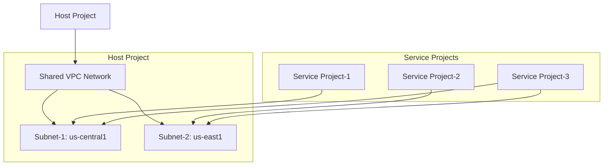
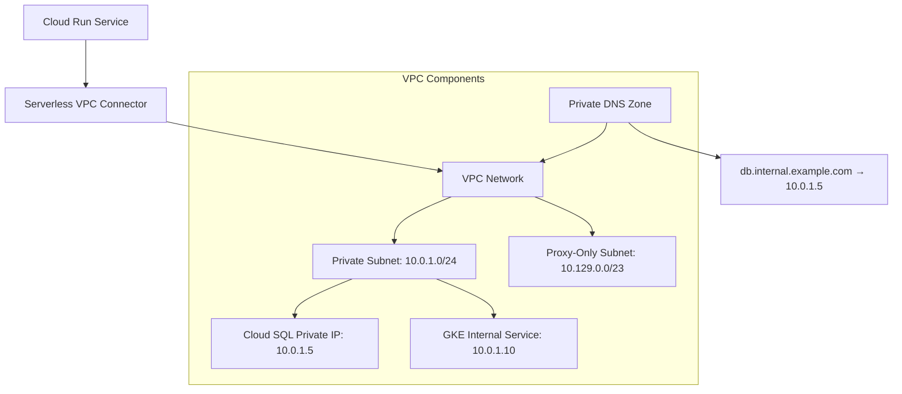
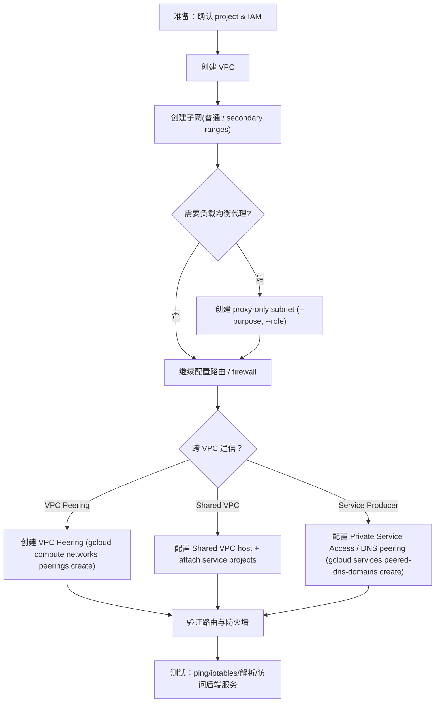
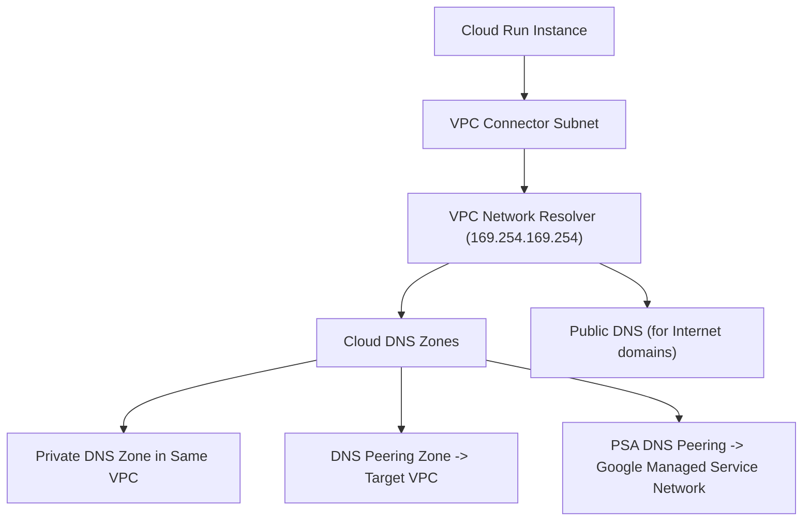

- [Q](#q)
- [Claude](#claude)
- [GCP VPC 网络资源详细指南](#gcp-vpc-网络资源详细指南)
  - [1. VPC Network 核心概念](#1-vpc-network-核心概念)
    - [1.1 VPC Network 基础](#11-vpc-network-基础)
  - [2. Subnets（子网）](#2-subnets子网)
    - [2.1 标准子网创建](#21-标准子网创建)
    - [2.2 查看子网信息](#22-查看子网信息)
  - [3. Reserved Proxy-Only Subnets（代理专用子网）](#3-reserved-proxy-only-subnets代理专用子网)
    - [3.1 用于内部 HTTP(S) 负载均衡](#31-用于内部-https-负载均衡)
    - [3.2 用于 Serverless VPC Connector（重要）](#32-用于-serverless-vpc-connector重要)
  - [4. VPC Network Peering](#4-vpc-network-peering)
    - [4.1 创建 VPC Peering](#41-创建-vpc-peering)
    - [4.2 VPC Peering 限制](#42-vpc-peering-限制)
  - [5. Shared VPC（共享 VPC）](#5-shared-vpc共享-vpc)
    - [5.1 启用 Shared VPC](#51-启用-shared-vpc)
    - [5.2 Shared VPC 架构流程](#52-shared-vpc-架构流程)
  - [6. DNS Peering 与私有 DNS](#6-dns-peering-与私有-dns)
    - [6.1 创建私有 DNS Zone](#61-创建私有-dns-zone)
    - [6.2 DNS Peering（跨 VPC DNS 解析）](#62-dns-peering跨-vpc-dns-解析)
    - [6.3 PSA DNS Peering（Private Service Access）](#63-psa-dns-peeringprivate-service-access)
  - [7. Cloud Run 与 VPC 集成典型场景](#7-cloud-run-与-vpc-集成典型场景)
    - [7.1 问题场景分析](#71-问题场景分析)
    - [7.2 解决方案架构](#72-解决方案架构)
    - [7.3 完整配置步骤](#73-完整配置步骤)
    - [7.4 验证连通性](#74-验证连通性)
  - [8. 常见网络资源命令汇总](#8-常见网络资源命令汇总)
    - [8.1 查看命令](#81-查看命令)
    - [8.2 删除命令](#82-删除命令)
  - [9. 故障排查指南](#9-故障排查指南)
    - [9.1 Cloud Run 无法访问 VPC 资源](#91-cloud-run-无法访问-vpc-资源)
    - [9.2 DNS 解析失败](#92-dns-解析失败)
  - [10. 最佳实践总结](#10-最佳实践总结)
    - [10.1 网络规划](#101-网络规划)
    - [10.2 安全配置](#102-安全配置)
    - [10.3 监控与告警](#103-监控与告警)
  - [注意事项](#注意事项)
- [ChatGPT](#chatgpt)
- [**问题分析**](#问题分析)
- [**解决方案（按主题分组：定义 + gcloud 示例 + Terraform 示例）**](#解决方案按主题分组定义--gcloud-示例--terraform-示例)
  - [**1) VPC Network（自定义 / 自动模式）**](#1-vpc-network自定义--自动模式)
    - [**gcloud 示例**](#gcloud-示例)
    - [**Terraform 示例（最小）**](#terraform-示例最小)
  - [**2) Subnets（子网）与重要参数**](#2-subnets子网与重要参数)
    - [**gcloud 创建普通子网**](#gcloud-创建普通子网)
    - [**gcloud 创建带 secondary ranges（GKE IP alias）**](#gcloud-创建带-secondary-rangesgke-ip-alias)
    - [**Terraform 示例（子网 + secondary）**](#terraform-示例子网--secondary)
  - [**3)** ](#3)
  - [**Reserved proxy-only subnets（Proxy-only subnets）**](#reserved-proxy-only-subnetsproxy-only-subnets)
  - [ **— 用于 Google 的 Envoy-based 代理/负载均衡器**](#-用于-google-的-envoy-based-代理负载均衡器)
    - [**gcloud 创建 proxy-only 子网（示例）**](#gcloud-创建-proxy-only-子网示例)
    - [**Terraform（proxy-only 子网）**](#terraformproxy-only-子网)
  - [**4) VPC Network Peering（VPC 网络对等互连）**](#4-vpc-network-peeringvpc-网络对等互连)
    - [**gcloud 示例（双向对等）**](#gcloud-示例双向对等)
    - [**Terraform（对等）**](#terraform对等)
  - [**5) Shared VPC（共享 VPC / Host \& Service Projects）**](#5-shared-vpc共享-vpc--host--service-projects)
    - [**操作步骤（主要点）**](#操作步骤主要点)
    - [**gcloud 示例**](#gcloud-示例-1)
    - [**Terraform（启用 host project）**](#terraform启用-host-project)
  - [**6) DNS Peering / Private DNS between VPCs / DNS with Service Producers**](#6-dns-peering--private-dns-between-vpcs--dns-with-service-producers)
    - [**gcloud 示例（设置 PSA DNS peering）**](#gcloud-示例设置-psa-dns-peering)
    - [**Terraform 示例（等价）**](#terraform-示例等价)
  - [**7) Private Service Connect (PSC) 与迁移注意**](#7-private-service-connect-psc-与迁移注意)
- [**典型操作流程（流程图）**](#典型操作流程流程图)
- [**常用命令汇总（便于复制粘贴）**](#常用命令汇总便于复制粘贴)
    - [**创建 VPC（custom）**](#创建-vpccustom)
    - [**创建子网（含 secondary ranges）**](#创建子网含-secondary-ranges)
    - [**创建 proxy-only 子网（用于托管托管代理）**](#创建-proxy-only-子网用于托管托管代理)
    - [**创建 VPC Peering**](#创建-vpc-peering)
    - [**Shared VPC：关联 service project**](#shared-vpc关联-service-project)
    - [**配置 PSA DNS peering（设置 DNS peering）**](#配置-psa-dns-peering设置-dns-peering)
- [**常见问题与排错建议**](#常见问题与排错建议)
- [**参考（官方/权威资源）**](#参考官方权威资源)
- [**注意事项与最佳实践**](#注意事项与最佳实践)
- [**Cloud Run（Serverless VPC Connector）与 VPC 网络的 DNS 可解析性与访问连通性问题**](#cloud-runserverless-vpc-connector与-vpc-网络的-dns-可解析性与访问连通性问题)
  - [**一、问题背景分析**](#一问题背景分析)
  - [**二、Cloud Run 连入 VPC 的机制**](#二cloud-run-连入-vpc-的机制)
  - [**三、实际配置步骤**](#三实际配置步骤)
    - [**1️⃣ 创建 VPC Connector**](#1️⃣-创建-vpc-connector)
    - [**2️⃣ 绑定 Cloud Run 与该 Connector**](#2️⃣-绑定-cloud-run-与该-connector)
    - [**3️⃣ 确保 DNS 可解析性**](#3️⃣-确保-dns-可解析性)
      - [**✅ 情况 1：VPC 内资源**](#-情况-1vpc-内资源)
      - [**✅ 情况 2：DNS Peering（跨 VPC 解析）**](#-情况-2dns-peering跨-vpc-解析)
        - [**在目标网络 (vpc-b) 创建 Private DNS Zone**](#在目标网络-vpc-b-创建-private-dns-zone)
        - [**在 Cloud Run 所在网络 (vpc-a) 创建 DNS Peering zone**](#在-cloud-run-所在网络-vpc-a-创建-dns-peering-zone)
    - [**4️⃣ 检查 Private Service Access (PSA) 及** ](#4️⃣-检查-private-service-access-psa-及)
    - [**psa\_dns\_peering**](#psa_dns_peering)
  - [**四、验证连通性与解析**](#四验证连通性与解析)
  - [**五、总结流程图**](#五总结流程图)
  - [**六、注意事项与最佳实践**](#六注意事项与最佳实践)
- [**五、完整访问流程与原理图**](#五完整访问流程与原理图)
- [**六、常见命令与验证方式**](#六常见命令与验证方式)
    - [**1️⃣ 查看当前 VPC Connector 配置**](#1️⃣-查看当前-vpc-connector-配置)
    - [**2️⃣ 查看 VPC 的 DNS Peering 配置**](#2️⃣-查看-vpc-的-dns-peering-配置)
    - [**3️⃣ 查看 VPC Peering 连接状态（包括 PSA）**](#3️⃣-查看-vpc-peering-连接状态包括-psa)
    - [**4️⃣ 测试 DNS 解析是否生效（推荐使用 Cloud Run Job 测试）**](#4️⃣-测试-dns-解析是否生效推荐使用-cloud-run-job-测试)
- [**七、Cloud Run 网络访问策略注意事项**](#七cloud-run-网络访问策略注意事项)
- [**八、Terraform 示例（整合版）**](#八terraform-示例整合版)
- [**九、最佳实践与排障建议**](#九最佳实践与排障建议)

# Q
我想对 GCP 工程里面的 VPC 的 network 进行一个详细的了解 ，包括各种网络资源。 比如 VPC network . Subnets , Reserved proxy-only subnets for load balancing , VPC network Peering. Shared VPC  . 比如允许 VPC 之间 DNS Peering 的概念? 比如 psa_dns_peering 等等类似的命令。 我还想知道这些 subnet 比如说或者网络在创建的过程中使用的命令或者是一些具体的参数。如果可以详细的话 ，请帮我详细罗列。比如一个典型的 Cloud Run（Serverless VPC Connector）与 VPC 网络的 DNS 可解析性与访问连通性问题

# Claude

# GCP VPC 网络资源详细指南

## 1. VPC Network 核心概念

### 1.1 VPC Network 基础

VPC（Virtual Private Cloud）是 GCP 中的全球性虚拟网络资源，提供网络隔离和连接管理。

**创建 VPC Network 命令：**

```bash
# 创建自动模式 VPC（自动在每个区域创建子网）
gcloud compute networks create my-vpc-network \
    --subnet-mode=auto \
    --bgp-routing-mode=regional \
    --mtu=1460

# 创建自定义模式 VPC（手动创建子网）
gcloud compute networks create my-custom-vpc \
    --subnet-mode=custom \
    --bgp-routing-mode=global \
    --mtu=1500
```

**关键参数说明：**

| 参数                 | 可选值               | 描述                 |
| -------------------- | -------------------- | -------------------- |
| `--subnet-mode`      | `auto`, `custom`     | 自动或自定义子网模式 |
| `--bgp-routing-mode` | `regional`, `global` | BGP 路由模式         |
| `--mtu`              | 1460, 1500           | 最大传输单元（字节） |

---

## 2. Subnets（子网）

### 2.1 标准子网创建

```bash
# 创建子网
gcloud compute networks subnets create my-subnet \
    --network=my-custom-vpc \
    --region=us-central1 \
    --range=10.0.1.0/24 \
    --enable-private-ip-google-access \
    --enable-flow-logs \
    --logging-aggregation-interval=interval-5-sec \
    --logging-flow-sampling=0.5 \
    --logging-metadata=include-all

# 创建带次要 IP 范围的子网（用于 GKE Pod/Service）
gcloud compute networks subnets create gke-subnet \
    --network=my-custom-vpc \
    --region=us-central1 \
    --range=10.0.2.0/24 \
    --secondary-range pods=10.4.0.0/14 \
    --secondary-range services=10.8.0.0/20 \
    --enable-private-ip-google-access
```

**子网关键参数：**

| 参数                                | 描述                                                     |
| ----------------------------------- | -------------------------------------------------------- |
| `--range`                           | 主 IP 范围（CIDR 格式）                                  |
| `--secondary-range`                 | 次要 IP 范围（用于 GKE 等）                              |
| `--enable-private-ip-google-access` | 允许私有 IP 访问 Google API                              |
| `--enable-flow-logs`                | 启用 VPC Flow Logs                                       |
| `--purpose`                         | 子网用途（如 `PRIVATE`, `INTERNAL_HTTPS_LOAD_BALANCER`） |

### 2.2 查看子网信息

```bash
# 列出所有子网
gcloud compute networks subnets list --network=my-custom-vpc

# 查看子网详细信息
gcloud compute networks subnets describe my-subnet \
    --region=us-central1 \
    --format=yaml
```

---

## 3. Reserved Proxy-Only Subnets（代理专用子网）

### 3.1 用于内部 HTTP(S) 负载均衡

```bash
# 创建代理专用子网（用于 Internal HTTP(S) Load Balancer）
gcloud compute networks subnets create proxy-only-subnet \
    --purpose=REGIONAL_MANAGED_PROXY \
    --role=ACTIVE \
    --region=us-central1 \
    --network=my-custom-vpc \
    --range=10.129.0.0/23

# 查看代理专用子网
gcloud compute networks subnets list \
    --filter="purpose=REGIONAL_MANAGED_PROXY"
```

**关键概念：**

- **用途**：为 Envoy 代理预留 IP 地址空间
- **范围要求**：至少 `/26`（64 个 IP），建议 `/23`（512 个 IP）
- **限制**：不能用于其他资源（VM、GKE 等）

### 3.2 用于 Serverless VPC Connector（重要）

```bash
# 创建 Serverless VPC Access 连接器子网
gcloud compute networks subnets create serverless-subnet \
    --network=my-custom-vpc \
    --region=us-central1 \
    --range=10.8.0.0/28 \
    --purpose=PRIVATE

# 创建 Serverless VPC Access Connector
gcloud compute networks vpc-access connectors create my-connector \
    --region=us-central1 \
    --subnet=serverless-subnet \
    --min-instances=2 \
    --max-instances=10 \
    --machine-type=e2-micro
```

---

## 4. VPC Network Peering

### 4.1 创建 VPC Peering

```bash
# 在 VPC-A 侧创建 Peering 连接
gcloud compute networks peerings create peer-vpc-a-to-vpc-b \
    --network=vpc-a \
    --peer-network=vpc-b \
    --peer-project=project-b \
    --export-custom-routes \
    --import-custom-routes

# 在 VPC-B 侧创建反向 Peering
gcloud compute networks peerings create peer-vpc-b-to-vpc-a \
    --network=vpc-b \
    --peer-network=vpc-a \
    --peer-project=project-a \
    --export-custom-routes \
    --import-custom-routes
```

**Peering 参数说明：**

| 参数                                    | 描述                      |
| --------------------------------------- | ------------------------- |
| `--export-custom-routes`                | 导出自定义路由到对等 VPC  |
| `--import-custom-routes`                | 从对等 VPC 导入自定义路由 |
| `--export-subnet-routes-with-public-ip` | 导出带公共 IP 的子网路由  |
| `--import-subnet-routes-with-public-ip` | 导入带公共 IP 的子网路由  |

### 4.2 VPC Peering 限制

- 不支持传递性（A-B-C 不自动建立 A-C 连接）
- IP 范围不能重叠
- 最多 25 个 Peering 连接

---

## 5. Shared VPC（共享 VPC）

### 5.1 启用 Shared VPC

```bash
# 在宿主项目中启用 Shared VPC
gcloud compute shared-vpc enable HOST_PROJECT_ID

# 关联服务项目到宿主项目
gcloud compute shared-vpc associated-projects add SERVICE_PROJECT_ID \
    --host-project=HOST_PROJECT_ID

# 授予服务项目使用特定子网的权限
gcloud compute networks subnets add-iam-policy-binding my-subnet \
    --region=us-central1 \
    --member="serviceAccount:SERVICE_PROJECT_NUMBER@cloudservices.gserviceaccount.com" \
    --role="roles/compute.networkUser"
```

### 5.2 Shared VPC 架构流程



---

## 6. DNS Peering 与私有 DNS

### 6.1 创建私有 DNS Zone

```bash
# 创建私有 DNS Zone
gcloud dns managed-zones create my-private-zone \
    --description="Private DNS zone"
    --dns-name=internal.example.com. \
    --networks=my-custom-vpc \
    --visibility=private

# 添加 DNS 记录
gcloud dns record-sets create api.internal.example.com. \
    --zone=my-private-zone \
    --type=A \
    --ttl=300 \
    --rrdatas=10.0.1.10
```

### 6.2 DNS Peering（跨 VPC DNS 解析）

```bash
# 创建 DNS Peering Zone（在 VPC-A 中解析 VPC-B 的私有 DNS）
gcloud dns managed-zones create peer-to-vpc-b \
    --description="DNS Peering to VPC-B"
    --dns-name=internal.example.com. \
    --networks=vpc-a \
    --visibility=private \
    --target-network=vpc-b \
    --target-project=project-b

# 列出 DNS Peering
gcloud dns managed-zones list --filter="visibility=private"
```

### 6.3 PSA DNS Peering（Private Service Access）

**概念**：为 Google 管理的服务（如 Cloud SQL、Memorystore）创建私有连接。

```bash
# 1. 分配 IP 范围给 Private Service Access
gcloud compute addresses create google-managed-services-range \
    --global \
    --purpose=VPC_PEERING \
    --prefix-length=16 \
    --network=my-custom-vpc

# 2. 创建 Private Service Connection
gcloud services vpc-peerings connect \
    --service=servicenetworking.googleapis.com \
    --ranges=google-managed-services-range \
    --network=my-custom-vpc

# 3. 更新 Private Service Connection（支持导入自定义路由）
gcloud services vpc-peerings update \
    --service=servicenetworking.googleapis.com \
    --network=my-custom-vpc \
    --ranges=google-managed-services-range \
    --force
```

**PSA DNS Peering 自动配置：**

当创建 Private Service Connection 时，GCP 会自动：

1. 创建名为 `servicenetworking-googleapis-com` 的 Peering 连接
2. 配置 DNS Peering，使 VPC 能解析 `*.p.googleapis.com` 地址

---

## 7. Cloud Run 与 VPC 集成典型场景

### 7.1 问题场景分析

**问题**：Cloud Run（Serverless）需要访问 VPC 内的私有资源（如 Cloud SQL、内部 API）

**挑战**：

1. Cloud Run 默认运行在 Google 管理的网络
2. VPC 内资源无公网 IP
3. 需要 DNS 解析私有域名

### 7.2 解决方案架构



### 7.3 完整配置步骤

**步骤 1：创建 VPC 和子网**

```bash
# 创建 VPC
gcloud compute networks create cloud-run-vpc \
    --subnet-mode=custom \
    --bgp-routing-mode=regional

# 创建应用子网
gcloud compute networks subnets create app-subnet \
    --network=cloud-run-vpc \
    --region=us-central1 \
    --range=10.0.1.0/24 \
    --enable-private-ip-google-access

# 创建 Serverless VPC Connector 子网
gcloud compute networks subnets create serverless-subnet \
    --network=cloud-run-vpc \
    --region=us-central1 \
    --range=10.8.0.0/28
```

**步骤 2：创建 Serverless VPC Connector**

```bash
gcloud compute networks vpc-access connectors create cloudrun-connector \
    --region=us-central1 \
    --subnet=serverless-subnet \
    --min-instances=2 \
    --max-instances=10 \
    --machine-type=e2-micro
```

**步骤 3：配置私有 DNS**

```bash
# 创建私有 DNS Zone
gcloud dns managed-zones create internal-zone \
    --description="Internal DNS for Cloud Run"
    --dns-name=internal.example.com. \
    --networks=cloud-run-vpc \
    --visibility=private

# 添加 Cloud SQL 的 DNS 记录
gcloud dns record-sets create db.internal.example.com. \
    --zone=internal-zone \
    --type=A \
    --ttl=300 \
    --rrdatas=10.0.1.5
```

**步骤 4：创建 Cloud SQL（私有 IP）**

```bash
# 分配 Private Service Access 范围
gcloud compute addresses create cloudsql-ip-range \
    --global \
    --purpose=VPC_PEERING \
    --prefix-length=16 \
    --network=cloud-run-vpc

# 创建 Private Service Connection
gcloud services vpc-peerings connect \
    --service=servicenetworking.googleapis.com \
    --ranges=cloudsql-ip-range \
    --network=cloud-run-vpc

# 创建 Cloud SQL 实例（仅私有 IP）
gcloud sql instances create my-instance \
    --database-version=POSTGRES_15 \
    --tier=db-f1-micro \
    --region=us-central1 \
    --network=projects/PROJECT_ID/global/networks/cloud-run-vpc \
    --no-assign-ip
```

**步骤 5：部署 Cloud Run 并连接 VPC**

```bash
# 部署 Cloud Run 服务并使用 VPC Connector
gcloud run deploy my-service \
    --image=gcr.io/PROJECT_ID/my-image \
    --region=us-central1 \
    --vpc-connector=cloudrun-connector \
    --vpc-egress=private-ranges-only \
    --set-env-vars="DB_HOST=db.internal.example.com,DB_PORT=5432"
```

**VPC Egress 选项：**

| 选项                  | 描述                                   |
| --------------------- | -------------------------------------- |
| `private-ranges-only` | 仅私有 IP 流量通过 VPC Connector       |
| `all-traffic`         | 所有流量通过 VPC Connector（包括公网） |

### 7.4 验证连通性

```bash
# 在 Cloud Run 容器中测试 DNS 解析
gcloud run services proxy my-service --region=us-central1

# 在代理终端中执行
nslookup db.internal.example.com  # 应返回 10.0.1.5
ping db.internal.example.com      # 验证网络连通性
```

---

## 8. 常见网络资源命令汇总

### 8.1 查看命令

```bash
# 列出所有 VPC 网络
gcloud compute networks list

# 列出所有子网
gcloud compute networks subnets list --network=my-vpc

# 查看 VPC Peering 状态
gcloud compute networks peerings list --network=my-vpc

# 查看 Serverless VPC Connectors
gcloud compute networks vpc-access connectors list --region=us-central1

# 查看 Private Service Connections
gcloud services vpc-peerings list \
    --service=servicenetworking.googleapis.com \
    --network=my-vpc
```

### 8.2 删除命令

```bash
# 删除 VPC Connector
gcloud compute networks vpc-access connectors delete cloudrun-connector \
    --region=us-central1

# 删除 VPC Peering
gcloud compute networks peerings delete peer-name --network=my-vpc

# 删除子网
gcloud compute networks subnets delete my-subnet --region=us-central1

# 删除 VPC（需先删除所有子网和 Peering）
gcloud compute networks delete my-vpc
```

---

## 9. 故障排查指南

### 9.1 Cloud Run 无法访问 VPC 资源

**排查步骤：**

```bash
# 1. 检查 VPC Connector 状态
gcloud compute networks vpc-access connectors describe cloudrun-connector \
    --region=us-central1

# 2. 验证子网配置
gcloud compute networks subnets describe serverless-subnet \
    --region=us-central1

# 3. 检查防火墙规则
gcloud compute firewall-rules list \
    --filter="network:cloud-run-vpc"
    --format="table(name,sourceRanges,allowed[].map().firewall_rule().list())"

# 4. 创建允许 Serverless Connector 的防火墙规则
gcloud compute firewall-rules create allow-serverless-to-vpc \
    --network=cloud-run-vpc \
    --allow=tcp,udp,icmp \
    --source-ranges=10.8.0.0/28 \
    --priority=1000
```

### 9.2 DNS 解析失败

```bash
# 检查 DNS Zone 绑定的 VPC
gcloud dns managed-zones describe internal-zone

# 验证 DNS 记录
gcloud dns record-sets list --zone=internal-zone

# 测试从 VPC 内部 DNS 解析（使用 Cloud Shell）
gcloud compute instances create test-vm \
    --zone=us-central1-a \
    --subnet=app-subnet \
    --network=cloud-run-vpc

gcloud compute ssh test-vm --zone=us-central1-a
# 在 VM 内执行
nslookup db.internal.example.com
```

---

## 10. 最佳实践总结

### 10.1 网络规划

1. **IP 地址规划**：

    - 主子网：至少 `/24`（254 个可用 IP）
    - GKE Pod 范围：建议 `/14`（可支持约 250K Pod）
    - Serverless Connector：最小 `/28`（14 个可用 IP）
    - Proxy-Only：建议 `/23`（510 个可用 IP）

2. **避免 IP 冲突**：

    - 检查现有网络范围
    - 预留未来扩展空间
    - 使用 RFC 1918 私有地址段

### 10.2 安全配置

```bash
# 限制 Serverless Connector 仅访问必要资源
gcloud compute firewall-rules create restrict-serverless \
    --network=cloud-run-vpc \
    --allow=tcp:5432,tcp:443 \
    --source-ranges=10.8.0.0/28 \
    --target-tags=database,api \
    --priority=1000

# 启用 VPC Flow Logs 用于审计
gcloud compute networks subnets update app-subnet \
    --region=us-central1 \
    --enable-flow-logs \
    --logging-aggregation-interval=interval-5-sec \
    --logging-flow-sampling=1.0
```

### 10.3 监控与告警

```bash
# 查看 VPC Connector 指标
gcloud monitoring dashboards create --config-from-file=dashboard.yaml
```

**dashboard.yaml 示例：**

```yaml
displayName: "VPC Connector Monitoring"
mosaicLayout:
  columns: 12
  tiles:
    - width: 6
      height: 4
      widget:
        title: "Connector Throughput"
        xyChart:
          dataSets:
            - timeSeriesQuery:
                timeSeriesFilter:
                  filter: 'resource.type="vpc_access_connector"'
                  aggregation:
                    alignmentPeriod: 60s
                    perSeriesAligner: ALIGN_RATE
```

---

## 注意事项

1. **VPC Connector 成本**：每个 Connector 至少运行 2 个实例，产生持续费用
2. **DNS Peering 传播时间**：配置后可能需要 1-2 分钟生效
3. **Private Service Access 不可变性**：一旦创建，IP 范围无法更改
4. **Cloud Run VPC Egress**：`all-traffic` 会增加延迟和成本，优先使用 `private-ranges-only`
5. **Shared VPC 权限管理**：需要在宿主项目配置 IAM，不要忘记授予服务项目 `compute.networkUser` 角色

---

如需更多具体场景的配置细节，请提供您的使用场景描述。

# ChatGPT

# **问题分析**

你要把 GCP 中 **VPC network / subnets / proxy-only subnets / VPC peering / Shared VPC / DNS peering (例如 private services access 的 DNS peering)** 等网络资源做一个详尽清单，并给出 **在创建/管理这些资源时常用的命令与关键参数**（gcloud 与 Terraform 示例）。下面我把核心概念、可执行命令与示例、Terraform 资源样板、典型参数解释与实践注意事项都列清楚，便于复制粘贴执行或用于内部文档。

> 在执行命令前，请先确认你有对应项目/组织的 IAM 权限（例如 roles/compute.networkAdmin、Shared VPC 需要 roles/resourcemanager.projectIamAdmin 等），并在执行 Terraform 或 gcloud 前切换好 gcloud config set project 与 gcloud auth 等环境。

---

# **解决方案（按主题分组：定义 + gcloud 示例 + Terraform 示例）**

## **1) VPC Network（自定义 / 自动模式）**

**概念**：GCP 的 VPC 是全局范围资源（一个 VPC 可包含跨多个区域的子网）。可选择 auto 模式（自动创建子网）或 custom（手动管理子网）。

### **gcloud 示例**

```
# 创建 custom-mode VPC（最常用）
gcloud compute networks create my-vpc \
  --project=MY_PROJECT \
  --subnet-mode=custom \
  --mtu=1460
```

### **Terraform 示例（最小）**

```
resource "google_compute_network" "my_vpc" {
  name                    = "my-vpc"
  auto_create_subnetworks = false
  description             = "Custom VPC for platform"
}
```

---

## **2) Subnets（子网）与重要参数**

**概念与要点**：

- 子网是区域性资源（--region）。
- 关键参数：--range（CIDR）、--region、--network、--purpose（见 proxy-only 用例）、--secondary-range（用于 GKE IP alias、Cloud NAT、VPC peering 时的内网范围管理）。
- 推荐规划：主网段划分、secondary ranges 用于 Pod/Service（GKE）、并留出 proxy-only 子网空间（/23 或更大建议）。

### **gcloud 创建普通子网**

```
gcloud compute networks subnets create my-subnet \
  --network=my-vpc \
  --region=asia-northeast1 \
  --range=10.10.0.0/20 \
  --enable-flow-logs
```

### **gcloud 创建带 secondary ranges（GKE IP alias）**

```
gcloud compute networks subnets create gke-subnet \
  --network=my-vpc \
  --region=asia-northeast1 \
  --range=10.20.0.0/22 \
  --secondary-range pods=10.21.0.0/18,services=10.22.0.0/20
```

### **Terraform 示例（子网 + secondary）**

```
resource "google_compute_subnetwork" "gke_subnet" {
  name          = "gke-subnet"
  ip_cidr_range = "10.20.0.0/22"
  region        = "asia-northeast1"
  network       = google_compute_network.my_vpc.id

  secondary_ip_range {
    range_name    = "pods"
    ip_cidr_range = "10.21.0.0/18"
  }

  secondary_ip_range {
    range_name    = "services"
    ip_cidr_range = "10.22.0.0/20"
  }
}
```

（参考：VPC/subnet 基本操作文档。）

---

## **3)** 

## **Reserved proxy-only subnets（Proxy-only subnets）**

##  **— 用于 Google 的 Envoy-based 代理/负载均衡器**

**概念**：专门为 Google Cloud 的 Envoy 代理（HTTP(S) / TCP Proxy / 内部 ALB 的托管代理）预留的子网，只托管代理 IP，不放置用户 VM/Pod。用于托管跨区域/区域托管代理（Global / Regional managed proxy）。文档建议子网空间较大（至少 /23，≥64 IP）并使用 --purpose 标记。

### **gcloud 创建 proxy-only 子网（示例）**

```
gcloud compute networks subnets create proxy-only-subnet-asia-northeast1 \
  --network=lb-network \
  --region=asia-northeast1 \
  --range=10.129.0.0/23 \
  --purpose=GLOBAL_MANAGED_PROXY \
  --role=ACTIVE
```

**参数说明**：

- --purpose：REGIONAL_MANAGED_PROXY / CROSS_REGION_MANAGED_PROXY / GLOBAL_MANAGED_PROXY（视负载均衡类型）
- --role：ACTIVE 或 BACKUP（可激活备用子网用于 failover/maintenance）
- 也可在 Console 中“Activate”备用 proxy-only 子网并设置 drain timeout。

### **Terraform（proxy-only 子网）**

目前 proxy-only 在 Terraform provider 上可用性与标志命名会随 provider 版本变更；你可以用 google_compute_subnetwork 并设置 purpose（如 provider 支持）或使用 gcloud 创建作为先行步骤。文档与样例请参考官方 load balancing proxy-only 文档。

---

## **4) VPC Network Peering（VPC 网络对等互连）**

**概念**：在不同 VPC（同/不同项目）之间建立私有路由互通（内网 IP 互访）。注意 **不自动共享** Cloud DNS 私有区（需要额外 DNS peering / Cloud DNS 私有 zone）。路由可选择是否导入/导出自定义路由（--import-custom-routes / --export-custom-routes）。

### **gcloud 示例（双向对等）**

在一侧发起：

```
gcloud compute networks peerings create peering-a-to-b \
  --network=vpc-a \
  --peer-project=PROJECT_B \
  --peer-network=vpc-b \
  --export-custom-routes \
  --import-custom-routes
```

另一侧也需要建立对等（或使用 --auto-create-peer 取决于权限与场景）。可以用 gcloud compute networks peerings list 查看状态、gcloud compute networks peerings delete 删除。

### **Terraform（对等）**

```
resource "google_compute_network_peering" "peer_ab" {
  name         = "peer-a-to-b"
  network      = google_compute_network.vpc_a.self_link
  peer_network = "projects/PROJECT_B/global/networks/vpc-b"
  export_custom_routes = true
  import_custom_routes = true
}
```

---

## **5) Shared VPC（共享 VPC / Host & Service Projects）**

**概念**：在组织中将某个项目设为 **Host Project**（拥有 VPC），并把其他项目作为 **Service Projects** 关联，从而这些 service project 的资源可以使用 host project 的子网。通常用于公司集中网络管理（安全、子网 IP 规划）与项目隔离。

### **操作步骤（主要点）**

1. 在组织内给 host project 授予 Shared VPC 相关权限并启用 Shared VPC（控制台或 gcloud）。
2. 把 service project 关联到 host project（gcloud compute shared-vpc associated-projects add）。
3. 在 host project 创建子网并共享（可选择共享全部或指定子网）。

### **gcloud 示例**

```
# 将 project 指定为 Shared VPC host（需要组织管理员在 Console 中启用；也可用 IAM + API）
gcloud compute shared-vpc enable HOST_PROJECT_ID

# 将 service project 关联到 host project
gcloud compute shared-vpc associated-projects add HOST_PROJECT_ID \
  --project=SERVICE_PROJECT_ID

# 列出已关联的 service projects
gcloud compute shared-vpc associated-projects list HOST_PROJECT_ID
```

### **Terraform（启用 host project）**

```
resource "google_compute_shared_vpc_host_project" "host" {
  project = "HOST_PROJECT_ID"
}
```

（参考 Shared VPC 配置说明与最佳实践文档）。

---

## **6) DNS Peering / Private DNS between VPCs / DNS with Service Producers**

**概念**：

- **Cloud DNS private zones**：可以将 private managed zone 附加到一个或多个 VPC（通过 --networks）。
- **DNS Peering between VPC and service producer network**：Private Service Access / Private Service Connect 场景下，设置 VPC 与 service producer 的 DNS peering（使消费者 VPC 能解析生产者服务的私有 DNS 名称）。
- GCP 提供 gcloud services peered-dns-domains create 命令用于设置 private services access 的 DNS peering（例如当使用某些管理服务或托管服务时需要）。文档中也提到 Terraform 资源 google_service_networking_peered_dns_domain。

### **gcloud 示例（设置 PSA DNS peering）**

```
gcloud services peered-dns-domains create PEERING_NAME \
  --network=projects/PROJECT_ID/global/networks/VPC_NETWORK \
  --dns-suffix=example.com
```

**说明**：

- PEERING_NAME：自定义名称
- --network：消费者 VPC（已配置 private services access）
- --dns-suffix：服务端声明的 DNS 域后缀（生产者服务的域名后缀），由服务提供方告知或由文档指定。

### **Terraform 示例（等价）**

```
resource "google_service_networking_peered_dns_domain" "peer_dns" {
  provider = google
  network = "projects/${var.project}/global/networks/${var.vpc}"
  dns_suffix = "service.example.com"
  peered_project = "PRODUCER_PROJECT_ID"
}
```

（详见 Private Services Access / Private Service Connect & DNS peering 文档。）

---

## **7) Private Service Connect (PSC) 与迁移注意**

**概念**：Google 建议在某些场景将 VPC Peering 的服务生产者迁移到 Private Service Connect（PSC），PSC 支持通过特定的前端 IP 或 DNS 方式安全暴露服务；迁移时会涉及 DNS zone、IP 转换与子网调整。官方有 codelab 讲解 VPC Peering → PSC 的迁移（含 DNS zone 、转发规则示例）。

---

# **典型操作流程（流程图）**



> 注意：Mermaid 节点文字中避免使用 ()，如需括号请用引号包裹。

---

# **常用命令汇总（便于复制粘贴）**

### **创建 VPC（custom）**

```
gcloud compute networks create my-vpc --subnet-mode=custom
```

### **创建子网（含 secondary ranges）**

```
gcloud compute networks subnets create my-subnet \
  --network=my-vpc \
  --region=asia-northeast1 \
  --range=10.10.0.0/20 \
  --secondary-range=gke-pods=10.11.0.0/18,gke-svc=10.12.0.0/20 \
  --enable-flow-logs
```

### **创建 proxy-only 子网（用于托管托管代理）**

```
gcloud compute networks subnets create proxy-only-subnet \
  --network=lb-network \
  --region=asia-northeast1 \
  --range=10.129.0.0/23 \
  --purpose=GLOBAL_MANAGED_PROXY \
  --role=ACTIVE
```

### **创建 VPC Peering**

```
gcloud compute networks peerings create peering-a-to-b \
  --network=vpc-a \
  --peer-project=PEER_PROJECT_ID \
  --peer-network=vpc-b \
  --export-custom-routes \
  --import-custom-routes
```

### **Shared VPC：关联 service project**

```
gcloud compute shared-vpc associated-projects add HOST_PROJECT_ID \
  --project=SERVICE_PROJECT_ID
```

### **配置 PSA DNS peering（设置 DNS peering）**

```
gcloud services peered-dns-domains create my-dns-peering \
  --network=projects/MY_PROJECT/global/networks/my-vpc \
  --dns-suffix=service.example.com
```

---

# **常见问题与排错建议**

1. **子网 IP 不够 / 冲突**：创建子网前，请先做 IP 规划表，避免与本地办公网或已存在 VPC 冲突（尤其 VPC peering 场景）。
2. **Proxy-only 子网 IP 太小**：官方建议 proxy-only 子网较大（/23 推荐），否则可能在托管代理扩缩容时出现不足。
3. **VPC peering 无法解析私有 DNS**：VPC peering **不会自动**把 Cloud DNS private zone 解析权限共享；需要使用 Cloud DNS 的 private zone 附加到目标网络或使用 peered-dns-domains（PSA 场景）配置。
4. **Shared VPC 权限问题**：确保 host project 与 service project 在同一组织（一般要求），并给 Shared VPC Admin 合适 IAM。
5. **路由/防火墙不通**：VPC Peering 仅建立路由连通，仍需在两个 VPC 的防火墙规则中允许对应的流量。
6. **迁移建议**：若你的服务生产者使用 VPC Peering 而需要更灵活的服务消费者管理，评估迁移到 Private Service Connect（官方提供 codelab 指南）。

---

# **参考（官方/权威资源）**

- Proxy-only subnets for load balancing (官方说明与创建示例)。
- Configure private services access & DNS peering（gcloud services peered-dns-domains create）。
- VPC Network Peering 文档（使用、导入/导出路由、管理）。
- Shared VPC 概念与配置（host / service projects）。

---

# **注意事项与最佳实践**

- 在生产环境变更网络前，**先在测试项目**做完整演练（包括 peering、DNS 和防火墙策略）。
- 对于代理/负载均衡器的 proxy-only 子网，**预留足够 IP 空间**（官方示例与社区经验建议 /23 或更大）。
- 对 Shared VPC，统一由网络团队维护子网与路由，service teams 只管理计算资源；使用 IAM 最小权限原则。
- DNS：若跨 VPC 需要解析私有域名，优先评估 Cloud DNS private zone + networks 绑定或 PSA 的 peered-dns-domains，不要依赖节点 hosts。

---

如果你希望，我可以：

- 把上面 **按你公司项目/区域/IP 规划** 生成一份 **可直接执行的操作清单**（含 gcloud 与 Terraform 文件），或
- 根据你现有的网络拓扑（把 gcloud compute networks list / gcloud compute networks subnets list 的输出贴来）生成**审查报告**（冲突、推荐 /23、proxy-only 占位等）。

你要我先把哪个做成可执行的模板？ (我会直接给出完整命令与 Terraform 文件，含变量注释与执行前检查点)

# **Cloud Run（Serverless VPC Connector）与 VPC 网络的 DNS 可解析性与访问连通性问题**

非常好的问题。你问的场景本质上是 **Cloud Run（Serverless VPC Connector）与 VPC 网络的 DNS 可解析性与访问连通性问题**。

下面我会一步步拆解这个逻辑，帮你理解 Cloud Run 的网络流量与 DNS Peering 是怎么工作的，并且如何通过配置来确保它能够正确访问你在 VPC 或通过 Peering 连接的资源。

---

## **一、问题背景分析**

Cloud Run 默认运行在 Google 管理的隔离环境中（不在用户 VPC 内），因此：

| **模式**                                    | **是否有 VPC 网络**            | **DNS 解析行为**                    | **出站访问**                                               |
| ------------------------------------------- | ------------------------------ | ----------------------------------- | ---------------------------------------------------------- |
| 默认（无 VPC Connector）                    | ❌ 否                          | 使用 Google 公共 DNS (8.8.8.8)      | 仅公网访问                                                 |
| 使用 VPC Connector（Serverless VPC Access） | ✅ 是（通过 connector subnet） | 继承 connector 所在 VPC 的 DNS 设置 | 可访问 VPC 内私有 IP、Peering 网络、Private Service Access |

---

## **二、Cloud Run 连入 VPC 的机制**

要让 Cloud Run 能访问 VPC（含 DNS Peering 资源），你需要：

1. 创建一个 **Serverless VPC Connector**；
2. 将该 Connector 绑定到 Cloud Run 服务；
3. 设置出口方向为 “all traffic” (全流量走 VPC)；
4. 确保 DNS Peering 或 Private Zone 已正确配置在该 VPC。

---

## **三、实际配置步骤**

### **1️⃣ 创建 VPC Connector**

VPC Connector 是一个特殊的 subnet（/28–/23 CIDR）。

```
gcloud compute networks vpc-access connectors create cloudrun-connector \
  --region=asia-northeast1 \
  --network=my-vpc \
  --range=10.8.0.0/28
```

> **注意**：这个 IP range 必须与任何现有 subnet CIDR 不重叠。

---

### **2️⃣ 绑定 Cloud Run 与该 Connector**

```
gcloud run services update my-cloudrun-service \
  --vpc-connector=cloudrun-connector \
  --vpc-egress=all-traffic \
  --region=asia-northeast1
```

> --vpc-egress=all-traffic 代表包括公网流量都通过 VPC 发出。

> 若只想让内部流量走 VPC，可以改为 private-ranges-only。

---

### **3️⃣ 确保 DNS 可解析性**

#### **✅ 情况 1：VPC 内资源**

- Cloud Run 通过 Connector 进入 VPC 后，默认会使用该 VPC 的 **Cloud DNS resolver**；
- 若 VPC 中启用了 **Private DNS zone**（例如内部 API、数据库域名），可直接解析；
- 若 DNS zone 属于其他 VPC（例如 Shared VPC 或 Peered VPC），则需要 **DNS Peering**。

#### **✅ 情况 2：DNS Peering（跨 VPC 解析）**

假设你的 Cloud Run 所属 VPC 是 vpc-a，

而资源（例如 Cloud SQL 私有 IP 或内部域名）在 vpc-b。

此时你需要设置 DNS Peering：

##### **在目标网络 (vpc-b) 创建 Private DNS Zone**

```
gcloud dns managed-zones create private-zone-b \
  --visibility=private \
  --dns-name="internal.example.com." \
  --networks="projects/PROJECT_B/global/networks/vpc-b"
```

##### **在 Cloud Run 所在网络 (vpc-a) 创建 DNS Peering zone**

```
gcloud dns managed-zones create peer-zone-a \
  --dns-name="internal.example.com." \
  --visibility=private \
  --networks="projects/PROJECT_A/global/networks/vpc-a" \
  --target-network="projects/PROJECT_B/global/networks/vpc-b"
```

> ⚙️ 这样，vpc-a 的任何实例（含 Cloud Run 通过 VPC Connector）解析 \*.internal.example.com 时，

> 请求会被转发到 vpc-b 的 DNS resolver。

---

### **4️⃣ 检查 Private Service Access (PSA) 及** 

### **psa_dns_peering**

如果你使用的是 **Private Service Access (PSA)**（比如连接 Cloud SQL 私有 IP），

Google 会自动创建一个 “service producer VPC” 并建立 **DNS Peering (psa_dns_peering)**。

你可以验证：

```
gcloud services vpc-peerings list --network=my-vpc
```

输出中包含：

```
NAME              SERVICE             STATE
psa-peering       servicenetworking.googleapis.com  ACTIVE
psa_dns_peering   servicenetworking.googleapis.com  ACTIVE
```

这意味着：

- 你的 VPC 与 Google service network（producer）已 Peering；
- psa_dns_peering 提供了自动 DNS 转发；
- Cloud Run 通过 VPC Connector 同样能解析 \*.google.internal 或私有服务域名。

---

## **四、验证连通性与解析**

你可以部署一个测试 Cloud Run 服务：

```
gcloud run deploy dns-test \
  --image=gcr.io/cloudrun/hello \
  --vpc-connector=cloudrun-connector \
  --vpc-egress=all-traffic \
  --region=asia-northeast1
```

然后进入容器：

```
gcloud run services proxy dns-test --region=asia-northeast1
curl internal.example.com
```

或在日志中查看 DNS resolve 成功情况。

---

## **五、总结流程图**

```
graph TD
    A[Cloud Run Service] --> B[VPC Connector (10.8.0.0/28)]
    B --> C[VPC Network my-vpc]
    C --> D[Private DNS Zone / Internal Services]
    C --> E[Peered VPC with DNS Peering]
    D --> F[Private IP Resources (Cloud SQL, API, etc.)]
    E --> F
```

---

## **六、注意事项与最佳实践**

| **项目**                     | **建议**                                                                 |
| ---------------------------- | ------------------------------------------------------------------------ |
| Connector IP Range           | 不与任何现有 subnet CIDR 重叠                                            |
| Egress 设置                  | all-traffic 若希望所有流量走私有网络                                     |
| DNS Peering                  | 确保在两个 VPC 间配置对称 zone                                           |
| PSA (Private Service Access) | Cloud SQL、Memorystore 等自动建立 DNS Peering                            |
| 权限                         | Cloud Run service account 需有 roles/vpcaccess.user                      |
| 性能                         | VPC Connector 最大吞吐由机器类型决定（每个 region 可配置多个 Connector） |

---

是否希望我再帮你画出 **Cloud Run + VPC Connector + DNS Peering + PSA Peering 的全路径拓扑图**？

那样可以更直观地展示解析流与流量流向。

好的，我们继续把 Cloud Run + VPC + DNS Peering 的完整流程体系化整理完。

---

# **五、完整访问流程与原理图**

当 Cloud Run 通过 VPC Connector 出网时，流量路径与 DNS 查询路径如下：



**解释：**

- Cloud Run 不直接位于 VPC 内部，它借助 VPC Connector 的 “虚拟 NIC” 出入 VPC；
- DNS 查询在 Connector 所在 VPC 内解析；
- 如果目标域名匹配 Private Zone 或 Peering Zone 的 suffix，解析结果来自对应 VPC；
- 如果没有匹配，则默认回落至公共 DNS。

---

# **六、常见命令与验证方式**

### **1️⃣ 查看当前 VPC Connector 配置**

```
gcloud compute networks vpc-access connectors describe cloudrun-connector \
  --region=asia-northeast1
```

查看其中的 subnet, ipCidrRange, state, minThroughput, maxThroughput 等。

---

### **2️⃣ 查看 VPC 的 DNS Peering 配置**

```
gcloud dns managed-zones list --filter="visibility=private"
gcloud dns managed-zones describe peer-zone-a
```

重点关注字段：

```
dnsName: internal.example.com.
peeringConfig:
  targetNetwork:
    networkUrl: projects/PROJECT_B/global/networks/vpc-b
```

---

### **3️⃣ 查看 VPC Peering 连接状态（包括 PSA）**

```
gcloud compute networks peerings list --network=my-vpc
```

输出示例：

```
NAME               NETWORK  PEER_NETWORK  STATE   STATE_DETAILS
psa-peering        my-vpc   servicenetworking  ACTIVE  Connected for private services
psa_dns_peering    my-vpc   servicenetworking  ACTIVE  Connected for private DNS
```

---

### **4️⃣ 测试 DNS 解析是否生效（推荐使用 Cloud Run Job 测试）**

```
gcloud run jobs create dnscheck \
  --image=debian:bookworm-slim \
  --command="bash" \
  --args="-c,getent hosts internal.example.com || dig internal.example.com" \
  --vpc-connector=cloudrun-connector \
  --vpc-egress=all-traffic \
  --region=asia-northeast1
```

然后执行：

```
gcloud run jobs execute dnscheck --region=asia-northeast1
```

在日志中查看解析是否成功。

---

# **七、Cloud Run 网络访问策略注意事项**

| **场景**                                                   | **要点**                                                                           |
| ---------------------------------------------------------- | ---------------------------------------------------------------------------------- |
| 访问 VPC 内私有资源（例如 GCE、Cloud SQL 私有 IP）         | 使用 VPC Connector 并确保路由表允许相互访问                                        |
| 访问 Peering 网络资源                                      | 必须在双方 VPC 开启 Peering 且不冲突的 CIDR                                        |
| 解析对方 VPC 的内部域名                                    | 必须配置 DNS Peering                                                               |
| 使用 Private Service Access（PSA）资源（如私有 Cloud SQL） | 自动创建 psa_dns_peering 和 psa-peering                                            |
| Cloud Run 访问公网                                         | 若 vpc-egress=all-traffic，则需配置 Cloud NAT 出口                                 |
| Cloud Run 私网访问 + 公网访问并存                          | 建议使用两个 Connector（一个 all-traffic，一个 private-only）并按 service 拆分部署 |

---

# **八、Terraform 示例（整合版）**

以下 Terraform 样板定义了：

- 一个自定义 VPC；
- 一个 VPC Connector；
- 一个私有 DNS zone；
- 一个 DNS Peering zone。

```
resource "google_compute_network" "my_vpc" {
  name                    = "my-vpc"
  auto_create_subnetworks = false
}

resource "google_compute_subnetwork" "connector_subnet" {
  name          = "cloudrun-connector-subnet"
  ip_cidr_range = "10.8.0.0/28"
  region        = "asia-northeast1"
  network       = google_compute_network.my_vpc.id
}

resource "google_vpc_access_connector" "cloudrun_connector" {
  name          = "cloudrun-connector"
  region        = "asia-northeast1"
  network       = google_compute_network.my_vpc.name
  ip_cidr_range = "10.8.0.0/28"
  min_throughput = 200
  max_throughput = 300
}

# Private DNS zone (in target network)
resource "google_dns_managed_zone" "private_zone_b" {
  name        = "private-zone-b"
  dns_name    = "internal.example.com."
  visibility  = "private"
  networks    = ["projects/project-b/global/networks/vpc-b"]
}

# DNS Peering from my-vpc to vpc-b
resource "google_dns_managed_zone" "peering_zone_a" {
  name        = "peer-zone-a"
  dns_name    = "internal.example.com."
  visibility  = "private"
  networks    = ["projects/project-a/global/networks/my-vpc"]

  peering_config {
    target_network {
      network_url = "projects/project-b/global/networks/vpc-b"
    }
  }
}
```

---

# **九、最佳实践与排障建议**

| **分类**            | **建议与说明**                                                            |
| ------------------- | ------------------------------------------------------------------------- |
| 🔹 CIDR 规划        | 避免 VPC、Peering 网络、VPC Connector 使用重叠 CIDR                       |
| 🔹 DNS 层           | 使用 dig 或 getent hosts 验证解析路径是否命中 Peering zone                |
| 🔹 出口流量         | 若 Cloud Run 全流量走 VPC，需配置 Cloud NAT，否则无法访问公网             |
| 🔹 权限             | 需具备 roles/vpcaccess.admin、roles/dns.admin、roles/compute.networkAdmin |
| 🔹 性能             | Connector throughput 默认较低，可用 min_throughput/max_throughput 调优    |
| 🔹 Cloud Run 冷启动 | 若冷启动时 Connector 不可用，Cloud Run 请求可能暂时失败，可启用重试策略   |

---

是否希望我帮你补一份 **完整的 Cloud Run + VPC Connector + DNS Peering + NAT** 全自动化部署 YAML（gcloud 或 Terraform 一键版）？

那份脚本可以直接复用在测试或生产环境。