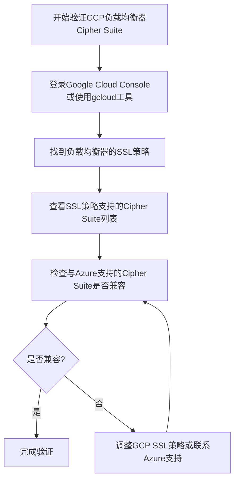

针对你的需求，我将解释如何在GCP（Google Cloud Platform）环境中验证或查询负载均衡器（Load Balancer）上的加密套件（cipher suite）配置。GCP作为源（source），需要检查其负载均衡器支持的cipher suite列表，以确保与目标（Azure）的cipher suite兼容。

以下是详细的步骤和说明，使用Markdown格式输出，并附上必要的流程图以帮助理解。

## 在GCP中验证负载均衡器Cipher Suite的方法

在GCP中，负载均衡器（例如Google Cloud Load Balancer）支持的cipher suite取决于所使用的SSL/TLS策略。你可以通过以下步骤检查和验证负载均衡器的cipher suite配置。

### 1. 检查负载均衡器的SSL策略

GCP的HTTP(S)负载均衡器允许你自定义SSL策略（SSL Policy），其中包含了支持的cipher suite列表。你可以通过Google Cloud Console或`gcloud`命令行工具查看和修改这些策略。

#### 使用Google Cloud Console
1. 登录 [Google Cloud Console](https://console.cloud.google.com/).
2. 导航到 **Network Services** -> **Load balancing**.
3. 选择你的负载均衡器（通常是HTTP(S) Load Balancer）。
4. 在负载均衡器的详细信息页面，找到与目标（Target Proxy）关联的SSL策略。
5. 点击SSL策略名称，查看支持的cipher suite列表以及最低TLS版本。

#### 使用`gcloud`命令行工具
如果你更喜欢命令行，可以使用以下命令查询SSL策略：

```bash
gcloud compute ssl-policies list
```

找到与你的负载均衡器关联的SSL策略名称，然后使用以下命令查看详细信息：

```bash
gcloud compute ssl-policies describe <SSL_POLICY_NAME>
```

输出中会包含`enabledFeatures`字段，其中列出了支持的cipher suite和TLS版本。

### 2. 验证Cipher Suite兼容性

在GCP的SSL策略中，支持的cipher suite通常基于预定义的配置文件（如`COMPATIBLE`、`MODERN`、`RESTRICTED`）。你可以根据需要选择合适的配置文件，或者自定义cipher suite列表。

- **COMPATIBLE**：支持较广泛的cipher suite，兼容性较好，但安全性稍低。
- **MODERN**：仅支持现代、安全的cipher suite，可能不支持旧客户端。
- **RESTRICTED**：最严格，仅支持最高安全性的cipher suite。

如果需要自定义cipher suite列表，可以使用以下命令：

```bash
gcloud compute ssl-policies create <NEW_SSL_POLICY_NAME> \
  --profile CUSTOM \
  --min-tls-version 1.2 \
  --custom-features TLS_ECDHE_ECDSA_WITH_AES_256_GCM_SHA384,TLS_ECDHE_RSA_WITH_AES_256_GCM_SHA384
```

然后将该策略应用到负载均衡器的Target Proxy：

```bash
gcloud compute target-https-proxies update <TARGET_PROXY_NAME> \
  --ssl-policy <NEW_SSL_POLICY_NAME>
```

### 3. 检查与Azure的兼容性

由于Azure作为目标（destination），其cipher suite的选择取决于源（GCP）提供的cipher suite，你需要确保GCP负载均衡器配置的cipher suite与Azure支持的cipher suite兼容。

- 你可以从Azure文档中获取支持的cipher suite列表，或者通过Azure的支持团队确认。
- 使用工具（如`openssl s_client`或在线SSL/TLS检测工具）测试GCP负载均衡器和Azure服务的握手过程，确认实际使用的cipher suite。

例如，使用`openssl`测试GCP负载均衡器的cipher suite：

```bash
openssl s_client -connect <LOAD_BALANCER_IP_OR_DOMAIN>:443
```

输出中会包含协商后的cipher suite信息。

### 4. 可能的注意事项

- 如果GCP和Azure之间无法协商到共同的cipher suite，可能是由于一方支持的cipher suite过于严格或过于宽松。建议从GCP端调整SSL策略，优先尝试`COMPATIBLE`配置。
- 确保TLS版本匹配，GCP和Azure都支持至少TLS 1.2，建议禁用TLS 1.0和1.1以提高安全性。

## 流程图：验证GCP负载均衡器Cipher Suite的步骤



## 总结

通过上述步骤，你可以在GCP中查询和验证负载均衡器的cipher suite配置，并确保其与Azure兼容。如果有进一步的问题，例如具体的cipher suite列表或Azure端的配置方法，请提供更多详细信息，我可以进一步协助。

如果你需要更具体的命令或工具（如使用`openssl`进行更详细的调试），或者希望我提供某个cipher suite的典型配置示例，请随时告知！