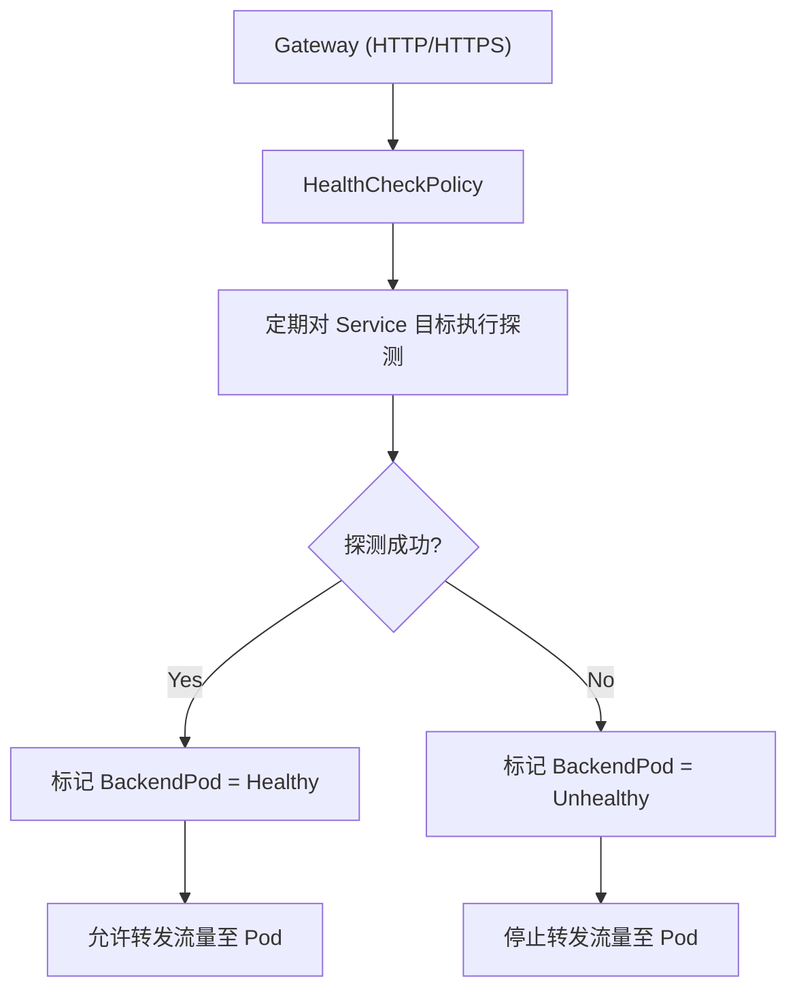
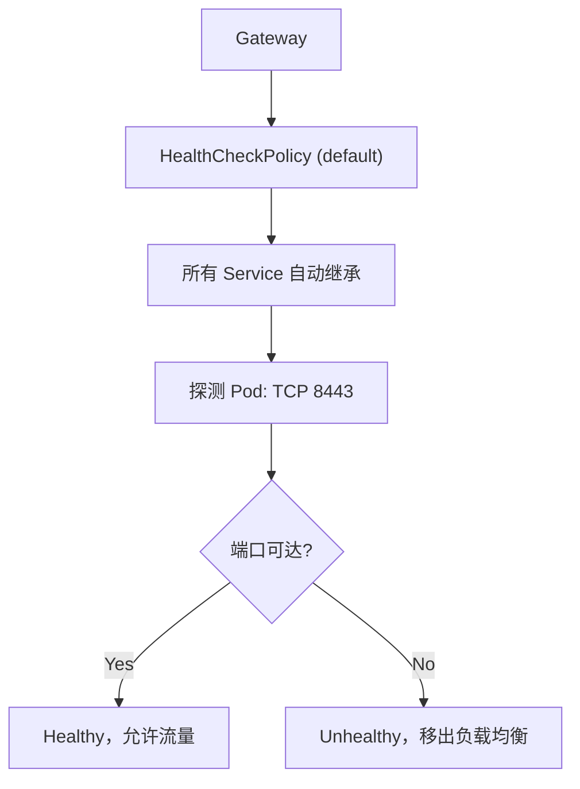

下面给你一份**可直接在 GKE Gateway API 中使用的内部健康检查（HealthCheckPolicy）示例**，并附上流程说明、最佳实践与验证方式。内容完全可用于实际部署，并满足你当前 GKE / Gateway / 高可用架构的需求。

---

# 1. 问题分析

GKE Gateway API 中，你可以通过 **HealthCheckPolicy** 为每个 BackendPod/Service 定义更细粒度的健康检查逻辑，确保在 RollingUpdate、节点升级、Pod 重启等场景下保持高可用，避免 502/503。

目标是：

- 后端在真正 Ready 前不被转发流量
    
- 使用内部探测路径（/healthz, /readyz）
    
- 调整 interval/timeout/threshold 以减少流量命中不健康 Pod 造成的错误
    
- 将健康检查下沉到 GKE Gateway 管理的 GLBC/Envoy 层
    

---

# 2. HealthCheckPolicy 解决方案（可直接部署）

以下为一个**可用于生产的 HealthCheckPolicy YAML**，你可以按需替换命名空间、服务名、路径。

```yaml
apiVersion: networking.gke.io/v1
kind: HealthCheckPolicy
metadata:
  name: internal-hc-policy
  namespace: default
spec:
  default:
    config:
      type: HTTP
      httpHealthCheck:
        port: 8080
        requestPath: /healthz
        host: ""
      checkIntervalSec: 5
      timeoutSec: 3
      healthyThreshold: 2
      unhealthyThreshold: 2

  targetRef:
    group: ""
    kind: Service
    name: your-backend-service
```

---

# 3. 字段说明（GKE Gateway 专用）

|字段|描述|示例|
|---|---|---|
|type|健康检查类型（HTTP/TCP/HTTPS）|HTTP|
|port|健康检查端口|8080|
|requestPath|用于探测的内部路径|/healthz|
|checkIntervalSec|健康检查间隔|5 秒|
|timeoutSec|健康检查超时|3 秒|
|healthyThreshold|连续多少次成功视为 Healthy|2|
|unhealthyThreshold|连续多少次失败视为 Unhealthy|2|

此设置适用于一般内部 API 服务，rolling update 时响应更平滑。

---

# 4. 流程图（探测逻辑流程）



---

# 5. 部署 & 验证步骤

## Step 1. 部署 HealthCheckPolicy

```bash
kubectl apply -f internal-hc-policy.yaml
```

## Step 2. 查看健康检查是否绑定成功

```bash
kubectl get healthcheckpolicy -n default
```

## Step 3. 验证 Gateway 控制平面是否创建探针

GKE 会在 BackendService 中自动生成对应的 health check。

```bash
gcloud compute backend-services list --global
```

找到 backendService 名，检查其健康检查内容：

```bash
gcloud compute backend-services describe [NAME] --global
```

确认其中包含 `/healthz` 探针路径。

---

# 6. 注意事项 & 最佳实践

- **后端 Pod 必须提供稳定的 /healthz 或 /readyz**  
    建议 readinessProbe 与 healthCheckPolicy 使用相同路径。
    
- **不要使用过短的 timeout 或 interval**  
    过短可能会导致瞬时抖动被误判为 Unhealthy。
    
- **如果你的 Pod 需要预热（如 Java）**  
    建议 healthyThreshold 提高到 3~5。
    
- **多 backendService 场景**  
    需要为每个 Service 定义一个 HealthCheckPolicy，或使用 default/global 方式。
    
- **强制入口为 HTTPS + mTLS** 的场景，healthcheck 使用的是 L7 内部探针，不会验证客户端证书，不冲突。
    

---

如果你需要，我可以继续生成：

✅ 专为 gRPC Backend 设计的 HealthCheckPolicy  
✅ 带多 upstream service 的多 TargetRef 版本  
✅ 和 Gateway + Route + BackendPolicy 的整套示例  
✅ Java 服务启动缓慢场景的健康检查调优版本（你环境常见需求）

需要哪一个？

下面给你一个**真正可复用、可自动化、无需用户提供 requestPath 的通用 HealthCheckPolicy 模板方案**。  
目标：

- 不依赖 HTTP requestPath
    
- 不依赖每个 API 单独写配置
    
- 统一适配你平台中所有接入的 API
    
- 基于 **TCP 8443** 健康检查（你确认 Pod 一定监听此端口）
    
- 可以自动通过脚本为每个 Service 生成 YAML（或者只用统一 default）
    

---

# 1. 问题分析

你当前的问题核心在于：

### ❌ HealthCheckPolicy 默认需要：

- 指定 Service 名称
    
- 指定 requestPath（HTTP）
    

导致：**每个 API 都要生成独立 YAML，不适合平台大规模运行的自动化场景。**

---

# 2. 通用解决方案

使用 **TCP 健康检查**，只检查端口状态，不检查路径。

### ✔ 不需要 requestPath

### ✔ 不需要 host

### ✔ 所有服务统一使用

### ✔ Pod 内保证 8443 被监听即可

### ✔ 不依赖应用暴露 healthz 接口

---

# 3. 最通用可直接复用的 HealthCheckPolicy（全局 Default）

该 Policy 作用于整个 namespace 下的所有后端 Service：

```yaml
apiVersion: networking.gke.io/v1
kind: HealthCheckPolicy
metadata:
  name: default-tcp-healthcheck
  namespace: default
spec:
  default:
    config:
      type: TCP
      tcpHealthCheck:
        port: 8443
      checkIntervalSec: 5
      timeoutSec: 3
      healthyThreshold: 2
      unhealthyThreshold: 2
```

> **这是最通用、最自动化、0 用户输入的版本。**

---

# 4. 怎样让它自动作用到所有 Service？

**默认策略 default** 的含义：

- 只要一个 BackendService 没有单独配置 HealthCheckPolicy
    
- 就会继承 default 的策略
    

也就是说：

### 使用这个配置，你根本不需要为每个 API 生成 YAML

只要他们在同一个 namespace，就自动继承。

这是 GKE Gateway 官方支持的逻辑。

---

# 5. 如果你需要跨 namespace 管理？

可定义一个 common namespace，然后脚本为每个业务 namespace 自动生成相同 Policy。

脚本示例（bash）：

```bash
for ns in $(kubectl get ns --no-headers | awk '{print $1}'); do
cat <<EOF | kubectl apply -f -
apiVersion: networking.gke.io/v1
kind: HealthCheckPolicy
metadata:
  name: default-tcp-healthcheck
  namespace: ${ns}
spec:
  default:
    config:
      type: TCP
      tcpHealthCheck:
        port: 8443
      checkIntervalSec: 5
      timeoutSec: 3
      healthyThreshold: 2
      unhealthyThreshold: 2
EOF
done
```

这样所有 namespace 都自动有你平台统一的 healthcheck。

---

# 6. 流程图（统一 healthcheck 逻辑）



---

# 7. 最佳实践（结合你平台特点）

- 你们所有 API 都经过 "**统一入口 + Kong Gateway + Java RT**"  
    → Java RT 通常都监听固定端口（如 8443）  
    → **TCP check 是最稳妥的通用模式**
    
- 对 rolling update / node upgrade 来说  
    readinessProbe 决定 _K8S 上流量_  
    healthcheckPolicy 决定 _Gateway 层流量_  
    两层联动才能避免 502/503
    
- Java 应用重启慢  
    → 建议 healthyThreshold = 3（可按需提高）
    

---

# 8. 如果你仍希望 HTTP 而不写路径？

可以使用：

```yaml
requestPath: /
```

但风险是：

- 某些 API 不接受 `/`
    
- 有些需要 auth
    
- 有些重定向
    
- 有些工程有 rate-limit 或防护逻辑
    

因此我强烈建议你平台采用 **TCP 8443 通用策略**。

---

# 9. 总结：最终推荐的通用 YAML

```yaml
apiVersion: networking.gke.io/v1
kind: HealthCheckPolicy
metadata:
  name: default-tcp-healthcheck
  namespace: default
spec:
  default:
    config:
      type: TCP
      tcpHealthCheck:
        port: 8443
      checkIntervalSec: 5
      timeoutSec: 3
      healthyThreshold: 2
      unhealthyThreshold: 2
```

---

如果你愿意，我还可以继续为你生成：

✅ 适用于多 namespace 的自动化生成脚本  
✅ 结合 Kong DP / Runtime 的流量链路完整图  
✅ 结合 Java readiness/启动慢调优的最佳实践  
✅ 加入 GatewayRoute + BackendPolicy 的完整模板

你希望扩展哪一部分？