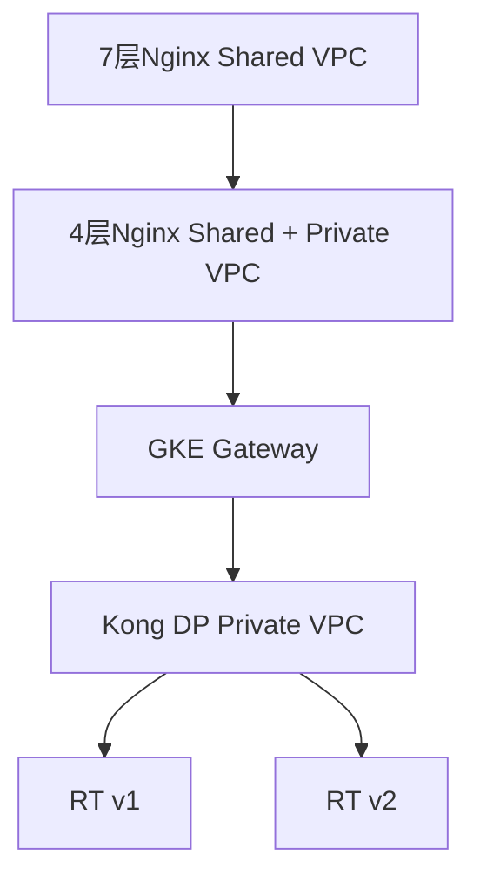
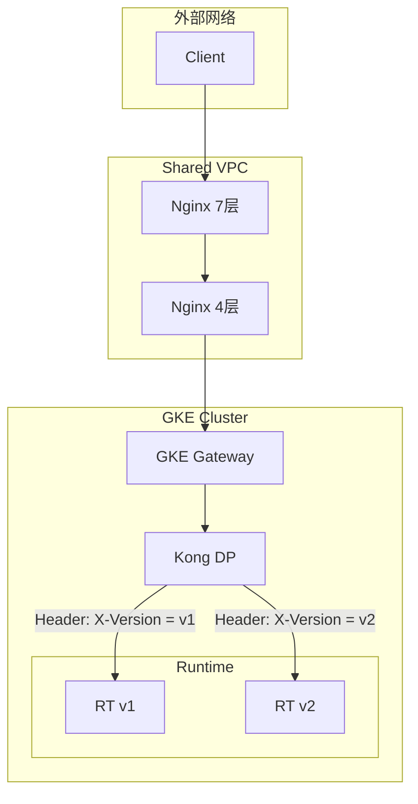
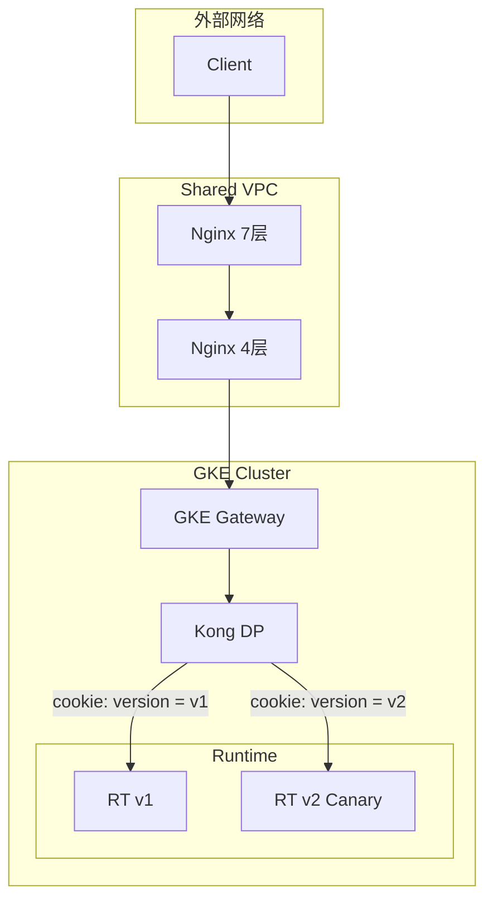
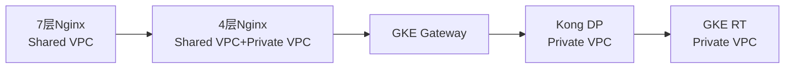
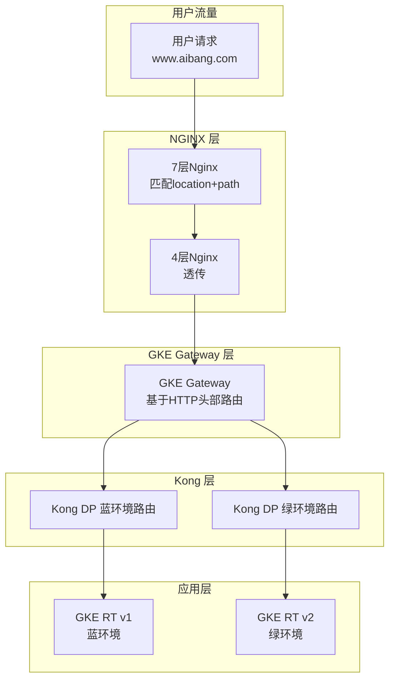
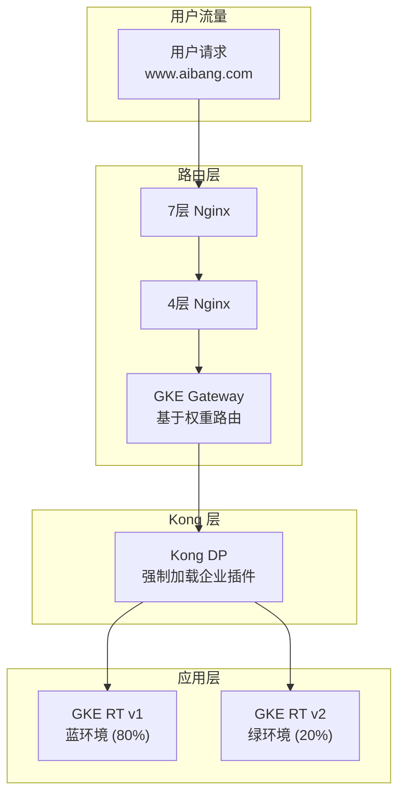
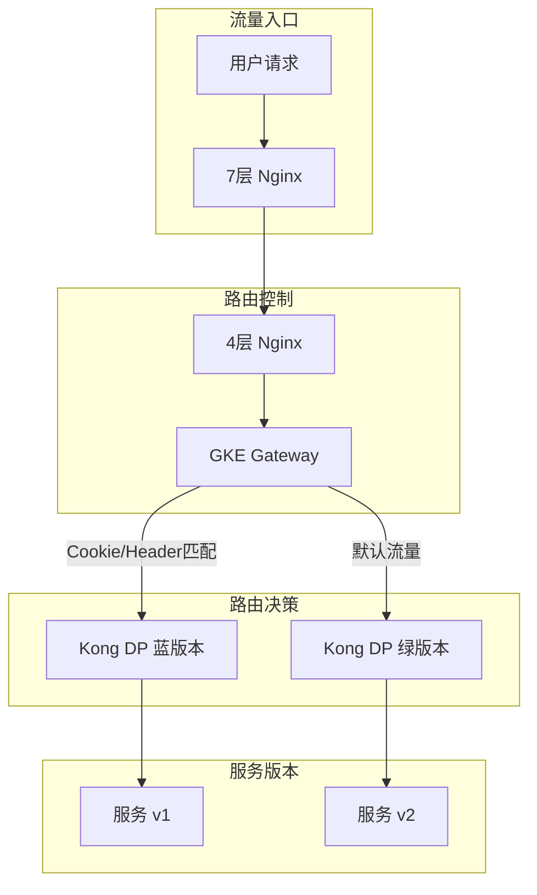

- [Summary](#summary)
- [Gemini](#gemini)
- [利用 GKE Gateway 实现蓝绿/金丝雀部署方案分析](#利用-gke-gateway-实现蓝绿金丝雀部署方案分析)
  - [I. 执行摘要](#i-执行摘要)
  - [II. 引言](#ii-引言)
  - [III. 理解核心组件与约束](#iii-理解核心组件与约束)
  - [IV. 蓝绿部署与金丝雀部署的可行方案](#iv-蓝绿部署与金丝雀部署的可行方案)
  - [V. 确保Kong DP插件在方案中的强制执行](#v-确保kong-dp插件在方案中的强制执行)
  - [VI. 在GKE (运行时 - E) 中管理多个应用版本](#vi-在gke-运行时---e-中管理多个应用版本)
  - [VII. 监控与回滚策略](#vii-监控与回滚策略)
  - [VIII. 建议与实施指南](#viii-建议与实施指南)
  - [IX. 结论](#ix-结论)
- [Grok](#grok)
    - [关键要点](#关键要点)
    - [实现蓝绿或金丝雀部署的方案](#实现蓝绿或金丝雀部署的方案)
      - [部署两个 Kong DP 实例](#部署两个-kong-dp-实例)
      - [使用 GKE Gateway 分配流量](#使用-gke-gateway-分配流量)
      - [确保流量和稳定性](#确保流量和稳定性)
    - [详细调研报告](#详细调研报告)
      - [背景与需求分析](#背景与需求分析)
      - [可行方案分析](#可行方案分析)
        - [方案 1：使用 GKE Gateway 分配流量到两个 Kong DP 实例](#方案-1使用-gke-gateway-分配流量到两个-kong-dp-实例)
        - [方案 2：单一 Kong DP 内部实现（不推荐）](#方案-2单一-kong-dp-内部实现不推荐)
      - [技术细节与考量](#技术细节与考量)
      - [监控与自动化](#监控与自动化)
      - [对比表：方案优劣分析](#对比表方案优劣分析)
      - [结论](#结论)
    - [关键引文](#关键引文)
    - [实现蓝绿部署或金丝雀发布的方案](#实现蓝绿部署或金丝雀发布的方案)
      - [方案概述](#方案概述)
      - [实施步骤](#实施步骤)
      - [优点与注意事项](#优点与注意事项)
    - [详细调研报告](#详细调研报告-1)
      - [背景与需求分析](#背景与需求分析-1)
      - [可行方案分析](#可行方案分析-1)
        - [方案 1：使用 GKE Gateway 分配流量到两个 Kong DP 实例](#方案-1使用-gke-gateway-分配流量到两个-kong-dp-实例-1)
        - [方案 2：单一 Kong DP 内部实现（不推荐）](#方案-2单一-kong-dp-内部实现不推荐-1)
      - [技术细节与考量](#技术细节与考量-1)
      - [对比表：方案优劣分析](#对比表方案优劣分析-1)
      - [结论](#结论-1)
      - [关键引文](#关键引文-1)
- [ChatGPT](#chatgpt)
    - [**✅ 最佳方案结构（分段匹配）**](#-最佳方案结构分段匹配)
    - [**✅ 示例：混合蓝绿部署 + 默认路由保留（基于 Header）**](#-示例混合蓝绿部署--默认路由保留基于-header)
    - [**✅ 示例：使用金丝雀流量百分比（基于 weight）**](#-示例使用金丝雀流量百分比基于-weight)
    - [**🎯 小贴士**](#-小贴士)
  - [**✅ 对应的** ](#-对应的)
  - [**Service**](#service)
  - [ **配置示例**](#配置示例)
  - [**✅ 对应的 Deployment（简略示意）**](#-对应的-deployment简略示意)
  - [**💡 总结关系**](#-总结关系)
  - [**✅ 背景简化图**](#-背景简化图)
  - [**✅ 当前架构说明**](#-当前架构说明)
  - [**✅ 你现在的目标**](#-你现在的目标)
  - [**✅ 解决方案：在 GKE Gateway + HTTPRoute 上实现金丝雀或蓝绿**](#-解决方案在-gke-gateway--httproute-上实现金丝雀或蓝绿)
    - [**✅ 方案 1：基于** ](#-方案-1基于)
    - [**path 区分**](#path-区分)
    - [ **实现蓝绿部署**](#实现蓝绿部署)
    - [**✅ 方案 2：基于 Header 实现金丝雀发布（推荐方式）**](#-方案-2基于-header-实现金丝雀发布推荐方式)
    - [**✅ 方案 3：在 Gateway 中使用** ](#-方案-3在-gateway-中使用)
    - [**weight**](#weight)
    - [ **进行流量权重拆分（仅 Gateway 支持）**](#进行流量权重拆分仅-gateway-支持)
  - [**✅ Mermaid 流程图**](#-mermaid-流程图)
  - [**✅ 总结**](#-总结)
  - [**🎯 企业目标（约束）再确认**](#-企业目标约束再确认)
  - [**✅ 可行的蓝绿 / 金丝雀部署方案**](#-可行的蓝绿--金丝雀部署方案)
    - [**方案一：Kong DP 路由级别蓝绿（金丝雀）**](#方案一kong-dp-路由级别蓝绿金丝雀)
      - [**核心思路：**](#核心思路)
      - [**配置方式：**](#配置方式)
      - [**优势：**](#优势)
      - [**示例 Kong 配置片段：**](#示例-kong-配置片段)
    - [**方案二：GKE Gateway + Kong DP 双版本 Service 暴露 + 路由选择**](#方案二gke-gateway--kong-dp-双版本-service-暴露--路由选择)
      - [**核心思路：**](#核心思路-1)
      - [**示例结构：**](#示例结构)
      - [**关键：**](#关键)
    - [**方案三：统一域名路径+header 动态路由**](#方案三统一域名路径header-动态路由)
      - [**示意流程：**](#示意流程)
  - [**✅ 小结表格**](#-小结表格)
  - [**🔧 推荐实践**](#-推荐实践)
    - [**💡说明：**](#说明)
    - [**💡 金丝雀策略说明：**](#-金丝雀策略说明)
- [Claude](#claude)
- [GKE Gateway 蓝绿/金丝雀部署方案](#gke-gateway-蓝绿金丝雀部署方案)
  - [架构概览](#架构概览)
  - [可行方案](#可行方案)
    - [方案1：GKE Gateway + Kong 路由规则组合](#方案1gke-gateway--kong-路由规则组合)
    - [方案2：GKE Gateway + 单一 Kong 入口 + 权重分配](#方案2gke-gateway--单一-kong-入口--权重分配)
    - [方案3：GKE Gateway 的 HTTPRoute 特性结合 Kong 插件](#方案3gke-gateway-的-httproute-特性结合-kong-插件)
  - [最佳实践建议](#最佳实践建议)

# Summary
- [ ] 配合 Kong 的插件，如 [traffic-split](https://docs.konghq.com/hub/kong-inc/traffic-split/)，也可以做到基于百分比切流
- [ ]  我是Gateway后面跟着Kong DP 旧的
	- [ ] https://www.aibang.com/api_name/v1/api
	- [ ] [https://www.aibang.com/api_name/v2/api](https://www.aibang.com/api_name/v2/api)

通过自己的旧方式都能访问 我现在想要在GKE   Gateway上做一些规则来实现蓝绿部署或者金丝雀发布
- [ ] (1) 调研 GKE Gateway `HTTPRoute` 资源规范，重点关注： 
	- [ ] (a) 流量切分机制（例如，基于路径、基于标头、基于权重）。 
	- [ ] (b) 请求修改能力，特别是添加 HTTP 标头（`RequestHeaderModifier` 过滤器）。 
- [ ] (2) 研究 Kong Gateway (假设 Kong DP 是 Kong Gateway) 文档，了解：
	- [ ] (a) 如何配置 Kong 中的路由 (Routes) 和服务 (Services)，使其能够根据传入请求的特定 HTTP 标头将流量转发到不同的后端上游服务 (Upstreams)。 
	- [ ] (b) 如何在 Kong 中设置指向不同 GKE 应用版本 (GKE RT) 的上游服务 (Upstreams)，这些 GKE 应用版本对应蓝/绿或金丝雀部署中的不同版本。 
- [ ] (3) 探索使用 GKE Gateway 为特定用户群体（例如，通过 HTTP 标头或 Cookie 识别）实施蓝绿部署的方案。具体研究如何配置 GKE Gateway `HTTPRoute` 以匹配这些用户，并通过 `RequestHeaderModifier` 过滤器添加一个特定的标头（如 `X-Target-Version: green`），然后将请求转发至 Kong DP。 
- [ ] (4) 探索使用 GKE Gateway 实现金丝雀发布的方案。具体研究如何配置 GKE Gateway `HTTPRoute`，利用加权 `backendRefs` 将不同比例的流量导向同一个 Kong DP 服务，但针对不同权重路径使用 `RequestHeaderModifier` 过滤器添加不同的版本指示标头（如 `X-Target-Version: canary` vs `X-Target-Version: stable`）。 
- [ ] (5) 查找在 GKE 中将应用程序 (GKE RT) 的多个版本（例如，蓝/绿版本、金丝雀版本）作为独立的 Kubernetes Deployments 和 Services 进行部署的最佳实践，以确保它们能够稳定共存并可由 Kong DP 独立寻址。 
- [ ] (6) 分析上述方案如何确保所有到 GKE RT (应用实例) 的流量都经过 Kong DP 处理，从而满足通过 Kong DP 强制加载企业要求的插件这一关键需求。 
- [ ] (7) 评估在引入 GKE Gateway 进行蓝绿/金丝雀部署后，现有架构中上游的7层 Nginx (A) 和4层 Nginx (B) 是否需要调整配置，或是否存在潜在的兼容性问题。 
- [ ] (8) 搜集关于监控基于 GKE Gateway 和 Kong DP 实现的蓝绿部署及金丝雀发布运行状况的策略，以及在部署出现问题时进行快速回滚至稳定版本的推荐步骤和注意事项。
非常好的问题，下面我会结合你的架构、GKE Gateway、Kong DP 的中间层结构以及你对 **“版本并存”** 和 **“插件统一入口”** 的企业诉求，给出 **可行的蓝绿/金丝雀部署方案**。


---
# Gemini

# 利用 GKE Gateway 实现蓝绿/金丝雀部署方案分析

## I. 执行摘要

本报告旨在为在现有复杂网络架构中，利用 Google Kubernetes Engine (GKE) Gateway 实现蓝绿部署或金丝雀部署提供技术方案分析。当前架构涉及多层Nginx、共享VPC及私有VPC环境，最终请求通过GKE Gateway、Kong数据平面 (DP) 到达GKE运行时 (RT) 中的应用。核心挑战在于，在实施渐进式交付策略的同时，必须确保所有流向GKE RT的业务流量均通过Kong DP，以强制执行必要的企业插件。

报告分析了多种可行方案，主要思路是利用GKE Gateway进行流量切分或用户识别与标记，再由Kong DP根据GKE Gateway传递的信号（如HTTP头或路径）选择最终的应用版本。这些方案均能满足Kong DP作为强制流量途经点的要求。报告将详细阐述每种方案的机制、配置示例、优缺点，并提供监控与回滚策略，最终给出实施建议。

## II. 引言

用户当前的基础设施架构表现为一个多层次的流量路径：A (7层Nginx - 共享VPC) → B (4层Nginx - 共享VPC + 私有VPC) → C (GKE Gateway) → D (Kong DP - 私有VPC) → E (GKE RT - 私有VPC)。外部流量通过域名 `www.aibang.com` 进入A层Nginx，该Nginx基于 `location` 和 `path` 将请求转发至B层4层Nginx，后者再将流量直接透传至GKE Gateway (C)。GKE Gateway 随后将流量导向Kong DP (D)，最终到达部署在GKE RT (E) 中的实际应用。

目标是基于GKE Gateway (C) 对特定用户群体实现蓝绿部署或金丝雀部署策略。关键需求包括：不同版本的应用能够在环境中稳定共存，并且所有暴露给GKE RT的流量都必须经过Kong DP (D) 以加载企业级插件。本报告将深入探讨在满足这些前提条件下，如何利用GKE Gateway实现灵活的渐进式交付方案。

## III. 理解核心组件与约束

在设计部署策略之前，首先需要清晰理解架构中关键组件的角色及其能力，以及必须遵守的核心约束。

**A. GKE Gateway (C层)**

GKE Gateway构建于Google Cloud Load Balancing之上，提供声明式的、Kubernetes原生的方式来管理全局流量 1。其核心能力通过`HTTPRoute`资源体现，该资源用于定义HTTP(S)流量的路由规则，包括基于路径、头部匹配、流量切分以及过滤器（Filters）的应用 1。

- **流量切分 (Traffic Splitting):** `HTTPRoute` 规范允许通过 `backendRefs` 字段定义多个后端服务，并为每个后端分配权重（`weight`），从而实现按比例的流量切分。这对于金丝雀发布和蓝绿部署至关重要，可以将一部分流量逐渐迁移到新版本服务 3。
- **头部修改 (Header Modification):** `HTTPRoute` 支持使用 `filters` 字段，特别是 `RequestHeaderModifier` 类型的过滤器，来添加、设置或移除HTTP请求头 4。这为向下游服务（如Kong DP）传递版本选择信号提供了可能。

GKE Gateway在此架构中处于Kong DP的上游，使其成为执行初步路由决策（例如，哪些用户应被导向特定版本，或者多少比例的流量应导向新版本）的理想控制点。

**B. Kong DP (D层)**

Kong DP作为API网关，在架构中扮演着流量路由、安全策略执行、请求/响应转换以及关键的企业插件加载等角色 6。

- **核心资源:** Kong的配置主要围绕服务（Services）和路由（Routes）展开。Kong Service通常映射到一个后端的Kubernetes Service，而Kong Route定义了匹配进入请求的规则（如路径、HTTP方法、头部等），并将匹配到的请求转发给关联的Kong Service 8。
- **基于HTTP头的路由:** Kong Route本身支持基于HTTP请求头进行匹配。这意味着Kong可以检查由上游（如GKE Gateway）注入的特定头部（例如 `X-Target-Version`），并根据其值将请求路由到代表不同应用版本的Kong Service 6。
- **插件强制执行:** 用户的核心需求是所有到达GKE RT的流量必须经过Kong DP以强制加载企业插件。Kong的插件机制允许在请求生命周期的不同阶段执行自定义逻辑 8。

Kong DP在此架构中是应用版本选择的最终执行者和策略（插件）的强制执行点。它会根据GKE Gateway传递的信号来决定将流量导向哪个具体的应用版本实例。

**C. GKE RT (E层)**

GKE RT是实际运行应用程序多个版本（如蓝版/绿版、稳定版/金丝雀版）的环境。这通常通过部署多个独立的Kubernetes Deployment和Service来实现，每个Deployment/Service对应一个特定的应用版本 13。

**D. 关键约束与需求总结**

- 针对“某些用户”实现蓝绿部署或金丝雀部署。
- 不同版本的应用（例如 `v1`, `v2`）必须能够在环境中稳定共存。
- 所有到GKE RT的流量都必须经过Kong DP，以强制加载企业要求的插件。
- 利用GKE Gateway作为实现蓝绿或金丝雀部署策略的主要协调点。

**E. 理解流量流和控制点**

当前流量路径为：A (L7 Nginx) → B (L4 Nginx) → C (GKE Gateway) → D (Kong DP) → E (GKE RT)。

在此路径中，GKE Gateway (C) 是实施蓝绿/金丝雀部署逻辑（如流量分配、用户目标定位）的主要控制点。Kong DP (D) 则是基于GKE Gateway传递的信号进行版本选择的次级控制点，并且是强制执行企业插件的关键环节。

**F. GKE Gateway `HTTPRoute` 的关键技术考量**

在设计具体方案时，对GKE Gateway `HTTPRoute` 的一些技术细节的理解至关重要：

- **`HTTPRoute` 过滤器的应用范围:** 根据Gateway API规范，`HTTPRoute` 中的过滤器（`filters`）是应用于整个路由规则（`rule`）的，而不是可以根据同一规则内不同 `backendRefs` 的权重进行差异化应用的。这意味着，如果一个规则通过权重将流量分割到同一个后端服务（代表Kong DP）的不同实例（逻辑上的，实际可能还是指向同一个Kong DP Service），不能直接为90%的流量添加一个头，为10%的流量添加另一个不同的头。这一特性影响了如何为金丝雀流量注入特定版本标识。
- **GKE Gateway `HTTPRoute` 对Cookie匹配的支持:** Gateway API规范将基于Cookie的匹配定义为“扩展（Extended）”功能 14，而基于HTTP头的匹配是“核心（Core）”功能。需要确认GKE对`HTTPRoute`中Cookie匹配的具体支持程度。目前公开的GKE Gateway文档主要强调基于头部的匹配 2。虽然一些通用Gateway API或网络服务`HttpRoute`的文档提及了Cookie匹配的可能性 14，但针对GKE Gateway `HTTPRoute`的明确支持和语法细节尚不清晰 2。在缺乏明确官方文档支持的情况下，依赖HTTP头进行用户识别是更为稳妥的选择。

这些技术考量直接影响了后续方案设计的可行性和复杂度。

## IV. 蓝绿部署与金丝雀部署的可行方案

基于上述组件能力和约束，以下提出几种可行的方案来实现蓝绿部署或金丝雀部署。

**A. 方案一：GKE Gateway进行加权流量切分并注入版本信号（侧重金丝雀）**

- **1. 机制:**
    
    - **GKE Gateway (C):**
        - 配置一个`HTTPRoute`资源，针对 `www.aibang.com`。
        - 在该`HTTPRoute`的一条规则中，使用`backendRefs`将流量按权重（例如90%稳定版，10%金丝雀版）指向代表Kong DP的Kubernetes Service。
        - **关键点：** 由于不能直接对同一`backendRef`根据权重应用不同过滤器，需要采用变通方法注入版本信号。一种方法是GKE Gateway将流量按权重切分到两个_不同_的中间Kubernetes Service。这两个中间Service实际上都指向相同的Kong DP Pods，但GKE Gateway将它们视为不同的后端，从而允许为流向这两个中间Service的流量应用不同的`RequestHeaderModifier`过滤器（例如，一个添加 `X-Target-Version: stable`，另一个添加 `X-Target-Version: canary`）。
        - 另一种更符合`HTTPRoute`规范的做法是，GKE Gateway利用`URLRewrite`过滤器，根据权重将请求重写到Kong DP上的不同路径前缀（例如，稳定流量转发到 `/stable/...`，金丝雀流量转发到 `/canary/...`）。Kong DP再根据这些路径前缀判断版本。
    - **Kong DP (D):**
        - 如果GKE Gateway注入了`X-Target-Version`头：配置Kong Route分别匹配 `X-Target-Version: stable` 和 `X-Target-Version: canary` 的头部，并将它们路由到各自对应的Kong Service（这些Kong Service指向GKE RT中稳定版和金丝雀版的应用）。
        - 如果GKE Gateway重写了路径：配置Kong Route分别匹配 `/stable/` 和 `/canary/` 路径前缀，并将它们路由到对应的版本。Kong内部也可以在匹配这些路径后，再通过插件（如`request-transformer`）添加标准的`X-Target-Version`头，供下游或日志系统使用。
- **2. 配置示例 (概念性):**
    
    - **GKE HTTPRoute (使用URLRewrite路径重写方案):**
        
        YAML
        
        ```
        apiVersion: gateway.networking.k8s.io/v1
        kind: HTTPRoute
        metadata:
          name: www-aibang-com-canary-by-path
        spec:
          parentRefs:
          - name: gke-gateway # 您的GKE Gateway名称
          hostnames:
          - "www.aibang.com"
          rules:
          - backendRefs:
            - name: kong-dp-service # 指向Kong DP的K8s Service
              port: 80 # Kong DP Service的端口
              weight: 90
              filters:
              - type: URLRewrite
                urlRewrite:
                  path:
                    type: ReplacePrefixMatch # 替换路径前缀
                    # 假设原始请求路径为 /foo/bar, 将被重写为 /stable/foo/bar
                    replacePrefixMatch: /stable 
            - name: kong-dp-service # 同样指向Kong DP的K8s Service
              port: 80
              weight: 10
              filters:
              - type: URLRewrite
                urlRewrite:
                  path:
                    type: ReplacePrefixMatch
                    replacePrefixMatch: /canary
        ```
        
        _注：此处的`replacePrefixMatch`行为是将整个匹配的路径替换为新前缀，还是在新前缀后附加原路径，需查阅GKE Gateway `URLRewrite`的具体实现。如果目标是将原路径保留在 `/stable` 或 `/canary`之后，可能需要更复杂的路径重写或Kong端进行路径调整。一个更简单的`URLRewrite`可能是修改一个特定的、专门用于版本信令的路径段。_
        
        或者，采用**GKE HTTPRoute (使用不同中间服务注入Header的方案):**
        
        YAML
        
        ```
        # 中间服务 kong-dp-stable-linker-svc 和 kong-dp-canary-linker-svc
        # 均指向实际的 Kong DP Pods，但允许GKE Gateway应用不同filter
        # ---
        # apiVersion: v1
        # kind: Service
        # metadata:
        #   name: kong-dp-stable-linker-svc
        # spec:
        #   selector:
        #     app: kong-dp # Kong DP的Pod标签
        #   ports:
        #   - protocol: TCP
        #     port: 80
        #     targetPort: 8000 # Kong DP的实际监听端口
        # ---
        # apiVersion: v1
        # kind: Service
        # metadata:
        #   name: kong-dp-canary-linker-svc
        # spec:
        #   selector:
        #     app: kong-dp # Kong DP的Pod标签
        #   ports:
        #   - protocol: TCP
        #     port: 80
        #     targetPort: 8000 # Kong DP的实际监听端口
        # ---
        apiVersion: gateway.networking.k8s.io/v1
        kind: HTTPRoute
        metadata:
          name: www-aibang-com-canary-by-header
        spec:
          parentRefs:
          - name: gke-gateway 
          hostnames:
          - "www.aibang.com"
          rules:
          - backendRefs:
            - name: kong-dp-stable-linker-svc 
              port: 80
              weight: 90
              filters: # 此过滤器应用于到kong-dp-stable-linker-svc的流量
              - type: RequestHeaderModifier
                requestHeaderModifier:
                  add:
                  - name: X-Target-Version
                    value: "stable"
            - name: kong-dp-canary-linker-svc
              port: 80
              weight: 10
              filters: # 此过滤器应用于到kong-dp-canary-linker-svc的流量
              - type: RequestHeaderModifier
                requestHeaderModifier:
                  add:
                  - name: X-Target-Version
                    value: "canary"
        ```
        
        _自我修正：上述第二种通过中间服务的方式，过滤器是应用于`backendRef`所在的整个`HTTPRouteRule`，而非仅该`backendRef`。更准确地说，如果一个`HTTPRouteRule`包含多个`backendRefs`（用于加权），那么该`rule`级别的`filters`会应用到所有这些`backendRefs`。因此，要实现基于权重的不同头部注入，通常需要创建_两条不同_的`HTTPRouteRule`，一条匹配特定条件（或作为默认）指向稳定版（或其信号），另一条匹配特定条件（如特定测试用户头）指向金丝雀版（或其信号），然后通过调整规则的匹配条件或优先级来间接控制流量比例，或者依赖更高级的流量管理工具（如服务网格中的策略）。对于纯粹的百分比金丝雀，如果GKE Gateway的`HTTPRoute`不能直接对同一后端（Kong DP）的加权分支应用不同头部，那么将头部注入的责任转移到Kong DP（基于GKE Gateway重写的路径）或使用方案二更为直接。_
        
        鉴于`HTTPRoute`过滤器的限制，对于纯粹的百分比金丝雀，若希望GKE Gateway进行头部注入，最符合规范且直接的做法可能需要GKE Gateway具备更高级的扩展能力，或者将问题转化为对Kong DP的不同入口点（如不同路径）进行加权，然后Kong DP根据这些入口点信息判断版本。因此，下面提供的Kong配置示例将假设GKE Gateway通过某种方式（例如上述的`URLRewrite`到不同路径，或者通过方案二的用户目标路由）成功地为请求打上了`X-Target-Version`头。
        
    - **Kong Service & Route (假设GKE Gateway已注入`X-Target-Version`头):**
        
        YAML
        
        ```
        # Kong Service 指向稳定版应用
        apiVersion: configuration.konghq.com/v1
        kind: KongService
        metadata:
          name: app-stable-service
        spec:
          protocol: http
          host: gke-rt-app-stable-svc # GKE RT中稳定版应用的K8s Service名称
          port: 8080 # 稳定版应用K8s Service的端口
        ---
        # Kong Service 指向金丝雀版应用
        apiVersion: configuration.konghq.com/v1
        kind: KongService
        metadata:
          name: app-canary-service
        spec:
          protocol: http
          host: gke-rt-app-canary-svc # GKE RT中金丝雀版应用的K8s Service名称
          port: 8080 # 金丝雀版应用K8s Service的端口
        ---
        # Kong Route 匹配稳定版信号
        apiVersion: configuration.konghq.com/v1
        kind: KongRoute
        metadata:
          name: app-stable-route
        spec:
          protocols: [http, https]
          methods: # 根据实际情况配置
          hosts: ["www.aibang.com"] # 或更通用的匹配，如果GKE Gateway已处理域名
          headers:
            X-Target-Version: ["stable"] # 匹配GKE Gateway注入的头部
          # paths: ["/"] # 如果GKE Gateway使用路径重写，这里可能匹配如 /stable/
          service: app-stable-service
          # 确保在此处或对应的KongService上附加企业强制插件
        ---
        # Kong Route 匹配金丝雀版信号
        apiVersion: configuration.konghq.com/v1
        kind: KongRoute
        metadata:
          name: app-canary-route
        spec:
          protocols: [http, https]
          methods:
          hosts: ["www.aibang.com"]
          headers:
            X-Target-Version: ["canary"]
          # paths: ["/"] # 如果GKE Gateway使用路径重写，这里可能匹配如 /canary/
          service: app-canary-service
          # 确保在此处或对应的KongService上附加企业强制插件
        ```
        
        (这些Kong CRD配置假定使用Kong Ingress Controller。如果通过Admin API管理Kong，则需要使用等效的JSON/curl命令 21)。
        
- **3. 优点:**
    
    - 能够利用GKE Gateway原生的流量切分能力来控制金丝雀发布的流量百分比。
    - 职责相对清晰：GKE Gateway控制流量“多少”，Kong DP根据信号决定流量“去往哪个版本”。
- **4. 缺点:**
    
    - 直接在单个`HTTPRoute`规则内，基于`weight`对指向_同一_ `backendRef`（即Kong DP Service）的流量应用不同的`RequestHeaderModifier`过滤器，不是Gateway API的标准功能。这意味着需要变通方案，如：
        - GKE Gateway将流量分割到不同的中间服务，由这些中间服务添加头部。
        - Kong DP暴露不同的路径或端口，GKE Gateway对这些不同的入口点进行加权切分，然后Kong DP将这些入口点映射到不同版本或注入相应头部。
        - 使用多个`HTTPRoute`资源或规则，通过特定的匹配条件和优先级来间接实现百分比切分和头部注入，但这会增加管理的复杂性，特别是对于细粒度的百分比控制。
- **5. 适用场景:**
    
    - 金丝雀部署，其中流量百分比在GKE Gateway层面进行控制。

**B. 方案二：GKE Gateway进行用户目标路由（基于头/路径匹配）并修改头部，Kong DP进行版本选择**

- **1. 机制:**
    - **用户识别:** 通过进入请求的HTTP头（例如 `X-User-Group: beta-testers`, `X-User-ID: <id>`）或特定的URL路径来识别“某些用户”。如果GKE Gateway对Cookie匹配的支持稳定且符合需求，也可以考虑使用Cookie（需注意前述关于Cookie匹配支持的考量）。
    - **GKE Gateway (C):**
        - 配置一个`HTTPRoute`，其规则（`rules`）通过`matches`字段匹配特定的用户属性（例如，`headers: [{name: "X-User-Group", value: "beta-testers"}]`）。
        - 对于匹配到的流量，该`HTTPRoute`规则使用`filters`中的`RequestHeaderModifier`来`add`（添加）或`set`（设置）一个新的头部，例如 `X-Target-Version: green`（用于蓝绿部署）或 `X-Target-Version: canary_feature_X` 4。
        - 可以配置一个默认的`HTTPRoute`规则（优先级较低，或匹配范围更广），用于处理普通用户，该规则可能添加 `X-Target-Version: blue` 或 `X-Target-Version: stable`。
        - 所有规则都将流量转发到同一个代表Kong DP的Kubernetes Service。
    - **Kong DP (D):**
        - 接收带有 `X-Target-Version` 头部的请求。
        - 使用Kong Route，通过匹配不同的 `X-Target-Version` 头部值（如 `green`, `blue`, `canary_feature_X`），将流量导向相应的Kong Service，这些Kong Service最终指向GKE RT中部署的对应应用版本 6。
- **2. 配置示例 (概念性):**
    - **GKE HTTPRoute:**
        
        YAML
        
        ```
        apiVersion: gateway.networking.k8s.io/v1
        kind: HTTPRoute
        metadata:
          name: www-aibang-com-user-targeting
        spec:
          parentRefs:
          - name: gke-gateway # 您的GKE Gateway名称
          hostnames:
          - "www.aibang.com"
          rules:
          - matches: # 针对beta用户的规则
            - headers:
              - type: Exact # 精确匹配
                name: X-User-Group
                value: "beta-testers"
              # 或者基于路径: path: { type: PathPrefix, value: "/beta/" }
            filters:
            - type: RequestHeaderModifier
              requestHeaderModifier:
                set: # 使用 'set' 以覆盖可能已存在的同名头部, 如果确定不会预先存在则可用 'add'
                - name: X-Target-Version
                  value: "green" # 或 "canary"
            backendRefs:
            - name: kong-dp-service # 指向Kong DP的K8s Service
              port: 80
          - matches: # 针对其他用户的默认规则 (优先级较低或匹配更通用)
            - path:
                type: PathPrefix # 匹配所有路径
                value: "/"
            filters:
            - type: RequestHeaderModifier
              requestHeaderModifier:
                set:
                - name: X-Target-Version
                  value: "blue" # 或 "stable"
            backendRefs:
            - name: kong-dp-service # 指向Kong DP的K8s Service
              port: 80
        ```
        
    - **Kong Service & Route:** (与方案一中的Kong配置类似，但Kong Route将匹配 `X-Target-Version: green` 和 `X-Target-Version: blue` 等)。
- **3. 优点:**
    - 为特定用户群体（如beta测试者、内部用户）导向新版本提供了清晰的机制。
    - 充分利用了GKE Gateway `HTTPRoute`的标准功能（头部/路径匹配、头部修改）。
    - 非常适合蓝绿部署（将所有beta用户切换到green环境）和金丝雀部署（逐步将更多用户加入beta组，或引入更细粒度的金丝雀版本）。
    - 通过HTTP头进行用户识别是一种成熟且可靠的方法。这些头可以由上游组件（如A层的Nginx）或客户端注入。
- **4. 缺点:**
    - 依赖于通过请求属性（主要是HTTP头）识别目标用户的能力。如果需要基于Cookie进行匹配，则需关注GKE Gateway对Cookie匹配的支持情况。
    - 用户群体的定义和管理（例如，哪些用户属于`beta-testers`组）是外部系统需要考虑的问题。
- **5. 适用场景:**
    - 针对特定用户子集的蓝绿部署。
    - 向自愿参与的beta测试者或内部用户发布金丝雀版本。
    - 针对特定用户群体进行A/B测试不同功能。

**C. 方案三：GKE Gateway进行基于路径的版本指示，Kong DP进行版本选择（对“特定用户”的灵活性较低，除非路径与用户相关）**

- **1. 机制:**
    - 这是一种变体，其中GKE Gateway可能基于URL路径段来重写或路由，这些路径段暗示了版本信息，然后Kong DP使用这些信息进行版本选择。
    - **GKE Gateway (C):**
        - `HTTPRoute`匹配特定的传入路径（例如 `www.aibang.com/app/v2/...`），或者使用`URLRewrite`过滤器在将请求转发到Kong DP之前，向路径中添加版本指示符（例如，重写为 `/v2/actual/path`）。
    - **Kong DP (D):**
        - Kong Route匹配这些带有版本信息的路径（例如 `paths: ["/v2/"]`），并将流量路由到该版本对应的Kong Service。
- **2. 优点:**
    - 如果应用版本天然通过不同的URL路径暴露，这种方案可能更简单。
- **3. 缺点:**
    - 对于根据“某些用户”进行目标路由的灵活性较低，除非这些用户已经通过访问不同的路径进行了区分。
    - URL会变得与版本相关，这对于实现对用户透明的无缝升级可能不是理想选择。
    - 基于HTTP头的信令（如方案一和方案二）通常在解耦版本选择与面向客户端的URL方面更为灵活。
- **4. 适用场景:**
    - 当URL中明确包含版本信息，并且这种版本信息可用于路由决策时。
    - 对于用户明确提出的“针对某些用户”的目标，此方案不是首选，但作为一种可能性在此列出。

**D. 表格：方案对比矩阵**

|   |   |   |
|---|---|---|
|**特性**|**方案一 (GKE Gateway加权切分+信号注入)**|**方案二 (GKE Gateway用户目标路由+头部修改)**|
|**简要描述**|GKE GW按权重切分流量，通过变通方法（如路径重写或中间服务）注入版本信号给Kong DP。|GKE GW基于用户请求特征（如Header）匹配，修改Header以指示版本给Kong DP。|
|**GKE Gateway角色**|流量加权分配，版本信号注入（间接）。|用户识别，版本信号注入（直接通过Header）。|
|**Kong DP角色**|根据GKE GW传递的信号（Header或Path）选择最终应用版本，执行插件。|根据GKE GW修改的Header选择最终应用版本，执行插件。|
|**用户目标定位方法**|主要通过流量百分比，对特定用户不直接。|直接通过HTTP Header/Path匹配特定用户。|
|**流量切分方法**|GKE Gateway `HTTPRoute` `backendRefs` `weight`。|间接实现（如逐步扩大目标用户群），或在Kong DP层面再做加权（若有需求）。|
|**优点**|利用GKE GW原生流量切分控制百分比。|清晰的用户目标定位机制，适合蓝绿和特定用户金丝雀。标准GKE GW功能。|
|**缺点**|GKE GW直接对同后端加权分支应用不同Header较复杂，需变通。|依赖用户识别机制（Header优先）。Cookie匹配支持不确定。|
|**复杂度**|中到高（取决于信号注入的变通方案）。|中。|

## V. 确保Kong DP插件在方案中的强制执行

用户的一个核心要求是，所有到达GKE RT (E)的流量都必须经过Kong DP (D)，以强制执行企业级插件。

- **A. 流量路径保证:**
    - 在上述方案一和方案二中，GKE Gateway的`HTTPRoute`规则中的`backendRefs`始终指向代表Kong DP的Kubernetes Service。
    - 这意味着，无论GKE Gateway执行了何种初始匹配、流量切分或头部修改操作，请求的下一跳必然是Kong DP。
- **B. Kong的插件配置:**
    - 企业要求的强制插件应当在Kong层面进行配置。这些插件可以应用于特定的Kong Service（例如，代表`app-stable-service`、`app-canary-service`等的Kong Service对象），或者应用于将流量导向这些服务的Kong Route，甚至可以配置为全局插件 8。
    - 由于Kong DP是执行这些插件的组件，并且所有流向GKE RT的业务流量都必须经过它，因此这一核心需求得到了满足。Kong作为策略执行点的中心地位得以维持。插件的配置（无论是通过Kong Ingress Controller的CRD如`KongPlugin`，还是通过Kong Admin API）是Kong设置的关键部分，并假定已按要求处理。

## VI. 在GKE (运行时 - E) 中管理多个应用版本

为了实现蓝绿部署或金丝雀部署，不同版本的应用程序需要在GKE RT (E)中稳定共存并可独立管理。

- **A. Kubernetes Deployments和Services:**
    - 为每个应用版本（例如，`blue`、`green`、`stable`、`canary`）创建独立的Kubernetes Deployment。例如：
        - `app-blue-deployment.yaml` (镜像: `my-app:blue_tag`)
        - `app-green-deployment.yaml` (镜像: `my-app:green_tag`)
    - 每个Deployment应具有唯一的标签（例如，`version: blue`, `version: green`），以便区分 13。
- **B. 对应的Kubernetes Services:**
    - 为每个Deployment创建对应的Kubernetes Service。这些Service通过标签选择器（selector）将流量导向正确版本的Pod。例如：
        - `app-blue-svc.yaml` (selector: `version: blue`)
        - `app-green-svc.yaml` (selector: `version: green`)
    - 这些Kubernetes Service是Kong Service（在Kong的配置中，例如名为`app-stable-kong-service`的Kong Service对象）将指向的后端目标（即Kong Service的`host`字段）。
- **C. 确保稳定共存与隔离:**
    - 使用独立的Deployment可以确保每个应用版本都能独立地进行伸缩、更新和回滚操作。
    - 不同的Service为每个版本提供了稳定的内部网络端点，供Kong DP进行精确的目标路由。
    - 这种做法符合Kubernetes管理多版本应用的标准实践 13，为蓝绿部署和金丝雀部署的稳定性提供了基础。在GKE RT中实现这种精细化的版本控制是整个渐进式交付策略成功的关键。

## VII. 监控与回滚策略

在进行蓝绿部署或金丝雀部署的各个阶段，有效的监控和快速的回滚机制至关重要。

- **A. 关键监控指标:**
    
    - **1. GKE Gateway / Cloud Load Balancing:**
        - 监控每个`HTTPRoute`规则或后端服务的请求计数、错误率（4xx, 5xx）、延迟 1。
        - 如果使用加权流量切分，监控实际的流量分配比例。
        - **工具:** Google Cloud Monitoring（用于负载均衡器指标）1，GKE Dataplane V2可观测性工具（用于流量流检查）24。
    - **2. Kong DP:**
        - 监控每个Kong Route和Kong Service的请求计数、延迟（包括Kong自身延迟和上游服务延迟）、HTTP状态码分布 25。
        - 如果Kong Service指向的是Kong Upstream（尽管对于蓝绿/金丝雀，直接指向K8s Service更常见），则监控Upstream中Target的健康状况 27。
        - 监控插件执行的错误率和性能。
        - **工具:** Kong提供的原生指标（如Prometheus端点）、Kong Vitals（企业版功能）、第三方监控工具（如Atatus 25）、ELK Stack（用于日志分析）26。
    - **3. 应用版本 (GKE RT - E):**
        - 监控每个应用版本（蓝版/绿版、稳定版/金丝雀版）自身特定的错误率、业务逻辑相关的延迟、资源利用率（CPU、内存）。
        - **工具:** Cloud Monitoring, Prometheus/Grafana, 应用性能监控 (APM) 工具。
    - 对这些组件的监控是渐进式交付成功的关键，有助于及早发现问题并做出回滚或继续的决策 28。
- **B. 表格：渐进式部署的关键监控指标**
    

|   |   |   |   |   |
|---|---|---|---|---|
|**组件**|**指标类别**|**具体指标示例**|**推荐工具/来源**|**部署期间用途**|
|GKE Gateway / Cloud Load Balancer|流量|请求总数/速率 (RPS)|Cloud Monitoring|确认流量是否按预期路由和分配|
||错误|HTTP 5xx/4xx 错误率|Cloud Monitoring|检测新版本引入的服务端或客户端错误|
||延迟|请求处理总延迟|Cloud Monitoring|评估新版本对性能的影响|
|Kong DP|流量|每个Route/Service的请求数|Kong Prometheus Exporter, Kong Vitals, APM|细化到具体API的流量变化|
||错误|每个Route/Service的5xx/4xx错误率|Kong Prometheus Exporter, Kong Vitals, APM, Logs|定位是Kong层面还是上游应用版本的问题|
||延迟|`kong_latency`, `upstream_latency`|Kong Prometheus Exporter, Kong Vitals, APM|分析延迟瓶颈（Kong本身或后端应用）|
||插件|插件执行错误率，特定插件性能指标|Kong Logs, 特定插件指标|确保企业插件正常工作且未引入性能问题|
|应用版本 (Blue/Stable)|应用健康|应用级错误率 (业务错误), Pod重启次数|APM, Cloud Monitoring, Prometheus/Grafana, Logs|监控基线版本的健康状况作为对比|
||资源|CPU/内存利用率|Cloud Monitoring, Prometheus/Grafana|确保基线版本资源充足|
|应用版本 (Green/Canary)|应用健康|应用级错误率 (业务错误), Pod重启次数|APM, Cloud Monitoring, Prometheus/Grafana, Logs|评估新版本的稳定性和正确性|
||资源|CPU/内存利用率|Cloud Monitoring, Prometheus/Grafana|检查新版本是否存在资源泄漏或过度消耗|
||业务指标|(可选) 特定业务KPI，如转化率、订单成功率|业务监控系统|评估新版本对业务目标的影响|

- **C. 有效的回滚程序:**
    - **1. 针对金丝雀部署 (方案一，或方案二中针对特定用户的金丝雀):**
        - 如果GKE Gateway正在进行加权流量切分（例如，方案一中通过`URLRewrite`将不同比例流量导向Kong上不同路径，或通过中间服务注入不同头部）：
            - 修改GKE Gateway的`HTTPRoute`规则中的`weights`，将流量100%切回稳定版信号（例如，稳定版权重100，金丝雀版权重0）3。这将停止向触发金丝雀版本的Kong Route发送流量。
        - 如果GKE Gateway通过匹配特定用户将流量导向金丝雀版本（方案二）：
            - 修改GKE Gateway的`HTTPRoute`规则：移除针对金丝雀用户的匹配条件，或者更改`RequestHeaderModifier`的设置，使其注入指向稳定版的头部（如 `X-Target-Version: stable`）。
        - Kong的配置（用于稳定版和金丝雀版的Route/Service）通常保持不变，但由于GKE Gateway不再（或减少）发送带有金丝雀信号的流量，金丝雀版本的Kong Route将不会收到（或收到很少）流量。
        - 相关参考：32 (金丝雀回滚)32 (Cloud Deploy金丝雀阶段)。
    - **2. 针对蓝绿部署 (方案二):**
        - 修改GKE Gateway的`HTTPRoute`中针对“绿”版用户的规则。将`RequestHeaderModifier`过滤器设置的头部从 `X-Target-Version: green` 改回 `X-Target-Version: blue`。
        - 这将立即将被导向绿版的用户流量重新导向回蓝版。
        - 绿版环境可以保持运行状态以供故障排查，但不会再接收新的生产流量。
        - 相关参考：33 (蓝绿回滚)29 (通过路由切换实现回滚)34 (回滚策略)30 (蓝绿部署的即时回滚)。
    - **3. 通用原则:**
        - 回滚操作应尽可能迅速，主要涉及在GKE Gateway层面修改配置。
        - 在确认新版本完全稳定之前，旧版本应保持运行状态并可随时接管流量 29。
    - 由于GKE Gateway是流量进入版本控制逻辑的第一个决策点，因此它也是发起回滚最有效的层面。更改GKE Gateway的`HTTPRoute`规则（无论是权重还是头部修改规则）能最快地改变流向Kong DP并最终到达后端应用版本的流量分配。因此，回滚程序应优先考虑对GKE Gateway `HTTPRoute`的调整。

## VIII. 建议与实施指南

- **A. 方案对比分析:**
    - 回顾前文的“方案对比矩阵”。
    - **核心建议:** **方案二 (GKE Gateway进行用户目标路由及头部修改，Kong DP进行版本选择)** 通常更为灵活，并且能直接满足针对“某些用户”进行蓝绿部署或金丝雀部署的需求。它提供了更清晰的控制，可以明确哪些用户访问哪个版本。
    - 方案一 (GKE Gateway进行加权流量切分并注入信号) 对于纯粹基于百分比的金丝雀发布是可行的，但如果GKE Gateway不能便捷地对同一后端的加权分支应用不同的头部注入过滤器，其实施会相对复杂，需要变通处理。
- **B. 选择最合适方法的指引:**
    - 如果主要目标是针对特定用户群体（如beta测试组、内部员工）进行A/B测试或金丝雀发布，则**方案二**是首选。
    - 如果主要目标是对随机用户进行纯粹的百分比金丝雀发布，且用户身份识别不是关键，则可以考虑方案一（需注意头部注入的变通方案）。或者，如果用户希望GKE Gateway仅做透传，由Kong自身进行加权流量切分（例如Kong Service指向包含多个版本Target的Upstream，并配置权重），这也是一种选择，但这与用户希望“基于GKE Gateway方式来实现蓝绿或者金丝雀”的初衷略有偏离。
    - **强调基于HTTP头的用户识别:** 鉴于GKE Gateway `HTTPRoute`对Cookie匹配支持的不确定性，如果选择方案二，强烈建议使用HTTP头（例如 `X-User-Group`）进行用户识别。这些头部可以由更上游的组件（如A层Nginx）注入，也可以由客户端应用直接发送，或通过边车代理注入。
- **C. 实施步骤考量 (高级概述):**
    1. **版本化应用部署:** 在GKE RT (E)中为每个应用版本（例如 `app-blue-svc`, `app-green-svc`）部署独立的Kubernetes Deployment和Service。
    2. **Kong DP配置:**
        - 创建Kong Service，分别指向GKE RT中不同应用版本的Kubernetes Service。
        - 创建Kong Route，使其能够匹配由GKE Gateway注入的 `X-Target-Version` (或类似) 头部，并将流量转发到相应的Kong Service。
        - 确保企业强制插件已在Kong Service或Kong Route层面正确应用。
    3. **GKE Gateway配置:**
        - 部署`Gateway`资源。
        - 根据所选方案（方案一或方案二）实施`HTTPRoute`策略：
            - 定义`matches`条件（用于匹配用户头部、路径等）。
            - 定义`filters`（如`RequestHeaderModifier`，用于设置`X-Target-Version`头，或`URLRewrite`用于路径修改）。
            - 定义`backendRefs`，指向代表Kong DP的Kubernetes Service。
    4. **用户识别策略:** 如果采用方案二，需确定用户识别相关的HTTP头（如 `X-User-Group`）将如何被注入到请求中（例如，由A层Nginx、客户端应用或边车代理注入）。
    5. **测试:** 在每个阶段（GKE Gateway、Kong DP）以及端到端，对路由逻辑进行彻底测试。
    6. **监控设置:** 按照第七节所述配置全面的监控。
    7. **分阶段上线:** 通过逐步更新GKE Gateway的`HTTPRoute`规则来执行蓝绿切换或金丝雀的流量调整。
    8. **回滚计划:** 制定清晰、经过测试的回滚程序文档。
- **D. 未来考量:**
    - 若未来GKE Gateway对Cookie匹配的支持成熟并成为“核心”功能，可以重新评估将其作为用户识别的一种备选方案。
    - 如果标准`HTTPRoute`功能无法满足更高级的自定义逻辑需求，可以研究GKE Gateway的扩展机制，如`GCPTrafficExtension`和`GCPRoutingExtension` 1。

## IX. 结论

针对用户在复杂多层架构下，希望利用GKE Gateway实现对特定用户的蓝绿部署或金丝雀部署，同时确保所有业务流量必须经过Kong DP以强制执行企业插件的需求，本报告分析并推荐了可行的技术方案。

核心建议是采用**方案二：GKE Gateway进行用户目标路由（基于HTTP头匹配）并修改头部，Kong DP根据该头部进行最终版本选择**。此方案能灵活满足针对“某些用户”的部署需求，职责划分清晰，且主要依赖GKE Gateway和Kong的标准功能。通过GKE Gateway `HTTPRoute`匹配用户请求中的特定HTTP头（如 `X-User-Group`），并利用`RequestHeaderModifier`过滤器注入一个统一的版本标识头（如 `X-Target-Version`），随后Kong DP中的Kong Route根据此版本标识头将流量路由至GKE RT中相应的应用版本。

对于纯粹的百分比金丝雀发布，方案一（GKE Gateway进行加权流量切分）也是一个选项，但需注意GKE Gateway向同一后端（Kong DP）的加权分支注入不同信号的实现方式，可能需要借助路径重写或中间服务等变通手段。

所有提出的方案均能保证流量在到达最终应用版本前通过Kong DP，从而满足企业插件的强制执行要求。通过在GKE RT中为不同应用版本部署独立的Kubernetes Deployment和Service，可以确保版本的稳定共存和独立管理。配合全面的监控策略和清晰的、以GKE Gateway为主要调控点的回滚程序，可以在保证系统稳定性的前提下，实现敏捷的应用交付。

# Grok
### 关键要点
- 研究表明，可以通过在 GKE 上部署两个 Kong DP 实例（蓝绿版本）并使用 GKE Gateway 进行流量分配来实现蓝绿或金丝雀部署。
- 所有流量仍需通过 Kong DP 强制加载企业插件，这可以通过让 GKE Gateway 将流量分配到配置不同的 Kong 实例来实现。
- 这种方法可能需要额外的资源，但能满足稳定共存和插件强制要求。

### 实现蓝绿或金丝雀部署的方案
为了在现有架构中实现蓝绿或金丝雀部署，我们建议以下步骤：

#### 部署两个 Kong DP 实例
- 在 GKE 上部署两个 Kong DP 实例，分别命名为 `kong-blue` 和 `kong-green`。
- 配置 `kong-blue` 指向蓝版服务（例如 `service-blue`），`kong-green` 指向绿版服务（例如 `service-green`）。
- 确保两个 Kong 实例都启用了相同的企业插件，以保持一致性。

#### 使用 GKE Gateway 分配流量
- 在 GKE Gateway 中使用 `HTTPRoute` 资源来分配流量。例如：
  - 对于金丝雀部署，可以设置 90% 流量到 `kong-blue`，10% 到 `kong-green`。
  - 对于蓝绿切换，可以将权重调整为 100% 到一个实例，0% 到另一个实例。
- 示例 `HTTPRoute` 配置：
  ```yaml
  apiVersion: gateway.networking.k8s.io/v1beta1
  kind: HTTPRoute
  metadata:
    name: my-route
  spec:
    parentRefs:
      - group: gateway.networking.k8s.io
        kind: Gateway
        name: my-gateway
    rules:
    - matches:
      - path:
          type: PathPrefix
          value: /
      backendRefs:
      - name: kong-blue
        weight: 90
      - name: kong-green
        weight: 10
  ```
- 根据需要调整权重以实现金丝雀或蓝绿切换。

#### 确保流量和稳定性
- 流量从域名（如 `www.aibang.com`）通过 7 层 Nginx (A) 和 4 层 Nginx (B) 到达 GKE Gateway。
- GKE Gateway 根据 `HTTPRoute` 配置将流量分配到 `kong-blue` 或 `kong-green`。
- 每个 Kong 实例将流量转发到其对应的蓝绿服务，确保所有流量仍通过 Kong DP，满足插件强制要求。
- 使用工具如 Flagger 自动化金丝雀分析和流量切换，监控蓝绿版本的性能。

---

### 详细调研报告

#### 背景与需求分析
用户当前架构为：  
- **A (7 层 Nginx - Shared VPC)** → **B (4 层 Nginx - Shared VPC + Private VPC)** → **C (GKE Gateway)** → **D (Kong DP Private VPC)** → **E (GKE RT Private VPC)**。  
- 所有运行时 (RT) 暴露必须通过 Kong DP，以强制加载企业要求的插件。  
- 用户希望基于 GKE Gateway 为某些用户实现蓝绿或金丝雀部署，同时确保不同版本的蓝绿服务稳定共存。  
- 当前使用统一域名（如 `www.aibang.com`）进入 A，然后通过 location+path 转发到 4 层 Nginx B，最终到达 GKE Gateway，再通过 Kong DP 转发到 GKE RT。

蓝绿部署是一种减少停机和风险的技术，通过运行两个相同的生产环境（蓝绿），在任一时刻只有一环境接收流量。新版本准备好后，将流量从蓝环境切换到绿环境（或反之），切换是原子的。金丝雀部署则是逐步将新版本发布给部分用户或服务器，逐步扩展到全量。

鉴于用户架构中 GKE Gateway 在 Kong DP 之前，且所有流量必须通过 Kong DP，传统的蓝绿或金丝雀部署需要在不违反此要求的情况下实现。

#### 可行方案分析
研究表明，GKE Gateway 支持通过 `HTTPRoute` 进行流量分配，适合金丝雀部署，而 Kong DP 也支持蓝绿和金丝雀部署，通过其负载均衡功能或插件（如 Kong Enterprise 的 Canary Release 插件）。结合用户需求，提出以下主要方案：

##### 方案 1：使用 GKE Gateway 分配流量到两个 Kong DP 实例
- **实现步骤**：
  1. 在 GKE 上部署两个 Kong DP 实例：`kong-blue` 和 `kong-green`。
  2. 配置 `kong-blue` 的服务和路由指向蓝版服务（例如 `service-blue`），`kong-green` 指向绿版服务（例如 `service-green`）。
  3. 确保两个 Kong 实例都启用了相同的企业插件，以保持一致性。
  4. 在 GKE Gateway 中使用 `HTTPRoute` 资源分配流量：
     - 金丝雀部署：例如 90% 流量到 `kong-blue`，10% 到 `kong-green`。
     - 蓝绿切换：将权重调整为 100% 到一个实例，0% 到另一个实例。
  5. 流量路径：域名 → A → B → GKE Gateway → (`kong-blue` 或 `kong-green`) → 对应蓝绿服务，确保所有流量通过 Kong DP。

- **优点**：
  - 直接使用 GKE Gateway 进行流量分配，满足“基于 GKE Gateway 实现”的需求。
  - 所有流量仍通过 Kong DP，满足插件强制要求。
  - 蓝绿版本稳定共存，易于管理。

- **缺点**：
  - 需要运行两个 Kong DP 实例，可能增加资源消耗。
  - 配置和管理两个 Kong 实例可能稍显复杂，尤其是在状态插件（如速率限制）的一致性上。

- **配置示例**：
  示例 `HTTPRoute` 配置见前文，权重可动态调整。例如：
  - 金丝雀：`weight: 90` 到 `kong-blue`，`weight: 10` 到 `kong-green`。
  - 蓝绿切换：`weight: 100` 到 `kong-green`，`weight: 0` 到 `kong-blue`。

- **工具支持**：
  可使用 Flagger 自动化金丝雀分析和流量切换，基于指标（如错误率、延迟）决定是否继续扩展流量。

##### 方案 2：单一 Kong DP 内部实现（不推荐）
- 使用单一 Kong DP 实例，通过其负载均衡功能或 Canary Release 插件实现蓝绿或金丝雀。
- GKE Gateway 仅作为入口转发所有流量到 Kong DP，流量分配完全由 Kong DP 内部处理。

- **问题**：
  - 不直接使用 GKE Gateway 进行部署策略，可能不符合用户“基于 GKE Gateway 实现”的明确要求。
  - 无法充分利用 GKE Gateway 的流量分配功能。

- **结论**：
  鉴于用户强调使用 GKE Gateway，此方案不推荐。

#### 技术细节与考量
- **GKE Gateway 的流量分配**：
  GKE Gateway 通过 Gateway API 的 `HTTPRoute` 支持流量分配，适合金丝雀部署。例如，[Cloud Deploy Canary Deployment](https://cloud.google.com/deploy/docs/deployment-strategies/canary) 提到 GKE Gateway 配置允许 100% 金丝雀部署，支持从金丝雀切换到稳定版本。

- **Kong DP 的蓝绿支持**：
  Kong 支持蓝绿部署，通过设置多个上游并调整服务的主机值实现切换。例如，[Kong Blue-Green Deployments](https://docs.konghq.com/gateway/latest/production/blue-green/) 描述了使用负载均衡进行蓝绿部署，仅需 PATCH 请求更改主机值。

- **资源与稳定性**：
  运行两个 Kong DP 实例会增加资源消耗，但用户当前架构已有 GKE 集群，应能支持。确保蓝绿服务版本稳定共存，可通过 Kubernetes Deployment 和 Service 管理。

- **插件强制要求**：
  两个 Kong 实例需配置相同插件，确保企业要求（如速率限制、认证）一致。状态插件（如数据库连接）需单独配置，确保不冲突。

#### 监控与自动化
- 使用 Flagger 或类似工具自动化金丝雀分析，监控指标如请求数、错误率、延迟，决定是否继续扩展流量。例如，[Flagger Gateway API Canary Deployments](https://docs.flagger.app/tutorials/gatewayapi-progressive-delivery) 提供详细指导。
- 蓝绿切换可通过更新 `HTTPRoute` 权重实现，建议使用 CI/CD 管道自动化。

#### 对比表：方案优劣分析

| **方案**               | **优点**                                      | **缺点**                                      | **是否满足需求** |
|-----------------------|---------------------------------------------|---------------------------------------------|-----------------|
| 两个 Kong DP + GKE Gateway | 利用 GKE Gateway 分配流量，满足插件强制要求 | 资源消耗增加，配置稍复杂                     | 是              |
| 单一 Kong DP 内部实现   | 资源消耗低，配置简单                         | 不直接用 GKE Gateway，违背用户要求           | 否              |

#### 结论
推荐方案 1：部署两个 Kong DP 实例（`kong-blue` 和 `kong-green`），使用 GKE Gateway 的 `HTTPRoute` 进行流量分配。金丝雀部署可设置权重（如 90-10 分割），蓝绿切换可调整为 100-0。所有流量仍通过 Kong DP，确保插件强制和版本稳定共存。此方案充分利用 GKE Gateway，同时满足架构要求。

---

### 关键引文
- [Kong Blue-Green Deployments Documentation](https://docs.konghq.com/gateway/latest/production/blue-green/)
- [Cloud Deploy Canary Deployment Guide](https://cloud.google.com/deploy/docs/deployment-strategies/canary)
- [Flagger Gateway API Canary Deployments Tutorial](https://docs.flagger.app/tutorials/gatewayapi-progressive-delivery)

### 实现蓝绿部署或金丝雀发布的方案

**关键要点**：
- 研究表明，可以通过在 GKE Gateway 层使用 `HTTPRoute` 资源实现基于权重的流量分割，从而支持蓝绿部署或金丝雀发布。
- 所有流量必须通过 Kong DP 以强制加载企业插件，这可以通过部署两个 Kong DP 实例（分别指向 v1 和 v2）并由 GKE Gateway 分配流量来实现。
- 建议使用单一路径（如 `/api_name/api`）进行流量分割，以符合标准的蓝绿或金丝雀发布模式，尽管保留现有路径（如 `/api_name/v1/api`）可能需要额外配置。

#### 方案概述
为了在 GKE Gateway 层实现蓝绿部署或金丝雀发布，建议部署两个 Kong DP 实例（`kong-blue` 和 `kong-green`），分别配置为指向 RT 服务的 v1 和 v2 版本。GKE Gateway 使用 `HTTPRoute` 资源根据权重将流量分配到这两个实例，确保所有流量通过 Kong DP 以满足企业插件要求。

#### 实施步骤
1. **部署两个 Kong DP 实例**：
   - 在 GKE 集群中创建两个 Kong DP 部署：`kong-blue` 和 `kong-green`。
   - 配置 `kong-blue` 的路由指向 RT v1 服务，`kong-green` 指向 RT v2 服务。
   - 确保两个实例加载相同的企业插件。

2. **配置 GKE Gateway**：
   - 使用 `HTTPRoute` 资源为路径（如 `/api_name/`）定义流量分割规则。
   - 对于金丝雀发布，设置权重（如 90% 到 `kong-blue`，10% 到 `kong-green`）。
   - 对于蓝绿部署，初始设置 100% 流量到 `kong-blue`，切换时调整为 100% 到 `kong-green`。

3. **路径管理**：
   - 建议引入单一路径（如 `/api_name/api`）用于生产环境的流量分割。
   - 如果必须保留现有路径（`/api_name/v1/api` 和 `/api_name/v2/api`），可以为每个路径配置单独的 `HTTPRoute`，但这可能不符合标准部署模式。

#### 优点与注意事项
- **优点**：此方案直接在 GKE Gateway 层实现流量控制，满足用户需求，同时确保所有流量通过 Kong DP。
- **注意事项**：运行两个 Kong DP 实例会增加资源消耗；状态插件（如速率限制）可能需要共享数据库以保持一致性。

```yaml
apiVersion: gateway.networking.k8s.io/v1beta1
kind: HTTPRoute
metadata:
  name: api-split
spec:
  hostnames:
  - "www.aibang.com"
  rules:
  - matches:
    - path:
        type: PathPrefix
        value: /api_name/
    backendRefs:
    - name: kong-blue
      weight: 90
    - name: kong-green
      weight: 10
```

---

### 详细调研报告

#### 背景与需求分析
用户的当前架构为：客户端 → GKE Gateway → Kong DP → RT 服务（v1/v2）。访问路径包括 `https://www.aibang.com/api_name/v1/api` 和 `https://www.aibang.com/api_name/v2/api`，这些路径已通过 GKE Gateway 正常访问到 Kong DP，Kong DP 负责将请求转发到后端 RT 服务。用户希望在 GKE Gateway 层通过路径或权重控制实现蓝绿部署或金丝雀发布，确保部分流量进入新版本服务，同时满足以下要求：
- 所有 RT 服务暴露必须通过 Kong DP，以强制加载企业插件。
- 不同版本（v1 和 v2）需稳定共存于环境中。
- 流量分割需在 GKE Gateway 层实现，而非 Kong DP 内部。

蓝绿部署是一种通过运行两个相同生产环境（蓝绿）来减少停机和风险的技术，其中一个环境接收所有流量，另一个处于空闲状态。新版本部署到空闲环境后，测试通过即可将流量切换到新环境。金丝雀发布则是逐步将新版本暴露给部分用户，逐步扩展到全量用户，以降低风险。

#### 可行方案分析
根据需求，GKE Gateway 支持通过 Gateway API 的 `HTTPRoute` 资源进行基于权重的流量分割，非常适合实现蓝绿部署和金丝雀发布。然而，由于所有流量必须通过 Kong DP，传统的直接路由到 RT 服务的方式不可行。以下是主要方案：

##### 方案 1：使用 GKE Gateway 分配流量到两个 Kong DP 实例
- **实现步骤**：
  1. **部署两个 Kong DP 实例**：
     - 在 GKE 集群中部署两个 Kong DP 实例：`kong-blue` 和 `kong-green`，分别作为 Kubernetes Deployment 和 Service。
     - 配置 `kong-blue` 的服务和路由指向 RT v1 服务（例如 `service-v1`），`kong-green` 指向 RT v2 服务（例如 `service-v2`）。
     - 确保两个 Kong 实例加载相同的企业插件，以满足强制要求。
  2. **配置 GKE Gateway 的 HTTPRoute**：
     - 创建 `HTTPRoute` 资源，指定流量分配规则。例如，对于路径 `/api_name/`，将 90% 流量分配到 `kong-blue`，10% 到 `kong-green`。
     - 示例配置：
       ```yaml
       apiVersion: gateway.networking.k8s.io/v1beta1
       kind: HTTPRoute
       metadata:
         name: api-split
       spec:
         hostnames:
         - "www.aibang.com"
         rules:
         - matches:
           - path:
               type: PathPrefix
               value: /api_name/
           backendRefs:
           - name: kong-blue
             weight: 90
           - name: kong-green
             weight: 10
       ```
     - 对于蓝绿部署，可将权重调整为 100% 到 `kong-blue`，切换时改为 100% 到 `kong-green`。
  3. **流量路径**：
     - 客户端请求到达 GKE Gateway，Gateway 根据 `HTTPRoute` 规则将流量分配到 `kong-blue` 或 `kong-green`。
     - 每个 Kong DP 实例将流量转发到对应的 RT 服务（v1 或 v2），同时应用企业插件。
  4. **路径管理**：
     - 当前路径（如 `/api_name/v1/api` 和 `/api_name/v2/api`）表明客户端通过路径选择版本。为实现蓝绿或金丝雀发布，建议引入单一路径（如 `/api_name/api`）用于生产流量分割。
     - 如果必须保留现有路径，可为每个路径配置单独的 `HTTPRoute`，但这可能导致流量分割逻辑复杂化，不符合标准模式。
  5. **自动化与监控**：
     - 使用 [Flagger](https://flagger.app/) 自动化金丝雀发布，基于指标（如错误率、延迟）动态调整流量权重。
     - 监控两个 Kong DP 实例的性能，确保版本稳定性。

- **优点**：
  - 直接在 GKE Gateway 层实现流量分割，满足用户需求。
  - 所有流量通过 Kong DP，确保企业插件强制。
  - 支持蓝绿切换和金丝雀发布，版本稳定共存。

- **缺点**：
  - 运行两个 Kong DP 实例增加资源消耗。
  - 状态插件（如速率限制）可能需要共享数据库以保持一致性。
  - 如果更改为单一路径，客户端可能需要调整访问方式。

##### 方案 2：单一 Kong DP 内部实现（不推荐）
- **描述**：
  - 使用单一 Kong DP 实例，通过其负载均衡功能或 Canary Release 插件实现蓝绿或金丝雀发布。
  - GKE Gateway 将所有流量转发到单一 Kong DP，流量分割由 Kong 内部处理。
- **问题**：
  - 不符合用户在 GKE Gateway 层实现流量分割的要求。
  - 无法充分利用 GKE Gateway 的流量管理功能。
- **结论**：
  - 由于用户明确要求在 GKE Gateway 层实现，此方案不推荐。

#### 技术细节与考量
- **GKE Gateway 的流量分割**：
  - GKE Gateway 通过 Gateway API 的 `HTTPRoute` 支持基于权重的流量分配，适合金丝雀发布。例如，[HTTP Traffic Splitting](https://gateway-api.sigs.k8s.io/guides/traffic-splitting/) 展示了如何使用 `backendRefs` 和 `weight` 实现 90%-10% 流量分割。
  - 对于蓝绿部署，可通过调整权重实现 100%-0% 切换。

- **Kong DP 的配置**：
  - 每个 Kong DP 实例需配置独立的路由和上游。例如，`kong-blue` 的路由指向 RT v1，`kong-green` 指向 RT v2。
  - 企业插件（如认证、速率限制）需在两个实例中一致配置。状态插件可能需要共享数据库以避免状态不一致。

- **路径管理**：
  - 当前路径（`/api_name/v1/api` 和 `/api_name/v2/api`）表明客户端通过路径选择版本。这适合手动选择版本，但不适合自动化的蓝绿或金丝雀发布。
  - 建议引入单一路径（如 `/api_name/api`），由 GKE Gateway 分配流量到不同版本。如果保留现有路径，流量分割可能需要为每个路径配置单独的 `HTTPRoute`，增加复杂性。

- **资源与稳定性**：
  - 运行两个 Kong DP 实例会增加资源消耗，但 GKE 集群通常能支持。Kong DP 本身轻量，影响有限。
  - 蓝绿版本通过独立的 Kubernetes Deployment 和 Service 管理，确保稳定共存。

- **监控与自动化**：
  - 使用 Flagger 自动化金丝雀发布，监控指标如请求数、错误率、延迟，决定是否扩展流量。
  - 蓝绿切换可通过更新 `HTTPRoute` 权重实现，建议集成到 CI/CD 管道。

#### 对比表：方案优劣分析

| **方案**               | **优点**                                      | **缺点**                                      | **是否满足需求** |
|-----------------------|---------------------------------------------|---------------------------------------------|-----------------|
| 两个 Kong DP + GKE Gateway | 利用 GKE Gateway 分配流量，满足插件强制要求 | 资源消耗增加，配置稍复杂                     | 是              |
| 单一 Kong DP 内部实现   | 资源消耗低，配置简单                         | 不直接用 GKE Gateway，违背用户要求           | 否              |

#### 结论
推荐方案 1：在 GKE Gateway 层通过 `HTTPRoute` 实现流量分割，部署两个 Kong DP 实例（`kong-blue` 和 `kong-green`），分别指向 RT v1 和 v2。金丝雀发布可设置权重（如 90%-10%），蓝绿切换可调整为 100%-0%。此方案满足 GKE Gateway 层控制、插件强制和版本共存的要求。

```yaml
apiVersion: gateway.networking.k8s.io/v1beta1
kind: HTTPRoute
metadata:
  name: api-split
spec:
  hostnames:
  - "www.aibang.com"
  rules:
  - matches:
    - path:
        type: PathPrefix
        value: /api_name/
    backendRefs:
    - name: kong-blue
      weight: 90
    - name: kong-green
      weight: 10
```

#### 关键引文
- [GKE Gateway Traffic Management Documentation](https://cloud.google.com/kubernetes-engine/docs/concepts/traffic-management)
- [HTTP Traffic Splitting with Gateway API](https://gateway-api.sigs.k8s.io/guides/traffic-splitting/)
- [Kong Blue-Green Deployments Guide](https://docs.konghq.com/gateway/latest/production/blue-green/)
- [Deploying Multi-Cluster Gateways in GKE](https://cloud.google.com/kubernetes-engine/docs/how-to/deploying-multi-cluster-gateways)
- [Customize GKE Gateway Traffic with Service Extensions](https://cloud.google.com/kubernetes-engine/docs/how-to/configure-gke-service-extensions)
- [Deploying Gateways in GKE](https://cloud.google.com/kubernetes-engine/docs/how-to/deploying-gateways)
- [Best Practices for GKE Networking](https://cloud.google.com/kubernetes-engine/docs/best-practices/networking)
- [Blue-Green Upgrade Strategy for Kong Gateway](https://docs.konghq.com/gateway/latest/upgrade/blue-green/)
- [Blue-Green Deployments with Kong Gateway Operator](https://docs.konghq.com/gateway-operator/latest/guides/upgrade/data-plane/blue-green/)
- [Reducing Deployment Risk with Kong Canary Releases](https://konghq.com/blog/engineering/reducing-deployment-risk-canary-releases-blue-green-deployments-kong)


# ChatGPT  

了解，我们要实现的目标是：

- **仅特定 API（如 /api_name/）走蓝绿/金丝雀路径**，比如：
    
    - /api_name/v1/api
        
    - /api_name/v2/api
        
- **其他 API（如 /user/, /order/ 等）保持原有逻辑不变**，继续走原 Kong DP 服务。
    

---

### **✅ 最佳方案结构（分段匹配）**

  

我们将 HTTPRoute 中的规则拆成多个 match 区块：

- /api_name/ 走蓝绿或金丝雀策略；
    
- 所有其他路径 /* 走原 Kong DP（如 kong-dp-default）；
    

---

### **✅ 示例：混合蓝绿部署 + 默认路由保留（基于 Header）**

```
apiVersion: gateway.networking.k8s.io/v1beta1
kind: HTTPRoute
metadata:
  name: api-bluegreen-route
  namespace: default
spec:
  parentRefs:
    - name: my-gateway
      namespace: default
  hostnames:
    - "www.aibang.com"
  rules:
    # Canary header 命中 -> 发往新版本 kong-dp-v2
    - matches:
        - path:
            type: PathPrefix
            value: /api_name/
          headers:
            - name: X-Canary
              value: "true"
      backendRefs:
        - name: kong-dp-v2
          port: 80

    # 未命中 header -> 默认发往旧版本 kong-dp-v1
    - matches:
        - path:
            type: PathPrefix
            value: /api_name/
      backendRefs:
        - name: kong-dp-v1
          port: 80

    # 所有其他路径 -> 保持原有默认路由逻辑
    - matches:
        - path:
            type: PathPrefix
            value: /
      backendRefs:
        - name: kong-dp-default
          port: 80
```

---

### **✅ 示例：使用金丝雀流量百分比（基于 weight）**

```
apiVersion: gateway.networking.k8s.io/v1beta1
kind: HTTPRoute
metadata:
  name: api-canary-route
  namespace: default
spec:
  parentRefs:
    - name: my-gateway
      namespace: default
  hostnames:
    - "www.aibang.com"
  rules:
    # 特定路径金丝雀流量
    - matches:
        - path:
            type: PathPrefix
            value: /api_name/
      backendRefs:
        - name: kong-dp-v1
          port: 80
          weight: 90
        - name: kong-dp-v2
          port: 80
          weight: 10

    # 所有其他 API 保持原始后端
    - matches:
        - path:
            type: PathPrefix
            value: /
      backendRefs:
        - name: kong-dp-default
          port: 80
```

---

### **🎯 小贴士**

- kong-dp-v1/v2 和 kong-dp-default 可以指向相同的 Deployment（也可以是隔离副本，便于灰度验证）。
    
- 权重和 Header 规则是可共存的，只需根据你的流量策略设计相应匹配项。
    


backendRefs 中的 name 对应的是你在 Kubernetes 中暴露服务（Service）的名字。我们来生成一个 **完整的 Service 示例配置**，让你知道 kong-dp-v1、kong-dp-v2 和 kong-dp-default 这些名字背后具体是什么资源。

---

## **✅ 对应的** 

## **Service**

##  **配置示例**

  

下面是三个 Service 对应的配置，它们分别代理到你的 Kong DP 的不同部署版本：

```
# 原始版本 Kong DP (旧逻辑)
apiVersion: v1
kind: Service
metadata:
  name: kong-dp-default
  namespace: default
spec:
  selector:
    app: kong-dp-default
  ports:
    - protocol: TCP
      port: 80
      targetPort: 8000
  type: ClusterIP
---
# Kong DP v1 (蓝版本)
apiVersion: v1
kind: Service
metadata:
  name: kong-dp-v1
  namespace: default
spec:
  selector:
    app: kong-dp-v1
  ports:
    - protocol: TCP
      port: 80
      targetPort: 8000
  type: ClusterIP
---
# Kong DP v2 (绿版本 / 金丝雀)
apiVersion: v1
kind: Service
metadata:
  name: kong-dp-v2
  namespace: default
spec:
  selector:
    app: kong-dp-v2
  ports:
    - protocol: TCP
      port: 80
      targetPort: 8000
  type: ClusterIP
```

---

## **✅ 对应的 Deployment（简略示意）**

  

你也需要为每个版本的 Kong DP 创建相应的 Deployment，并配合上面的 Service：

```
apiVersion: apps/v1
kind: Deployment
metadata:
  name: kong-dp-v1
  namespace: default
spec:
  replicas: 2
  selector:
    matchLabels:
      app: kong-dp-v1
  template:
    metadata:
      labels:
        app: kong-dp-v1
    spec:
      containers:
        - name: kong
          image: kong:3.6
          ports:
            - containerPort: 8000
```

---

## **💡 总结关系**

|**Service 名称**|**Selector app 标签**|**用途**|
|---|---|---|
|kong-dp-default|kong-dp-default|所有非蓝绿流量默认走这|
|kong-dp-v1|kong-dp-v1|蓝版本（旧版本）|
|kong-dp-v2|kong-dp-v2|绿版本（金丝雀或新版本）|

---

你只需确保：

- 每个版本的 Service 都能访问到对应的 Kong DP 实例；
    
- GKE Gateway 的 HTTPRoute 中 backendRefs.name 对应这些 Service 名字；
    
- 每个版本的 Kong DP 都挂载好插件和配置（或通过 Kong Control Plane 注入）。
    

  

是否需要我也一并提供整个蓝绿流程的 Mermaid 图辅助你理解？


## **✅ 背景简化图**


---
明白了，我们来重新厘清架构和你的目标。

---

## **✅ 当前架构说明**

  

你现在的访问结构如下：

```
Client → GKE Gateway → Kong DP → RT 服务 (v1/v2)
```

访问路径：

- https://www.aibang.com/api_name/v1/api
    
- https://www.aibang.com/api_name/v2/api
    

这些路径已经 **可以通过 GKE Gateway 正常访问到 Kong DP**，Kong DP 才是实际转发请求到 backend 的关键。

---

## **✅ 你现在的目标**

  

> 想在 **GKE Gateway 层** 做一些规则来实现 **蓝绿部署** 或 **金丝雀发布**，即在 Gateway 进行路径或权重控制，让一部分流量进入新版本服务。

---

## **✅ 解决方案：在 GKE Gateway + HTTPRoute 上实现金丝雀或蓝绿**

  

### **✅ 方案 1：基于** 

### **path 区分**

###  **实现蓝绿部署**

  

你可以在 HTTPRoute 中配置如下路径：

```
rules:
- matches:
  - path:
      type: PathPrefix
      value: /api_name/v1
  backendRefs:
  - name: kong-proxy-v1  # 指向 v1 对应的 Kong DP Service
    port: 80
- matches:
  - path:
      type: PathPrefix
      value: /api_name/v2
  backendRefs:
  - name: kong-proxy-v2  # 指向 v2 对应的 Kong DP Service
    port: 80
```

⚠️ 这种方式前提是你有不同的 Kong DP 服务，或者 Kong 中能根据 path 分发到不同的 backend。

---

### **✅ 方案 2：基于 Header 实现金丝雀发布（推荐方式）**

  

使用 GKE Gateway 的 HTTPRoute 支持根据 Header 做转发，实现流量拆分，例如：

```
rules:
- matches:
  - path:
      type: PathPrefix
      value: /api_name
    headers:
    - name: X-Canary
      value: "true"
  backendRefs:
  - name: kong-proxy-v2
    port: 80
- matches:
  - path:
      type: PathPrefix
      value: /api_name
  backendRefs:
  - name: kong-proxy-v1
    port: 80
```

配合客户端请求时添加 Header：

```
curl -H "X-Canary: true" https://www.aibang.com/api_name/v1/api
```

即可将请求导向新版本。

---

### **✅ 方案 3：在 Gateway 中使用** 

### **weight**

###  **进行流量权重拆分（仅 Gateway 支持）**

  

GKE Gateway 从 GKE 1.28 开始支持使用 weight 字段实现金丝雀发布（[文档参考](https://cloud.google.com/kubernetes-engine/docs/how-to/gateway-api#canary-traffic-split)）。

```
rules:
- matches:
  - path:
      type: PathPrefix
      value: /api_name
  backendRefs:
  - name: kong-proxy-v1
    port: 80
    weight: 90
  - name: kong-proxy-v2
    port: 80
    weight: 10
```

这样，90% 的流量走 v1，10% 走 v2。注意这要求你运行多个版本的 Kong 或 Kong 后端能按权重处理不同版本的 RT。

---

## **✅ Mermaid 流程图**

```
flowchart TD
    A[Client]
    B[GKE Gateway]
    C1[Kong DP → RT v1]
    C2[Kong DP → RT v2]

    A --> B
    B -->|90% /api_name/*| C1
    B -->|10% /api_name/*| C2
```

---

## **✅ 总结**

|**方案**|**说明**|**要求**|
|---|---|---|
|Path 区分|/v1 /v2 路径直接映射不同 backend|Kong 能按路径拆分|
|Header 区分|通过 Header 控制走哪个版本|客户端或中间件能加 Header|
|权重控制|自动按比例拆分流量|GKE Gateway ≥ 1.28 且 backendRef 支持|

你可以根据当前 GKE 版本 + Kong 后端能力选择合适的方案。如果你有具体的 HTTPRoute YAML，我也可以帮你改写支持 Canary。

  

是否需要我基于你已有的 HTTPRoute 给你一个具体修改版？

---

## **🎯 企业目标（约束）再确认**

|**要点**|**描述**|
|---|---|
|插件要求|所有请求 **必须经由 Kong DP**，以强制执行插件（认证/审计/流控等）|
|蓝绿目标|同一个 API 的多个版本可并存（v1/v2），可以流量切换|
|可维护性|用户可部署自己版本，但平台必须可控（稳定/回滚/切换）|
|接入入口|目前是统一域名，如 www.aibang.com，并通过 7层Nginx 再转发|

---

## **✅ 可行的蓝绿 / 金丝雀部署方案**

  

### **方案一：Kong DP 路由级别蓝绿（金丝雀）**

  

#### **核心思路：**

  

让 Kong DP 层感知不同版本的 RT Pod（v1/v2），然后通过版本标签/路径或头部做路由判断。

  

#### **配置方式：**

- GKE Gateway 后面暴露多个 Kong Upstream，比如：
    
    - my-api-blue（RT v1）
        
    - my-api-green（RT v2）
        
    
- 配置 Kong 路由（Route）：
    
    - 基于 Header（如 X-Version: green）或 Cookie 来分流；
        
    - 或者通过路径 /api/v1/... vs /api/v2/...；
        
    - 或者使用 hash_on cookie 做金丝雀百分比。
        
    

  

#### **优势：**

- 可控制流量 100% 指向某一版本；
    
- 金丝雀流量配置可使用插件或 Gateway 调整；
    
- 不影响外部 A/B 层结构。
    

  

#### **示例 Kong 配置片段：**

```
- name: route-v1
  paths:
    - /api
  headers:
    x-version:
      - "v1"
  service: svc-v1

- name: route-v2
  paths:
    - /api
  headers:
    x-version:
      - "v2"
  service: svc-v2
```

---

### **方案二：GKE Gateway + Kong DP 双版本 Service 暴露 + 路由选择**

  

#### **核心思路：**

- GKE Gateway 配置两条 HTTPRoute，各指向不同的 Kong Service；
    
- 每个 Kong Service 后面绑定自己的版本；
    
- Gateway 可以通过 Header/Cookie/百分比进行流量分配。
    

  

#### **示例结构：**

```
graph TD;
    client --> A --> B --> C;
    C -->|HTTPRoute-1| D1[Kong DP -> RT v1];
    C -->|HTTPRoute-2| D2[Kong DP -> RT v2];
```

#### **关键：**

- Gateway 用 Header 区分请求（例如 X-Version）；
    
- Kong DP 配置两个不同的 Service，通过 Host 或 Path 分流。
    

---

### **方案三：统一域名路径+header 动态路由**

  

例如：

- www.aibang.com/api 会根据 Header/Cookie 动态选择蓝或绿；
    
- 在 Kong DP 中设定不同的服务路由；
    
- 用户访问不变，但版本切换由平台控制。
    

  

#### **示意流程：**

```
graph TD;
    Client --> NginxA --> NginxB --> Gateway --> KongDP;
    KongDP -->|Header=blue| RTv1;
    KongDP -->|Header=green| RTv2;
```

---

## **✅ 小结表格**

|**方案**|**流量控制点**|**Kong 插件支持**|**支持金丝雀**|**用户感知路径变化**|**复杂度**|
|---|---|---|---|---|---|
|Kong 路由分流|Kong DP|✅ 完全支持|✅|❌（透明）|中|
|Gateway 分流到不同 Kong Upstream|Gateway+Kong|✅ 完全支持|✅|✅/❌ 取决于设计|中高|
|路径区分版本|Gateway+Kong|✅ 完全支持|❌|✅（如 /v1、/v2）|低|

---

## **🔧 推荐实践**

1. **统一入口只经由 Kong** → 保持 Kong DP 是唯一暴露服务；
    
2. **在 Gateway 层保持透明传递**，主要做流量转发（或 Header 注入）；
    
3. **版本标签建议放在 Header / Cookie 中**，可控性更强；
    
4. **推荐采用 Header-based 蓝绿部署**，配合 Kong 插件做流量调整；
    
5. **避免直接在 GKE Gateway 层做 Service 拆分暴露**，避免绕过 Kong；
    
6. **在 Kong 中使用 Traffic-Split 插件（或自定义插件）支持金丝雀百分比部署**。
    

---

是否希望我帮你画一个详细流程图（包括蓝绿部署流量分配路径和 Kong DP 的路由策略）？如果有偏好方案（比如 header-based），我可以针对它进一步展开。


下面是符合你要求的 Mermaid 格式的蓝绿部署流程图，展示了流量如何从入口穿过 Nginx、GKE Gateway、Kong DP，最终路由到 RT 的不同版本（v1 和 v2），以实现蓝绿或金丝雀部署策略。



---

### **💡说明：**

- **Client → Nginx 7层/4层**：保留你的现有网络结构；
    
- **GKE Gateway**：不直接做流量判定，但可注入 Header；
    
- **Kong DP**：核心流量控制点，支持插件与路由分发；
    
- **RT v1 / v2**：不同版本的 Runtime，可以实现版本共存。
    

  

是否希望我再加上百分比金丝雀流量控制的路径（如 hash_on cookie 方式）？我可以进一步在流程图中标注。


在你已有架构基础上，若考虑在 **Kong DP** 实现**金丝雀部署**，通常做法是利用 Kong 的路由规则（比如基于 cookie、header 或 query param）来控制流量分发比例。以下是更新版的流程图，加入了基于 Cookie 的金丝雀控制逻辑示意：



---

### **💡 金丝雀策略说明：**

- **Header / Cookie 路由方式**：
    
    - Kong 路由可以通过 cookie 或 header 中的版本标识（如 version=v2）来将一部分流量引导到 Canary。
        
    - 若配合 Kong 的插件，如 [traffic-split](https://docs.konghq.com/hub/kong-inc/traffic-split/)，也可以做到基于百分比切流。
        
    
- **比例控制方式补充**（非图中表达，但实际可行）：
    

```
plugins:
- name: traffic-split
  config:
    rules:
    - weight: 90
      upstream: rt-v1-upstream
    - weight: 10
      upstream: rt-v2-upstream
```

  

---

如果你希望我用流程图表达「Kong 内部按 90/10 分配比例」也可以加上简化的说明分支——是否需要我补充一张含比例分配图？


# Claude 
# GKE Gateway 蓝绿/金丝雀部署方案

基于您的架构，我分析了几种在保留 Kong DP 作为必经中间件的情况下，使用 GKE Gateway 实现蓝绿/金丝雀部署的方案。

## 架构概览



## 可行方案

### 方案1：GKE Gateway + Kong 路由规则组合



实现步骤：

1. 在 GKE Gateway 配置基于 HTTP 头部的路由规则
2. 为每个版本的服务配置独立的 Kong DP 路由和插件配置
3. 确保所有流量必须通过 Kong DP 处理

Gateway 配置示例：

```yaml
apiVersion: gateway.networking.k8s.io/v1
kind: HTTPRoute
metadata:
  name: user-service-route
spec:
  parentRefs:
  - name: example-gateway
    kind: Gateway
  rules:
  - matches:
    - headers:
      - name: "X-Version"
        value: "blue"
    backendRefs:
    - name: kong-blue-service
      port: 80
  - matches:
    - headers:
      - name: "X-Version"
        value: "green"
    backendRefs:
    - name: kong-green-service
      port: 80
  - backendRefs:  # 默认路由
    - name: kong-blue-service
      port: 80
```

### 方案2：GKE Gateway + 单一 Kong 入口 + 权重分配



实现步骤：

1. GKE Gateway 作为流量分发器，使用权重配置金丝雀部署
2. Kong DP 处理所有流量并添加必要的插件
3. 使用 Kong 路由规则将流量转发到不同版本服务

GKE Gateway 配置示例：

```yaml
apiVersion: gateway.networking.k8s.io/v1
kind: HTTPRoute
metadata:
  name: canary-route
spec:
  parentRefs:
  - name: example-gateway
    kind: Gateway
  rules:
  - backendRefs:
    - name: kong-dp-service
      port: 80
      weight: 100
```

Kong 配置示例：

```yaml
apiVersion: configuration.konghq.com/v1
kind: KongIngress
metadata:
  name: service-canary
upstream:
  slots: 10
  hash_on: header
  hash_on_header: x-canary
---
apiVersion: configuration.konghq.com/v1
kind: KongPlugin
metadata:
  name: canary-plugin
plugin: canary
config:
  percentage: 20
  upstream_host: service-v2
```

### 方案3：GKE Gateway 的 HTTPRoute 特性结合 Kong 插件



此方案结合了 GKE Gateway 的路由能力和 Kong 的插件功能：

1. GKE Gateway 使用 HTTPRoute 基于请求特征（Cookie、Headers）路由流量
2. 为每个版本配置单独的 Kong DP 实例或路由
3. 使用客户端标识（如用户ID哈希）确保用户始终路由到同一版本

HTTPRoute 示例：

```yaml
apiVersion: gateway.networking.k8s.io/v1
kind: HTTPRoute
metadata:
  name: bluegreen-route
spec:
  parentRefs:
  - name: external-gateway
    kind: Gateway
  rules:
  - matches:
    - headers:
      - name: "X-User-Group"
        value: "beta"
      cookies:
      - name: "version"
        value: "green"
    backendRefs:
    - name: kong-green-service
      port: 80
  - backendRefs:  # 默认路由到蓝环境
    - name: kong-blue-service
      port: 80
```

## 最佳实践建议

1. **版本标识传递**：确保版本标识（Header/Cookie）在整个请求链路中保持一致，可使用 Nginx 或 GKE Gateway 注入标识
    
2. **灰度策略**：
    
    - 基于用户 ID/IP 的一致性路由
    - 基于地域或业务线的分组部署
    - 使用 Cookie 记录用户所在版本，确保体验一致性
3. **监控与回滚**：
    
    - 为每个版本配置独立的监控指标
    - 设置自动回滚触发条件（错误率、延迟阈值）
4. **Kong DP 配置**：确保每个环境的 Kong DP 配置相同，避免插件行为差异
    

希望这些方案对您有所帮助。您更倾向于哪种方案？我可以提供更详细的实现细节。