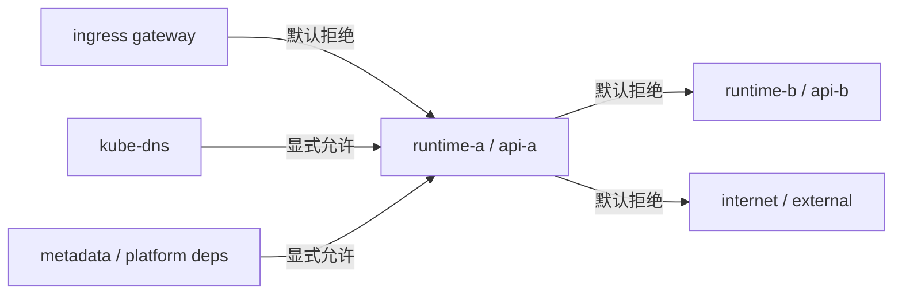
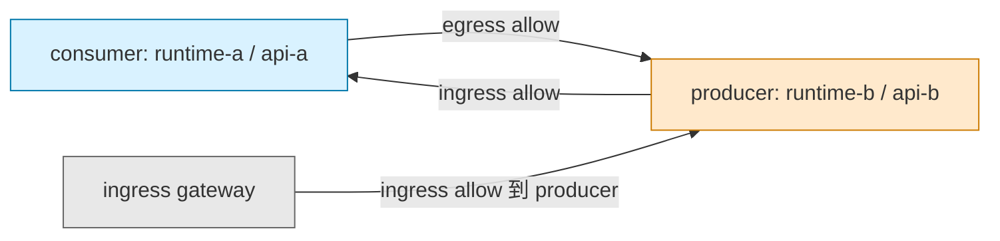
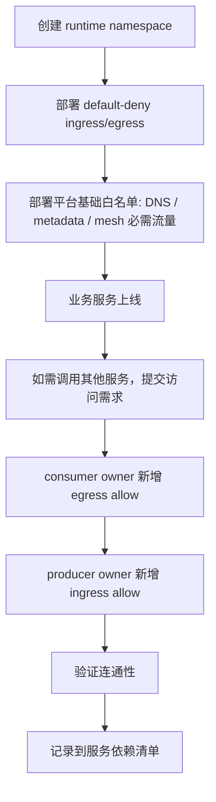

# GKE Runtime Namespace NetworkPolicy 设计与落地

## 1. Goal And Constraints

### 1.1 目标

在 GKE 集群中，我们有多个 runtime namespace。

核心诉求是：

- runtime namespace 之间默认不能互通
- namespace 内部 pod-to-pod 默认也不能自由互通
- 如果某个服务要访问另一个服务，必须显式放通
- 放通模型遵循最小权限原则
- 流程上类似 PSC：
  - producer 负责开放自己的 ingress
  - consumer 负责开放自己的 egress
- policy 由 API owner 负责声明和部署

### 1.2 当前环境假设

- 平台：GKE
- Service Mesh：Google 管理的 Istio / Cloud Service Mesh
- 工作负载：按 runtime namespace 隔离
- 目标：L3/L4 网络隔离由 `NetworkPolicy` 落地，L7 身份和鉴权由 Istio 补充

### 1.3 结论

这个需求是可以实现的，而且是 GKE 上非常标准的一种做法：

`default deny ingress + default deny egress + explicit allow rules`

对于你的场景，推荐把它固化成 namespace onboarding 标准模板。

---

## 2. Can It Be Implemented

可以。

在 GKE 中，只要一个 namespace 里有 `NetworkPolicy` 选中了 Pod，那么未被显式允许的流量就会被拒绝。  
因此你完全可以把每个 runtime namespace 设计成：

1. 先落一条默认拒绝 ingress/egress 的策略
2. 再按需求补最小白名单
3. 跨 namespace 调用时，必须同时满足：
   - consumer namespace 的 egress allow
   - producer namespace 的 ingress allow

这和你说的 PSC 思路是对齐的。

---

## 3. Recommended Principles

### 3.1 基本原则

| 原则 | 说明 |
|---|---|
| 默认拒绝 | 每个 runtime namespace 默认拒绝所有 ingress 和 egress |
| 双向授权 | 调用链路要成功，consumer 要放 egress，producer 要放 ingress |
| 最小范围 | 优先按 `namespaceSelector + podSelector + ports` 精确放通 |
| 平台例外最小化 | 只放 DNS、metadata、mesh/control-plane、ingress gateway 等必要流量 |
| L3/L4 与 L7 分层 | `NetworkPolicy` 只管网络连通，服务身份和 URL/Method/JWT 由 Istio `AuthorizationPolicy` 处理 |
| 模板化 | namespace 默认策略、平台白名单、服务间调用白名单都模板化 |

### 3.2 不建议的做法

| 不建议 | 原因 |
|---|---|
| 只做 ingress deny，不做 egress deny | 容易出现隐式外联和横向探测 |
| 用 `ipBlock` 大范围放通 Pod 网段 | 可维护性差，也容易误伤 |
| 所有 runtime namespace 共享一条宽泛 allow policy | 破坏租户隔离边界 |
| 指望 Istio 自动替代 NetworkPolicy | Istio 不是 Pod 网络隔离的替代品 |

---

## 4. Recommended Architecture

### 4.1 V1 架构

| 层级 | 职责 |
|---|---|
| Kubernetes `NetworkPolicy` | namespace 间和 namespace 内的 L3/L4 隔离 |
| Istio / Cloud Service Mesh | mTLS、服务身份、L7 授权、流量治理 |
| Namespace Owner / API Owner | 管理本 namespace 的 allow policy |
| Platform Team | 提供默认 deny 模板、平台例外模板、审核规则 |

### 4.2 职责边界

| 角色 | 负责内容 |
|---|---|
| Platform Team | 默认 deny、DNS 白名单、metadata 白名单、mesh 必需白名单模板 |
| API Owner | 自己服务需要的 ingress / egress allow policy |
| Security / Platform Governance | 审核跨 namespace 放通是否必要 |

---

## 5. Traffic Model

### 5.1 默认模型



### 5.2 显式放通模型



### 5.3 执行流程



---

## 6. Policy Design Pattern

### 6.1 每个 runtime namespace 至少有三类策略

| 类型 | 是否必须 | 目的 |
|---|---|---|
| default deny all ingress/egress | 必须 | 建立默认零信任边界 |
| platform essential allow | 必须 | 保证 DNS、metadata、mesh 必需流量 |
| app-specific allow | 按需 | 允许特定调用关系 |

### 6.2 推荐标签规范

建议先统一 namespace label 和 pod label，否则后面 policy 很难模板化。

#### Namespace labels

```yaml
metadata:
  labels:
    platform.aibang.io/type: runtime
    platform.aibang.io/name: runtime-a
    kubernetes.io/metadata.name: runtime-a
```

#### Pod labels

```yaml
metadata:
  labels:
    app.kubernetes.io/name: api-a
    app.kubernetes.io/part-of: runtime-a
    security.aibang.io/access-tier: internal
```

---

## 7. Baseline Policies

下面给一套建议模板。

### 7.1 Default Deny All

这个策略一旦生效，namespace 内被选中的 Pod 默认既不能入也不能出。

```yaml
apiVersion: networking.k8s.io/v1
kind: NetworkPolicy
metadata:
  name: default-deny-all
  namespace: runtime-a
spec:
  podSelector: {}
  policyTypes:
  - Ingress
  - Egress
```

### 7.2 Allow DNS Egress

大多数工作负载都需要 DNS。  
通常需要允许到 `kube-dns` 或 `NodeLocal DNSCache`。

这里先给标准 `kube-system/coredns` 写法，实际部署前请按你集群中的 DNS Pod label 校对。

```yaml
apiVersion: networking.k8s.io/v1
kind: NetworkPolicy
metadata:
  name: allow-dns-egress
  namespace: runtime-a
spec:
  podSelector: {}
  policyTypes:
  - Egress
  egress:
  - to:
    - namespaceSelector:
        matchLabels:
          kubernetes.io/metadata.name: kube-system
      podSelector:
        matchLabels:
          k8s-app: kube-dns
    ports:
    - protocol: UDP
      port: 53
    - protocol: TCP
      port: 53
```

### 7.3 Allow Workload Identity / Metadata Egress

如果你们用了 Workload Identity Federation for GKE，这条通常是必需的。  
在 GKE Dataplane V2 上，常见需求是允许到 metadata server：

- `169.254.169.254/32` port `80`

部署前请按你们集群版本与实现校对。

```yaml
apiVersion: networking.k8s.io/v1
kind: NetworkPolicy
metadata:
  name: allow-gke-metadata-egress
  namespace: runtime-a
spec:
  podSelector: {}
  policyTypes:
  - Egress
  egress:
  - to:
    - ipBlock:
        cidr: 169.254.169.254/32
    ports:
    - protocol: TCP
      port: 80
```

### 7.4 Allow Ingress From Istio Ingress Gateway

如果 runtime service 需要被入口网关访问，就必须显式允许 ingress gateway namespace / pod 进来。

注意：

- namespace label
- ingress gateway pod label
- 服务实际端口

都需要按你们实际环境校对。

```yaml
apiVersion: networking.k8s.io/v1
kind: NetworkPolicy
metadata:
  name: allow-from-ingress-gateway
  namespace: runtime-a
spec:
  podSelector:
    matchLabels:
      app.kubernetes.io/name: api-a
  policyTypes:
  - Ingress
  ingress:
  - from:
    - namespaceSelector:
        matchLabels:
          kubernetes.io/metadata.name: istio-ingress
      podSelector:
        matchLabels:
          app: istio-ingressgateway
    ports:
    - protocol: TCP
      port: 8080
```

---

## 8. Service-To-Service Allow Pattern

### 8.1 同 namespace 内部调用

假设：

- `api-a` 调 `api-b`
- 两者都在 `runtime-a`

那么需要：

1. `api-a` 的 egress 放到 `api-b`
2. `api-b` 的 ingress 允许来自 `api-a`

#### Egress policy on consumer

```yaml
apiVersion: networking.k8s.io/v1
kind: NetworkPolicy
metadata:
  name: api-a-allow-egress-to-api-b
  namespace: runtime-a
spec:
  podSelector:
    matchLabels:
      app.kubernetes.io/name: api-a
  policyTypes:
  - Egress
  egress:
  - to:
    - podSelector:
        matchLabels:
          app.kubernetes.io/name: api-b
    ports:
    - protocol: TCP
      port: 8080
```

#### Ingress policy on producer

```yaml
apiVersion: networking.k8s.io/v1
kind: NetworkPolicy
metadata:
  name: api-b-allow-ingress-from-api-a
  namespace: runtime-a
spec:
  podSelector:
    matchLabels:
      app.kubernetes.io/name: api-b
  policyTypes:
  - Ingress
  ingress:
  - from:
    - podSelector:
        matchLabels:
          app.kubernetes.io/name: api-a
    ports:
    - protocol: TCP
      port: 8080
```

### 8.2 跨 namespace 调用

假设：

- consumer: `api-a` in `runtime-a`
- producer: `api-b` in `runtime-b`

#### Egress on consumer namespace

```yaml
apiVersion: networking.k8s.io/v1
kind: NetworkPolicy
metadata:
  name: api-a-allow-egress-to-runtime-b-api-b
  namespace: runtime-a
spec:
  podSelector:
    matchLabels:
      app.kubernetes.io/name: api-a
  policyTypes:
  - Egress
  egress:
  - to:
    - namespaceSelector:
        matchLabels:
          kubernetes.io/metadata.name: runtime-b
      podSelector:
        matchLabels:
          app.kubernetes.io/name: api-b
    ports:
    - protocol: TCP
      port: 8080
```

#### Ingress on producer namespace

```yaml
apiVersion: networking.k8s.io/v1
kind: NetworkPolicy
metadata:
  name: api-b-allow-ingress-from-runtime-a-api-a
  namespace: runtime-b
spec:
  podSelector:
    matchLabels:
      app.kubernetes.io/name: api-b
  policyTypes:
  - Ingress
  ingress:
  - from:
    - namespaceSelector:
        matchLabels:
          kubernetes.io/metadata.name: runtime-a
      podSelector:
        matchLabels:
          app.kubernetes.io/name: api-a
    ports:
    - protocol: TCP
      port: 8080
```

### 8.3 PSC 风格职责

| 角色 | 责任 |
|---|---|
| consumer owner | 声明自己允许访问谁 |
| producer owner | 声明谁可以访问自己 |
| platform | 提供模板与审核机制 |

这正是你描述的目标模式，建议直接写入交付流程。

---

## 9. Istio / Managed Mesh Considerations

### 9.1 要点

Google 管理的 Istio 并不替代 `NetworkPolicy`。

更准确地说：

- `NetworkPolicy` 负责 Pod 级网络连通边界
- Istio 负责服务身份、mTLS、L7 授权与流量控制

### 9.2 推荐组合

| 控制面 | 推荐工具 |
|---|---|
| Pod 能不能连 | `NetworkPolicy` |
| 服务身份是谁 | Istio mTLS / SPIFFE identity |
| 哪个 service account 可以调哪个服务 | `AuthorizationPolicy` |
| URL / Method / JWT 级控制 | `AuthorizationPolicy` |

### 9.3 实际落地时要特别检查

默认 deny egress 打开以后，最容易漏掉的是这些依赖：

- DNS
- Workload Identity / metadata server
- ingress gateway 到 workload 的入口流量
- sidecar 到 mesh control plane / telemetry 必需依赖
- 应用访问外部数据库、消息队列、对象存储等外部依赖

因此建议：

先做 baseline allow，再做业务 allow，再做逐步收敛。

---

## 10. Recommended Rollout Plan

### 10.1 实施步骤

1. 确认集群已支持并启用 NetworkPolicy enforcement
2. 梳理 runtime namespace 清单
3. 给所有 runtime namespace 统一打标签
4. 部署 `default-deny-all`
5. 部署平台基础白名单：
   - DNS
   - metadata
   - ingress gateway
   - mesh 必需控制面流量
6. 先在非生产 namespace 验证
7. 按服务依赖逐步补业务 allow policy
8. 将 policy 纳入 CI/CD 和变更审查

### 10.2 推荐 rollout 顺序

| 顺序 | 动作 |
|---|---|
| 1 | 盘点依赖 |
| 2 | 上 default deny |
| 3 | 加平台例外 |
| 4 | 加入口白名单 |
| 5 | 加服务间 allow |
| 6 | 连通性测试 |
| 7 | 生产灰度推广 |

---

## 11. Validation And Rollback

### 11.1 验证清单

| 验证项 | 预期 |
|---|---|
| 同 namespace 未授权调用 | 失败 |
| 跨 namespace 未授权调用 | 失败 |
| DNS 解析 | 成功 |
| Workload Identity / metadata 获取 | 成功 |
| ingress gateway 到暴露服务 | 成功 |
| 已授权 consumer -> producer | 成功 |

### 11.2 排障顺序

1. `kubectl get networkpolicy -n <ns>`
2. `kubectl describe networkpolicy <name> -n <ns>`
3. 检查 namespace label 和 pod label 是否匹配
4. 检查服务监听端口与 policy ports 是否一致
5. 检查 DNS / metadata / sidecar 依赖是否被误拦截
6. 检查 consumer egress 和 producer ingress 是否同时存在

### 11.3 回滚策略

| 场景 | 回滚动作 |
|---|---|
| baseline policy 误伤 | 先移除新增 allow/deny 中最可疑的策略 |
| 某业务中断 | 回滚该业务对应 namespace 的新策略 |
| 全局影响过大 | 暂停批量推广，回滚最后一批 namespace |

---

## 12. Handoff Checklist

### 12.1 平台侧

- 确认 GKE 已启用 NetworkPolicy enforcement
- 确认 DNS Pod label
- 确认 ingress gateway namespace / pod label
- 确认 metadata / Workload Identity 依赖
- 确认 mesh 控制面必要流量

### 12.2 API Owner

- 标注服务 Pod label
- 提供依赖清单
- 提供需要暴露给谁访问的清单
- 部署对应 ingress / egress allow policy
- 验证调用链路

---

## 13. Original Requirement

```text
Within a namespace, pod-to-pod traffic is blocked by default. Therefore, each namespace should have a default authorisation policy that denies all pod-to-pod communication. For example, if a namespace contains two APIs (API1 and API2), the default policy will block both ingress and egress for each API, except for the required ingress/egress that is explicitly allowed. Users can then update API1's egress policy and API2's ingress policy to allow API1 to call API2. The same principle applies to cross-namespace communication. In summary, whether within a namespace or across namespaces, pod-to-pod access is denied by default. If services need to call each other, it should work like PSC: the producer updates its ingress policy to allow the consumer in, and the consumer updates its own egress policy to allow outbound traffic (The policies is deployed by API owner)
```

---

## 14. Notes

这份文档给的是 V1 可落地方案，适合先统一 namespace 隔离模型。

后续如果你们要继续增强，可以再追加：

- `AuthorizationPolicy` 配套模板
- egress 到外部 SaaS / FQDN 的策略模板
- 统一的 Helm chart / Kustomize 目录结构
- network policy logging 与审计流程

---

## References

- [GKE network policy](https://cloud.google.com/kubernetes-engine/docs/how-to/network-policy)
- [GKE networking overview](https://cloud.google.com/kubernetes-engine/docs/concepts/network-overview)
- [GKE security overview](https://cloud.google.com/kubernetes-engine/docs/concepts/security-overview)
