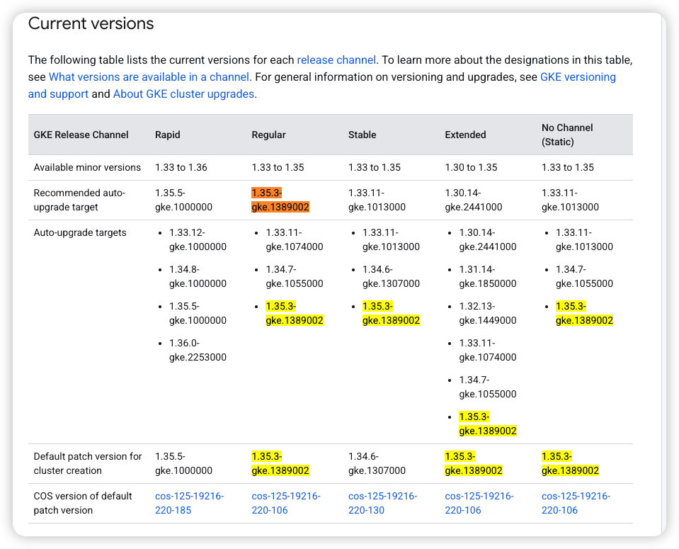

# GKE Version Management: Channels, Lifecycle & Control Mechanisms

> Based on official GKE documentation as of May 2026. Sources: [GKE Versioning and Support](https://docs.cloud.google.com/kubernetes-engine/versioning), [GKE Release Schedule](https://docs.cloud.google.com/kubernetes-engine/docs/release-schedule), [GKE Release Notes - Stable Channel](https://docs.cloud.google.com/kubernetes-engine/docs/release-notes-stable)


- 
---

## 1. 版本格式解析

GKE 版本格式：`x.y.z-gke.N`

```
x.y.z     = Kubernetes upstream version (semantic versioning)
-gke.N    = GKE patch version (Google-specific fixes, compatibility updates)
```

示例：`1.35.3-gke.1389002`

| 字段 | 含义 | 说明 |
|------|------|------|
| `1` | Major version | Kubernetes 主版本，通常不常变更 |
| `35` | Minor version | Kubernetes 每年 3 次发布（约 15 周周期） |
| `3` | Patch release | Kubernetes upstream patch，通常每周发布 |
| `gke.1389002` | GKE patch | Google 维护的 GKE 专用 patch，含安全/兼容性修复 |

### 为什么 `1.35.3-gke.1389002` 不是 "release" 版本？

从 Stable channel 2026-05-27 的发布记录可见：

```
1.35.3-gke.1234002 is deprecated in the Stable channel.
1.35.3-gke.1389000  ← 这是什么？
1.35.3-gke.1389002  ← 新的 auto-upgrade target
```

关键点：
- `1.35.3-gke.1389002` 是一个**patch version**，不是"主版本"
- 但它**不是 default 版本**（default 是 `1.34.6-gke.1307000`）
- 它被标记为 **auto-upgrade target**，供已经运行 1.35 的集群升级到更新的 patch
- `gke.1389002` 这个后缀表明这是 Google 内部构建流水线的编号（1389002）
- 版本后面没有 `+` 等标记的是**正式 release**，有 `-gke.N` 是 GKE 专用 patch

**这不是"非 release"，而是一个 GKE-specific patch 版本**，用于 Google Cloud 基础设施的兼容性修复。

---

## 2. Release Channels 体系

GKE 有 4 个 Release Channels + 1 个 No Channel（formerly Static）：

### 2.1 Channel 概览

| Channel | 更新频率 | SLA | 支持周期 | 适用场景 |
|---------|---------|-----|---------|---------|
| **Rapid** | 最快（每周） | ❌ 无 | 随 Kubernetes upstream | 尝鲜、测试最新功能 |
| **Regular** | 中等 | ✅ 有 | 24 months (14 标准 + 10 延长) | 多数生产环境 |
| **Stable** | 较慢 | ✅ 有 | 24 months | 稳健型生产环境 |
| **Extended** | 最慢 | ✅ 有 | 24 个月标准 + 额外延长支持 | 需要长支持周期的企业 |
| **No Channel** | 跟随 Stable | ✅ 有 | 跟随 Stable | 手动控制版本 |

### 2.2 版本生命周期（Minor Version Lifecycle）

```
Month -1 ~ 0          Rapid-only availability（1-2个月）
       ↓
Month 1 ~ 14          Standard Support（功能/Bug/安全修复）
       ↓
Month 15 ~ 24         Extended Support（仅安全修复，Extended channel 专属）
       ↓
End of Support        不再提供任何 patch，GKE 自动升级
```

关键时间线（以 1.35 为例）：
- `2025-12-24` Rapid 可用
- `2026-02-11` Regular 可用（标准支持开始）
- `2027-04-11` 标准支持结束
- `2028-02-11` 延长支持结束（Extended channel）

### 2.3 每个 Channel 的行为差异

| 行为 | Rapid | Regular | Stable | Extended | No Channel |
|------|-------|---------|--------|---------|------------|
| 自动升级到新 minor | ✅ | ✅ | ✅ | ❌（仅 patch） | ✅ |
| 自动升级到新 patch | ✅ | ✅ | ✅ | ✅ | ✅ |
| 延长支持（Extended support） | ❌ | ❌ | ❌ | ✅ | ❌ |
| GKE SLA | ❌ | ✅ | ✅ | ✅ | ✅ |

---

## 3. 版本控制机制详解

### 3.1 版本状态流转

```
Available → Deprecated → Removed → End of Support
```

以 Stable channel `1.35.x` 为例（2026年5月）：
- `1.35.3-gke.1234002` → deprecated（90天后移除或 end of support 时取两者较早者）
- `1.35.3-gke.1389002` → available，auto-upgrade target
- `1.35.3-gke.1389000` → available（非 auto-upgrade target）

### 3.2 Auto-Upgrade Targets

GKE 自动升级规则（来自 2026-05-27 release notes）：

> **Minor version upgrade**（当无阻碍因素时）:
> - `1.32 → 1.33.11-gke.1013000`
>
> **Patch version upgrade**（当无法 minor upgrade 时）:
> - `1.33 → 1.33.11-gke.1013000`
> - `1.34 → 1.34.6-gke.1307000`
> - `1.35 → 1.35.3-gke.1389002`

规则：
1. **优先升级 minor version**（如从 1.32 升到 1.33）
2. **无法 minor upgrade 时**（maintenance exclusion、deprecated API），才升级 patch
3. **Extended channel 只升级 patch**，不自动升级 minor version

### 3.3 为什么同一个小版本有多个 `-gke.N` 变体？

以 `1.35.3` 为例，存在以下变体：
- `1.35.3-gke.1234002` → deprecated
- `1.35.3-gke.1389000` → available
- `1.35.3-gke.1389002` → available, auto-upgrade target

原因：
- **不同构建批次**：Google 内部有多个构建流水线，不同样子对应不同的 Cloud SDK 版本、不同的 COS milestone、或不同的安全 patch
- **`1389002` vs `1389000`**：最后一位是 build 序号，`.2` 表示该批次有额外的修复
- **共存策略**：新版本出现时，旧版本标记 deprecated 但仍可用（90天缓冲）

### 3.4 Version Deprecation 规则

```
Deprecated 版本：
- 标记后 90 天内移除
- 或在 end of support 日期到达时移除（取两者较早者）
- 仍可手动创建集群使用该版本
- 但 auto-upgrade 不会使用它
```

---

## 4. GKE 版本号命名逻辑（From Source）

From the versioning scheme section:

1. **Kubernetes major version (x)** - 如 `1.32` → `1.33`，通常包含不兼容的 API 变更
2. **Kubernetes minor version (y)** - Kubernetes 每3个月发布一次新 minor 版本
3. **Kubernetes patch release (z)** - 如 `1.32.6`，上游每周发布
4. **GKE patch release (-gke.N)** - 如 `1.32.6-gke.N`，包含：
   - GKE 特定的安全更新
   - Bug 修复
   - Google Cloud 兼容性修复

---

## 5. 版本查询命令

```bash
# 查看 Rapid channel 可用版本
gcloud container get-server-config \
   --flatten="channels" \
   --filter="channels.channel=RAPID" \
   --format="yaml(channels.channel,channels.validVersions)" \
   --location=us-central1

# 查看 Stable channel 默认版本
gcloud container get-server-config \
   --flatten="channels" \
   --filter="channels.channel=STABLE" \
   --format="yaml(channels.channel,channels.defaultVersion)" \
   --location=us-central1

# 查看 No Channel 的有效控制 plane 版本
gcloud container get-server-config \
   --format="yaml(validMasterVersions)" \
   --location=us-central1
```

---

## 6. 关键理解总结

### 为什么 `1.35.3-gke.1389002` 不是 "正式 release"？

**它是一个正式发布的 GKE patch version**，但：

1. **不是 default 版本** → default 是 `1.34.6-gke.1307000`
2. **它是 auto-upgrade target** → 供已运行 1.35 的集群升级
3. **`1389002` 后缀** → Google 内部构建编号，非 Kubernetes upstream 版本
4. **同 minor 版本有多个 `-gke.N`** → 因为不同构建批次、不同的 COS milestone、不同的安全补丁

### 版本选择建议

| 场景 | 推荐版本策略 |
|------|------------|
| 新建集群 | 使用 `defaultVersion`（当前 Stable channel 为 `1.34.6-gke.1307000`） |
| 生产环境 | 使用 **Stable channel** 而非手动指定版本 |
| 需要长支持周期 | 使用 **Extended channel**（额外付费） |
| 测试环境 | 可使用 **Rapid channel** 尝鲜 |

### 维护策略

- **不要手动锁定版本** → GKE 会自动管理升级路径
- **使用 Maintenance Exclusion** → 如需临时阻止升级，最长 90 天
- **监控版本生命周期** → 通过 [GKE Release Schedule](https://docs.cloud.google.com/kubernetes-engine/docs/release-schedule) 跟踪版本 EOL 日期

---

## 附录：Release Notes 关键术语

| 术语 | 含义 |
|------|------|
| `now available` | 版本已发布到该 channel |
| `now deprecated` | 版本即将移除（90天或 EOL 取较早） |
| `no longer available` | 版本已从 channel 移除 |
| `auto-upgrade target` | GKE 会自动将集群升级到该版本 |
| `default version` | 新建集群时的默认版本 |


Clusters in this channel running the listed minor version have new general auto-upgrade targets. GKE can upgrade control planes and nodes to the following new versions with this release:
此通道中运行列出的次要版本的集群具有新的通用自动升级目标。GKE可以使用此版本将控制平面和节点升级到以下新版本：
GKE upgrades clusters to the following new patch versions if no minor version upgrade is available, or if the cluster has maintenance exclusions or other factors preventing minor version upgrades:
如果没有可用的次要版本升级，或者如果集群有维护排除或其他阻止次要版本升级的因素，GKE将集群升级到以下新补丁版本：