# GKE Namespace 创建脚本详解

## 问题分析

这段脚本主要完成三个核心操作:
1. 创建 Kubernetes ServiceAccount
2. 设置 Namespace 的 Pod Security Standards
3. 配置 Workload Identity 的 annotation

## 逐步解析

### 1. 创建 ServiceAccount

```bash
kubectl -n $namespace create sa $gke_sa
```

**作用**: 在指定 namespace 中创建 Kubernetes ServiceAccount (K8s SA)

**用途**:
- 为 Pod 提供身份标识
- 控制 Pod 在集群内的权限(通过 RBAC)
- 作为 Workload Identity 绑定的 K8s 端点

---

### 2. Pod Security Standards Label

```bash
kubectl label --overwrite ns $namespace pod-security.kubernetes.io/enforce=baseline
```

#### 核心概念

Pod Security Standards (PSS) 是 Kubernetes 1.25+ 推荐的安全策略机制,替代已废弃的 PodSecurityPolicy。

#### 三种安全级别

| 级别 | 限制程度 | 适用场景 |
|------|----------|----------|
| **privileged** | 无限制 | 信任的工作负载,需要特权访问 |
| **baseline** | 最小限制 | 防止已知的权限提升,推荐默认级别 |
| **restricted** | 严格限制 | 强化安全,遵循 Pod 加固最佳实践 |

#### Baseline 模式限制内容

```yaml
# baseline 模式禁止以下行为:
- 特权容器 (privileged: true)
- 宿主机网络/PID/IPC namespace
- 特权端口绑定 (< 1024)
- 添加危险的 Linux capabilities
- 挂载宿主机路径
- SELinux 自定义选项
```

#### 操作模式

```bash
# enforce: 违反策略的 Pod 会被拒绝创建
pod-security.kubernetes.io/enforce=baseline

# audit: 仅记录违规,不阻止
pod-security.kubernetes.io/audit=baseline

# warn: 向用户返回警告信息
pod-security.kubernetes.io/warn=baseline
```

**是否必须**: 
- ❌ **非强制要求** 
- ✅ **强烈推荐**,作为纵深防御的一层

---

### 3. Workload Identity Annotation

```bash
kubectl annotate serviceaccount \
  --namespace $namespace \
  $gke_sa \
  iam.gke.io/gcp-service-account=$rt_sa
```

#### 作用机制

此 annotation 是 **Workload Identity** 的关键配置,建立 K8s SA 与 GCP SA 的绑定关系。

#### Workload Identity 工作流程

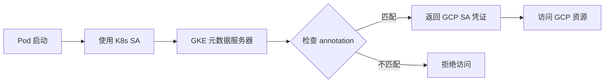

#### 完整绑定流程

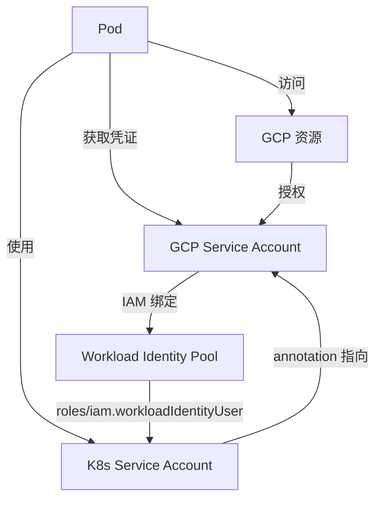

#### 配置示例

**GCP 端配置**:
```bash
# 允许 K8s SA 模拟 GCP SA
gcloud iam service-accounts add-iam-policy-binding $rt_sa \
  --role roles/iam.workloadIdentityUser \
  --member "serviceAccount:PROJECT_ID.svc.id.goog[$namespace/$gke_sa]"
```

**K8s 端配置** (即脚本中的操作):
```bash
kubectl annotate serviceaccount $gke_sa \
  -n $namespace \
  iam.gke.io/gcp-service-account=$rt_sa
```

**Pod 使用**:
```yaml
apiVersion: v1
kind: Pod
metadata:
  name: workload-identity-test
spec:
  serviceAccountName: $gke_sa  # 使用已绑定的 K8s SA
  containers:
  - name: app
    image: google/cloud-sdk:slim
```

---

## 安全角度综合分析

### Annotation 是否必须

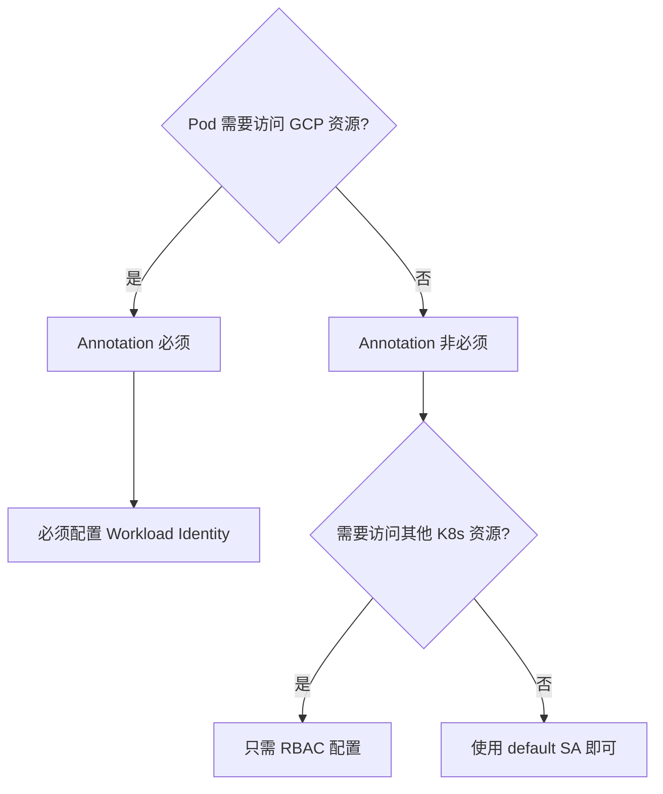

#### 必须使用的场景

| 场景 | 原因 |
|------|------|
| 访问 Cloud Storage | 需要 GCP SA 权限 |
| 调用 GCP API | 需要认证凭证 |
| 访问 Secret Manager | 需要 IAM 授权 |
| 写入 Cloud SQL | 需要数据库权限 |

#### 非必须场景

```bash
# 场景 1: 纯集群内通信
apiVersion: v1
kind: Pod
spec:
  serviceAccountName: default  # 不需要 annotation

# 场景 2: 公开的无认证服务
apiVersion: v1
kind: Pod
spec:
  automountServiceAccountToken: false  # 禁用 SA token
```

---

## 安全最佳实践配置

### 完整安全配置示例

```bash
# 1. 创建 Namespace
kubectl create namespace production

# 2. 设置 Pod Security Standard (enforce)
kubectl label ns production \
  pod-security.kubernetes.io/enforce=baseline \
  pod-security.kubernetes.io/audit=restricted \
  pod-security.kubernetes.io/warn=restricted

# 3. 创建 K8s ServiceAccount
kubectl create sa app-sa -n production

# 4. 配置 Workload Identity (如需访问 GCP)
kubectl annotate sa app-sa -n production \
  iam.gke.io/gcp-service-account=app-sa@PROJECT_ID.iam.gserviceaccount.com

# 5. 配置 RBAC (最小权限原则)
kubectl create role app-role -n production \
  --verb=get,list \
  --resource=configmaps,secrets

kubectl create rolebinding app-binding -n production \
  --role=app-role \
  --serviceaccount=production:app-sa

# 6. 配置 NetworkPolicy (网络隔离)
cat <<EOF | kubectl apply -f -
apiVersion: networking.k8s.io/v1
kind: NetworkPolicy
metadata:
  name: default-deny
  namespace: production
spec:
  podSelector: {}
  policyTypes:
  - Ingress
  - Egress
EOF
```

---

## 关键要点总结

### Pod Security Standards

✅ **推荐配置**:
```bash
# 生产环境推荐
enforce=baseline  # 拒绝已知危险配置
audit=restricted  # 记录不符合最佳实践的配置
warn=restricted   # 提醒开发人员改进
```

❌ **不推荐**:
- 完全不配置 PSS
- 在生产环境使用 `enforce=privileged`

### Workload Identity Annotation

✅ **必须配置的情况**:
- Pod 需要访问任何 GCP 服务
- 需要使用 GCP IAM 进行细粒度权限控制
- 替代不安全的 Service Account Key 文件

❌ **可以省略的情况**:
- 纯集群内部应用(无 GCP 资源访问)
- 使用其他认证机制(如 API Key)
- 公开的无认证服务

### 安全层次关系

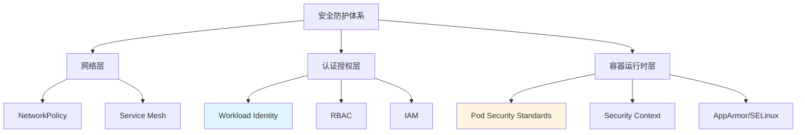

---

## 注意事项

### 1. Workload Identity 前置条件

```bash
# 检查 GKE 集群是否启用 Workload Identity
gcloud container clusters describe CLUSTER_NAME \
  --format="value(workloadIdentityConfig.workloadPool)"

# 输出应为: PROJECT_ID.svc.id.goog
```

### 2. 常见错误排查

```bash
# 错误 1: annotation 配置错误
# 症状: Pod 无法获取 GCP 凭证
kubectl describe pod POD_NAME | grep -A 5 "Warning"

# 检查 annotation
kubectl get sa $gke_sa -n $namespace -o yaml | grep annotations -A 5

# 错误 2: IAM 绑定缺失
# 检查 GCP SA 的 IAM 策略
gcloud iam service-accounts get-iam-policy $rt_sa

# 错误 3: Pod Security 策略阻止
# 查看审计日志
kubectl get events -n $namespace | grep "forbidden"
```

### 3. 测试验证

```bash
# 验证 Workload Identity
kubectl run -it --rm test-wi \
  --image=google/cloud-sdk:slim \
  --serviceaccount=$gke_sa \
  -n $namespace \
  -- gcloud auth list

# 预期输出应显示 GCP SA 邮箱
```

# GKE 访问 GCP 资源的 Workload Identity 需求详解

## 问题分析

明确哪些 GCP 服务访问**必须**使用 Workload Identity,以及是否存在替代方案。

---

## Cloud DNS 访问场景分析

### 场景 1: DNS 查询(公网域名解析)

```bash
# Pod 内查询公网域名
nslookup google.com
dig example.com
```

**是否需要 Workload Identity**: ❌ **不需要**

**原因**:
- 使用集群的 CoreDNS 或公共 DNS 服务器
- 无需 GCP 认证
- 网络层操作,非 API 调用

---

### 场景 2: Cloud DNS API 操作

```bash
# 通过 API 管理 DNS 记录
gcloud dns record-sets create test.example.com \
  --zone=my-zone \
  --type=A \
  --ttl=300 \
  --rrdatas=1.2.3.4
```

**是否需要 Workload Identity**: ✅ **需要**

**原因**:
- 调用 Cloud DNS API
- 需要 `dns.admin` 或相关 IAM 权限
- 属于 GCP 资源管理操作

#### 配置示例

```yaml
apiVersion: v1
kind: Pod
metadata:
  name: dns-manager
spec:
  serviceAccountName: dns-sa  # 需要绑定 Workload Identity
  containers:
  - name: app
    image: google/cloud-sdk:slim
    command:
    - gcloud
    - dns
    - record-sets
    - list
    - --zone=my-zone
```

**对应 GCP SA 权限**:
```bash
# 授予 Cloud DNS 管理权限
gcloud projects add-iam-policy-binding PROJECT_ID \
  --member="serviceAccount:dns-sa@PROJECT_ID.iam.gserviceaccount.com" \
  --role="roles/dns.admin"
```

---

## GCP 服务访问权限需求矩阵

### 必须使用 Workload Identity 的服务

| GCP 服务 | API 操作示例 | 所需 IAM 角色 | 常见场景 |
|---------|-------------|--------------|---------|
| **Cloud Storage** | 读写 Bucket | `roles/storage.objectAdmin` | 文件存储/备份 |
| **Cloud SQL** | 连接数据库 | `roles/cloudsql.client` | 应用数据库 |
| **Secret Manager** | 读取密钥 | `roles/secretmanager.secretAccessor` | 敏感配置管理 |
| **Pub/Sub** | 发布/订阅消息 | `roles/pubsub.publisher` | 事件驱动架构 |
| **BigQuery** | 查询数据 | `roles/bigquery.dataViewer` | 数据分析 |
| **Cloud KMS** | 加解密操作 | `roles/cloudkms.cryptoKeyEncrypterDecrypter` | 数据加密 |
| **Artifact Registry** | Pull 私有镜像 | `roles/artifactregistry.reader` | 容器镜像拉取 |
| **Cloud Logging** | 写入日志 | `roles/logging.logWriter` | 结构化日志 |
| **Cloud Monitoring** | 写入指标 | `roles/monitoring.metricWriter` | 自定义监控 |
| **Cloud Trace** | 写入追踪 | `roles/cloudtrace.agent` | 分布式追踪 |
| **Firestore/Datastore** | 读写文档 | `roles/datastore.user` | NoSQL 数据库 |
| **Cloud Tasks** | 创建任务 | `roles/cloudtasks.enqueuer` | 异步任务队列 |
| **Cloud Scheduler** | 管理定时任务 | `roles/cloudscheduler.admin` | 定时作业 |
| **Cloud Functions** | 调用函数 | `roles/cloudfunctions.invoker` | Serverless 调用 |
| **Cloud Run** | 调用服务 | `roles/run.invoker` | 容器化服务调用 |
| **Vertex AI** | 模型推理 | `roles/aiplatform.user` | ML 模型调用 |
| **Cloud DNS API** | 管理 DNS 记录 | `roles/dns.admin` | 动态 DNS 更新 |
| **Compute Engine API** | 管理 VM | `roles/compute.instanceAdmin.v1` | 基础设施管理 |
| **GKE API** | 管理集群 | `roles/container.developer` | 集群自动化 |

---

### 不需要 Workload Identity 的操作

| 操作类型 | 示例 | 原因 |
|---------|------|------|
| **DNS 查询** | `nslookup google.com` | 网络层操作 |
| **HTTP 公开 API** | `curl https://api.github.com` | 无需认证 |
| **集群内服务调用** | `curl http://my-service.default.svc` | K8s 网络 |
| **公共镜像拉取** | `docker.io/nginx:latest` | 公开仓库 |
| **ConfigMap/Secret 读取** | `kubectl get cm` | K8s RBAC |

---

## 核心 GCP 服务配置示例

### 1. Cloud Storage (GCS)

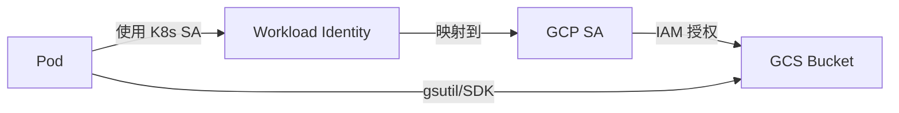

**配置步骤**:

```bash
# 1. 创建 GCP SA
gcloud iam service-accounts create gcs-reader

# 2. 授予 GCS 权限
gsutil iam ch \
  serviceAccount:gcs-reader@PROJECT_ID.iam.gserviceaccount.com:objectViewer \
  gs://my-bucket

# 3. 绑定 Workload Identity
gcloud iam service-accounts add-iam-policy-binding \
  gcs-reader@PROJECT_ID.iam.gserviceaccount.com \
  --role roles/iam.workloadIdentityUser \
  --member "serviceAccount:PROJECT_ID.svc.id.goog[NAMESPACE/K8S_SA]"

# 4. 配置 K8s SA annotation
kubectl annotate sa K8S_SA -n NAMESPACE \
  iam.gke.io/gcp-service-account=gcs-reader@PROJECT_ID.iam.gserviceaccount.com
```

**使用示例**:
```yaml
apiVersion: v1
kind: Pod
metadata:
  name: gcs-app
spec:
  serviceAccountName: K8S_SA
  containers:
  - name: app
    image: google/cloud-sdk:slim
    command:
    - gsutil
    - ls
    - gs://my-bucket
```

---

### 2. Cloud SQL

```bash
# GCP SA 权限
gcloud projects add-iam-policy-binding PROJECT_ID \
  --member="serviceAccount:sql-client@PROJECT_ID.iam.gserviceaccount.com" \
  --role="roles/cloudsql.client"
```

**Cloud SQL Proxy 模式**:
```yaml
apiVersion: v1
kind: Pod
metadata:
  name: app-with-db
spec:
  serviceAccountName: sql-sa  # 需要 Workload Identity
  containers:
  - name: app
    image: myapp:latest
    env:
    - name: DB_HOST
      value: "127.0.0.1"
  - name: cloud-sql-proxy
    image: gcr.io/cloud-sql-connectors/cloud-sql-proxy:latest
    args:
    - "--structured-logs"
    - "--port=5432"
    - "PROJECT_ID:REGION:INSTANCE_NAME"
```

---

### 3. Secret Manager

```bash
# GCP SA 权限
gcloud secrets add-iam-policy-binding my-secret \
  --member="serviceAccount:secret-reader@PROJECT_ID.iam.gserviceaccount.com" \
  --role="roles/secretmanager.secretAccessor"
```

**直接 API 访问**:
```yaml
apiVersion: v1
kind: Pod
metadata:
  name: secret-consumer
spec:
  serviceAccountName: secret-sa  # 需要 Workload Identity
  containers:
  - name: app
    image: google/cloud-sdk:slim
    command:
    - gcloud
    - secrets
    - versions
    - access
    - latest
    - --secret=my-secret
```

**CSI Driver 模式** (推荐):
```yaml
apiVersion: v1
kind: Pod
metadata:
  name: app-with-secrets
spec:
  serviceAccountName: secret-sa  # 需要 Workload Identity
  containers:
  - name: app
    image: myapp:latest
    volumeMounts:
    - name: secrets
      mountPath: /var/secrets
  volumes:
  - name: secrets
    csi:
      driver: secrets-store.csi.k8s.io
      readOnly: true
      volumeAttributes:
        secretProviderClass: "my-secrets"
---
apiVersion: secrets-store.csi.x-k8s.io/v1
kind: SecretProviderClass
metadata:
  name: my-secrets
spec:
  provider: gcp
  parameters:
    secrets: |
      - resourceName: "projects/PROJECT_ID/secrets/my-secret/versions/latest"
        path: "api-key.txt"
```

---

### 4. Artifact Registry (私有镜像)

```bash
# GCP SA 权限
gcloud artifacts repositories add-iam-policy-binding REPO_NAME \
  --location=REGION \
  --member="serviceAccount:artifact-reader@PROJECT_ID.iam.gserviceaccount.com" \
  --role="roles/artifactregistry.reader"
```

**配置**:
```yaml
apiVersion: v1
kind: Pod
metadata:
  name: private-image-app
spec:
  serviceAccountName: artifact-sa  # 需要 Workload Identity
  containers:
  - name: app
    image: REGION-docker.pkg.dev/PROJECT_ID/REPO_NAME/myapp:latest
```

---

### 5. Pub/Sub

```bash
# 发布者权限
gcloud pubsub topics add-iam-policy-binding my-topic \
  --member="serviceAccount:pubsub-publisher@PROJECT_ID.iam.gserviceaccount.com" \
  --role="roles/pubsub.publisher"

# 订阅者权限
gcloud pubsub subscriptions add-iam-policy-binding my-subscription \
  --member="serviceAccount:pubsub-subscriber@PROJECT_ID.iam.gserviceaccount.com" \
  --role="roles/pubsub.subscriber"
```

**使用示例**:
```go
// Go SDK 示例
import (
    "cloud.google.com/go/pubsub"
)

func publishMessage(projectID, topicID string) error {
    ctx := context.Background()
    // 自动使用 Workload Identity 凭证
    client, err := pubsub.NewClient(ctx, projectID)
    if err != nil {
        return err
    }
    defer client.Close()
    
    topic := client.Topic(topicID)
    result := topic.Publish(ctx, &pubsub.Message{
        Data: []byte("Hello World"),
    })
    _, err = result.Get(ctx)
    return err
}
```

---

## 最小权限原则配置

### 按应用类型分类的基础权限

#### 1. Web 应用 (无状态)

```bash
# 基础权限集
- roles/logging.logWriter          # 写入日志
- roles/monitoring.metricWriter    # 写入指标
- roles/cloudtrace.agent           # 分布式追踪
```

**场景**: 纯计算应用,不访问存储或数据库

---

#### 2. 数据处理应用

```bash
# 数据访问权限
- roles/storage.objectViewer       # 读取 GCS
- roles/storage.objectCreator      # 写入 GCS
- roles/bigquery.dataViewer        # 查询 BigQuery
- roles/logging.logWriter
```

**场景**: ETL 管道,数据分析

---

#### 3. 微服务应用

```bash
# 服务间通信权限
- roles/cloudsql.client            # 数据库连接
- roles/secretmanager.secretAccessor  # 读取密钥
- roles/pubsub.publisher           # 消息发布
- roles/pubsub.subscriber          # 消息订阅
- roles/logging.logWriter
- roles/monitoring.metricWriter
```

**场景**: 典型业务应用

---

#### 4. CI/CD 工作负载

```bash
# 部署权限
- roles/artifactregistry.writer    # 推送镜像
- roles/container.developer        # 部署到 GKE
- roles/storage.admin              # 管理构建产物
- roles/cloudkms.cryptoKeyEncrypterDecrypter  # 加密签名
```

**场景**: Jenkins/GitLab Runner 在 GKE 中运行

---

## 特殊场景处理

### 场景 1: 混合认证需求

```yaml
# 同时使用 Workload Identity 和 API Key
apiVersion: v1
kind: Pod
spec:
  serviceAccountName: hybrid-sa  # GCP 资源用 WI
  containers:
  - name: app
    env:
    - name: GCP_PROJECT
      value: "my-project"
    - name: THIRD_PARTY_API_KEY  # 第三方服务用 API Key
      valueFrom:
        secretKeyRef:
          name: external-api-keys
          key: api-key
```

---

### 场景 2: 跨项目访问

```bash
# GCP SA 需要在目标项目有权限
gcloud projects add-iam-policy-binding TARGET_PROJECT_ID \
  --member="serviceAccount:cross-project-sa@SOURCE_PROJECT.iam.gserviceaccount.com" \
  --role="roles/storage.objectViewer"

# K8s SA annotation 仍然指向源项目的 GCP SA
kubectl annotate sa cross-project-sa \
  iam.gke.io/gcp-service-account=cross-project-sa@SOURCE_PROJECT.iam.gserviceaccount.com
```

---

### 场景 3: 开发环境简化配置

```bash
# 开发环境可以给更宽松的权限
gcloud projects add-iam-policy-binding DEV_PROJECT_ID \
  --member="serviceAccount:dev-sa@DEV_PROJECT.iam.gserviceaccount.com" \
  --role="roles/editor"  # 仅开发环境,生产环境禁止

# 生产环境必须细化权限
gcloud projects add-iam-policy-binding PROD_PROJECT_ID \
  --member="serviceAccount:prod-sa@PROD_PROJECT.iam.gserviceaccount.com" \
  --role="roles/storage.objectViewer"  # 最小权限
```

---

## 验证检查清单

### 1. Workload Identity 配置检查

```bash
# 检查 GKE 集群配置
gcloud container clusters describe CLUSTER_NAME \
  --format="value(workloadIdentityConfig.workloadPool)"

# 检查 K8s SA annotation
kubectl get sa SA_NAME -n NAMESPACE -o jsonpath='{.metadata.annotations}'

# 检查 GCP SA IAM 绑定
gcloud iam service-accounts get-iam-policy GCP_SA@PROJECT.iam.gserviceaccount.com

# 测试访问
kubectl run -it --rm test \
  --image=google/cloud-sdk:slim \
  --serviceaccount=SA_NAME \
  -- gcloud auth list
```

---

### 2. 权限验证

```bash
# 测试 GCS 访问
kubectl run -it --rm gcs-test \
  --image=google/cloud-sdk:slim \
  --serviceaccount=gcs-sa \
  -- gsutil ls gs://my-bucket

# 测试 Secret Manager 访问
kubectl run -it --rm secret-test \
  --image=google/cloud-sdk:slim \
  --serviceaccount=secret-sa \
  -- gcloud secrets versions access latest --secret=my-secret
```

---

## 关键要点总结

### 必须使用 Workload Identity 的判断标准

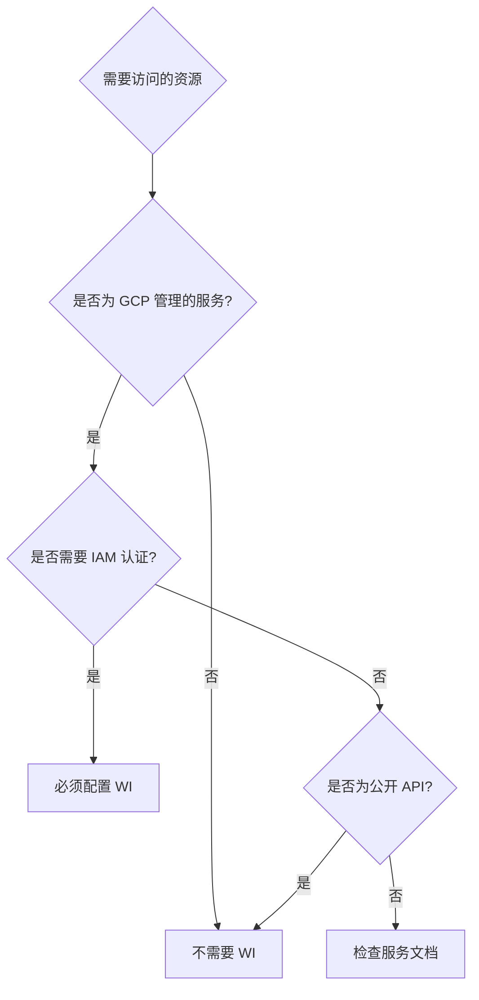

### 简化判断规则

✅ **需要 Workload Identity**:
- 任何需要 `gcloud` 命令的操作
- 使用 GCP SDK/客户端库
- 访问私有 GCP 资源
- API 请求需要 `Authorization: Bearer` header

❌ **不需要 Workload Identity**:
- 普通 DNS 查询
- 访问公开 HTTP API
- K8s 集群内部通信
- 拉取公共容器镜像

---

## 注意事项

### 1. 避免过度授权

```bash
# ❌ 错误做法
gcloud projects add-iam-policy-binding PROJECT_ID \
  --member="serviceAccount:app-sa@PROJECT.iam.gserviceaccount.com" \
  --role="roles/owner"  # 过高权限

# ✅ 正确做法
gcloud projects add-iam-policy-binding PROJECT_ID \
  --member="serviceAccount:app-sa@PROJECT.iam.gserviceaccount.com" \
  --role="roles/storage.objectViewer"  # 最小权限
```

### 2. 定期审计权限

```bash
# 列出所有 GCP SA 的 IAM 策略
for sa in $(gcloud iam service-accounts list --format="value(email)"); do
  echo "=== $sa ==="
  gcloud iam service-accounts get-iam-policy $sa
done

# 查找过度授权的 SA
gcloud projects get-iam-policy PROJECT_ID \
  --flatten="bindings[].members" \
  --filter="bindings.role:roles/owner OR bindings.role:roles/editor" \
  --format="table(bindings.role, bindings.members)"
```

### 3. 环境隔离

```bash
# 不同环境使用不同的 GCP SA
dev-app-sa@dev-project.iam.gserviceaccount.com
staging-app-sa@staging-project.iam.gserviceaccount.com
prod-app-sa@prod-project.iam.gserviceaccount.com
```

# GKE 从 Artifact Registry 拉取镜像详解

## 问题分析

Deployment 从 Google Artifact Registry (GAR) 拉取**私有镜像**时的认证需求和配置方法。

---

## 核心结论

### 是否需要 Workload Identity?

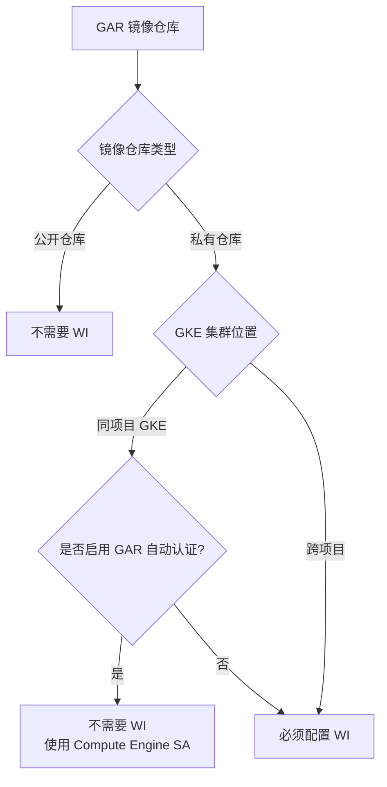

**关键点**:
- ✅ **同项目 + GKE 默认配置**: 通常不需要额外配置
- ✅ **跨项目访问**: 必须使用 Workload Identity
- ✅ **严格权限控制**: 推荐使用 Workload Identity

---

## GAR 镜像拉取的三种认证方式

### 方式 1: Compute Engine 默认服务账号 (最简单)

#### 工作原理

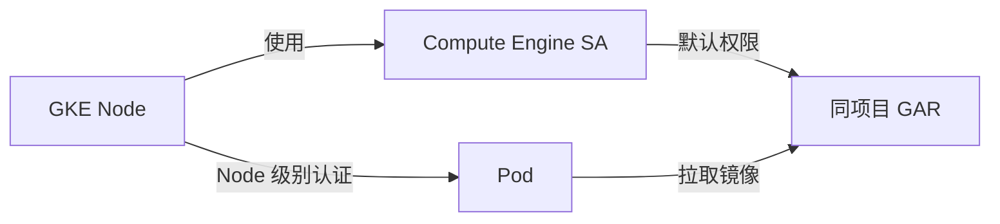

#### 适用场景

- GKE 集群与 GAR 在**同一个 GCP 项目**
- 使用默认的节点池配置
- 不需要细粒度的权限控制

#### 配置检查

```bash
# 1. 检查节点的服务账号
gcloud container node-pools describe default-pool \
  --cluster=CLUSTER_NAME \
  --region=REGION \
  --format="value(config.serviceAccount)"

# 输出示例:
# PROJECT_NUMBER-compute@developer.gserviceaccount.com (默认)
# custom-sa@PROJECT_ID.iam.gserviceaccount.com (自定义)

# 2. 检查该 SA 是否有 GAR 读取权限
gcloud projects get-iam-policy PROJECT_ID \
  --flatten="bindings[].members" \
  --filter="bindings.members:serviceAccount:PROJECT_NUMBER-compute@developer.gserviceaccount.com" \
  --format="table(bindings.role)"

# 应包含以下角色之一:
# roles/artifactregistry.reader
# roles/storage.objectViewer (旧版 GCR 兼容)
```

#### Deployment 示例

```yaml
apiVersion: apps/v1
kind: Deployment
metadata:
  name: app-from-gar
  namespace: production
spec:
  replicas: 3
  selector:
    matchLabels:
      app: myapp
  template:
    metadata:
      labels:
        app: myapp
    spec:
      # 不需要指定 serviceAccountName
      # 使用默认的 default SA (无 annotation)
      containers:
      - name: app
        # 私有镜像,通过 Node SA 认证拉取
        image: us-central1-docker.pkg.dev/my-project/my-repo/myapp:v1.0.0
        ports:
        - containerPort: 8080
```

**优点**:
- ✅ 零配置,开箱即用
- ✅ 适合快速开发

**缺点**:
- ❌ 所有 Pod 共享相同权限
- ❌ 无法跨项目访问
- ❌ 不符合最小权限原则

---

### 方式 2: Workload Identity (推荐生产环境)

#### 工作原理

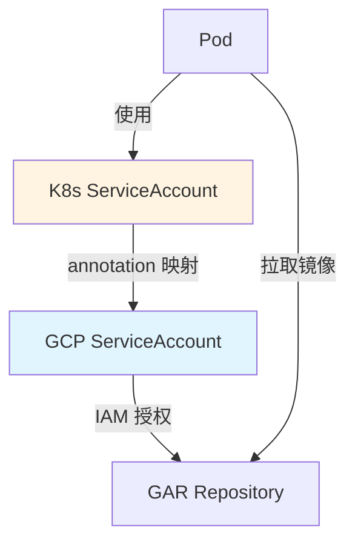

#### 完整配置流程

**步骤 1: 创建 GCP ServiceAccount**

```bash
# 创建专用的 GCP SA
gcloud iam service-accounts create gar-reader-sa \
  --display-name="GAR Image Puller"
```

**步骤 2: 授予 GAR 读取权限**

```bash
# 方式 A: 项目级别授权 (简单但权限较大)
gcloud projects add-iam-policy-binding PROJECT_ID \
  --member="serviceAccount:gar-reader-sa@PROJECT_ID.iam.gserviceaccount.com" \
  --role="roles/artifactregistry.reader"

# 方式 B: 仓库级别授权 (推荐,最小权限)
gcloud artifacts repositories add-iam-policy-binding REPO_NAME \
  --location=REGION \
  --member="serviceAccount:gar-reader-sa@PROJECT_ID.iam.gserviceaccount.com" \
  --role="roles/artifactregistry.reader"
```

**步骤 3: 配置 Workload Identity 绑定**

```bash
# 允许 K8s SA 模拟 GCP SA
gcloud iam service-accounts add-iam-policy-binding \
  gar-reader-sa@PROJECT_ID.iam.gserviceaccount.com \
  --role="roles/iam.workloadIdentityUser" \
  --member="serviceAccount:PROJECT_ID.svc.id.goog[NAMESPACE/K8S_SA_NAME]"
```

**步骤 4: 创建并配置 K8s ServiceAccount**

```bash
# 创建 K8s SA
kubectl create serviceaccount gar-puller -n production

# 添加 Workload Identity annotation
kubectl annotate serviceaccount gar-puller \
  -n production \
  iam.gke.io/gcp-service-account=gar-reader-sa@PROJECT_ID.iam.gserviceaccount.com
```

**步骤 5: 在 Deployment 中使用**

```yaml
apiVersion: apps/v1
kind: Deployment
metadata:
  name: app-with-wi
  namespace: production
spec:
  replicas: 3
  selector:
    matchLabels:
      app: secure-app
  template:
    metadata:
      labels:
        app: secure-app
    spec:
      serviceAccountName: gar-puller  # 使用配置好的 K8s SA
      containers:
      - name: app
        # 私有镜像,通过 Workload Identity 拉取
        image: us-central1-docker.pkg.dev/my-project/my-repo/secure-app:v2.0.0
        ports:
        - containerPort: 8080
```

**优点**:
- ✅ 细粒度权限控制
- ✅ 支持跨项目访问
- ✅ 符合最小权限原则
- ✅ 审计追踪能力强

**缺点**:
- ❌ 配置步骤较多
- ❌ 需要维护 SA 映射关系

---

### 方式 3: ImagePullSecrets (不推荐)

#### 工作原理

使用 Service Account Key 文件创建 Docker 配置 Secret。

**为什么不推荐**:
- ❌ **安全风险**: Key 文件泄露风险高
- ❌ **管理复杂**: 需要定期轮换 Key
- ❌ **违反最佳实践**: GCP 官方不推荐导出 SA Key

#### 配置示例 (仅供参考)

```bash
# 1. 创建 SA Key (不推荐!)
gcloud iam service-accounts keys create key.json \
  --iam-account=gar-reader-sa@PROJECT_ID.iam.gserviceaccount.com

# 2. 创建 Docker 配置 Secret
kubectl create secret docker-registry gar-creds \
  --docker-server=us-central1-docker.pkg.dev \
  --docker-username=_json_key \
  --docker-password="$(cat key.json)" \
  --namespace=production

# 3. 删除本地 Key 文件
rm key.json
```

```yaml
apiVersion: apps/v1
kind: Deployment
metadata:
  name: app-with-secret
spec:
  template:
    spec:
      imagePullSecrets:
      - name: gar-creds  # 使用 Secret 拉取镜像
      containers:
      - name: app
        image: us-central1-docker.pkg.dev/my-project/my-repo/app:latest
```

**仅在以下场景考虑**:
- 非 GKE 环境 (如自建 K8s)
- 无法使用 Workload Identity
- 临时测试环境

---

## 跨项目访问 GAR 配置

### 场景说明

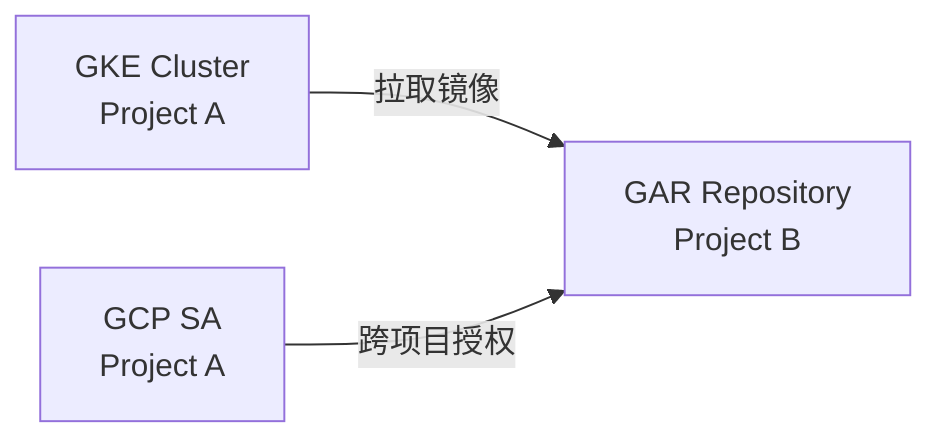

### 配置步骤

**步骤 1: 在目标项目授权**

```bash
# 在 GAR 所在的项目 (Project B) 授权来自 Project A 的 SA
gcloud artifacts repositories add-iam-policy-binding REPO_NAME \
  --location=REGION \
  --project=PROJECT_B \
  --member="serviceAccount:gar-reader-sa@PROJECT_A.iam.gserviceaccount.com" \
  --role="roles/artifactregistry.reader"
```

**步骤 2: 配置 Workload Identity (在 Project A)**

```bash
# 在 GKE 集群所在的项目配置 WI 绑定
gcloud iam service-accounts add-iam-policy-binding \
  gar-reader-sa@PROJECT_A.iam.gserviceaccount.com \
  --project=PROJECT_A \
  --role="roles/iam.workloadIdentityUser" \
  --member="serviceAccount:PROJECT_A.svc.id.goog[NAMESPACE/K8S_SA]"
```

**步骤 3: K8s 配置**

```bash
# 创建 K8s SA 并添加 annotation
kubectl create sa cross-project-puller -n production

kubectl annotate sa cross-project-puller -n production \
  iam.gke.io/gcp-service-account=gar-reader-sa@PROJECT_A.iam.gserviceaccount.com
```

**步骤 4: Deployment 使用**

```yaml
apiVersion: apps/v1
kind: Deployment
metadata:
  name: cross-project-app
  namespace: production
spec:
  template:
    spec:
      serviceAccountName: cross-project-puller
      containers:
      - name: app
        # 从 Project B 的 GAR 拉取镜像
        image: us-central1-docker.pkg.dev/PROJECT_B/shared-repo/app:v1.0.0
```

---

## 不同场景的最佳实践

### 场景 1: 开发环境

```yaml
# 使用默认 Node SA,快速迭代
apiVersion: apps/v1
kind: Deployment
metadata:
  name: dev-app
  namespace: dev
spec:
  template:
    spec:
      # 不指定 serviceAccountName
      containers:
      - name: app
        image: us-central1-docker.pkg.dev/dev-project/dev-repo/app:latest
```

**权限配置**:
```bash
# 确保 Node SA 有开发仓库的访问权限
gcloud artifacts repositories add-iam-policy-binding dev-repo \
  --location=us-central1 \
  --member="serviceAccount:PROJECT_NUMBER-compute@developer.gserviceaccount.com" \
  --role="roles/artifactregistry.reader"
```

---

### 场景 2: 生产环境

```yaml
# 使用专用 SA,最小权限
apiVersion: apps/v1
kind: Deployment
metadata:
  name: prod-app
  namespace: production
spec:
  template:
    spec:
      serviceAccountName: prod-gar-reader  # 专用 SA
      containers:
      - name: app
        image: us-central1-docker.pkg.dev/prod-project/prod-repo/app:v2.1.0
      # 禁止使用 latest 标签
      imagePullPolicy: IfNotPresent
```

**安全加固**:
```bash
# 1. 仓库级别授权
gcloud artifacts repositories add-iam-policy-binding prod-repo \
  --location=us-central1 \
  --member="serviceAccount:prod-gar-sa@prod-project.iam.gserviceaccount.com" \
  --role="roles/artifactregistry.reader"

# 2. 启用二进制授权
gcloud container clusters update CLUSTER_NAME \
  --enable-binauthz \
  --region=REGION

# 3. 配置 Pod Security Policy
kubectl label ns production pod-security.kubernetes.io/enforce=restricted
```

---

### 场景 3: 多租户环境

```yaml
# 不同团队使用不同的 SA
---
apiVersion: v1
kind: ServiceAccount
metadata:
  name: team-a-gar-reader
  namespace: team-a
  annotations:
    iam.gke.io/gcp-service-account: team-a-sa@project.iam.gserviceaccount.com
---
apiVersion: v1
kind: ServiceAccount
metadata:
  name: team-b-gar-reader
  namespace: team-b
  annotations:
    iam.gke.io/gcp-service-account: team-b-sa@project.iam.gserviceaccount.com
```

**权限隔离**:
```bash
# Team A 只能访问 team-a-repo
gcloud artifacts repositories add-iam-policy-binding team-a-repo \
  --member="serviceAccount:team-a-sa@project.iam.gserviceaccount.com" \
  --role="roles/artifactregistry.reader"

# Team B 只能访问 team-b-repo
gcloud artifacts repositories add-iam-policy-binding team-b-repo \
  --member="serviceAccount:team-b-sa@project.iam.gserviceaccount.com" \
  --role="roles/artifactregistry.reader"
```

---

## 故障排查

### 问题 1: ImagePullBackOff 错误

**症状**:
```bash
kubectl get pods
# NAME                   READY   STATUS             RESTARTS   AGE
# app-xxx                0/1     ImagePullBackOff   0          2m
```

**排查步骤**:

```bash
# 1. 查看详细错误信息
kubectl describe pod POD_NAME

# 常见错误输出:
# Failed to pull image "us-central1-docker.pkg.dev/...": 
# rpc error: code = Unknown desc = failed to pull and unpack image: 
# failed to resolve reference: pulling from host us-central1-docker.pkg.dev failed with status code [manifests]: 401 Unauthorized

# 2. 检查 SA annotation
kubectl get sa SA_NAME -n NAMESPACE -o yaml | grep annotations -A 3

# 3. 验证 GCP SA 权限
gcloud artifacts repositories get-iam-policy REPO_NAME \
  --location=REGION \
  --flatten="bindings[].members" \
  --filter="bindings.members:serviceAccount:GCP_SA@project.iam.gserviceaccount.com"

# 4. 检查 Workload Identity 绑定
gcloud iam service-accounts get-iam-policy GCP_SA@project.iam.gserviceaccount.com

# 5. 测试 Node 能否拉取镜像
kubectl debug node/NODE_NAME -it --image=gcr.io/google.com/cloudsdktool/cloud-sdk:slim
# 在 debug pod 中:
gcloud auth list
gcloud artifacts docker images list us-central1-docker.pkg.dev/PROJECT/REPO
```

---

### 问题 2: 跨项目访问失败

**检查清单**:

```bash
# 1. 确认目标项目的 API 已启用
gcloud services list --project=TARGET_PROJECT | grep artifactregistry

# 2. 验证跨项目 IAM 绑定
gcloud artifacts repositories get-iam-policy REPO_NAME \
  --project=TARGET_PROJECT \
  --location=REGION

# 3. 测试从 Pod 内访问
kubectl run -it --rm test \
  --image=google/cloud-sdk:slim \
  --serviceaccount=CROSS_PROJECT_SA \
  -- gcloud artifacts docker images list \
       us-central1-docker.pkg.dev/TARGET_PROJECT/REPO
```

---

### 问题 3: Workload Identity 未生效

**验证步骤**:

```bash
# 1. 检查集群是否启用 Workload Identity
gcloud container clusters describe CLUSTER_NAME \
  --format="value(workloadIdentityConfig.workloadPool)"
# 应输出: PROJECT_ID.svc.id.goog

# 2. 检查节点池配置
gcloud container node-pools describe NODE_POOL_NAME \
  --cluster=CLUSTER_NAME \
  --format="value(config.workloadMetadataConfig.mode)"
# 应输出: GKE_METADATA

# 3. 从 Pod 内验证
kubectl run -it --rm wi-test \
  --image=google/cloud-sdk:slim \
  --serviceaccount=WI_SA \
  -- /bin/bash

# 在 Pod 内执行:
curl -H "Metadata-Flavor: Google" \
  http://169.254.169.254/computeMetadata/v1/instance/service-accounts/default/email
# 应返回 GCP SA 的邮箱地址
```

---

## 最佳实践总结

### 权限配置推荐

| 环境 | 认证方式 | 授权范围 | 理由 |
|------|---------|---------|------|
| **开发环境** | Node SA | 项目级 `artifactregistry.reader` | 快速开发,减少配置 |
| **测试环境** | Workload Identity | 仓库级 `artifactregistry.reader` | 接近生产配置 |
| **生产环境** | Workload Identity | 仓库级 `artifactregistry.reader` | 最小权限,可审计 |
| **跨项目** | Workload Identity | 目标仓库级 | 必须使用 WI |

---

### 配置检查脚本

```bash
#!/bin/bash
# gar-pull-check.sh - 检查 GAR 镜像拉取配置

NAMESPACE=$1
K8S_SA=$2
IMAGE=$3

echo "=== 检查 K8s ServiceAccount ==="
kubectl get sa $K8S_SA -n $NAMESPACE -o yaml

echo -e "\n=== 检查 GCP ServiceAccount 绑定 ==="
GCP_SA=$(kubectl get sa $K8S_SA -n $NAMESPACE -o jsonpath='{.metadata.annotations.iam\.gke\.io/gcp-service-account}')
echo "GCP SA: $GCP_SA"

echo -e "\n=== 检查 Workload Identity 绑定 ==="
gcloud iam service-accounts get-iam-policy $GCP_SA 2>/dev/null

echo -e "\n=== 测试镜像拉取 ==="
kubectl run test-pull-$RANDOM \
  --image=$IMAGE \
  --serviceaccount=$K8S_SA \
  -n $NAMESPACE \
  --rm -it \
  --restart=Never \
  --command -- echo "Pull successful"
```

**使用示例**:
```bash
chmod +x gar-pull-check.sh
./gar-pull-check.sh production gar-puller \
  us-central1-docker.pkg.dev/my-project/my-repo/app:v1.0.0
```

---

## 核心要点

### Deployment 拉取 GAR 私有镜像的必要条件

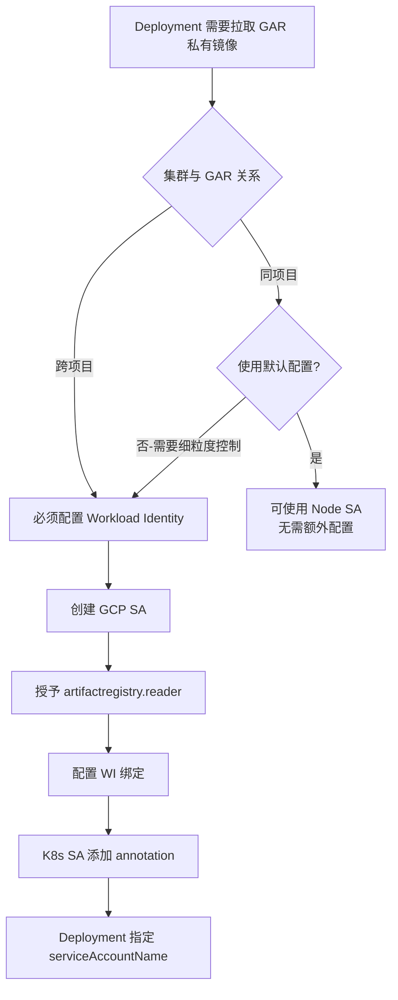

### 三种方式对比

| 特性 | Node SA | Workload Identity | ImagePullSecrets |
|------|---------|-------------------|------------------|
| **配置复杂度** | ⭐ 极简 | ⭐⭐⭐ 中等 | ⭐⭐ 简单 |
| **安全性** | ⭐⭐ 低 | ⭐⭐⭐⭐⭐ 高 | ⭐ 很低 |
| **跨项目支持** | ❌ 不支持 | ✅ 支持 | ✅ 支持 |
| **权限粒度** | 节点级 | Pod 级 | Namespace 级 |
| **审计能力** | ⭐⭐ 低 | ⭐⭐⭐⭐⭐ 高 | ⭐⭐ 低 |
| **生产推荐** | ❌ 不推荐 | ✅ **强烈推荐** | ❌ 不推荐 |

---

## 快速决策树

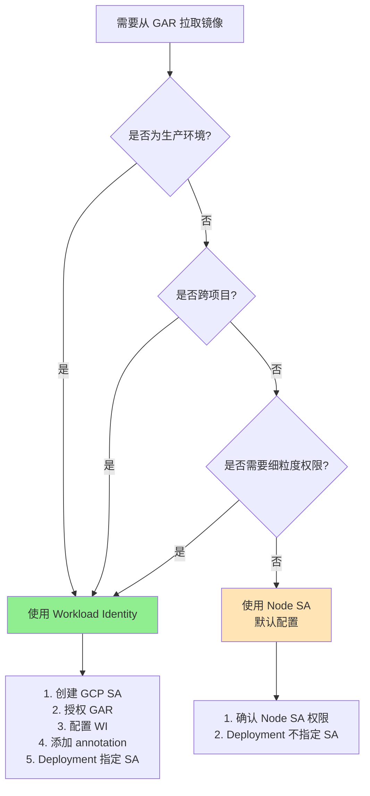

下面我逐行拆解你这段 Shell 的真实含义，并从 安全、GKE 机制、是否必须、与 Workload Identity 的关系 四个维度帮你彻底讲清楚。

⸻

一、整体背景先给结论（先读这个）

这段脚本做了 三件完全不同但彼此关联的事情：
	1.	创建 K8S ServiceAccount（身份载体）
	2.	给 Namespace 打 Pod Security Admission 的 enforce=baseline 标签（Pod 运行安全约束）
	3.	通过 annotation 把 K8S SA 绑定到 GCP IAM SA（Workload Identity）

它们解决的是 三个不同层面的安全问题：

层级	控制什么	对应语句
Pod 身份	Pod 以谁的身份访问 GCP	iam.gke.io/gcp-service-account
Pod 行为	Pod 允不允许“危险行为”	pod-security.kubernetes.io/enforce=baseline
Namespace 边界	统一策略生效范围	Namespace label


⸻

二、第一段：创建 Kubernetes ServiceAccount

kubectl -n $namespace create sa $gke_sa

1️⃣ 它到底干了什么？
	•	在 Kubernetes 内部 创建一个 ServiceAccount
	•	这是 Pod 的“身份入口”
	•	Pod 通过 spec.serviceAccountName 使用它

2️⃣ 它本身安全吗？

👉 不安全，也不危险
它只是一个 空壳身份

默认情况下：
	•	不能访问 GCP API
	•	只能在 K8S 内部参与 RBAC

⸻

三、第二段：Namespace 的 Pod Security enforce=baseline

kubectl label --overwrite ns $namespace pod-security.kubernetes.io/enforce=baseline

1️⃣ 这是在干什么？

这是 Pod Security Admission（PSA） 机制
在 Namespace 级别强制 Pod 安全规则

⸻

2️⃣ baseline 是什么级别？

K8S 官方定义了 3 个等级：

等级	用途	风险
privileged	基础设施组件	极高
baseline	生产默认推荐	中
restricted	高安全场景	低


⸻

3️⃣ baseline 具体限制了什么？

baseline 会禁止这些典型“高危行为”：

行为	baseline
privileged: true	❌
HostNetwork / HostPID	❌
HostPath 挂载	❌
任意 Linux capability	❌
允许 root 运行	✅（注意）

⚠️ baseline 不强制非 root
如果你想极致安全，用 restricted

⸻

4️⃣ 这个 label 是不是必须的？

不是“技术必须”，但在平台层面是“安全必须”

场景	是否建议
企业平台 / 多租户	✅ 强烈建议
对外 API 平台	✅
内部 PoC	⚠️ 可选
Infra 组件	❌（可能需要 privileged）

一句话总结：

它解决的是「Pod 能不能做危险事情」，
不是「Pod 能不能访问 GCP」

⸻

四、第三段：ServiceAccount annotation（核心）

kubectl annotate serviceaccount \
--namespace $namespace \
$gke_sa \
iam.gke.io/gcp-service-account=$rt_sa

1️⃣ 这是在干什么？

👉 这是 Workload Identity 的“桥梁”

它告诉 GKE：

使用这个 K8S ServiceAccount 的 Pod
👉 在访问 GCP 时
👉 伪装成这个 GCP ServiceAccount

⸻

2️⃣ 没有这个 annotation 会怎样？

情况	结果
没 annotation	❌ Pod 无法访问 GCP API
直接用 Node SA	❌（已被官方不推荐）
绑错 GCP SA	❌ IAM 权限错误


⸻

3️⃣ annotation 是不是必须的？

结论：不总是，但在你这个脚本场景下是“必须的”

必须的场景
	•	Pod 需要访问：
	•	GCS
	•	Pub/Sub
	•	BigQuery
	•	Secret Manager
	•	Cloud APIs
	•	使用 Workload Identity（推荐方案）

非必须的场景
	•	纯内部计算
	•	纯 HTTP API
	•	不访问任何 GCP 资源

⸻

五、它和 Workload Identity 的关系（重点）

你的脚本其实已经在使用 Workload Identity

完整链路是：

Pod
 ↓
K8S ServiceAccount
 ↓（annotation）
GCP ServiceAccount
 ↓
IAM Policy

少了任何一环都会失败

缺失	结果
没 K8S SA	Pod 用 default SA
没 annotation	无法映射 GCP 身份
GCP SA 没 IAM	403
GCP SA 未授权 impersonation	403


⸻

六、从“安全角度”的完整评价

你这段脚本在安全上做得非常标准

维度	是否覆盖
身份最小化（IAM）	✅
Pod 行为约束	✅
Namespace 边界	✅
避免 Node SA 泄漏	✅

annotation 和 baseline 是不同层面的安全

项	解决什么
annotation	“你是谁”
baseline	“你能干什么”

两者互补，不能替代

⸻

七、什么时候 annotation 可以不加？（真实平台经验）

场景	是否需要
纯 proxy / 转发	❌
只访问外部 API	❌
访问 GCP	✅
多租户平台	✅（强制）
平台 Runtime	✅


⸻

八、一句话终极总结（可以直接对外解释）

	•	pod-security.kubernetes.io/enforce=baseline
是 防止 Pod 做危险事
	•	iam.gke.io/gcp-service-account
是 让 Pod 以受控身份访问 GCP
	•	annotation 不是永远必须，
但只要访问 GCP，就是必须
	•	这是 Workload Identity 的标准安全实现方式

如果你愿意，下一步我可以帮你：
	•	画一张 Pod → K8S SA → GCP SA → IAM 的安全链路图（Mermaid）
	•	或帮你定义 平台级 Namespace 创建标准模板（带 enforce / warn / audit）


graph TD
    A["Pod"] --> B["Kubernetes ServiceAccount"]
    B -->|"annotation: iam.gke.io/gcp-service-account"| C["GCP ServiceAccount"]
    C -->|"IAM Policy Binding"| D["GCP Resources"]

图解说明（精炼版）
	1.	Pod
	•	运行你的应用
	•	通过 spec.serviceAccountName 绑定 K8S ServiceAccount
	2.	Kubernetes ServiceAccount
	•	K8S 内部身份
	•	本身不具备访问 GCP 的能力
	3.	ServiceAccount Annotation
	•	iam.gke.io/gcp-service-account
	•	Workload Identity 的关键桥梁
	•	决定 Pod 在 GCP 侧“扮演谁”
	4.	GCP ServiceAccount
	•	真正的云身份
	•	通过 IAM Policy 控制最小权限
	5.	GCP Resources
	•	GCS / BigQuery / PubSub / Secret Manager 等
	•	是否能访问，完全由 IAM 决定

一句话：
Pod 永远不会“直接”拿到 GCP 凭证，它只能通过 Workload Identity 被临时映射身份，这是 GKE 目前最安全的模型。

下面我按真实平台使用场景来系统性罗列 Workload Identity（WI）在 GKE 中最常见、最有价值、也是最推荐使用的场景，并同时说明 是否必须 / 是否强烈推荐 / 是否可选，方便你直接用于平台规范或安全评审。

⸻

一、先给一句总定义（便于对外解释）

Workload Identity 用于让 GKE 中的 Pod 以“最小权限的 GCP 身份”安全访问 GCP 资源，避免节点凭证泄漏与静态密钥管理。

⸻

二、最常见 & 强烈推荐场景（生产必选）

1️⃣ 访问 Cloud Storage（GCS）

场景	说明
读配置文件	启动时拉取配置
写日志 / 结果	导出数据
临时对象存储	API 中转

为什么必须 WI
	•	禁止使用 JSON key
	•	Bucket 权限粒度细

IAM 示例

roles/storage.objectViewer
roles/storage.objectCreator


⸻

2️⃣ 访问 Secret Manager（强烈推荐）

用途	示例
数据库密码	DB_CONN
API Token	第三方调用
私钥	MTLS / JWT

优势
	•	无明文 Secret 挂载
	•	支持 Secret Rotation

⸻

3️⃣ Pub/Sub（事件驱动架构）

角色	权限
Producer	publish
Consumer	subscribe

典型架构
	•	API → Pub/Sub → Worker
	•	异步解耦

⸻

4️⃣ BigQuery（数据平台 / 审计）

场景	示例
写日志	API audit
统计报表	使用 Looker
分析数据	离线任务


⸻

5️⃣ Cloud SQL / AlloyDB（通过 Connector）

方式	说明
Cloud SQL Auth Proxy	最常见
私有 IP	结合 VPC

WI 作用
	•	避免 DB 静态账号泄漏
	•	支持自动轮转

⸻

三、平台 / 运维 / 控制面场景（非常典型）

6️⃣ CI/CD Runner（GKE 内）

场景	示例
构建镜像	推送 GAR
部署	kubectl apply
发布	更新 Cloud Run

好处
	•	不需要给 Runner JSON Key
	•	可按 Namespace 隔离

⸻

7️⃣ 平台 Runtime / Gateway（你非常贴合的场景）

组件	用途
Kong DP / RT	调用 GCP API
Nginx + Lua	读取配置
API Platform	配额 / 审计

为什么重要
	•	多租户
	•	身份强隔离
	•	防止越权

⸻

四、安全增强 & 特殊能力场景

8️⃣ KMS（加解密）

用途	示例
Token 加密	PII
数据保护	密钥托管


⸻

9️⃣ Artifact Registry（拉 / 推镜像）

场景	说明
构建 Pod	推镜像
Scanner	拉镜像


⸻

🔟 调用 GCP API（通用）

API	示例
Compute	管理 VM
IAM	查询策略
Monitoring	上报指标


⸻

五、什么时候「不需要」Workload Identity？

场景	原因
纯 HTTP 转发	不访问 GCP
调外部 SaaS	与 GCP 无关
静态内容	无 API

👉 是否使用 WI 的判断标准只有一个：
Pod 是否需要访问 GCP 控制面或数据面

⸻

六、Workload Identity 带来的核心安全收益（评审用）

维度	收益
凭证安全	无 JSON Key
权限最小化	Pod 级
可审计性	Cloud Audit Log
横向隔离	Namespace 级
攻击面	显著降低


⸻

七、推荐你在平台中定义的「强制使用 WI」对象

类型	建议
平台 Runtime	必须
API 网关	必须
CI/CD	必须
用户业务 Pod	按需
Infra Pod	例外评估


⸻

八、终极一句话总结（你可以直接对外用）

Workload Identity 是 GKE 中唯一推荐的、无密钥、可审计、最小权限的云资源访问方式，凡是 Pod 需要访问 GCP 的场景，都应该使用它。

如果你愿意，我可以下一步帮你：
	•	输出一份 平台级 Workload Identity 使用白名单 / 黑名单
	•	或直接给你一个 Namespace + SA + IAM 的标准化模板


下面给你一份**「平台级 Workload Identity 使用白名单 / 黑名单」，是可以直接落到制度、平台准入、Namespace 模板里的版本**，偏你现在做的平台视角，而不是教材解释。

⸻

一、设计目标（一句话）

只有“必须访问 GCP 的工作负载”才能使用 Workload Identity，其余一律禁止，避免权限泛滥。

⸻

二、Workload Identity【强制白名单】（必须使用）

这些场景 不允许使用 JSON Key / Node SA / 共享 SA，必须绑定独立 GCP Service Account。

1️⃣ 平台核心组件（强制）

组件	原因
API Gateway（Kong DP / RT）	配额、审计、平台 API
平台 Runtime	多租户、跨项目访问
Nginx + Lua 控制逻辑	读取 GCP 配置
平台控制面服务	高权限、可审计

要求
	•	1 Pod / 1 K8S SA / 1 GCP SA
	•	禁止跨 Namespace 复用

⸻

2️⃣ 数据访问类服务（强制）

资源	场景
GCS	读写对象
BigQuery	写日志 / 分析
Pub/Sub	事件驱动
Secret Manager	拉取密钥


⸻

3️⃣ CI / CD / Automation（强制）

场景	说明
GKE 内 Runner	推镜像 / 部署
发布流水线	操作 GCP API
自动化脚本	Terraform / gcloud


⸻

4️⃣ 数据库与密钥类（强制）

服务	原因
Cloud SQL Proxy	身份认证
AlloyDB	IAM Auth
KMS	加解密


⸻

三、Workload Identity【条件白名单】（评估后允许）

这些场景 可以用，也可以不用，由平台策略决定。

5️⃣ 用户业务 API（按需）

情况	建议
访问 GCP	使用 WI
只调外部 API	不需要
多租户	强烈建议


⸻

6️⃣ 运维 / 监控类 Pod

场景	说明
上报指标	Monitoring API
拉配置	GCS


⸻

四、Workload Identity【黑名单】（禁止使用）

这些场景 明确禁止绑定 GCP Service Account。

7️⃣ 纯转发 / 纯计算 Pod（禁止）

示例	原因
HTTP Proxy	无需 GCP
Sidecar	权限冗余
Cache	无云资源访问


⸻

8️⃣ 不可信 / 外部代码（禁止）

场景	风险
第三方镜像	供应链风险
PoC / 临时 Pod	权限滥用
Debug Pod	人为误操作


⸻

9️⃣ 基础设施级 Pod（默认禁止）

组件	说明
CNI	不应访问 GCP
CSI	有官方方式
DaemonSet 工具	容易横向移动


⸻

五、平台强制策略建议（你可以直接用）

1️⃣ Namespace 级策略

项	建议
默认	不允许 WI
白名单 Namespace	显式开启
平台 Namespace	强制


⸻

2️⃣ ServiceAccount 创建规范

禁止 default SA 绑定 WI
禁止跨 Namespace 绑定 GCP SA
禁止多个 K8S SA 绑定同一个高权限 GCP SA


⸻

3️⃣ 审计与检测（平台层）

检查项	说明
SA annotation 扫描	是否越权
IAM Role	是否超权限
Namespace	是否在白名单


⸻

六、简化版对外解释（一句话）

Workload Identity 不是“能不能用”的问题，而是“谁有资格用”的问题。平台只允许必须访问 GCP 的工作负载使用它。

⸻

如果你愿意，下一步我可以帮你直接输出：
	•	✅ Namespace + WI 强制模板
	•	✅ OPA / Gatekeeper 校验规则
	•	✅ 安全评审 Checklist（可给安全团队）