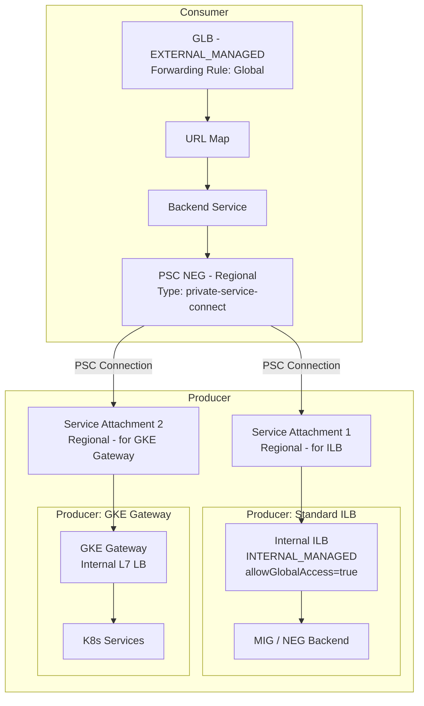

我来帮你分析这个跨项目 PSC + GLB 架构的 POC 实现方案。

## 问题分析

你的核心目标：

```
Tenant Project (Consumer)          Master Project (Producer)
┌─────────────────────┐            ┌──────────────────────────┐
│  GLB (EXTERNAL_     │            │  Producer 1: Forwarding  │
│  MANAGED)           │───PSC──────│  Rule (ILB)              │
│  Backend: NEG(PSC)  │            │                          │
│                     │            │  Producer 2: GKE Gateway │
└─────────────────────┘            └──────────────────────────┘
```

## 关键约束与注意事项

### 1. PSC Attachment 只支持 Regional

```
⚠️ 核心限制：
Service Attachment → 只有 Regional 概念
PSC NEG (Consumer 侧) → 也是 Regional 的
GLB → Global，但其 Backend NEG 是 Regional
```

这意味着：**GLB → Regional PSC NEG → Regional Service Attachment** 是合法链路。

### 2. 你遇到的两个报错解析

**报错 1：**
```
Global L7 Private Service Connect consumers require the 
Private Service Connect producer load balancer to have 
AllowGlobalAccess enabled
```

**原因**：PSC consumer 是 Global L7（GLB），但 Producer 侧的 ILB Forwarding Rule 没有开启 `allowGlobalAccess`。

**修复**：

```bash
# 对 Master Project 的 ILB Forwarding Rule 开启 Global Access
gcloud compute forwarding-rules update YOUR_ILB_FORWARDING_RULE \
  --region=YOUR_REGION \
  --allow-global-access \
  --project=MASTER_PROJECT_ID

https://docs.cloud.google.com/sdk/gcloud/reference/compute/forwarding-rules/create#--allow-global-access
--allow-global-access
If True, then clients from all regions can access this internal forwarding rule. This can only be specified for forwarding rules with the LOAD_BALANCING_SCHEME set to INTERNAL or INTERNAL_MANAGED. For forwarding rules of type INTERNAL, the target must be either a backend service or a target instance.
如果为True，则所有地区的客户端都可以访问此内部转发规则。这只能为负载均衡方案（LOAD_BALANCING_SCHEME）设置为INTERNAL或INTERNAL_MANAGED的转发规则指定。对于INTERNAL类型的转发规则，目标必须是后端服务或目标实例。

--allow-psc-global-access
If specified, clients from all regions can access this Private Service Connect forwarding rule. This can only be specified if the forwarding rule's target is a service attachment (--target-service-attachment).
如果指定，所有地区的客户端都可以访问此Private Service Connect转发规则。只有当转发规则的目标是服务附加组件（--target-service-attachment）时，才能进行此指定。

```

---

**报错 2：**
```
Forwarding Rule .../glb-front of type 
GLOBAL_EXTERNAL_MANAGED_HTTP_HTTPS is not allowed
```

**原因**：PSC Service Attachment 不允许 `GLOBAL_EXTERNAL_MANAGED` 类型的 Forwarding Rule 作为 Producer 的目标。Service Attachment 只接受 **Internal** 的 Forwarding Rule（ILB）作为 producer target。

```
✅ 合法的 Producer Target:
   - INTERNAL_MANAGED (Regional ILB L7)
   - INTERNAL (Regional ILB L4)

❌ 不合法的 Producer Target:
   - GLOBAL_EXTERNAL_MANAGED_HTTP_HTTPS (你的 GLB)
```

## 正确架构设计



## 实现步骤

### Step 1：Master Project - 配置 ILB Producer（allowGlobalAccess）

```bash
# 创建或更新 ILB，必须开启 allow-global-access
gcloud compute forwarding-rules create producer-ilb-fr \
  --project=MASTER_PROJECT_ID \
  --region=asia-northeast1 \
  --load-balancing-scheme=INTERNAL_MANAGED \
  --network=PRODUCER_VPC \
  --subnet=PRODUCER_SUBNET \
  --address=RESERVED_IP \
  --ports=443 \
  --target-http-proxy=YOUR_HTTP_PROXY \  # 或 target-https-proxy
  --allow-global-access                  # ← 关键参数
```

### Step 2：Master Project - 创建 Service Attachment

```bash
# Service Attachment for ILB Producer
gcloud compute service-attachments create sa-for-ilb \
  --project=MASTER_PROJECT_ID \
  --region=asia-northeast1 \
  --producer-forwarding-rule=producer-ilb-fr \
  --connection-preference=ACCEPT_MANUAL \
  --consumer-accept-list=TENANT_PROJECT_ID=10 \
  --nat-subnets=PSC_NAT_SUBNET
```

```bash
# Service Attachment for GKE Gateway Producer
# GKE Gateway 本质也是 Internal L7 LB，需要找到其对应的 Forwarding Rule
kubectl get gateway YOUR_GATEWAY -o yaml | grep -i "forwardingRule"

# 然后同样创建 SA
gcloud compute service-attachments create sa-for-gke-gw \
  --project=MASTER_PROJECT_ID \
  --region=asia-northeast1 \
  --producer-forwarding-rule=GKE_GW_FORWARDING_RULE \
  --connection-preference=ACCEPT_MANUAL \
  --consumer-accept-list=TENANT_PROJECT_ID=10 \
  --nat-subnets=PSC_NAT_SUBNET
```

### Step 3：Tenant Project - 创建 PSC NEG

```bash
# NEG for SA1 (ILB Producer)
gcloud compute network-endpoint-groups create psc-neg-for-ilb \
  --project=TENANT_PROJECT_ID \
  --region=asia-northeast1 \
  --network-endpoint-type=private-service-connect \
  --psc-target-service=projects/MASTER_PROJECT_ID/regions/asia-northeast1/serviceAttachments/sa-for-ilb \
  --network=TENANT_VPC \
  --subnet=TENANT_SUBNET

# NEG for SA2 (GKE Gateway Producer)
gcloud compute network-endpoint-groups create psc-neg-for-gke \
  --project=TENANT_PROJECT_ID \
  --region=asia-northeast1 \
  --network-endpoint-type=private-service-connect \
  --psc-target-service=projects/MASTER_PROJECT_ID/regions/asia-northeast1/serviceAttachments/sa-for-gke-gw \
  --network=TENANT_VPC \
  --subnet=TENANT_SUBNET
```

### Step 4：Tenant Project - 创建 GLB（EXTERNAL_MANAGED）

```bash
# 1. 创建 Backend Service（关联 PSC NEG）
gcloud compute backend-services create bs-to-master \
  --project=TENANT_PROJECT_ID \
  --global \
  --load-balancing-scheme=EXTERNAL_MANAGED \
  --protocol=HTTPS

# 添加 PSC NEG 作为 backend
gcloud compute backend-services add-backend bs-to-master \
  --project=TENANT_PROJECT_ID \
  --global \
  --network-endpoint-group=psc-neg-for-ilb \
  --network-endpoint-group-region=asia-northeast1

# 2. 创建 URL Map
gcloud compute url-maps create glb-urlmap \
  --project=TENANT_PROJECT_ID \
  --default-service=bs-to-master

# 3. 创建 Target HTTPS Proxy
gcloud compute target-https-proxies create glb-https-proxy \
  --project=TENANT_PROJECT_ID \
  --url-map=glb-urlmap \
  --ssl-certificates=YOUR_CERT

# 4. 创建 Global Forwarding Rule（EXTERNAL_MANAGED）
gcloud compute forwarding-rules create glb-front \
  --project=TENANT_PROJECT_ID \
  --global \
  --load-balancing-scheme=EXTERNAL_MANAGED \
  --address=GLOBAL_IP \
  --ports=443 \
  --target-https-proxy=glb-https-proxy
```

## GKE Gateway 特殊注意事项

```bash
# GKE Gateway 创建的 Internal LB，需要确认其 Forwarding Rule 名称
# GKE Gateway Controller 自动创建，名称格式通常为：
gcloud compute forwarding-rules list \
  --project=MASTER_PROJECT_ID \
  --filter="loadBalancingScheme=INTERNAL_MANAGED" \
  --format="table(name, region, IPAddress, loadBalancingScheme)"

# GKE Gateway 对应的 ILB 默认不开启 Global Access
# 需要通过 GatewayClass 或手动 patch 开启
```

```yaml
# GKE Gateway 开启 Global Access 的方式（如果 GatewayClass 支持）
apiVersion: gateway.networking.k8s.io/v1beta1
kind: Gateway
metadata:
  name: internal-gateway
  annotations:
    networking.gke.io/load-balancer-ip: "RESERVED_IP"
spec:
  gatewayClassName: gke-l7-rilb  # Regional Internal L7
  listeners:
  - name: https
    port: 443
    protocol: HTTPS
```

> ⚠️ GKE Gateway 目前对 `allowGlobalAccess` 的支持需确认你的 GKE 版本，部分版本需要手动对生成的 Forwarding Rule 执行 `update --allow-global-access`。

## 关键约束汇总

| 约束点                  | 说明                                          |
| ----------------------- | --------------------------------------------- |
| Service Attachment 类型 | 只接受 INTERNAL / INTERNAL_MANAGED 的 FR      |
| Global Access           | Producer ILB 必须开启 `allowGlobalAccess`     |
| PSC NEG 位置            | Regional（需与 SA 同 Region）                 |
| GLB Backend             | 通过 Regional PSC NEG 连接，GLB 本身是 Global |
| GKE Gateway FR          | 自动生成，需手动确认并开启 Global Access      |
| PSC NAT Subnet          | Master Project 需要专用 PSC NAT 子网          |

## 验证命令

```bash
# 验证 PSC 连接状态
gcloud compute service-attachments describe sa-for-ilb \
  --project=MASTER_PROJECT_ID \
  --region=asia-northeast1

# 查看 Consumer Connection 状态
gcloud compute service-attachments list \
  --project=MASTER_PROJECT_ID \
  --filter="region:asia-northeast1"

# 验证 NEG 状态
gcloud compute network-endpoint-groups describe psc-neg-for-ilb \
  --project=TENANT_PROJECT_ID \
  --region=asia-northeast1
```