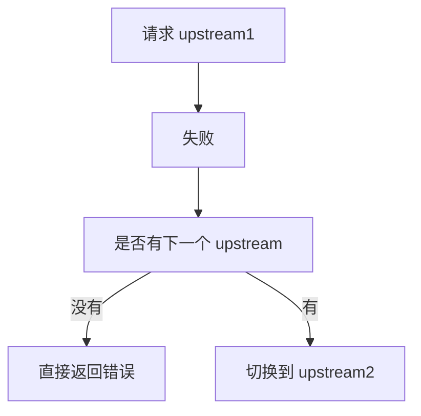

# GCP GLB 多层架构超时与重试机制设计指南

## 1. 架构概述

- <https://docs.cloud.google.com/load-balancing/docs/l7-internal#retries>

```text
To configure retries, you can use a retry policy in the URL map. The default number of retries (numRetries) is 1. The maximum configurable perTryTimeout is 24 hours.

Without a retry policy, unsuccessful requests that have no HTTP body (for example, GET requests) that result in HTTP 502, 503, or 504 responses are retried once.

HTTP POST requests aren't retried.

Retried requests only generate one log entry for the final response.

For more information, see Internal Application Load Balancer logging and monitoring.
```

你的平台是典型的多层架构，每一层都可能涉及超时和重试配置：

```
Client
  │
  ▼
┌─────────────────────────┐
│  GCP Global Load        │  ← Layer 1: HTTPS Termination
│  Balancer (GLB)         │    - Timeout: 默认 30s，可配置
│  Target HTTPS Proxy     │    - Health Check
└─────────────────────────┘
  │
  ▼
┌─────────────────────────┐
│  Nginx L7 Proxy         │  ← Layer 2: L7 Load Balancing
│  (Upstream / proxy)     │    - proxy_connect_timeout
│  - Kong Ingress         │    - proxy_read_timeout
│                         │    - proxy_send_timeout
└─────────────────────────┘
  │
  ▼
┌─────────────────────────┐
│  Kong API Gateway       │  ← Layer 3: API Gateway
│  - Route / Service      │    - timeout (server/worker)
│  - Plugins              │    - retry
│  - Upstream             │    - health check
└─────────────────────────┘
  │
  ▼
┌─────────────────────────┐
│  GKE Runtime            │  ← Layer 4: Kubernetes
│  (Kong Dataplane/       │    - Readiness/Liveness Probe
│   Kong for K8s)         │    - Service timeout
│                         │    - Pod disruption
└─────────────────────────┘
  │
  ▼
┌─────────────────────────┐
│  Application /          │
│  Backend Service        │  ← Layer 5: 业务逻辑
│                         │    - Application timeout
│                         │    - Circuit breaker
└─────────────────────────┘
```

**关键问题**：如果各层超时/重试配置不一致，会导致：

- 请求在某些层超时后，另一层还在继续处理（资源浪费）
- 重试导致重复请求（幂等性问题）
- 错误链路复杂，难以排查

---

## 2. 各层超时与重试配置详解

### 2.1 GCP Global Load Balancer (Layer 1)

#### 2.1.1 Backend Service / Route 超时配置

```bash
# 查看当前 Backend Service 配置
gcloud compute backend-services describe YOUR_BACKEND_SERVICE --global

# 更新 Backend Service timeout（秒）
gcloud compute backend-services update YOUR_BACKEND_SERVICE \
  --global \
  --timeout=300
```

| 参数                       | 默认值                       | 说明                                                       |
| -------------------------- | ---------------------------- | ---------------------------------------------------------- |
| `timeoutSec` / `--timeout` | 30s                          | Application Load Balancer 等待后端完成请求并返回响应的时间 |
| `routeAction.timeout`      | 未单独设置时继承后端服务超时 | 用于 URL map / route rule 级别的总超时控制                 |

> 注意：`target-https-proxy` 的 keepalive 配置控制的是客户端到代理的空闲连接保持时间，不是业务请求超时。真正影响 GLB 等待后端多久的是 `backend service timeout`，以及 URL map 中 `routeAction.timeout`。

#### 2.1.2 Health Check 超时

```bash
# 创建健康检查
gcloud compute health-checks create https YOUR_HEALTH_CHECK \
  --port=443 \
  --request-path=/healthz \
  --check-interval=10s \
  --timeout=5s \
  --healthy-threshold=2 \
  --unhealthy-threshold=3
```

| 参数                  | 说明                                        |
| --------------------- | ------------------------------------------- |
| `check-interval`      | 两次检查之间的间隔                          |
| `timeout`             | 单次健康检查的超时（应小于 check-interval） |
| `healthy-threshold`   | 连续成功次数才认为健康                      |
| `unhealthy-threshold` | 连续失败次数才认为不健康                    |

#### 2.1.3 GLB 重试机制

**GLB 不是“完全不会重试”，但默认行为很克制。**

- 未显式配置 `retryPolicy` 时，**没有 HTTP body** 的请求（典型是 `GET`）在遇到 `502` / `503` / `504` 时，会默认再尝试 1 次
- `POST` 默认不会被重试
- 显式配置时，位置在 **URL map 的 `routeAction.retryPolicy`**
- `numRetries` 表示**总尝试次数**，包含第一次请求本身，所以 `numRetries: 1` 才表示禁用额外重试
- `perTryTimeout` 最大可配置到 24 小时

```yaml
routeAction:
  retryPolicy:
    numRetries: 2
    perTryTimeout:
      seconds: 3
    retryConditions:
    - gateway-error
    - connect-failure
```

**生产建议**：

- 读操作路径可以在 GLB 上保守开启 retryPolicy
- 写操作路径不要依赖 GLB retry，单独 route rule 且不配置 retryPolicy
- 如果 Nginx/Kong 也有重试，GLB 层必须收敛，避免重试放大

#### 2.1.4 GLB 超时配置建议

```bash
# 对于长时间运行的请求（如文件上传/下载）
gcloud compute backend-services update YOUR_BACKEND_SERVICE \
  --global \
  --timeout=600
```

---

### 2.2 Nginx L7 Proxy (Layer 2)

#### 2.2.1 主要超时参数

```nginx
# /etc/nginx/nginx.conf 或对应的 upstream 块

upstream backend_kong {
    server kong-backend:8000;
    keepalive 64;
}

server {
    listen 8443 ssl;
    
    # 连接超时（与后端建立连接的时间）
    proxy_connect_timeout 60s;
    
    # 读取超时（等待后端发送响应的时间）
    proxy_read_timeout 300s;
    
    # 发送超时（发送请求到后端的时间）
    proxy_send_timeout 300s;
    
    # Buffer 配置
    proxy_buffer_size 128k;
    proxy_buffers 4 256k;
    proxy_busy_buffers_size 256k;
}
```

| 参数                    | 默认值 | 说明           | 推荐值        |
| ----------------------- | ------ | -------------- | ------------- |
| `proxy_connect_timeout` | 60s    | 与后端建立连接 | 5-10s（生产） |
| `proxy_read_timeout`    | 60s    | 等待后端响应   | 依据业务逻辑  |
| `proxy_send_timeout`    | 60s    | 发送请求到后端 | 60s           |

#### 2.2.2 Nginx 重试机制

**先说默认行为**：即使你没有显式写 `proxy_next_upstream`，Nginx 也不是“完全没有 retry”。

- <https://nginx.org/en/docs/http/ngx_http_proxy_module.html#proxy_next_upstream_tries>

```
Limits the time during which a request can be passed to the next server. The 0 value turns off this limitation.

Syntax: proxy_next_upstream_tries number;
Default: 
proxy_next_upstream_tries 0;
Context: http, server, location

```

- 那么看起来默认的配置是 proxy_next_upstream_tries 0 意思就是不进行重试
- `proxy_next_upstream` 默认值是 `error timeout`
- 这意味着在**建立连接**、**发送请求**、或**读取响应头**阶段出现 `error` / `timeout` 时，Nginx 会尝试切到下一个 upstream
- `invalid_header` 会被视为 unsuccessful attempt，但如果你要按响应码触发重试，仍需显式加上 `http_502` / `http_503` / `http_504`
- 如果 upstream 里只有一个可用后端，就没有“下一跳”可切换，实际不会发生 retry
- 默认情况下，非幂等请求不会因为已经发往 upstream 后的失败而继续重试；只有显式加 `non_idempotent` 才会放开这层保护

```nginx
# 默认等价行为（显式写出来更清晰）
proxy_next_upstream error timeout;

# 如果你希望对 502/503/504 也执行 upstream failover，需要显式加上这些条件
proxy_next_upstream error timeout http_502 http_503 http_504;
proxy_next_upstream_tries 3;
proxy_next_upstream_timeout 10s;

# 重要：确保操作是幂等的，否则可能产生重复提交
```

下面给你做一个**工程级、可落地的深度解析**，把这个参数讲清楚👇

---

# 一、问题分析

`proxy_next_upstream_tries` 是 Nginx 在做 **upstream 重试（failover）** 时的一个控制参数。

它的核心作用是：

👉 **限制一次请求最多可以尝试多少个 upstream（后端服务器）**

---

# 二、核心概念拆解

## 1️⃣ 什么是 “next upstream”

当你配置了 upstream，例如：

```nginx
upstream backend {
    server 10.0.0.1;
    server 10.0.0.2;
    server 10.0.0.3;
}
```

当请求失败时（例如 timeout / 502 / connection refused）：

👉 Nginx 会尝试下一个 server
👉 这就叫：`next upstream`

---

## 2️⃣ 默认行为（很关键）

```nginx
proxy_next_upstream_tries 0;
```

👉 **0 = 不限制次数**

⚠️ 注意：
不是“不重试”，而是：

👉 **可以一直尝试，直到没有可用 upstream 为止**

---

# 三、这个参数到底控制什么？

👉 **限制最多“尝试多少次 upstream”**

---

## 示例说明

### 场景 1：设置为 2

```nginx
proxy_next_upstream_tries 2;
```

假设有 3 个 upstream：

| 尝试次数  | 行为     |
| --------- | -------- |
| 第 1 次   | server1  |
| 第 2 次   | server2  |
| ❌ 第 3 次 | 不会再试 |

👉 最多尝试 2 次，然后直接返回错误

---

### 场景 2：默认 0

```nginx
proxy_next_upstream_tries 0;
```

| 尝试次数 | 行为         |
| -------- | ------------ |
| 第 1 次  | server1      |
| 第 2 次  | server2      |
| 第 3 次  | server3      |
| …        | 直到全部失败 |

👉 会一直尝试所有 upstream

---

# 四、和哪些参数配合使用（重点）

这个参数**必须结合下面两个一起理解**👇

---

## 1️⃣ proxy_next_upstream

```nginx
proxy_next_upstream error timeout http_502 http_503 http_504;
```

👉 控制 **什么情况下才会 retry**

---

## 2️⃣ proxy_connect_timeout / proxy_read_timeout

👉 控制每次尝试的耗时

---

## 🔥 三者关系总结

```text
是否重试 → proxy_next_upstream
最多重试几次 → proxy_next_upstream_tries
每次耗时多久 → timeout 参数
```

---

# 五、在你 GKE / Kong 场景中的意义（重点）

你的链路：

```
Client → Nginx → Kong → GKE RT
```

👉 这个参数直接影响：

### 1️⃣ Rolling Update 期间

Pod 被杀 / readiness 未就绪：

👉 如果 tries 太小：

```text
❌ 很容易直接失败（502）
```

👉 如果 tries 合理：

```text
✅ 自动切到健康 Pod
```

---

### 2️⃣ Pod 短暂抖动

例如：

- GC pause
- CPU 抢占
- 网络 jitter

👉 retry 可以“掩盖瞬时失败”

---

### 3️⃣ 高并发下的副作用

⚠️ 很多人忽略这一点：

如果 tries 太大：

```text
请求 = 1 → 变成 N 次 backend 请求
```

👉 会导致：

- backend 压力放大
- RT 被打爆
- 延迟变高

---

# 七、最佳实践（生产级）

## 推荐配置

```nginx
proxy_next_upstream error timeout http_502 http_503 http_504;
proxy_next_upstream_tries 2;
```

---

## 推荐策略

| 场景       | tries      |
| ---------- | ---------- |
| 高可用 API | 2~3        |
| 低延迟敏感 | 1~2        |
| 非关键流量 | 3~5        |
| 默认       | 不建议用 0 |

---

## 八、一个非常重要的坑 ⚠️

## ❗ tries ≠ 请求总次数

👉 实际行为：

```text
总请求次数 = tries
```

不是：

```text
原始请求 + tries
```

---

## ❗ 和 idempotent 有关

如果是：

- GET ✅ 安全 retry
- POST ❌ 可能重复执行

👉 必须谨慎！

---

# 九、总结（一句话）

👉 `proxy_next_upstream_tries` 控制的是：

> **一次请求最多允许切换多少个 upstream 实例进行重试**

---

# 十、给你一个工程建议（结合你场景）

你现在在做：

- GKE Rolling Update
- Kong upstream
- 避免 502

👉 推荐组合：

```nginx
proxy_next_upstream error timeout http_502 http_503 http_504;
proxy_next_upstream_tries 2;
proxy_connect_timeout 1s;
proxy_read_timeout 3s;
```

👉 目标：

- 快速失败
- 快速切换
- 避免放大流量

---

如果你愿意，我可以帮你再往下做一层：

👉 **结合你现在的 GKE RT + readinessProbe + PDB，设计一个“零 502” 的完整重试策略（含 Kong + Nginx + GKE）**

#### nginx Retry

这个问题问得很好，而且你已经抓到一个**非常容易被误解的点**了👇
👉 **“retry 是不是一定会发生？”**

我给你从底层行为讲清楚。

---

# 一、问题核心

你问的是：

> 如果 upstream 只有 **一个节点**，Nginx 还有 retry 吗？retry 次数怎么控制？

---

# 二、结论（先说答案）

👉 **默认情况下：**

```text
只有 1 个 upstream = 基本不会发生 retry（没有“下一个”可以切换）
```

👉 即使你配置了：

```nginx
proxy_next_upstream_tries 3;
```

👉 **也不会 retry 到同一个 upstream**

---

# 三、为什么不会 retry？

## 关键点：Nginx 的 retry 机制本质是

👉 **failover（切换节点）**
而不是
👉 **重试同一个节点**

---

## 内部逻辑是这样的：



---

# 四、官方语义拆解（非常关键）

## proxy_next_upstream 做的事情是：

```text
当当前 upstream 失败 → 尝试“下一个 upstream”
```

👉 注意关键词：

❗ **next upstream（下一个）**

---

## 这意味着：

| 场景                     | 是否 retry         |
| ------------------------ | ------------------ |
| 多个 upstream            | ✅ 会切换           |
| 只有 1 个 upstream       | ❌ 不会 retry       |
| 想 retry 同一个 upstream | ❌ Nginx 默认不支持 |

---

# 五、那 proxy_next_upstream_tries 在单节点下有什么意义？

👉 **几乎没有意义**

因为：

```text
tries 限制的是“最多尝试多少个 upstream”
```

但你只有：

```text
1 个 upstream → 最多只能尝试 1 次
```

---

# 六、一个容易踩坑的误解 ⚠️

很多人以为：

```text
tries = 3 → 会 retry 3 次同一个 server
```

❌ 错误！

实际是：

```text
最多访问 3 个不同 upstream
```

---

# 七、那如果我就是想 retry 同一个 upstream 怎么办？

👉 有 3 种方案（生产级思路）

---

## 方案 1：在 upstream 中“伪造多个节点”（常见技巧）

```nginx
upstream backend {
    server 10.0.0.1;
    server 10.0.0.1;
    server 10.0.0.1;
}
```

👉 效果：

```text
请求1 → 10.0.0.1
失败 → 再“切换”到 10.0.0.1（其实是同一个）
```

✔ 实现“伪 retry”

⚠️ 缺点：

* 不优雅
* 可能影响 load balancing

---

## 方案 2：在上层（Kong / 应用层）做 retry（推荐）

你当前架构：

```text
Nginx → Kong → GKE
```

👉 更合理的做法：

* Nginx：做 failover
* Kong：做 retry（支持同 upstream retry）

---

## 方案 3：使用 Lua / OpenResty（高级玩法）

```nginx
lua-resty-http
```

👉 可以自己实现 retry 逻辑

---

# 八、结合你的 GKE 场景（重点）

你之前的问题是：

> Pod 内并发请求，总有一个失败

👉 如果 upstream 只有一个 Pod：

```text
Nginx 无法帮你 retry
```

👉 这就是你看到：

```text
总有一个失败
```

的根因之一

---

# 九、工程级建议（非常关键）

## 如果你想要“真正 retry”

### ✅ 必须满足：

```text
至少 2 个 upstream 实例
```

例如：

```nginx
upstream backend {
    server pod1;
    server pod2;
}
```

---

## 推荐组合（你当前架构）

### Nginx：

```nginx
proxy_next_upstream error timeout http_502 http_503 http_504;
proxy_next_upstream_tries 2;
```

---

### Kong（关键）：

```text
retries = 2~3
```

👉 Kong 才是负责：

✔ 同 upstream retry
✔ 应用级 retry

---

# 十、总结（一句话）

👉 **Nginx 的 retry ≠ 重试请求，而是切换 upstream**

---

# 十一、给你一个更深的 insight（你这个场景很关键）

👉 在你的链路中：

```text
Client → Nginx → Kong → GKE Pod
```

### retry 分层：

| 层    | 能力                  |
| ----- | --------------------- |
| Nginx | failover（切节点）    |
| Kong  | retry（可重试同节点） |
| 应用  | 业务级 retry          |

---

👉 所以：

```text
只有一个 upstream + 想 retry = 必须依赖 Kong 或应用层
```

---

如果你愿意，我可以帮你把你现在的：

👉 “并发请求必有一个失败”
👉 “RollingUpdate + readiness + retry”

做一个**完整链路级（Nginx + Kong + GKE）无损方案设计**，这个你现在正好到了该优化的阶段了。


#### 2.2.3 Nginx 限流与排队

```nginx
# 限流配置
limit_req_zone $binary_remote_addr zone=api_limit:10m rate=100r/s;

location /api/ {
    # 排队队列（超过 rate 的请求排队）
    limit_req zone=api_limit burst=20 nodelay;
    
    # 超时传递
    proxy_read_timeout 300s;
}
```

---

### 2.3 Kong API Gateway (Layer 3)

#### 2.3.1 Kong Timeout 配置

Kong 的超时配置在 `kong.conf` 或通过 Admin API 设置：

```bash
# 通过 Admin API 查看当前配置
curl -i http://localhost:8001/

# 设置 service/upstream 超时（毫秒）
curl -X PATCH http://localhost:8001/services/SERVICE_NAME \
  --data "connect_timeout=60000" \
  --data "send_timeout=60000" \
  --data "read_timeout=600000"
```

| 参数              | 默认值   | 说明     | 单位 |
| ----------------- | -------- | -------- | ---- |
| `connect_timeout` | 60000ms  | 连接超时 | 毫秒 |
| `send_timeout`    | 60000ms  | 发送超时 | 毫秒 |
| `read_timeout`    | 600000ms | 读取超时 | 毫秒 |

#### 2.3.2 Kong Retry 配置

```bash
# 在 service 或 route 上启用重试
curl -X PATCH http://localhost:8001/services/SERVICE_NAME \
  --data "retries=3"
```

| 参数      | 默认值 | 说明           |
| --------- | ------ | -------------- |
| `retries` | 5      | 失败时重试次数 |

**Kong 重试条件**（默认）：

- Connection timeout
- Read timeout
- HTTP 502 / 503 / 504

**注意**：Kong 不会重试 `POST`、`PUT`、`PATCH` 请求，除非配置 `retries` 且请求未被发送（connection error）。

#### 2.3.3 Kong Health Check

```bash
# 创建 upstream 健康检查
curl -X POST http://localhost:8001/upstreams/backup-backend/targets \
  --data "target=backend:8000" \
  --data "weight=100"

# 配置主动健康检查
curl -X POST http://localhost:8001/upstreams/backup-backend/health-checks \
  --data "type=http" \
  --data "http_path=/healthz" \
  --data "interval=10" \
  --data "timeout=5" \
  --data "consecutive_successes=3" \
  --data "consecutive_failures=3"
```

#### 2.3.4 Kong 插件超时配置

如果使用 Prometheus 或其他监控插件，可能需要调整：

```bash
# 禁用超时用于长时间运行的请求
curl -X POST http://localhost:8001/routes/ROUTE_NAME/plugins \
  --data "name=prometheus" \
  --data "config.timeout=60000"
```

---

### 2.4 GKE Runtime (Layer 4)

#### 2.4.1 Kubernetes Service Timeout

```yaml
# Service spec
apiVersion: v1
kind: Service
metadata:
  name: my-app
spec:
  sessionAffinity: ClientIP
  sessionAffinityConfig:
    clientIP:
      timeoutSeconds: 10800  # GKE 默认 10800s (3小时)
  ports:
  - port: 80
    targetPort: 8080
```

#### 2.4.2 Readiness vs Liveness Probe

```yaml
apiVersion: apps/v1
kind: Deployment
spec:
  template:
    spec:
      containers:
      - name: my-app
        readinessProbe:
          httpGet:
            path: /ready
            port: 8080
          initialDelaySeconds: 5
          periodSeconds: 10
          timeoutSeconds: 5
          failureThreshold: 3
        livenessProbe:
          httpGet:
            path: /live
            port: 8080
          initialDelaySeconds: 15
          periodSeconds: 20
          timeoutSeconds: 5
          failureThreshold: 3
```

| Probe 类型      | 用途                   | 超时建议         |
| --------------- | ---------------------- | ---------------- |
| Readiness Probe | 流量是否应该发送到 Pod | 略短于业务超时   |
| Liveness Probe  | Pod 是否需要重启       | 保守值，避免误杀 |

#### 2.4.3 Pod Disruption Budget

```yaml
apiVersion: policy/v1
kind: PodDisruptionBudget
metadata:
  name: my-app-pdb
spec:
  minAvailable: 2
  # 或使用 maxUnavailable
```

#### 2.4.4 GKE Ingress 超时

```yaml
apiVersion: networking.k8s.io/v1
kind: Ingress
metadata:
  name: my-ingress
  annotations:
    kubernetes.io/ingress.global-static-ip-name: "my-ip"
    networking.gke.io/ingress-class: "gce"
spec:
  rules:
  - host: api.example.com
    http:
      paths:
      - path: /*
        pathType: ImplementationSpecific
        backend:
          service:
            name: my-app
            port:
              number: 80
```

GKE Ingress 的默认超时是 30s，可通过 annotation 修改：

```yaml
annotations:
  kubernetes.io/ingress.global-static-ip-name: "my-ip"
  networking.gke.io/ingress.class: "gce"
  cloud.google.com/backend-config: '{"default": "my-backend-config"}'
```

```yaml
# BackendConfig for custom timeout
apiVersion: cloud.google.com/v1
kind: BackendConfig
metadata:
  name: my-backend-config
spec:
  timeoutSec: 300
  connectionDraining:
    drainingTimeoutSec: 60
```

#### 2.4.5 Ingress Controller annotations 视角补充

**先看结论**：`Ingress` 这个 Kubernetes API 本身**没有统一的 timeout / retry 字段**。  
如果你是通过 `Ingress Controller` 暴露流量，那么“超时”和“重试”是否可配、配置在哪里、语义是什么，**完全取决于具体 controller 的实现**。

| Controller              | 超时能力 | 重试能力                           | 配置入口                                   | 生产判断                                                    |
| ----------------------- | -------- | ---------------------------------- | ------------------------------------------ | ----------------------------------------------------------- |
| GKE Ingress (`gce`)     | 支持     | 不作为常见 Ingress annotation 暴露 | `BackendConfig` + Service annotation       | 适合管 LB timeout；retry 主要仍看 GLB 默认行为/底层 URL map |
| ingress-nginx           | 支持     | 支持                               | Ingress annotations / Controller ConfigMap | 最灵活，但最容易和上游 Nginx/Kong 重试叠加                  |
| Kong Ingress Controller | 支持     | 支持                               | 多数在 **Service annotations**             | 更适合把超时/重试贴近上游服务治理                           |

##### A. GKE Ingress (`kubernetes.io/ingress.class: gce`)

GKE Ingress 主要把 Ingress 翻译成 Google Cloud Application Load Balancer 资源。  
在这个模型里：

- **超时**通常通过 `BackendConfig.spec.timeoutSec` 配置
- **连接排空**通过 `BackendConfig.spec.connectionDraining.drainingTimeoutSec` 配置
- **重试**不是一个常见的 GKE Ingress annotation 能力
- 如果你没有额外做 URL map retryPolicy 定制，那么它仍然遵循前文提到的 **GLB 默认 retry 行为**

```yaml
apiVersion: v1
kind: Service
metadata:
  name: my-app
  annotations:
    cloud.google.com/backend-config: '{"default":"my-backend-config"}'
spec:
  selector:
    app: my-app
  ports:
  - port: 80
    targetPort: 8080
---
apiVersion: cloud.google.com/v1
kind: BackendConfig
metadata:
  name: my-backend-config
spec:
  timeoutSec: 300
  connectionDraining:
    drainingTimeoutSec: 60
```

**建议**：

- GKE Ingress 场景下，把 annotation/CRD 重点放在 `timeoutSec` 和 `drainingTimeoutSec`
- 不要假设 GKE Ingress annotation 天然提供了和 ingress-nginx 一样细粒度的 retry 控制
- 如果你的路径需要精细 retry，优先在 GLB URL map、下游 Nginx/Kong、或应用层做清晰收敛

##### B. ingress-nginx

如果你的 Ingress Controller 是 **ingress-nginx**，那它本质上就是把 Ingress annotation 映射成 Nginx 配置，因此同时存在：

- **超时 annotation**
- **重试 annotation**
- 以及 Nginx 本身的默认 `proxy_next_upstream error timeout` 行为

常见 annotation：

```yaml
metadata:
  annotations:
    nginx.ingress.kubernetes.io/proxy-connect-timeout: "5"
    nginx.ingress.kubernetes.io/proxy-send-timeout: "60"
    nginx.ingress.kubernetes.io/proxy-read-timeout: "290"
    nginx.ingress.kubernetes.io/proxy-next-upstream: "error timeout http_502 http_503 http_504"
    nginx.ingress.kubernetes.io/proxy-next-upstream-timeout: "295"
    nginx.ingress.kubernetes.io/proxy-next-upstream-tries: "2"
```

**这里的关键点**：

- 这些 annotation 直接影响 controller 生成的 Nginx 配置
- 如果你**不写** `proxy-next-upstream`，ingress-nginx 底层仍然可能继承 Nginx 默认 failover 行为
- 如果后面还有 Kong 或应用 SDK retry，再叠加 ingress-nginx retry，就很容易产生放大效应

**建议**：

- `GET/HEAD/OPTIONS` 可以保守开启
- `POST/PUT/PATCH/DELETE` 不要在 ingress-nginx 层开启激进重试
- 使用 annotation 时，同时限制 `proxy-next-upstream-tries` 和 `proxy-next-upstream-timeout`

##### C. Kong Ingress Controller

Kong Ingress Controller 也支持超时和重试，但常见配置位置**不是 Ingress 本身，而是上游对应的 Kubernetes Service annotations**：

```yaml
apiVersion: v1
kind: Service
metadata:
  name: my-api
  annotations:
    konghq.com/connect-timeout: "5000"
    konghq.com/write-timeout: "60000"
    konghq.com/read-timeout: "280000"
    konghq.com/retries: "2"
spec:
  ports:
  - port: 80
    targetPort: 8080
```

**关键点**：

- `konghq.com/connect-timeout` / `read-timeout` / `write-timeout` 控制的是 Kong 到 upstream 的超时
- `konghq.com/retries` 控制的是 Kong 对失败请求的重试次数
- 这类配置更接近“上游服务治理”，比把逻辑全堆在边缘 Ingress 上更清晰

##### D. 选型建议

如果你现在在排查“为什么请求超时/为什么会被重试”，先不要只看 Ingress YAML，要先确认 **IngressClass / Controller 实现**：

```bash
kubectl get ingress YOUR_INGRESS -o yaml | grep -E "ingressClassName|kubernetes.io/ingress.class"
```

然后按 controller 去找真实配置源：

- `gce`: 看 `BackendConfig`、Backend Service、URL map
- `ingress-nginx`: 看 Ingress annotations、ingress-nginx ConfigMap、最终生成的 Nginx 配置
- `kong`: 看 Service annotations、Kong 实际生成的 Service/Upstream 配置

> 生产上最容易踩坑的点，不是“有没有超时/重试 annotation”，而是**你以为自己在改 Ingress，实际上改的是完全不同的一层**。

---

## 3. 超时与重试的评估框架

### 3.1 是否需要超时机制？

**必须使用超时的场景**：

| 场景          | 原因                   | 风险            |
| ------------- | ---------------------- | --------------- |
| 外部 API 调用 | 对方可能无响应或响应慢 | 线程/连接池耗尽 |
| 数据库查询    | 慢查询可能永远不返回   | 请求堆积        |
| 文件处理      | 大文件上传/下载        | 占用资源        |
| 批量操作      | 可能耗时很长           | 无法预估        |

**可以考虑不设置超时的场景**：

| 场景         | 说明           | 风险       |
| ------------ | -------------- | ---------- |
| 简单同步查询 | 预期毫秒级响应 | 风险低     |
| 内部服务调用 | 网络稳定       | 仍建议设置 |

### 3.2 是否需要重试机制？

**需要重试的场景**：

| 场景             | 重试价值 | 注意事项      |
| ---------------- | -------- | ------------- |
| 瞬时网络抖动     | 高       | 快速失败+重试 |
| 依赖服务偶发故障 | 高       | 指数退避      |
| 读取操作         | 高       | 天然幂等      |
| 健康检查         | 高       | 快速恢复      |

**不应该重试的场景**：

| 场景               | 原因                     | 替代方案          |
| ------------------ | ------------------------ | ----------------- |
| 写操作（无幂等性） | 可能产生重复数据         | 唯一键 + 事后清理 |
| 支付/转账          | 资金风险                 | 人工介入          |
| 删除操作           | 重复删除无害但可能不期望 | 幂等性设计        |
| 已经超时的请求     | 可能已经在处理           | 状态查询          |

### 3.3 风险评估表

| 风险       | 场景           | 影响         | 缓解措施     |
| ---------- | -------------- | ------------ | ------------ |
| 重试风暴   | 多层重试叠加   | 服务雪崩     | 全局重试限制 |
| 重复提交   | 非幂等操作重试 | 数据不一致   | 幂等性设计   |
| 资源泄露   | 超时设置过长   | OOM/连接耗尽 | 合理超时     |
| 链路断裂   | 超时过短       | 误判健康服务 | 渐进式超时   |
| 状态不一致 | 各层超时不一致 | 排查困难     | 统一配置     |

---

## 4. 最佳实践

### 4.1 超时配置原则

#### 4.1.1 超时链路的"大漏斗"原则

```
Client → GLB → Nginx → Kong → GKE → App
  │      │      │      │     │     │
  │      │      │      │     │     └── 应用处理时间 (P99)
  │      │      │      │     └──────── GKE Service timeout
  │      │      │      └────────────── Kong timeout
  │      │      └───────────────────── Nginx proxy_read_timeout
  │      └──────────────────────────── GLB timeout
  └────────────────────────────────── Client timeout (浏览器通常 30-120s)
```

**原则**：每层超时应该**从外到内递增**或**至少相等**，确保请求不会被过早中断。

**计算公式**：

```
Client_timeout >= GLB_timeout >= Nginx_timeout >= Kong_timeout >= GKE_timeout >= App_timeout
```

#### 4.1.2 推荐超时配置组合

| 层级   | 短任务 | 中等任务 | 长任务 |
| ------ | ------ | -------- | ------ |
| Client | 30s    | 60s      | 300s   |
| GLB    | 60s    | 120s     | 600s   |
| Nginx  | 90s    | 180s     | 600s   |
| Kong   | 120s   | 240s     | 600s   |
| GKE    | 150s   | 300s     | 600s   |
| App    | 180s   | 360s     | 600s   |

#### 4.1.3 渐进式超时示例

```bash
# 对于长时间运行的请求（如文件上传/下载）
gcloud compute backend-services update YOUR_BACKEND_SERVICE \
  --global \
  --timeout=600
```

---

### 4.2 重试配置原则

#### 4.2.1 指数退避

```bash
# Kong 重试配置（指数退避）
curl -X PATCH http://localhost:8001/services/SERVICE_NAME \
  --data "retries=3"

# 自定义退避需要在应用层实现
```

```python
# Python 示例：指数退避重试
import time
import requests
from requests.adapters import HTTPAdapter
from urllib3.util.retry import Retry

session = requests.Session()
retry_strategy = Retry(
    total=3,
    backoff_factor=1,  # 1s, 2s, 4s (指数退避)
    status_forcelist=[500, 502, 503, 504],
    allowed_methods=["GET", "HEAD"]  # 只重试安全方法
)
adapter = HTTPAdapter(max_retries=retry_strategy)
session.mount("http://", adapter)
```

#### 4.2.2 重试次数限制

| 场景           | 推荐重试次数 | 说明       |
| -------------- | ------------ | ---------- |
| 读取操作       | 2-3          | 幂等       |
| 写操作（幂等） | 1-2          | 需确保幂等 |
| 健康检查       | 1            | 快速感知   |
| 外部支付       | 0            | 禁止重试   |

#### 4.2.3 重试与幂等性

**幂等性设计模式**：

```bash
# 使用 Idempotency Key
curl -X POST https://api.example.com/payments \
  -H "Idempotency-Key: $(uuidgen)" \
  -d '{"amount": 100, "currency": "USD"}'
```

```python
# 应用层幂等检查
import hashlib

def make_idempotent_request(request_id, payload):
    # 检查是否已经处理过
    cache_key = f"processed:{request_id}"
    if redis.exists(cache_key):
        return redis.get(cache_key)
    
    # 处理请求
    result = process_payment(payload)
    
    # 标记为已处理
    redis.setex(cache_key, 86400, json.dumps(result))
    return result
```

### 4.3 健康检查最佳实践

#### 4.3.1 分层健康检查

| 层级          | 检查内容    | 检查路径   | 超时 |
| ------------- | ----------- | ---------- | ---- |
| GLB           | 端口 + 路径 | `/healthz` | 5s   |
| Nginx         | 端口        | -          | 2s   |
| Kong          | `/status`   | `/status`  | 1s   |
| GKE Readiness | 业务接口    | `/ready`   | 5s   |
| GKE Liveness  | 存活判断    | `/live`    | 3s   |

#### 4.3.2 健康检查实现

```python
# Python: 健康检查端点
from flask import Flask, jsonify
import requests

app = Flask(__name__)

@app.route('/healthz')
def healthz():
    return jsonify({"status": "ok"})

@app.route('/ready')
def ready():
    try:
        # 检查依赖服务
        requests.get('http://db:5432/healthz', timeout=2)
        return jsonify({"status": "ready"})
    except Exception as e:
        return jsonify({"status": "not_ready", "error": str(e)}), 503

@app.route('/live')
def live():
    return jsonify({"status": "alive"})
```

### 4.4 错误处理与熔断

#### 4.4.1 熔断模式

```python
# Python: 简单熔断实现
class CircuitBreaker:
    def __init__(self, failure_threshold=5, timeout=60):
        self.failure_count = 0
        self.failure_threshold = failure_threshold
        self.timeout = timeout
        self.last_failure_time = None
        self.state = "closed"  # closed, open, half-open
    
    def call(self, func, *args, **kwargs):
        if self.state == "open":
            if time.time() - self.last_failure_time > self.timeout:
                self.state = "half-open"
            else:
                raise CircuitOpenError()
        
        try:
            result = func(*args, **kwargs)
            if self.state == "half-open":
                self.state = "closed"
                self.failure_count = 0
            return result
        except Exception as e:
            self.failure_count += 1
            self.last_failure_time = time.time()
            if self.failure_count >= self.failure_threshold:
                self.state = "open"
            raise
```

#### 4.4.2 错误码处理策略

| 错误码      | 含义       | 处理策略           |
| ----------- | ---------- | ------------------ |
| 400         | 请求错误   | 不重试，修复请求   |
| 401         | 认证失败   | 不重试，刷新 token |
| 403         | 权限不足   | 不重试             |
| 404         | 资源不存在 | 不重试             |
| 429         | 限流       | 退避后重试         |
| 500         | 服务器错误 | 重试               |
| 502/503/504 | 网关错误   | 重试               |
| 599         | 连接超时   | 重试               |

---

## 5. 统一配置模板

### 5.1 超时配置清单

```
┌─────────────────────────────────────────────────────────────┐
│                    超时配置核对表                             │
├─────────────────────────────────────────────────────────────┤
│ GLB (GCP)                                                   │
│   Backend Service timeoutSec: ______s (推荐: 300s)           │
│   Health check timeout: ______s (推荐: 5s)                  │
├─────────────────────────────────────────────────────────────┤
│ Nginx                                                       │
│   proxy_connect_timeout: ______s (推荐: 10s)                │
│   proxy_read_timeout: ______s (推荐: 300s)                  │
│   proxy_send_timeout: ______s (推荐: 60s)                   │
├─────────────────────────────────────────────────────────────┤
│ Kong                                                        │
│   connect_timeout: ______ms (推荐: 60000ms)                 │
│   send_timeout: ______ms (推荐: 60000ms)                    │
│   read_timeout: ______ms (推荐: 300000ms)                   │
│   retries: ______ (推荐: 3)                                 │
├─────────────────────────────────────────────────────────────┤
│ GKE                                                         │
│   Service timeoutSec: ______ (推荐: 300)                    │
│   Readiness probe timeoutSeconds: ______ (推荐: 5)          │
│   Liveness probe timeoutSeconds: ______ (推荐: 3)           │
├─────────────────────────────────────────────────────────────┤
│ Application                                                 │
│   HTTP client timeout: ______s (推荐: 300s)                 │
│   Database query timeout: ______s (推荐: 30s)               │
└─────────────────────────────────────────────────────────────┘
```

### 5.2 配置验证命令

```bash
# 1. 检查 GLB Backend Service 超时
gcloud compute backend-services describe YOUR_BACKEND_SERVICE --global --format="get(timeoutSec)"

# 2. 检查 Nginx 超时（查看配置文件）
grep -E "proxy_(connect|read|send)_timeout" /etc/nginx/nginx.conf

# 3. 检查 Kong 超时（Admin API）
curl http://localhost:8001/services/SERVICE_NAME | jq '.read_timeout'

# 4. 检查 GKE Service 超时
kubectl get svc my-app -o jsonpath='{.spec.timeoutSeconds}'

# 5. 端到端测试
time curl -I -w "\nTotal: %{time_total}s\n" https://api.example.com/healthz
```

---

## 六、故障排查指南

### 6.1 常见超时问题

| 症状                | 可能原因          | 排查命令             |
| ------------------- | ----------------- | -------------------- |
| 504 Gateway Timeout | 某层超时设置过短  | 检查各层 timeout     |
| 连接被重置          | 后端无响应        | 检查后端服务状态     |
| 间歇性超时          | 资源不足/GC       | 查看监控             |
| 健康检查失败        | 探针路径/超时问题 | kubectl describe pod |

### 6.2 常见重试问题

| 症状     | 可能原因       | 排查命令     |
| -------- | -------------- | ------------ |
| 重复数据 | 非幂等操作重试 | 检查重试日志 |
| 雪崩效应 | 重试过于激进   | 限流+熔断    |
| 资源耗尽 | 大量重试堆积   | 连接池监控   |

### 6.3 排查流程

```
1. 确定超时发生的层级
   - 客户端返回什么错误？
   - GLB/Nginx/Kong 日志在哪？

2. 检查该层的超时配置
   - 是否设置合理？
   - 是否被覆盖？

3. 检查下游服务
   - 是否响应慢？
   - 是否有错误？

4. 验证链路
   - curl 测试各层
   - 逐步定位问题
```

```bash
# 端到端延迟测试
echo "=== Client ===" && time curl -w "\n" https://api.example.com/slow-api

echo "=== GLB → Nginx ===" && time curl -I http://nginx:8443/slow-api

echo "=== Nginx → Kong ===" && time curl -I http://kong:8000/slow-api

echo "=== Kong → Backend ===" && time curl -I http://backend:8080/slow-api
```

---

## 七、总结

### 7.1 核心原则

1. **超时链路递增**：从外到内，每层超时应相等或递增
2. **重试有限制**：限制重试次数 + 指数退避
3. **幂等性优先**：写操作必须保证幂等才能重试
4. **健康检查分层**：每层都需要独立的健康检查
5. **可观测性**：日志、指标、链路追踪

### 7.2 快速检查清单

- [ ] 各层超时配置已记录
- [ ] 超时链路符合递增原则
- [ ] 重试使用指数退避
- [ ] 非幂等操作已标识，不重试
- [ ] 健康检查已配置并验证
- [ ] 熔断机制已实现
- [ ] 监控告警已设置
- [ ] 文档已更新

### 7.3 推荐阅读

- [GCP Load Balancer Timeout](https://cloud.google.com/load-balancing/docs/https#timeouts_and_retries)
- [Nginx ngx_http_proxy_module](http://nginx.org/en/docs/http/ngx_http_proxy_module.html)
- [Kong Configuration Reference](https://docs.konghq.com/gateway/latest/reference/configuration/)
- [Kubernetes Probes](https://kubernetes.io/docs/tasks/configure-pod-container/configure-liveness-readiness-startup-probes/)

### 7.4 retries

这里补充一个更准确的结论：GCP **Internal HTTP(S) Load Balancer** 确实可以在 URL Map 上配置 `retryPolicy`，但 **Global/Regional External Application Load Balancer 也同样支持 URL Map retryPolicy**。真正差异更大的是 classic external ALB，而不是 “internal 有、external 没有”。
