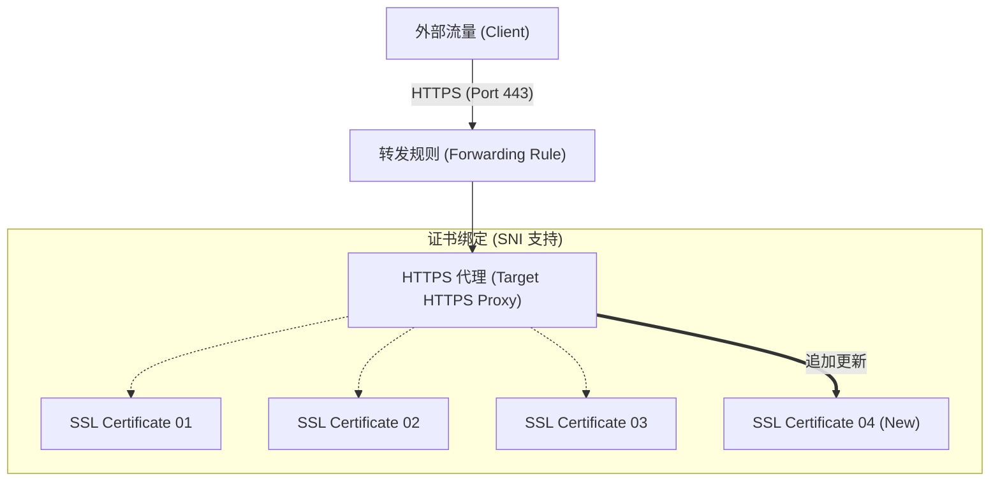

---
---
# GCP Target HTTPS Proxies 证书追加操作指南
## 问题分析
在 Google Cloud Load Balancing (GLB) 架构中，`target-https-proxies` 是承载 HTTPS 流量的核心组件。它关联了 URL Map（定义路由规则）和 SSL Certificates（定义证书）。
**核心需求**：在已有 3 个证书的基础上，追加第 4 个证书。
**技术本质**：修改 Target HTTPS Proxy 的 `ssl-certificates` 属性。
**限制说明**：单个 Target HTTPS Proxy 默认最多支持 15 个证书（通过 SNI 匹配）。如果需要支持更多，需使用 Certificate Manager。
## 解决方案
要实现证书的追加，不能直接使用 "add" 类命令（因为 gcloud 中该资源没有子命令专门用于 add），而是需要**全量覆盖更新**。
操作逻辑：
1. 确保新的证书资源（第 4 个证书）已经在 GCP 中创建完成
2. 获取当前 proxy 关联的所有证书名称
3. 执行 update 命令，将旧的证书列表与新的证书名称合并后重新设置
## 操作步骤
### 1. 创建新证书资源（如果尚未创建）
如果是手动上传的证书：
```bash
gcloud compute ssl-certificates create cert-04 \
  --certificate=/path/to/cert.pem \
  --private-key=/path/to/privkey.pem \
  --global
```
### 2. 追加证书到 HTTPS Proxy（核心命令）
使用 update 命令。**注意：必须包含所有需要保留的旧证书，否则它们会被移除。**
```bash
# 假设您的 Proxy 名字是 https-lb-proxy
# 之前的证书是 cert-01, cert-02, cert-03
# 现在追加 cert-04
gcloud compute target-https-proxies update https-lb-proxy \
  --ssl-certificates=cert-01,cert-02,cert-03,cert-04 \
  --global
```
### 3. 验证更新结果
```bash
gcloud compute target-https-proxies describe https-lb-proxy --global \
  --format="value(sslCertificates)"
```
## 架构图

## 注意事项
| 事项         | 说明                                                                                                                                                  |
| ------------ | ----------------------------------------------------------------------------------------------------------------------------------------------------- |
| 全量覆盖风险 | `gcloud compute target-https-proxies update --ssl-certificates=...` 是覆盖性操作。漏写任何一个旧证书都会导致该证书被移除，关联域名会出现 SSL 握手失败 |
| SNI 匹配     | GLB 会根据客户端请求中的域名（SNI）自动选择匹配证书。新追加的证书需包含正确的 SAN（Subject Alternative Name）                                         |
| 生效时间     | 配置下发到全球边缘节点通常需要 **1-5 分钟**                                                                                                           |
### 证书数量超过 15 个？
建议迁移到 **Certificate Manager**。在该模式下，Proxy 不直接绑定证书列表，而是绑定一个 Certificate Map，支持更灵活的通配符域名。
### IAM 权限要求
执行上述操作需要具备：
- `compute.targetHttpsProxies.update`
- `compute.sslCertificates.get`
通常由 `roles/compute.loadBalancerAdmin` 角色提供。
---
**您目前是打算手动管理这些证书，还是有考虑通过 Google 托管证书（Google-managed certificates）来实现自动续期？**
---
---
