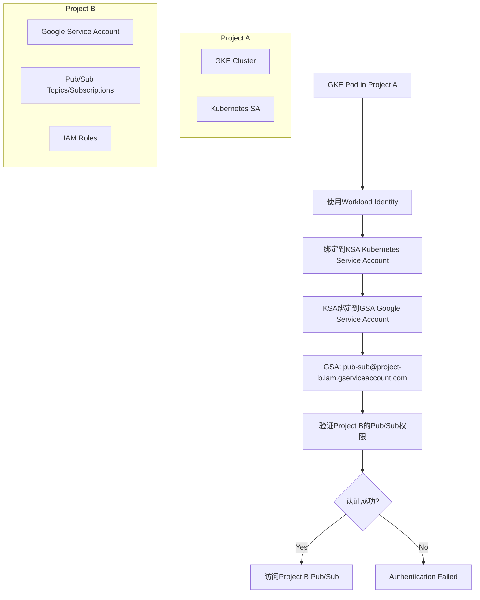
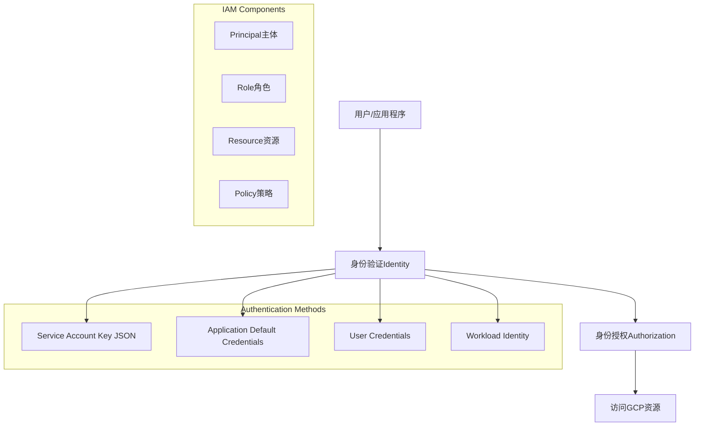
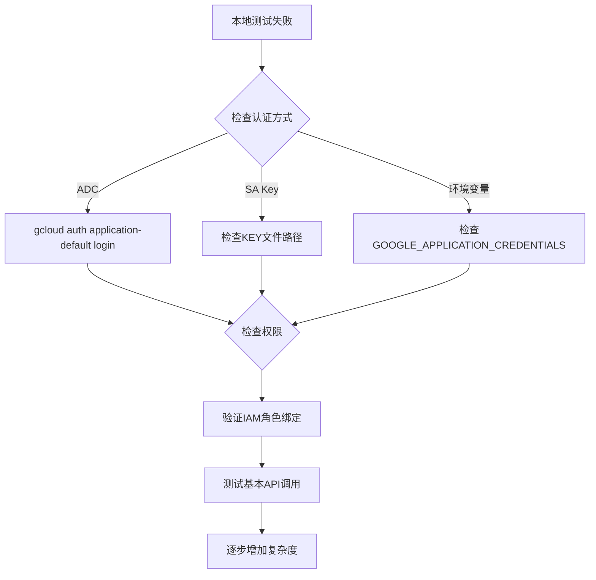

# Summary

- a
- 我有这样一个问题，运行在 GCP 工程 A 里面的一个 GKE 的 Pod

通过 workload Identify 启动 Pod 这个 Pod 需要连接 GCP 工程 B 里面的 pub/sub

我们是通过 IAM Based Authentication 的方式来实现的。

我也验证了 A 工程 GKE SA 绑定了正确的另外一个工程 B 的 GCE SA 比如叫pub-sub@project-b.iam.gserviceaccount.com

B 工程的 GCE SA 也有对应的 Role

那么现在 A 工程的 Pod 报错

failed to connect to pub/sub APIs,

Check your credentials and verify you have proper access to the service.

是不是代码没有走 IAM Based Authentication 的验证方式呢？

帮我整理这个过程？或者可能的 java 代码部分

# Claude

基于你的描述，这是一个典型的跨项目 Workload Identity 认证问题。让我帮你分析整个流程和可能的问题点。

## Workload Identity 跨项目认证流程



## 检查清单和可能问题

### 1. Workload Identity 配置验证

```bash
# 检查GKE集群是否启用了Workload Identity
gcloud container clusters describe CLUSTER_NAME \
    --zone=ZONE \
    --project=PROJECT_A \
    --format="value(workloadIdentityConfig.workloadPool)"

# 检查节点池配置
gcloud container node-pools describe NODE_POOL_NAME \
    --cluster=CLUSTER_NAME \
    --zone=ZONE \
    --project=PROJECT_A \
    --format="value(config.workloadMetadataConfig.mode)"
```

### 2. Service Account 绑定验证

```bash
# 检查KSA到GSA的绑定
kubectl describe serviceaccount KSA_NAME -n NAMESPACE

# 检查GSA的IAM绑定
gcloud iam service-accounts get-iam-policy \
    pub-sub@project-b.iam.gserviceaccount.com \
    --project=PROJECT_B
```

### 3. 必需的 IAM 角色配置

| 角色类型               | 角色名称                         | 应用对象       | 作用域    |
| ---------------------- | -------------------------------- | -------------- | --------- |
| Workload Identity User | `roles/iam.workloadIdentityUser` | KSA 绑定到 GSA | Project B |
| Pub/Sub Publisher      | `roles/pubsub.publisher`         | GSA            | Project B |
| Pub/Sub Subscriber     | `roles/pubsub.subscriber`        | GSA            | Project B |
| Pub/Sub Viewer         | `roles/pubsub.viewer`            | GSA            | Project B |

### 4. Java 代码实现

#### 正确的 IAM Based Authentication 方式

```java
import com.google.cloud.pubsub.v1.Publisher;
import com.google.cloud.pubsub.v1.Subscriber;
import com.google.api.gax.core.CredentialsProvider;
import com.google.auth.oauth2.GoogleCredentials;
import com.google.cloud.pubsub.v1.TopicName;
import com.google.protobuf.ByteString;
import com.google.pubsub.v1.PubsubMessage;

public class PubSubClient {

    private final String projectId = "project-b";
    private final String topicId = "your-topic";

    // 使用默认凭据链，支持Workload Identity
    public Publisher createPublisher() throws IOException {
        TopicName topicName = TopicName.of(projectId, topicId);

        // 不要手动指定凭据，让Google Cloud SDK自动处理
        Publisher publisher = Publisher.newBuilder(topicName)
            .build();

        return publisher;
    }

    // 错误示例：手动指定Service Account Key
    public Publisher createPublisherWrong() throws IOException {
        TopicName topicName = TopicName.of(projectId, topicId);

        // ❌ 这样会绕过Workload Identity
        GoogleCredentials credentials = GoogleCredentials
            .fromStream(new FileInputStream("service-account-key.json"));

        Publisher publisher = Publisher.newBuilder(topicName)
            .setCredentialsProvider(() -> credentials)
            .build();

        return publisher;
    }
}
```

#### 完整的连接测试代码

```java
import com.google.api.core.ApiFuture;
import com.google.cloud.pubsub.v1.Publisher;
import com.google.protobuf.ByteString;
import com.google.pubsub.v1.PubsubMessage;
import java.util.concurrent.TimeUnit;

public class PubSubTest {

    public void testConnection() {
        try {
            // 创建Publisher，使用默认凭据
            Publisher publisher = createPublisher();

            // 发送测试消息
            PubsubMessage message = PubsubMessage.newBuilder()
                .setData(ByteString.copyFromUtf8("Test message"))
                .build();

            ApiFuture<String> messageIdFuture = publisher.publish(message);
            String messageId = messageIdFuture.get();

            System.out.println("Published message ID: " + messageId);

            publisher.shutdown();
            publisher.awaitTermination(1, TimeUnit.MINUTES);

        } catch (Exception e) {
            System.err.println("Connection failed: " + e.getMessage());
            e.printStackTrace();
        }
    }
}
```

## 排查步骤

### 1. Pod 内验证身份

```bash
# 在Pod内执行
kubectl exec -it POD_NAME -- /bin/bash

# 检查元数据服务
curl -H "Metadata-Flavor: Google" \
  http://metadata.google.internal/computeMetadata/v1/instance/service-accounts/default/email

# 检查token
curl -H "Metadata-Flavor: Google" \
  http://metadata.google.internal/computeMetadata/v1/instance/service-accounts/default/token
```

### 2. 验证权限

```bash
# 使用gcloud在Pod内测试
gcloud auth list
gcloud config set project project-b
gcloud pubsub topics list
```

## 常见问题和解决方案

### 问题 1: 代码使用了错误的认证方式

**症状**: 即使 Workload Identity 配置正确，仍然认证失败

**解决方案**:

- 确保代码中没有手动指定 Service Account Key 文件
- 不要设置`GOOGLE_APPLICATION_CREDENTIALS`环境变量
- 使用默认的`GoogleCredentials.getApplicationDefault()`

### 问题 2: IAM 绑定不正确

```bash
# 正确的绑定命令
gcloud iam service-accounts add-iam-policy-binding \
    pub-sub@project-b.iam.gserviceaccount.com \
    --role roles/iam.workloadIdentityUser \
    --member "serviceAccount:project-a.svc.id.goog[NAMESPACE/KSA_NAME]" \
    --project=PROJECT_B
```

### 问题 3: Pod 配置缺少 Service Account

```yaml
apiVersion: v1
kind: Pod
metadata:
  name: pubsub-pod
spec:
  serviceAccountName: workload-identity-sa  # 必须指定
  containers:
  - name: app
    image: your-image
```

通过以上检查，应该能够定位到具体的问题所在。最常见的问题是代码中意外使用了其他认证方式，绕过了 Workload Identity 机制。​​​​​​​​​​​​​​​​


## 什么是IAM Based Authentication

IAM Based Authentication是Google Cloud Platform提供的身份验证机制，它基于Google Cloud IAM系统来控制访问权限。

### 核心概念



### IAM Based Authentication vs 其他认证方式

|认证方式               |描述             |适用场景      |安全性|
|-------------------|---------------|----------|---|
|**IAM Based**      |基于IAM角色和策略的动态认证|生产环境，跨项目访问|高  |
|API Key            |静态密钥认证         |简单的API调用  |中  |
|OAuth 2.0          |用户授权访问         |用户代理场景    |高  |
|Service Account Key|JSON密钥文件       |开发测试环境    |中低 |

## 本地模拟IAM Based Authentication

### 方法1: 使用gcloud认证 (推荐)

```bash
# 登录到你的Google账户
gcloud auth login

# 设置应用默认凭据 (ADC)
gcloud auth application-default login

# 设置项目
gcloud config set project project-b

# 验证当前身份
gcloud auth list
```

#### Java代码实现

```java
import com.google.cloud.pubsub.v1.Publisher;
import com.google.cloud.pubsub.v1.TopicName;
import com.google.auth.oauth2.GoogleCredentials;
import com.google.protobuf.ByteString;
import com.google.pubsub.v1.PubsubMessage;

public class LocalPubSubTest {
    
    public void testWithADC() throws Exception {
        String projectId = "project-b";
        String topicId = "your-topic";
        
        // 使用Application Default Credentials
        // 这会自动使用gcloud auth application-default login的凭据
        TopicName topicName = TopicName.of(projectId, topId);
        Publisher publisher = Publisher.newBuilder(topicName).build();
        
        // 发送测试消息
        PubsubMessage message = PubsubMessage.newBuilder()
            .setData(ByteString.copyFromUtf8("Local test message"))
            .putAttributes("source", "local-test")
            .build();
            
        String messageId = publisher.publish(message).get();
        System.out.println("Message published: " + messageId);
        
        publisher.shutdown();
    }
}
```

### 方法2: 模拟Service Account

```bash
# 创建一个Service Account用于测试
gcloud iam service-accounts create local-test-sa \
    --display-name="Local Test SA" \
    --project=project-b

# 授予必要权限
gcloud projects add-iam-policy-binding project-b \
    --member="serviceAccount:local-test-sa@project-b.iam.gserviceaccount.com" \
    --role="roles/pubsub.publisher"

# 生成并下载密钥
gcloud iam service-accounts keys create ~/local-test-key.json \
    --iam-account=local-test-sa@project-b.iam.gserviceaccount.com
```

#### 使用Service Account Key

```java
import com.google.auth.oauth2.ServiceAccountCredentials;
import java.io.FileInputStream;

public class LocalPubSubWithSA {
    
    public void testWithServiceAccount() throws Exception {
        String projectId = "project-b";
        String topicId = "your-topic";
        String keyPath = System.getProperty("user.home") + "/local-test-key.json";
        
        // 使用Service Account认证
        GoogleCredentials credentials = ServiceAccountCredentials
            .fromStream(new FileInputStream(keyPath));
            
        TopicName topicName = TopicName.of(projectId, topicId);
        Publisher publisher = Publisher.newBuilder(topicName)
            .setCredentialsProvider(() -> credentials)
            .build();
            
        // 测试发送
        PubsubMessage message = PubsubMessage.newBuilder()
            .setData(ByteString.copyFromUtf8("SA test message"))
            .build();
            
        String messageId = publisher.publish(message).get();
        System.out.println("Message ID: " + messageId);
        
        publisher.shutdown();
    }
}
```

### 方法3: 模拟跨项目访问

如果你想完全模拟A项目访问B项目的场景：

```bash
# 创建模拟A项目的Service Account
gcloud iam service-accounts create mock-project-a-sa \
    --display-name="Mock Project A SA" \
    --project=project-a

# 在B项目中给A项目的SA授权
gcloud projects add-iam-policy-binding project-b \
    --member="serviceAccount:mock-project-a-sa@project-a.iam.gserviceaccount.com" \
    --role="roles/pubsub.publisher"

# 使用A项目SA的身份
gcloud iam service-accounts keys create ~/mock-a-key.json \
    --iam-account=mock-project-a-sa@project-a.iam.gserviceaccount.com
```

## 完整的本地测试方案

### 测试脚本

```java
import com.google.cloud.pubsub.v1.*;
import com.google.auth.oauth2.GoogleCredentials;
import com.google.protobuf.ByteString;
import com.google.pubsub.v1.PubsubMessage;

public class CrossProjectPubSubTest {
    
    private static final String PROJECT_B = "project-b";
    private static final String TOPIC_ID = "test-topic";
    
    public static void main(String[] args) {
        CrossProjectPubSubTest tester = new CrossProjectPubSubTest();
        
        try {
            // 测试1: ADC方式
            System.out.println("Testing with ADC...");
            tester.testWithADC();
            
            // 测试2: Service Account方式
            System.out.println("Testing with Service Account...");
            tester.testWithServiceAccount();
            
        } catch (Exception e) {
            System.err.println("Test failed: " + e.getMessage());
            e.printStackTrace();
        }
    }
    
    private void testWithADC() throws Exception {
        TopicName topicName = TopicName.of(PROJECT_B, TOPIC_ID);
        
        try (Publisher publisher = Publisher.newBuilder(topicName).build()) {
            PubsubMessage message = PubsubMessage.newBuilder()
                .setData(ByteString.copyFromUtf8("ADC Test Message"))
                .putAttributes("method", "adc")
                .putAttributes("timestamp", String.valueOf(System.currentTimeMillis()))
                .build();
                
            String messageId = publisher.publish(message).get();
            System.out.println("ADC - Message ID: " + messageId);
        }
    }
    
    private void testWithServiceAccount() throws Exception {
        // 这里使用环境变量指定SA key路径
        String keyPath = System.getenv("GOOGLE_APPLICATION_CREDENTIALS");
        if (keyPath == null) {
            System.out.println("GOOGLE_APPLICATION_CREDENTIALS not set, skipping SA test");
            return;
        }
        
        TopicName topicName = TopicName.of(PROJECT_B, TOPIC_ID);
        
        try (Publisher publisher = Publisher.newBuilder(topicName).build()) {
            PubsubMessage message = PubsubMessage.newBuilder()
                .setData(ByteString.copyFromUtf8("SA Test Message"))
                .putAttributes("method", "service-account")
                .putAttributes("timestamp", String.valueOf(System.currentTimeMillis()))
                .build();
                
            String messageId = publisher.publish(message).get();
            System.out.println("SA - Message ID: " + messageId);
        }
    }
}
```

### 运行测试

```bash
# 方式1: 使用ADC
gcloud auth application-default login
java -cp ".:google-cloud-pubsub-1.120.0.jar" CrossProjectPubSubTest

# 方式2: 使用Service Account
export GOOGLE_APPLICATION_CREDENTIALS="~/local-test-key.json"
java -cp ".:google-cloud-pubsub-1.120.0.jar" CrossProjectPubSubTest
```

## 验证和排查

### 检查认证状态

```bash
# 查看当前认证的账户
gcloud auth list

# 查看应用默认凭据
gcloud auth application-default print-access-token

# 测试Pub/Sub访问权限
gcloud pubsub topics list --project=project-b
```

### 常见问题排查



通过这些方法，你可以在本地完全模拟IAM Based Authentication的连接方式，并验证跨项目的Pub/Sub访问是否配置正确。​​​​​​​​​​​​​​​​

# ChatGPT

以下是你遇到的问题的分析、IAM based authentication 的工作原理、可能的错误原因，以及对应的 Java 示例代码检查建议，均以 Markdown 原始格式输出：

🧩 场景说明

你当前的结构是：

- GCP Project A:

- 部署 GKE Pod
- Pod 使用 Workload Identity 绑定到 Project B 的服务账号 pub-sub@project-b.iam.gserviceaccount.com

-
- GCP Project B:

- 托管 Pub/Sub 服务
- 服务账号 pub-sub@project-b.iam.gserviceaccount.com 拥有正确的 Pub/Sub 权限（例如 roles/pubsub.publisher）

-

你遇到的报错：

failed to connect to pub/sub APIs, Check your credentials and verify you have proper access to the service.

✅ 正常流程（Workload Identity + IAM Based Auth）

graph TD;

A[GKE Pod in Project A] --> B[GKE Metadata Server 提供 token];

B --> C[Service Account: pub-sub@project-b];

C --> D[Pub/Sub API in Project B];

正确配置检查流程：

1. Project A 中的 GKE Pod 的 Kubernetes SA 是否绑定了 GCP SA：

gcloud iam service-accounts add-iam-policy-binding \

pub-sub@project-b.iam.gserviceaccount.com \

--role roles/iam.workloadIdentityUser \

--member "serviceAccount:project-a.svc.id.goog[namespace/k8s-sa-name]"

1.

2.  GKE 中的 Pod 是否添加了 annotation：

annotations:

iam.gke.io/gcp-service-account: "pub-sub@project-b.iam.gserviceaccount.com"

2.

3.  GKE Cluster 是否启用了 Workload Identity：

gcloud container clusters describe [CLUSTER_NAME] \

--region=[REGION] \

--format="value(workloadIdentityConfig.workloadPool)"

3. 输出应为 project-a.svc.id.goog

🚨 可能的错误原因分析

|                                                     |                                                  |
| --------------------------------------------------- | ------------------------------------------------ |
| 排查项                                              | 说明                                             |
| 未正确设置 IAM Binding                              | workloadIdentityUser 权限缺失                    |
| Pod annotation 错误或缺失                           | 绑定 SA 的 annotation 没加或拼错                 |
| 应用未使用默认 Application Default Credential (ADC) | Java 代码未使用 ADC 加载 GCP 认证                |
| Pod 没有访问 metadata server 权限                   | 防火墙或 DNS 被屏蔽 metadata                     |
| Pub/Sub Client 初始化方式错误                       | 手动指定了不正确的 key.json 或使用 Basic Auth 等 |

🔍 Java 正确用法参考（使用 ADC）

以下是一个 Java 示例，使用的是 ADC 自动方式，让系统通过 GKE 上下文自动获取绑定的服务账号。

import com.google.cloud.pubsub.v1.Publisher;

import com.google.pubsub.v1.TopicName;

import com.google.protobuf.ByteString;

import com.google.pubsub.v1.PubsubMessage;

public class PubSubPublisher {

public static void main(String[] args) throws Exception {

String projectId = "project-b";

String topicId = "my-topic";

TopicName topicName = TopicName.of(projectId, topicId);

Publisher publisher = Publisher.newBuilder(topicName).build();

String message = "hello world";

ByteString data = ByteString.copyFromUtf8(message);

PubsubMessage pubsubMessage = PubsubMessage.newBuilder().setData(data).build();

publisher.publish(pubsubMessage).get();

publisher.shutdown();

}

}

✅ 注意：上面没有显式传入 service account key，这是 Workload Identity 的要求，必须依赖环境变量 GOOGLE_APPLICATION_CREDENTIALS 未设置。

🧪 验证建议

你可以在 Pod 里运行以下命令，确认当前使用的是哪个 SA：

curl -H "Metadata-Flavor: Google" \

http://metadata.google.internal/computeMetadata/v1/instance/service-accounts/default/email

结果应为：

pub-sub@project-b.iam.gserviceaccount.com

✅ 总结建议

|                           |                                                       |
| ------------------------- | ----------------------------------------------------- |
| 动作                      | 说明                                                  |
| 检查 KSA annotation       | iam.gke.io/gcp-service-account 必须正确配置           |
| 检查 Java 是否自动用 ADC  | 不要在代码中使用 key.json，必须用默认 credential      |
| 检查 IAM 权限             | roles/pubsub.publisher 是否分配给了 pub-sub@project-b |
| 检查 metadata server 通信 | Pod 内 curl metadata 确保能拿到 token                 |

如需我帮你检查你现有 Pod 的 YAML、IAM binding 命令、或 Java 代码片段，可发给我我帮你分析。
