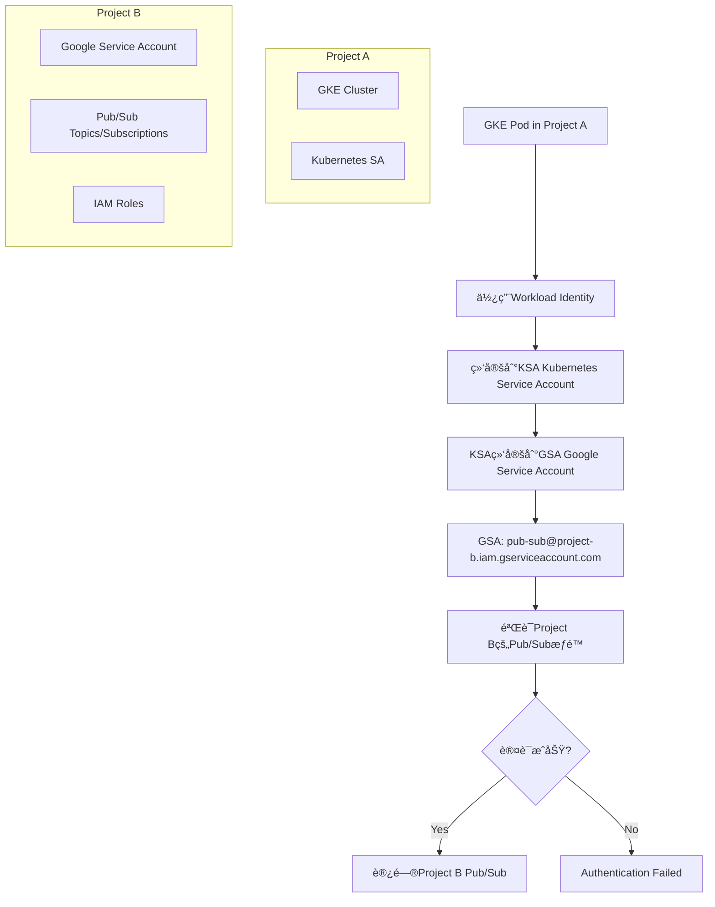
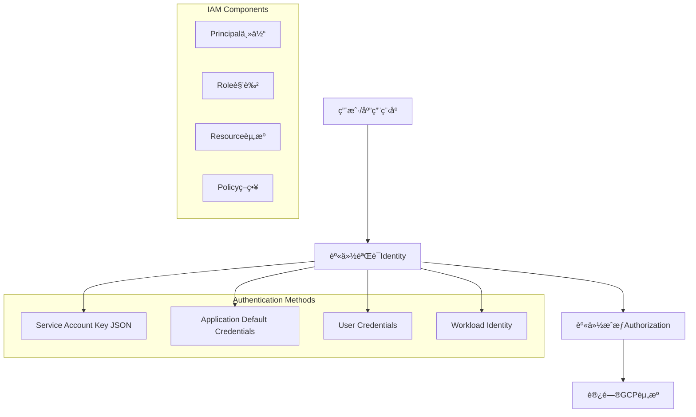
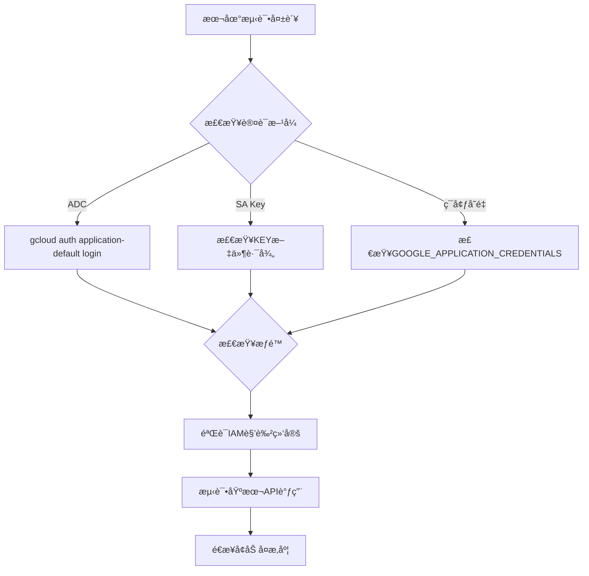

# Summary

- a
- 我有这样一个问题，è¿è¡Œåœ¨ GCP 工程 A 里é¢çš„一个 GKE çš„ Pod

通过 workload Identify å¯åŠ¨ Pod 这个 Pod 需è¦è¿æ¥ GCP 工程 B 里é¢çš„ pub/sub

我们是通过 IAM Based Authentication çš„æ–¹å¼æ¥å®ç°çš„。

我也验è¯äº† A 工程 GKE SA 绑定了正确的å¦å¤–一个工程 B çš„ GCE SA 比如å«pub-sub@project-b.iam.gserviceaccount.com

B 工程的 GCE SA 也有对应的 Role

那么ç°åœ¨ A 工程的 Pod 报错

failed to connect to pub/sub APIs,

Check your credentials and verify you have proper access to the service.

是ä¸æ˜¯ä»£ç æ²¡æœ‰èµ° IAM Based Authentication 的验è¯æ–¹å¼å‘¢ï¼Ÿ

帮我整ç†è¿™ä¸ªè¿‡ç¨‹ï¼Ÿæˆ–者å¯èƒ½çš„ java 代ç éƒ¨åˆ†

# Claude

基äºä½ çš„æ述，这是一个典å‹çš„跨项目 Workload Identity 认è¯é—®é¢˜ã€‚让我帮你分æ整个æµç¨‹å’Œå¯èƒ½çš„问题点。

## Workload Identity 跨项目认è¯æµç¨‹



## 检查清å•å’Œå¯èƒ½é—®é¢˜

### 1. Workload Identity é…置验è¯

```bash
# 检查GKE集群是å¦å¯ç”¨äº†Workload Identity
gcloud container clusters describe CLUSTER_NAME \
    --zone=ZONE \
    --project=PROJECT_A \
    --format="value(workloadIdentityConfig.workloadPool)"

# 检查节点池é…ç½®
gcloud container node-pools describe NODE_POOL_NAME \
    --cluster=CLUSTER_NAME \
    --zone=ZONE \
    --project=PROJECT_A \
    --format="value(config.workloadMetadataConfig.mode)"
```

### 2. Service Account 绑定验è¯

```bash
# 检查KSA到GSA的绑定
kubectl describe serviceaccount KSA_NAME -n NAMESPACE

# 检查GSA的IAM绑定
gcloud iam service-accounts get-iam-policy \
    pub-sub@project-b.iam.gserviceaccount.com \
    --project=PROJECT_B
```

### 3. 必需的 IAM 角色é…ç½®

| è§’è‰²ç±»å‹               | 角色å称                         | 应用对象       | 作用域    |
| ---------------------- | -------------------------------- | -------------- | --------- |
| Workload Identity User | `roles/iam.workloadIdentityUser` | KSA 绑定到 GSA | Project B |
| Pub/Sub Publisher      | `roles/pubsub.publisher`         | GSA            | Project B |
| Pub/Sub Subscriber     | `roles/pubsub.subscriber`        | GSA            | Project B |
| Pub/Sub Viewer         | `roles/pubsub.viewer`            | GSA            | Project B |

### 4. Java 代ç å®ç°

#### 正确的 IAM Based Authentication æ–¹å¼

```java
import com.google.cloud.pubsub.v1.Publisher;
import com.google.cloud.pubsub.v1.Subscriber;
import com.google.api.gax.core.CredentialsProvider;
import com.google.auth.oauth2.GoogleCredentials;
import com.google.cloud.pubsub.v1.TopicName;
import com.google.protobuf.ByteString;
import com.google.pubsub.v1.PubsubMessage;

public class PubSubClient {

    private final String projectId = "project-b";
    private final String topicId = "your-topic";

    // 使用默认凭æ®é“¾ï¼Œæ”¯æŒWorkload Identity
    public Publisher createPublisher() throws IOException {
        TopicName topicName = TopicName.of(projectId, topicId);

        // ä¸è¦æ‰‹åŠ¨æŒ‡å®šå‡­æ®ï¼Œè®©Google Cloud SDK自动处ç†
        Publisher publisher = Publisher.newBuilder(topicName)
            .build();

        return publisher;
    }

    // 错误示例：手动指定Service Account Key
    public Publisher createPublisherWrong() throws IOException {
        TopicName topicName = TopicName.of(projectId, topicId);

        // ⌠这样会绕过Workload Identity
        GoogleCredentials credentials = GoogleCredentials
            .fromStream(new FileInputStream("service-account-key.json"));

        Publisher publisher = Publisher.newBuilder(topicName)
            .setCredentialsProvider(() -> credentials)
            .build();

        return publisher;
    }
}
```

#### 完整的è¿æ¥æµ‹è¯•ä»£ç 

```java
import com.google.api.core.ApiFuture;
import com.google.cloud.pubsub.v1.Publisher;
import com.google.protobuf.ByteString;
import com.google.pubsub.v1.PubsubMessage;
import java.util.concurrent.TimeUnit;

public class PubSubTest {

    public void testConnection() {
        try {
            // 创建Publisher，使用默认凭æ®
            Publisher publisher = createPublisher();

            // å‘é€æµ‹è¯•æ¶ˆæ¯
            PubsubMessage message = PubsubMessage.newBuilder()
                .setData(ByteString.copyFromUtf8("Test message"))
                .build();

            ApiFuture<String> messageIdFuture = publisher.publish(message);
            String messageId = messageIdFuture.get();

            System.out.println("Published message ID: " + messageId);

            publisher.shutdown();
            publisher.awaitTermination(1, TimeUnit.MINUTES);

        } catch (Exception e) {
            System.err.println("Connection failed: " + e.getMessage());
            e.printStackTrace();
        }
    }
}
```

## æ’查步骤

### 1. Pod 内验è¯èº«ä»½

```bash
# 在Pod内执行
kubectl exec -it POD_NAME -- /bin/bash

# 检查元数æ®æœåŠ¡
curl -H "Metadata-Flavor: Google" \
  http://metadata.google.internal/computeMetadata/v1/instance/service-accounts/default/email

# 检查token
curl -H "Metadata-Flavor: Google" \
  http://metadata.google.internal/computeMetadata/v1/instance/service-accounts/default/token
```

### 2. 验è¯æƒé™

```bash
# 使用gcloud在Pod内测试
gcloud auth list
gcloud config set project project-b
gcloud pubsub topics list
```

## 常è§é—®é¢˜å’Œè§£å†³æ–¹æ¡ˆ

### 问题 1: 代ç ä½¿ç”¨äº†é”™è¯¯çš„认è¯æ–¹å¼

**症状**: å³ä½¿ Workload Identity é…置正确，ä»ç„¶è®¤è¯å¤±è´¥

**解决方案**:

- ç¡®ä¿ä»£ç ä¸­æ²¡æœ‰æ‰‹åŠ¨æŒ‡å®š Service Account Key 文件
- ä¸è¦è®¾ç½®`GOOGLE_APPLICATION_CREDENTIALS`ç¯å¢ƒå˜é‡
- 使用默认的`GoogleCredentials.getApplicationDefault()`

### 问题 2: IAM 绑定ä¸æ­£ç¡®

```bash
# 正确的绑定命令
gcloud iam service-accounts add-iam-policy-binding \
    pub-sub@project-b.iam.gserviceaccount.com \
    --role roles/iam.workloadIdentityUser \
    --member "serviceAccount:project-a.svc.id.goog[NAMESPACE/KSA_NAME]" \
    --project=PROJECT_B
```

### 问题 3: Pod é…置缺少 Service Account

```yaml
apiVersion: v1
kind: Pod
metadata:
  name: pubsub-pod
spec:
  serviceAccountName: workload-identity-sa  # 必须指定
  containers:
  - name: app
    image: your-image
```

通过以上检查，应该能够定ä½åˆ°å…·ä½“的问题所在。最常è§çš„问题是代ç ä¸­æ„外使用了其他认è¯æ–¹å¼ï¼Œç»•è¿‡äº† Workload Identity 机制。​​​​​​​​​​​​​​​​


## 什么是IAM Based Authentication

IAM Based Authentication是Google Cloud Platformæ供的身份验è¯æœºåˆ¶ï¼Œå®ƒåŸºäºGoogle Cloud IAM系统æ¥æ§åˆ¶è®¿é—®æƒé™ã€‚

### 核心概念



### IAM Based Authentication vs 其他认è¯æ–¹å¼

|认è¯æ–¹å¼               |æè¿°             |适用场景      |安全性|
|-------------------|---------------|----------|---|
|**IAM Based**      |基äºIAM角色和策略的动æ€è®¤è¯|生产ç¯å¢ƒï¼Œè·¨é¡¹ç›®è®¿é—®|高  |
|API Key            |é™æ€å¯†é’¥è®¤è¯         |简å•çš„API调用  |中  |
|OAuth 2.0          |用户æˆæƒè®¿é—®         |用户代ç†åœºæ™¯    |高  |
|Service Account Key|JSON密钥文件       |å¼€å‘测试ç¯å¢ƒ    |ä¸­ä½ |

## 本地模拟IAM Based Authentication

### 方法1: 使用gcloudè®¤è¯ (æ¨è)

```bash
# 登录到你的Google账户
gcloud auth login

# è®¾ç½®åº”ç”¨é»˜è®¤å‡­æ® (ADC)
gcloud auth application-default login

# 设置项目
gcloud config set project project-b

# 验è¯å½“å‰èº«ä»½
gcloud auth list
```

#### Java代ç å®ç°

```java
import com.google.cloud.pubsub.v1.Publisher;
import com.google.cloud.pubsub.v1.TopicName;
import com.google.auth.oauth2.GoogleCredentials;
import com.google.protobuf.ByteString;
import com.google.pubsub.v1.PubsubMessage;

public class LocalPubSubTest {
    
    public void testWithADC() throws Exception {
        String projectId = "project-b";
        String topicId = "your-topic";
        
        // 使用Application Default Credentials
        // 这会自动使用gcloud auth application-default login的凭æ®
        TopicName topicName = TopicName.of(projectId, topId);
        Publisher publisher = Publisher.newBuilder(topicName).build();
        
        // å‘é€æµ‹è¯•æ¶ˆæ¯
        PubsubMessage message = PubsubMessage.newBuilder()
            .setData(ByteString.copyFromUtf8("Local test message"))
            .putAttributes("source", "local-test")
            .build();
            
        String messageId = publisher.publish(message).get();
        System.out.println("Message published: " + messageId);
        
        publisher.shutdown();
    }
}
```

### 方法2: 模拟Service Account

```bash
# 创建一个Service Account用äºæµ‹è¯•
gcloud iam service-accounts create local-test-sa \
    --display-name="Local Test SA" \
    --project=project-b

# æˆäºˆå¿…è¦æƒé™
gcloud projects add-iam-policy-binding project-b \
    --member="serviceAccount:local-test-sa@project-b.iam.gserviceaccount.com" \
    --role="roles/pubsub.publisher"

# 生æˆå¹¶ä¸‹è½½å¯†é’¥
gcloud iam service-accounts keys create ~/local-test-key.json \
    --iam-account=local-test-sa@project-b.iam.gserviceaccount.com
```

#### 使用Service Account Key

```java
import com.google.auth.oauth2.ServiceAccountCredentials;
import java.io.FileInputStream;

public class LocalPubSubWithSA {
    
    public void testWithServiceAccount() throws Exception {
        String projectId = "project-b";
        String topicId = "your-topic";
        String keyPath = System.getProperty("user.home") + "/local-test-key.json";
        
        // 使用Service Account认è¯
        GoogleCredentials credentials = ServiceAccountCredentials
            .fromStream(new FileInputStream(keyPath));
            
        TopicName topicName = TopicName.of(projectId, topicId);
        Publisher publisher = Publisher.newBuilder(topicName)
            .setCredentialsProvider(() -> credentials)
            .build();
            
        // 测试å‘é€
        PubsubMessage message = PubsubMessage.newBuilder()
            .setData(ByteString.copyFromUtf8("SA test message"))
            .build();
            
        String messageId = publisher.publish(message).get();
        System.out.println("Message ID: " + messageId);
        
        publisher.shutdown();
    }
}
```

### 方法3: 模拟跨项目访问

如æœä½ æƒ³å®Œå…¨æ¨¡æ‹ŸA项目访问B项目的场景：

```bash
# 创建模拟A项目的Service Account
gcloud iam service-accounts create mock-project-a-sa \
    --display-name="Mock Project A SA" \
    --project=project-a

# 在B项目中给A项目的SAæˆæƒ
gcloud projects add-iam-policy-binding project-b \
    --member="serviceAccount:mock-project-a-sa@project-a.iam.gserviceaccount.com" \
    --role="roles/pubsub.publisher"

# 使用A项目SA的身份
gcloud iam service-accounts keys create ~/mock-a-key.json \
    --iam-account=mock-project-a-sa@project-a.iam.gserviceaccount.com
```

## 完整的本地测试方案

### 测试脚本

```java
import com.google.cloud.pubsub.v1.*;
import com.google.auth.oauth2.GoogleCredentials;
import com.google.protobuf.ByteString;
import com.google.pubsub.v1.PubsubMessage;

public class CrossProjectPubSubTest {
    
    private static final String PROJECT_B = "project-b";
    private static final String TOPIC_ID = "test-topic";
    
    public static void main(String[] args) {
        CrossProjectPubSubTest tester = new CrossProjectPubSubTest();
        
        try {
            // 测试1: ADCæ–¹å¼
            System.out.println("Testing with ADC...");
            tester.testWithADC();
            
            // 测试2: Service Accountæ–¹å¼
            System.out.println("Testing with Service Account...");
            tester.testWithServiceAccount();
            
        } catch (Exception e) {
            System.err.println("Test failed: " + e.getMessage());
            e.printStackTrace();
        }
    }
    
    private void testWithADC() throws Exception {
        TopicName topicName = TopicName.of(PROJECT_B, TOPIC_ID);
        
        try (Publisher publisher = Publisher.newBuilder(topicName).build()) {
            PubsubMessage message = PubsubMessage.newBuilder()
                .setData(ByteString.copyFromUtf8("ADC Test Message"))
                .putAttributes("method", "adc")
                .putAttributes("timestamp", String.valueOf(System.currentTimeMillis()))
                .build();
                
            String messageId = publisher.publish(message).get();
            System.out.println("ADC - Message ID: " + messageId);
        }
    }
    
    private void testWithServiceAccount() throws Exception {
        // 这里使用ç¯å¢ƒå˜é‡æŒ‡å®šSA key路径
        String keyPath = System.getenv("GOOGLE_APPLICATION_CREDENTIALS");
        if (keyPath == null) {
            System.out.println("GOOGLE_APPLICATION_CREDENTIALS not set, skipping SA test");
            return;
        }
        
        TopicName topicName = TopicName.of(PROJECT_B, TOPIC_ID);
        
        try (Publisher publisher = Publisher.newBuilder(topicName).build()) {
            PubsubMessage message = PubsubMessage.newBuilder()
                .setData(ByteString.copyFromUtf8("SA Test Message"))
                .putAttributes("method", "service-account")
                .putAttributes("timestamp", String.valueOf(System.currentTimeMillis()))
                .build();
                
            String messageId = publisher.publish(message).get();
            System.out.println("SA - Message ID: " + messageId);
        }
    }
}
```

### è¿è¡Œæµ‹è¯•

```bash
# æ–¹å¼1: 使用ADC
gcloud auth application-default login
java -cp ".:google-cloud-pubsub-1.120.0.jar" CrossProjectPubSubTest

# æ–¹å¼2: 使用Service Account
export GOOGLE_APPLICATION_CREDENTIALS="~/local-test-key.json"
java -cp ".:google-cloud-pubsub-1.120.0.jar" CrossProjectPubSubTest
```

## 验è¯å’Œæ’查

### 检查认è¯çŠ¶æ€

```bash
# 查看当å‰è®¤è¯çš„账户
gcloud auth list

# 查看应用默认凭æ®
gcloud auth application-default print-access-token

# 测试Pub/Sub访问æƒé™
gcloud pubsub topics list --project=project-b
```

### 常è§é—®é¢˜æ’查



通过这些方法，你å¯ä»¥åœ¨æœ¬åœ°å®Œå…¨æ¨¡æ‹ŸIAM Based Authenticationçš„è¿æ¥æ–¹å¼ï¼Œå¹¶éªŒè¯è·¨é¡¹ç›®çš„Pub/Sub访问是å¦é…置正确。​​​​​​​​​​​​​​​​

# ChatGPT

以下是你é‡åˆ°çš„问题的分æã€IAM based authentication 的工作åŸç†ã€å¯èƒ½çš„错误åŸå› ï¼Œä»¥åŠå¯¹åº”çš„ Java 示例代ç æ£€æŸ¥å»ºè®®ï¼Œå‡ä»¥ Markdown åŸå§‹æ ¼å¼è¾“出：

🧩 场景说æ˜

你当å‰çš„结æ„是：

- GCP Project A:

- 部署 GKE Pod
- Pod 使用 Workload Identity 绑定到 Project B çš„æœåŠ¡è´¦å· pub-sub@project-b.iam.gserviceaccount.com

-
- GCP Project B:

- 托管 Pub/Sub æœåŠ¡
- æœåŠ¡è´¦å· pub-sub@project-b.iam.gserviceaccount.com 拥有正确的 Pub/Sub æƒé™ï¼ˆä¾‹å¦‚ roles/pubsub.publisher）

-

ä½ é‡åˆ°çš„报错：

failed to connect to pub/sub APIs, Check your credentials and verify you have proper access to the service.

✅ 正常æµç¨‹ï¼ˆWorkload Identity + IAM Based Auth）

graph TD;

A[GKE Pod in Project A] --> B[GKE Metadata Server æä¾› token];

B --> C[Service Account: pub-sub@project-b];

C --> D[Pub/Sub API in Project B];

正确é…置检查æµç¨‹ï¼š

1. Project A 中的 GKE Pod çš„ Kubernetes SA 是å¦ç»‘定了 GCP SA：

gcloud iam service-accounts add-iam-policy-binding \

pub-sub@project-b.iam.gserviceaccount.com \

--role roles/iam.workloadIdentityUser \

--member "serviceAccount:project-a.svc.id.goog[namespace/k8s-sa-name]"

1.

2.  GKE 中的 Pod 是å¦æ·»åŠ äº† annotation：

annotations:

iam.gke.io/gcp-service-account: "pub-sub@project-b.iam.gserviceaccount.com"

2.

3.  GKE Cluster 是å¦å¯ç”¨äº† Workload Identity：

gcloud container clusters describe [CLUSTER_NAME] \

--region=[REGION] \

--format="value(workloadIdentityConfig.workloadPool)"

3. 输出应为 project-a.svc.id.goog

🚨 å¯èƒ½çš„错误åŸå› åˆ†æ

|                                                     |                                                  |
| --------------------------------------------------- | ------------------------------------------------ |
| æ’查项                                              | è¯´æ˜                                             |
| 未正确设置 IAM Binding                              | workloadIdentityUser æƒé™ç¼ºå¤±                    |
| Pod annotation 错误或缺失                           | 绑定 SA 的 annotation 没加或拼错                 |
| 应用未使用默认 Application Default Credential (ADC) | Java 代ç æœªä½¿ç”¨ ADC 加载 GCP è®¤è¯                |
| Pod 没有访问 metadata server æƒé™                   | 防ç«å¢™æˆ– DNS 被å±è”½ metadata                     |
| Pub/Sub Client åˆå§‹åŒ–æ–¹å¼é”™è¯¯                       | 手动指定了ä¸æ­£ç¡®çš„ key.json 或使用 Basic Auth ç­‰ |

🔠Java 正确用法å‚考（使用 ADC）

以下是一个 Java 示例，使用的是 ADC 自动方å¼ï¼Œè®©ç³»ç»Ÿé€šè¿‡ GKE 上下文自动è·å–绑定的æœåŠ¡è´¦å·ã€‚

import com.google.cloud.pubsub.v1.Publisher;

import com.google.pubsub.v1.TopicName;

import com.google.protobuf.ByteString;

import com.google.pubsub.v1.PubsubMessage;

public class PubSubPublisher {

public static void main(String[] args) throws Exception {

String projectId = "project-b";

String topicId = "my-topic";

TopicName topicName = TopicName.of(projectId, topicId);

Publisher publisher = Publisher.newBuilder(topicName).build();

String message = "hello world";

ByteString data = ByteString.copyFromUtf8(message);

PubsubMessage pubsubMessage = PubsubMessage.newBuilder().setData(data).build();

publisher.publish(pubsubMessage).get();

publisher.shutdown();

}

}

✅ 注æ„：上é¢æ²¡æœ‰æ˜¾å¼ä¼ å…¥ service account key，这是 Workload Identity çš„è¦æ±‚，必须ä¾èµ–ç¯å¢ƒå˜é‡ GOOGLE_APPLICATION_CREDENTIALS 未设置。

🧪 验è¯å»ºè®®

ä½ å¯ä»¥åœ¨ Pod 里è¿è¡Œä»¥ä¸‹å‘½ä»¤ï¼Œç¡®è®¤å½“å‰ä½¿ç”¨çš„是哪个 SA：

curl -H "Metadata-Flavor: Google" \

http://metadata.google.internal/computeMetadata/v1/instance/service-accounts/default/email

结æœåº”为：

pub-sub@project-b.iam.gserviceaccount.com

✅ 总结建议

|                           |                                                       |
| ------------------------- | ----------------------------------------------------- |
| 动作                      | è¯´æ˜                                                  |
| 检查 KSA annotation       | iam.gke.io/gcp-service-account 必须正确é…ç½®           |
| 检查 Java 是å¦è‡ªåŠ¨ç”¨ ADC  | ä¸è¦åœ¨ä»£ç ä¸­ä½¿ç”¨ key.json，必须用默认 credential      |
| 检查 IAM æƒé™             | roles/pubsub.publisher 是å¦åˆ†é…给了 pub-sub@project-b |
| 检查 metadata server 通信 | Pod 内 curl metadata ç¡®ä¿èƒ½æ‹¿åˆ° token                 |

如需我帮你检查你ç°æœ‰ Pod çš„ YAMLã€IAM binding 命令ã€æˆ– Java 代ç ç‰‡æ®µï¼Œå¯å‘给我我帮你分æ。
