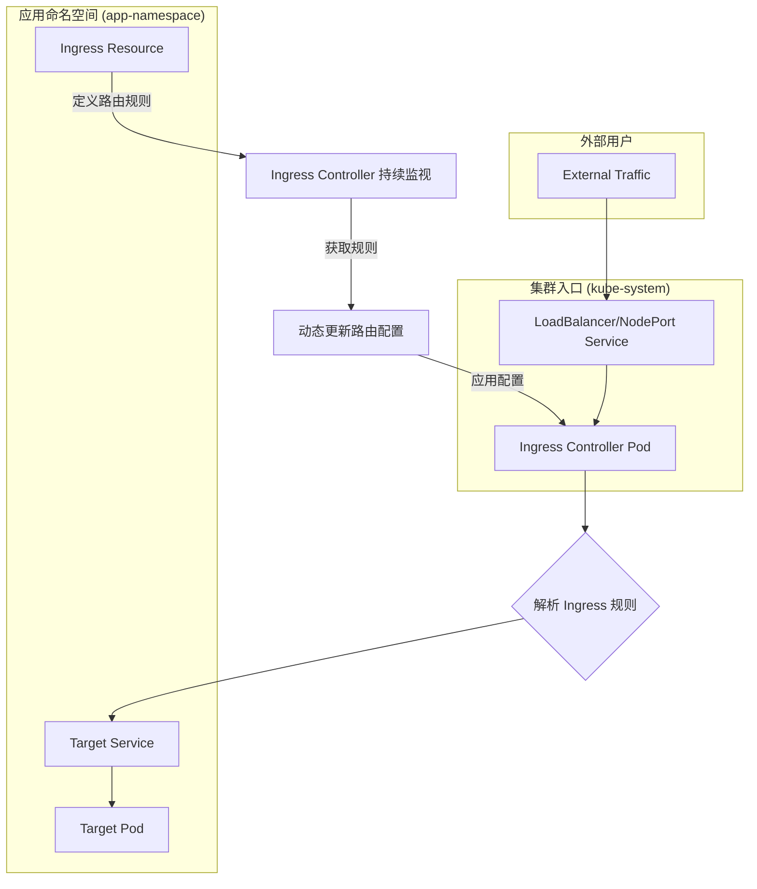
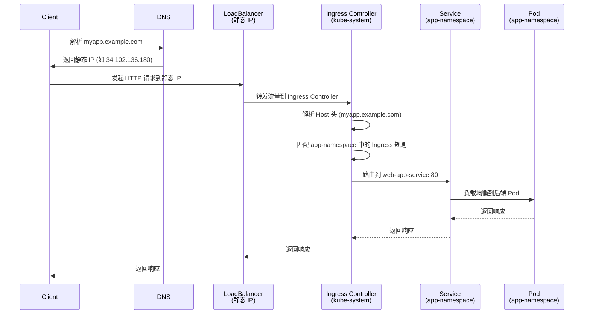

# K8s Ingress Controller 工作流深度解析

本文档旨在详细梳理 Kubernetes Ingress Controller 的工作流程、核心概念、配置实践与调试技巧。

## 1. 核心架构：定义与执行的分离

Kubernetes Ingress 模型通过将路由规则的“定义”与“执行”相分离，提供了一种强大而灵活的流量管理机制。

- **Ingress 资源 (The "What")**: 一个定义 L7 路由规则（如何根据主机名和路径将流量路由到内部服务）的 K8s API 对象。它本身是无状态的配置清单。
- **Ingress 控制器 (The "How")**: 一个作为反向代理和负载均衡器的“执行者”。它以 Pod 形式运行，持续监视集群中的 Ingress 资源，并动态更新其底层代理（如 NGINX）的配置，使路由规则生效。

### 服务暴露方式对比

| 特性 | NodePort | LoadBalancer | Ingress |
| :--- | :--- | :--- | :--- |
| **工作层级** | L4 (TCP/UDP) | L4 (TCP/UDP) | L7 (HTTP/S) |
| **入口点** | 每个节点的 IP + 静态端口 | 每个服务一个独立的 IP | 单个 IP 路由到多个服务 |
| **成本模型** | 低（无额外云资源） | 高（每个服务一个 LB） | 低（多个服务共享一个 LB） |
| **路由能力** | 基于端口 | 基于 IP 和端口 | 基于主机名和路径 |
| **TLS 终止** | 不支持 | 不支持 | 支持 |
| **理想用例** | 调试、开发环境 | 暴露单个 L4 服务 | 暴露多个 HTTP/S 微服务 |

## 2. 工作流程详解

### 整体架构图



### 请求处理流程



## 3. 完整配置示例：跨命名空间路由

本示例演示了如何使用部署在 `kube-system` 中的集中式 Ingress Controller，为 `app-namespace` 中的应用提供服务。

### 第 1 步：部署 Ingress Controller (位于 `kube-system`)

此 Service 是集群的统一流量入口，也是静态 IP 的唯一绑定点。

```yaml
# ingress-controller-service.yaml
apiVersion: v1
kind: Service
metadata:
  name: ingress-nginx-controller
  namespace: kube-system
  annotations:
    # 对于GCP/GKE，使用此注解绑定预留的静态IP
    kubernetes.io/ingress.global-static-ip-name: "my-static-ip"
    # 对于其他云厂商，可能有不同的注解
    cloud.google.com/load-balancer-type: "External"
spec:
  type: LoadBalancer
  # 直接指定预留的静态IP地址
  loadBalancerIP: 34.102.136.180
  ports:
  - name: http
    port: 80
    targetPort: http
  - name: https  
    port: 443
    targetPort: https
  selector:
    # 确保此选择器与 Ingress Controller 的 Pod 标签匹配
    app.kubernetes.io/name: ingress-nginx
    app.kubernetes.io/component: controller
```

### 第 2 步：部署业务应用 (位于 `app-namespace`)

应用 Service 使用 `ClusterIP` 类型，仅供集群内部访问。

```yaml
# app-deployment.yaml
apiVersion: v1
kind: Namespace
metadata:
  name: app-namespace
---
apiVersion: apps/v1
kind: Deployment
metadata:
  name: web-app
  namespace: app-namespace
spec:
  replicas: 3
  selector:
    matchLabels:
      app: web-app
  template:
    metadata:
      labels:
        app: web-app
    spec:
      containers:
      - name: web
        image: nginx:1.21
        ports:
        - containerPort: 80
---
apiVersion: v1
kind: Service
metadata:
  name: web-app-service
  namespace: app-namespace
spec:
  selector:
    app: web-app
  ports:
  - port: 80
    targetPort: 80
  type: ClusterIP
```

### 第 3 步：创建 Ingress 路由规则 (位于 `app-namespace`)

此 Ingress 资源定义了路由逻辑，但 **不** 配置任何 IP 地址。

```yaml
# app-ingress.yaml
apiVersion: networking.k8s.io/v1
kind: Ingress
metadata:
  name: web-app-ingress
  namespace: app-namespace
  annotations:
    # 必须指定 Ingress Class，以确保由正确的 Ingress Controller 处理
    kubernetes.io/ingress.class: "nginx"
    # 错误做法：不要在业务 Ingress 资源中配置静态 IP
    # kubernetes.io/ingress.global-static-ip-name: "xxx" # ❌
spec:
  rules:
  - host: myapp.example.com
    http:
      paths:
      - path: /
        pathType: Prefix
        backend:
          service:
            name: web-app-service
            port:
              number: 80
  - host: api.example.com
    http:
      paths:
      - path: /api
        pathType: Prefix
        backend:
          service:
            name: web-app-service
            port:
              number: 80
```

## 4. 静态 IP 绑定策略

一个常见的误区是在业务命名空间的 `Ingress` 资源上配置静态 IP。正确的做法是将静态 IP **唯一地** 绑定到 Ingress Controller 的 `Service` 上。

| 控制器类型 | 静态 IP 绑定位置 | 说明 |
| :--- | :--- | :--- |
| **Nginx Ingress Controller** | Ingress Controller `Service` (通常在 `kube-system`) | 形成统一集群入口，所有 namespace 共用此 IP。 |
| **GKE 原生 Ingress (GLBC)** | `Ingress` 对象 (在业务 `namespace` 中) | GKE Controller 会为每个此类 Ingress 创建独立的 GCP 负载均衡器。 |

## 5. 验证与调试

### 验证命令

```bash
# 查看 Ingress Controller Pod 状态
kubectl get pods -n kube-system | grep ingress

# 查看 Ingress Controller Service 和绑定的静态 IP
kubectl get svc -n kube-system ingress-nginx-controller

# 查看所有 namespace 的 Ingress 资源
kubectl get ingress --all-namespaces

# 查看特定 namespace 的 Ingress 详情
kubectl get ingress -n app-namespace web-app-ingress -o yaml

# 测试域名解析
nslookup myapp.example.com

# 使用 curl 测试访问 (替换为你的真实 IP 和域名)
curl -H "Host: myapp.example.com" http://34.102.136.180
```

### 深入 Pod 调试

Ingress Controller 会将所有 Ingress 规则动态渲染成其内部代理（如 NGINX）的配置文件。你可以进入 Controller Pod 内部查看最终生成的配置，以诊断问题。

1.  **找到 Controller Pod:**
    ```bash
    kubectl get pods -n kube-system -l app.kubernetes.io/component=controller
    ```

2.  **进入 Pod:**
    ```bash
    # 将 <pod-name> 替换为上一步找到的 Pod 名称
    kubectl exec -it <pod-name> -n kube-system -- /bin/sh
    ```

3.  **查看配置文件:**
    在 Pod 内部，你可以查看 NGINX 的主配置文件和动态生成的规则。
    ```bash
    # 主配置文件
    cat /etc/nginx/nginx.conf
    
    # 动态规则通常位于
    cat /etc/nginx/conf.d/default.conf
    ```
    你会在这里看到类似 `server { ... }` 和 `location { ... }` 的块，它们是由你的 Ingress 资源转化而来的。

> **注意**: 不要手动修改 Pod 内的配置文件，因为它会被 Ingress Controller 自动覆盖。

## 6. 关键要点总结

| 配置项 | 位置 | 说明 |
| :--- | :--- | :--- |
| **静态 IP 绑定** | `kube-system` 中的 Controller `Service` | 整个集群的唯一流量入口和 IP 绑定点。 |
| **域名解析** | DNS 记录 | 所有域名都应指向 Controller Service 的静态 IP。 |
| **路由规则** | 业务 `namespace` 中的 `Ingress` 资源 | 定义具体应用的流量分发逻辑，与应用部署在一起。 |
| **业务服务** | 业务 `namespace` 中的 `Service` | 使用 `ClusterIP` 类型即可，无需对外暴露。 |

这种架构确保了基础设施（入口控制器）与应用（路由规则）的关注点分离，实现了集中管理和灵活的流量分发。