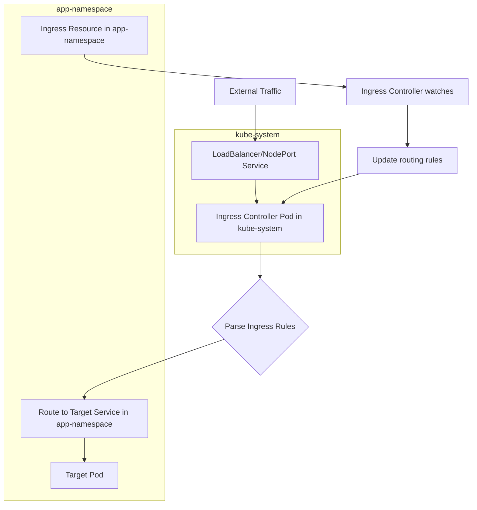
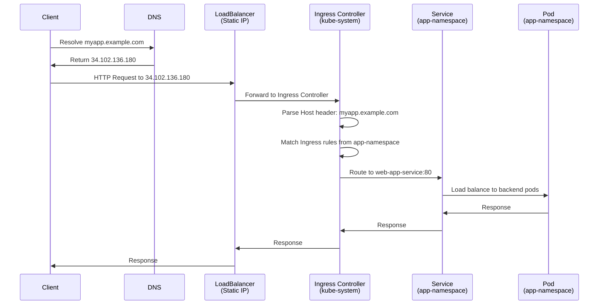

我来详细解释 K8s Ingress Controller 的工作流程，并提供具体的配置示例。

## Ingress Controller 工作流程



## 核心概念解答

**1. Ingress Controller 是集群级别的入口控制器**

- 安装在 `kube-system` namespace
- 监听所有 namespace 中的 Ingress 资源
- 作为统一的流量入口和分发器

**2. 静态IP绑定位置**

- 静态IP应该绑定在 `kube-system` 中的 Ingress Controller Service 上
- 业务 namespace 中的 Ingress 资源**不需要**也**不应该**配置静态IP
- 域名解析指向 Ingress Controller 的静态IP

## 完整配置示例

### 1. 安装 Ingress Controller (kube-system namespace)

```yaml
# ingress-controller-service.yaml
apiVersion: v1
kind: Service
metadata:
  name: ingress-nginx-controller
  namespace: kube-system
  annotations:
    cloud.google.com/load-balancer-type: "External"
    # 绑定静态IP到这里
    kubernetes.io/ingress.global-static-ip-name: "my-static-ip"
spec:
  type: LoadBalancer
  loadBalancerIP: 34.102.136.180  # 你的静态IP
  ports:
  - name: http
    port: 80
    targetPort: http
  - name: https  
    port: 443
    targetPort: https
  selector:
    app.kubernetes.io/name: ingress-nginx
    app.kubernetes.io/component: controller
```

### 2. 业务应用部署 (app-namespace)

```yaml
# app-deployment.yaml
apiVersion: apps/v1
kind: Deployment
metadata:
  name: web-app
  namespace: app-namespace
spec:
  replicas: 3
  selector:
    matchLabels:
      app: web-app
  template:
    metadata:
      labels:
        app: web-app
    spec:
      containers:
      - name: web
        image: nginx:1.21
        ports:
        - containerPort: 80
---
apiVersion: v1
kind: Service
metadata:
  name: web-app-service
  namespace: app-namespace
spec:
  selector:
    app: web-app
  ports:
  - port: 80
    targetPort: 80
  type: ClusterIP
```

### 3. Ingress 资源配置 (app-namespace)

```yaml
# app-ingress.yaml
apiVersion: networking.k8s.io/v1
kind: Ingress
metadata:
  name: web-app-ingress
  namespace: app-namespace
  annotations:
    kubernetes.io/ingress.class: "nginx"
    # 注意：不要在这里配置静态IP
    # kubernetes.io/ingress.global-static-ip-name: "xxx" # ❌ 错误
spec:
  rules:
  - host: myapp.example.com
    http:
      paths:
      - path: /
        pathType: Prefix
        backend:
          service:
            name: web-app-service
            port:
              number: 80
  - host: api.example.com
    http:
      paths:
      - path: /api
        pathType: Prefix
        backend:
          service:
            name: web-app-service
            port:
              number: 80
```

## 详细工作流程



## 验证命令

```bash
# 查看 Ingress Controller 状态
kubectl get pods -n kube-system | grep ingress

# 查看 Ingress Controller Service 和静态IP
kubectl get svc -n kube-system ingress-nginx-controller

# 查看所有 namespace 的 Ingress 资源
kubectl get ingress --all-namespaces

# 查看特定 namespace 的 Ingress
kubectl get ingress -n app-namespace web-app-ingress -o yaml

# 测试域名解析
nslookup myapp.example.com

# 测试访问
curl -H "Host: myapp.example.com" http://34.102.136.180
```

## 关键要点

|配置项   |位置                  |说明          |
|------|--------------------|------------|
|静态IP绑定|kube-system Service |唯一绑定点       |
|域名解析  |DNS记录               |指向静态IP      |
|路由规则  |业务 namespace Ingress|定义流量分发逻辑    |
|业务服务  |业务 namespace        |ClusterIP 即可|

**重要提醒：**

- ✅ 静态IP只在 `kube-system` 的 Ingress Controller Service 上配置
- ❌ 业务 namespace 的 Ingress 资源中配置静态IP**无效**且**错误**
- ✅ Ingress Controller 自动发现并应用所有 namespace 中的 Ingress 规则
- ✅ 一个 Ingress Controller 可以服务多个域名和多个 namespace

这种架构确保了集中管理和灵活的流量分发。​​​​​​​​​​​​​​​​

# Gemini  

Kubernetes Ingress 跨命名空间工作流深度解析报告
第一部分：Ingress 架构：从理论到实践
为了在 Kubernetes 中高效、安全地管理外部流量，理解其核心网络模型至关重要。Ingress 模型是现代 Kubernetes 网络架构的基石，它通过将路由规则的“定义”与“执行”相分离，提供了一种强大而灵活的流量管理机制。本部分将深入剖析这一架构，为后续的技术实践奠定坚实的理论基础。
1. 解构 Kubernetes Ingress：“做什么”与“如何做”
在 Kubernetes 的世界里，Ingress 的概念被巧妙地拆分为两个核心组件：Ingress 资源对象和 Ingress 控制器。这种分离是理解整个工作流的关键。
Ingress 资源（The "What"）
Ingress 资源是 Kubernetes 的一个原生 API 对象（位于 networking.k8s.io/v1 API 组），其本质是一组 L7 路由规则的集合 。它以一种声明式的方式，描述了外部的 HTTP/S 流量应该如何根据主机名（hostname）和路径（path）被路由到集群内部的各个服务（Service）。
需要强调的是，Ingress 资源本身是“无能为力”的。它仅仅是一个存储在 Kubernetes etcd 数据库中的配置清单，定义了路由的“期望状态” 。如果没有一个活跃的组件来读取并执行这些规则，那么这个资源对象将不会产生任何实际效果。
Ingress 控制器（The "How"）
Ingress 控制器（Ingress Controller）是扮演“执行者”角色的活跃组件。它是一种专门为 Kubernetes 环境设计的反向代理和负载均衡器，以 Pod 的形式运行在集群内部 。控制器的唯一职责就是“实现”（fulfill）集群中定义的 Ingress 资源所声明的路由规则 。
市面上有多种 Ingress 控制器的实现，例如社区维护的 NGINX Ingress Controller、Traefik、HAProxy 等 。尽管具体实现不同，但它们的核心工作模式是相同的：持续地“监视”（watch）Kubernetes API Server，一旦发现 Ingress 资源的变化（创建、更新或删除），就会动态地更新其底层代理（如 NGINX）的配置，从而使路由规则生效 。
解耦的力量
这种“定义”与“执行”的分离，体现了 Kubernetes 架构的优雅之处。应用开发者可以在其应用代码库中，通过一个简单、可移植的 Ingress YAML 文件来声明他们期望的路由规则。而平台或基础设施团队则负责管理那个复杂的、共享的 Ingress 控制器，由它来处理实际的流量管理、安全策略（如 TLS 终止）以及与外部负载均衡器的集成 。
这种解耦是 Kubernetes 声明式、基于控制器架构的典型范例。用户只声明“我想要什么”（期望状态），而控制器则不知疲倦地工作，以确保系统的“当前状态”与“期望状态”保持一致。这种模式对于在多团队环境中实现开发自服务和平台可扩展性至关重要。
通过将作为“执行者”的控制器集中部署在系统命名空间（如 kube-system 或 ingress-nginx），平台团队拥有了对集群入口点的完全控制权。他们负责其生命周期管理、安全加固和成本优化。同时，通过授权应用团队在各自的业务命名空间中创建 Ingress 资源（定义“做什么”），平台为他们提供了一个用于路由配置的自服务 API。这完美契合了平台工程（Platform Engineering）的核心理念：为开发者提供标准化、可复用的工具，以加速应用交付，同时保持对关键基础设施的集中管控。
2. 服务暴露方式的比较分析
为了充分理解 Ingress 的价值，有必要将其与 Kubernetes 中其他暴露服务的方法进行比较。
 * NodePort：这是最基础的服务暴露方式。它会在每个集群节点（Node）的 IP 上开放一个静态端口（默认范围 30000-32767），任何发送到该端口的流量都会被转发到对应的服务 。其缺点显而易见：直接暴露节点 IP 存在安全风险，端口范围受限，且缺乏一个稳定、易于记忆的访问入口，主要适用于调试或非常简单的场景 。
 * LoadBalancer：这是通过云服务提供商的外部负载均衡器来暴露单个服务的标准方式 。它为服务提供了一个稳定的、独立的公网 IP 地址。其主要弊端在于成本和资源扩散：每创建一个 Type=LoadBalancer 的服务，云平台就会为其配置一个全新的、通常是收费的负载均衡器实例 。此外，它工作在 L4（传输层），缺乏基于应用内容（如域名、URL路径）的智能路由能力。
 * Ingress：这被认为是最高效、最具成本效益的解决方案。它扮演着集群的“智能路由器”或统一入口点的角色 。通过只使用一个 Type=LoadBalancer 的服务来暴露 Ingress 控制器本身，它能够根据 L7（应用层）规则（主机名、路径）将流量路由到成百上千个内部服务，从而极大地整合了成本并简化了管理 。同时，它还支持 TLS 终止、认证、灰度发布（Canary Deployments）等高级功能 。
下面的表格总结了这三种方式的关键区别：
表 1: Kubernetes 服务暴露方式对比
| 特性 | NodePort | LoadBalancer | Ingress |
|---|---|---|---|
| 工作层级 | L4 (TCP/UDP) | L4 (TCP/UDP) | L7 (HTTP/S) |
| 入口点 | 每个节点的 IP + 静态端口 | 每个服务一个独立的 IP | 单个 IP 路由到多个服务 |
| 成本模型 | 低（无额外云资源） | 高（每个服务一个 LB） | 低（多个服务共享一个 LB） |
| 路由能力 | 基于端口 | 基于 IP 和端口 | 基于主机名和路径 |
| TLS 终止 | 不支持 | 不支持 | 支持 |
| 理想用例 | 调试、开发环境 | 暴露单个 L4 服务 | 暴露多个 HTTP/S 微服务 |
第二部分：完整工作流：从安装到请求处理
本部分将深入探讨 Ingress 控制器的内部工作机制，并追踪一个网络请求从用户浏览器到目标 Pod 的完整旅程，从而解答关于“整个工作流”的核心问题。
3. NGINX Ingress 控制器剖析：控制循环详解
NGINX Ingress 控制器的 Pod 内部通常包含两个核心进程：一个是控制器进程（Controller Process），它是整个系统的“大脑”，负责逻辑处理；另一个是 NGINX 的主/工作进程（Master/Worker Processes），是执行流量代理的“肌肉” 。
控制器工作的核心是“监视与调和”（Watch and Reconcile）机制，也称为控制循环（Control Loop）。以下是其详细步骤，基于  和  的深入分析：
 * Informers 与 Caches：控制器启动时，会通过 Kubernetes API Server 对特定类型的资源（如 Ingresses, Services, Endpoints, Secrets）建立“监视”（watches）。它使用一种名为 Informer 的机制来维护这些资源的本地内存缓存（Cache）。相比于频繁地直接查询 API Server，这种方式极大地提高了效率和响应速度 。
 * Handlers 与 Workqueue：当 Informer 检测到任何资源变更（创建、更新、删除）时，它会调用一个预先注册的 Handler 函数。这个 Handler 并不会立即处理事件，而是将一个代表该资源的键（key，通常是 <namespace>/<resource-name> 的格式）放入一个工作队列（Workqueue）中 。这种设计将事件的“发现”与“处理”解耦，并能有效地对事件进行批处理和去重。
 * 控制器的 sync 循环：一个或多个工作协程（goroutine）在后台持续地从 Workqueue 中取出键。对于每一个键，它会从本地的 Informer 缓存（Store）中获取该资源的最新、最完整的对象信息 。
 * 配置生成：控制器的主逻辑开始处理获取到的 Ingress 资源。它会分析该资源中定义的规则，并查找其引用的其他对象，例如用于 TLS 的 Secret 和后端 Service 关联的 Endpoints（即 Pod 的 IP 地址列表）。然后，控制器使用一个内置的 Go 模板，根据这些信息在 Pod 的文件系统上生成一份新的 nginx.conf 配置文件 。
 * NGINX 重载：配置文件生成完毕后，控制器会向 NGINX 进程发送一个平滑重载信号（通常是执行 nginx -s reload 命令）。这个操作会让 NGINX 的工作进程在不中断现有连接的情况下，优雅地加载并应用新的配置 。
 * 状态更新：最后，控制器会通过 Kubernetes API 更新 Ingress 资源的状态（status）字段。一个常见的更新是将在步骤2中暴露控制器时获得的外部负载均衡器的 IP 地址，写入到 ingress.status.loadBalancer 字段中，这样用户通过 kubectl get ingress 就能看到其访问地址 。
这个流程中，Workqueue 的使用是一个关键的设计模式，它为控制器带来了强大的韧性和高性能。当大量 Ingress 资源在短时间内被密集创建或更新时，API Server 会触发大量事件。如果同步处理每个事件，可能会导致控制器响应缓慢甚至崩溃。Workqueue 充当了缓冲和去重机制。如果同一个 Ingress 在短时间内被多次修改，队列中可能只会保留一个该资源的条目，最终只触发一次调和循环，从而有效避免了“重载风暴”（reload storms），使控制器在面对快速配置变更时依然保持稳定。
此外，控制器构建的是一个完整的依赖关系图。它不仅监视 Ingress 资源本身，还会监视其引用的所有相关资源。例如，当一个被 Ingress 引用的 TLS Secret 内容发生变化，或者一个后端 Service 所关联的 Pod 列表发生增减（这会更新对应的 Endpoints 对象），即使 Ingress 资源本身没有被修改，这些变化同样会触发相关 Ingress 的调和循环。这确保了 NGINX 配置中的 upstream 块（即后端服务器列表）能够实时反映后端 Pod 的真实状态。
4. 追踪一个请求：从用户到 Pod 的完整旅程
现在，我们将整个架构串联起来，一步步追踪一个典型的用户请求：
 * DNS 解析：用户在浏览器中输入 app.your-domain.com。用户的本地 DNS 解析器向公共 DNS 服务器查询，最终获得一个 A 记录，该记录指向 Ingress 控制器的 LoadBalancer Service 的静态公网 IP 地址 。
 * 外部负载均衡器：请求首先到达云服务提供商的外部负载均衡器（L4 LB）。这个 LB 是由 Kubernetes 在创建 Type=LoadBalancer 的 Service 时自动配置的，它的作用是将公网 IP 上的流量（通常是 80 和 443 端口）转发到集群内部运行着 Ingress 控制器 Pod 的节点的相应 NodePort 上 。
 * Ingress 控制器 Pod：请求通过 NodePort 进入集群网络，并被路由到某个 Ingress 控制器 Pod（例如，部署在 kube-system 命名空间中的 Pod）。请求最终被一个 NGINX 工作进程接收。
 * NGINX 规则匹配：NGINX 进程检查请求的 Host 头（app.your-domain.com）和请求的 URI 路径（例如 /api/users）。它会将这些信息与内存中加载的 nginx.conf 文件里的规则进行匹配。这份配置文件是由控制器通过读取集群中所有命名空间下的 Ingress 资源动态生成的 。
 * 代理到目标服务：NGINX 找到了一个匹配的规则（该规则可能定义在 business-apps 命名空间的一个 Ingress 资源中），然后将请求代理（proxy）到该规则指定的后端 Kubernetes Service 的内部 ClusterIP 和端口上（例如，my-app-service.business-apps.svc.cluster.local:8080）。
 * 服务到 Pod：Kubernetes 的 kube-proxy 组件（或等效的网络插件）截获了这个发往 ClusterIP 的请求。Service 在这里扮演了内部 L4 负载均衡器的角色，它根据标签选择器（label selectors）从与该 Service 关联的健康后端 Pod 中选择一个，并将请求转发到该 Pod 的实际 IP 地址和容器端口上 。
 * 应用处理：最终，运行在目标 Pod 内的应用容器接收到请求，进行业务逻辑处理，然后将响应沿着原路返回给用户。
第三部分：跨命名空间 Ingress 实践指南
本部分将提供一个完整的、可复现的实战案例，精确地演示如何部署一个集中式的 Ingress 控制器来为部署在不同命名空间中的应用提供服务。
5. 场景蓝图：集中式控制器与分布式应用
我们的目标场景定义如下：
 * Ingress 控制器：部署在 kube-system 命名空间（或其默认的 ingress-nginx 命名空间），代表共享的基础设施。
 * 应用命名空间：创建一个名为 business-apps 的新命名空间，用于托管面向用户的应用程序，以实现逻辑隔离 。
 * 应用程序：在 business-apps 命名空间中部署两个简单的微服务，名为 apple-app 和 banana-app。
 * 路由目标：将对 http://<EXTERNAL_IP>/apple 的请求路由到 apple-app，将对 http://<EXTERNAL_IP>/banana 的请求路由到 banana-app。
6. 分步实施与清单注解
以下是完整的、可直接复制粘贴的 YAML 文件，并附有详细的注释，解释了每个字段的用途。
阶段一：在 kube-system 中部署并暴露 NGINX Ingress 控制器
我们将使用社区官方提供的部署清单。这个清单会创建控制器所需的所有资源。
操作命令：
# 官方清单默认会创建在 ingress-nginx 命名空间，这在实践中也是推荐的做法。
# 如果严格要求部署在 kube-system，需要下载清单文件并手动修改所有资源的 namespace 字段。
# 为简化演示，我们遵循官方默认设置。
kubectl apply -f https://raw.githubusercontent.com/kubernetes/ingress-nginx/controller-v1.3.0/deploy/static/provider/cloud/deploy.yaml

清单分析：
这个命令会创建一系列资源，其中最关键的包括：
 * Namespace (ingress-nginx)：为控制器创建一个独立的命名空间。
 * ServiceAccount, ClusterRole, ClusterRoleBinding：这些是 RBAC（基于角色的访问控制）资源。其中 ClusterRole 是实现跨命名空间功能的关键，它授予了控制器的 ServiceAccount 在整个集群范围内 get, list, watch Ingresses, Services, Secrets 等资源的权限。正是这个授权，使得运行在 ingress-nginx 命名空间的控制器能够发现并处理 business-apps 命名空间中的 Ingress 资源 。
 * Deployment (ingress-nginx-controller)：这个部署对象负责运行控制器的主程序 Pod。
 * Service (ingress-nginx-controller)：这是一个 Type=LoadBalancer 类型的服务。它负责向云平台申请一个公网 IP，并将外部流量导入到控制器 Pod。这个 Service 就是外部 IP 地址绑定的对象，直接回答了关于 IP 绑定位置的问题 。
阶段二：在 business-apps 中部署示例应用
创建一个 YAML 文件，例如 apps.yaml，包含以下所有内容：
# apps.yaml

# 1. 创建业务命名空间
apiVersion: v1
kind: Namespace
metadata:
  name: business-apps
---
# 2. 部署 apple-app
apiVersion: apps/v1
kind: Deployment
metadata:
  name: apple-deployment
  namespace: business-apps
spec:
  replicas: 1
  selector:
    matchLabels:
      app: apple
  template:
    metadata:
      labels:
        app: apple
    spec:
      containers:
      - name: apple-container
        image: hashicorp/http-echo
        args:
        - "-text=this is the apple application"
        ports:
        - containerPort: 5678
---
# 3. 为 apple-app 创建内部服务 (ClusterIP)
apiVersion: v1
kind: Service
metadata:
  name: apple-service
  namespace: business-apps
spec:
  selector:
    app: apple
  ports:
  - protocol: TCP
    port: 80
    targetPort: 5678
  # 注意：类型默认为 ClusterIP，仅供集群内部访问
---
# 4. 部署 banana-app
apiVersion: apps/v1
kind: Deployment
metadata:
  name: banana-deployment
  namespace: business-apps
spec:
  replicas: 1
  selector:
    matchLabels:
      app: banana
  template:
    metadata:
      labels:
        app: banana
    spec:
      containers:
      - name: banana-container
        image: hashicorp/http-echo
        args:
        - "-text=this is the banana application"
        ports:
        - containerPort: 5678
---
# 5. 为 banana-app 创建内部服务 (ClusterIP)
apiVersion: v1
kind: Service
metadata:
  name: banana-service
  namespace: business-apps
spec:
  selector:
    app: banana
  ports:
  - protocol: TCP
    port: 80
    targetPort: 5678

关键点：注意这里的 Service 类型都是默认的 ClusterIP。它们不需要被直接暴露到集群外部，因为 Ingress 控制器将作为统一的入口，负责将流量路由给它们 。
应用清单：
kubectl apply -f apps.yaml

阶段三：在 business-apps 中创建 Ingress 资源
这是将所有部分连接起来的最后一步。创建一个名为 ingress.yaml 的文件。
ingress.yaml 清单注解：
# ingress.yaml
apiVersion: networking.k8s.io/v1
kind: Ingress
metadata:
  # Ingress 资源与它所配置的应用一起，部署在业务命名空间中
  name: example-ingress
  namespace: business-apps
  annotations:
    # 这是一个常见的 NGINX Ingress 注解，用于路径重写
    nginx.ingress.kubernetes.io/rewrite-target: /
spec:
  # 这个字段将此 Ingress 资源与特定的 Ingress 控制器实现关联起来
  # 'nginx' 是社区 NGINX Ingress Controller 的默认类名
  ingressClassName: nginx
  rules:
  # 这里没有指定 host，意味着它将匹配所有发往 Ingress 控制器 IP 的请求
  - http:
      paths:
      - path: /apple
        pathType: Prefix
        backend:
          service:
            # 引用同一个命名空间 (business-apps) 下的 Service
            name: apple-service
            port:
              # 引用 Service 定义的端口
              number: 80
      - path: /banana
        pathType: Prefix
        backend:
          service:
            # 引用同一个命名空间 (business-apps) 下的 Service
            name: banana-service
            port:
              number: 80

关键解释：
 * metadata.namespace: 明确指出 Ingress 资源是命名空间级别的，它与它所配置的应用逻辑上属于一体。
 * spec.ingressClassName: 这个字段是 Kubernetes v1.18 之后引入的标准字段，用于明确指定由哪个 Ingress 控制器来处理此 Ingress 资源。这在一个可能存在多个控制器（例如，一个对内，一个对外）的复杂集群中至关重要 。
 * spec.rules.backend.service.name: 这是最关键的一点。这里指定的 serviceName（如 apple-service）是在与 Ingress 资源相同的命名空间（即 business-apps）内进行解析的。尽管控制器本身运行在 ingress-nginx 命名空间，但它足够智能，在解析 Ingress 资源时，会以该资源所在的命名空间为上下文来查找后端服务 。这直接阐明了为什么路由规则的配置是在业务命名空间中，并且是自包含的。
应用清单：
kubectl apply -f ingress.yaml

阶段四：验证与测试
执行以下命令来验证整个设置：
 * 检查控制器是否在运行：
   kubectl get pods -n ingress-nginx

 * 获取控制器的外部 IP 地址：
   kubectl get svc -n ingress-nginx ingress-nginx-controller
# 记下 EXTERNAL-IP 列的值

 * 检查业务应用和 Ingress 资源：
   kubectl get pods,svc,ingress -n business-apps

 * 测试路由规则：
   # 将 <EXTERNAL_IP> 替换为步骤2中获取的 IP 地址
curl http://<EXTERNAL_IP>/apple
# 预期输出: this is the apple application

curl http://<EXTERNAL_IP>/banana
# 预期输出: this is the banana application

第四部分：高级配置与生产注意事项
本部分将直接回应关于静态 IP 分配和生产环境部署的最佳实践等高级问题。
7. 掌握静态 IP 分配
首先，明确一个核心概念：静态 IP 地址是分配给 Ingress 控制器的 Type=LoadBalancer 类型的 Service，而不是分配给任何单个的 Ingress 资源。 部署在业务命名空间中的 Ingress 资源对象，对这个外部 IP 地址是完全无感的。这就解释了为什么业务命名空间中的 Ingress 配置不会被“覆盖”——因为它从未拥有过 IP 地址的配置信息。
这种设计将 IP 地址管理（属于平台基础设施）与应用路由规则（属于应用配置）彻底分离，是实现稳定性和安全性的关键。如果每个应用团队都能在自己的 Ingress 资源中请求静态 IP，将导致 IP 地址的泛滥和管理混乱。通过将唯一的静态 IP 绑定到中心的控制器 Service，平台团队只需管理一个稳定、众所周知的集群入口点。所有 DNS 记录都指向这一个 IP。应用团队可以在这个稳定的入口之后，自由地添加、删除和修改他们的路由规则，而无需协调 DNS 变更或管理 IP 地址，从而极大地提升了敏捷性。
实践方法
 * 云平台原生方式：
   * 在您的云服务提供商处预先保留一个静态公网 IP 地址（例如，在 GCP 使用 gcloud compute addresses create，在 Azure 使用 az network public-ip create）。
   * 在安装 Ingress 控制器时，将这个预留的 IP 地址提供给它。
 * 使用 Helm 安装（推荐）：Helm 是 Kubernetes 的包管理器，它极大地简化了此过程。
   # 假设已预留静态 IP 'YOUR_RESERVED_STATIC_IP'
helm upgrade --install ingress-nginx ingress-nginx/ingress-nginx \
  --namespace ingress-nginx \
  --create-namespace \
  --set controller.service.loadBalancerIP=<YOUR_RESERVED_STATIC_IP>

   这个命令通过 --set 参数直接将 loadBalancerIP 的值传递给了控制器 Service 的模板 。
 * 使用注解（特定于云）：对于某些云平台自带的 Ingress 控制器（如 GKE Ingress），是通过在 Ingress 资源上添加特定注解（如 kubernetes.io/ingress.global-static-ip-name）来实现的 。需要明确的是，这种方式适用于 GKE 托管的控制器，而非我们示例中使用的社区版 NGINX 控制器。对于社区版 NGINX 控制器，IP 地址是在其 Service 层面进行管理的。
表 2: NGINX Ingress 控制器核心 Helm 配置参数
| 参数 | 描述 | 示例值 |
|---|---|---|
| controller.replicaCount | 控制器 Pod 的副本数量，用于高可用。 | 2 |
| controller.service.loadBalancerIP | 为控制器 Service 指定一个预留的静态 IP。 | 203.0.113.10 |
| controller.service.annotations | 为控制器 Service 添加云平台特定的注解。 | service.beta.kubernetes.io/azure-load-balancer-internal: "true" |
| controller.resources.limits.cpu | 控制器 Pod 的 CPU 资源限制。 | "1000m" |
| controller.resources.limits.memory | 控制器 Pod 的内存资源限制。 | "1Gi" |
8. 安全与生产就绪
 * RBAC 深度解析：我们再次审视 ClusterRole。授予一个组件集群范围的读取权限是一个重大的信任决策。在生产环境中，应遵循最小权限原则。尽管官方 Helm Chart 提供的默认角色权限范围通常是合理的，但在自定义部署时，应对其进行仔细审计。
 * 资源管理：为 Ingress 控制器的 Deployment 设置合理的 CPU 和内存请求（requests）与限制（limits）至关重要。这能确保它获得稳定运行所需的资源，同时避免它在负载过高时耗尽节点资源，影响其他系统组件的稳定性 。
 * 控制器扩缩容：在生产环境中，为 Ingress 控制器配置水平 Pod 自动缩放器（Horizontal Pod Autoscaler, HPA）是最佳实践。HPA 可以根据 CPU 或内存利用率等指标，自动增加或减少控制器 Pod 的数量，从而从容应对流量高峰 。
第五部分：综合与战略建议
9. 关键要点与最终架构回顾
工作流总结
整个流量处理流程可以精炼为以下步骤：
DNS 解析 -> 指向控制器 Service 的静态 IP -> 控制器 Pod (NGINX) -> NGINX 根据 Ingress 规则路由 -> 目标应用的内部 Service (ClusterIP) -> 目标应用的 Pod
核心概念强化
 * 控制器是集群级组件：Ingress 控制器通常以单例（或为实现高可用性而部署的一对）的形式，运行在专用的系统命名空间中（如 ingress-nginx）。
 * Ingress 资源是应用级配置：Ingress 资源是带命名空间的，与它们所配置的应用程序部署在同一个命名空间中，是应用声明的一部分。
 * ClusterRole 是连接桥梁：RBAC 中的 ClusterRole 是允许中心化的控制器能够“看到”并处理分散在各个业务命名空间中的 Ingress 资源的关键。
 * 静态 IP 属于控制器 Service：静态公网 IP 绑定在控制器的 LoadBalancer Service 上，为整个集群提供了一个稳定、统一的外部入口点。业务命名空间中的 Ingress 资源不涉及、也不需要关心这个 IP。
战略建议
对于任何拥有超过数个微服务的生产环境而言，采用集中式 Ingress 控制器模式是业界的标准最佳实践。它在成本效益、管理简便性以及高级功能支持方面具有无与伦比的优势。
此外，值得注意的是，Kubernetes 网络正在不断演进。作为 Ingress 的下一代标准，Gateway API 正在兴起。它提供了更强的表现力、更明确的面向角色的配置模型（将基础设施配置与应用路由配置分离得更彻底），旨在解决 Ingress 在大规模、多租户场景下的一些局限性 。将当前对 Ingress 的深入理解，视为迈向未来 Kubernetes 网络概念的重要基石，将有助于在技术演进的道路上保持领先。


# ChatGPT 


好的 👍 我帮你把整个 Kubernetes Ingress Controller 的工作流 详细解释，并结合你的问题给一个具体的例子。输出我会分三部分：

  

1. Ingress Controller 的工作原理和流程图
2. 跨 namespace 使用 Ingress 的解释
3. 一个完整的例子（YAML）

  

  

  

  

  

4. Ingress Controller 工作原理

  

  

- Ingress Controller（比如 Nginx Ingress Controller）通常会安装在一个固定的命名空间（例如 kube-system）。
- 它会监听整个集群的 Ingress 资源（不是仅限于 kube-system，而是 集群级别 的资源）。
- 你的应用（Deployment、Service）通常在不同的命名空间（如 dev, prod），你在对应命名空间创建 Ingress 规则即可。
- Ingress Controller 会自动检测这些 Ingress 配置，然后把它们转化为 Nginx 配置（或 Envoy 配置，取决于 Ingress Controller 实现），来实现请求转发。

  

  

所以：

  

- Ingress 资源写在应用所在的 namespace 中（你不会在 kube-system 里看到规则）。
- Ingress Controller 在 kube-system，只是作为入口网关存在。
- Service IP：不需要手动绑定 IP，Ingress 会自动通过 Service（ClusterIP 或 NodePort/LoadBalancer）来转发。
- 域名解析：域名指向 Ingress Controller 的 Service（一般是 LoadBalancer 类型，创建在 kube-system 中），然后 Ingress Controller 根据域名/Path 规则路由到不同的 namespace 下的 Service。

  

  

  

  

  

2. 流程图

  

graph TD

    A[Client 浏览器请求 www.example.com] --> B[域名解析到 Ingress Controller Service (kube-system)]

    B --> C[Ingress Controller Pod (kube-system)]

    C --> D[检查集群内 Ingress 规则]

    D --> E[匹配到目标 Namespace 下的 Ingress 规则]

    E --> F[转发到对应的 Service (应用命名空间)]

    F --> G[转发到 Deployment Pod (应用命名空间)]

  

  

  

  

3. 示例

  

  

假设：

  

- 你的 Ingress Controller 安装在 kube-system。
- 你有一个应用 myapp 在 dev namespace 下。
- 域名是 myapp.example.com。

  

  

  

部署应用 (dev namespace)

  

apiVersion: v1

kind: Namespace

metadata:

  name: dev

---

apiVersion: apps/v1

kind: Deployment

metadata:

  name: myapp

  namespace: dev

spec:

  replicas: 2

  selector:

    matchLabels:

      app: myapp

  template:

    metadata:

      labels:

        app: myapp

    spec:

      containers:

      - name: myapp

        image: nginx:latest

        ports:

        - containerPort: 80

---

apiVersion: v1

kind: Service

metadata:

  name: myapp-svc

  namespace: dev

spec:

  selector:

    app: myapp

  ports:

  - port: 80

    targetPort: 80

  

配置 Ingress (dev namespace)

  

apiVersion: networking.k8s.io/v1

kind: Ingress

metadata:

  name: myapp-ingress

  namespace: dev

  annotations:

    kubernetes.io/ingress.class: "nginx"  # 确保与 ingress controller 对应

spec:

  rules:

  - host: myapp.example.com

    http:

      paths:

      - path: /

        pathType: Prefix

        backend:

          service:

            name: myapp-svc

            port:

              number: 80

  

Ingress Controller (kube-system namespace, 部分示例)

  

apiVersion: v1

kind: Service

metadata:

  name: ingress-nginx-controller

  namespace: kube-system

spec:

  type: LoadBalancer

  selector:

    app.kubernetes.io/component: controller

    app.kubernetes.io/name: ingress-nginx

  ports:

  - port: 80

    targetPort: http

  - port: 443

    targetPort: https

  

  

  

  

4. 核心要点总结

  

  

- Ingress Controller 部署在 kube-system（集群级入口）。
- Ingress 资源写在 应用所在的 namespace。
- 域名 → 解析到 Ingress Controller 的 Service（通常是 LoadBalancer IP 或 NodePort）。
- Ingress Controller 自动根据域名/路径把流量转发到目标 namespace 的 Service → Pod。
- 不需要 namespace 里自己绑定 IP，只要有 Service 即可。

  

  

  

  

要验证的话，你只需：

  

1. kubectl get svc -n kube-system 找到 Ingress Controller 的 LoadBalancer IP。
2. 修改本地 /etc/hosts 或 DNS，把 myapp.example.com 指向该 IP。
3. 访问 http://myapp.example.com → 应该就能到 dev namespace 的 Pod。

  

  

  

  

要不要我帮你把这个例子扩展成 一个多命名空间共享同一个 Ingress Controller 的配置（比如 dev / prod 同时使用不同域名），这样会更贴合你说的“集群级入口分发到不同 namespace”？

完全正确 👍，你抓住了关键点。

  

  

1. Ingress Controller 本身是什么

  

  

- 你安装的 Ingress Controller（比如 ingress-nginx-controller、gke-ingress-controller、traefik 等），本质上是一个 控制器（Controller + Pod 进程），通常部署在 kube-system 或 ingress-nginx 命名空间。
- 它通过 watch API Server 的方式监听全局的 Ingress 对象（无论在哪个 namespace 创建）。
- 然后，它会把这些规则（host/path → service）动态写入到它自己的转发引擎配置里（比如 nginx.conf、haproxy.cfg、envoy config）。

  

  

也就是说：

  

- Ingress Controller 是入口代理，运行在 kube-system 或它自己的 namespace。
- 它本身 不会存放业务 Ingress 规则，所以你在 kube-system 里面是看不到你的 Ingress 配置的。

  

  

  

  

  

2. 请求的实际转发流程

  

graph TD

    A[Client: www.example.com] --> B[DNS 解析 → Ingress Controller Service (LoadBalancer, kube-system)]

    B --> C[Ingress Controller Pod]

    C --> D[查询 Ingress 规则 (跨 Namespace)]

    D --> E[转发到 dev/api1-svc → Pods]

    D --> F[转发到 prod/api2-svc → Pods]

所以你看到的现象是：

  

- Ingress 规则写在业务 namespace（比如 dev/prod）。
- Ingress Controller 在 kube-system，但它能读取并应用所有 namespace 的 Ingress。
- 你在 kube-system 不会看到这些规则，因为它们属于各自的 namespace。
- Ingress Controller 相当于是一个“集群级代理”，只负责监听并下发转发规则。

  

  

  

  

  

3. 举个比喻

  

  

- Ingress Controller 就像是一个 集群的 Nginx 代理进程，部署在 kube-system。
- 你的业务团队在自己的 namespace（dev/prod）里写 Ingress，就像在写 nginx.conf 的一段 location 配置。
- 但是 nginx.conf 并不存储在 dev/prod 里，而是 Ingress Controller 动态收集所有规则并应用。

  

  

  

  

  

4. 你需要关心的点

  

  

- Ingress Controller = 转发引擎（部署在 kube-system）
- Ingress 规则 = 路由配置（部署在业务 namespace）
- Service IP/Pod IP 不需要额外绑定，Ingress Controller 会自动转发到对应 namespace 的 Service。

  

  

  

  

👉 所以你的理解没错：

  

- Ingress Controller 在 kube-system，本身只是一个“控制器 + 网关”。
- 你所有的规则都在业务 namespace 的 Ingress 对象里。
- Controller 自动 watch 并应用这些规则，所以它看起来“透明”，你不需要去 kube-system 查配置。

  

  

  

  

要不要我帮你写一段 kubectl 的实际验证步骤？比如：

  

- 如何在 kube-system 确认 Ingress Controller 正在运行
- 如何在 dev/prod 确认 Ingress 规则已被 Controller 接收并应用


👌 我明白了，你的问题是：

如果在 dev namespace 的 Ingress 上绑定一个静态 IP，会不会和 Ingress Controller（在 kube-system 的 Service）产生冲突？

  

答案取决于你使用的 Ingress Controller 类型和部署方式，我拆开讲：

  

  

  

  

1. Ingress Controller 是唯一的“对外入口”

  

  

- 你在 dev 里写的 Ingress 不会直接对外暴露 IP。
- 它只是一个“规则对象”，由 Controller 读取后动态生成配置。
- 真正对外暴露的 IP 是 Ingress Controller 的 Service（通常在 kube-system，类型是 LoadBalancer）。

  

  

所以：

  

- 如果你在 dev 的 Ingress 配置里随便写一个 IP，那只是 YAML 里的数据，并不会真的生效。
- 只有 Ingress Controller 的 Service (LoadBalancer 类型) 能真正绑定外部 IP。

  

  

  

  

  

2. 如何正确绑定静态 IP（GKE 为例）

  

  

在 GKE + Nginx Ingress Controller 场景下，绑定静态 IP 的做法是：

  

- 在 Ingress Controller 的 Service（kube-system 下的 Service） 上绑定静态 IP。
- 而不是在业务 namespace 的 Ingress 资源上。

  

  

比如你要绑定 GCP 预留的一个静态 IP（my-static-ip）：

apiVersion: v1

kind: Service

metadata:

  name: ingress-nginx-controller

  namespace: kube-system

  annotations:

    service.beta.kubernetes.io/gcp-load-balancer-type: "external"

    service.beta.kubernetes.io/ingress.global-static-ip-name: "my-static-ip"

spec:

  type: LoadBalancer

  selector:

    app.kubernetes.io/name: ingress-nginx

    app.kubernetes.io/component: controller

  ports:

  - port: 80

    targetPort: http

  - port: 443

    targetPort: https

这样，整个集群的 Ingress Controller 都会用 my-static-ip 对外暴露。

  

  

  

  

3. 如果在 Ingress（dev）里写静态 IP 会怎样？

  

  

- 情况 A（GKE 原生 GLBC Ingress Controller）  
    

- 你可以在 Ingress 上写注解：

-   
    

  

metadata:

  annotations:

    kubernetes.io/ingress.global-static-ip-name: "my-static-ip"

  

-   
    

-   
    
- 这种情况下，是 GKE 自带的 Ingress Controller（GLBC）负责创建 LB，所以写在 Ingress 上是生效的。
- 但这是 GCP 特有的，不是 Nginx Ingress 的通用做法。
-   
    

- 情况 B（Nginx Ingress Controller）  
    

- Ingress 上的 IP 注解不会生效，因为 Nginx Ingress Controller 不会去申请 GCP LB IP，它只绑定自己 Service 的 IP。
- 必须在 Controller Service 上指定。

-   
    

  

  

  

  

  

4. 是否会冲突？

  

  

- 不会冲突，因为只有 Ingress Controller 的 Service 能真正绑定 IP。
- 如果你在 dev namespace 的 Ingress 里写 IP 配置：  
    

- 对于 GKE 自带的 GLBC Ingress → 可能会生效。
- 对于 Nginx Ingress Controller → 不会生效，忽略。

-   
    
- 真正的流量入口始终是 Ingress Controller（kube-system），它是集群级别的代理。

  

  

  

  

✅ 结论

  

- 静态 IP 应该绑定在 Ingress Controller 的 Service 上，而不是单个业务 namespace 的 Ingress。
- 如果你在 dev 的 Ingress 里加 IP 注解，在 GKE 原生 Ingress Controller 场景下可能生效，但 Nginx Ingress Controller 场景下不会生效。
- 两者不会冲突，只是生效点不同。

  

  

  

  

要不要我帮你画一张 对比图（Nginx Ingress vs GKE Ingress 的 IP 绑定方式），这样你能更直观地区分在哪个对象写静态 IP 配置？


好的 👍 我帮你画一张 对比图，展示在 Nginx Ingress Controller 和 GKE 原生 Ingress Controller (GLBC) 下，静态 IP 的绑定位置差异。

  

  

  

  

图示

  

graph TD

  

subgraph Nginx Ingress Controller

    A1[Client 请求\napi.example.com] --> B1[静态IP: 绑定在 Ingress Controller Service\n(kube-system)]

    B1 --> C1[Ingress Controller Pod]

    C1 --> D1[Ingress 规则 (在 dev/prod 等 namespace)]

    D1 --> E1[Service → Pods]

end

  

subgraph GKE 原生 Ingress Controller (GLBC)

    A2[Client 请求\napi.example.com] --> B2[静态IP: 绑定在 Ingress 对象\n(dev/prod 中的 Ingress)]

    B2 --> C2[GCP GLB 自动创建]

    C2 --> D2[转发到 Service (dev/prod)]

    D2 --> E2[Pods]

end

  

  

  

  

差异总结表

  

|   |   |   |
|---|---|---|
|控制器类型|静态 IP 绑定位置|说明|
|Nginx Ingress Controller|Ingress Controller Service（通常在 kube-system）|统一集群入口，所有 namespace 共用。|
|GKE 原生 Ingress (GLBC)|Ingress 对象（在业务 namespace，例如 dev）|GCP Ingress Controller 直接管理 GCP LB 并分配 IP。|

  

  

  

👉 所以：

  

- Nginx Ingress：静态 IP 必须绑定在 kube-system 的 Service 上。
- GKE 原生 Ingress：静态 IP 可以直接写在 Ingress 对象上。

  

  

要不要我顺便帮你写一份 Nginx 绑定静态 IP 和 GKE Ingress 绑定静态 IP 的 YAML 对比？这样你可以直接拿去实验。

