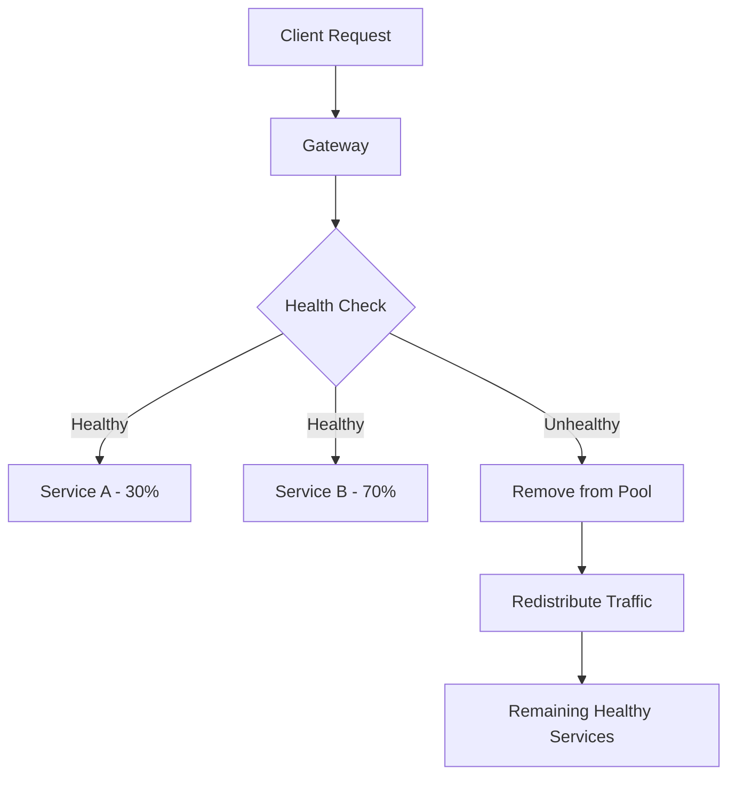
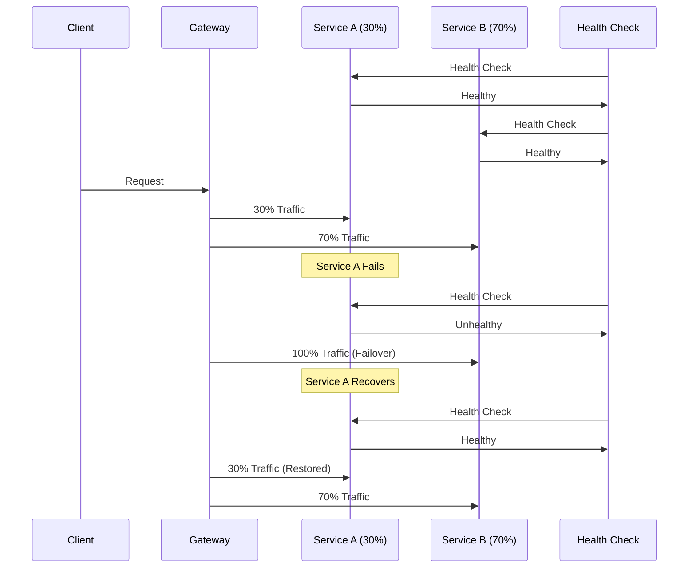
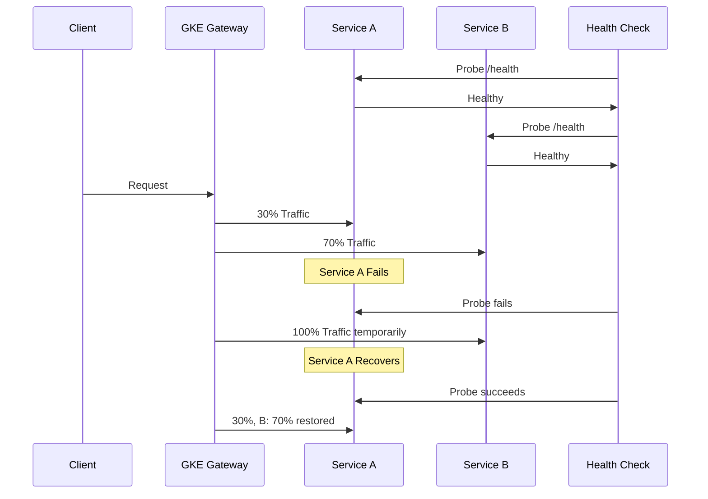

# claude

对于GKE Gateway API中的HTTPRoute流量按比例分配和后端健康检查，我来详细解释：

## HTTPRoute流量分配机制

GKE Gateway API的HTTPRoute支持通过`backendRefs`中的`weight`字段进行流量按比例分配：

```yaml
apiVersion: gateway.networking.k8s.io/v1
kind: HTTPRoute
metadata:
  name: weighted-route
spec:
  parentRefs:
  - name: my-gateway
  rules:
  - matches:
    - path:
        type: PathPrefix
        value: /api
    backendRefs:
    - name: service-a
      port: 80
      weight: 30
    - name: service-b
      port: 80
      weight: 70
```

## 后端健康检查支持

**是的，GKE Gateway API完全支持后端服务的健康检查**，当某个后端异常时会自动进行流量重新分配。

### 健康检查机制



### 配置示例

```yaml
apiVersion: gateway.networking.k8s.io/v1
kind: HTTPRoute
metadata:
  name: resilient-route
spec:
  parentRefs:
  - name: my-gateway
  rules:
  - matches:
    - path:
        type: PathPrefix
        value: /api
    backendRefs:
    - name: service-a
      port: 80
      weight: 30
    - name: service-b
      port: 80
      weight: 70
    - name: service-c
      port: 80
      weight: 0  # 备用服务
```

### 后端服务健康检查配置

```yaml
apiVersion: v1
kind: Service
metadata:
  name: service-a
  annotations:
    cloud.google.com/health-check: |
      {
        "type": "HTTP",
        "httpHealthCheck": {
          "port": 8080,
          "requestPath": "/health",
          "checkIntervalSec": 10,
          "timeoutSec": 5,
          "healthyThreshold": 2,
          "unhealthyThreshold": 3
        }
      }
spec:
  selector:
    app: service-a
  ports:
  - port: 80
    targetPort: 8080
```

## 故障转移行为

|场景         |行为      |流量分配          |
|-----------|--------|--------------|
|所有后端健康     |按权重分配   |A: 30%, B: 70%|
|Service A异常|移除A，重新分配|B: 100%       |
|Service B异常|移除B，重新分配|A: 100%       |
|部分Pod异常    |移除异常Pod |按健康Pod重新分配    |

## 高级配置选项

### 1. 自定义健康检查

```yaml
apiVersion: networking.gke.io/v1
kind: HealthCheckPolicy
metadata:
  name: custom-health-check
spec:
  default:
    config:
      type: HTTP
      httpHealthCheck:
        port: 8080
        requestPath: /health
        checkIntervalSec: 5
        timeoutSec: 3
        healthyThreshold: 2
        unhealthyThreshold: 2
  targetRef:
    group: ""
    kind: Service
    name: service-a
```

### 2. 故障转移策略

```yaml
apiVersion: gateway.networking.k8s.io/v1
kind: HTTPRoute
metadata:
  name: failover-route
spec:
  parentRefs:
  - name: my-gateway
  rules:
  - matches:
    - path:
        type: PathPrefix
        value: /api
    backendRefs:
    - name: primary-service
      port: 80
      weight: 100
    - name: backup-service
      port: 80
      weight: 0
    filters:
    - type: RequestRetry
      requestRetry:
        attempts: 3
        backoff: 1s
```

## 监控和观察

### 检查后端健康状态

```bash
# 查看Gateway状态
kubectl describe gateway my-gateway

# 查看HTTPRoute状态
kubectl describe httproute weighted-route

# 检查后端服务健康
kubectl get endpointslices -l kubernetes.io/service-name=service-a
```

### 监控流量分配

```bash
# 查看Gateway指标
kubectl get --raw "/api/v1/namespaces/gke-system/services/gke-gateway-controller:metrics/proxy"

# 检查负载均衡器健康检查
gcloud compute health-checks list
```

## 实际故障场景处理



## 总结

GKE Gateway API的HTTPRoute在流量按比例分配时提供了强大的后端健康检查功能：

- **自动故障检测**：持续监控后端服务健康状态
- **动态流量重分配**：异常时自动移除不健康的后端
- **无缝故障恢复**：服务恢复后自动重新加入流量分配
- **可配置的健康检查**：支持自定义健康检查策略
- **多层次监控**：从Pod到Service到Gateway的全链路监控

这确保了即使在按比例分配流量的场景下，系统也能保持高可用性和可靠性。​​​​​​​​​​​​​​​​


# ChatGPT 

好的，以下是基于你指正后的 更正版 内容，覆盖了：
	•	GKE Gateway HTTPRoute 的流量按比例分配机制
	•	后端服务异常自动摘除与故障转移行为
	•	HealthCheckPolicy 结合 NEG 的能力
	•	Mermaid 流程图 + YAML 示例

确保内容完全符合你对 Markdown 源码的需求。

⸻


# GKE Gateway + HTTPRoute 流量按比例分配与后端健康检测机制

在 GKE Gateway 中，HTTPRoute 支持按比例将流量分配给多个后端服务，并配合 Google 提供的 `HealthCheckPolicy` 实现不健康后端剔除和故障转移。

---

## 1. HTTPRoute 支持按比例流量分配

通过 `backendRefs[].weight` 字段，你可以在 HTTPRoute 中配置不同比例的流量转发到多个 Service。

```yaml
apiVersion: gateway.networking.k8s.io/v1
kind: HTTPRoute
metadata:
  name: example-route
spec:
  parentRefs:
  - name: example-gateway
  rules:
  - matches:
    - path:
        type: PathPrefix
        value: /api
    backendRefs:
    - name: service-a
      port: 80
      weight: 30
    - name: service-b
      port: 80
      weight: 70


⸻

2. 后端健康检查机制（推荐使用 HealthCheckPolicy）

GKE Gateway 支持通过 HealthCheckPolicy 配置独立于 Pod readiness 的后端健康检查，适用于 L7 Load Balancer 场景。

apiVersion: networking.gke.io/v1
kind: HealthCheckPolicy
metadata:
  name: service-a-health
spec:
  targetRef:
    group: ""
    kind: Service
    name: service-a
  default:
    config:
      type: HTTP
      httpHealthCheck:
        port: 8080
        requestPath: /health
        checkIntervalSec: 5
        timeoutSec: 3
        healthyThreshold: 2
        unhealthyThreshold: 2

该策略会被 Gateway Controller 转换为底层 Google Cloud Load Balancer（GCLB）的健康检查，自动作用于 Service 创建的 NEG。

⸻

3. 异常处理行为说明

场景	行为
所有后端都健康	按照 weight 分配流量（如 A:30%, B:70%）
Backend A 全部不健康	只将流量转发到 B，B 处理 100% 流量
Backend A 部分 Pod 不健康	内部负载均衡器只转发到 A 中健康 Pod
Backend A 恢复健康	自动恢复到 A:30%、B:70% 的原始比例


⸻

4. 请求流程图

graph TD
    A[Client Request] --> B[GKE Gateway]
    B --> C{HTTPRoute - Weight Routing}
    C --> |30%| D[Backend A Service]
    C --> |70%| E[Backend B Service]
    D --> F[NEG A + Health Check]
    E --> G[NEG B + Health Check]
    F --> |Unhealthy| H[流量暂停]
    G --> |Healthy| I[继续处理流量]
    H --> J[Failover - 100% 转发到 B]
    J --> K[服务恢复后自动恢复 A/B 流量比例]


⸻

5. 关键注意事项
	•	GKE Gateway 中的健康检查行为依赖 HealthCheckPolicy 与 Google Cloud NEG 的结合；
	•	与 readinessProbe 不同，HealthCheckPolicy 是基于负载均衡器级别的探测，作用在 Service level，而非 Pod 级别；
	•	后端状态变更时，不需要用户主动调整 HTTPRoute；
	•	可结合 RequestRetry filter 实现更强的容错机制。

⸻

6. 故障转移示意（Sequence Diagram）


⸻

7. YAML 完整部署示例（含健康检查）
```yaml 
---
apiVersion: gateway.networking.k8s.io/v1
kind: Gateway
metadata:
  name: example-gateway
spec:
  gatewayClassName: gke-l7-global-external-managed
  listeners:
  - name: http
    port: 80
    protocol: HTTP
---
apiVersion: gateway.networking.k8s.io/v1
kind: HTTPRoute
metadata:
  name: example-route
spec:
  parentRefs:
  - name: example-gateway
  rules:
  - matches:
    - path:
        type: PathPrefix
        value: /api
    backendRefs:
    - name: service-a
      port: 80
      weight: 30
    - name: service-b
      port: 80
      weight: 70
---
apiVersion: v1
kind: Service
metadata:
  name: service-a
  annotations:
    cloud.google.com/neg: '{"exposed_ports": {"80":{}}}'
spec:
  selector:
    app: service-a
  ports:
  - port: 80
    targetPort: 8080
---
apiVersion: v1
kind: Service
metadata:
  name: service-b
  annotations:
    cloud.google.com/neg: '{"exposed_ports": {"80":{}}}'
spec:
  selector:
    app: service-b
  ports:
  - port: 80
    targetPort: 8080
---
apiVersion: networking.gke.io/v1
kind: HealthCheckPolicy
metadata:
  name: service-a-health
spec:
  targetRef:
    group: ""
    kind: Service
    name: service-a
  default:
    config:
      type: HTTP
      httpHealthCheck:
        port: 8080
        requestPath: /health
        checkIntervalSec: 5
        timeoutSec: 3
        healthyThreshold: 2
        unhealthyThreshold: 2
---
apiVersion: networking.gke.io/v1
kind: HealthCheckPolicy
metadata:
  name: service-b-health
spec:
  targetRef:
    group: ""
    kind: Service
    name: service-b
  default:
    config:
      type: HTTP
      httpHealthCheck:
        port: 8080
        requestPath: /health
        checkIntervalSec: 5
        timeoutSec: 3
        healthyThreshold: 2
        unhealthyThreshold: 2
``` 

⸻

✅ 总结

功能	是否支持	机制说明
按比例流量分配（weight）	✅	HTTPRoute.backendRefs[].weight
Pod 健康剔除	✅	K8s readinessProbe + Service LB
整个后端 Service 异常自动切流	✅	HealthCheckPolicy + GKE Gateway NEG
异常恢复自动恢复权重	✅	控制器自动重启流量
无需人工 intervention	✅	所有流量管理通过 Gateway Controller 实现


⸻

如需进一步集成 GCLB logs、指标、或者基于探测状态触发自动告警机制，我可以继续为你输出监控与治理部分。

如果你希望这个文档中再额外加入 Looker Studio 可视化、Prometheus 监控配置等内容，也欢迎继续补充需求。


# gemini 
GKE Gateway HTTPRoute 流量分配与健康检查故障转移深度解析
第一部分：执行摘要：加权后端的故障转移机制
针对 Google Kubernetes Engine (GKE) Gateway 中 HTTPRoute 的加权流量分配场景，本文提供一份详尽的技术分析。核心问题是：当一个配置为接收特定比例流量（例如 30%）的后端服务因异常而变得不健康时，其流量份额将如何处理？
核心结论： GKE Gateway 通过其 HTTPRoute 资源，为加权流量分配中的后端提供了完全自动化的健康检查与故障转移能力。当一个后端服务未能通过健康检查时，其流量份额会被自动、按比例地重新分配给同一路由规则中其余的健康后端。
核心机制详解：
此自动化行为并非 Kubernetes API 规范本身的功能，而是 GKE Gateway 控制器实现方式的直接体现。该控制器负责将 Kubernetes 的声明式配置转化为一个功能强大的 Google Cloud 全球应用负载均衡器 。负载均衡器原生的健康检查和流量分配逻辑是实现这一自动化故障转移的根本保障。
整个过程可分解为以下几个关键步骤：
 * 健康状态检测 (Detection): GKE 会为 HTTPRoute 中引用的每个后端 Service 创建一个独立的 Google Cloud 后端服务。Google Cloud 的分布式健康检查系统会根据用户定义的 HealthCheckPolicy CRD 中的参数，持续向后端 Pod 发送探测请求，以监控其健康状况 。
 * 故障判定 (Action): 当连续失败的探测次数达到 HealthCheckPolicy 中 unhealthyThreshold 字段设定的阈值时，底层的 Cloud Load Balancer 会将该后端服务（及其关联的所有 Pod 端点）标记为 UNHEALTHY 。
 * 流量自动重定向 (Redistribution): 一旦后端被标记为不健康，负载均衡器会立即停止向其发送任何新的请求。原先分配给这个故障后端的流量权重将被忽略，其流量份额会按照剩余健康后端之间的权重比例，被重新分配 。例如，在一个 30%/70% 的流量分配场景中，如果接收 30% 流量的服务 A 发生故障，那么原本接收 70% 流量的服务 B 将开始接收 100% 的新请求。
 * 连接优雅处理 (Graceful Handling): 对于故障转移发生时已经存在的、正在处理中的请求（即“in-flight”请求），GKE Gateway 提供了通过 GCPBackendPolicy CRD 中的连接排空 (connection draining) 功能进行优雅管理的能力。这可以最大限度地减少因后端突然失效而导致的客户端错误 。
关键要点：
GKE Gateway 的这一故障转移机制是健壮且可靠的，使其成为执行金丝雀发布 (Canary Deployment) 和蓝绿部署 (Blue-Green Deployment) 等生产级发布策略的理想选择。然而，其可靠性高度依赖于一个前提：必须通过 HealthCheckPolicy 资源对健康检查进行显式且正确的配置。任何对应用健康状态的假设都可能导致非预期的行为。
第二部分：构建基于 HTTPRoute 的加权流量分配架构
要深入理解故障转移机制，首先必须掌握如何使用 GKE Gateway API 的核心资源来构建加权流量分配。Gateway API 的设计采用了面向角色的模型，将基础设施、集群路由和应用路由的职责清晰地分离开来 。
Gateway API 的核心抽象
 * GatewayClass: 这是一个集群范围的资源，充当创建网关的模板。它由云服务商（在此场景中是 GKE）提供，定义了将要创建的负载均衡器的类型和能力。例如，gke-l7-global-external-managed 这个 GatewayClass 就代表了一个全球外部应用负载均衡器 。
 * Gateway: 该资源由平台管理员或基础设施团队创建，它基于一个 GatewayClass 来请求一个具体的负载均衡器实例。Gateway 定义了监听的端口、协议以及允许哪些 HTTPRoute 附加到它上面，从而构成了流量的入口点 。
 * HTTPRoute: 该资源通常由应用开发者或应用团队管理。它定义了具体的 HTTP 路由规则，例如基于主机名、路径或请求头的匹配，并将匹配到的流量转发到一个或多个后端 Kubernetes Service 。
这种分层的设计允许基础设施团队安全地共享负载均衡器，同时赋予应用团队独立管理其应用路由的灵活性 。
配置加权后端
HTTPRoute 资源通过其 spec.rules.backendRefs 字段支持将流量转发到多个后端。当 backendRefs 列表中包含多个条目时，就可以启用流量分配功能 。
实现按比例分配的关键在于 weight 字段。这是一个可选参数，用于指定分配给每个后端的流量比例。同一条规则下所有 backendRefs 的 weight 值之和构成了计算比例时的分母。如果某个后端没有指定 weight，其默认值为 1 。如果一条规则只引用了一个后端，那么无论 weight 值是多少，该后端都会隐式地接收 100% 的流量 。
带注释的 YAML 示例：金丝雀发布
以下是一个典型的金丝雀发布场景的 HTTPRoute 配置。在这个例子中，90% 的生产流量被发送到稳定的 store-v1 版本，而 10% 的流量被发送到新的金丝-雀版本 store-v2，以便在小范围内验证其表现 。
apiVersion: gateway.networking.k8s.io/v1
kind: HTTPRoute
metadata:
  name: store-canary-route
  namespace: store-app
spec:
  # 将此路由附加到名为 'external-gateway' 的 Gateway 上
  parentRefs:
  - name: external-gateway
    namespace: infra-gateways
  
  # 此路由规则适用于访问 "store.example.com" 的请求
  hostnames:
  - "store.example.com"
  
  rules:
  - matches:
    # 匹配所有以 "/" 开头的路径
    - path:
        type: PathPrefix
        value: /
    
    # 将匹配到的流量转发到以下后端服务
    backendRefs:
    # 后端服务 v1
    - name: store-v1
      port: 8080
      # 分配 90 的权重
      weight: 90
    
    # 后端服务 v2 (金丝雀版本)
    - name: store-v2
      port: 8080
      # 分配 10 的权重
      weight: 10

从 Kubernetes 到 Google Cloud：转换过程
当上述 HTTPRoute 资源被应用到 GKE 集群时，GKE Gateway 控制器会执行一个关键的转换过程，将这个声明式的 Kubernetes 对象映射为具体的 Google Cloud 负载均衡组件 。这个过程是理解故障转移行为的基础。
 * URL 映射 (URL Map): 控制器会在 Cloud Load Balancer 中创建一个 URL 映射。HTTPRoute 中的每条 rule 都会被转换为 URL 映射中的一条路径匹配规则。
 * 后端服务 (Backend Service): 对于 backendRefs 中引用的每一个 Kubernetes Service (例如 store-v1 和 store-v2)，控制器都会创建一个独立的 Cloud Load Balancer 后端服务。这两个后端服务将共享同一个 URL 映射规则，并根据 weight 值配置加权流量分配。
 * 网络端点组 (Network Endpoint Groups - NEGs): 每个后端服务都会关联一个或多个网络端点组 (NEG)。GKE Gateway 使用的是容器原生负载均衡，这意味着 NEGs 会直接包含后端 Pod 的 IP 地址和端口，流量会从负载均衡器直接路由到 Pod，绕过了 kube-proxy 。
这个转换过程清晰地表明，HTTPRoute 的加权路由最终是由 Cloud Load Balancer 的后端服务能力实现的。因此，后端的健康状态检测和流量的最终分配决策，都遵循 Cloud Load Balancer 的原生逻辑。
第三部分：使用 HealthCheckPolicy 精通后端健康检测
在 GKE Gateway 的世界里，正确配置健康检查是确保系统韧性的基石。其处理方式与传统的 GKE Ingress 存在根本性的不同，理解这一差异至关重要。
与 GKE Ingress 的范式转变
一个最关键的运营差异在于：GKE Ingress 控制器会尝试根据 Pod 定义中的 readinessProbe (就绪探针) 来推断负载均衡器的健康检查参数 。而 GKE Gateway 控制器则不会进行这种推断 。
这并非一个功能缺失，而是一个深思熟虑的设计决策，它与 Gateway API 明确、声明式的哲学保持一致。这种设计将应用的就绪状态（Pod Spec 的一部分）与负载均衡器的健康检查（流量基础设施的一部分）解耦。它赋予了平台运维人员对流量健康度量更精确的控制权，避免了“黑魔法”式的隐式配置。然而，这也将配置健康检查的责任完全交给了用户。
因此，对于任何健康状态无法通过简单的 GET / 请求返回 200 OK 状态码来判断的应用，定义一个 HealthCheckPolicy 资源是强制性的，而非可选的 。忽略这一点将导致负载均衡器无法正确判断后端健康状况，进而使后端服务被错误地标记为 UNHEALTHY，造成服务中断。
HealthCheckPolicy CRD 详解
HealthCheckPolicy 是一个 GKE 特有的自定义资源 (CRD)，用于精细化配置 Cloud Load Balancer 对后端服务的健康检查行为。它通过 targetRef 字段附加到一个 Kubernetes Service 或多集群 ServiceImport 上 。
该策略资源必须与它所引用的目标 Service 位于同一个 Kubernetes 命名空间中 。它允许用户详细配置健康检查的类型 (type)，如 HTTP、HTTPS、GRPC 或 HTTP2，并为每种类型设定详细参数 。
带注释的 YAML 示例：自定义 HTTP 健康检查
以下 HealthCheckPolicy 示例展示了如何为一个应用配置自定义的 HTTP 健康检查。该应用的健康检查端点位于 /healthz 路径，监听在 8081 端口上。
apiVersion: networking.gke.io/v1
kind: HealthCheckPolicy
metadata:
  name: store-v2-health-check
  namespace: store-app
spec:
  # 默认策略配置，将应用于 targetRef 引用的服务
  default:
    # 启用健康检查日志，便于调试
    logConfig:
      enabled: true
    
    # 核心健康检查配置
    config:
      # 健康检查类型为 HTTP
      type: HTTP
      
      # HTTP 健康检查的详细参数
      httpHealthCheck:
        # 健康检查请求的路径
        requestPath: /healthz
        # 指定健康检查的端口。负载均衡器将直接探测 Pod 的这个端口。
        port: 8081
        
  # 目标引用，将此策略附加到 'store-v2' 服务上
  targetRef:
    group: ""
    kind: Service
    name: store-v2

HealthCheckPolicy 参数参考
为了方便工程师进行配置，下表整理了 HealthCheckPolicy 中最关键的参数，并与 Google Cloud 的默认值进行了对比，同时提供了专家建议。理解这些默认值的变化非常重要，例如，仅仅创建一个空的 HealthCheckPolicy 就会将检查间隔从 15 秒缩短到 5 秒 。
表 1: HealthCheckPolicy 关键参数参考
| 参数 (Parameter) | 描述 (Description) | Google Cloud 默认值 (无策略) | HealthCheckPolicy 默认值 | 数据类型 (Data Type) | 推荐值与使用场景 (Recommended Value / Use Case) |
|---|---|---|---|---|---|
| checkIntervalSec | 每个探测器两次健康检查之间的间隔时间（秒）。 | 15 | 5 | Integer | 5-10 秒。较低的值能更快地检测到故障，但会增加健康检查端点的负载。 |
| timeoutSec | 探测器等待响应的超时时间（秒）。必须小于等于 checkIntervalSec。 | 15 | 5 | Integer | 2-5 秒。应略高于应用健康检查端点的 P99 响应时间。 |
| healthyThreshold | 从不健康变为健康状态所需的连续成功探测次数。 | 1 | 2 | Integer | 2-3。设置过高会延迟故障恢复，设置过低可能因瞬时网络抖动导致误判。 |
| unhealthyThreshold | 从健康变为不健康状态所需的连续失败探测次数。 | 2 | 2 | Integer | 2-3。较低的值能更快地隔离故障节点，但增加了因瞬时问题误判的风险。 |
| requestPath | HTTP/HTTPS/HTTP2 健康检查的请求路径。 | / | / | String | /healthz 或 /readyz。应指向一个能真实反映服务处理能力的轻量级端点。 |
| port | 健康检查的目标端口。 | 80 | 80 | Integer | 应与容器实际监听的端口 (containerPort) 匹配，即使它与 Service 的 targetPort 不同。 |
第四部分：核心故障转移机制：从不健康状态到流量重定向
GKE Gateway 的故障转移能力并非魔法，其行为完全由底层的 Google Cloud 应用负载均衡器决定 。Kubernetes 资源（如 HTTPRoute 和 HealthCheckPolicy）仅仅是配置这个强大后端系统的声明式控制平面。
一次故障转移事件的生命周期剖析
当一个配置了加权路由的后端服务出现问题时，系统会经历一个精确且自动化的处理流程：
 * 健康探测失败 (Health Probes Fail): Google Cloud 分布在全球的健康检查探测器，会按照 HealthCheckPolicy 中定义的频率、端口和路径，持续向后端服务的每个 Pod 发送探测请求。如果请求超时或未收到预期的响应（例如，HTTP 200 OK 状态码），则该次探测被记为失败 。
 * 不健康阈值触发 (Unhealthy Threshold Breached): 当来自至少一个探测器的连续失败探测次数达到了 HealthCheckPolicy 中 unhealthyThreshold 定义的值时，负载均衡器会正式将该 Pod 端点标记为 UNHEALTHY 。
 * 移出活动池 (Removal from Active Pool): 负载均衡器的流量分配算法会立即将所有状态为 UNHEALTHY 的端点从可接收新连接的后端集合（即“活动池”）中移除。这是故障转移的关键一步，确保了新的用户请求不会再被发送到已确认有问题的实例上 。
 * 流量按比例重分配 (Proportional Traffic Redistribution): 负载均衡器会根据活动池中剩余的健康后端，重新计算流量分配。原先分配给故障后端的权重此时被忽略，剩余健康后端的权重会被重新归一化，以分配 100% 的新流量 。这个过程是即时且自动的。
表 2: 故障转移场景：70/30 金丝雀部署中的流量重分配
为了直观地回答用户的核心问题，下表清晰地展示了在一个典型的 70/30 金丝雀部署场景中，当金丝雀版本 (store-v2) 发生故障时，流量是如何被自动重定向的。
| 后端服务 (Backend Service) | 配置权重 (Configured Weight) | 健康状态 (Health Status) | 故障前流量分配 (Traffic Distribution Before Failure) | 故障后流量分配 (Traffic Distribution After Failure) |
|---|---|---|---|---|
| store-v1 | 70 | HEALTHY | 70% | 100% |
| store-v2 | 30 | UNHEALTHY | 30% | 0% |
如表所示，当 store-v2 服务因健康检查失败而被标记为 UNHEALTHY 后，其原有的 30% 流量份额被完全、自动地转移到了健康的 store-v1 服务上。
处理进行中的请求：GCPBackendPolicy 与连接排空
仅仅重定向新流量对于实现零停机故障转移是远远不够的。那些在后端被标记为不健康时已经建立的连接（in-flight requests）会怎样？如果此时后端 Pod 被 Kubernetes 立即终止，这些请求将会失败，导致用户看到 5xx 错误 。
这就是连接排空 (Connection Draining) 发挥作用的地方。GKE Gateway 通过另一个名为 GCPBackendPolicy 的 CRD 来控制此行为。
GCPBackendPolicy 允许用户为后端服务配置 connectionDraining 策略，其中最关键的参数是 drainingTimeoutSec 。当一个端点（Pod）因为健康检查失败或缩容等原因被标记为需要移除时，负载均衡器会：
 * 停止发送新请求到该端点。
 * 在 drainingTimeoutSec 指定的时间内，保持现有连接不断开，允许正在处理的请求完成。
为了让连接排空机制有效工作，必须将其与 Pod 的生命周期管理相结合。这需要精心地协调三个不同的配置：
 * GCPBackendPolicy 中的 drainingTimeoutSec: 设置一个足够长的时间，让最慢的正常请求也能完成。
 * Pod Spec 中的 terminationGracePeriodSeconds: 这是 Kubernetes 在发送 SIGTERM 信号后，等待容器优雅退出的最长时间。它必须大于或等于连接排空所需的时间。
 * 容器中的 preStop 生命周期钩子: 在容器收到 SIGTERM 信号之前，preStop 钩子会被执行。可以在此钩子中加入一个 sleep 命令，其时长应至少等于 drainingTimeoutSec，以确保在连接排空完成之前，Pod 不会退出 。
通过这种方式，可以确保在后端 Pod 被彻底销毁之前，其所有正在处理的请求都已得到优雅处理，从而实现真正的零停机故障转移和缩容。
带注释的 YAML 示例：配置连接排空
apiVersion: networking.gke.io/v1
kind: GCPBackendPolicy
metadata:
  name: store-backend-policy
  namespace: store-app
spec:
  # 默认策略配置
  default:
    # 连接排空配置
    connectionDraining:
      # 设置排空超时时间为 60 秒
      drainingTimeoutSec: 60
  
  # 将此策略附加到 'store-v1' 和 'store-v2' 服务上
  # 注意：一个 GCPBackendPolicy 只能引用一个服务，
  # 因此需要为每个服务创建独立的策略。
  # 这里为了示例简洁，仅展示一个。
  targetRef:
    group: ""
    kind: Service
    name: store-v1

第五部分：实践指南：实施并验证弹性流量分配
理论知识需要通过实践来巩固。本节提供一个完整的、端到端的指南，用于部署和验证前文所述的弹性流量分配和故障转移机制。
步骤 1：部署后端应用程序
首先，部署两个版本的应用程序。store-v1 是稳定版，其健康检查端点 /healthz 始终返回 200 OK。store-v2 是有问题的金丝雀版本，其健康检查端点 /healthz 会返回 503 Service Unavailable，以模拟故障。
store-v1-deployment.yaml
apiVersion: apps/v1
kind: Deployment
metadata:
  name: store-v1
  namespace: store-app
spec:
  replicas: 2
  selector: { matchLabels: { app: store, version: v1 } }
  template:
    metadata:
      labels: { app: store, version: v1 }
    spec:
      containers:
      - name: whereami
        image: us-docker.pkg.dev/google-samples/containers/gke/whereami:v1.2.20
        ports:
        - containerPort: 8080
        env:
        - name: METADATA
          value: "store-v1"

store-v2-deployment.yaml (模拟故障)
apiVersion: apps/v1
kind: Deployment
metadata:
  name: store-v2
  namespace: store-app
spec:
  replicas: 1
  selector: { matchLabels: { app: store, version: v2 } }
  template:
    metadata:
      labels: { app: store, version: v2 }
    spec:
      containers:
      - name: whereami
        image: us-docker.pkg.dev/google-samples/containers/gke/whereami:v1.2.20
        ports:
        - containerPort: 8080
        env:
        - name: METADATA
          value: "store-v2"
        # 覆写健康检查端点，使其返回 503
        readinessProbe:
          httpGet:
            path: /healthz
            port: 8080
          initialDelaySeconds: 5
          periodSeconds: 10
        # 模拟一个会失败的健康检查
        livenessProbe:
          exec:
            command: ["/bin/false"]

注意：在真实应用中，故障是自然发生的。这里通过覆写探针来稳定地模拟故障场景。
同时，为这两个 Deployment 创建对应的 Service。
services.yaml
apiVersion: v1
kind: Service
metadata:
  name: store-v1
  namespace: store-app
spec:
  selector:
    app: store
    version: v1
  ports:
  - protocol: TCP
    port: 8080
    targetPort: 8080
---
apiVersion: v1
kind: Service
metadata:
  name: store-v2
  namespace: store-app
spec:
  selector:
    app: store
    version: v2
  ports:
  - protocol: TCP
    port: 8080
    targetPort: 8080

步骤 2：部署 Gateway
创建一个 Gateway 资源，它将请求一个外部负载均衡器。
gateway.yaml
apiVersion: gateway.networking.k8s.io/v1
kind: Gateway
metadata:
  name: external-http
  namespace: store-app
spec:
  gatewayClassName: gke-l7-global-external-managed
  listeners:
  - name: http
    protocol: HTTP
    port: 80
    allowedRoutes:
      namespaces:
        from: Same

步骤 3：配置健康检查
为每个 Service 配置 HealthCheckPolicy。store-v1 的策略指向一个存在的路径，而 store-v2 的策略指向一个不存在的路径，以确保其健康检查失败。
healthcheck-policies.yaml
apiVersion: networking.gke.io/v1
kind: HealthCheckPolicy
metadata:
  name: store-v1-hc
  namespace: store-app
spec:
  default:
    config:
      type: HTTP
      httpHealthCheck:
        requestPath: /
        port: 8080
  targetRef:
    group: ""
    kind: Service
    name: store-v1
---
apiVersion: networking.gke.io/v1
kind: HealthCheckPolicy
metadata:
  name: store-v2-hc
  namespace: store-app
spec:
  default:
    config:
      type: HTTP
      httpHealthCheck:
        # 这个路径在 whereami 应用中不存在，将导致 404，从而使健康检查失败
        requestPath: /non-existent-path
        port: 8080
  targetRef:
    group: ""
    kind: Service
    name: store-v2

步骤 4：配置加权路由
创建 HTTPRoute，设置 70/30 的流量分配。
httproute.yaml
apiVersion: gateway.networking.k8s.io/v1
kind: HTTPRoute
metadata:
  name: store-weighted-route
  namespace: store-app
spec:
  parentRefs:
  - name: external-http
  hostnames:
  - "store.example.com"
  rules:
  - backendRefs:
    - name: store-v1
      port: 8080
      weight: 70
    - name: store-v2
      port: 8080
      weight: 30

步骤 5：验证和负载测试
 * 应用所有配置：
   kubectl apply -f store-v1-deployment.yaml -f store-v2-deployment.yaml -f services.yaml -f gateway.yaml -f healthcheck-policies.yaml -f httproute.yaml

 * 检查资源状态：
   等待几分钟让 GKE 配置好负载均衡器，然后检查 Gateway 状态。
   kubectl describe gateway external-http -n store-app

   在 Status 部分，查找 Programmed 条件是否为 True，并记下 Addresses 字段中的 IP 地址 。
 * 检查后端健康状态：
   使用 gcloud 命令检查底层负载均衡器后端服务的健康状况。首先，找到后端服务的名称。
   gcloud compute backend-services list --filter="name~gke2-store-app-store"

   然后，检查每个后端服务的健康状态。
   # 替换为你的后端服务名称
GCLOUD_BACKEND_V1=...
GCLOUD_BACKEND_V2=...

gcloud compute backend-services get-health $GCLOUD_BACKEND_V1 --global
gcloud compute backend-services get-health $GCLOUD_BACKEND_V2 --global

   预期结果是 store-v1 的后端服务显示 HEALTHY，而 store-v2 的后端服务显示 UNHEALTHY 。
 * 进行负载测试：
   使用 curl 和一个 while 循环向 Gateway 的 IP 地址发送请求，并统计来自不同版本的回应。
   GATEWAY_IP=$(kubectl get gateway external-http -n store-app -o jsonpath='{.status.addresses.value}')

while true; do curl -s -H "Host: store.example.com" http://$GATEWAY_IP | grep "store-v"; sleep 0.5; done

   预期结果： 你将看到所有的输出都是 store-v1。这证明了尽管 HTTPRoute 配置了 30% 的流量给 store-v2，但由于其健康检查失败，所有流量都被自动重定向到了健康的 store-v1。
步骤 6：在 Cloud Monitoring 中观察
 * 导航到 Cloud Monitoring: 在 Google Cloud Console 中，进入 "Monitoring" -> "Metrics Explorer"。
 * 选择指标:
   * 资源类型 (Resource type): HTTP(S) Load Balancer
   * 指标 (Metric): Request count
 * 过滤和分组:
   * 使用 Filter 添加 backend_service_name，并选择与 store-v1 和 store-v2 对应的后端服务名称。
   * 使用 Group by，按 backend_service_name 分组。
     预期结果： 图表将清晰地显示，所有请求计数都流向了 store-v1 的后端服务，而 store-v2 的后端服务请求计数为零，从而在视觉上确认了故障转移的发生 。
 * 诊断健康检查失败原因:
   导航到 "Logging" -> "Logs Explorer"。使用以下查询来查看健康检查日志：
   logName="projects/YOUR_PROJECT_ID/logs/compute.googleapis.com%2Fhealthchecks"

   你将能看到发往 store-v2 Pod 的健康检查请求因 404 Not Found 而失败的详细日志，这解释了它被标记为不健康的原因 。
第六部分：高级主题与运营最佳实践
掌握了核心机制后，还需要了解一些高级主题和最佳实践，以便在复杂的生产环境中稳健地运营 GKE Gateway。
多集群故障转移
本文讨论的原则可以无缝扩展到多集群环境。在多集群场景中，GKE Gateway 通过 gke-l7-*-mc 系列的 GatewayClass 来实现跨集群、跨地域的流量管理 。
在这种模式下，配置的核心变化是使用 ServiceImport 资源代替 Service。ServiceImport 是多集群服务 (Multi-Cluster Services, MCS) API 的一部分，它代表了一个跨越多个集群的逻辑服务 。当你在 HTTPRoute 和 HealthCheckPolicy 的 targetRef 中引用 ServiceImport 时，GKE Gateway 控制器会自动配置负载均衡器，使其能够感知并向所有成员集群中健康的后端 Pod 分发流量。如果一个集群中的所有后端都变得不健康，流量会自动故障转移到其他健康的集群中，实现了更高层次的可用性 。
主动告警
依赖手动检查来发现问题是不可靠的。建立主动告警体系是生产运维的关键。可以利用 Cloud Monitoring 的告警功能和强大的监控查询语言 (MQL) 来实现这一点。
告警示例 1：后端服务不健康
当任何一个由 Gateway 管理的后端服务变为不健康时，立即发送告警。
fetch gce_backend_service

| metric 'loadbalancing.googleapis.com/backend_service/health_check/healthiness'
| filter (resource.backend_service_name =~ 'gke2-.*')
| group_by 1m, [value_healthiness_mean: mean(value.healthiness)]
| every 1m
| condition value_healthiness_mean < 1

告警示例 2：服务器错误率激增
当负载均衡器层面观察到的 5xx 错误码比例超过阈值时告警。
fetch https_lb_rule

| {
    metric 'loadbalancing.googleapis.com/https_lb_rule/request_count'

| filter (metric.response_code_class == '500')
| align rate(1m)
| group_by [resource.project_id],
        [sum: sum(value.request_count)]
  ;
    metric 'loadbalancing.googleapis.com/https_lb_rule/request_count'

| align rate(1m)
| group_by [resource.project_id],
        [sum: sum(value.request_count)]
  }

| ratio
| condition val() > 0.05

通过设置这类告警，运维团队可以在问题影响到大量用户之前，主动介入调查和处理 。
设计高效的健康检查端点
基础设施的可靠性最终依赖于应用程序自身提供的健康信号。因此，应用开发者在设计健康检查端点（例如 /healthz, /readyz）时应遵循以下最佳实践：
 * 轻量级和快速: 健康检查端点应该执行最少的逻辑，快速返回响应。避免进行数据库连接、调用外部服务或其他耗时操作，因为这可能导致健康检查超时，从而引发错误的故障转移 。
 * 反映真实服务能力: 端点的响应应该真实地反映该服务实例是否已准备好并能够处理生产流量。一个仅返回 200 OK 而不检查关键依赖项（如数据库连接池、内存状态等）的端点可能会隐藏潜在问题。
 * 区分存活与就绪:
   * Liveness Probe (/healthz): 用于判断容器是否应被重启。如果此检查失败，kubelet 会杀死并重启容器。它应该检查那些无法自动恢复的致命错误。
   * Readiness Probe (/readyz): 用于判断容器是否准备好接收流量。如果此检查失败，端点会从 Service 中移除，从而停止向其发送流量。它应该检查服务启动、依赖项连接等需要时间完成的任务 。
   * 对于负载均衡器的健康检查，其逻辑应与 Readiness Probe 保持一致。
理解 GKE 发布渠道
GKE 通过发布渠道（Rapid, Regular, Stable）来管理新功能和版本的推出 。Gateway API 的高级功能，例如对 HTTPRoute 中特定过滤器的支持，可能会首先在 Rapid 渠道中提供，然后逐步推广到 Regular 和 Stable 渠道。
如果发现某个 Gateway API 功能未按预期工作，检查集群所在的发布渠道和 GKE 版本是一个重要的排查步骤。GKE 的发布说明  会详细列出每个版本中新增和变更的功能，这对于规划和采用新特性至关重要。选择与团队风险偏好和功能需求相匹配的发布渠道，是在稳定性和新功能之间取得平衡的关键 。
结论
对 GKE Gateway 中 HTTPRoute 加权流量分配场景下的故障转移机制进行深入分析后，可以得出以下关键结论：
 * 故障转移是全自动且可靠的：当 HTTPRoute 中一个加权后端服务因健康检查失败而被标记为不健康时，GKE Gateway 会自动将其流量份额按比例重新分配给同一规则中其余的健康后端。这一过程无需人工干预。
 * 核心驱动力是 Google Cloud 负载均衡器：此自动化行为的根本保障来自于 GKE Gateway 控制器所编排的底层 Google Cloud 应用负载均衡器。Kubernetes 的 Gateway 和 HTTPRoute 资源充当了这一强大基础设施的声明式控制平面，其故障转移逻辑遵循 Cloud Load Balancer 的原生行为。
 * HealthCheckPolicy 是强制性配置：与 GKE Ingress 不同，GKE Gateway 不会从 Pod 的 readinessProbe 中推断健康检查参数。因此，为每个后端服务显式地创建和配置一个 HealthCheckPolicy 是确保准确健康检测和可靠故障转移的必要前提。任何依赖默认行为的应用都面临着因健康检查配置不当而导致服务中断的风险。
 * 生产级韧性需要综合策略：要实现真正的零停机故障转移和优雅的部署，仅靠健康检查是不够的。必须将 HealthCheckPolicy（用于快速故障检测）、GCPBackendPolicy（用于配置连接排空）以及 Pod 的生命周期钩子（preStop）和 terminationGracePeriodSeconds 结合起来。这种综合策略确保了在后端 Pod 被终止前，所有进行中的请求都能被优雅地处理完毕，从而最大限度地减少了对最终用户的影响。
综上所述，GKE Gateway 为 Kubernetes 用户提供了一套功能强大、高度自动化且与云平台深度集成的流量管理解决方案。通过正确理解并应用 HTTPRoute、HealthCheckPolicy 和 GCPBackendPolicy 等资源，工程团队可以充满信心地在生产环境中实施复杂的部署策略，如金丝雀发布和蓝绿部署，同时保证服务的高可用性和弹性。
