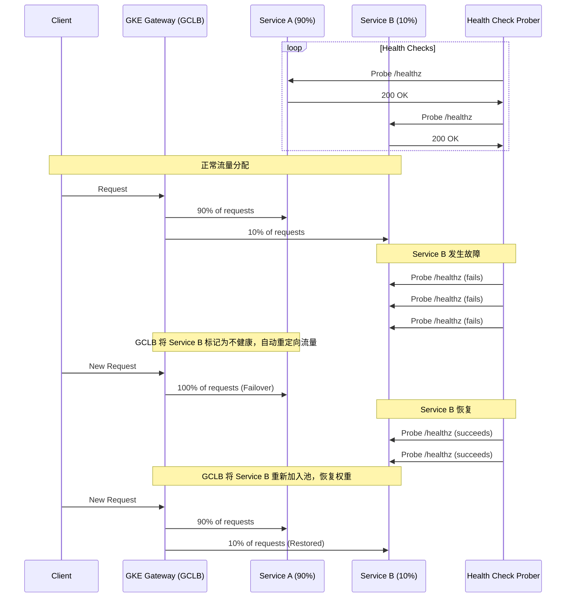

# GKE Gateway: HTTPRoute 流量分配与健康检查核心解析

本文是 `gateway-httproute.md` 的核心摘要，旨在提供一个清晰、简洁的指南，帮助您理解和使用 GKE Gateway 的 `HTTPRoute` 实现按比例的流量分配和自动化的后端故障转移。

---

## 1. 核心机制：从 K8s API 到 Google Cloud 负载均衡器

GKE Gateway 的核心是其控制器，它会将 Kubernetes 的声明式资源 (`Gateway`, `HTTPRoute`, `HealthCheckPolicy` 等) 转换为功能强大的 Google Cloud 全球应用负载均衡器 (GCLB) 的具体组件。

- **`HTTPRoute`** -> **URL 映射 (URL Map)**: 定义流量如何根据主机名或路径进行匹配。
- **`Service`** -> **后端服务 (Backend Service)**: `HTTPRoute` 引用的每个 K8s Service 都会成为一个独立的 GCLB 后端服务。
- **`Pod`** -> **网络端点组 (NEG)**: GKE Gateway 使用容器原生负载均衡，将流量直接从 GCLB 发送到 Pod 的 IP 地址，绕过 `kube-proxy`。

这种架构使得后端的健康检查和故障转移完全由 GCLB 的原生能力驱动，确保了高效和可靠。

---

## 2. 按比例流量分配

通过 `HTTPRoute` 资源的 `spec.rules.backendRefs` 字段，可以轻松实现流���的加权分配。只需为每个后端服务指定一个 `weight` 即可。

### YAML 示例：90/10 金丝雀发布

```yaml
apiVersion: gateway.networking.k8s.io/v1
kind: HTTPRoute
metadata:
  name: store-canary-route
spec:
  parentRefs:
  - name: external-gateway # 引用您的 Gateway
  rules:
  - backendRefs:
    # 稳定版 v1，接收 90% 流量
    - name: store-v1
      port: 8080
      weight: 90
    # 金丝雀版 v2，接收 10% 流量
    - name: store-v2
      port: 8080
      weight: 10
```

---

## 3. 健康检查与自动故障转移

这是 GKE Gateway 最强大的功能之一。当一个后端服务不健康时，其流量会自动、按比例地重新分配给其余的健康后端。

### 关键：必须使用 `HealthCheckPolicy`

与旧的 GKE Ingress 不同，GKE Gateway **不会** 从 Pod 的 `readinessProbe` (就绪探针) 中推断健康检查配置。您**必须**为需要健康检查的后端服务显式创建一个 `HealthCheckPolicy` 资源。

### YAML 示例：自定义健康检查

```yaml
apiVersion: networking.gke.io/v1
kind: HealthCheckPolicy
metadata:
  name: store-v2-health-check
spec:
  # 将此策略附加到 'store-v2' 服务上
  targetRef:
    group: ""
    kind: Service
    name: store-v2
  default:
    config:
      # 健康检查类型
      type: HTTP
      # HTTP 健康检查的详细参数
      httpHealthCheck:
        port: 8081                 # 探测 Pod 的 8081 端口
        requestPath: /healthz      # 探测路径
        checkIntervalSec: 10       # 每 10 秒检查一次
        timeoutSec: 5              # 5 秒超时
        healthyThreshold: 2        # 2 次成功则标记为健康
        unhealthyThreshold: 3      # 3 次失败则标记为不健康
```

### 故障转移流程



---

## 4. 完整部署示例

以下是一个完整的部署清单，包含 Gateway、两个后端服务、一个加权路由以及对应的健康检查策略。

```yaml
# 1. Gateway 资源
apiVersion: gateway.networking.k8s.io/v1
kind: Gateway
metadata:
  name: external-http
spec:
  gatewayClassName: gke-l7-global-external-managed
  listeners:
  - name: http
    protocol: HTTP
    port: 80
    allowedRoutes:
      namespaces:
        from: Same
---
# 2. 后端服务 v1
apiVersion: v1
kind: Service
metadata:
  name: store-v1
spec:
  selector: { app: store, version: v1 }
  ports:
  - port: 8080, targetPort: 8080
---
# 3. 后端服务 v2
apiVersion: v1
kind: Service
metadata:
  name: store-v2
spec:
  selector: { app: store, version: v2 }
  ports:
  - port: 8080, targetPort: 8080
---
# 4. v1 的健康检查策略
apiVersion: networking.gke.io/v1
kind: HealthCheckPolicy
metadata:
  name: store-v1-hc
spec:
  targetRef: { group: "", kind: "Service", name: "store-v1" }
  default:
    config:
      type: HTTP
      httpHealthCheck: { port: 8080, requestPath: / }
---
# 5. v2 的健康检查策略
apiVersion: networking.gke.io/v1
kind: HealthCheckPolicy
metadata:
  name: store-v2-hc
spec:
  targetRef: { group: "", kind: "Service", name: "store-v2" }
  default:
    config:
      type: HTTP
      httpHealthCheck: { port: 8080, requestPath: / }
---
# 6. 加权路由规则
apiVersion: gateway.networking.k8s.io/v1
kind: HTTPRoute
metadata:
  name: store-weighted-route
spec:
  parentRefs:
  - name: external-http
  hostnames: ["store.example.com"]
  rules:
  - backendRefs:
    - name: store-v1
      port: 8080
      weight: 90
    - name: store-v2
      port: 8080
      weight: 10
```

## 总结

- **自动化与可靠性**: GKE Gateway 提供了全自动、可靠的故障转移机制。
- **`HTTPRoute`**: 使用 `weight` 字段进行流量的加权分配。
- **`HealthCheckPolicy`**: **必须**使用此资源来为后端服务定义健康检查，否则可能导致服务中断。
- **云原生集成**: 所有功能都深度集成并由 Google Cloud 负载均衡器提供支持，保证了生产级的性能和可靠性。