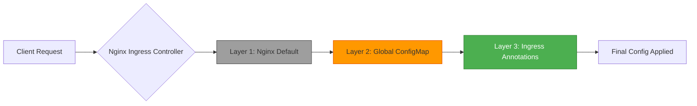
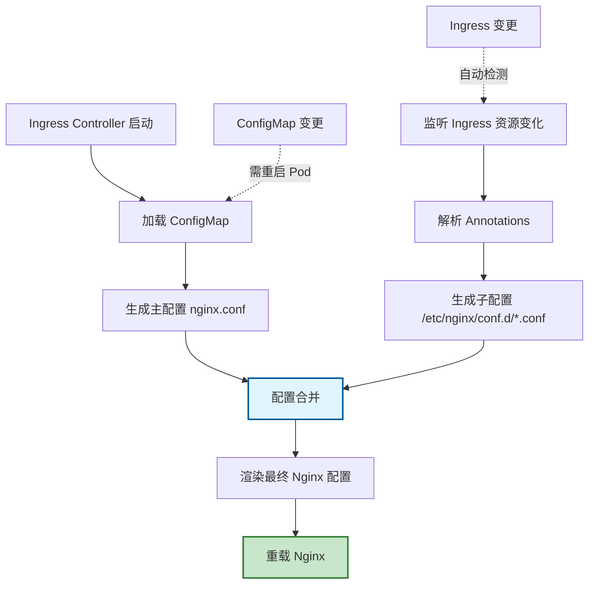
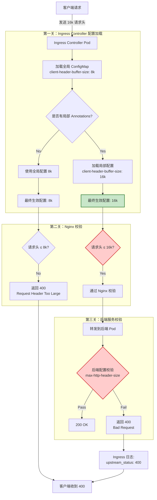
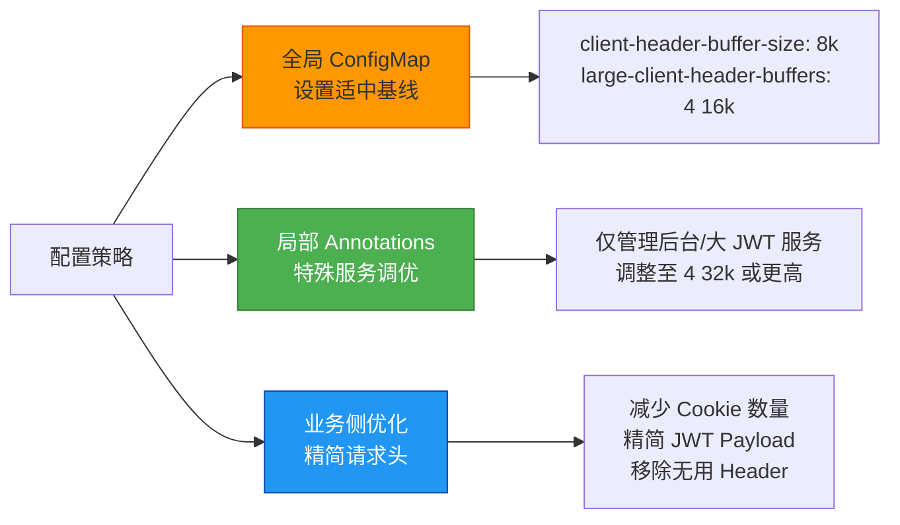
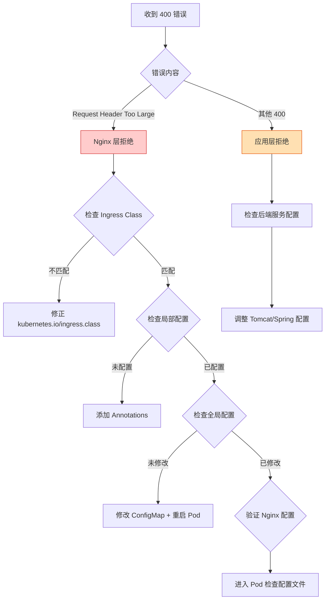
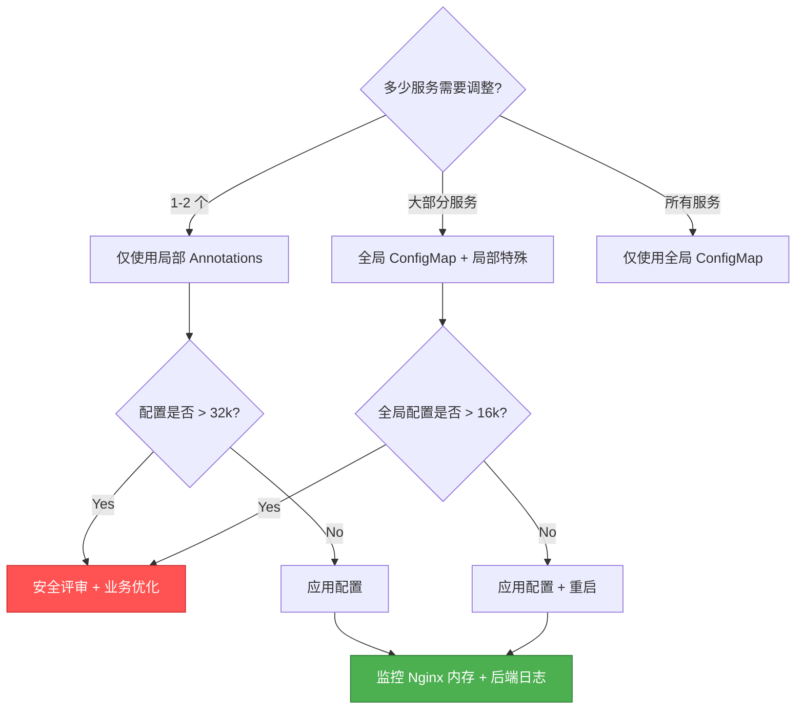

- [Ingress Controller 配置体系深度解析](#ingress-controller-配置体系深度解析)
  - [summary](#summary)
  - [问题分析](#问题分析)
  - [一、核心配置规则](#一核心配置规则)
    - [1.1 三层优先级体系](#11-三层优先级体系)
    - [1.2 配置生效范围对比](#12-配置生效范围对比)
  - [二、配置加载流程](#二配置加载流程)
    - [2.1 完整加载链路](#21-完整加载链路)
    - [2.2 配置文件层级结构](#22-配置文件层级结构)
  - [三、全局配置实战（ConfigMap）](#三全局配置实战configmap)
    - [3.1 配置方法](#31-配置方法)
    - [3.2 配置生效方式](#32-配置生效方式)
    - [3.3 适用场景](#33-适用场景)
  - [四、局部配置实战（Ingress Annotations）](#四局部配置实战ingress-annotations)
    - [4.1 配置方法](#41-配置方法)
    - [4.2 配置生效方式](#42-配置生效方式)
    - [4.3 适用场景](#43-适用场景)
  - [五、请求处理完整流程](#五请求处理完整流程)
    - [5.1 三层校验关卡](#51-三层校验关卡)
    - [5.2 不同关卡拒绝的区别](#52-不同关卡拒绝的区别)
  - [六、生产环境最佳实践](#六生产环境最佳实践)
    - [6.1 推荐配置策略：全局兜底 + 局部精准](#61-推荐配置策略全局兜底--局部精准)
    - [6.2 分阶段配置方案](#62-分阶段配置方案)
    - [6.3 安全风险控制](#63-安全风险控制)
  - [七、故障排查指南](#七故障排查指南)
    - [7.1 排查流程图](#71-排查流程图)
    - [7.2 验证命令清单](#72-验证命令清单)
    - [7.3 常见问题清单](#73-常见问题清单)
  - [八、HTTP/2 特殊配置](#八http2-特殊配置)
    - [8.1 HTTPS + HTTP/2 场景](#81-https--http2-场景)
    - [8.2 协议检测方法](#82-协议检测方法)
  - [总结](#总结)
    - [核心要点](#核心要点)
    - [配置决策树](#配置决策树)

# Ingress Controller 配置体系深度解析
## summary
- 对于单个 API 场景，Ingress Annotations 的局部配置优先级高于 Ingress Controller 的全局 ConfigMap，因此只要在该 Ingress 上调整注解即可生效；但最终是否成功，还取决于后端服务自身的请求限制是否匹配。

## 问题分析

想厘清 **Ingress Controller 全局配置**与**局部配置**之间的关系，核心关注点：

- 优先级与覆盖规则
- 配置生效范围与加载机制
- 实际运维中的配置策略
- 解决 `400 Request Header Too Large` 错误的最佳实践

## 一、核心配置规则

### 1.1 三层优先级体系



**优先级规则（从低到高）**：

1. **Nginx 原生默认值** - 最低优先级
2. **全局 ConfigMap** - 覆盖 Nginx 默认值
3. **Ingress Annotations** - 覆盖全局配置（最高优先级）

### 1.2 配置生效范围对比

|配置层级|作用范围|生效方式|配置位置|
|---|---|---|---|
|Nginx 默认值|所有未配置项|编译时固化|Nginx 源码|
|全局 ConfigMap|该 Controller 管理的所有 Ingress|需重启 Pod|`ingress-nginx` namespace|
|Ingress Annotations|当前 Ingress 的 rules 范围|自动热重载（~10s）|各服务的 Ingress 资源|

## 二、配置加载流程

### 2.1 完整加载链路



**关键机制说明**：

1. **主配置（nginx.conf）** - 从 ConfigMap 渲染，定义全局行为
2. **子配置（conf.d/*.conf）** - 从 Ingress Annotations 渲染，覆盖主配置
3. **热重载触发** - Ingress 变更通过 K8s Watch API 触发，无需重启

### 2.2 配置文件层级结构

```bash
/etc/nginx/
├── nginx.conf                    # 主配置（全局 ConfigMap）
│   ├── http {}
│   │   ├── client_header_buffer_size 8k;        # 全局默认
│   │   ├── large_client_header_buffers 4 16k;   # 全局默认
│   │   └── include /etc/nginx/conf.d/*.conf;    # 包含子配置
│
└── conf.d/
    ├── default-user-service.conf  # 子配置（Ingress Annotations）
    │   └── server {
    │       location /api/user {
    │           client_header_buffer_size 16k;    # 覆盖全局
    │           large_client_header_buffers 4 32k; # 覆盖全局
    │       }
    │   }
```

## 三、全局配置实战（ConfigMap）

### 3.1 配置方法

```yaml
apiVersion: v1
kind: ConfigMap
metadata:
  name: nginx-ingress-controller
  namespace: ingress-nginx
data:
  # 请求头缓冲区配置
  client-header-buffer-size: "8k"           # 常规请求头缓冲（默认 1k/4k）
  large-client-header-buffers: "4 16k"      # 大请求头缓冲（默认 4 8k）
  
  # HTTP/2 协议配置（HTTPS 场景）
  http2-max-field-size: "16k"               # 单个头部字段最大值
  http2-max-header-size: "64k"              # 总头部大小最大值
  
  # 其他推荐配置
  proxy-connect-timeout: "60"               # 上游连接超时
  proxy-read-timeout: "60"                  # 上游读取超时
```

**注意事项**：

- 所有值必须为**字符串格式**（加双引号）
- 参数名使用**连字符**格式（如 `client-header-buffer-size`）
- 单位仅支持 `k`（KB）和 `m`（MB），必须小写

### 3.2 配置生效方式

```bash
# 方式一：编辑 ConfigMap（推荐）
kubectl edit configmap nginx-ingress-controller -n ingress-nginx

# 方式二：应用 YAML 文件
kubectl apply -f nginx-configmap.yaml

# 必须：滚动重启 Controller
kubectl rollout restart deployment ingress-nginx-controller -n ingress-nginx

# 验证重启状态
kubectl rollout status deployment ingress-nginx-controller -n ingress-nginx
```

### 3.3 适用场景

- ✅ **集群大部分服务**都需要提升请求头阈值
- ✅ **新集群初始化**时设置合理的基础配置
- ✅ **统一安全基线**，避免单个服务配置遗漏
- ❌ **仅少数服务**有特殊需求（应使用局部配置）

## 四、局部配置实战（Ingress Annotations）

### 4.1 配置方法

```yaml
apiVersion: networking.k8s.io/v1
kind: Ingress
metadata:
  name: user-service-ingress
  namespace: production
  annotations:
    # 关键：指定 Ingress Class
    kubernetes.io/ingress.class: "nginx"
    
    # 请求头缓冲区配置（覆盖全局）
    nginx.ingress.kubernetes.io/client-header-buffer-size: "16k"
    nginx.ingress.kubernetes.io/large-client-header-buffers: "4 32k"
    
    # HTTP/2 配置（如使用 HTTPS）
    nginx.ingress.kubernetes.io/http2-max-field-size: "32k"
    nginx.ingress.kubernetes.io/http2-max-header-size: "128k"
    
    # 可选：调试日志
    nginx.ingress.kubernetes.io/configuration-snippet: |
      error_log /dev/stdout debug;
spec:
  ingressClassName: nginx  # K8s 1.19+ 推荐方式
  rules:
  - host: user.example.com
    http:
      paths:
      - path: /api/user
        pathType: Prefix
        backend:
          service:
            name: user-service
            port:
              number: 8080
```

**关键要点**：

- Annotations 格式：`nginx.ingress.kubernetes.io/<参数名>: "<值>"`
- 参数名使用**连字符**格式（对应 Nginx 配置项）
- 必须指定正确的 `ingress.class` 或 `ingressClassName`

### 4.2 配置生效方式

```bash
# 应用配置
kubectl apply -f user-service-ingress.yaml

# 无需任何重启！Controller 会自动检测并重载（约 10 秒）

# 验证配置是否加载
kubectl get ingress user-service-ingress -n production -o yaml
```

### 4.3 适用场景

- ✅ **少数服务**有特殊需求（如管理后台、数据大屏）
- ✅ **精准控制**，不影响其他服务
- ✅ **快速调整**，无需重启 Controller
- ✅ **生产环境首选**，风险可控

## 五、请求处理完整流程

### 5.1 三层校验关卡



### 5.2 不同关卡拒绝的区别

|关卡|拒绝位置|HTTP 状态码|响应内容特征|日志特征|
|---|---|---|---|---|
|**Nginx 层**|Ingress Controller|400/413|Nginx 默认 HTML 错误页|Controller 日志显示 400，无 upstream 日志|
|**应用层**|后端 Pod|400|框架错误页（Tomcat/Spring）|Controller 日志显示 `upstream_status: 400`|

**排查方法**：

```bash
# 查看 Ingress 日志
kubectl logs -n ingress-nginx -l app.kubernetes.io/name=ingress-nginx --tail=100 | grep "400"

# 查看后端日志
kubectl logs -n production -l app=user-service --tail=100
```

## 六、生产环境最佳实践

### 6.1 推荐配置策略：全局兜底 + 局部精准



### 6.2 分阶段配置方案

**阶段一：应急处理（1 小时内）**

```yaml
# 仅为报错服务添加局部配置
nginx.ingress.kubernetes.io/client-header-buffer-size: "16k"
nginx.ingress.kubernetes.io/large-client-header-buffers: "4 32k"
```

**阶段二：全局优化（计划窗口）**

```yaml
# 修改 ConfigMap 并滚动重启
data:
  client-header-buffer-size: "8k"
  large-client-header-buffers: "4 16k"
```

**阶段三：根因治理（持续优化）**

- 前端优化：减少 Cookie 数量，合并 LocalStorage
- 后端优化：精简 JWT Claims，启用 Token 压缩
- 架构优化：敏感信息移至 Session，减少客户端存储

### 6.3 安全风险控制

**禁止操作**：

```yaml
# ❌ 错误示例：全局配置过大
data:
  client-header-buffer-size: "128k"
  large-client-header-buffers: "8 256k"  # 总共 2MB！
```

**风险**：

- 内存消耗：每个连接预分配缓冲区，易导致 OOM
- 攻击面：攻击者可构造超大请求头耗尽资源
- 影响范围：全局配置影响所有服务

**正确做法**：

```yaml
# ✅ 全局保守配置
data:
  client-header-buffer-size: "8k"
  large-client-header-buffers: "4 16k"

# ✅ 局部按需调大
annotations:
  nginx.ingress.kubernetes.io/large-client-header-buffers: "4 32k"  # 仅特定服务
```

## 七、故障排查指南

### 7.1 排查流程图



### 7.2 验证命令清单

```bash
# 1. 检查 Ingress Class 配置
kubectl get ingress <name> -n <namespace> -o jsonpath='{.metadata.annotations.kubernetes\.io/ingress\.class}'

# 2. 检查 Ingress Annotations
kubectl get ingress <name> -n <namespace> -o yaml | grep -A 10 annotations

# 3. 检查 ConfigMap 配置
kubectl get cm nginx-ingress-controller -n ingress-nginx -o yaml

# 4. 检查 Controller 日志
kubectl logs -n ingress-nginx -l app.kubernetes.io/name=ingress-nginx --tail=200

# 5. 进入 Pod 验证 Nginx 配置
kubectl exec -it -n ingress-nginx <pod-name> -- bash
cat /etc/nginx/nginx.conf | grep -E "client-header-buffer-size|large-client-header-buffers"
cat /etc/nginx/conf.d/<ingress-config>.conf | grep -E "client-header-buffer-size"

# 6. 测试 Nginx 配置语法
kubectl exec -it -n ingress-nginx <pod-name> -- nginx -t

# 7. 热重载 Nginx（手动触发）
kubectl exec -it -n ingress-nginx <pod-name> -- nginx -s reload
```

### 7.3 常见问题清单

|问题|原因|解决方法|
|---|---|---|
|配置不生效|ConfigMap 修改后未重启 Pod|执行 `kubectl rollout restart`|
|局部配置被忽略|Ingress Class 不匹配|检查 `kubernetes.io/ingress.class`|
|仍然 400|后端服务限制更严格|同步调整后端配置（Tomcat/Spring）|
|配置冲突|多个 Ingress 指向同一服务|确保配置一致或合并 Ingress|
|语法错误|参数格式不正确|检查空格、引号、单位（必须小写 k）|

## 八、HTTP/2 特殊配置

### 8.1 HTTPS + HTTP/2 场景

```yaml
# ConfigMap 全局配置
data:
  # HTTP/1.1 配置
  client-header-buffer-size: "8k"
  large-client-header-buffers: "4 16k"
  
  # HTTP/2 专用配置
  http2-max-field-size: "16k"       # 单个头部字段最大值
  http2-max-header-size: "64k"      # 总头部大小最大值
  http2-max-concurrent-streams: "128"
```

```yaml
# Ingress 局部配置
annotations:
  nginx.ingress.kubernetes.io/http2-max-field-size: "32k"
  nginx.ingress.kubernetes.io/http2-max-header-size: "128k"
```

### 8.2 协议检测方法

```bash
# 检查是否启用 HTTP/2
curl -I --http2 https://user.example.com/api/user
# 响应头包含 "HTTP/2 200" 则已启用

# 检查 TLS 配置
kubectl get ingress <name> -o jsonpath='{.spec.tls}'
```

## 总结

### 核心要点

1. **优先级铁律**：Ingress Annotations > ConfigMap > Nginx 默认值
2. **生效机制**：全局需重启，局部自动热重载
3. **生产策略**：全局适中兜底 + 局部精准调优 + 业务侧根因治理
4. **安全原则**：避免全局过度放宽，精准控制特殊服务
5. **三层校验**：Nginx 层 → 应用层，任一环节都可能拒绝请求

### 配置决策树



---

**参考文档**：

- [Nginx Ingress Controller 官方文档](https://kubernetes.github.io/ingress-nginx/user-guide/nginx-configuration/)
- [ConfigMap 配置参数列表](https://kubernetes.github.io/ingress-nginx/user-guide/nginx-configuration/configmap/)
- [Annotations 配置参数列表](https://kubernetes.github.io/ingress-nginx/user-guide/nginx-configuration/annotations/)