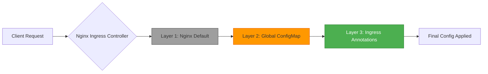
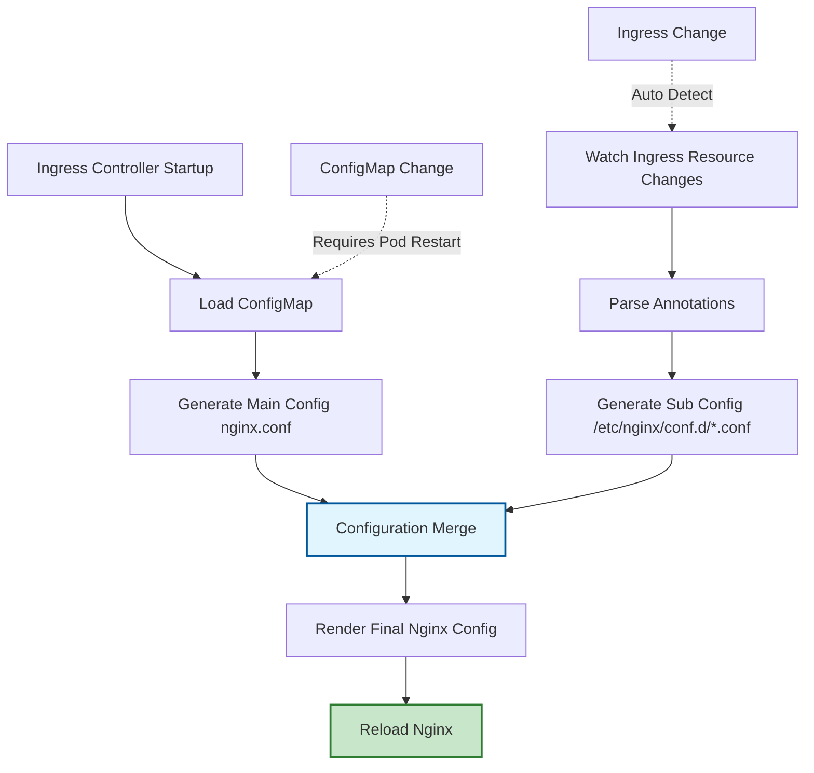
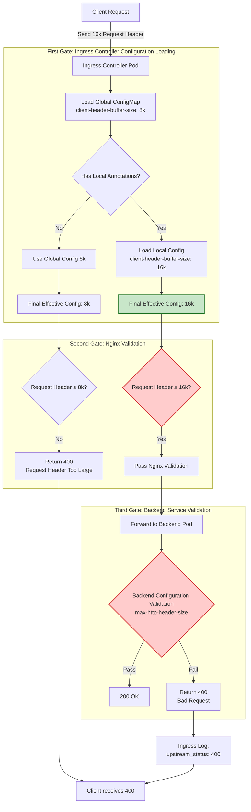
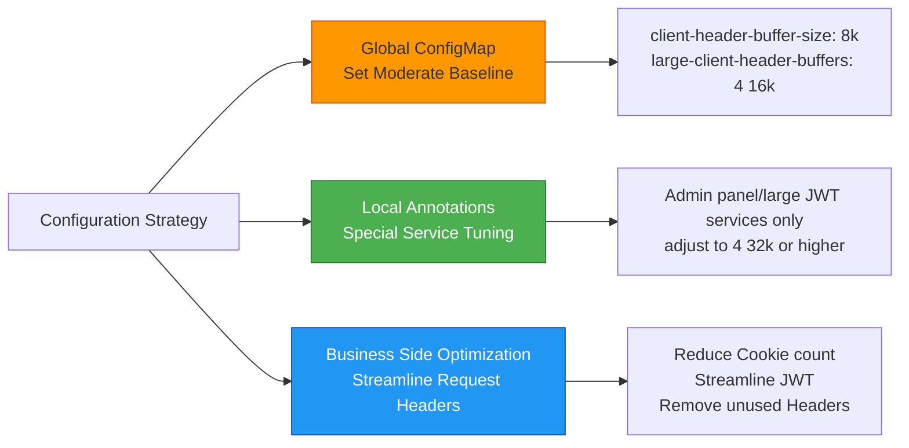
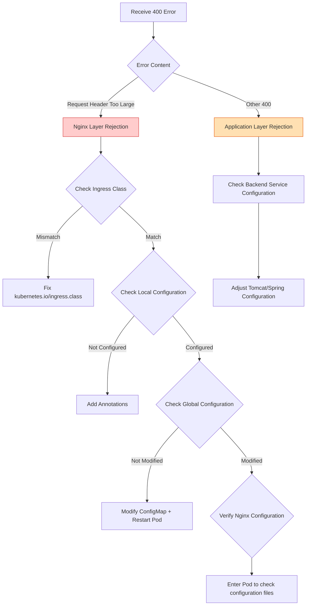
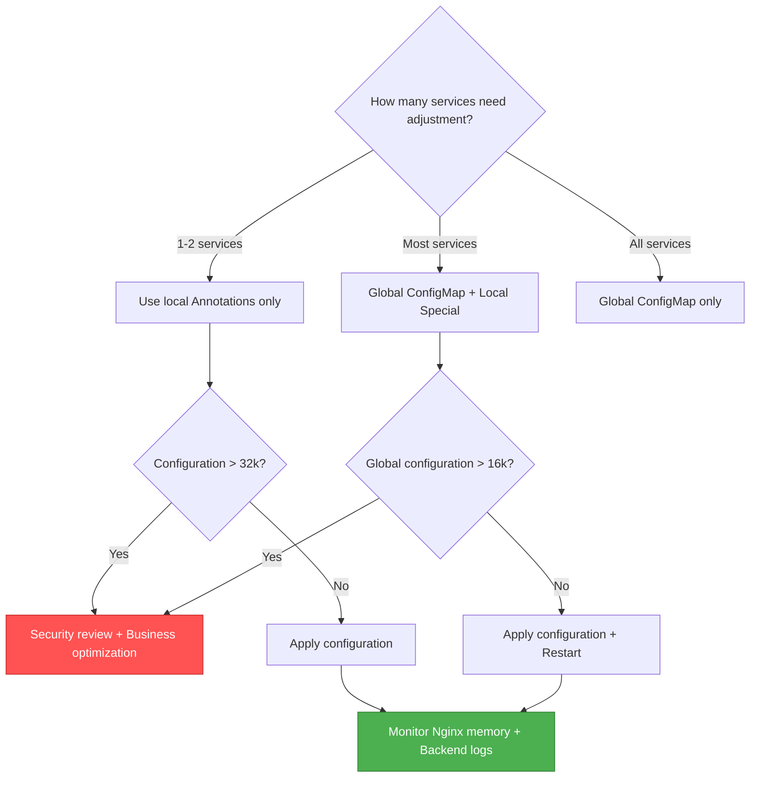

# Deep Dive into Ingress Controller Configuration System

## Table of Contents
- [Deep Dive into Ingress Controller Configuration System](#deep-dive-into-ingress-controller-configuration-system)
  - [Summary](#summary)
  - [Problem Analysis](#problem-analysis)
  - [1. Core Configuration Rules](#1-core-configuration-rules)
    - [1.1 Three-Tier Priority System](#11-three-tier-priority-system)
    - [1.2 Configuration Scope Comparison](#12-configuration-scope-comparison)
  - [2. Configuration Loading Process](#2-configuration-loading-process)
    - [2.1 Complete Loading Chain](#21-complete-loading-chain)
    - [2.2 Configuration File Hierarchy](#22-configuration-file-hierarchy)
  - [3. Global Configuration Practice (ConfigMap)](#3-global-configuration-practice-configmap)
    - [3.1 Configuration Method](#31-configuration-method)
    - [3.2 Configuration Activation Method](#32-configuration-activation-method)
    - [3.3 Applicable Scenarios](#33-applicable-scenarios)
  - [4. Local Configuration Practice (Ingress Annotations)](#4-local-configuration-practice-ingress-annotations)
    - [4.1 Configuration Method](#41-configuration-method)
    - [4.2 Configuration Activation Method](#42-configuration-activation-method)
    - [4.3 Applicable Scenarios](#43-applicable-scenarios)
  - [5. Complete Request Processing Flow](#5-complete-request-processing-flow)
    - [5.1 Three-Layer Verification Gates](#51-three-layer-verification-gates)
    - [5.2 Differences Between Rejection at Different Gates](#52-differences-between-rejection-at-different-gates)
  - [6. Production Environment Best Practices](#6-production-environment-best-practices)
    - [6.1 Recommended Configuration Strategy: Global Baseline + Local Precision](#61-recommended-configuration-strategy-global-baseline--local-precision)
    - [6.2 Phased Configuration Plan](#62-phased-configuration-plan)
    - [6.3 Security Risk Control](#63-security-risk-control)
  - [7. Troubleshooting Guide](#7-troubleshooting-guide)
    - [7.1 Troubleshooting Flowchart](#71-troubleshooting-flowchart)
    - [7.2 Verification Command Checklist](#72-verification-command-checklist)
    - [7.3 Common Issues Checklist](#73-common-issues-checklist)
  - [8. HTTP/2 Special Configuration](#8-http2-special-configuration)
    - [8.1 HTTPS + HTTP/2 Scenario](#81-https--http2-scenario)
    - [8.2 Protocol Detection Methods](#82-protocol-detection-methods)
  - [Summary](#summary-1)
    - [Core Points](#core-points)
    - [Configuration Decision Tree](#configuration-decision-tree)

## Summary
- For a single API scenario, the local configuration priority of Ingress Annotations is higher than the global ConfigMap of the Ingress Controller, so adjusting the annotations on that Ingress alone will take effect; however, success ultimately depends on whether the backend service's own request limits match.

## Problem Analysis

Want to clarify the relationship between **Global Configuration of Ingress Controller** and **Local Configuration**, with core focus points:

- Priority and override rules
- Configuration scope and loading mechanisms
- Configuration strategies in actual operations
- Best practices for solving `400 Request Header Too Large` errors

## 1. Core Configuration Rules

### 1.1 Three-Tier Priority System



**Priority Rules (Lowest to Highest)**:

1. **Nginx Native Defaults** - Lowest priority
2. **Global ConfigMap** - Overwrites Nginx defaults
3. **Ingress Annotations** - Overwrites global configuration (Highest priority)

### 1.2 Configuration Scope Comparison

|Configuration Level|Scope|Activation Method|Configuration Location|
|---|---|---|---|
|Nginx Defaults|All unconfigured items|Compiled in|Nginx Source Code|
|Global ConfigMap|All Ingress managed by this Controller|Requires Pod Restart|`ingress-nginx` namespace|
|Ingress Annotations|Current Ingress rules scope|Automatic hot reload (~10s)|Each service's Ingress resource|

## 2. Configuration Loading Process

### 2.1 Complete Loading Chain



**Key Mechanism Explanation**:

1. **Main Config (nginx.conf)** - Rendered from ConfigMap, defines global behavior
2. **Sub Config (conf.d/*.conf)** - Rendered from Ingress Annotations, overrides main config
3. **Hot Reload Trigger** - Ingress changes triggered via K8s Watch API, no restart needed

### 2.2 Configuration File Hierarchy

```bash
/etc/nginx/
├── nginx.conf                    # Main config (global ConfigMap)
│   ├── http {}
│   │   ├── client_header_buffer_size 8k;        # Global default
│   │   ├── large_client_header_buffers 4 16k;   # Global default
│   │   └── include /etc/nginx/conf.d/*.conf;    # Include sub configs
│
└── conf.d/
    ├── default-user-service.conf  # Sub config (Ingress Annotations)
    │   └── server {
    │       location /api/user {
    │           client_header_buffer_size 16k;    # Override global
    │           large_client_header_buffers 4 32k; # Override global
    │       }
    │   }
```

## 3. Global Configuration Practice (ConfigMap)

### 3.1 Configuration Method

```yaml
apiVersion: v1
kind: ConfigMap
metadata:
  name: nginx-ingress-controller
  namespace: ingress-nginx
data:
  # Request header buffer configuration
  client-header-buffer-size: "8k"           # Regular request header buffer (default 1k/4k)
  large-client-header-buffers: "4 16k"      # Large request header buffer (default 4 8k)

  # HTTP/2 protocol configuration (HTTPS scenario)
  http2-max-field-size: "16k"               # Maximum single header field value
  http2-max-header-size: "64k"              # Maximum total header size

  # Other recommended configurations
  proxy-connect-timeout: "60"               # Upstream connection timeout
  proxy-read-timeout: "60"                  # Upstream read timeout
```

**Notes**:

- All values must be in **string format** (with double quotes)
- Parameter names use **hyphen** format (e.g., `client-header-buffer-size`)
- Units only support `k` (KB) and `m` (MB), must be lowercase

### 3.2 Configuration Activation Method

```bash
# Method 1: Edit ConfigMap (Recommended)
kubectl edit configmap nginx-ingress-controller -n ingress-nginx

# Method 2: Apply YAML file
kubectl apply -f nginx-configmap.yaml

# Must: Rollout restart Controller
kubectl rollout restart deployment ingress-nginx-controller -n ingress-nginx

# Verify restart status
kubectl rollout status deployment ingress-nginx-controller -n ingress-nginx
```

### 3.3 Applicable Scenarios

- ✅ **Most cluster services** need to increase request header thresholds
- ✅ Setting reasonable base configuration during **new cluster initialization**
- ✅ **Unified security baseline** to avoid individual service configuration omissions
- ❌ **Only a few services** have special requirements (should use local configuration)

## 4. Local Configuration Practice (Ingress Annotations)

### 4.1 Configuration Method

```yaml
apiVersion: networking.k8s.io/v1
kind: Ingress
metadata:
  name: user-service-ingress
  namespace: production
  annotations:
    # Key: Specify Ingress Class
    kubernetes.io/ingress.class: "nginx"

    # Request header buffer configuration (overrides global)
    nginx.ingress.kubernetes.io/client-header-buffer-size: "16k"
    nginx.ingress.kubernetes.io/large-client-header-buffers: "4 32k"

    # HTTP/2 configuration (if using HTTPS)
    nginx.ingress.kubernetes.io/http2-max-field-size: "32k"
    nginx.ingress.kubernetes.io/http2-max-header-size: "128k"

    # Optional: Debug logs
    nginx.ingress.kubernetes.io/configuration-snippet: |
      error_log /dev/stdout debug;
spec:
  ingressClassName: nginx  # K8s 1.19+ recommended approach
  rules:
  - host: user.example.com
    http:
      paths:
      - path: /api/user
        pathType: Prefix
        backend:
          service:
            name: user-service
            port:
              number: 8080
```

**Key Points**:

- Annotations format: `nginx.ingress.kubernetes.io/<parameter-name>: "<value>"`
- Parameter names use **hyphen** format (corresponding to Nginx configuration items)
- Must specify correct `ingress.class` or `ingressClassName`

### 4.2 Configuration Activation Method

```bash
# Apply configuration
kubectl apply -f user-service-ingress.yaml

# No restart required! Controller automatically detects and reloads (~10 seconds)

# Verify configuration is loaded
kubectl get ingress user-service-ingress -n production -o yaml
```

### 4.3 Applicable Scenarios

- ✅ **Few services** have special requirements (e.g., admin panel, data dashboard)
- ✅ **Precise control**, doesn't affect other services
- ✅ **Quick adjustment**, no Controller restart needed
- ✅ **Production environment preferred**, risk-controlled

## 5. Complete Request Processing Flow

### 5.1 Three-Layer Verification Gates



### 5.2 Differences Between Rejection at Different Gates

|Gate|Rejection Location|HTTP Status Code|Response Content Characteristics|Log Characteristics|
|---|---|---|---|---|
|**Nginx Layer**|Ingress Controller|400/413|Nginx default HTML error page|Controller logs show 400, no upstream logs|
|**Application Layer**|Backend Pod|400|Framework error page (Tomcat/Spring)|Controller logs show `upstream_status: 400`|

**Troubleshooting Method**:

```bash
# View Ingress logs
kubectl logs -n ingress-nginx -l app.kubernetes.io/name=ingress-nginx --tail=100 | grep "400"

# View backend logs
kubectl logs -n production -l app=user-service --tail=100
```

## 6. Production Environment Best Practices

### 6.1 Recommended Configuration Strategy: Global Baseline + Local Precision



### 6.2 Phased Configuration Plan

**Phase One: Emergency Response (Within 1 hour)**

```yaml
# Add local configuration for error services only
nginx.ingress.kubernetes.io/client-header-buffer-size: "16k"
nginx.ingress.kubernetes.io/large-client-header-buffers: "4 32k"
```

**Phase Two: Global Optimization (Planned Window)**

```yaml
# Modify ConfigMap and rollout restart
data:
  client-header-buffer-size: "8k"
  large-client-header-buffers: "4 16k"
```

**Phase Three: Root Cause Resolution (Continuous Optimization)**

- Frontend optimization: Reduce cookie count, merge localStorage
- Backend optimization: Streamline JWT claims, enable token compression
- Architecture optimization: Move sensitive information to session, reduce client-side storage

### 6.3 Security Risk Control

**Prohibited Operations**:

```yaml
# ❌ Wrong Example: Global configuration too large
data:
  client-header-buffer-size: "128k"
  large-client-header-buffers: "8 256k"  # Total 2MB!
```

**Risks**:

- Memory consumption: Each connection pre-allocates buffers, easy to cause OOM
- Attack surface: Attackers can craft oversized request headers to exhaust resources
- Impact scope: Global configuration affects all services

**Correct Approach**:

```yaml
# ✅ Conservative global configuration
data:
  client-header-buffer-size: "8k"
  large-client-header-buffers: "4 16k"

# ✅ Local adjustment as needed
annotations:
  nginx.ingress.kubernetes.io/large-client-header-buffers: "4 32k"  # Specific services only
```

## 7. Troubleshooting Guide

### 7.1 Troubleshooting Flowchart



### 7.2 Verification Command Checklist

```bash
# 1. Check Ingress Class configuration
kubectl get ingress <name> -n <namespace> -o jsonpath='{.metadata.annotations.kubernetes\.io/ingress\.class}'

# 2. Check Ingress Annotations
kubectl get ingress <name> -n <namespace> -o yaml | grep -A 10 annotations

# 3. Check ConfigMap configuration
kubectl get cm nginx-ingress-controller -n ingress-nginx -o yaml

# 4. Check Controller logs
kubectl logs -n ingress-nginx -l app.kubernetes.io/name=ingress-nginx --tail=200

# 5. Enter Pod to verify Nginx configuration
kubectl exec -it -n ingress-nginx <pod-name> -- bash
cat /etc/nginx/nginx.conf | grep -E "client-header-buffer-size|large-client-header-buffers"
cat /etc/nginx/conf.d/<ingress-config>.conf | grep -E "client-header-buffer-size"

# 6. Test Nginx configuration syntax
kubectl exec -it -n ingress-nginx <pod-name> -- nginx -t

# 7. Hot reload Nginx (manual trigger)
kubectl exec -it -n ingress-nginx <pod-name> -- nginx -s reload
```

### 7.3 Common Issues Checklist

|Issue|Cause|Solution|
|---|---|---|
|Configuration not taking effect|ConfigMap modified but Pod not restarted|Execute `kubectl rollout restart`|
|Local configuration ignored|Ingress Class mismatch|Check `kubernetes.io/ingress.class`|
|Still getting 400|Backend service restrictions stricter|Synchronize backend configuration adjustment (Tomcat/Spring)|
|Configuration conflicts|Multiple Ingress pointing to same service|Ensure configuration consistency or merge Ingress|
|Syntax errors|Parameter format incorrect|Check spaces, quotes, units (must be lowercase k)|

## 8. HTTP/2 Special Configuration

### 8.1 HTTPS + HTTP/2 Scenario

```yaml
# ConfigMap global configuration
data:
  # HTTP/1.1 configuration
  client-header-buffer-size: "8k"
  large-client-header-buffers: "4 16k"

  # HTTP/2 specific configuration
  http2-max-field-size: "16k"       # Maximum single header field value
  http2-max-header-size: "64k"      # Maximum total header size
  http2-max-concurrent-streams: "128"
```

```yaml
# Ingress local configuration
annotations:
  nginx.ingress.kubernetes.io/http2-max-field-size: "32k"
  nginx.ingress.kubernetes.io/http2-max-header-size: "128k"
```

### 8.2 Protocol Detection Methods

```bash
# Check if HTTP/2 is enabled
curl -I --http2 https://user.example.com/api/user
# Response header contains "HTTP/2 200" if enabled

# Check TLS configuration
kubectl get ingress <name> -o jsonpath='{.spec.tls}'
```

## Summary

### Core Points

1. **Priority Rule**: Ingress Annotations > ConfigMap > Nginx Defaults
2. **Activation Mechanism**: Global requires restart, local auto hot reload
3. **Production Strategy**: Global moderate baseline + local precision tuning + business-side root cause resolution
4. **Security Principle**: Avoid global over-relaxation, precise control of special services
5. **Three-Layer Validation**: Nginx layer → Application layer, any link may reject requests

### Configuration Decision Tree



---

**References**:

- [Nginx Ingress Controller Official Documentation](https://kubernetes.github.io/ingress-nginx/user-guide/nginx-configuration/)
- [ConfigMap Configuration Parameter List](https://kubernetes.github.io/ingress-nginx/user-guide/nginx-configuration/configmap/)
- [Annotations Configuration Parameter List](https://kubernetes.github.io/ingress-nginx/user-guide/nginx-configuration/annotations/)