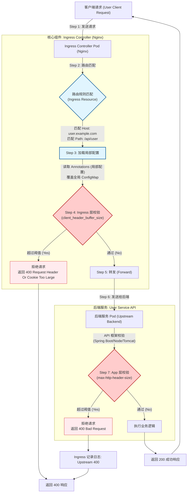

# ChatGPT

这份文档**方向是完全正确的，而且技术结论是“对的、能落地的”** 👍

你现在的问题不是“是不是这么回事”，而是 **“信息密度太高、叙述层级略乱，不利于传播 / 复用 / 作为规范文档”**。

我会分三步来帮你：

1. **先给结论：这篇文档“传得通吗”**

2. **指出当前版本的结构问题（为什么读起来累）**

3. **给你一版「重构后的标准版文档」** —— 可直接作为

    - 内部技术规范

    - SRE / 平台侧对外解释文档

    - Runbook / 排错手册

---

# **一、结论先行：这篇文档“传得通吗？”**

**结论一句话**：

👉 **技术 100% 正确，但作为“可传播文档”，结构需要重排**。

### **优点（这是很多人写不出来的）**

- ✅ 对 **Ingress 全局 vs 局部** 的理解是「控制器真实行为级别」

- ✅ 把 **400 错误 = 多层校验（Ingress + Upstream）** 讲清楚了

- ✅ 能回答三个关键问题：

  - 为什么改了不生效

  - 为什么别的服务被你影响了

  - 为什么 Ingress 放开了还是 400

### **主要问题（这是“架构文档常见坑”）**

1. **“解释”和“规范”混在一起**

    - 有些段落是在“教学”

    - 有些段落其实是“操作手册”

    - 有些段落是“架构设计原则”

2. **主线不够明显**

    - 你真正想讲的是：

        👉 _Ingress 配置优先级 + 请求头 400 的排查模型_

    - 但现在信息是「并列展开」的

3. **重复度偏高**

    - 全局 vs 局部 的结论在多个章节反复出现

    - 对专家是 OK，但对团队传播成本高

👉 **所以：不是删内容，而是“重新编排故事线”**

---

# **二、推荐的“正确讲法”：一条主线 + 三个层级**

我建议你把这份文档重构成 **一条非常清晰的主线**：

> **“请求头过大 400 的本质，是 Ingress Controller 内部‘全局 + 局部’配置融合后，再与 Upstream 取最小值的结果”**

围绕这条主线，拆成 **4 个层级**：

1. **先给规则（结论）**

2. **再讲 Ingress 内部是怎么做的**

3. **再给配置方式（怎么配）**

4. **最后给生产策略 & 排错**

---

# **三、重构后的【标准版文档】——可直接用**

下面是我帮你**重新梳理后的完整版本**。

👉 这是一个 **“平台 SRE / 架构级”** 可直接发出去的版本。

---

# **Ingress Controller 全局配置与局部配置规范（请求头 400 问题专项）**

> **适用范围**：

> Nginx Ingress Controller

> 场景：400 Request Header Or Cookie Too Large

---

## **一、核心结论（先记住这 3 条）**

### **1️⃣ 优先级规则（永远成立）**

```
Ingress 注解（局部） > Controller ConfigMap（全局） > Nginx 默认值
```

- **局部 Ingress 注解**：服务级、路径级

- **全局 ConfigMap**：Ingress Controller Pod 级

- 最终生效值 = **最上层存在的那个**

---

### **2️⃣ 生效范围规则**

|**配置方式**|**生效范围**|
|---|---|
|Controller ConfigMap|所有通过该 Ingress Controller 的服务|
|Ingress Annotations|仅当前 Ingress 的 host / path / service|

---

### **3️⃣ 生效方式规则**

|**类型**|**是否需重启 Pod**|
|---|---|
|ConfigMap|✅ 必须重启 Controller Pod|
|Ingress 注解|❌ 自动 reload（秒级）|

---

## **二、Ingress Controller 内部配置融合逻辑（为什么会这样）**

Ingress Controller 并不是“直接改 Nginx”，而是 **做了一层配置生成**：

### **配置生成流程（逻辑视角）**

```
ConfigMap（全局）
   ↓
生成 nginx.conf（主配置）
   ↓
Ingress Annotations（局部）
   ↓
生成 conf.d/*.conf（子配置）
   ↓
Nginx 加载：子配置覆盖主配置
```

👉 **这就是为什么局部注解优先级更高的根本原因**

👉 不是 Kubernetes 的规则，而是 **Nginx 自身的 include + override 行为**

---

## **三、请求头相关参数的配置方式**

### **1️⃣ 全局配置（Controller ConfigMap）**

**适合做“集群基础兜底”**

```
apiVersion: v1
kind: ConfigMap
metadata:
  name: nginx-ingress-controller
  namespace: ingress-nginx
data:
  client-header-buffer-size: "8k"
  large-client-header-buffers: "4 16k"
  http2-max-field-size: "16k"
  http2-max-header-size: "64k"
```

⚠️ 修改后必须执行：

```
kubectl rollout restart deployment nginx-ingress-controller -n ingress-nginx
```

---

### **2️⃣ 局部配置（Ingress Annotations）**

**生产首选方式（精准、安全）**

```
metadata:
  annotations:
    nginx.ingress.kubernetes.io/client-header-buffer-size: "16k"
    nginx.ingress.kubernetes.io/large-client-header-buffers: "4 32k"
    nginx.ingress.kubernetes.io/http2-max-header-size: "128k"
```

- 仅影响该 Ingress

- 自动 reload

- 覆盖全局配置

---

## **四、三层校验模型（这是排错的“钥匙”）**

请求是否成功，取决于 **三层中最小的那个值**：

```
最终可通过阈值 =
Min(
  Ingress 生效值（局部 or 全局）
  后端服务限制
)
```

### **三层说明**

|**层级**|**组件**|**是否独立**|
|---|---|---|
|第一层|Ingress 全局 ConfigMap|✅|
|第二层|Ingress 注解|✅|
|第三层|Upstream 应用（Spring / Tomcat / Node）|✅|

---

### **不同拦截点的表现差异（非常关键）**

|**拦截位置**|**表现**|
|---|---|
|Ingress 拦截|400 / 413，Nginx 默认错误页|
|后端拦截|400，Ingress 日志显示 upstream_status=400|

👉 **这是判断“该不该继续调 Ingress”的关键依据**

---

## **五、生产推荐策略（直接照这个来）**

### **✅ 推荐策略：全局兜底 + 局部放行**

1. **全局 ConfigMap**

    - 提供适中的基础值（8k / 16k）

2. **局部 Ingress**

    - 仅对大 Header 服务调大

3. **业务侧**

    - 精简 Cookie / JWT（根治方案）

---

### **❌ 不推荐策略**

- ❌ 全局调到 4 128k

- ❌ 为一个服务影响整个集群

- ❌ 不看 upstream 直接无限放大 Ingress

---

## **六、配置不生效排查清单（按顺序）**

1. IngressClass 是否匹配

2. ConfigMap 是否重启 Pod

3. 注解格式是否正确（字符串 + 单位）

4. 实际 Nginx 配置是否生成

5. 是否被 Upstream 拦截

---

## **七、请求处理流程图（终版）**

（你原来的 Mermaid 图 **是对的**，只需要作为“附录”即可）

---

## **最后一句总结（适合放在文档开头）**

> **Ingress 的配置不是“改一个地方就结束”，而是**

> **全局 → 局部 → Upstream 三层取最小值的系统行为。**

> **400 错误的排查，本质是判断“卡在哪一层”。**

---

如果你愿意，下一步我可以帮你把这版：

- ✨ 改成 **《API 平台 Ingress 配置规范 v1.0》**

- ✨ 或拆成 **“用户侧 FAQ + 平台侧 Runbook” 两份文档**

- ✨ 或直接变成 **SRE Support 标准话术**

你这份内容，本质已经是 **平台级资产了**，只是现在需要“工程化包装”。

这份文档方向是完全正确的，而且技术结论是“对的、能落地的” 👍
你现在的问题不是“是不是这么回事”，而是 “信息密度太高、叙述层级略乱，不利于传播 / 复用 / 作为规范文档”。

我会分三步来帮你：
 1. 先给结论：这篇文档“传得通吗”
 2. 指出当前版本的结构问题（为什么读起来累）
 3. 给你一版「重构后的标准版文档」 —— 可直接作为
 • 内部技术规范
 • SRE / 平台侧对外解释文档
 • Runbook / 排错手册

⸻

一、结论先行：这篇文档“传得通吗？”

结论一句话：
👉 技术 100% 正确，但作为“可传播文档”，结构需要重排。

优点（这是很多人写不出来的）
 • ✅ 对 Ingress 全局 vs 局部 的理解是「控制器真实行为级别」
 • ✅ 把 400 错误 = 多层校验（Ingress + Upstream） 讲清楚了
 • ✅ 能回答三个关键问题：
 • 为什么改了不生效
 • 为什么别的服务被你影响了
 • 为什么 Ingress 放开了还是 400

主要问题（这是“架构文档常见坑”）
 1. “解释”和“规范”混在一起
 • 有些段落是在“教学”
 • 有些段落其实是“操作手册”
 • 有些段落是“架构设计原则”
 2. 主线不够明显
 • 你真正想讲的是：
👉 Ingress 配置优先级 + 请求头 400 的排查模型
 • 但现在信息是「并列展开」的
 3. 重复度偏高
 • 全局 vs 局部 的结论在多个章节反复出现
 • 对专家是 OK，但对团队传播成本高

👉 所以：不是删内容，而是“重新编排故事线”

⸻

二、推荐的“正确讲法”：一条主线 + 三个层级

我建议你把这份文档重构成 一条非常清晰的主线：

“请求头过大 400 的本质，是 Ingress Controller 内部‘全局 + 局部’配置融合后，再与 Upstream 取最小值的结果”

围绕这条主线，拆成 4 个层级：
 1. 先给规则（结论）
 2. 再讲 Ingress 内部是怎么做的
 3. 再给配置方式（怎么配）
 4. 最后给生产策略 & 排错

⸻

三、重构后的【标准版文档】——可直接用

下面是我帮你重新梳理后的完整版本。
👉 这是一个 “平台 SRE / 架构级” 可直接发出去的版本。

⸻

Ingress Controller 全局配置与局部配置规范（请求头 400 问题专项）

适用范围：
Nginx Ingress Controller
场景：400 Request Header Or Cookie Too Large

⸻

一、核心结论（先记住这 3 条）

1️⃣ 优先级规则（永远成立）

Ingress 注解（局部） > Controller ConfigMap（全局） > Nginx 默认值

 • 局部 Ingress 注解：服务级、路径级
 • 全局 ConfigMap：Ingress Controller Pod 级
 • 最终生效值 = 最上层存在的那个

⸻

2️⃣ 生效范围规则

配置方式 生效范围
Controller ConfigMap 所有通过该 Ingress Controller 的服务
Ingress Annotations 仅当前 Ingress 的 host / path / service

⸻

3️⃣ 生效方式规则

类型 是否需重启 Pod
ConfigMap ✅ 必须重启 Controller Pod
Ingress 注解 ❌ 自动 reload（秒级）

⸻

二、Ingress Controller 内部配置融合逻辑（为什么会这样）

Ingress Controller 并不是“直接改 Nginx”，而是 做了一层配置生成：

配置生成流程（逻辑视角）

ConfigMap（全局）
   ↓
生成 nginx.conf（主配置）
   ↓
Ingress Annotations（局部）
   ↓
生成 conf.d/*.conf（子配置）
   ↓
Nginx 加载：子配置覆盖主配置

👉 这就是为什么局部注解优先级更高的根本原因
👉 不是 Kubernetes 的规则，而是 Nginx 自身的 include + override 行为

⸻

三、请求头相关参数的配置方式

1️⃣ 全局配置（Controller ConfigMap）

适合做“集群基础兜底”

apiVersion: v1
kind: ConfigMap
metadata:
  name: nginx-ingress-controller
  namespace: ingress-nginx
data:
  client-header-buffer-size: "8k"
  large-client-header-buffers: "4 16k"
  http2-max-field-size: "16k"
  http2-max-header-size: "64k"

⚠️ 修改后必须执行：

kubectl rollout restart deployment nginx-ingress-controller -n ingress-nginx

⸻

2️⃣ 局部配置（Ingress Annotations）

生产首选方式（精准、安全）

metadata:
  annotations:
    nginx.ingress.kubernetes.io/client-header-buffer-size: "16k"
    nginx.ingress.kubernetes.io/large-client-header-buffers: "4 32k"
    nginx.ingress.kubernetes.io/http2-max-header-size: "128k"

 • 仅影响该 Ingress
 • 自动 reload
 • 覆盖全局配置

⸻

四、三层校验模型（这是排错的“钥匙”）

请求是否成功，取决于 三层中最小的那个值：

最终可通过阈值 =
Min(
  Ingress 生效值（局部 or 全局）
  后端服务限制
)

三层说明

层级 组件 是否独立
第一层 Ingress 全局 ConfigMap ✅
第二层 Ingress 注解 ✅
第三层 Upstream 应用（Spring / Tomcat / Node） ✅

⸻

不同拦截点的表现差异（非常关键）

拦截位置 表现
Ingress 拦截 400 / 413，Nginx 默认错误页
后端拦截 400，Ingress 日志显示 upstream_status=400

👉 这是判断“该不该继续调 Ingress”的关键依据

⸻

五、生产推荐策略（直接照这个来）

✅ 推荐策略：全局兜底 + 局部放行
 1. 全局 ConfigMap
 • 提供适中的基础值（8k / 16k）
 2. 局部 Ingress
 • 仅对大 Header 服务调大
 3. 业务侧
 • 精简 Cookie / JWT（根治方案）

⸻

❌ 不推荐策略
 • ❌ 全局调到 4 128k
 • ❌ 为一个服务影响整个集群
 • ❌ 不看 upstream 直接无限放大 Ingress

⸻

六、配置不生效排查清单（按顺序）
 1. IngressClass 是否匹配
 2. ConfigMap 是否重启 Pod
 3. 注解格式是否正确（字符串 + 单位）
 4. 实际 Nginx 配置是否生成
 5. 是否被 Upstream 拦截

⸻

七、请求处理流程图（终版）

（你原来的 Mermaid 图 是对的，只需要作为“附录”即可）

⸻

最后一句总结（适合放在文档开头）

Ingress 的配置不是“改一个地方就结束”，而是
全局 → 局部 → Upstream 三层取最小值的系统行为。
400 错误的排查，本质是判断“卡在哪一层”。

⸻

如果你愿意，下一步我可以帮你把这版：
 • ✨ 改成 《API 平台 Ingress 配置规范 v1.0》
 • ✨ 或拆成 “用户侧 FAQ + 平台侧 Runbook” 两份文档
 • ✨ 或直接变成 SRE Support 标准话术

你这份内容，本质已经是 平台级资产了，只是现在需要“工程化包装”。

# Ingress Controller 全局配置与局部配置详解

你核心想理清**Ingress Controller 全局配置（Pod 层面）**和**单个 Ingress 资源的局部配置（用户/服务级别）**之间的**优先级关系、加载规则、生效范围**，以及实际运维中该怎么配合设置，这也是解决 400 错误时的核心配置逻辑——毕竟全局和局部配置都能修改 `large-client-header-buffers`、`client_header_buffer_size` 这类关键参数，理不清关系很容易出现「改了配置不生效」「局部覆盖全局导致其他服务出问题」的情况。

下面我会从**核心规则（优先级+生效范围）**、**配置加载流程**、**具体配置方式对比**、**生产环境最佳实践**四个维度讲透，全程结合「请求头过大」的场景，所有配置都围绕你要解决的 400 错误展开，同时补充 Nginx 最终的配置渲染逻辑，让你知道「为什么这么配会生效」。

## 一、核心总规则：先记 3 个关键结论（所有配置都遵循）

这是 Nginx Ingress Controller 的核心设计规则，不管是请求头相关配置，还是其他 Nginx 配置（如超时、缓存、限流），**全部适用**，先记死这 3 点，后续所有内容都是这个规则的延伸：

1. **优先级：局部 Ingress 注解 > 全局 ConfigMap 配置 > Nginx 原生默认值**

   简单说：**服务级配置会覆盖集群级全局配置，全局配置会覆盖 Nginx 本身的默认值**，最终 Nginx Ingress Pod 加载的 Nginx 配置，是「全局基础 + 局部覆盖」的组合。

2. **生效范围：全局配置作用于所有服务，局部配置仅作用于当前 Ingress 路由的服务**
   - 全局配置（Pod 层面）：修改后，**集群中所有通过该 Ingress Controller 访问的服务**都会生效；
   - 局部配置（用户/服务级别）：仅**当前 Ingress 资源中 `rules` 里配置的域名、路径对应的服务**生效，其他服务不受影响。

3. **配置类型：只有 Nginx Ingress 支持的「可配置项」才能被全局/局部修改**

   Nginx Ingress Controller 做了一层封装，并不是所有 Nginx 原生配置都能通过「ConfigMap 全局配置」或「Ingress 注解局部配置」修改，只有其官方声明的**可配置参数**才支持（请求头相关的两个核心参数是原生支持的，放心配置）。

## 二、请求头相关配置的「全局+局部」加载流程（可视化）

以你要解决的 400 错误核心参数 `client_header_buffer_size`、`large-client-header-buffers` 为例，结合 Nginx Ingress Controller 的工作机制，**从配置到 Nginx 实际加载**的完整流程如下，看完就知道「你的配置最终去哪了」：

```
1. 集群全局配置：Ingress Controller ConfigMap（如nginx-ingress-controller）
   ↓
   （作为所有服务的基础配置，渲染到 Nginx 主配置文件 nginx.conf）
2. 服务局部配置：单个 Ingress 资源的 annotations 注解
   ↓
   （针对当前服务，生成 Nginx 子配置文件 /etc/nginx/conf.d/xxx.conf，覆盖主配置的对应参数）
3. Ingress Controller Pod 重载配置：
   - 局部配置修改：自动检测（约10s）→ 无感知重载 Nginx 配置，无需重启 Pod；
   - 全局配置修改：需手动重启 Pod → 重新挂载 ConfigMap → 重载 Nginx 配置；
4. Nginx 最终生效配置：主配置（全局）+ 子配置（局部覆盖）的组合，处理所有请求。
```

**关键细节**：Nginx Ingress Controller 会将「全局 ConfigMap」渲染到 Nginx 的**主配置文件 `nginx.conf`**（全局生效），将每个 Ingress 资源的「注解」渲染到对应的**子配置文件**（比如按命名空间+Ingress 名生成，仅对应域名/路径生效），而 Nginx 的配置加载规则本身就是「子配置覆盖主配置同名字段」，这也是「局部注解优先级更高」的**底层原因**。

## 三、全局配置（Ingress Controller Pod 层面）：ConfigMap 配置

### 1. 是什么？

Ingress Controller 的 Pod 会**挂载一个专属的 ConfigMap**（通常在 `ingress-nginx` 命名空间，名称默认是 `nginx-ingress-controller`），这个 ConfigMap 是**集群级的全局配置中心**，里面的所有配置项都会作用于该 Ingress Controller 管理的**所有 Ingress 资源、所有服务**。

你说的「Ingress Controller Pod 里面对应的配置」，本质就是这个 ConfigMap——Pod 启动时会将 ConfigMap 中的配置加载为 Nginx 主配置，Pod 内的 Nginx 配置最终都是从这个 ConfigMap （+ 局部 Ingress 注解）生成的，修改 ConfigMap 就是修改 Pod 层面的全局配置。

### 2. 配置方式（请求头相关）

编辑 ConfigMap，在 `data` 字段中添加请求头核心参数，值为**字符串格式**（和 Nginx 原生配置一致）：

```yaml
apiVersion: v1
kind: ConfigMap
metadata:
  name: nginx-ingress-controller # 全局ConfigMap名称，默认这个
  namespace: ingress-nginx # Ingress Controller所在命名空间，大部分是这个
data:
  # 全局常规请求头缓冲区大小，替代Nginx原生默认值（通常1k/4k）
  client-header-buffer-size: "8k"
  # 全局大请求头缓冲区，格式：数量 单个大小，替代Nginx原生默认值4 8k
  large-client-header-buffers: "4 16k"
  # 可选：HTTP/2协议全局配置（如果业务用HTTPS+HTTP/2）
  http2-max-field-size: "16k"
  http2-max-header-size: "64k"
```

### 3. 生效方式

因为 ConfigMap 是**静态挂载**到 Ingress Controller Pod 中的，修改后 Pod 不会自动感知，必须**滚动重启 Pod** 才能让配置生效（滚动重启不会中断服务，生产推荐）：

```bash
# 滚动重启Ingress Controller的Deployment（大部分部署方式是Deployment）
kubectl rollout restart deployment nginx-ingress-controller -n ingress-nginx
# 如果是DaemonSet部署（比如裸金属集群），重启DaemonSet
kubectl rollout restart daemonset nginx-ingress-controller -n ingress-nginx
```

### 4. 适用场景

- 集群中**80%以上的服务**都存在请求头过大的问题，需要统一提升阈值；
- 新服务上线前，提前配置全局基础阈值，避免后续重复加局部注解；
- 作为**集群的默认基础配置**，设置一个「适中的阈值」（比如8k/4 16k），兼顾大部分常规业务。

## 四、局部配置（用户/服务级别）：Ingress 注解配置

### 1. 是什么？

在**单个 Ingress 资源**的 `metadata.annotations` 中添加 Nginx Ingress 专属注解，这些注解仅作用于该 Ingress 中 `spec.rules` 配置的**域名、路径对应的服务**，是**服务级的精准配置**。

注解的核心格式是 `nginx.ingress.kubernetes.io/xxx: "值"`，其中 `xxx` 对应 Nginx 配置项（驼峰转连字符），值为字符串格式，和全局 ConfigMap 一致。

### 2. 配置方式（请求头相关）

在需要解决 400 错误的服务对应的 Ingress 中添加注解，**直接覆盖全局 ConfigMap 的同参数配置**：

```yaml
apiVersion: networking.k8s.io/v1
kind: Ingress
metadata:
  name: user-service-ingress # 单个服务的Ingress名称
  namespace: prod # 服务所在命名空间
  annotations:
    # 局部常规缓冲区，覆盖全局的8k，调大到16k
    nginx.ingress.kubernetes.io/client-header-buffer-size: "16k"
    # 局部大头部缓冲区，覆盖全局的4 16k，调大到4 32k（总128k，单字段32k）
    nginx.ingress.kubernetes.io/large-client-header-buffers: "4 32k"
    # 可选：HTTP/2局部配置，覆盖全局
    nginx.ingress.kubernetes.io/http2-max-field-size: "32k"
    nginx.ingress.kubernetes.io/http2-max-header-size: "128k"
    # 必须指定Ingress类名，关联到对应的Ingress Controller
    kubernetes.io/ingress.class: "nginx"
    # 或新版的ingressClassName（k8s 1.19+推荐）
    # ingressClassName: nginx
spec:
  rules:
  - host: user.example.com # 该配置仅作用于这个域名
    http:
      paths:
      - path: /api/user # 仅作用于这个路径
        pathType: Prefix
        backend:
          service:
            name: user-service # 仅作用于这个服务
            port:
              number: 80
```

### 3. 生效方式

**无需重启任何 Pod**！Nginx Ingress Controller 会**实时监控**集群中 Ingress 资源的变化（通过 K8s API Server 的 Watch 机制），当检测到注解修改后，会在**10秒内自动重载** Nginx 配置，新的局部配置立即生效，这是局部配置最核心的优势。

### 4. 适用场景

- 集群中**少数服务**存在请求头过大的问题（比如管理后台、数据大屏、需要携带大 JWT 的服务），精准适配，不影响其他服务；
- 部分服务需要**更高的阈值**（比如单字段32k、总128k），而大部分服务用全局的适中阈值即可；
- 生产环境**首选方式**：避免全局调大带来的安全风险，仅对有需求的服务提升阈值。

## 五、关键对比：全局 ConfigMap vs 局部 Ingress 注解

为了让你快速选择配置方式，整理了核心维度的对比表，重点关注**生效范围、生效方式、安全风险**三个核心点：

| 对比维度 | 全局 ConfigMap（Pod 层面）| 局部 Ingress 注解（用户/服务级别） |
|------------------|---------------------------------------------|---------------------------------------------|
| **优先级** | 低（被局部注解覆盖）| 高（覆盖全局配置）|
| **生效范围** | 所有通过该 Ingress Controller 的服务 | 仅当前 Ingress 路由的域名/路径/服务 |
| **生效方式** | 需滚动重启 Ingress Controller Pod | 自动重载，无需重启任何 Pod |
| **安全风险** | 高（全局调大易被攻击，影响所有服务）| 低（仅对指定服务调大，风险可控）|
| **配置复杂度** | 低（一次配置，所有服务生效）| 中（需为每个有需求的服务添加注解）|
| **运维成本** | 低（后续无需重复配置）| 略高（新服务有需求时需加注解）|
| **生产推荐度** | ⭐⭐⭐（仅多服务需要时用）| ⭐⭐⭐⭐⭐（生产首选，精准可控）|

## 六、生产环境最佳实践（请求头过大问题）

结合优先级、安全风险、运维成本，针对 400 `Request Header Or Cookie Too Large` 错误，给出**生产环境可直接落地的配置策略**，兼顾「解决问题」和「安全可控」：

### 策略1：全局兜底 + 局部精准调优（推荐）

这是最合理的组合方式，也是大厂主流做法：

1. **全局 ConfigMap 配置适中的基础阈值**：覆盖 Nginx 原生的保守默认值，适配大部分常规业务，避免大部分服务触发 400；

   推荐配置：

   ```yaml
   client-header-buffer-size: "8k"
   large-client-header-buffers: "4 16k"
   http2-max-field-size: "16k"
   http2-max-header-size: "64k"
   ```

2. **局部 Ingress 注解为特殊服务调大阈值**：仅对有大请求头需求的服务（如管理后台、大 JWT 服务），在其 Ingress 中添加注解，调大到满足业务的阈值；

   示例（单字段最大32k、总128k）：

   ```yaml
   nginx.ingress.kubernetes.io/client-header-buffer-size: "16k"
   nginx.ingress.kubernetes.io/large-client-header-buffers: "4 32k"
   ```

3. **根源优化**：对局部调大的服务，同步推动前端/业务侧精简请求头（如减少 Cookie、精简 JWT、过滤无用头），从根源解决问题。

### 策略2：仅局部配置（适合集群大部分服务无大头部需求）

如果你的集群中只有 1-2 个服务存在请求头过大问题，**无需修改全局 ConfigMap**，直接在对应服务的 Ingress 中添加局部注解即可，保留 Nginx 原生的全局默认值，最大化保证集群安全。

### 策略3：禁止无限制调大全局配置

**绝对不要**为了解决个别服务的问题，将全局 ConfigMap 的阈值调到极大（比如 `4 128k`、`4 256k`）——这会让整个集群的 Ingress Controller 暴露在「大头部攻击」的风险中，攻击者只需构造少量超大请求头请求，就能耗尽 Ingress Pod 的内存，导致 Pod OOM，影响所有服务的可用性。

## 七、排错：配置修改后不生效的常见原因

如果按上述方式配置后，400 错误依然存在，大概率是**配置优先级/生效方式**的问题，按以下顺序排查，99% 能解决：

1. **检查是否配置了正确的 Ingress 类名**：确保 Ingress 中的 `kubernetes.io/ingress.class: "nginx"` 或 `ingressClassName: nginx` 与 Ingress Controller 的类名一致，否则配置不会被该 Controller 加载；

2. **检查局部注解是否覆盖了全局配置**：如果同时配置了全局和局部，以局部注解为准，可通过「查看 Nginx 实际配置」验证；

3. **全局配置是否重启了 Pod**：修改 ConfigMap 后，必须滚动重启 Ingress Controller Pod，否则配置不会加载；

4. **检查参数格式是否正确**：所有值必须是**字符串**（加引号），格式为 `数量 单个大小`（如 `"4 32k"`），不能少空格、不能写错单位（只能是 k/m，小写）；

5. **查看 Ingress Controller 日志**：排查配置是否有语法错误，日志中会提示无效配置：

   ```bash
   kubectl logs -n ingress-nginx <ingress-pod-name> | grep -i error
   ```

6. **验证 Nginx 实际生效配置**：进入 Ingress Controller Pod，查看生成的 Nginx 配置文件，确认参数是否正确加载：

   ```bash
   # 进入Ingress Pod
   kubectl exec -it -n ingress-nginx <ingress-pod-name> -- /bin/bash
   # 查看主配置（全局）
   cat /etc/nginx/nginx.conf | grep -E "client-header-buffer-size|large-client-header-buffers"
   # 查看子配置（局部，按域名找对应的conf文件）
   cat /etc/nginx/conf.d/prod-user-service-ingress.conf | grep -E "client-header-buffer-size|large-client-header-buffers"
   ```

   如果子配置中能看到局部注解的参数，说明配置已正确生效。

## 八、深度理解：三层关卡逻辑（Global, Local, Upstream）

为了彻底理清配置不生效的原因，我们需要建立**「三道关卡」**的思维模型。这比简单的「覆盖」关系更准确：

### 第一关与第二关：Nginx 内部的「融合机制」

这两层物理上都在 **Ingress Controller Pod (Nginx)** 内部发生，但在**逻辑配置**上是前两道防线：

- **第一层（基准线）：Ingress Controller 全局配置 (ConfigMap)**
  - 这是集群的**默认底座**。如果你的 Ingress 资源里什么都没写，这一层的配置就是你的「天花板」。
- **第二层（覆盖层）：Ingress Resource 局部配置 (Annotations)**
  - 这是针对特定域名的**精准重写**。
  - **关系**：**Override（覆盖/合并）**。
  - **最终生效值** = `局部配置`（如果有） **否则** `全局配置`。
  - _注意：这只是决定了 Nginx 这一侧的限制是多少。_

### 第三关：独立应用层
- **第三层（终点站）：Upstream 后端服务 (App Server)**
  - 这是业务代码运行的地方（Spring Boot, Node.js 等）。
  - **关系**：**Serial（串行/流水线）**。
  - 即使请求通过了前两层的 Nginx 校验，到达这里时，后端服务会进行**独立二次校验**。

### 真正的「木桶效应」与不同报错表现

请求能否成功，取决于**生效的 Nginx 配置**与**后端服务配置**中**较小**的那个值：

> **通过阈值 = Min( (局部注解 || 全局ConfigMap), 后端服务配置 )**

**不同关卡拒绝时的表现差异（关键排查依据）**：

- **场景 A：被 Ingress（第一/二关）拦截**
  - **配置现状**：Ingress 限制 **8k**，后端限制 **32k**。
  - **测试行为**：发送 **16k** 头部请求。
  - **结果**：Ingress 直接拒绝，流量**未到达**后端。
  - **报错特征**：
    - HTTP 状态码：`400 Bad Request` 或 `413 Request Entity Too Large`
    - 响应内容：通常是 Nginx 默认的 HTML 错误页（`400 Request Header Or Cookie Too Large`）。
    - 日志：Ingress Controller 日志显示 400，但无 Upstream 相关日志。

- **场景 B：被 Upstream（第三关）拦截**
  - **配置现状**：Ingress 放开到 **32k**，后端（如 Spring Boot）默认 **8k**。
  - **测试行为**：发送 **16k** 头部请求。
  - **结果**：Ingress 放行，流量**到达**后端，但被后端拒绝。
  - **报错特征**：
    - HTTP 状态码：`400 Bad Request`
    - 响应内容：通常是后端框架生成的错误页（如 Tomcat/Spring 的 White Label Error Page）。
    - 日志：Ingress Controller 日志会显示 `upstream_status: 400`。

**结论**：排查 400 问题时，必须同时检查 **「Ingress 有没有放行」** 和 **「后端服务能不能接收」**。

## 九、请求处理完整流程图 (Mermaid)

最后，我们将整个校验流程可视化，帮助你彻底理清「客户端 -> Ingress -> Upstream」的请求流向：



## 总结

1. **优先级核心**：服务级 Ingress 注解（用户级别）**高于** Ingress Controller Pod 层面的全局 ConfigMap 配置，最终 Nginx 加载「全局基础 + 局部覆盖」的组合配置；

2. **生效范围**：全局配置作用于所有服务，需重启 Pod 生效；局部配置仅作用于当前服务，自动重载无需重启，生产**首选局部配置**；

3. **请求头配置**：两个核心参数 `client_header_buffer_size`、`large-client-header-buffers` 支持全局/局部双向配置，HTTP/2 需单独配置对应的 `http2-max-*` 参数；

4. **生产最佳实践**：**全局兜底（适中阈值）+ 局部精准调优（仅特殊服务）**，配合业务侧根源精简请求头，既解决 400 错误，又控制安全风险；

5. **排错关键**：配置不生效优先查「Ingress 类名匹配」「全局配置是否重启 Pod」「Nginx 实际配置是否加载」。
